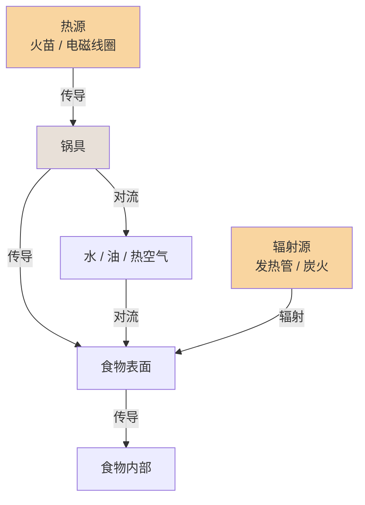

# 第 01 章 · 热是什么

> **核心认知**：烹饪的本质，是用热量让食材的内部结构发生不可逆的变化——蛋白质变性、淀粉糊化。理解「熟」，就是理解热如何进入食物、在什么温度下触发什么变化。

> 章首注释：本章从「生的和熟的到底差在哪」这个傻瓜问题出发，推导出「熟 = 结构变化」的底层认知，并建立传热三方式（传导/对流/辐射）与温度意识。终点：读者能解释任何食材「熟」的本质，看懂火候术语背后的物理。

---

## 引子

电磁炉上那口锅，水已经咕嘟咕嘟烧了十分钟。

造物主盯着锅里的鸡蛋，又看了看手里的手机，犹豫了半天才把蛋放了进去。

「熟没熟啊……」他隔着一米距离探头，好像鸡蛋会突然爆炸。

「你连『熟』是什么都不知道，怎么判断它熟没熟？」老谟的声音从身后飘来，手里拎着一根筷子，在桌沿敲了敲，「先说个最笨的问题——生的和熟的，到底差在哪？」

造物主眨眨眼：「差在……能吃不能吃？」

「能吃不能吃，那是结果。我问的是——鸡蛋还是那个鸡蛋，蛋壳里那些东西，加热前后到底发生了什么变化？」

造物主沉默了片刻，盯着锅里滚动的蛋：「……变硬了？」

「哦？『变硬』，你倒是注意到一个现象。那米饭呢？米是硬的，煮熟了反而变软。都是加热，一个变硬一个变软，你那个『变硬』能解释米饭吗？」

造物主噎住了。

---

## 对话引擎

### 第 1 轮：熟的错觉——「消毒说」

**造物主**：「那我换个答案——熟了就是杀菌消毒！生的有细菌，加热把细菌杀死了，就能吃了！」

**老谟**：「那日料店的生鱼片呢？人家切吧切吧就端上来了，也没见谁吃了进医院。」

**造物主**：「那不一样！生鱼片是……是新鲜，海里的鱼干净！」

**老谟**：「你说『干净』？那我们假设：把一块生肉放到 70°C 的水里，泡到细菌全死为止——拿出来，它还是生的颜色、生的口感。你管它叫熟吗？」

**造物主**：「……不叫。」

**老谟**：「那你的『杀菌说』就露馅了。杀死了所有细菌，它还是生的。说明『熟』这件事，跟细菌没关系，跟别的东西有关。」

> 📐 知识锚点：杀菌只是「安全的副作用」
>
> 【概念深挖】加热确实能杀死绝大多数致病微生物（这是食品安全的基础），但「杀菌」不等于「做熟」。一块 70°C 泡到无菌的肉，蛋白质结构基本没变，吃起来还是生肉的口感。杀菌是热量的「副作用」，不是「熟」的定义。
>
> 【工程实践】这也是为什么「巴氏杀菌奶」不是「熟奶」——巴氏杀菌（72°C/15 秒）杀灭了致病菌，但蛋白质几乎不变性，所以它还是「生」的口感和性质（需要冷藏）。你每天喝的牛奶，正好是这个知识点的日常例子。

### 第 2 轮：熟的本质——「结构变了」

**老谟**：「我换个问法。鸡蛋清，生的的时候什么样？」

**造物主**：「透明、稀的、能流动。」

**老谟**：「熟了什么样？」

**造物主**：「白色、凝固的、不流动了。」

**老谟**：「好，你刚才自己说出了答案。透明变白、稀变凝固——这叫什么？」

**造物主**：「……这叫变了个样？」

**老谟**：「对喽。这不叫消毒，这叫**结构变化**。加热让鸡蛋里那些蛋白质分子，从一种结构变成了另一种结构。鸡蛋还是那个鸡蛋，但内部的世界已经重组了。」

**造物主**：「等一下……那我是不是可以这么说：熟，就是热让食物的结构发生了改变？」

**老谟**：「你先别急着立flag。这个『结构改变』到底改的是什么，我们得再往下挖一层。蛋白质只是其中一种，还有别的分子也在变。」

> 📐 知识锚点：熟的两大主角——蛋白质与淀粉
>
> 【概念深挖】构成食物的四大类分子（水、蛋白质、脂质、碳水化合物）里，加热时变化最剧烈的是两类：
> - **蛋白质**（肉、蛋、鱼、奶里的主力）：加热后**变性**（denature）——原本折叠好的分子链松开、再互相纠缠，于是蛋清从透明液体变成白色固体，肉从嫩变紧实。
> - **淀粉**（米、面、土豆里的主力）：加热后**糊化**（gelatinize）——淀粉颗粒吸水膨胀、破裂，于是生米变熟饭、生面变熟面，从硬变软。
>
> 【历史溯源】「变性」这个词来自拉丁语 denaturare，字面意思就是「改变本性」。19 世纪末，德国化学家开始系统研究蛋白质加热后的变化，发现这种变化**不可逆**——你没法把熟鸡蛋变回生鸡蛋。
>
> 【工程实践】这个「不可逆」是烹饪的基石：一旦蛋白质变性、淀粉糊化，食材就回不去了。这也是为什么「做熟」是一个单向过程——你只能把生的做成熟的，没法把熟的还原成生的。

### 第 3 轮：温度是关键——「不是越热越好」

**造物主**：「那我懂了！熟 = 结构变化，加热就行了，越热熟得越快，对吧？」

**老谟**：「你把『熟』想成什么了？煮面条和煎牛排，都叫加热，为什么做出来天差地别？」

**造物主**：「那当然……因为一个用水一个用油？」

**老谟**：「用油还是用水，这只是表面。我问你：水烧开多少度？」

**造物主**：「100 度？」

**老谟**：「油烧热能到多少度？」

**造物主**：「……两三百度？」

**老谟**：「所以你看，同样是『加热』，温度范围完全不一样。水最多 100°C，油能到 200°C 以上。不同的温度，触发的是**不同的变化**——蛋白质变性在 60-80°C 就开始，而让肉表面变褐变香的『美拉德反应』，要 140°C 以上才启动。」

**造物主**：「所以我之前理解反了——不是『越热越好』，是『不同温度做不同的事』！」

**老谟**：「你总算说到点子上了。记住这句话：**温度决定发生什么变化，时间决定变化进行多少。** 这是全书的钥匙，后面每一章都在用。」

> 📐 知识锚点：烹饪温度阶梯（全书的温度地图）
>
> 【概念深挖】把常见的温度节点排成一条线，你就有了理解所有菜谱的温度坐标系：
> - **60-80°C**：蛋白质开始变性（温泉蛋、低温慢煮肉）
> - **~100°C**：水的沸点（煮、炖、蒸的温度天花板）
> - **120-150°C**：美拉德反应开始（煎、烤产生香气和褐色）
> - **160-190°C**：油炸的温度区间
> - **>200°C**：强煎/强烤（快速上色，但要小心糊）
>
> 【工程实践】菜谱里说的「大火」「小火」「中火」，本质都是对**目标温度区间**的翻译。理解了温度阶梯，你就能反过来看懂：为什么炖肉要用小火（要 100°C 左右的温柔环境让胶原慢慢变明胶，而不是让表面烧焦）。

### 第 4 轮：热怎么进到食物里——传热三方式（上）

**造物主**：「温度的事我大概懂了。但还有一个问题：热是怎么从电磁炉跑到食物里面的？总不可能是电磁炉直接『隔空加热』吧……」

**老谟**：「恭喜你，问到了本章最硬核的部分。热要进到食物里，只有三种途径，我们一个个来。先看最直观的——你把锅放在电磁炉上，锅底贴着火源，热直接传给锅，锅再传给食物。这种靠直接接触传热的，叫什么？」

**造物主**：「……叫贴着传？」

**老谟**：「行吧，通俗点叫『贴着传』，学名叫**传导**（conduction）。平底锅煎蛋，就是传导：火焰/电磁的热先给锅，锅贴着蛋的那一面把热传进去。」

**造物主**：「那煮面呢？面条泡在水里，水是流动的，这个也是传导吗？」

**老谟**：「你说到关键了。水是液体，它会流动——锅底的水被加热后变轻上升，上面的冷水下沉，形成循环。这种靠流体流动来搬热的，叫**对流**（convection）。煮面、炖汤，主要靠对流。」

**造物主**：「那……烤箱烤鸡呢？鸡又不是贴着发热管，中间还隔着一层空气。空气也会流动，是不是也算对流？」

**老谟**：「烤箱里既有对流（热空气循环），还有第三种——**辐射**（radiation）。辐射是热以电磁波的形式直接发射出去，不需要介质，像太阳晒热你、烤面包机的发热管烤面包。烤箱烤鸡，三种传热方式全用上了。」

> 📐 知识锚点：传热三方式一览
>
> 【概念深挖】
> | 方式 | 靠什么传热 | 典型场景 | 特点 |
> |------|-----------|----------|------|
> | 传导 | 直接接触 | 煎蛋、铁板烧 | 慢、只在接触面 |
> | 对流 | 流体（水/空气）流动 | 煮、炖、炸、烤箱热风 | 均匀、整体加热 |
> | 辐射 | 电磁波 | 烤、空气炸锅（微波较特殊，另述） | 快、表面先受热 |
>
> 【工程实践】一个菜往往同时用到多种传热方式。比如电磁炉炒菜：电磁感应在锅底产生热（加热锅），热从锅底传导给食物（传导），同时锅里的油和水分在对流（对流）。理解「哪种方式在主导」，就能解释为什么同一道菜用不同锅具结果不一样。

**读图说明**：这张图是「烹饪传热接力链」。左边火苗/电磁线圈代表热源：热量要么直接传导给锅具（B），再由锅具传给食物表面、深入内部（橙色下行线）；要么通过水、油、热空气的对流循环（蓝色回路）搬运到食物表面；右边辐射源则直接以电磁波把热送到食物表面（橙色辐射线）。看这张图的关键是：**热永远是从外往里走**——食物表面先受热，再往中心传导，这就是为什么「外焦里生」会出现（第 4 章会细讲）。同一道菜往往三条路径同时在工作，只是主次不同。

### 第 5 轮：电磁炉到底怎么加热——「锅自己发热」

**造物主**：「等等，你刚才说电磁炉的时候，说『电磁感应在锅底产生热』？电磁炉不是像电热丝那样发热的吗？」

**老谟**：「好问题。这恰恰是电磁炉和燃气灶最大的区别。燃气灶是明火直接烧锅底（传导）。电磁炉呢？它的面板下面有个线圈，通电后产生变化的磁场，磁场透过面板作用在**锅底**上——锅底的金属在磁场里会产生感应电流（涡流），电流流过金属的电阻就发热了。也就是说：**电磁炉不发热，锅底自己发热。**」

**造物主**：「锅自己发热……所以电磁炉对锅有要求？普通的玻璃锅陶瓷锅行不行？」

**老谟**：「你推断得很对。只有**能被磁铁吸住的锅**（铁锅、铸铁锅，以及 430 等铁素体不锈钢）才能在电磁炉上用。注意：常见的 304 不锈钢没有磁性，放在电磁炉上是不热的——很多新手买了一口『不锈钢锅』回家发现电磁炉用不了，就是栽在这。玻璃、陶瓷、铝锅也不行。你去买锅时包装上写的『适用电磁炉』，就是这个意思。」

**造物主**：「难怪！我之前用电磁炉煮东西总觉得火力跟燃气灶不一样，原来是因为热是锅自己发出来的……」

**老谟**：「对，而且这个特性带来一个重要的实操结论：电磁炉的热**直接、集中地发生在锅底**，锅底到锅边的温差比燃气灶更明显。后面第十章讲炒菜时会用到这个知识。现在，我们把这一轮学到的东西收一下——你总结下，热是怎么一层层进到食物里的？」

**造物主**：「热从源头（火/磁场）进入锅具，锅具再通过接触把热传给食物表面，食物表面再往内部传导……同时液体和气体还会流动搬运热量。整个是一条『接力链』！」

**老谟**：「接力链，这个比喻不错。记住它：**烹饪 = 把热沿着一条接力链，送进食物内部的过程。**」

> 📐 知识锚点：电磁炉原理（宿舍党的核心装备）
>
> 【概念深挖】电磁炉利用**电磁感应**原理：线圈通电产生交变磁场 → 磁场穿过锅底金属 → 金属内部产生感应电流（涡流）→ 电流的电阻热加热锅体。核心结论：**热源在锅底本身，不在面板**。
>
> 【工程实践】电磁炉使用要点：① 必须用含铁的锅（能被磁铁吸住）；② 锅底要平整贴合面板，悬空会导致加热不均；③ 电磁炉的「功率档」不等于「温度档」——它控制的是加热功率，锅里实际温度还取决于锅和食材（第十章会细讲）。

### 第 6 轮：落点——「熟」是热写进食物里的一笔

**老谟**：「好，兜兜转转一大圈，我们回到开头那个问题：生的和熟的，到底差在哪？现在你能给我一个完整的答案了吗？」

**造物主**：「熟，就是热量让食物的结构发生了变化——蛋白质变性、淀粉糊化，这种变化不可逆，所以熟了回不去生的。而热要进到食物里，靠的是传导、对流、辐射这三种方式，从热源接力到食物内部。不同的温度触发不同的变化，温度决定发生什么，时间决定进行多少。」

**老谟**：「不赖。那你自己说，这一章我们到底『发明』了什么？」

**造物主**：「我们发明了……一个看烹饪的眼光：任何一道菜，都从『热量怎么进来、在什么温度下、改变了什么结构』这三个问题去看。菜谱看不懂，是因为缺这双眼睛；有了这双眼睛，菜谱就只是温度和时间的地图。」

**老谟**：「这才像个会做饭的人说的话。下一章，我们就拿这双眼睛去看最普通也最容易被忽略的东西——水。水烧开了明明是最『猛』的状态，为什么炖肉反而要调小火？带着这个问题来。」

---

## 严格化走廊

> 把对话里「摸出来的直觉」落成严格形式。

### 定义（精确表述）

**定义 1（蛋白质变性）**：蛋白质分子因受热（或酸、碱、搅打等外因）而失去其天然空间构象、展开为松散肽链并可能互相交联的过程。变性的本质是**分子结构改变**，不是化学键断裂成小分子。判据：变性后蛋白质溶解度下降、生物学活性丧失（如蛋清凝固、肉收紧）。

**定义 2（淀粉糊化）**：淀粉颗粒在水中受热，吸水膨胀、结晶区破坏、颗粒破裂，淀粉分子分散于水中的过程。判据：体系变粘稠透明（如米汤、面糊）。

**定义 3（传热）**：热量从高温物体传递到低温物体的过程。三种方式：
- **传导**：靠分子/原子直接接触传递动能，无需物质宏观移动。
- **对流**：靠流体（液体或气体）的宏观流动携带热量。
- **辐射**：靠电磁波传递能量，无需介质。

**定义 4（温度）**：物质内部分子平均动能的宏观度量。在烹饪语境中，温度决定了**哪些化学反应/物理变化被触发**。

### 定理（带全前提条件）

**定理 1（变性温度区间）**：在常压、含水的条件下，大多数食物蛋白质在约 60-80°C 开始明显变性。
- 前提：蛋白质处于含水环境（干热下变性温度更高，如干烤坚果）。
- 推论：蛋黄在 65°C 左右开始凝固、蛋白在 70°C 左右凝固，这就是「温泉蛋」与「全熟蛋」的区别所在。

**定理 2（水的沸点上限）**：在标准大气压下，水的沸点为 100°C，且沸腾期间温度保持 100°C 不升。
- 前提：标准大气压（海拔升高则沸点降低，高原煮饭要高压锅补偿）。
- 推论：任何「煮」的技法，其食材内部温度都不可能超过 100°C（除非加压）。这决定了炖、煮类技法的温度天花板。

**定理 3（电磁炉传热链）**：电磁炉烹饪中，热量的传递路径为「线圈磁场 → 锅底涡流发热 → 锅底传导给食物 → 食物内部传导」。
- 前提：锅具为铁磁性金属（能被磁铁吸引）；锅底与面板贴合。
- 推论：电磁炉的「热源」在锅底，锅边与锅底存在温差，翻炒时需考虑锅壁的滞后加热。

### 证明（≥1 个完整可复写证明）

**命题**：为什么「煮熟」是一个不可逆过程，即：为什么熟鸡蛋无法变回生鸡蛋？

**证明**（反证 + 分子机制论证）：

**第 1 步**：设熟鸡蛋能变回生鸡蛋。则必须存在某种方式，把已经变性的蛋白质分子恢复到天然的折叠构象（即「复性」，renaturation）。

**第 2 步**：蛋白质天然构象的维持依赖大量**弱相互作用**（氢键、疏水作用、范德华力）的协同配合。这些弱相互作用的能量都在几个 kcal/mol 量级，远低于共价键（几十到上百 kcal/mol）。

**第 3 步**：加热时，热能首先破坏这些弱相互作用，使分子链展开（变性）。此时，分子链之间暴露出的疏水基团会互相纠缠、形成新的交联（如蛋清中的蛋白质分子互相网住，形成凝胶网络），同时部分氨基酸侧链发生不可逆的化学修饰（如与还原糖的美拉德反应，详见第 3 章《油与褐变》）。

**第 4 步**：要将展开且互相交联的分子链「复原」，需要同时精确恢复成百上千个弱相互作用的原始排布，且必须先打断交联。在常压、可食用的温度范围内，不存在任何手段能定向完成这一操作（变性后的聚集态在能量上处于更稳定的「局部最小」）。

**第 5 步**：由第 1-4 步，假设导致矛盾：要复原必须打断交联并精确重构构象，而这在可食用条件下不可能实现。故假设不成立。

**结论**：煮熟是不可逆的。∎

（这个证明的每一步都只用了「弱相互作用 vs 共价键的能量差」和「聚集体处于能量局部最小」两条事实，读者可对着空白纸复写。）

### 反例/边界（钉死适用域）

**反例 1（「消毒 ≠ 熟」）**：巴氏杀菌奶（72°C/15 秒）杀灭了致病菌，但蛋白质几乎未变性——它仍是「生」的性态（需冷藏、口感似生）。说明「杀菌」与「熟」是两件事，杀菌不是熟的定义。

**反例 2（「熟 ≠ 100°C」）**：低温慢煮（sous vide）在 60°C 长时间加热的牛排，蛋白质已充分变性（是熟的），但从未接近 100°C。说明「熟」由**蛋白质变性的程度**决定，不由「达到某个高温」决定。

**边界情况（海拔）**：在海拔 3000 米处，水的沸点降到约 90°C，普通煮饭可能夹生——因为糊化所需温度（约 90°C 以上才能充分糊化）达不到。此时需要高压锅（加压提高沸点）。这说明「100°C」这个数值依赖大气压这一前提条件。

---

## 知识点总结

### 知识点（本章推出的核心概念）
- **熟 = 结构变化**：热让蛋白质变性、淀粉糊化，变化不可逆。
- **变性**：蛋白质分子失去天然构象（蛋清透明液体 → 白色凝固）。
- **糊化**：淀粉颗粒吸水破裂变软（生米 → 熟饭）。
- **传热三方式**：传导（接触）、对流（流体流动）、辐射（电磁波）。
- **温度阶梯**：60-80°C 蛋白变性、100°C 水沸、140°C+ 美拉德反应。
- **温度决定发生什么，时间决定进行多少**：全书核心钥匙。
- **电磁炉 = 锅底自发热**：靠涡流加热铁磁性锅底，热源在锅底。

### 历史结论（本章涉及的史料）
- 「变性」一词源自拉丁语 denaturare（改变本性），19 世纪末德国化学家系统研究蛋白质加热变化。
- 巴氏杀菌法（Louis Pasteur，1860s）：72°C/15 秒，杀灭致病菌但保持「生」的性态——杀菌 ≠ 做熟。
- 电磁感应加热：法拉第 1831 年发现电磁感应；现代电磁炉（1980s 日本家用化）将其用于厨房。

### 工程实践结论（本章知识在真实厨房里怎么用）
- 煮蛋时间表由变性温度决定：蛋黄 65°C、蛋白 70°C，水开后控制时间即可得到溏心/全熟。
- 电磁炉必须用「能被磁铁吸住」的锅；锅底要平整贴合。
- 炖煮类技法温度上限 100°C，所以「炖不烂」的原因不是火不够大，而是时间不够长（胶原蛋白溶解需要时间，详见第 11 章）。
- 烤箱同时用对流+辐射，所以烤出来的东西表面和内部受热路径不同。

---

## 实操训练场

> 原「计算训练场」的烹饪化。每一题都要动手，做完对答案。

### 实操题 1：煮鸡蛋时间表（验证「温度 × 时间」）

**题干**：造物主要给室友煮鸡蛋。已知：鸡蛋在 65°C 蛋黄开始凝固、70°C 蛋白开始凝固；把常温水中的鸡蛋放入沸水后，鸡蛋内部中心温度以约「每分钟上升 8-10°C（前 5 分钟）」的速率逼近水温；而「溏心蛋」要求蛋黄中心不超过 68°C，「全熟蛋」要求蛋黄中心达到 74°C 以上并保持 2 分钟。

（a）估算从下锅到蛋黄中心达到 68°C 大约需要几分钟？（设初始中心温度 25°C，取升温速率 9°C/分钟）
（b）若造物主想要「蛋白全凝固但蛋黄还是流心」的温泉蛋（约 63-65°C），应该在水开后关火焖（水温逐渐降到 70°C 以下），还是保持沸腾？为什么？
（c）为什么 10 分钟以上煮出的蛋黄发绿（蛋黄表面灰绿色）？这与「时间决定变化进行多少」如何对应？

**完整分步解答：**

（a）升温计算：
- 第 1 步：列出已知量。初始中心温度 T₀ = 25°C，目标温度 T = 68°C，升温速率 v ≈ 9°C/分钟。
- 第 2 步：计算需要的温升。ΔT = 68 − 25 = 43°C。
- 第 3 步：计算时间。t = ΔT ÷ v = 43 ÷ 9 ≈ 4.8 分钟。
- 答：大约 **5 分钟**（这就是「水开下锅煮 5 分钟溏心蛋」说法的来源——鸡蛋中心刚好到 68°C 附近，蛋黄将凝未凝）。

（b）温泉蛋的做法判断：
- 第 1 步：温泉蛋要求蛋黄中心 63-65°C。若保持沸腾，水温恒为 100°C，中心会一直升到 100°C——蛋黄必然全熟，不符合要求。
- 第 2 步：若关火焖，水温从 100°C 缓慢下降，中心温度在升到 65°C 附近后，随着水温下降而停止上升（热平衡），蛋黄保持在「将凝未凝」状态。
- 答：**应该关火焖**。原理正是「温度决定发生什么变化」——用下降的水温把蛋黄钉在 65°C 的窗口里。

（c）蛋黄发绿的解释：
- 第 1 步：长时间加热（>10 分钟）时，蛋黄中蛋白质释放的硫（来自含硫氨基酸）与蛋黄中的铁反应，生成**硫化亚铁**（灰绿色）。
- 第 2 步：这符合「时间决定变化进行多少」——温度没变（都是 100°C），但反应随时间的积累而发生了。
- 答：灰绿色是硫化亚铁，无害但影响卖相；少煮 1-2 分钟即可避免。

**常见错误**：以为「火越大蛋熟得越快越好」，实际水温恒 100°C，火大小只影响水保持沸腾的速度，不影响蛋中心温度——蛋的熟度只由**时间**控制。

### 实操题 2：电磁炉功率 vs 温度（读懂自己的装备）

**题干**：造物主的电磁炉有 5 档功率（400W/800W/1200W/1600W/2000W）。他煮一锅 1.5L 的水，用 2000W 档，从 20°C 烧到沸腾用了约 5 分钟。已知水的比热容 4.2 kJ/(kg·°C)。

（a）这锅水从 20°C 到 100°C 实际吸收了多少热量？（忽略散热）
（b）2000W × 5 分钟 = 600 kJ 的电能，与实际吸收热量对比，效率约是多少？多出来的能量去哪了？
（c）他用同一电磁炉炖汤，水开后把功率从 2000W 调到 800W——汤的温度会下降吗？为什么？

**完整分步解答：**

（a）吸热计算：
- 第 1 步：列出已知量。m = 1.5 kg，c = 4.2 kJ/(kg·°C)，ΔT = 100 − 20 = 80°C。
- 第 2 步：代入公式 Q = mcΔT = 1.5 × 4.2 × 80。
- 第 3 步：计算 Q = 1.5 × 4.2 = 6.3；6.3 × 80 = **504 kJ**。

（b）效率计算：
- 第 1 步：输入电能 W = 2000 W × 300 s = 600 kJ。
- 第 2 步：效率 η = Q ÷ W = 504 ÷ 600 = 84%。
- 第 3 步：另外 16%（约 96 kJ）去哪了？——散失到空气（锅壁散热）、蒸发的水汽带走汽化潜热、面板和锅底传导损耗。
- 答：**约 84%**，损耗主要是散热和蒸发。

（c）火力调小的判断：
- 第 1 步：水沸腾时温度恒为 100°C（定理 2）。只要还在沸腾，水温就是 100°C，不会因为功率降低而下降。
- 第 2 步：800W 档的热量输入刚好能维持沸腾（抵消散热），水保持 100°C 微沸——这正是炖汤想要的「小火慢炖」状态。
- 答：**温度不会下降**（仍为 100°C），只是沸腾的剧烈程度降低。这就是「炖肉要调小火」的物理本质：不是降低温度，而是降低热量输入、减少水分蒸发，让炖煮更温和持久。

**常见错误**：以为「小火 = 温度更低」，实际沸腾状态下温度恒 100°C，小火改变的是**沸腾剧烈程度**和**蒸发速率**。

---

## 向导便签

> **本章干了什么**：把「熟」从「杀菌消毒」的错觉里解放出来，钉死为「热引起的不可逆结构变化」；建立了传热三方式（传导/对流/辐射）与电磁炉「锅底自发热」的认知；拿到全书钥匙——「温度决定发生什么，时间决定进行多少」。
>
> **钉死一句话**：任何菜谱，都是在问三个问题——热从哪来、什么温度、持续多久。
>
> **毒舌收口**：「你以为你在做饭，其实你在做化学。区别只是，化学家管这叫反应，你管这叫翻车。」

## 造物主手记

**我曾踩的坑**：一直以为「熟 = 杀菌」，所以煮东西只要「够热」就行。现在我明白了：如果只追求杀菌，我煮出来的是一锅结构没变的「消毒生肉」；真正让我把饭做熟的，是让蛋白质变性、淀粉糊化的那 60-100°C。

**顿悟时刻**：听懂「温度决定发生什么，时间决定进行多少」的那一刻——原来菜谱里所有「大火」「小火」，翻译过来都是「我要触发哪种变化」。

## 自测题

1. 为什么巴氏杀菌奶不是「熟奶」？（提示：从「杀菌 ≠ 熟」的角度答）——*简答要点：杀菌只杀微生物，蛋白质未变性，结构未变，故仍为「生」的性态。*
2. 煎蛋、煮面、烤箱烤鸡分别主要靠哪种传热方式？——*简答要点：煎蛋=传导；煮面=对流；烤鸡=对流+辐射。*
3. 为什么电磁炉不能用玻璃锅？——*简答要点：玻璃无铁磁性，不能产生涡流，锅底不会自发热。*
4. 高原上煮饭为什么容易夹生？怎么解决？——*简答要点：气压低→沸点低于 90°C→淀粉糊化不充分；用高压锅加压提高沸点。*

## 预告

下一章，我们要对着最普通的水发问：水烧开了不是最猛的状态吗？为什么炖肉反而要调小火？——答案会推翻「火越大越好」这个直觉，也会第一次用上「温度决定发生什么」这把钥匙。
