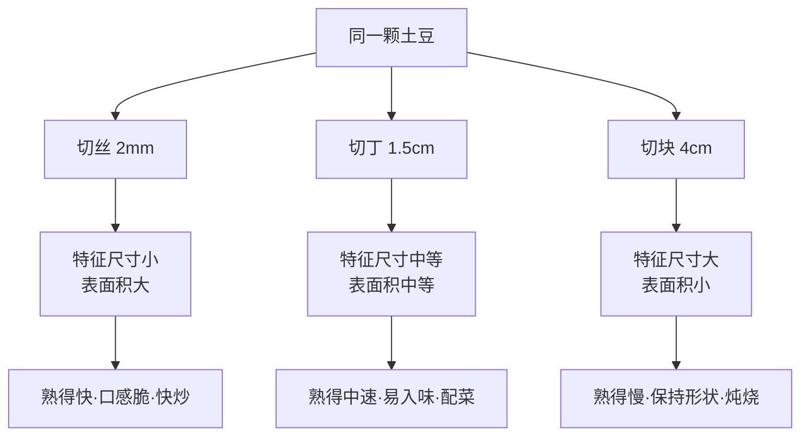

# 第 09 章 · 备料与刀工

> **核心认知**：刀工不是炫技，是对食材做「尺寸管理」。切得均匀，是把「不均匀」这个火候杀手，在下锅之前就解决掉——粗细差 3 倍，熟化时间就差 9 倍。

> 章首注释：本章从「菜谱让我切丝，我随便切切不行吗」这个偷懒问题出发，推出「切配一致性 = 均匀受热」的底层认知，建立特征尺寸与平方律，并把片/丝/丁/块的刀法家族落成「尺寸管理工具箱」。终点：读者能理解菜谱开头那句「切丝」到底在命令他做什么，以及怎么安全地把它做完。

---

## 引子

周六下午，造物主把菜谱摊在案板边上，深吸一口气——这是他头一回严格照着菜谱备菜。第一步：土豆切丝。

他握着刀的手悬在半空，对着菜板上那堆土豆丝犯了难——最粗的一根宽得像手指，最细的一根薄得像纸，还有一根断在了半路。他把切好的丝往盘子里码，结果粗细长短一目了然，像一支站不齐的队伍。

「差不多得了，」他嘀咕，「反正都要下锅，谁还看得见？」

老谟不知道什么时候站在了他身后，用筷子从盘子里挑起最宽的那一根：「我看得见。你猜这根粗的，和这根细的，一起扔进锅里，谁先熟？」

造物主：「……一起熟？不都是土豆吗？」

老谟：「哦。那你是打算吃一半糊的、一半生的。挺有创意的吃法。」

---

## 对话引擎

### 第 1 轮：「随便切切」的自信

**造物主**：「我寻思切丝就是切丝，好吃就行，粗细有什么关系？饭店那是摆盘好看才切得整齐，我又不摆盘。」

**老谟**：「行。那你把这根粗的和这根细的一起丢进开水锅，过 45 秒捞出来，你打算吃哪根？」

**造物主**：「都吃啊。」

**老谟**：「好，那你现在用牙咬一下这根粗的——」（造物主照做）「——生的，硬心。再咬这根细的，面了。你同一道菜里，一半是生的脆的，一半是熟的面糊，你管这叫『好吃就行』？」

**造物主**：「……好像是不太行。」

> 📐 知识锚点：切配一致性 = 均匀受热（承接第 4 章）
>
> 【概念深挖】第 4 章我们立过一条原理：**火候 = 温度 × 时间**。同一口锅里，每一块食材都在被同一种温度加热，但它们能不能「同时熟」，取决于一个被忽略的变量——**每块食材的大小**。粗的土豆丝，中心离表面远，热要走更长的路才能到中心；细的丝，中心离表面近，热几秒钟就到了。所以「切得整不整齐」根本不是卖相问题，是**熟度问题**：粗细不齐 = 同一锅里有多种「熟度进度」在同时进行，你永远找不到一个出锅时刻能同时满足它们。
>
> 【工程实践】这就是为什么所有菜谱开头的第一行永远是「土豆切丝」「胡萝卜切片」。它不是在教你摆盘，是在给你下任务书：**请把这一锅食材的熟度起点，拉到同一条线上。**

### 第 2 轮：谁先熟——老谟逼造物主自己发现矛盾

**老谟**：「那你说，凭什么细的先熟、粗的后熟？热是一样的热。」

**造物主**：「因为……细的它薄？热一下就到中间了？」

**老谟**：「你刚才说『薄』——可你把一根 6 毫米的粗丝和一根 2 毫米的细丝放一起，厚度差了 3 倍。你说这 3 倍厚，能让『热到中心』的时间差几倍？」

**造物主**：「3 倍？」

**老谟**：「你再想想。热在食材里不是匀速赶路的，它是越往里越慢地『渗』。中心要热起来，得等热量一层层往里推进。」

**造物主**：「……那我换个说法：厚 3 倍，可能差 9 倍时间？」

**老谟**：「你居然自己摸出来了。厚 3 倍，中心熟透的时间不是 3 倍，而是 9 倍——这就是后面严格化走廊里要钉死的那条**平方律**。现在先记住结论：**尺寸差一点，熟度差一截。**」

**造物主**：「等等，那我今天这一刀 2 毫米、一刀 6 毫米，等于我亲手给自己做了一道『一盘菜两种熟度』的菜？」

**老谟**：「对，还是你自己做的，刀都还没来得及放下。」

> 📐 知识锚点：【概念深挖】特征尺寸与平方律
>
> 决定一块食物熟得多快的，不是它的体积，而是它的**特征尺寸**——从表面到中心的最短距离。一块 2cm 厚的牛排，热从两面进，特征尺寸约 1cm（厚度的一半）。热在食物里是「扩散」着走的，扩散的物理规律决定了：**中心熟透所需时间 ∝ 特征尺寸的平方**。2mm 的细丝对 6mm 的粗丝，特征尺寸 1:3，熟透时间 1:9。这就是为什么 45 秒后，细的那根已经面了，粗的那根还倔强地生着。
>
> 【工程实践】这条平方律是厨房里「什么时候熟了」的总指挥。切丁、切丝、切片，本质都在做同一件事：把特征尺寸**压小、压均匀**，让「熟」这件事在整锅里同步发生。后面第 12 章煎牛排，你会再次遇见它。

### 第 3 轮：为什么丝比块快——表面积

**造物主**：「那我还是不明白——我切块也能切得均匀啊，为什么菜谱动不动就让我切丝切丁？」

**老谟**：「来，做个对比。同一颗土豆，你切一个 3cm 的大方块，再切一把 2mm 的细丝，放进同一锅开水。你猜哪个先熟？」

**造物主**：「丝呗，它细。」

**老谟**：「细只是一半。你还漏了一个更直观的东西——**表面积**。丝的每一根，四面八方都贴着水；方块呢？同样一克土豆，丝开了十几个窗口接热，块只开一个窗口。谁先熟？」

**造物主**：「……窗口多，进热的口子就多？」

**老谟**：「对喽。热从表面进，那表面大 = 进热的口子多。同样一克土豆，丝的受热面积比块大好几倍。两件事叠在一起：**切小 = 缩短热的路径 + 增大受热面积**。一个管『快』，一个管『多』，同时发生。」

**造物主**：「我服了。那我以前以为的『切丝是为了好看』，错得也太离谱了。」

> 📐 知识锚点：刀法家族 = 尺寸管理工具箱
>
> 【工程实践】中式刀工把食材切出四种基本形态，每一种对应一种「熟度任务」：
> | 形态 | 规格 | 特征尺寸 | 适用场景 |
> |------|------|---------|---------|
> | 片 | 厚 1-3mm | 极小 | 快炒、断生即起（肉片、藕片）|
> | 丝 | 见方 2-3mm | 小 | 快炒保持脆感（土豆丝、青椒丝）|
> | 丁 | 见方 1-1.5cm | 中等 | 快速入味又能保持口感（肉丁、胡萝卜丁）|
> | 块 | 见方 3-5cm | 大 | 久炖成型不散（炖肉、烧土豆）|
>
> 选择依据不是「好看」，而是反问自己：这道菜要它**快速断生**（切丝切片），还是要它**久炖成型**（切块）？刀法是尺寸管理的工具箱，不是艺术展。

> **读图说明**：读这张图看三条「分叉后的终点」。起点是同一颗土豆，往下走三步：第一步是切法（丝/丁/块），第二步是物理参数（特征尺寸和表面积如何变化），第三步是烹饪结果（熟的速度与口感）。关键读法：**每一行第三格的属性，都是由第二格的两个物理量决定的**——丝因为「尺寸小 + 表面大」两个条件同时成立，才得到「快熟」的结果。你不需要背任何一刀的尺寸，只需要记住这一行一行的因果链。

### 第 4 轮：刀法的规矩——「不能乱」

**造物主**：「那为什么丝要 2-3mm，不能 5mm？丁为什么不能 3cm？这也太死板了吧。」

**老谟**：「你问反了。不是『不能』，是『不能乱』——规矩是给人方便的。你设定一个尺寸，然后**全锅都按这个尺寸来**，这就是规矩。至于选多大，看你要的熟度。」

**造物主**：「所以菜谱写『切丝』，其实是一句缩写，全句是『请把所有食材切成同一规格，以保证它们同时熟』？」

**老谟**：「翻译得漂亮。这也是为什么同一道菜里的不同食材，经常要求不同的形态——肉切丝配土豆切丝，因为它们要一起熟；肉切块配土豆切块，因为它们要一起炖。**搭配的本质，是让不同食材的熟度节奏对齐。**」

**造物主**：「那我懂了，菜谱开头那段『备料』，根本不是废话，是整个火候计划的一半！」

> 📐 知识锚点：【实现思考】如果让你来定「均匀」的验收标准……
>
> 假设你要写一条给小白用的验收规则：「这盘土豆丝切得算不算均匀？」你会怎么定？
>
> 一个可行方案：拿起最粗的一根和最细的一根并排看。如果粗的截面直径超过细的 2 倍（比如一根 2mm、一根 5mm），按平方律，熟透时间差了 6 倍以上——这盘菜注定一半糊一半生。所以验收线可以定为「**粗细差不超过 1.5 倍**」。
>
> 为什么这么定：平方律把「看起来差不多的差」放大成了「熟度上的差」。1.5 倍粗细差，熟透时间差约 2.25 倍，还在「同步熟」的容差带里；3 倍粗细差，时间差 9 倍，直接翻车。
>
> 换条路会怎样：有人会说「那我全切一样细不就行了」。可以，但切 1mm 的丝下锅 20 秒就化，口感全无。所以验收标准不是「越细越好」，而是「**在目标口感允许的范围内尽量一致**」——这就是「均匀」的真正含义：均匀不是单点指标，是一对矛盾（细 ↔ 有口感）之间的平衡点。

### 第 5 轮：先保住手——从「怕」到「不怕」

**造物主**：「道理我懂了，可我切得歪七扭八，主要是怕切到手。手一缩，不敢往前送，越缩越切得乱。」

**老谟**：「那你告诉我，你怕切到手，手是怎么放的？」

**造物主**：「手指头平放在食材上，压着。」

**老谟**：「哦，那刀落下来的时候，刀刃是贴着你的指尖过去的？你就这么把手指头贡献给案板？」

**造物主**：「……好像是不太安全。」

**老谟**：「来，你换个方式：手指蜷起来，用指关节顶住刀面，指尖往里扣。让指关节当『挡板』，刀贴着关节走。你试试。」

**造物主**：（试了一下）「诶，这样手指确实安全了，而且食材被关节卡着，也稳了。就是这姿势有点像猫爪子。」

**老谟**：「你倒是挺会起名。行，就叫它**猫爪手**——指关节当轨道，刀背贴关节，切一片，往后挪一格，始终用刀背顶着关节移动。你的手指永远不在刀刃的轨迹上。」

> 📐 知识锚点：【工程实践】安全三件套：握刀、猫爪手、案板规矩
>
> - **持刀**：握刀柄根部，食指与拇指捏住刀身两侧（不是握拳攥柄）。刀是「拎」着切的，能精细控制，而不是「砍」下去的。
> - **猫爪手**：非持刀手五指蜷曲，指关节微微凸起顶住刀身侧面，指尖向内扣。刀背贴着关节滑动，手指只负责「按住 + 后退」。刀刃轨迹与手指分离，是物理上杜绝切手的唯一办法。
> - **案板分类**：至少备两块——一块切生肉（荤板），一块切蔬菜熟食（素板）。生肉上的细菌不能碰蔬菜和直接入口的熟食。木案板吸味、塑料案板好清洗，宿舍按预算选，但「生熟分开」这一条不能省。
> - **洗切顺序**：先洗后切。先洗，把泥土和农残洗在案板外；再切，切口干净不二次污染。

### 第 6 轮：先洗还是先切——被水冲进切口的脏

**造物主**：「我一直是先切再洗，切完冲一冲就下锅。听你这么说，好像反了？」

**老谟**：「你先切再洗，那一刀切下去，刀口上的脏东西和泥土，被水流一冲，往哪跑？」

**造物主**：「往……切口里跑？」

**老谟**：「对。切口是新鲜组织，正是脏东西爱钻的地方。你先切再洗，等于亲手给脏东西开了后门。先洗后切，把『洗』的战线放在食材完整的时候，切口永远是干净的。」

**造物主**：「那菜板呢？我只有一个菜板，切完肉切菜。」

**老谟**：「一个菜板也得排顺序：先切蔬菜，再切生肉，最后切完肉马上热水烫洗。实在只有一个板，就把『生熟分开』升级成『先后分开』——先素后荤，荤后必洗。总原则一句话：**让生肉碰过的表面，永远不要在熟食面前出现。**」

> 📐 知识锚点：【历史溯源】刀工为什么在中餐里被抬到「命根子」的高度
>
> 中餐把刀工列为厨行基本功之首（新东方课程表第一阶段就是刀工），这不是文化虚荣。早期没有破壁机、没有食品加工器，一道菜的口感、熟度、入味深度，全部由「这一刀怎么下」决定。一根丝切得均匀，才能在大火快炒的 30 秒里同时断生——**刀工是火候的前置条件**。西方厨房同样重视切配：蓝带课程里的 julienne（丝，约 1-2mm）、brunoise（小丁，约 3mm），就是对同一件事的西语命名。两地殊途同归——因为物理定律不分菜系。

### 第 7 轮：落点——切配是火候的第一行代码

**老谟**：「好，道理讲完了。现在别用嘴回答我——用你的刀回答。」他把一根新土豆放到造物主面前，「这一章你学没学会，我不听你说，我看你切。」

**造物主**：（把土豆按稳，指节蜷起来，刀背贴着关节，一片一片切下去——粗细匀称，码了一盘。自己低头看了看，最粗的和最细的，差不到一毫米。）

**老谟**：从盘里拈起两根并排的丝，看了两秒。「你现在这盘土豆丝，才是一盘菜——每一根，都等着同时熟。」他把丝放回去，指了指案板，「记住你这几十刀干了什么：**切配，是把火候提前到下锅前就做好的管理。**锅里的火管不住的『不均匀』，你在案板上先替它拆了。」

**造物主**：（看着自己切的那盘丝，忽然有点明白）「会切菜的人，不是手巧，是心里有数。」

**老谟**：「心里有数，说得好。下一章，把这盘心里有数的丝端上电磁炉——去会一会那个被传得神乎其神的『锅气』。你先带一个问题来：为什么饭店的炒菜是『炒』，我的电磁炉一开，怎么炒都变成了『煮』？」

---

## 严格化走廊

> 把对话里「摸出来的直觉」落成严格形式。

### 定义（精确表述）

**定义 1（切配一致性）**：同一道菜中，各份食材在几何规格（截面尺寸、厚度）上的差异处于某一容差范围内，使得它们在相同加热条件下达到目标熟度的时间差可忽略。判据：最粗与最细的特征尺寸之比 ≤ 1.5。

**定义 2（特征尺寸）**：从食材表面到其几何中心的最短距离 L。片状食材取厚度的一半；丝状食材取截面半径（近似圆截面）；块状食材取半边长（正方体）或半径（球体）。

**定义 3（热扩散）**：热量在食材内部通过分子碰撞逐层传导的过程。其速率由热扩散率 D（单位 m²/s）表征；D 越大，热穿透越快。

**定义 4（熟化）**：食材中心温度达到「蛋白质变性 / 淀粉糊化充分」所需的目标温度阈值的过程。在恒定表面温度下，熟化进度由中心温度唯一决定。

### 定理（带全前提条件）

**定理 1（熟化平方律）**：在恒定受热条件下，食材中心达到指定温度所需时间 t 与特征尺寸 L 的平方成正比，即 t ∝ L²/D。
- 前提：① 食材初始温度均匀；② 表面温度恒定（如泡在沸水中）；③ 熟化过程中热扩散率 D 近似不变。
- 推论：特征尺寸 1:3 的丝，中心熟化时间比 1:9。

**定理 2（一致性定理）**：若同锅食材的特征尺寸比 ≤ 1.5，则熟化时间差 ≤ 2.25 倍，处于「同步熟」的容差带内；若特征尺寸比 ≥ 3，则熟化时间差 ≥ 9 倍，必然出现「半生半糊」。
- 前提：所有食材经历相同的表面温度历史（同一口锅、同一火候）。

### 证明（完整可复写证明）

**命题**：为什么「切得越细，中心熟得越快」不是线性关系，而是平方关系？

**证明**（量纲分析 + 热扩散方程）：

**第 1 步**：设食材为厚度 2L 的平板，初始温度均匀 T₀，放入表面温度恒为 T_s 的沸水中。热量在内部的传导由傅里叶定律描述，中心温度 T(x,t) 满足一维热扩散方程：

∂T/∂t = D·∂²T/∂x²

**第 2 步**：对变量做无量纲化。令 τ = t·D/L²，ξ = x/L，θ = (T−T_s)/(T₀−T_s)。代入热扩散方程，可得：

∂θ/∂τ = ∂²θ/∂ξ²

方程中不再出现任何含具体物理量的系数——只有无量纲组合。

**第 3 步**：这意味着「中心达到某一熟度（如 θ = 0.5，即中心温度变化了一半）」对应的无量纲时间 τ* 是一个常数，只由边界条件决定，与 L、D 无关。

**第 4 步**：由 τ* = t·D/L² 反解 t = τ*·L²/D。对同一食材（D 相同）、同一加热条件（τ* 相同），有 t ∝ L²。

**第 5 步**：因此特征尺寸 3 倍（L₂ = 3L₁），熟化时间 t₂ : t₁ = (3L₁)² : L₁² = 9 : 1。∎

（这个证明的每一步只用了「傅里叶热传导方程 + 无量纲化」两件事，读者可对着空白纸复写。）

### 反例/边界（钉死适用域）

**反例 1（「一致 ≠ 越小越好」）**：把土豆全切成一毫米的泥——特征尺寸小到极致，确实「同步熟」了，但口感成了糊糊。平方律只约束「时间」，不约束「口感」；口感是另一条独立约束，由菜谱目标决定。这说明「均匀」的正确目标是在目标口感允许的规格内求一致，而不是无脑求细。

**反例 2（「切得匀，炖肉也不会更快」）**：炖牛腩切成 3cm 块，切得很匀，但小火 2 小时才烂——因为特征尺寸只决定了「热到达中心有多快」，而「中心发生了哪种化学反应」是另一回事。牛腩变烂靠的是胶原水解（第 11 章），需要的是长时间，不是热先到。平方律只管前半段。

**边界情况（D 随熟化变化）**：生肉到熟肉，D 会随脱水、蛋白质凝固而下降约 20-40%，所以「9 倍」是理想值，实际在 6-10 倍之间。数值会偏，方向不变——「尺寸差一点，熟度差一截」这条结论在真实厨房里依然成立，只是倍数打点折扣。

---

## 知识点总结

### 知识点（本章推出的核心概念）
- **切配一致性**：同锅食材规格统一 → 熟度同步。粗细差 3 倍 = 熟化时间差 9 倍。
- **特征尺寸**：表面到中心的最短距离，决定熟化速度。
- **平方律**：t ∝ L²，尺寸差一点，熟度差一截。
- **切小 = 缩短热路径 + 增大受热面积**：丝/片快熟，块耐炖。
- **刀法家族 = 尺寸管理**：片 1-3mm、丝 2-3mm、丁 1-1.5cm、块 3-5cm，按目标熟度与口感选择。
- **猫爪手**：指关节顶刀背作轨道，指尖内扣，刀刃轨迹与手指分离。
- **先洗后切 + 生熟分开**：切口干净、细菌不串门。

### 历史结论（本章涉及的史料）
- 中餐刀工位列厨行基本功之首，因为早期无机器，口感/熟度/入味深度全靠一刀。
- 西方蓝带体系用 julienne（丝）、brunoise（小丁）命名同一件事——物理定律不分菜系。

### 工程实践结论（本章知识在真实厨房里怎么用）
- 菜谱开头的「切丝」「切丁」是熟度任务书，不是摆盘要求。
- 一个菜板：先素后荤，荤后必洗；两个菜板：生熟分开。
- 验收「均匀」的落地方案：最粗/最细 ≤ 1.5 倍，容差带内同步熟。
- 土豆切丝后先泡水洗淀粉再沥干，为快炒做准备（衔接第 10 章）。

---

## 实操训练场

> 原「计算训练场」的烹饪化。每一题都要动手，做完对答案。

### 实操题 1：土豆丝粗细与熟化时间（难度：易→中）

**题干**：造物主切了一盘土豆丝，最细 2mm、最粗 6mm。已知 2mm 细丝在沸水中中心熟透约需 45 秒（表面恒 100°C，土豆熟透 = 淀粉糊化充分）。

（a）按平方律估算 6mm 粗丝中心熟透需要多长时间？
（b）若造物主在 45 秒时把整盘丝一起捞出，这盘菜处于什么状态？哪一部分能吃？
（c）造物主想在同一盘里吃到「都熟且都脆」的丝，他应该怎么切或怎么下锅？

**完整分步解答：**

（a）熟化时间估算：
- 第 1 步：列出已知量。最细丝截面直径 2mm，最粗丝 6mm。丝近似圆截面，特征尺寸取半径：r₁ = 1mm，r₂ = 3mm。
- 第 2 步：由定理 1（平方律），t ∝ L²，故 t₂/t₁ = (r₂/r₁)² = (3/1)² = 9。
- 第 3 步：t₂ = 45s × 9 = 405 秒 ≈ 6.75 分钟。
- 答：6mm 粗丝中心熟透约需 **6.75 分钟**。

（b）出锅状态判断：
- 第 1 步：45 秒时，细丝（t₁ = 45s）刚熟透、保持脆感。
- 第 2 步：粗丝只完成了 45/405 ≈ 11% 的熟化进度，中心仍是生的硬心。
- 答：整盘菜一半是「刚断生的脆丝」，一半是「中心还生着的硬丝」——这就是「半生半糊」的现实版。能吃的只有那部分细丝。

（c）整改方案：
- 第 1 步：要落在容差带内，需 r₂/r₁ ≤ 1.5。已知细丝 2mm，粗丝应 ≤ 3mm。
- 第 2 步：两个实操办法：① 切完一把丝后，把明显偏粗的挑出来补两刀，把全部丝控制在 2-3mm；② 若来不及重切，下锅时先下粗丝 10-15 秒，再下细丝，人为错开熟化进度。
- 答：把全部丝控制在 2-3mm（粗细差 ≤ 1.5 倍），或用「分批下锅」补偿。

**常见错误**：以为「反正都是土豆，多煮一会儿就一样了」——错。多煮 5 分钟，细丝化成糊，粗丝才刚刚熟，永远无法两全。「均匀」必须在下锅之前解决，锅里的时间补偿不了案板上的失误。

### 实操题 2：设计一盘「青椒土豆丝」的备料方案（难度：中→难）

**题干**：造物主要给两个人炒青椒土豆丝。土豆约 300g，青椒 1 个（约 100g）。电磁炉 2000W。已知：2mm 土豆丝在炒锅 200°C+ 快炒约 90 秒断生；青椒丝（2mm）炒 60 秒断生且保持脆绿；土豆表面淀粉遇高温会糊化发粘、粘锅焦糊。

（a）写出完整的备料流程（洗→切→配），给每步明确规格与要点。
（b）若造物主把土豆切成了 4mm 粗丝，按平方律，炒制断生时间应改为多少？这盘菜还适合「90 秒快炒」吗？为什么？
（c）判断：土豆丝切完后，应该先泡水还是直接下锅？泡水在物理上改变了什么？

**完整分步解答：**

（a）备料流程设计：
- 第 1 步 **洗**：土豆带皮刷洗干净（先洗后切原则），青椒去蒂洗净。
- 第 2 步 **切**：土豆去皮切 2mm 细丝，全部丝粗细控制在 2-3mm（切完抽查最粗与最细，差超 1.5 倍则挑出重切）；青椒去籽切 2mm 丝。
- 第 3 步 **配**：土豆丝入清水浸泡 5 分钟，淘洗 2-3 遍至水清（洗去表面游离淀粉，防炒时粘锅），捞出沥干；青椒丝沥干。
- 第 4 步 **摆齐**：两样食材分开放，下锅顺序在脑子里排好：先下土豆丝（90s），后半程下青椒丝（60s）——让两者同时断生。
- 答：完整流程 = 洗（带皮洗）→ 切（统一 2-3mm）→ 配（泡水去淀粉 + 沥干 + 排下锅顺序）。

（b）粗丝的连锁反应：
- 第 1 步：4mm vs 2mm，特征尺寸比 = 2:1。
- 第 2 步：由平方律，断生时间比 = 4:1，即 90s → 360s = 6 分钟。
- 第 3 步：6 分钟「快炒」等于慢熬——土豆表面早已糊化软烂，青椒早已失去脆度颜色发黄。
- 答：不适合快炒。4mm 丝只能改做「凉拌前焯水」或「炖菜」，不再是快炒的规格。**切配规格直接决定了技法能不能成立。**

（c）泡水的物理作用：
- 第 1 步：土豆淀粉颗粒在 60°C+ 开始糊化、发粘，沾在锅底高温区会焦化成「粘锅糊」。
- 第 2 步：泡水 + 淘洗，把表面游离淀粉洗掉，从源头上减少了可糊化的淀粉。
- 第 3 步：泡水还让土豆丝细胞吸水饱满，口感更脆；捞出后必须沥干（控水），否则下锅时多余水分会把「炒」拖向「煮」（第 10 章的主角）。
- 答：应泡水 + 淘洗 + 沥干再下锅。物理上改变了两件事：减少了表面可糊化的淀粉（防粘锅），挤掉了多余水分（为快炒腾出温度空间）。

**常见错误**：切完土豆丝直接下锅，炒出一锅粘糊。根源是两个：没洗淀粉（表面糊化粘锅）+ 没控水（水分把锅温拖到 100°C 以下，炒变煮）。

---

## 向导便签

> **本章干了什么**：把刀工从「卖相学」重定义为「尺寸管理学」——切配一致性 = 均匀受热；特征尺寸平方律解释了为什么粗 3 倍慢 9 倍；建立了猫爪手、先洗后切、生熟分开的安全规范。
>
> **钉死一句话**：切配，是把火候提前到下锅前做好的管理。
>
> **毒舌收口**：「你以为你在切菜，其实你在给热规划路线。路线规划得越细，锅里的意外越少。」

## 造物主手记

**我曾踩的坑**：一直觉得切丝是摆盘的事，粗细不齐反正熟了就能吃。直到那盘一半生一半面的土豆丝——我才承认，不均匀的刀口，是把同一道菜做成了两道。

**顿悟时刻**：听懂「切小 = 缩短热路径 + 增大受热面积」的那一刻。原来「切丝快熟」不是玄学，是几何。

## 自测题

1. 为什么 2mm 的丝比 6mm 的丝熟得快 9 倍？（提示：平方律）——*简答要点：特征尺寸（半径）比 1:3，熟化时间 ∝ L²，故 1:9。*
2. 「切得越细越好」这个说法错在哪？——*简答要点：细到极致口感尽失（糊状）；均匀 ≠ 越小，而是在目标口感允许的规格范围内保持一致。*
3. 猫爪手防止切手的核心原理是什么？——*简答要点：指关节顶住刀背作轨道、指尖内扣，使刀刃的运动轨迹与手指位置物理分离。*
4. 为什么必须先洗后切、菜板要生熟分开？——*简答要点：切口是新鲜组织，先切再洗脏东西会钻入切口；生肉细菌不能接触熟食与素菜表面，必须物理隔离。*

## 预告

下一章，把案板上管理好的尺寸端上电磁炉。那个问题已经在你脑子里冒出来了：为什么饭店的炒菜是「炒」，而我一开电磁炉，怎么炒都变成了「煮」？——答案不在「锅气」的玄学里，在那口锅的温度分布里。
