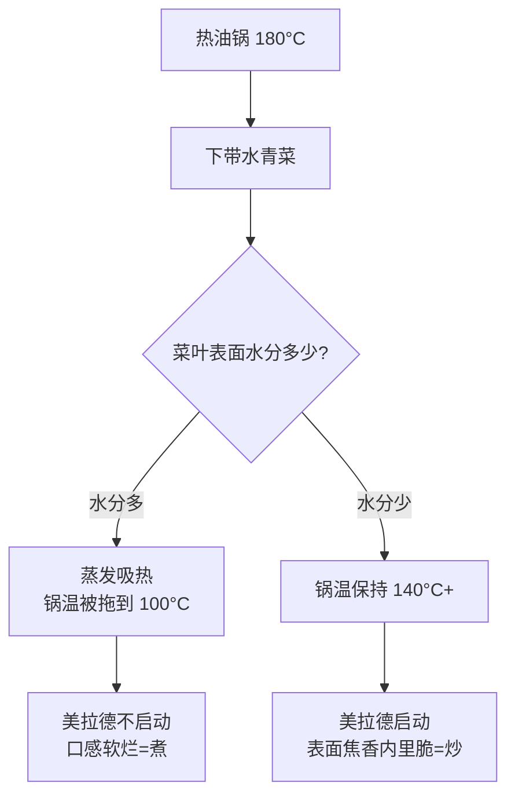

# 第 10 章 · 炒

> **核心认知**：「锅气」不是玄学，是三个物理条件的组合——高温（表面 140°C+）、快（几十秒出锅）、水少（锅温不被蒸发拖垮）。电磁炉给不出玄学，但能给出条件；条件齐了，锅气照样在出租屋里出现。

> 章首注释：本章从「电磁炉炒不出锅气」这个自我设限出发，拆掉「锅气」的神秘外衣，还原为高温、快、水少三个可测量的条件；再直面电磁炉「锅底热锅边凉」的物理局限，推出分批下菜、控水、提前备料、一锅炒次序等对策。终点：读者能在电磁炉+一口锅上，把「炒」从「煮」里抢救出来。

---

## 引子

造物主盯着锅里那一汪水，半天没说话。

他刚把一把洗好的青菜直接倒进了热油锅，然后看着菜叶在锅里「滋啦」了一声，就迅速蔫了下去，锅底积起一层水，油花在水面上漂着，像一锅不伦不类的菜汤。

「为什么饭店的青菜是油亮亮的、脆生生的，我炒出来的就是水汪汪的……我明明开的最大火啊。」

老谟从电磁炉面板上捻起一滴溅出来的水：「你现在有功夫问这个，说明还没意识到问题的严重性——你刚才那一下，已经给你的菜判了死刑，罪名是『水煮青菜』。你有三个选择：接受它，换菜谱，或者，搞清楚锅气到底是什么。」

造物主：「锅气？那不是饭店才有的玄学吗？」

老谟：「玄学？等你说完『玄学』两个字，我再告诉你它由几个零件组成。」

---

## 对话引擎

### 第 1 轮：锅气是「玄学」？

**造物主**：「锅气这东西，我只在饭店见过——大厨把锅往火上一甩，火焰呼地蹿起来，菜在锅里翻几个跟头，那个香啊。咱出租屋这电磁炉，面板平平的，锅也不会飞，肯定没戏。」

**老谟**：「好，那我们把『锅气』拆开。你先别管什么火焰蹿不蹿——你闭上眼，回想饭店那盘炒青菜：它的表面是什么颜色？吃到嘴里是什么口感？」

**造物主**：「表面有点……微微发黄发焦，亮亮的；吃到嘴里是脆的，还带着一股……锅底那种焦香？」

**老谟**：「你刚才说的这三样，就是锅气的全部零件。你描述的是现象，现在把它们翻译成物理量：微微发黄发焦，是什么反应？」

**造物主**：「……美拉德反应？第 3 章讲过，要 140°C 以上才启动。」

**老谟**：「对。脆，说明水分没被煮出来、没长时间泡在水里——水少。那股焦香，是高温瞬间产生的挥发性香气分子。所以你看，锅气三个零件：**高温、快、水少。**你刚才那锅青菜，三个零件一个都没凑齐，你拿什么跟人家比？」

> 📐 知识锚点：【概念深挖】锅气三要素
>
> 锅气（粤语「镬气」，wok hei）拆到底就是三个物理条件：
> - **高温**：食材表面瞬间达到 140°C 以上，触发美拉德反应（褐变、焦香），部分食材还会发生焦糖化。这是「香」的来源。
> - **快**：几十秒内出锅。时间短，食材内部来不及大量脱水，所以脆；同时美拉德只在表面薄薄一层发生，不深入内部烧成焦炭。
> - **水少**：锅里没有大量游离水。水一多，锅温会被蒸发钉死在 100°C，所有高温反应全部熄火。
>
> 【工程实践】把这三个条件摆出来，你就明白了：锅气不是「大灶」的特权，是「三个条件同时成立」的必然结果。电磁炉能给到 2000W、能把锅底加热到 200°C 以上，条件一具备；「快」由你的手速决定；「水少」由你的备料决定。三个条件里，电磁炉唯一给不了的是「替你控制水分」——而这恰恰是唯一一个能靠准备解决的。

### 第 2 轮：为什么水多了就变「煮」

**造物主**：「那我明白了，我最大的问题就是水多。可我也不想水多啊，青菜自己会出水！我总不能把青菜炒成菜干吧？」

**老谟**：「你先回答我一个问题：水烧开是多少度？」

**造物主**：「100 度。第 2 章就说了，水的沸点。」

**老谟**：「那你说，菜叶表面的那层水，在锅里被加热到 100°C 之后，还会继续升温吗？」

**造物主**：「……不会？它就沸腾着，但温度停在 100 度。」

**老谟**：「所以问题来了：你的油锅本来已经烧到 180°C，你一瓢带水的青菜倒进去——菜叶表面的水开始沸腾，蒸发要吸走大量热量，锅温直接被拽回到 100°C 附近。你炒的到底是什么？」

**造物主**：「……我在用 100°C 的水煮青菜，只不过水是青菜自己带的。」

**老谟**：「对。这就是『炒变煮』的全部秘密：**不是你的火不够，是你的菜里带的水，把锅温拖到了 100°C。**火再大也没用，热量全被蒸发吸走了，锅温上不去，美拉德反应根本不启动。」

> 📐 知识锚点：【工程实践】水的汽化潜热 = 温度天花板
>
> 水从液态变成气态，需要吸收大量热量，这个量叫**汽化潜热**，水约为 **2260 kJ/kg**——把 1kg 100°C 的水全部蒸发掉，需要 2260 kJ，这大约是让同样 1kg 水从 0°C 加热到 100°C（约 418 kJ）的 **5.4 倍**。也就是说：蒸发是一件极其「吃热量」的事。
>
> 这一条物理事实决定了炒菜的生死线：只要食材表面有大量游离水，蒸发的吸热就会把表面温度钉在 100°C，直到水分蒸发干净、锅温才可能回升到 140°C+。**锅里有没有「炒」的温度，不看你开了几档火，看锅里还剩多少水。**
>
> 【工程实践】这就是为什么所有炒菜教程都强调「控水」「沥干」「擦干」——这三件事本质是同一个动作：把「煮」的温度天花板，从你锅里拆走。

> **读图说明**：这是一张「炒与煮的分岔路」。起点是 180°C 的热油锅，往下走一步是问「菜叶表面水分多少」，这是整张图唯一的决策点。水分多，走左边——蒸发吸热，锅温被拖到 100°C，结局是「煮」（美拉德不启动）；水分少，走右边——锅温保持 140°C+，结局是「炒」。读这张图的关键：**分岔不在火候，在下锅前那一把水。**你控制水分的能力，就是电磁炉炒菜的上限。

### 第 3 轮：电磁炉的脾气——锅底热，锅边凉

**造物主**：「控水我记下了。可我还有一个问题：就算我把水控干了，电磁炉炒菜还是不如燃气灶香。是不是火还是不够大？」

**老谟**：「你还记得第 1 章我们说过电磁炉是怎么加热的吗？」

**造物主**：「记得，锅底自己发热——线圈产生磁场，锅底金属出涡流，热源就在锅底中心那一块。」

**老谟**：「那你想过没有，热源集中在锅底中心，意味着锅的温度分布是均匀的吗？」

**造物主**：「……不是？锅中间最热，越靠边越凉？」

**老谟**：「对。这就是电磁炉和燃气灶最大的不同：燃气灶的火焰包围着整个锅底，电磁炉只有中心那块是热的。你炒菜的时候，食材在锅里待着不动，中心的食材烫得冒烟，锅边一圈的食材还温吞吞的——你说，这像什么？」

**造物主**：「像……有的在炒，有的在『趴着』。」

**老谟**：「所以大厨为什么要颠勺？你真以为颠勺是耍帅？颠勺的本质，是让食材**轮流通往锅底中心那最热的一块**，让每一块食材都分到高温，又不在高温区停留太久被烤焦。」

**造物主**：「原来颠勺是电磁炉时代的刚需……不对，是炒菜本身的刚需！」

> 📐 知识锚点：【工程实践】电磁炉热场分布与对策
>
> 【概念深挖】电磁炉的加热线圈在面板中心，产生的涡流集中在锅底中央，因此锅的**中心区温度最高、边缘明显偏低**。燃气灶的火焰包围锅底，温差小得多。这个「锅底热、锅边凉」的温度场，是电磁炉炒菜的第一个物理约束。
>
> 【工程实践】三条对策，正好对应三个动作：
> 1. **推炒/颠勺**：让食材不断离开锅边、回到中心热区，轮流受热。没有颠勺的功夫，就用锅铲「推」——从中心往边缘推，再翻回中心，效果等效。
> 2. **选厚底锅**：厚底锅蓄热能力强，锅边凉得慢，相当于把「热点」的面积人为摊大。
> 3. **一次下菜量少**：菜量越大，锅边那批菜越难碰到中心热区。宁可分两批炒，也不要一次性塞满。

### 第 4 轮：给条件——分批下菜与提前备料

**造物主**：「可我一锅要炒三人份的菜，让我分两批，那第一锅炒完，第二锅还没炒，第一锅不就凉了吗？」

**老谟**：「那你有没有想过，为什么你『必须』一次炒完三人份？这个『必须』是哪来的？」

**造物主**：「……省事？」

**老谟**：「省事省的是谁的命？你一次下一锅的菜，锅温被拽下来，你得到一锅『煮菜』；你分两批下，每批都在 140°C 以上的锅温里快速断生，两批炒完拼一盘——你多花了 30 秒，得到了一盘『炒菜』。你自己算这笔账。」

**造物主**：「那如果我的菜根本不需要那么高温呢？比如我炒个西红柿，本来就是要它出水的……」

**老谟**：「问到点子上了。**分批不是死规矩，是『给条件』的思路。**什么时候该分批？当你需要保住锅温的时候。什么时候可以一口气全下？当你的菜本身就需要大量出水的时候（比如炖菜、烧菜）。所以真正的本事是：开炒之前，先想清楚这道菜需要什么温度条件，再决定下菜的方式。」

**造物主**：「所以所谓『会炒菜』，其实是『会看菜需要什么条件，然后给它』？」

> 📐 知识锚点：【实现思考】如果让你给电磁炉设计一份「快炒检查清单」
>
> 假设你要把「炒出锅气」变成一个任何小白都能照做的流程，你会怎么写？给你一份参考答案：
>
> 1. **提前备料**（第 9 章的标准）：所有食材切好、统一规格，调料碗摆好。因为炒菜只有几十秒，锅里没有时间让你找酱油瓶。
> 2. **控水**：青菜沥干或用厨房纸吸一下；腌过的肉沥掉多余汁水。
> 3. **热锅**：空锅先烧到滴水即沸（第 3 章的油温判断），再下油。
> 4. **分批下菜**：预估一次下锅会让锅温跌破临界，就分两批。
> 5. **快翻**：让每块食材都经过锅底热区，同时防止单面烤焦。
> 6. **调味预调**：酱油、糖、淀粉提前兑成碗汁，出锅前一次倒入——缩短「调味」这个环节占用锅的时间。
>
> 为什么这么设计：每一个条目都在为「高温、快、水少」三个条件服务。检查清单不是菜谱，是三个条件的翻译器。
>
> 换条路会怎样：有人会说「那我不控水，用大火猛烧，把水烧干不就行了」。可以，但把水烧干的过程中，食材已经在水里煮了好几分钟——口感全无。给条件的正确姿势是「在温度还没掉下去之前就防住」，而不是「掉下去之后补救」。

### 第 5 轮：一锅炒——肉菜同锅的次序

**造物主**：「那如果要炒一盘『肉 + 菜』的菜，比如青椒肉丝，肉和菜能一起下锅吗？」

**老谟**：「你想想，肉和菜，谁熟得快？」

**造物主**：「肉？不对……肉要炒透才安全，青椒 60 秒就断生了。应该是菜熟得快，肉熟得慢。」

**老谟**：「那如果把肉和菜一起下锅，一起翻 60 秒，结果会怎样？」

**造物主**：「青椒刚好断生，肉还没熟？那不行，得再炒……再炒青椒就过了。」

**老谟**：「所以你先炒哪个？」

**造物主**：「……先炒肉？把肉炒到差不多熟，盛出来，再炒青椒，最后把肉倒回去合一下？」

**老谟**：「你自己把『滑肉—盛出—炒菜—回锅合炒』这套流程推出来了。这叫**一锅炒**：不是所有东西一锅乱炖，而是把熟度节奏不同的食材，错开处理，最后在锅里汇合。」

**造物主**：「那为什么要盛出来？不能先炒肉，肉熟了就推到锅边，再下青椒吗？」

**老谟**：「你可以推，但如果肉丝还留在锅里继续加热，等你炒完青椒，肉已经老了。盛出来是『暂停』——让已经完成任务的食材脱离火场，等队友归位。」

> 📐 知识锚点：【概念深挖】一锅炒的次序逻辑
>
> 炒一盘「肉 + 菜」的标准次序：
> 1. **肉腌制备用**：肉丝用盐、料酒、一点淀粉抓匀（淀粉挂糊，第 7 章讲过脂与乳化；薄薄一层淀粉能在高温下锁住肉的水分，滑肉更嫩）。
> 2. **滑肉**：热油下肉，快速划散，炒到变色断生立即盛出（不要久炒，肉后面还要回锅，现在只是「半程」）。
> 3. **炒菜**：锅里重新补油，下菜快炒到断生。
> 4. **回锅合炒**：肉倒回去，倒入预调的碗汁，大火快速翻匀，几十秒出锅。
>
> 为什么是这个顺序：肉和菜的熟度节奏不同（肉需要更长时程才能熟透且变嫩，菜需要极短时程保持脆感），把它们放在同一个时间轴上，必然有一个要牺牲。一锅炒的本质，是**给不同食材分配不同的「受热时段」**，最后在终点汇合。
>
> 【工程实践】这条逻辑同样适用于「菜 + 菜」（难熟的土豆片先下，易熟的绿叶菜后下）和「蛋 + 菜」（先炒蛋盛出，再炒菜，回锅合炒）。任何时候你发现「一道菜里有两种熟度节奏的食材」，都可以用「先后错开 + 中途盛出」来解决。

### 第 6 轮：炒青菜不水煮方案——实战推导

**造物主**：「行，肉菜顺序我记住了。那回到我最原始的问题：一盘纯青菜，怎么炒才不水汪汪？」

**老谟**：「你现在已经掌握全部零件了，你自己组装一遍。」

**造物主**：「首先，青菜必须控干水——不能洗完了直接下锅。然后，锅要够热，油要够热。然后……」他卡住了，「可是青菜自己还会出水啊，这跟表面带水不是一回事吗？」

**老谟**：「好问题。青菜体内的水，和表面的水，命运一样吗？」

**造物主**：「……表面的水一开始就蒸发，体内的水……被热逼出来？如果锅够热、翻得够快，体内的水还没被逼出来多少，菜就已经断生出锅了？」

**老谟**：「对。这就是关键：**快炒的本质，是在『食材自己出水』之前完成断生。**锅温高 + 翻得快 + 时间短，青菜表面瞬间烫熟封住细胞壁，水分被关在里面，所以脆、所以不出水。反过来，锅温不够、时间太长，细胞壁被慢慢煮破，水全流出来——就成了你那锅菜汤。」

**造物主**：「所以炒青菜的要诀是：控水、热锅热油、大火、快翻、短时间出锅。整个过程要像——赶火车一样？」

**老谟**：「赶火车这个比喻不错。你要是能在青菜『出水』之前把它端上桌，你就是电磁炉上的一把好手。」

> 📐 知识锚点：【历史溯源】炒，为什么是全世界只有中餐才有的技法
>
> 炒是典型的中国发明。学界考证，炒的成熟大致在宋元时期（约 13 世纪）——那是冶金技术和铁锅薄锻工艺进步之后的事。**薄铁锅导热快、能快速升降温，才让「高温 + 快炒」成为可能**；而同样的技术出现前，西方厨房用厚重的锅，只能炖煮煎炸，没有「快炒」这个概念。直到今天，法餐里的 sauté（嫩煎）也只在「中火薄层煎」的层次，达不到中餐炒的激烈程度。
>
> 这条历史很有意思：**锅气不是大灶的专利，是「薄锅 + 高温 + 快手」的组合。**你出租屋里的电磁炉给不了薄铁锅吗？给得了。给不了高温吗？2000W 够。那剩下的变量就只有一个——手快不快。

### 第 7 轮：落点——锅气被从玄学请回了物理

**老谟**：从锅里捞起一片煮蔫了的青菜叶，举到造物主眼前。「回头看看你这一汪水。现在告诉我——你下次再炒这盘菜，怎么让它不是这副样子？」

**造物主**：「锅气 = 高温 + 快 + 水少。三个条件。电磁炉能给出前两个，第三个——水少——得靠我自己在备料和手法上控制。电磁炉给不出玄学，但它给得出条件；条件凑齐，出租屋里也能有锅气。」

**老谟**：「那如果让你给『炒』下一个定义，你会怎么说？」

**造物主**：「炒，就是在食材自己出水之前，用高温和快翻把它断生，把水分和脆感都锁在里面。」

**老谟**：「你自己掂量掂量这句话——这已经是一份能指导你炒任何菜的说明书了。下一章，我们去拜访那个『火越大越好』的另一座大山：炖肉。带一个问题来：为什么炖肉要小火？明明水烧开不是越猛越好吗？」

---

## 严格化走廊

> 把对话里「摸出来的直觉」落成严格形式。

### 定义（精确表述）

**定义 1（炒）**：以高温（食材表面 ≥140°C）、短时间（通常 ≤ 数分钟）、少游离水为条件，通过快速翻动使食材在「自身大量出水之前」断生的烹饪技法。

**定义 2（锅气）**：在炒制中，食材表面瞬间高温触发美拉德/焦糖化反应并产生挥发性香气分子所呈现的综合现象。成立条件是三者的同时满足：表面温度 ≥140°C、受热时间短、锅底无大量游离水。

**定义 3（汽化潜热）**：单位质量物质在沸点由液态完全变为气态所需吸收的热量。水的汽化潜热约为 2260 kJ/kg，是「加热到沸点所需热量（约 418 kJ/kg）的 5.4 倍」。

**定义 4（快炒）**：从下锅到出锅的时间被压缩到小于「食材自身水分大量渗出所需时间」的炒制方式。判据：食材在出水前已完成断生。

### 定理（带全前提条件）

**定理 1（沸点天花板）**：在常压下，只要食材表面存在大量游离水，其表面温度就无法显著超过 100°C——蒸发会吸走所有额外输入的热量，直到游离水耗尽。
- 前提：常压；有足够的游离水覆盖食材表面；热量输入大于散热。
- 推论：炒菜中「表面温度 ≥140°C」的锅气条件，只有在游离水基本蒸发完毕后才可能达到。

**定理 2（锅气三条件定理）**：锅气成立 ⟺ 表面温度 ≥140°C 且受热时间短且无大量游离水。三个条件缺一不可。
- 前提：食材表面有可发生美拉德反应的氨基酸与还原糖（绝大多数食材满足）。
- 推论：电磁炉（可提供 ≥2000W）完全具备满足温度条件的能力；「炒不出锅气」的根因是水分控制失败，而非设备限制。

### 证明（完整可复写证明）

**命题**：为什么「菜带水越多，越不可能炒出锅气」？

**证明**（能量守恒估算）：

**第 1 步**：设青菜 500g 表面带游离水 100g。这些水必须全部蒸发，食材表面温度才可能回升到 140°C+。水的汽化潜热 L = 2260 kJ/kg，蒸发这些水需要的热量 Q = 0.1 kg × 2260 kJ/kg = **226 kJ**。

**第 2 步**：设电磁炉 2000W 档，热效率约 60%（第 1 章算过类似损耗），则有效加热功率 P = 2000 × 0.6 = 1200 W = 1.2 kJ/s。

**第 3 步**：若这些热量全部用于蒸发（最理想情况），所需时间 t = Q/P = 226/1.2 ≈ **188 秒 ≈ 3.1 分钟**。

**第 4 步**：在这 3.1 分钟里，锅温被蒸发吸热带走，食材表面始终在 100°C 附近——青菜细胞壁被长时间热煮破裂，水分全部流出，美拉德反应完全无法启动。

**第 5 步**：对比控水后：表面水只剩 10g，蒸发需 Q' = 22.6 kJ，时间 t' ≈ 19 秒。19 秒内菜就断生出锅，锅温大部分时间保持在 140°C+。

**第 6 步**：由第 4、5 步，同样的火、同样的菜，仅因「下锅时带多少水」不同，结局从「煮」变为「炒」。QED：带水量是炒与煮的分水岭。∎

（这个证明的每一步只用了「汽化潜热 + 功率 → 时间」的简单能量账，读者可对着空白纸复写。）

### 反例/边界（钉死适用域）

**反例 1（「水多 = 煮」不是绝对值）**：炖菜、烧菜（如西红柿炒蛋、红烧肉）恰恰需要大量出水——它们的技法不是「炒」，是「炒后再烧/炖」。锅气三条件只在「炒」这个技法内部成立。不能用「这菜水多，所以它不是好菜」来否定烧菜。

**反例 2（「手速」不是锅气的充分条件）**：颠勺翻得再快，如果下锅时菜带着大量水、油温又没起来，锅气照样出不来。三条件必须同时满足，快只是其中之一。

**边界情况（功率受限）**：宿舍限电、电磁炉只有 800W 档时，锅温恢复慢，一次下菜量必须更少、水分控制必须更严格。这不是「做不到炒」，是「条件更苛刻」——对策仍是分批下菜、控水，只是批次更小。

---

## 知识点总结

### 知识点（本章推出的核心概念）
- **锅气 = 高温 + 快 + 水少**：三个物理条件，不是大灶玄学。
- **沸点天花板**：表面有游离水 → 蒸发吸热 → 表面温度被钉在 100°C。
- **水的汽化潜热 2260 kJ/kg**：蒸发极其吃热量，是「炒变煮」的能量根源。
- **电磁炉热场**：锅底热、锅边凉；颠勺/推炒 = 让食材轮流通往中心热区。
- **分批下菜**：给条件的思路——保锅温时分批，需出水时一次下。
- **一锅炒**：不同熟度节奏的食材「先后错开 + 中途盛出 + 回锅合炒」。
- **炒青菜不水煮**：控水 + 热锅热油 + 大火快翻 + 在出水前断生出锅。

### 历史结论（本章涉及的史料）
- 炒成熟于宋元时期（约 13 世纪），依赖薄铁锅锻造技术进步——薄锅导热快，才使「高温快炒」成为可能。
- 西餐 sauté（嫩煎）停留在中火薄层煎，未发展出炒的激烈度——技术史解释了为什么炒是中餐独有。

### 工程实践结论（本章知识在真实厨房里怎么用）
- 炒菜前把「控水、分批、碗汁、备料」做成检查清单，是小白在电磁炉上保住锅气的唯一可靠路径。
- 一锅炒的标准流程：滑肉（半程）→ 盛出 → 炒菜 → 回锅合炒 → 碗汁出锅。
- 菜量大的时候宁可分两批，也不要一次性塞满——锅边那批菜永远到不了中心热区。

---

## 实操训练场

> 原「计算训练场」的烹饪化。每一题都要动手，做完对答案。

### 实操题 1：炒青菜的「控水账」（难度：易→中）

**题干**：造物主炒一盘 500g 青菜。方案 A：洗后直接下锅，表面带游离水约 100g（约自重的 20%）；方案 B：甩干 + 厨房纸吸干，表面只带约 10g 水。电磁炉 2000W 档，热效率按 60% 计。水的汽化潜热 2260 kJ/kg，青菜在 140°C+ 表面温度下约 60 秒即可断生出锅。

（a）方案 A 要把表面水全部蒸发掉，需要多长时间？（热量全部用于蒸发的最理想情况）
（b）方案 B 要把表面水全部蒸发掉，需要多长时间？
（c）判断：在「60 秒断生出锅」的前提下，两个方案分别会得到什么结果？为什么？

**完整分步解答：**

（a）方案 A 蒸发时间：
- 第 1 步：已知量。m = 0.1 kg，汽化潜热 L = 2260 kJ/kg，有效功率 P = 2000 × 0.6 = 1200 W = 1.2 kJ/s。
- 第 2 步：蒸发吸热 Q = m × L = 0.1 × 2260 = 226 kJ。
- 第 3 步：时间 t = Q ÷ P = 226 ÷ 1.2 ≈ 188 秒 ≈ **3.1 分钟**。
- 答：约 3.1 分钟（这还是在热量全部用于蒸发的理想情况下）。

（b）方案 B 蒸发时间：
- 第 1 步：m' = 0.01 kg，Q' = 0.01 × 2260 = 22.6 kJ。
- 第 2 步：t' = 22.6 ÷ 1.2 ≈ 19 秒。
- 答：约 **19 秒**。

（c）结果判断：
- 第 1 步：方案 A 蒸发需要 3.1 分钟 > 60 秒断生窗口。在青菜断生的整个过程中，锅温被蒸发拖在 100°C 附近，美拉德不启动。
- 第 2 步：方案 B 蒸发只要 19 秒 < 60 秒窗口。锅温在 19 秒后回升到 140°C+，剩余 40 秒在高温中快速断生。
- 答：方案 A 得到一锅「水煮青菜」（软烂、不出香）；方案 B 得到一锅「炒青菜」（脆、有锅气）。**差的只是下锅前那 90g 水。**

**常见错误**：以为「控水 = 不洗菜」。洗菜必须洗，但洗完后要甩干、用厨房纸吸干。控水控的是「表面游离水」，不是「不洗」。把洗菜和控水混为一谈，就会走上「脏着炒」或「带水煮」的两条岔路。

### 实操题 2：设计「青椒肉丝」的电磁炉一锅炒（难度：中→难）

**题干**：造物主要炒一盘青椒肉丝。食材：猪里脊 150g、青椒 1 个（100g）、蒜末、酱油 15ml、盐 2g、料酒 5ml、淀粉 5g、食用油适量。电磁炉档位：大火 2000W / 中火 1200W / 小火 500W。已知：里脊肉丝（2mm 见方）在 160°C 油温下划散断生约需 40 秒；青椒丝（2mm）断生约 60 秒；回锅合炒需在 30 秒内完成。

（a）写出完整的一锅炒流程，每一步注明：档位、时间、关键动作。
（b）如果造物主图省事，把肉丝和青椒丝一起下锅猛炒 60 秒，结果会怎样？用熟度节奏原理解释。
（c）若只有 1200W 档可用（宿舍限电），流程需要怎么调整？

**完整分步解答：**

（a）一锅炒流程设计：
- 第 1 步 **备料腌肉**：里脊切 2mm 丝，加盐、料酒、淀粉 5g、酱油 5ml 抓匀腌 10 分钟；青椒切 2mm 丝；剩余 10ml 酱油 + 盐 2g + 少量水兑成碗汁备用。（档位：关机，备料）
- 第 2 步 **热锅**：空锅大火（2000W）烧至滴水即沸，下油烧至五六成热（筷子插进油里，周围冒细密小泡，约 160°C）。（档位：大火，约 1-2 分钟）
- 第 3 步 **滑肉**：下肉丝，快速划散，炒到全部变色断生（约 40 秒），**立即盛出**。（档位：大火）
- 第 4 步 **炒青椒**：锅补一点油，下蒜末爆香（约 10 秒），下青椒丝快翻至断生（约 60 秒），仍保持翠绿。（档位：大火）
- 第 5 步 **回锅合炒**：肉丝倒回，倒入碗汁，大火快速翻匀（约 20-30 秒），汤汁收浓裹在肉丝青椒上，出锅。（档位：大火）
- 答：全流程 5 步，总入锅时间约 2.5 分钟。

（b）一起下锅的后果：
- 第 1 步：肉丝需要 40 秒断生，青椒需要 60 秒断生，但两者的「最优窗口」不同——肉丝 40 秒后继续加热会老（肌动蛋白持续收紧），青椒 60 秒后继续加热会软黄。
- 第 2 步：一起下锅猛炒 60 秒：青椒刚好，肉丝已经多受了 20 秒高温，老了；或者炒 40 秒出锅，肉刚熟、青椒还生。
- 第 3 步：肉和菜在同一条时间轴上，必然有一个牺牲——这就是必须「先后错开 + 中途盛出」的原因。
- 答：得到「肉老菜生」或「菜刚好肉老」的不及格结果，且两样都沾不到锅气的边。

（c）1200W 档的调整：
- 第 1 步：1200W 有效加热功率约 720W，锅温恢复慢，一次下菜量必须更小。
- 第 2 步：对策：① 肉丝分两批滑，每批更薄更快；② 青椒也分两批炒，或把青椒丝切得更细（2mm → 1.5mm，熟化时间按平方律缩到原来的约 56%）；③ 碗汁提前兑好，回锅合炒时一次倒入，缩短占用锅温的时间。
- 第 3 步：总原则不变：**功率越低，批次越多、规格越细、动作越快。**
- 答：分两批 + 切更细 + 预调碗汁，用「更小批次」补偿「更慢恢复」。

**常见错误**：以为「一锅炒 = 所有东西一起下锅炒」。恰恰相反——一锅炒的精髓是「一锅之内，分时处理」，先后错开才是它的灵魂。一起下锅是「一锅煮」。

---

## 向导便签

> **本章干了什么**：把锅气从玄学还原为「高温 + 快 + 水少」三个物理条件；用汽化潜热解释了「炒变煮」的能量机制；直面电磁炉「锅底热锅边凉」的局限，推出分批下菜、控水、提前备料、一锅炒次序等对策。
>
> **钉死一句话**：炒，就是在食材自己出水之前，用高温和快翻把它断生。
>
> **毒舌收口**：「你以为锅气是玄学，其实锅气是账本——你在下锅前欠了多少水，出锅时都得用口感来还。」

## 造物主手记

**我曾踩的坑**：一直以为是电磁炉火力不够，才炒不香。看了能量账才明白——我那一锅水汪汪的菜汤，不是火不够，是我亲手把 226 kJ 的蒸发税，强加给了我的菜。

**顿悟时刻**：「给条件」这三个字砸下来的那一刻——原来会炒菜不是会颠勺，是会判断「这道菜需要什么温度、什么水分、什么时间」，然后按需供给。

## 自测题

1. 为什么菜表面带的水多，锅气就出不来？（提示：沸点天花板）——*简答要点：蒸发吸热把锅温钉在 100°C，美拉德（140°C+）无法启动，炒变煮。*
2. 颠勺的真正作用是什么？（提示：电磁炉热场）——*简答要点：让食材轮流通往锅底中心热区，均匀受热并防止局部烤焦。*
3. 一锅炒「肉 + 菜」为什么必须先滑肉、盛出、再炒菜、回锅合炒？——*简答要点：肉与菜熟度节奏不同，先后错开并中途盛出，才能让两者都在各自最优窗口出锅。*
4. 宿舍限电只有 1200W，怎么把青椒肉丝炒好？（提示：分批与规格）——*简答要点：分两批下、食材切更细（缩短熟化时间）、碗汁预调缩短占用锅温时间。*

## 预告

下一站，是「火越大越好」这座直觉大山的第二座——炖肉。你已经知道水烧开恒 100°C 了，那为什么老厨师炖肉偏要调小火？大火不是蒸发更快、熟得更快吗？下一章我们把这笔账也算清楚。
