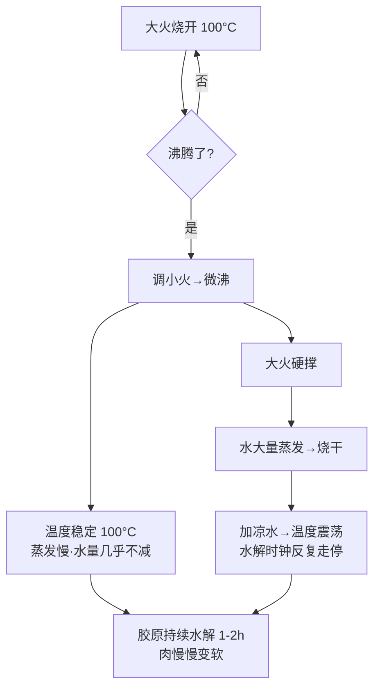

# 第 11 章 · 炖与煮

> **核心认知**：炖肉变烂，靠的不是「大火」，是「长时间把肉泡在 90-100°C 的温柔里」，让胶原蛋白一点点水解成明胶。大火和小火，水温都是 100°C——火的唯一区别是蒸发快慢，而蒸发快慢决定你中途要加几次水、温度要震荡几次。

> 章首注释：本章从「炖肉大火是不是更快」这个直觉出发，钉死沸腾恒温（100°C）与蒸发速率的关系，推出胶原蛋白→明胶的低温长时间水解机制；再讲清汤的鲜味溶出与「浓 = 乳化脂肪」原理。终点：读者能写出一条「先大火开锅、转小火微沸、长时间慢炖」的火候曲线，并懂得用一锅水同时完成炖汤、煮粥、蒸饭。

---

## 引子

造物主掀开锅盖，被涌出来的蒸汽呛得往后一缩。

他探头看了一眼锅里的牛腩，眉头皱了起来——两个多小时前他开着最大火，信誓旦旦要「大火快炖」，结果中途水干了三次，他加了三次水，现在锅里的肉还没烂，汤却稀得能照出人影。

「书上说炖两小时，我这都两小时了，怎么还咬不动？我明明开的火比谁都大。」

老谟在旁边的椅子上翻着手机，头也没抬：「火大，跟你有什么关系？你那火大的功劳，全用在把水烧干上了。」

造物主：「那……炖肉不应该大火吗？火越大汤越滚，肉不是烂得越快吗？」

老谟：「你这个问题，值得用一整章来回答。因为你已经亲手演示了它的错误答案——锅里那锅咬不动的肉，就是你自己交的卷子。」

---

## 对话引擎

### 第 1 轮：火越大，肉烂得越快？

**造物主**：「我知道你想说什么——水烧开恒 100°C，第 2 章就讲过了。但这是水温啊，火大汤滚得厉害，翻腾得厉害，不是能让肉熟得更透吗？」

**老谟**：「那我们做个区分。你说『熟得更透』，先定义一下：你希望牛腩发生什么变化，才算『透』？」

**造物主**：「就是……咬得动？软烂？筋和肉都化开那种感觉。」

**老谟**：「好，那你现在咬一口你锅里那炖了两小时的牛腩——」（造物主咬牙，放弃）「——硬。你再看看它的汤，稀得像水。这两个现象，你串成一条线，能想到什么？」

**造物主**：「……火大，把汤烧干了，我加水，又烧干，又加水。肉没烂，汤还清了。」

**老谟**：「那说明『汤滚得厉害』这件事，压根没帮你把肉变软。那你凭什么说火大肉烂得快？」

> 📐 知识锚点：【概念深挖】沸腾恒温：大火小火，水温都是 100°C
>
> 第 2 章立过的定理这里再次登场：在常压下，水一旦沸腾，温度就恒为 100°C，继续加火不会让水温更高，只会让水蒸发得更快。这是「大火炖肉」的第一个硬伤：**你调大火的每一分热量，都直接变成了蒸发，而不是变成了更高的水温。**
>
> 反过来说，「小火」也完全不是「温度更低」——小火只是让沸腾变得温和（微沸），水温依然 100°C，但蒸发速率大幅下降。所以老厨师说「小火慢炖」，说的从来不是「低温」，而是「**减少水分流失，让温度稳定地待在该在的地方**」。

### 第 2 轮：肉变软的秘密——不是煮碎了，是「化」了

**造物主**：「那肉到底是怎么变软的？泡在 100°C 的水里，理论上不是应该像煮鸡蛋一样，蛋白质全凝固，越煮越硬才对吗？」

**老谟**：「你这个问题问到了炖煮和煮蛋的根本区别。煮鸡蛋的蛋白，是纯粹的蛋白质，凝固了就是凝固了，不会再变软。但牛腩不一样——牛腩里除了肌肉纤维，还有大量**结缔组织**，那些白色的、发硬的筋、膜，全是它。」

**造物主**：「所以牛腩硬，硬在那些筋上？」

**老谟**：「对。肌肉纤维本身，加热后也是变硬的（跟鸡蛋蛋白一个道理）；但那些结缔组织里的胶原蛋白，在长时间的热水里，会发生一件鸡蛋蛋白不会发生的事——**溶解**。」

**造物主**：「溶解？泡热水里会溶解？那不就是煮化了？」

**老谟**：「别急着说『化』。你自己想想：如果真是『煮化了』，那肉应该是越来越碎、越来越软、最后化成渣对吧？可你锅里那块牛腩，炖了两小时，整块还在，只是从『硬』变成了『能咬动』——它没碎。」

**造物主**：「……对哦，它没碎，它还是整块，但咬得动了。」

**老谟**：「这就对了。胶原蛋白在水和热的作用下，从不溶的长链结构，水解成可溶的明胶——**整块的形状还在，但里面的『骨架』软了。**肉不是被煮碎了，是被『泡软了骨头』。」

> 📐 知识锚点：【概念深挖】胶原蛋白 → 明胶
>
> 【概念深挖】胶原蛋白是结缔组织的主要成分，结构是三条肽链绞成的「三股螺旋」，非常坚韧（这就是为什么生筋咬不动）。加热时它分两步变：
> 1. **变性**（约 60-65°C）：三股螺旋松开，胶原收缩、变韧——所以刚下锅的肉反而会觉得「紧」。
> 2. **水解**（长时间 90-100°C）：松开的肽链在水分子参与下逐渐断裂，水解成小分子的明胶。明胶是可溶的，会进入汤里；同时失去骨架支撑的肌肉纤维被「松开」，肉就软烂了。
>
> 关键在第二步：**水解是慢反应，需要以小时计的时间**——温度是必要条件（要在 60°C 以上才发生），但不是充分条件，时间才是。这就是「炖两小时」的直接来历。
>
> 【工程实践】检验明胶是否溶出有个肉眼可见的硬证据：**汤放凉后会结冻**。明胶溶液放凉至室温或冷藏即会凝成胶冻（皮冻、肉冻就是这么来的）。你炖的汤凉了能结冻，就说明胶原水解充分、明胶溶出够多；不结冻，说明时间不够或胶原太少。

### 第 3 轮：为什么必须小火——温度稳定的账

**造物主**：「好，胶原水解需要时间。那我大火烧着，水温也是 100°C，小火也是 100°C，水解速度不都一样吗？凭什么说小火更好？」

**老谟**：「你说对了一半——**在锅里一直有水的前提下**，大火小火水解速度确实差不多。但你回想一下自己刚才的经历：大火炖两小时，水干了三次。」

**造物主**：「然后我加了三次水。」

**老谟**：「加进去的水，是什么温度的？」

**造物主**：「……凉水？自来水。」

**老谟**：「凉水倒进 100°C 的锅里，锅温瞬间降到多少？肉块表面温度呢？这一下，胶原水解的『时钟』走不走？」

**造物主**：「……不走。温度掉下去，水解暂停，等再烧到 100°C 又得十几分钟。我这两小时，真正在 100°C 水解的时间，可能连一半都不到！」

**老谟**：「你自己把账算出来了。所以『小火』的真相是：**它不是让肉熟得更快，而是让水解的时钟『不走停』。**大火省下的那点时间，全被『烧干—加水—重新烧开』的循环吃回去了，还倒贴进去几次温度震荡。」

**造物主**：「原来小火不是『温柔』，是『稳定』。我以为是情感问题，原来是工程问题。」

> 📐 知识锚点：【工程实践】炖肉火候曲线：大火开锅，小火维持
>
> 正确的炖肉流程是一条两段式曲线：
> - **第一段·大火开锅**：大火把水烧到沸腾（这个阶段要快，缩短前期升温时间）。
> - **第二段·小火维持**：一旦沸腾，立刻调小火，让水面保持「微沸」——能看到中心有咕嘟的小泡翻滚，但不会剧烈翻腾、不会大量冒白汽。
>
> 判断标准：**锅里冒大汽、翻滚剧烈 = 火大了**；只有零星小泡 = 火刚好。微沸状态下，蒸发速率最低、水量几乎不减、温度稳定 100°C，胶原水解的时钟全程不走停。
>
> 这条曲线也是你后面任何炖菜的万能模板：先猛火烧开，再小火稳住，剩下的交给时间。**炖菜的全部技术含量，都在「开锅之后的那一下调小」上。**

> **读图说明**：这张图画的是同一次炖肉的两条路线，从「大火烧开」出发，共同的分岔点是「沸腾了？」。走左边正确路线：调小火进微沸，温度稳定、蒸发慢，胶原持续水解，肉变软。走右边错误路线：大火硬撑，水烧干、加凉水、温度震荡，水解时钟反复走停，两小时也没干成什么事。**读图关键：两条路最后都通向「肉变软」，但右边那条是绕了一个巨大的死循环才到——加凉水那一步会把你推回左边路线的起点（重新烧开）。**

### 第 4 轮：汤为什么好喝——溶出与乳化

**造物主**：「炖肉我不光想吃肉，还想喝汤。可我炖出来的汤稀得像水，饭店的汤是浓白的，是不是因为我火不够大？」

**老谟**：「先说结论：汤的鲜，和火大没关系，和『溶出来多少东西』有关系。你那一锅稀汤，是因为你两次加水，把已经溶出来的东西稀释了。你先把『汤是什么』想清楚——汤，其实就是水 + 从食材里溶出来的各种物质。」

**造物主**：「溶出来的？比如……盐、氨基酸、那个鲜味的谷氨酸？」

**老谟**：「对。鲜味物质（谷氨酸、核苷酸等）、盐分、小分子糖、还有明胶，都会在长时间加热中从食材溶进水里。**汤的『鲜』，是这些溶出物浓度的总和。**这就是为什么炖得越久的汤越有味道——溶出需要时间。」

**造物主**：「那『浓白』呢？饭店汤是乳白色的，我这汤是清汤，这是溶出物不够吗？」

**老谟**：「你说到点子上了，但不是同一件事。浓白不是『溶』出来的，是『乳化』出来的——你忘了第 7 章的油和水了？」

**造物主**：「乳化？就是蛋黄酱那个油水混合？可汤里又没有蛋黄，怎么乳化？」

**老谟**：「汤里的脂肪（肉和骨的油脂）在沸腾中被打碎成细小的油滴，同时汤里溶出的明胶和蛋白质是天然乳化剂——它们包裹住油滴，让油滴均匀悬浮在水里，光线照上去被散射，汤就变白了。**浓白的本质：脂肪被乳化成了细小的油滴，悬浮在汤里。**」

**造物主**：「所以汤浓不浓，看的是脂肪乳化得够不够好；汤鲜不鲜，看的是溶出物够不够多。两个指标，两种机制。」

> 📐 知识锚点：【概念深挖】汤的两套系统：鲜味溶出 + 脂肪乳化
>
> 把「汤好不好」拆成两个独立指标，你就能看懂所有汤：
> - **鲜味 = 溶出物的浓度**：谷氨酸（鲜味）、核苷酸、盐、糖、氨基酸随时间溶出。溶出需要「时间 + 接触面积」（食材切小、时间够长）。久炖汤鲜，是溶出充分。
> - **浓白 = 脂肪的乳化程度**：脂肪油滴越细小、分散越均匀，汤越白。让汤变白的手段：① 大火让沸腾更剧烈，把油滴打碎（所以「浓白汤」确实需要中等偏大的火——但注意这是**乳化阶段**，不是水解阶段）；② 加富含乳化剂的材料（明胶、蛋白质）；③ 先煎一下肉/鱼再炖（煎出的油和表面蛋白一起进汤，更容易乳化）。
>
> 【工程实践】两条实操结论：① 想要鲜味，时间要够、中途少加水（加水=稀释溶出物）；② 想要白汤，前期用中大火把油滴打碎，后期转小火保温。一道炖菜想两头兼顾，就按「大火开锅→中火乳化→小火水解」三段来——但这超纲了，宿舍党记住「小火保稳定」就够。

### 第 5 轮：电饭煲——被低估的炖锅

**造物主**：「道理我都懂了，可我宿舍只有电磁炉和一个电饭煲，炖两个小时我得在旁边守着火，上课怎么办？」

**老谟**：「你守着它干什么？它需要你喂水吗？」

**造物主**：「小火微沸，水不是不会干吗？」

**老谟**：「那你在旁边站着，是怕它寂寞？」

**造物主**：「……那我走开了，它自己会煮吗？」

**老谟**：「你现在手里这个电饭煲，就是一个自动化的『大火烧开 + 小火维持』机器——它内部有个温控器，水烧到 100°C 就自动跳到保温，降到一定程度又加热，正好卡在微沸附近。你只要把料丢进去，按个煮饭键，它自己就执行了整条火候曲线。」

**造物主**：「……我一直以为电饭煲只会煮饭，原来它是个炖汤神器？」

**老谟**：「你这句话，暴露了你在用 21 世纪的设备，过 20 世纪的脑子。电饭煲的本质是一口**带温控的锅**——它能做的不只是煮饭：煮粥、炖汤、炖肉、蒸蛋、焖菜，全靠它那个『水到 100°C 就转微沸』的温控逻辑。你那一锅需要两小时微沸的牛腩，丢进电饭煲按煮饭，你就可以去上课了。」

> 📐 知识锚点：【实现思考】如果让你用电饭煲实现「炖牛腩」，你会怎么排流程？
>
> 给小白的设计方案：
> 1. **准备**：牛腩切 3-4cm 块，冷水下锅焯一下去血沫（冷水下锅，逐渐升温，把血沫逼出来），捞出冲净。
> 2. **下锅**：牛腩、姜片、葱段、酱油、料酒、冰糖、热水（盖过肉面）全部进电饭煲内胆。
> 3. **模式**：按「煮饭」键（或「煲汤」键，有的话）。电饭煲自动完成「烧开→微沸维持」。
> 4. **时间**：煮饭键循环 2-3 次（每次约 40-50 分钟），或直接煲汤档 2 小时。中途不用开盖。
> 5. **检验**：筷子能轻松扎透牛腩 = 明胶溶出充分。出锅前按口味补盐（盐后面放，否则会让肉蛋白先凝固、水分流失变柴——第 5 章盐的时机）。
>
> 为什么这么设计：电饭煲的温控器替你做完了「大火开锅 + 小火维持」两段——你唯一要管的是「放对水、放够时间」。这正好呼应本章主题：炖煮的全部技术含量在温度稳定，而温度稳定可以外包给设备。
>
> 换条路会怎样：有人会说「那我用高压锅不是更快」。高压锅通过加压把水温顶到 120°C，胶原水解速度大幅加快，确实 40 分钟就能炖烂——但这是「换温度上限」，不是「换火」；而且高压锅炖出的汤色更清、乳化差一些。宿舍党有电饭煲就够用，高压锅是进阶装备，不在本书范围。

### 第 6 轮：落点——小火不是温柔，是稳定

**老谟**：（指了指灶上那锅已经炖了很久的牛腩）「道理讲完了。回到你这锅牛腩上——你不是信誓旦旦『火越大炖得越快』吗？现在锅就在这，你告诉我，它接下来该怎么办？」

**造物主**：走到锅边，看了一眼翻滚的水面，把火拧小，直到水面只剩下微沸的小泡。「先认账——我前面错的不是火不够大，是火太大：大火和小火，水温都是 100°C，水解速度一样；但大火把水烧干，我拿凉水去救，温度一震荡，水解时钟反复走停，两小时的实际水解时间连一半都不到。现在把火调小，让温度稳在 100°C 不再被折腾，剩下的交给时间。**小火不是温柔，是稳定。**」

**老谟**：「那你给它定个验收标准——什么时候算炖好了？」

**造物主**：「筷子能轻松扎透，汤凉了能结冻。前者说明胶原水解透了，后者说明明胶溶够了。」

**老谟**：「可以，你已经从『煮菜的人』毕业成『管温度的人』了。下一章是全书最后一站——煎与烤。带一个问题来：为什么煎肉要先大火『封边』？翻来翻去真的不行吗？」

---

## 严格化走廊

> 把对话里「摸出来的直觉」落成严格形式。

### 定义（精确表述）

**定义 1（胶原蛋白）**：结缔组织的主要结构蛋白，由三条多肽链构成三股螺旋，坚韧难咬。加热分两步：60-65°C 变性收缩；随后在湿热中缓慢水解。

**定义 2（明胶）**：胶原蛋白经长时间湿热水解得到的可溶性产物，溶于热水，放凉至室温或冷藏即凝结为胶冻。明胶具有乳化、增稠作用。

**定义 3（微沸）**：液体沸腾但汽泡生成平缓的状态。特征：水面中心有持续小泡上浮、边缘平静，无剧烈翻腾、无明显大量白汽。

**定义 4（乳化）**：一种液体以微小液滴形式稳定分散于另一种互不相溶液体中的现象。在汤中表现为脂肪油滴被明胶/蛋白质包裹而悬浮于水相，使汤呈乳白色。

### 定理（带全前提条件）

**定理 1（沸腾恒温）**：在常压下，液体沸腾期间温度保持为沸点（水为 100°C），不随供热强度增大而升高；供热强度只改变蒸发速率。
- 前提：常压；液体处于持续沸腾状态。
- 推论：炖煮中水温上限为 100°C，「大火」不能提高水温，只能加速水分蒸发。

**定理 2（胶原水解窗口）**：胶原蛋白水解为明胶，需要温度 ≥ 60°C（变性）且以小时计的持续湿热时间；水解速率随温度升高而增大，但在常压炖煮范围内（90-100°C）变化不大。
- 前提：有足够水分；温度稳定；时间充分。
- 推论：炖肉的「烂」由「累积处于高温的时间」决定，任何使温度跌破 60°C 的事件（加凉水、关火太久）都会按比例损失水解时钟。

**定理 3（乳化必要条件）**：汤的乳白色来自脂肪油滴被乳化剂包裹悬浮；需同时存在脂肪、乳化剂（明胶/蛋白质）与充分的分散能量（沸腾扰动）。
- 推论：清汤炖煮（微沸）乳化弱 → 汤清；先煎后炖或前期中大火 → 乳化强 → 汤白。

### 证明（完整可复写证明）

**命题**：为什么「大火炖肉」不能加速肉变烂，反而可能比小火更慢？

**证明**（能量守恒 + 时钟模型）：

**第 1 步**：由定理 1，沸腾状态下水温恒为 100°C。设大火供热 P_大、小火供热 P_小，两者蒸发速率分别为 r_大 = α·P_大、r_小 = α·P_小（α 为热效率折算系数，蒸发是主要耗能去向）。

**第 2 步**：设炖锅水量 V。大火蒸发速率高，单位时间耗水 r_大。当累积蒸发量达到 V（水烧干），必须补水。

**第 3 步**：补水（设加常温凉水）使锅内整体温度跌至 T_1 < 60°C（远低于胶原水解下限）。此后重新加热到沸腾需额外时间 t_补。在 t_补 期间，水解速率为 0（未达 60°C）。

**第 4 步**：令小火在时间 T 内维持沸腾不断水，有效水解时间 E_小 = T（整个时段温度 ≥ 60°C）。

**第 5 步**：大火在同样时间 T 内经历 n = r_大·T/V 次「烧干—补水」循环，每次损失时间约 t_补（加热时间）+ t_稳定（重新达 100°C 前的水解低效期）。有效水解时间 E_大 ≈ T − n·(t_补 + t_稳定)。

**第 6 步**：当 n·(t_补 + t_稳定) > 0 时，E_大 < T = E_小，即大火的有效水解时间反而更短。只要补水次数够多（火越大 n 越大），大火的劣势就越明显。∎

**结论**：大火炖肉不快反慢，根源是「蒸发→补水→温度震荡」对有效水解时间的侵蚀，而不是水解本身变慢了。

### 反例/边界（钉死适用域）

**反例 1（「久炖 ≠ 万能」）**：鸡胸肉炖 2 小时只会更柴——因为鸡肉胶原含量低，主要成分是肌动蛋白（约 66-70°C 变性的肌肉蛋白），它没有「水解变软」的机制，只会越煮越硬。炖的「变软」机制只对胶原丰富的部位（牛腩、猪蹄、筋、腱子肉）成立。选错肉，久炖就是灾难。

**反例 2（「小火」不适用于所有汤）**：鱼汤、骨头汤要「浓白」，需要中大火把脂肪打碎乳化（定理 3）；一上来就小火微沸，只能得到清汤。小火保稳定是对「炖肉」说的，不是对所有汤说的。

**边界情况（高压锅）**：高压锅加压使水温可达约 120°C，胶原水解速率显著加快（40 分钟 ≈ 常压 2 小时）。但这改变了定理 1 的前提（常压），属于换温度上限而不是换火候；高压锅炖汤乳化弱、汤色偏清，是另一条技术路线。

---

## 知识点总结

### 知识点（本章推出的核心概念）
- **沸腾恒温**：常压沸腾恒 100°C，火只改蒸发速率，不改水温。
- **胶原蛋白 → 明胶**：60-65°C 变性，长时间（以小时计）水解成可溶明胶——肉「变软」的机制。
- **微沸 = 稳定**：小火 = 减少蒸发 + 温度不震荡，让水解时钟不走停。
- **汤的鲜 = 溶出物浓度**：鲜味物质、盐、明胶随时间溶出；加水 = 稀释溶出物。
- **汤的白 = 脂肪乳化**：油滴被明胶/蛋白包裹悬浮，需脂肪 + 乳化剂 + 扰动。
- **电饭煲 = 带温控的锅**：自动执行「烧开 → 微沸维持」曲线，一锅多用。

### 历史结论（本章涉及的史料）
- 炒诞生依赖薄铁锅（宋元），炖煮则是更古老的技法——任何能盛水的容器加上火源即可。
- 「肉冻/皮冻」是明胶溶出的最古老证据：中国自古就有用肉汤凝冻储存的做法（「冻」字本义为冰，肉汤凝冻是它的引申义）。

### 工程实践结论（本章知识在真实厨房里怎么用）
- 炖肉万能模板：大火烧开 → 立刻转小火微沸 → 保持 1-2 小时 → 筷子扎透验收。
- 中途尽量不加水；非要加，加热水（减少温度震荡）。
- 检验明胶是否溶出：汤凉了能结冻 = 胶原水解充分。
- 电饭煲煮饭键 = 自动小火；煲汤炖肉交给它，人去干别的。
- 想喝白汤：先煎后炖、前期中大火乳化；想喝清汤鲜汤：小火慢炖、少加水。

---

## 实操训练场

> 原「计算训练场」的烹饪化。每一题都要动手，做完对答案。

### 实操题 1：大火小火的蒸发账（难度：易→中）

**题干**：造物主炖一锅 2L 的牛腩汤。电磁炉大火档 2000W、小火档 800W，热效率均按 60% 计。已知水的汽化潜热 2260 kJ/kg，常温凉水（20°C）倒入 100°C 的锅中，会把全锅温度拉低约 40°C（以 2L 汤量、加 300ml 凉水估算）。

（a）大火档 1 小时约蒸发多少水？小火档呢？
（b）如果汤少于 800ml 就会烧干见锅，大火档能连续炖多久不用补水？小火档呢？
（c）大火炖 2 小时，按中途补水 3 次、每次重新烧开需 10 分钟算，真正的「水解有效时间」是多少？小火不间断炖 2 小时呢？

**完整分步解答：**

（a）蒸发量计算：
- 第 1 步：有效加热功率。大火 P = 2000 × 0.6 = 1200 W = 1.2 kJ/s；小火 P = 800 × 0.6 = 480 W = 0.48 kJ/s。
- 第 2 步：假设热量主要耗于蒸发，蒸发速率 = 有效功率 ÷ 汽化潜热。大火：1.2 kJ/s ÷ 2.26 kJ/g ≈ 0.53 g/s ≈ 31.9 g/分 ≈ **1.9 kg/小时**；小火：0.48 ÷ 2.26 ≈ 0.21 g/s ≈ 12.8 g/分 ≈ **0.77 kg/小时**。
- 答：大火 1 小时蒸发约 **1.9L**，小火约 **0.77L**。

（b）连续炖煮时长：
- 第 1 步：可蒸发量 = 2L − 0.8L = 1.2L = 1.2 kg。
- 第 2 步：大火 t = 1.2 ÷ 1.9 ≈ 0.63 小时 ≈ **38 分钟**；小火 t = 1.2 ÷ 0.77 ≈ 1.56 小时 ≈ **94 分钟**。
- 答：大火 38 分钟就得补水，小火能撑 94 分钟。2 小时炖程，大火要补 2-3 次水，小火全程可能一次都不用加。

（c）有效水解时间：
- 第 1 步：大火 2 小时 = 120 分钟，补水 3 次，每次损失重新烧开的 10 分钟 + 升温期间的低效时间（估算共 12 分钟/次）。
- 第 2 步：有效水解时间 E_大 = 120 − 3×12 = 120 − 36 = **84 分钟**。
- 第 3 步：小火不间断 E_小 = 120 分钟（全程 ≥60°C）。
- 第 4 步：对比：大火名义 2 小时，实际有效水解 84 分钟；小火名义 2 小时，实际 120 分钟，多出约 43%。
- 答：大火有效 84 分钟，小火有效 120 分钟。**这就是「小火反而更快」的数值证据。**

**常见错误**：以为「大火档位数值大，所以烧得透」。档位大烧的是蒸发，不是水温——沸腾后水温恒 100°C（定理 1），多出来的热量全变成了把水变成水汽。火候曲线里那个「沸腾后调小」的动作，是炖菜的全部技术含量。

### 实操题 2：电饭煲炖牛腩 + 皮冻验证实验（难度：中→难）

**题干**：造物主要用电饭煲炖 1kg 牛腩。他手头有：电饭煲（煮饭键，循环「烧开→保温→再烧开」的微沸模式，每次循环约 45 分钟）、牛腩 1kg、姜葱、酱油、料酒、盐。已知：牛腩要筷子轻松扎透需胶原充分水解，明胶溶出充分时汤冷却会结冻。

（a）写出完整流程，标出每步的关键动作与判断依据。
（b）炖完的汤，放凉后没有结冻。造物主应该检查哪几个变量？为什么？
（c）如果他想这锅汤又鲜又白，应该在流程中做什么调整？

**完整分步解答：**

（a）完整流程：
- 第 1 步 **焯水**：牛腩切 3-4cm 块，冷水下锅，电磁炉大火烧开，撇去血沫，捞出冲净。（冷水下锅：逐渐升温把内部血水逼出；热水下锅会让表面蛋白瞬间凝固，血水封在里面）
- 第 2 步 **下锅**：牛腩、姜、葱、料酒、酱油进电饭煲内胆，加热水没过肉面约 2cm。
- 第 3 步 **炖煮**：按煮饭键。循环 2-3 次（共约 90-135 分钟），中途不开盖。（电饭煲温控自动执行「烧开→微沸维持」，即本章火候曲线）
- 第 4 步 **验收**：筷子能轻松扎透牛腩 = 明胶溶出充分；达不到再循环一次。
- 第 5 步 **调味**：出锅前按口味补盐（盐后放，避免肉蛋白提前凝固锁水变柴）。
- 答：五步，核心技术是「用煮饭键把火候曲线外包给温控器」。

（b）不结冻的排查：
- 第 1 步：变量一 **时间是否足够**：明胶溶出需要以小时计的持续湿热；炖不足 1.5 小时明胶浓度不足，不结冻。→ 延长炖煮循环。
- 第 2 步：变量二 **胶原来源是否足够**：牛腩本身胶原中等；若切太大块、或肉质偏瘦（胶原少），明胶溶出总量低。→ 换带筋/带膜部位，或加一小块猪皮进去（猪皮是胶原大户）。
- 第 3 步：变量三 **是否被稀释**：中途加了大量水，明胶浓度被稀释到无法结冻。→ 补水用热水且尽量少加。
- 答：从「时间、胶原来源、浓度」三个方向排查，三者对应定理 2 的三个前提（持续湿热、胶原存在、不被打断）。

（c）鲜 + 白的调整：
- 第 1 步 **要鲜**：时间要够（溶出充分）+ 中途少补水（不稀释溶出物）。这是「鲜」的保证。
- 第 2 步 **要白**：先在炒锅或电磁炉上把牛腩块煎一下（表面出油 + 表面蛋白），再进电饭煲炖；或在电饭煲前期多按一两次「再加热」制造更剧烈的沸腾，把油滴打碎（定理 3 的乳化）。但要小心：剧烈沸腾会加速蒸发，影响「保稳定」主线——取舍是「前期乳化 10 分钟，之后回归微沸」。
- 答：鲜靠「溶出时间 + 少稀释」，白靠「煎出脂肪 + 前期乳化扰动」，两者可以在流程中分开安排。

**常见错误**：以为「炖得越久越白」。汤白是乳化（脂肪 + 扰动），不是溶出时间——长时间微沸只增鲜不增白。想白要「煎 + 前期中大火」，想鲜要「久 + 少加水」。把两个指标混在一起，会得到一个「又清又不浓」的尴尬结果。

---

## 向导便签

> **本章干了什么**：钉死沸腾恒温与蒸发速率的关系，证明「大火炖肉不快反慢」（有效水解时间被补水循环侵蚀）；推出胶原蛋白→明胶的低温长时间水解机制；讲清汤的「鲜 = 溶出」「白 = 乳化」两套系统；把电饭煲重新定义为「带温控的锅」。
>
> **钉死一句话**：小火不是温柔，是稳定——炖肉的烂，由累积处于高温的时间决定。
>
> **毒舌收口**：「你以为你在炖肉，其实你在管理一条温度曲线。管得好，时间是你的朋友；管得不好，时间是你锅里的水，一转眼就没了。」

## 造物主手记

**我曾踩的坑**：一直以为「火越大炖得越快」，结果两小时里我烧干了三次水、加了三次凉水，肉还咬着硬。现在明白了——我那两小时，真正在 100°C 水解的时间可能连一半都不到，火全烧在蒸发上了。

**顿悟时刻**：「小火不是温柔，是稳定」这句话砸下来的那一刻。原来老厨师那句「小火慢炖」，是精确的工程指令，不是什么玄学情怀。

## 自测题

1. 为什么大火炖肉不会让水温更高？——*简答要点：常压沸腾恒 100°C，多余热量只加速蒸发，不改水温（定理 1）。*
2. 胶原蛋白变软的两个阶段是什么？为什么需要长时间？——*简答要点：60-65°C 变性收缩 + 长时间湿热水解为明胶；水解是慢反应，时间才是充分条件。*
3. 汤「鲜」和汤「白」分别是什么机制？——*简答要点：鲜 = 鲜味物质溶出浓度（需时间、少稀释）；白 = 脂肪乳化（需脂肪 + 乳化剂 + 扰动）。*
4. 为什么炖完的汤放凉会结冻？——*简答要点：明胶溶出充分时，放凉至室温或冷藏即凝结为胶冻——是胶原水解成功的肉眼证据。*

## 预告

最后一站，全书收官——煎与烤。你已经见过「封边」这个词无数次了：煎肉前先大火把表面煎上色，说是「锁住汁水」。但真相比这有意思得多——如果「封边」真的能锁水，那第 4 章我们讲过的「中心温度」又该放哪？煎肉到底是先管表面，还是先管中心？
