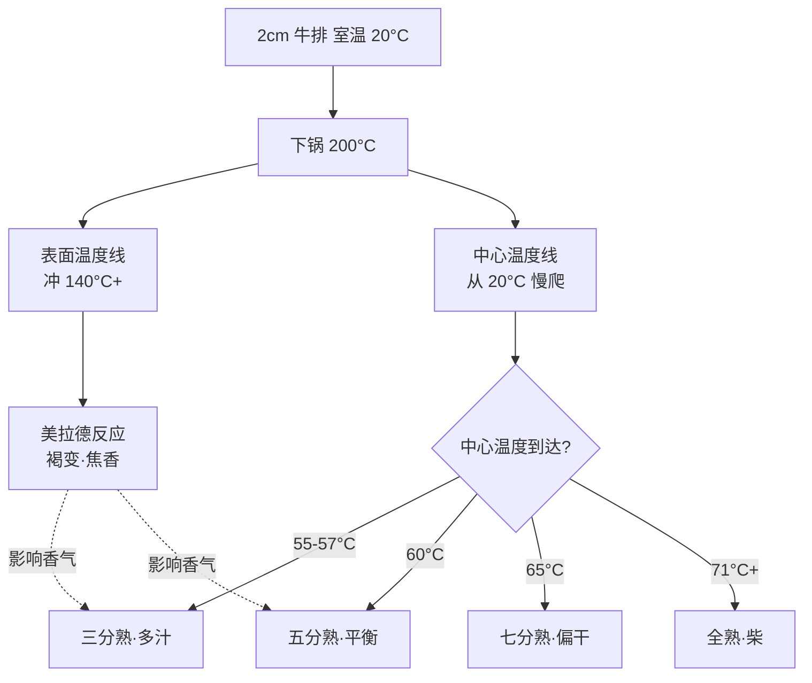

# 第 12 章 · 煎与烤

> **核心认知**：煎肉先「封边」，不是为了锁住汁水，是为了把「表面的香」和「中心的熟」拆成两件事分开管理——表面用 140°C+ 的美拉德制造香气，中心用精确到度的温度控制熟度。会煎肉，就是会同时管两条温度线。

> 章首注释：全书终章。本章从「封边是不是锁水」这个流传最广的厨房迷信出发，拆出「表面美拉德」与「内部熟度」两条独立的温度线，建立蛋白质凝固温度梯度与中心温度控制；再落到平底锅技法（热锅冷油/离火焖）、鸡胸不柴方案、烤箱/空气炸锅替代。终点：读者能独立煎出一块目标熟度的牛排，并把全书 12 章串成「电磁炉+一口锅做一桌菜」的完整能力。

---

## 引子

造物主夹起那块煎好的牛肉，牙一咬，咯噔一声，他龇了龇牙，把肉吐回盘子里。

「又柴了。」他盯着那块外皮已经焦成深褐色的牛肉，有点委屈，「我明明听你的，先大火『封边』了，把汁水锁在里面，怎么还是又干又柴？」

老谟拿起叉子，戳了戳那块牛肉：「你封了边，那『锁住的水』在哪呢？」

造物主：「……在……肉里？」

老谟：「肉里？那你咬一口，汁水出来了吗？」

造物主沉默。

老谟：「你上当了。『封边锁水』是厨房里流传最广的都市传说之一。今天这一章，我们把它拆了，顺便把『煎肉』这件事，从玄学拆成两条温度线。」

---

## 对话引擎

### 第 1 轮：「封边锁水」的信徒

**造物主**：「等等，你先别急着拆。封边锁水这不是公认的吗？煎牛排、煎鱼、煎鸡胸，都是先大火把表面煎黄，把汁水『封』在肉里——菜谱都这么写！」

**老谟**：「好，那我问你：你刚才那块牛排，表面是不是也封得焦黄？汁水呢？」

**造物主**：「……没有，又干又柴。」

**老谟**：「那你有没有想过，如果『封边』真的能锁水，那全世界煎得外焦里嫩的牛排应该都在锁水——可实际上，同一块牛排，表面焦黄的那个『封边层』，只有薄薄几毫米。肉中间那 2cm 厚的部分，靠什么锁水？靠那几毫米的壳？」

**造物主**：「……好像靠不住。」

**老谟**：「那我们来个实验假设：如果封边真的锁水，那么『先封边再煎』和『不封边直接煎』，熟度一样时，前者应该明显更多汁。你相信这个吗？」

**造物主**：「相信啊……菜谱都这么说的。」

**老谟**：「那好，你记住你现在的相信。接下来我要用两条温度线，把这个相信拆给你看。」

> 📐 知识锚点：【概念深挖】「封边锁水」为什么是错的
>
> 「封边锁水」的传说认为：大火把表面蛋白瞬间凝固，形成一层致密的壳，把肉汁封在里面。这个说法有两个硬伤：
> 1. **物理上封不住**：肉在加热时水分流失，主要途径是肌肉纤维受热收缩时像挤海绵一样把水挤出来——挤压发生在肉块**内部**，不是从表面「漏」出去的。表面一层薄壳阻止不了内部的挤压。
> 2. **实验上不成立**：烹饪科学做过对照实验，先封边 vs 不封边，在达到相同内部熟度时，成品的汁水损失率没有显著差异。
>
> 那「封边」到底有没有用？有，但作用不是锁水，而是**制造香气**：表面大火瞬间升温到 140°C+，触发美拉德反应，产生褐变和焦香——这是煎制品「香」的全部来源。**封边 = 给表面做美拉德，不是给内部做保险。**第 3 章那个 140°C 门槛，在这里正式上岗。

### 第 2 轮：两条温度线——表面和中心各管各的

**造物主**：「如果封边不锁水，那煎肉到底在煎什么？」

**老谟**：「你想想，一块 2cm 厚的牛排放进 200°C 的锅里，一秒钟之内，哪个部位先到 140°C？」

**造物主**：「表面。」

**老谟**：「哪个部位还是冷的？」

**造物主**：「中心。」

**老谟**：「对。这就是煎肉的本质——**同一块肉上，同时存在两条温度线：表面的线冲得又快又高（140°C+，奔着美拉德去），中心的线爬得又慢又稳（从 20°C 慢慢爬向 60°C，奔着蛋白质凝固去）。**你做的一整件事，就是让这两条线分别到达各自的目标，然后收手。」

**造物主**：「所以我以前的错误是——只盯着表面看。表面一焦我就觉得熟了，其实中心还在 40°C 躺着？」

**老谟**：「你总算说到点子上了。**煎肉判断熟没熟，永远看中心，不看表面。**表面焦了只说明美拉德完成了，跟里面熟没熟，是两笔账。」

> 📐 知识锚点：【概念深挖】蛋白质凝固温度梯度——中心温度决定一切
>
> 肉的「熟」，本质是蛋白质变性凝固。而肉里不同的蛋白质，在不同的温度凝固：
> | 蛋白质 | 变性温度 | 表现 |
> |--------|---------|------|
> | 肌球蛋白 | 约 40-50°C | 肉开始变紧、汁水开始被挤出 |
> | 胶原蛋白 | 约 60-65°C | 结缔组织收缩 |
> | 肌动蛋白 | 约 66-70°C | 肉剧烈收缩、大量挤水——「柴」的主要来源 |
> | 肌红蛋白 | 约 60°C 以上 | 肉的红色转灰褐（颜色的变化）|
>
> 这张表就是牛排熟度的物理基础：牛排的红色来自肌红蛋白，它要到 60°C 以上才变色。所以「切面还带粉红」= 中心还没到 60°C = 蛋白质还没剧烈收缩 = 汁水还没被挤光。反过来，中心超过 66-70°C，肌动蛋白把肉狠狠一收缩，汁水挤干，就成你嘴里那块柴肉了。
>
> 【工程实践】「熟度」不是玄学，是一个**数字**——中心温度。你要三分熟，就要让中心停在 55-57°C；你要全熟，就让中心到 71°C+。煎肉的全部手艺，就是把中心温度精确地停在你想要的刻度上。

> **读图说明**：这张图是「煎肉的全景图」。起点是 2cm 牛排，下锅后立即分岔成两条互不影响的线：上面一条是表面温度线（冲向 140°C+，制造美拉德香气），下面一条是中心温度线（从 20°C 缓慢爬升）。两条线唯一的汇合点在最右端——中心温度决定你得到哪个熟度，而表面香气像配音一样叠在每一种熟度上。**读图关键：右端的五个熟度结果，只由中心温度决定；表面那条线，从头到尾只是负责「香」。**你如果只顾表面，等于只看配音，不看正片。

### 第 3 轮：翻来翻去真的不行吗？

**造物主**：「那翻面呢？我翻来翻去，是不是也是错的？」

**老谟**：「先别急着给自己定罪。你先说，你觉得『不能翻来翻去』是为什么？」

**造物主**：「都说翻多了会……把汁水翻出来？会破坏表面？」

**老谟**：「又来了，又是『汁水』。我们刚才已经拆了『锁水』，现在这个『翻多了丢汁水』，你觉得还站得住吗？水是藏在肌肉纤维里的，不是放在表面的——翻面能把它抖出来？」

**造物主**：「……好像不能。」

**老谟**：「那翻面真正的代价是什么？你想：锅底 200°C，肉面贴锅，那一面在升温；你翻了，凉的一面贴锅，热的一面离锅，开始降温。翻得越频繁，表面在『升温—降温』之间反复横跳——你觉得这对 140°C 的美拉德，是好事吗？」

**造物主**：「……不是。表面温度稳不住，美拉德反应就磨磨蹭蹭做不完，表面不是金黄，是灰白的。」

**老谟**：「对。所以『不能翻来翻去』的真正理由，不是怕丢汁水，是**怕表面温度稳不住、美拉德做不漂亮**。翻面这件事本身没问题，问题是『别翻得太频繁、让表面温度反复坐过山车』。正确做法：一面煎够时间，翻一次，再煎够时间——每次翻面之间，给足表面把温度拉上去的时间。」

**造物主**：「原来翻面也是温度管理的学问，不是迷信。」

> 📐 知识锚点：【工程实践】平底锅技法的三条军规
>
> 【概念深挖】基于两条温度线，平底锅煎肉的正确姿势：
> 1. **热锅冷油**：空锅烧到「滴水即沸」（滴一滴水到锅里，水珠在锅面滚成球——这是 Leidenfrost 效应，锅面温度远超沸点时，水珠底部瞬间汽化成蒸汽垫，悬浮滚动）。这时下油、下食材，食物不会粘锅，且表面瞬间接触高温，美拉德开局就打满。冷锅下食材，表面温度慢慢爬，食材会在出水期里煮自己。
> 2. **一面一翻**：每面煎够设定时间，翻一次。翻得太勤，表面温度反复震荡，美拉德做不漂亮；不翻，单面会煎过头甚至焦黑。
> 3. **离火焖 / 锅盖焖**：厚肉（>2cm）表面美拉德做完后，中心的温度线还没到目标。此时离火（或关小火/盖上锅盖），利用锅的余热慢慢把中心「焖」到目标温度——这叫**离火焖**，是电磁炉煎厚肉的保命技。原理：中心的温度线爬得慢，需要时间；而表面已经完成美拉德，不需要再加热，再把表面贴着锅烧，只会把外皮烧焦。
>
> 【工程实践】这第三条尤其重要——它回答了第 4 章埋下的问题：中心温度怎么到目标？不是靠「一直煎」，是靠「煎出表面 + 余热焖熟中心」两段式。这也是为什么菜谱常说「厚牛排煎完静置 5 分钟」：静置 = 离火焖的放松版，让中心温度继续爬完最后几度，同时让肉汁重新分布均匀。

### 第 4 轮：牛排熟度——把目标换算成温度和时间

**造物主**：「那我怎么知道中心到没到 55°C？我没有温度计，宿舍也不让插探头。」

**老谟**：「那你就用最古老的工具——时间和厚度。中心的温度爬升，由第 9 章的平方律管着：厚度翻倍，熟化时间翻四倍。所以『每面煎多久』不是玄学，是和厚度绑定的。给你一张时间表：2cm 厚的牛排，中高火每面煎 1 分钟，出锅中心约 48°C；1.5 分钟，约 53°C；2 分钟，约 57°C；2.5 分钟，约 62°C；3 分钟，约 66°C。」

**造物主**：「等下，每面 2 分钟就 57°C 了，那不是煎 4 分钟就三分熟？可我上次煎了 8 分钟啊……怪不得柴。」

**老谟**：「你把 2cm 的肉当 4cm 的肉煎，表面烧焦了，中心还欠着。这就是不看厚度、硬套时间的代价。**时间表只在厚度匹配时有效**——肉越厚，每面的分钟数就得按平方律往上加。」

**造物主**：「那我想要五分熟（中心 60°C），怎么办？2 分钟出锅才 57°C，还差 3 度。」

**老谟**：「你忘了刚才说的静置——出锅后那块肉不会立刻停摆，中心的余温还会再爬 3-5°C。所以你要 60°C，出锅中心 56-57°C 就够了，剩下的交给静置。**学会在出锅前 3 度收手，是煎肉从及格到优秀的距离。**」

> 📐 知识锚点：【工程实践】牛排熟度中心温度表（本书标准）
>
> | 熟度 | 中心温度（静置后） | 特征 |
> |------|------------------|------|
> | 近生 Blue | <50°C | 几乎全生，仅表面褐变 |
> | 一分 Rare | 50-52°C | 中心冰凉，切面深红 |
> | 三分 Medium Rare | 55-57°C | 中心温热微红、多汁（多数人的最爱）|
> | 五分 Medium | 60°C | 中心粉红、汁水均衡 |
> | 七分 Medium Well | 65°C | 中心淡粉、偏干 |
> | 全熟 Well Done | 71°C+ | 中心灰褐、肉质紧实 |
>
> 使用说明：**2cm 厚牛排，中高火每面时间 ≈ 1/1.5/2/2.5/3 分钟 → 出锅中心约 48/53/57/62/66°C**。出锅后静置 5 分钟，中心还会再升 3-5°C。肉厚每 +1cm，每面时间按平方律显著增加（4cm 厚的每面时间约为 2cm 的 4 倍），且必须配合离火焖。
>
> 判断手法（无温度计）：用指腹按肉的中心，对比自己手上的肌肉硬度——虎口放松 vs 握拳。但这属于手感玄学，本书给出时间表已经够宿舍党用了。

### 第 5 轮：鸡胸不柴——从「安全温度」到「不柴温度」

**造物主**：「牛排我可以接受中心 57°C。但鸡胸怎么办？鸡必须全熟啊，中心要 74°C 以上，那不就必然柴了吗？」

**老谟**：「先承认一个事实：鸡胸的中心安全温度是 74°C（杀灭沙门氏菌）。所以鸡胸的问题不是『要不要全熟』，是『怎么在全熟的前提下，让它不柴』。你觉得柴是哪来的？」

**造物主**：「……刚才那张表，肌动蛋白 66-70°C 剧烈收缩挤水。鸡胸中心要 74°C，肯定过了 70°C，必挤水，必柴。」

**老谟**：「对。所以鸡胸的不柴方案，不是『降低中心温度』（不安全），而是两条路：**要么让 74°C 来得快一点，要么让肉在被挤水之前多存点水。**」

**造物主**：「让 74°C 来得快一点？怎么快？」

**老谟**：「你说呢？你手里有一块 4cm 厚的鸡胸，和一块片成 1cm 的鸡胸。哪个中心到 74°C 快？」

**造物主**：「……1cm 的。平方律，厚度 4 倍，时间差 16 倍！」

**老谟**：「对。这就是方案一：**片薄**。把厚鸡胸片成 1cm 的片，每面煎 2-3 分钟中心就到 74°C，表面还来不及焦，水分还来不及挤干。方案二：**盐水浸泡**——第 5 章讲过盐的渗透，把鸡胸在淡盐水里泡 30 分钟，盐让肌原纤维蛋白结构松散、能结合更多水分，肉在被挤水之前已经『存了水』，挤完还有剩。」

**造物主**：「所以不柴 = 缩短它被挤水的时间 + 提前给它多存水。两个方案一起用？」

**老谟**：「你终于学会组合拳了。」

> 📐 知识锚点：【实现思考】如果让你设计一个「电磁炉煎鸡胸不柴方案」
>
> 给你一份可执行的设计稿：
> 1. **预处理（存水）**：鸡胸 4cm 厚，用 3% 淡盐水（1L 水 + 30g 盐）浸泡 30 分钟，取出擦干。
> 2. **物理整形（减厚）**：从侧面把鸡胸片成两块 2cm 的，或直接片成 1cm 的薄片。片薄是平方律的正面应用——厚度减半，中心到安全温度的时间减到 1/4。
> 3. **煎制（两段式）**：热锅冷油，中大火，1cm 薄片每面 2 分钟（中心达 74°C）；如果是 2cm 片，每面 3 分钟 + 关火离火焖 2 分钟。
> 4. **验收**：切开最厚处，无粉色透明感、肉汁清澈 = 安全且多汁。
>
> 为什么这么设计：盐（存水）解决「挤水前没水可挤」，片薄 + 两段式（缩短挤水时间）解决「被挤水的时间太长」。两个手段分别打两个变量，合起来把「柴」的机制拆掉。
>
> 换条路会怎样：有人会说「那我用低温慢煮 65°C 泡熟，再煎上色」。可以，但低温慢煮需要设备；而且 65°C 的鸡胸安全性依赖严格的时间和温度控制，宿舍党风险高。本书方案在「中心 74°C 安全线」内用物理手段解决柴的问题，不越安全线。

### 第 6 轮：烤箱/空气炸锅——没有烤箱怎么办

**造物主**：「你说煎是两条温度线，那烤呢？我宿舍没烤箱，总听人说烤箱烤的鸡翅鸡腿好吃，我是不是这辈子吃不上了？」

**老谟**：「先搞清烤箱在干嘛。还记得第 1 章传热三方式吗？」

**造物主**：「传导、对流、辐射。烤箱……是热空气对流 + 发热管辐射，不用贴锅接触。」

**老谟**：「对。烤箱的优势是**整体均匀**——热空气从四面八方加热食物，不用翻面，中心温度线爬得均匀，不容易出现『表面焦了中心还生』。它其实是把『离火焖』从技巧升级成了设备。」

**造物主**：「那我没烤箱，这优势就没了？」

**老谟**：「谁说的？电磁炉 + 平底锅 + 一个锅盖，就能模拟一半。你煎完表面，盖上锅盖离火焖——锅盖里的热蒸汽在锅与盖之间对流循环，食物上下两面同时受热，就是迷你版的烤箱。再进阶一点，有个叫**空气炸锅**的东西，本质是个小号热风烤箱，功率不大但好用，宿舍限电也能插。」

**造物主**：「所以烤不是烤箱的特权，是『热空气对流』的特权——锅盖焖 = 穷人的烤箱，空气炸锅 = 缩小的烤箱。」

**老谟**：「又总结对了。记住：**你缺的从来不是设备，是理解设备在做什么。理解了，找替代品很容易。**」

> 📐 知识锚点：【概念深挖】烤箱/空气炸锅/锅盖焖的统一原理
>
> 【概念深挖】「烤」的本质是**让热空气从四面八方均匀加热食物**，主要靠对流（热空气循环）+ 辐射（发热管）。与煎（传导、单面接触）最大的不同：烤不需要翻面，食材整体温度场均匀，中心温度线平缓，表面又不会因为紧贴锅底而局部过焦。
>
> 【工程实践】电磁炉条件下三种「烤」的替代等级：
> 1. **锅盖焖**（最低配）：煎完离火盖盖，靠锅内热蒸汽对流把中心焖熟。适合鸡胸、厚牛排、鱼类。
> 2. **电饭煲「保温」闷烤**：电饭煲内胆聚热，关盖保温档的余热可当慢烤用（烤蛋、烤红薯的土办法）。
> 3. **空气炸锅**（进阶，宿舍可用）：小型热风烤箱，200°C 热风循环，烤鸡翅、薯条、蔬菜，替代烤箱 80% 的功能，还不用预热。
>
> 烤箱当然更好（温度精准、容量大），但它的原理已经被上面三者覆盖——理解原理，替代就是按需选型。

### 第 7 轮：落点——全书收束，电磁炉上的一桌菜

**老谟**：「好，走到全书最后一章了。我们把最后一件事办完——煎肉的本质，你现在能一句话说清吗？」

**造物主**：「煎肉 = 管两条温度线。表面线负责美拉德、负责香；中心线负责蛋白质凝固、负责熟。表面 140°C+ 走美拉德，中心按目标温度停在 55/60/65/71°C 的刻度上。判断熟不熟永远看中心，不翻来翻去是为了让表面温度稳定，片薄和盐水是为了让鸡胸在安全线内不柴。没有烤箱，就理解烤是对流辐射的均匀加热，用锅盖焖和空气炸锅替代。」

**老谟**：「那我不问煎肉了，我问你一个更大的问题——整本书十二章走下来，你从『开水都不会烧』走到了哪？」

**造物主**：「我走到了一桌菜面前。我开始觉得，电磁炉加一口锅，其实什么都能做：第 1-4 章，我知道了热是什么，火候是温度乘以时间；第 5-8 章，我知道了味道从哪来，咸酸甜鲜脂香是能分析的；第 9-11 章，我知道了怎么切、怎么炒、怎么炖；今天，我知道了怎么煎、怎么烤。这一桌菜，我现在心里已经能排出来了：先用电饭煲煮上饭，再电磁炉炒两个菜，一个炖汤，一块煎肉……时间统筹我都能排了。」

**老谟**：「你看，这就是全书的收束。你不是学会了做菜，你是学会了**像工程师一样看待做饭**——每个环节都能拆成温度、时间、尺寸、浓度，都能推导、能调整、能翻车自救。这才是这本书想给你的东西。」

**造物主**：「所以最后一句话是——」

**老谟**：「是你自己说的：**懂原理的人，不需要菜谱。**出去给这桌菜开个火吧。」

---

## 严格化走廊

> 把对话里「摸出来的直觉」落成严格形式。

### 定义（精确表述）

**定义 1（美拉德反应）**：还原糖与氨基酸在加热（通常 ≥140°C，无水或低水分环境）下发生的一系列褐变反应，生成类黑素与多种挥发性香气物质。判据：食材表面出现褐色与焦香。

**定义 2（中心温度）**：食材几何中心处达到的温度。在煎烤中，它是决定「熟度」的唯一物理量。

**定义 3（蛋白质凝固温度梯度）**：肉中不同肌原纤维蛋白在不同温度区间发生变性的有序分布。判据：
- 肌球蛋白 40-50°C 变性（开始挤水）；
- 胶原蛋白 60-65°C 变性；
- 肌动蛋白 66-70°C 变性（剧烈收缩挤水——「柴」的主因）；
- 肌红蛋白 60°C 以上变色（红色→灰褐）。

**定义 4（Leidenfrost 效应）**：液体滴在远高于其沸点的固体表面时，因接触面瞬间汽化形成蒸汽垫而使液滴悬浮的现象。在烹饪中用于判断「锅够不够热」（热锅冷油的物理依据）。

**定义 5（静置升温，carryover cooking）**：食材出锅后，中心温度因内部热量继续传导而继续上升 3-5°C 的现象。

### 定理（带全前提条件）

**定理 1（双温度线分离定理）**：在煎制中，食材表面温度与中心温度由不同的机制控制——表面由「锅面接触 + 美拉德阈值（140°C+）」控制，中心由「热扩散 + 平方律」控制；两者在时间尺度上相差一个数量级。
- 前提：食材厚度 ≥ 1cm；锅面温度显著高于 140°C。
- 推论：表面「变焦」不构成「中心已熟」的充分条件，反之亦然。

**定理 2（熟度 = 中心温度）**：在食品安全前提下，肉类的「熟度」与中心温度一一对应（牛排：55-57°C 三分、60°C 五分、65°C 七分、71°C+ 全熟；禽肉安全线 74°C）。
- 前提：中心温度测量在静置完成后进行（静置升温纳入读数）。
- 推论：控制中心温度的唯一途径是控制「热扩散时间」——由厚度（平方律）和加热方式（煎/焖/烤）决定。

**定理 3（熟化时间平方律，复用第 9 章）**：t ∝ L²/D。厚度翻倍 → 中心到目标温度的时间变为 4 倍。
- 推论：4cm 鸡胸每面煎到安全温度的时间约为 1cm 薄片的 16 倍——片薄是「不柴」的第一物理手段。

### 证明（完整可复写证明）

**命题**：为什么「先大火封边」不能使内部更快熟，也不能锁住汁水——表面与中心的温度线是独立的？

**证明**（时间尺度分离 + 反证）：

**第 1 步**：设 2cm 厚牛排（半厚 L = 1cm），放入 200°C 锅面。表面温度 T_s 由锅面传导主导，在数秒内逼近 140°C+（触发美拉德）。由第 9 章平方律，中心温度达到目标 T_c（如 57°C）所需时间 t_c ∝ L²/D ≈ (0.01m)²/(1.5×10⁻⁷ m²/s) ≈ 667s ≈ 11 分钟（理想模型；实际两面加热约 4 分钟）。

**第 2 步**：关键观察：t_c（约 4-11 分钟量级）远大于表面达到 140°C 的时间（秒级）。即「表面完成美拉德」与「中心达到目标温度」是两个时间尺度上的独立事件。

**第 3 步**（反证「封边锁水」）：假设封边层能锁住汁水，则水分流失应被显著抑制。但水分流失的主因是**肌肉纤维收缩的内部挤压**（定义 3），发生在整块肉内部，与表面壳层无关。设表面壳层厚 h = 1mm，其力学强度远不足以抵消 2cm 深度的纤维收缩挤压力。故「锁水」机制不成立。

**第 4 步**（反证「封边加速熟」）：假设封边能加速内部熟化，则中心温度线应显著加快。但中心温度只由热扩散（平方律）决定，与表面是否发生美拉德无关——美拉德是表面化学，不改变肉的热扩散系数数量级。故「封边加速熟」不成立。

**第 5 步**：由第 2-4 步，表面线（美拉德）与中心线（熟度）在时间与机制上均独立；封边唯一的作用是表面美拉德（香气）。QED：煎肉要分别管理两条线。∎

（这个证明的每一步只用了「时间尺度对比 + 反证法」两件事，读者可对着空白纸复写。）

### 反例/边界（钉死适用域）

**反例 1（「全熟一定柴」不绝对）**：全熟牛排（71°C+）确实柴，但有些部位（牛肋、牛腩）全熟反而好吃——因为它们胶原含量高，需要长时间加热把胶原水解成明胶（第 11 章），属于「炖煮逻辑」，不是「煎烤逻辑」。煎烤的熟度表只适用于胶原少的嫩部位（西冷、菲力、鸡胸）。

**反例 2（「时间表万能」不成立）**：牛排熟度时间表只在「厚度 2cm + 中高火 + 室温回温后」的前提下有效。厚度 3cm，每面时间不是按比例加 50%，而是按平方律接近 2.25 倍；冷冻肉直接下锅，时间表完全失效。时间表是「带前提的经验式」，不是定律。

**边界情况（食品安全）**：牛排可以中心 55-57°C（三分熟），前提是**整块肉**（表面灭菌、内部无菌）。但绞肉（肉馅）、禽肉没有这个豁免——肉馅内外都暴露过，必须全熟。鸡胸必须中心 74°C，任何「不柴」手段都不能突破这条安全线。

---

## 知识点总结

### 知识点（本章推出的核心概念）
- **封边不锁水**：封边的作用是表面美拉德（香气），不是锁汁——水分流失来自内部纤维挤压。
- **双温度线**：表面线（140°C+ 美拉德）与中心线（目标熟度）时间尺度相差一个数量级，各自独立管理。
- **熟度 = 中心温度**：55/60/65/71°C 对应三/五/七/全熟；判断熟不熟看中心，不看表面。
- **蛋白质凝固梯度**：肌球蛋白 40-50°C、胶原 60-65°C、肌动蛋白 66-70°C（柴的主因）、肌红蛋白 60°C 变色。
- **平底锅三军规**：热锅冷油（Leidenfrost 不粘）、一面一翻（保表面温度稳定）、离火焖（余热焖熟中心）。
- **静置升温**：出锅后中心再爬 3-5°C——在目标前 3 度收手。
- **鸡胸不柴组合拳**：片薄（平方律减时间）+ 盐水浸泡（提前存水）+ 两段式煎焖，全在 74°C 安全线内。
- **烤 = 对流辐射均匀加热**：锅盖焖（迷你烤箱）、空气炸锅（缩小的烤箱）都是替代方案。

### 历史结论（本章涉及的史料）
- Leidenfrost 效应以 18 世纪德国医生 Johann Gottlob Leidenfrost 命名，本是物理现象，被厨艺界用作「热锅不粘」的判断标准。
- 「封边锁水」是流传最广的厨房传说之一，现代烹饪科学（Heston Blumenthal 等 chef-scientist 的实验）已用对照实验证伪。

### 工程实践结论（本章知识在真实厨房里怎么用）
- 2cm 牛排每面 1/1.5/2/2.5/3 分钟 → 出锅中心 48/53/57/62/66°C，静置后再升 3-5°C。
- 鸡胸不柴四步：3% 盐水泡 30 分钟 → 片薄至 1-2cm → 热锅冷油每面 2-3 分钟 → 离火焖 2 分钟。
- 没烤箱用锅盖焖，宿舍进阶用空气炸锅；判断熟度用时间表 + 静置，别用「表面焦没焦」。

---

## 实操训练场

> 原「计算训练场」的烹饪化。每一题都要动手，做完对答案。

### 实操题 1：牛排熟度时间表的使用与「提前 3 度收手」（难度：易→中）

**题干**：造物主买了一块 2cm 厚西冷，室温回温 30 分钟，电磁炉中高火（锅面约 200°C）平底锅煎。已知（本书时间表）：每面煎 1/1.5/2/2.5/3 分钟，出锅中心温度约为 48/53/57/62/66°C；静置 5 分钟中心再升 3-5°C（本题取 4°C）。

（a）造物主想要三分熟（静置后中心 55-57°C），应该每面煎多久？出锅中心应控制在多少度？
（b）如果他不小心每面煎了 2.5 分钟，静置后会是什么熟度？问题出在哪一步？
（c）肉换成 4cm 厚的西冷（其他条件不变），按平方律估算，达到相同熟度每面大约需要多少分钟？为什么这时候必须配合「离火焖」？

**完整分步解答：**

（a）三分熟的时间设定：
- 第 1 步：目标静置后中心 55-57°C。静置升 4°C，所以出锅中心应控制在 51-53°C。
- 第 2 步：查时间表，每面 1.5 分钟出锅约 53°C，正好落在 51-53°C 区间。
- 第 3 步：也可用每面 1 分 20 秒左右微调。
- 答：每面 **1.5 分钟**，出锅中心约 53°C，静置后升到约 **57°C**，正好三分熟。

（b）煎过头的判定：
- 第 1 步：每面 2.5 分钟出锅中心 62°C，静置升 4°C → 66°C。
- 第 2 步：查熟度表，66°C 落在七分熟（63-68°C）区间。
- 第 3 步：问题出在「没算静置升温」——他把目标直接当出锅温度煎，结果静置一升，直接跨过五分奔七分去了。
- 答：得到 **七分熟**（中心 66°C）。错误根源：忘了「出锅前 3 度收手」——静置升温这笔账没算进目标。

（c）4cm 厚牛排：
- 第 1 步：厚度 2cm → 4cm，特征尺寸翻倍。按平方律，达到相同中心温度的时间 = 4 倍（每面 1.5 分钟 → 每面 6 分钟）。
- 第 2 步：每面煎 6 分钟，表面贴着 200°C 锅面 12 分钟，外皮必然焦黑过火。
- 第 3 步：所以必须「两段式」：每面大火煎 2-3 分钟完成表面美拉德，然后**离火焖**——用余热和锅盖里的热蒸汽（对流，第 6 轮讲过）慢慢把中心焖到目标，表面不再接触锅面继续升温。
- 答：每面约 **6 分钟**（平方律：4 倍时间），但必须拆成「煎表面（短）+ 离火焖（长）」两段，否则表面焦黑。

**常见错误**：把「静置升温」当小事。4cm 厚肉静置能升 6-8°C，3 度收手直接变 6 度收手——熟度差一整档。还有把时间表当万能：换厚度不换算，2cm 的表用到 4cm 的肉上，就是那盘 8 分钟的柴牛排。

### 实操题 2：电磁炉煎鸡胸不柴全方案（难度：中→难）

**题干**：造物主要煎一块 4cm 厚、300g 的鸡胸。已知：鸡胸安全中心温度 74°C；肌动蛋白在 66-70°C 剧烈收缩挤水（柴的主因）；热锅冷油煎制时，1cm 厚鸡胸每面 2 分钟中心即可达 74°C。

（a）按平方律，4cm 厚鸡胸若整块直接煎，中心到 74°C 需要每面约多少分钟？这个方案的问题是什么？
（b）造物主采用「盐水浸泡 + 片薄」组合拳。盐水用 1L 水 + 30g 盐，浸泡 30 分钟。说明两个手段分别从物理上解决了什么。
（c）把 4cm 鸡胸片成 1cm 的薄片后，设计完整煎制流程（含时间、火候、是否离火焖、验收标准）。

**完整分步解答：**

（a）整块直煎的问题：
- 第 1 步：厚度 1cm → 4cm，特征尺寸 4 倍，时间按平方律 = 16 倍。1cm 每面 2 分钟 → 4cm 每面 2 × 16 = 32 分钟。
- 第 2 步：每面煎 32 分钟，表面在 200°C 锅面上会焦成炭，且中心达到 74°C 之前，肌肉纤维早已在 66-70°C 区间被肌动蛋白剧烈收缩挤干了水分。
- 答：每面约 **32 分钟**。问题：表面焦炭 + 内部必柴（长时间处于挤水区间），这个方案从物理上就不成立。

（b）组合拳的物理机制：
- 第 1 步 **盐水浸泡（存水）**：盐离子渗透进肌原纤维，使部分肌球蛋白溶解、肌原纤维结构松散（膨胀），肌肉的结合水能力提高——相当于在「被挤水之前」先多存水，之后即使被挤，还有剩余。
- 第 2 步 **片薄（减时间）**：把特征尺寸从 4cm 减到 1cm，中心到 74°C 的时间按平方律减到 1/16——肉在挤水区间（66-70°C）停留的时间大幅缩短，还没挤干就到安全温度了。
- 答：盐水=提高储水能力（加分母），片薄=缩短挤水时长（减分子），两个手段分别打两个变量。

（c）完整煎制流程：
- 第 1 步 **盐水浸泡**：1L 水 + 30g 盐，鸡胸浸 30 分钟，取出用厨房纸彻底擦干（第 10 章控水原则——表面带水会拖低锅温）。
- 第 2 步 **片薄**：从侧边把 4cm 鸡胸片成 4 片 1cm 薄片（或 2 片 2cm）。
- 第 3 步 **热锅冷油**：空锅中大火烧至滴水即沸，下油晃匀。
- 第 4 步 **煎制**：1cm 薄片中大火每面煎 2 分钟（共 4 分钟），中心达 74°C。若是 2cm 片：每面 3 分钟 + 关火盖盖离火焖 2 分钟。
- 第 5 步 **验收**：切开最厚处——肉质紧实无透明感、肉汁清澈无血色、中心达 74°C；静置 2 分钟让肉汁分布均匀再切。
- 答：四步流程，总入锅时间约 4 分钟（薄片）或 8 分钟（2cm 片 + 焖）。

**常见错误**：盐水浓度乱来（>5% 太咸，<2% 效果弱）或浸泡太久（>1 小时肉变粉软、口感像火腿）；片薄后忘了擦干就下锅，表面水又把锅温拖到 100°C，变成「煎」变「煮」。盐水是「存水」，擦干是「保锅温」，缺一步都白搭。

---

## 向导便签

> **本章干了什么**：拆掉「封边锁水」的都市传说，建立「表面美拉德线 + 中心熟度线」双温度线模型；用蛋白质凝固温度梯度钉死「熟度 = 中心温度」；给出平底锅三军规（热锅冷油/一面一翻/离火焖）、牛排熟度时间表、鸡胸不柴组合拳、烤箱的替代方案。
>
> **钉死一句话**：煎肉判断熟不熟，永远看中心，不看表面——表面负责香，中心负责熟。
>
> **毒舌收口**：「你以为封边在锁水，其实封边在买香。真正决定你牛排命运的，是中心那根温度计上的数字——可惜你一直盯着表面看。」

## 造物主手记

**我曾踩的坑**：以前煎牛排必柴，一直归罪于「封边没封好」。拆穿锁水说之后才明白——我 2cm 的肉按 4cm 的时间煎，中心早就过了 66°C，肌动蛋白把水挤干了，封边技术再完美也救不回一块过度加热的肉。

**顿悟时刻**：「判断熟不熟，永远看中心」这句话砸下来时，我煎肉十年（心理上的）的困惑被一刀切开——原来我一直在管错的那条温度线。

## 自测题

1. 为什么「封边锁水」是错的？封边真正的作用是什么？——*简答要点：水分流失来自内部纤维收缩挤压，表面薄壳封不住；封边真正的作用是表面美拉德（香气）。*
2. 为什么煎肉「不能翻来翻去」的真正原因不是怕丢汁水？——*简答要点：翻太勤使表面温度反复震荡，美拉德反应做不漂亮，表面发灰；翻面本身不丢汁水。*
3. 一块 2cm 牛排想要五分熟（中心 60°C），应该煎到出锅中心多少度、每面多久？——*简答要点：出锅约 56-57°C（留 3-4°C 静置余量），每面约 2 分钟。*
4. 鸡胸不柴的三个物理手段分别是什么？——*简答要点：片薄（缩短挤水时间）、盐水浸泡（提高储水能力）、离火焖（避免表面过热内部欠熟），均不突破 74°C 安全线。*

## 全册收束 · 预告

到这一章，全书十二章走完了。回头看这条来路：你从「生的和熟的差在哪」出发，拿到「温度 × 时间」的钥匙（第 1-4 章）；学会分析咸酸甜鲜脂香（第 5-8 章）；再亲手把备料、炒、炖、煎四大技法从原理推到了手边（第 9-12 章）。

这本书没有教你做任何一道菜，但你现在能自己造菜了——因为「懂原理的人，不需要菜谱」。

如果还要往前走一步，那这一步叫**组合**：把这一章学会的煎、上一章的炖、再上一章的炒，连同电饭煲里那锅米饭，在一顿饭的时间里统筹起来——先煮饭、炖汤（费时的先启动），再做炒菜和煎肉（快熟的最后上）。电磁炉 + 一口锅 + 一个电饭煲，就能端出一桌像样的菜。那是这本书的续集，也是你厨房生活真正的开始。

老谟最后送你一句话：**别怕翻车，翻车是数据。**锅在，人在，火候就在。
