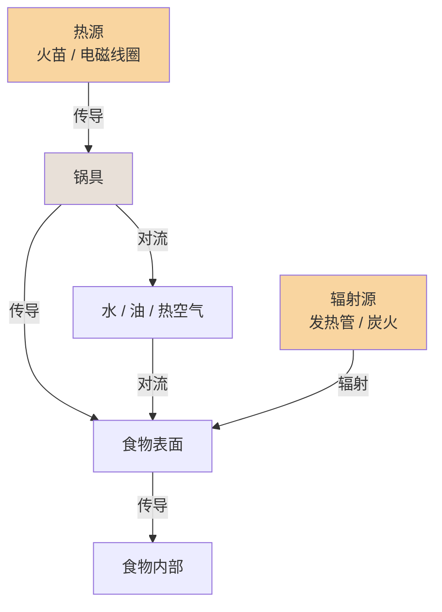
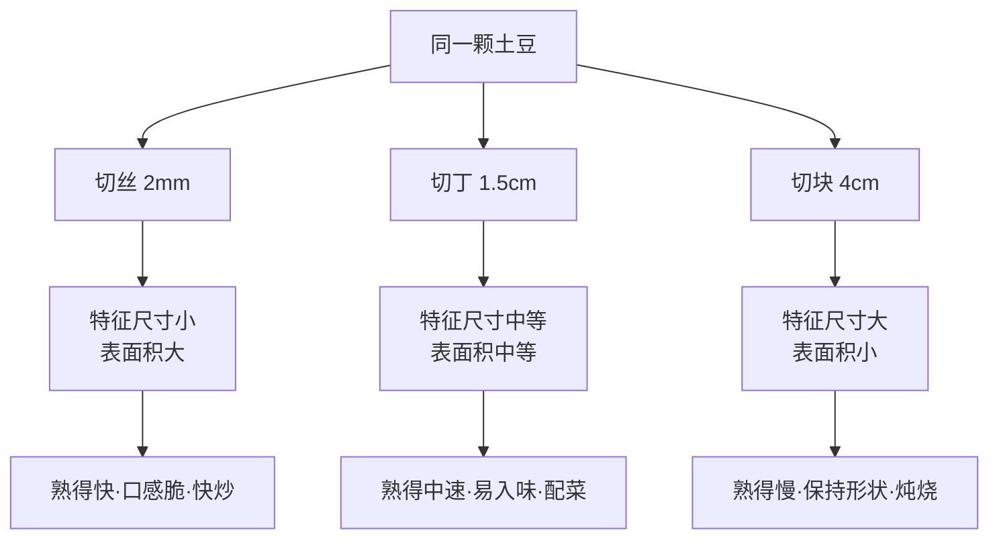
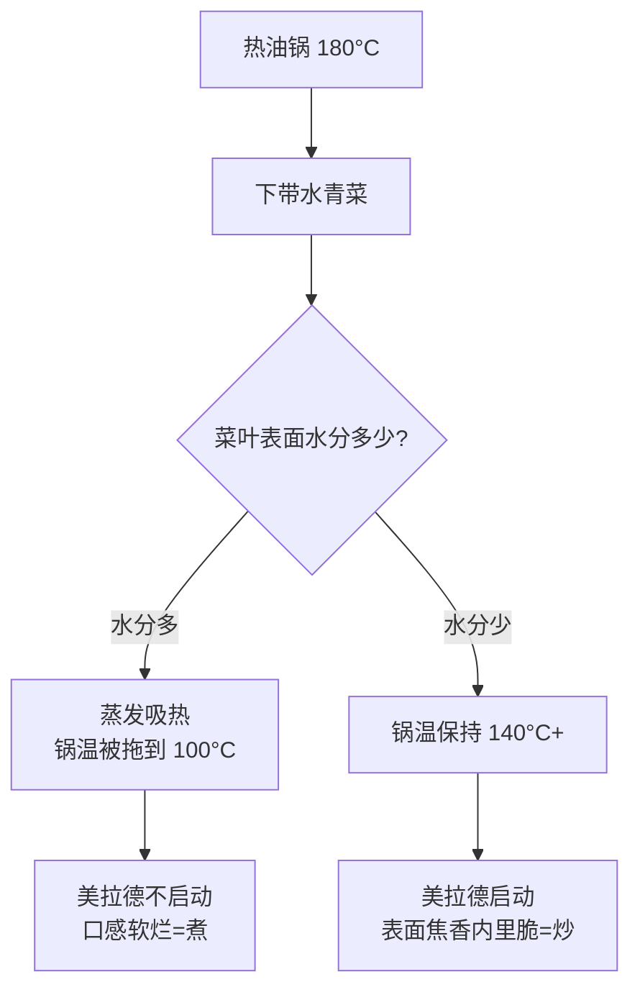
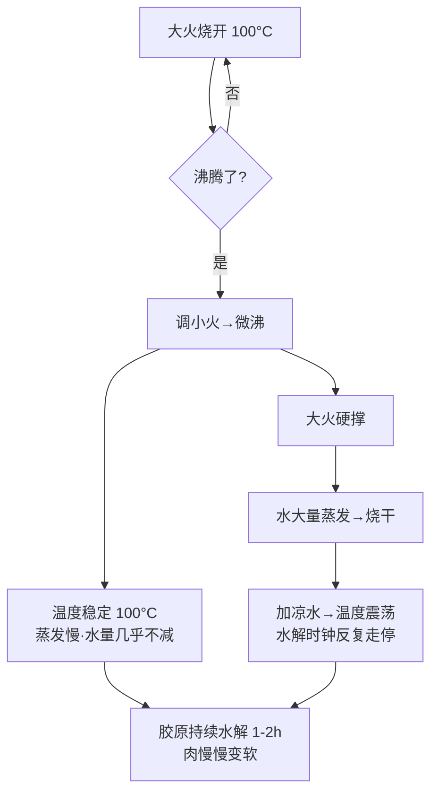
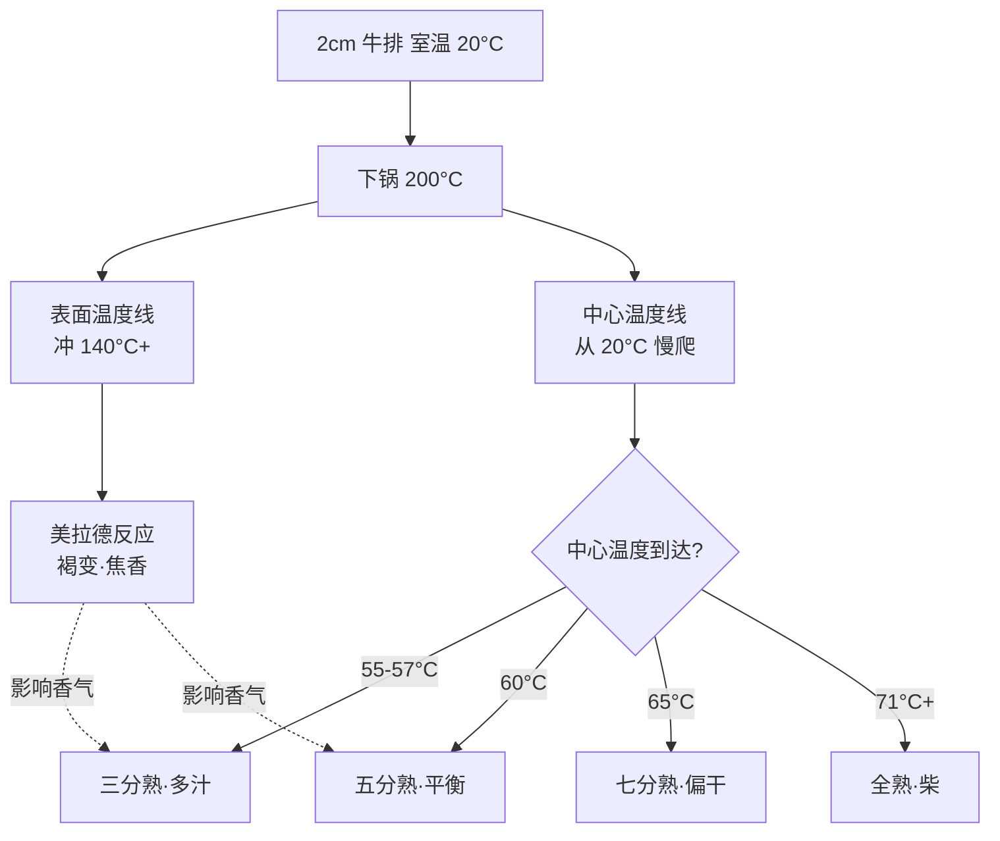

# 《学做饭》全书合集

> 创世游戏系列 · 苏格拉底对话体教材（12 章完整版）


---

# 第 01 章 · 热是什么

> **核心认知**：烹饪的本质，是用热量让食材的内部结构发生不可逆的变化——蛋白质变性、淀粉糊化。理解「熟」，就是理解热如何进入食物、在什么温度下触发什么变化。

> 章首注释：本章从「生的和熟的到底差在哪」这个傻瓜问题出发，推导出「熟 = 结构变化」的底层认知，并建立传热三方式（传导/对流/辐射）与温度意识。终点：读者能解释任何食材「熟」的本质，看懂火候术语背后的物理。

---

## 引子

电磁炉上那口锅，水已经咕嘟咕嘟烧了十分钟。

造物主盯着锅里的鸡蛋，又看了看手里的手机，犹豫了半天才把蛋放了进去。

「熟没熟啊……」他隔着一米距离探头，好像鸡蛋会突然爆炸。

「你连『熟』是什么都不知道，怎么判断它熟没熟？」老谟的声音从身后飘来，手里拎着一根筷子，在桌沿敲了敲，「先说个最笨的问题——生的和熟的，到底差在哪？」

造物主眨眨眼：「差在……能吃不能吃？」

「能吃不能吃，那是结果。我问的是——鸡蛋还是那个鸡蛋，蛋壳里那些东西，加热前后到底发生了什么变化？」

造物主沉默了片刻，盯着锅里滚动的蛋：「……变硬了？」

「哦？『变硬』，你倒是注意到一个现象。那米饭呢？米是硬的，煮熟了反而变软。都是加热，一个变硬一个变软，你那个『变硬』能解释米饭吗？」

造物主噎住了。

---

## 对话引擎

### 第 1 轮：熟的错觉——「消毒说」

**造物主**：「那我换个答案——熟了就是杀菌消毒！生的有细菌，加热把细菌杀死了，就能吃了！」

**老谟**：「那日料店的生鱼片呢？人家切吧切吧就端上来了，也没见谁吃了进医院。」

**造物主**：「那不一样！生鱼片是……是新鲜，海里的鱼干净！」

**老谟**：「你说『干净』？那我们假设：把一块生肉放到 70°C 的水里，泡到细菌全死为止——拿出来，它还是生的颜色、生的口感。你管它叫熟吗？」

**造物主**：「……不叫。」

**老谟**：「那你的『杀菌说』就露馅了。杀死了所有细菌，它还是生的。说明『熟』这件事，跟细菌没关系，跟别的东西有关。」

> 📐 知识锚点：杀菌只是「安全的副作用」
>
> 【概念深挖】加热确实能杀死绝大多数致病微生物（这是食品安全的基础），但「杀菌」不等于「做熟」。一块 70°C 泡到无菌的肉，蛋白质结构基本没变，吃起来还是生肉的口感。杀菌是热量的「副作用」，不是「熟」的定义。
>
> 【工程实践】这也是为什么「巴氏杀菌奶」不是「熟奶」——巴氏杀菌（72°C/15 秒）杀灭了致病菌，但蛋白质几乎不变性，所以它还是「生」的口感和性质（需要冷藏）。你每天喝的牛奶，正好是这个知识点的日常例子。

### 第 2 轮：熟的本质——「结构变了」

**老谟**：「我换个问法。鸡蛋清，生的的时候什么样？」

**造物主**：「透明、稀的、能流动。」

**老谟**：「熟了什么样？」

**造物主**：「白色、凝固的、不流动了。」

**老谟**：「好，你刚才自己说出了答案。透明变白、稀变凝固——这叫什么？」

**造物主**：「……这叫变了个样？」

**老谟**：「对喽。这不叫消毒，这叫**结构变化**。加热让鸡蛋里那些蛋白质分子，从一种结构变成了另一种结构。鸡蛋还是那个鸡蛋，但内部的世界已经重组了。」

**造物主**：「等一下……那我是不是可以这么说：熟，就是热让食物的结构发生了改变？」

**老谟**：「你先别急着立flag。这个『结构改变』到底改的是什么，我们得再往下挖一层。蛋白质只是其中一种，还有别的分子也在变。」

> 📐 知识锚点：熟的两大主角——蛋白质与淀粉
>
> 【概念深挖】构成食物的四大类分子（水、蛋白质、脂质、碳水化合物）里，加热时变化最剧烈的是两类：
> - **蛋白质**（肉、蛋、鱼、奶里的主力）：加热后**变性**（denature）——原本折叠好的分子链松开、再互相纠缠，于是蛋清从透明液体变成白色固体，肉从嫩变紧实。
> - **淀粉**（米、面、土豆里的主力）：加热后**糊化**（gelatinize）——淀粉颗粒吸水膨胀、破裂，于是生米变熟饭、生面变熟面，从硬变软。
>
> 【历史溯源】「变性」这个词来自拉丁语 denaturare，字面意思就是「改变本性」。19 世纪末，德国化学家开始系统研究蛋白质加热后的变化，发现这种变化**不可逆**——你没法把熟鸡蛋变回生鸡蛋。
>
> 【工程实践】这个「不可逆」是烹饪的基石：一旦蛋白质变性、淀粉糊化，食材就回不去了。这也是为什么「做熟」是一个单向过程——你只能把生的做成熟的，没法把熟的还原成生的。

### 第 3 轮：温度是关键——「不是越热越好」

**造物主**：「那我懂了！熟 = 结构变化，加热就行了，越热熟得越快，对吧？」

**老谟**：「你把『熟』想成什么了？煮面条和煎牛排，都叫加热，为什么做出来天差地别？」

**造物主**：「那当然……因为一个用水一个用油？」

**老谟**：「用油还是用水，这只是表面。我问你：水烧开多少度？」

**造物主**：「100 度？」

**老谟**：「油烧热能到多少度？」

**造物主**：「……两三百度？」

**老谟**：「所以你看，同样是『加热』，温度范围完全不一样。水最多 100°C，油能到 200°C 以上。不同的温度，触发的是**不同的变化**——蛋白质变性在 60-80°C 就开始，而让肉表面变褐变香的『美拉德反应』，要 140°C 以上才启动。」

**造物主**：「所以我之前理解反了——不是『越热越好』，是『不同温度做不同的事』！」

**老谟**：「你总算说到点子上了。记住这句话：**温度决定发生什么变化，时间决定变化进行多少。** 这是全书的钥匙，后面每一章都在用。」

> 📐 知识锚点：烹饪温度阶梯（全书的温度地图）
>
> 【概念深挖】把常见的温度节点排成一条线，你就有了理解所有菜谱的温度坐标系：
> - **60-80°C**：蛋白质开始变性（温泉蛋、低温慢煮肉）
> - **~100°C**：水的沸点（煮、炖、蒸的温度天花板）
> - **120-150°C**：美拉德反应开始（煎、烤产生香气和褐色）
> - **160-190°C**：油炸的温度区间
> - **>200°C**：强煎/强烤（快速上色，但要小心糊）
>
> 【工程实践】菜谱里说的「大火」「小火」「中火」，本质都是对**目标温度区间**的翻译。理解了温度阶梯，你就能反过来看懂：为什么炖肉要用小火（要 100°C 左右的温柔环境让胶原慢慢变明胶，而不是让表面烧焦）。

### 第 4 轮：热怎么进到食物里——传热三方式（上）

**造物主**：「温度的事我大概懂了。但还有一个问题：热是怎么从电磁炉跑到食物里面的？总不可能是电磁炉直接『隔空加热』吧……」

**老谟**：「恭喜你，问到了本章最硬核的部分。热要进到食物里，只有三种途径，我们一个个来。先看最直观的——你把锅放在电磁炉上，锅底贴着火源，热直接传给锅，锅再传给食物。这种靠直接接触传热的，叫什么？」

**造物主**：「……叫贴着传？」

**老谟**：「行吧，通俗点叫『贴着传』，学名叫**传导**（conduction）。平底锅煎蛋，就是传导：火焰/电磁的热先给锅，锅贴着蛋的那一面把热传进去。」

**造物主**：「那煮面呢？面条泡在水里，水是流动的，这个也是传导吗？」

**老谟**：「你说到关键了。水是液体，它会流动——锅底的水被加热后变轻上升，上面的冷水下沉，形成循环。这种靠流体流动来搬热的，叫**对流**（convection）。煮面、炖汤，主要靠对流。」

**造物主**：「那……烤箱烤鸡呢？鸡又不是贴着发热管，中间还隔着一层空气。空气也会流动，是不是也算对流？」

**老谟**：「烤箱里既有对流（热空气循环），还有第三种——**辐射**（radiation）。辐射是热以电磁波的形式直接发射出去，不需要介质，像太阳晒热你、烤面包机的发热管烤面包。烤箱烤鸡，三种传热方式全用上了。」

> 📐 知识锚点：传热三方式一览
>
> 【概念深挖】
> | 方式 | 靠什么传热 | 典型场景 | 特点 |
> |------|-----------|----------|------|
> | 传导 | 直接接触 | 煎蛋、铁板烧 | 慢、只在接触面 |
> | 对流 | 流体（水/空气）流动 | 煮、炖、炸、烤箱热风 | 均匀、整体加热 |
> | 辐射 | 电磁波 | 烤、空气炸锅（微波较特殊，另述） | 快、表面先受热 |
>
> 【工程实践】一个菜往往同时用到多种传热方式。比如电磁炉炒菜：电磁感应在锅底产生热（加热锅），热从锅底传导给食物（传导），同时锅里的油和水分在对流（对流）。理解「哪种方式在主导」，就能解释为什么同一道菜用不同锅具结果不一样。



**读图说明**：这张图是「烹饪传热接力链」。左边火苗/电磁线圈代表热源：热量要么直接传导给锅具（B），再由锅具传给食物表面、深入内部（橙色下行线）；要么通过水、油、热空气的对流循环（蓝色回路）搬运到食物表面；右边辐射源则直接以电磁波把热送到食物表面（橙色辐射线）。看这张图的关键是：**热永远是从外往里走**——食物表面先受热，再往中心传导，这就是为什么「外焦里生」会出现（第 4 章会细讲）。同一道菜往往三条路径同时在工作，只是主次不同。

### 第 5 轮：电磁炉到底怎么加热——「锅自己发热」

**造物主**：「等等，你刚才说电磁炉的时候，说『电磁感应在锅底产生热』？电磁炉不是像电热丝那样发热的吗？」

**老谟**：「好问题。这恰恰是电磁炉和燃气灶最大的区别。燃气灶是明火直接烧锅底（传导）。电磁炉呢？它的面板下面有个线圈，通电后产生变化的磁场，磁场透过面板作用在**锅底**上——锅底的金属在磁场里会产生感应电流（涡流），电流流过金属的电阻就发热了。也就是说：**电磁炉不发热，锅底自己发热。**」

**造物主**：「锅自己发热……所以电磁炉对锅有要求？普通的玻璃锅陶瓷锅行不行？」

**老谟**：「你推断得很对。只有**能被磁铁吸住的锅**（铁锅、铸铁锅，以及 430 等铁素体不锈钢）才能在电磁炉上用。注意：常见的 304 不锈钢没有磁性，放在电磁炉上是不热的——很多新手买了一口『不锈钢锅』回家发现电磁炉用不了，就是栽在这。玻璃、陶瓷、铝锅也不行。你去买锅时包装上写的『适用电磁炉』，就是这个意思。」

**造物主**：「难怪！我之前用电磁炉煮东西总觉得火力跟燃气灶不一样，原来是因为热是锅自己发出来的……」

**老谟**：「对，而且这个特性带来一个重要的实操结论：电磁炉的热**直接、集中地发生在锅底**，锅底到锅边的温差比燃气灶更明显。后面第十章讲炒菜时会用到这个知识。现在，我们把这一轮学到的东西收一下——你总结下，热是怎么一层层进到食物里的？」

**造物主**：「热从源头（火/磁场）进入锅具，锅具再通过接触把热传给食物表面，食物表面再往内部传导……同时液体和气体还会流动搬运热量。整个是一条『接力链』！」

**老谟**：「接力链，这个比喻不错。记住它：**烹饪 = 把热沿着一条接力链，送进食物内部的过程。**」

> 📐 知识锚点：电磁炉原理（宿舍党的核心装备）
>
> 【概念深挖】电磁炉利用**电磁感应**原理：线圈通电产生交变磁场 → 磁场穿过锅底金属 → 金属内部产生感应电流（涡流）→ 电流的电阻热加热锅体。核心结论：**热源在锅底本身，不在面板**。
>
> 【工程实践】电磁炉使用要点：① 必须用含铁的锅（能被磁铁吸住）；② 锅底要平整贴合面板，悬空会导致加热不均；③ 电磁炉的「功率档」不等于「温度档」——它控制的是加热功率，锅里实际温度还取决于锅和食材（第十章会细讲）。

### 第 6 轮：落点——「熟」是热写进食物里的一笔

**老谟**：「好，兜兜转转一大圈，我们回到开头那个问题：生的和熟的，到底差在哪？现在你能给我一个完整的答案了吗？」

**造物主**：「熟，就是热量让食物的结构发生了变化——蛋白质变性、淀粉糊化，这种变化不可逆，所以熟了回不去生的。而热要进到食物里，靠的是传导、对流、辐射这三种方式，从热源接力到食物内部。不同的温度触发不同的变化，温度决定发生什么，时间决定进行多少。」

**老谟**：「不赖。那你自己说，这一章我们到底『发明』了什么？」

**造物主**：「我们发明了……一个看烹饪的眼光：任何一道菜，都从『热量怎么进来、在什么温度下、改变了什么结构』这三个问题去看。菜谱看不懂，是因为缺这双眼睛；有了这双眼睛，菜谱就只是温度和时间的地图。」

**老谟**：「这才像个会做饭的人说的话。下一章，我们就拿这双眼睛去看最普通也最容易被忽略的东西——水。水烧开了明明是最『猛』的状态，为什么炖肉反而要调小火？带着这个问题来。」

---

## 严格化走廊

> 把对话里「摸出来的直觉」落成严格形式。

### 定义（精确表述）

**定义 1（蛋白质变性）**：蛋白质分子因受热（或酸、碱、搅打等外因）而失去其天然空间构象、展开为松散肽链并可能互相交联的过程。变性的本质是**分子结构改变**，不是化学键断裂成小分子。判据：变性后蛋白质溶解度下降、生物学活性丧失（如蛋清凝固、肉收紧）。

**定义 2（淀粉糊化）**：淀粉颗粒在水中受热，吸水膨胀、结晶区破坏、颗粒破裂，淀粉分子分散于水中的过程。判据：体系变粘稠透明（如米汤、面糊）。

**定义 3（传热）**：热量从高温物体传递到低温物体的过程。三种方式：
- **传导**：靠分子/原子直接接触传递动能，无需物质宏观移动。
- **对流**：靠流体（液体或气体）的宏观流动携带热量。
- **辐射**：靠电磁波传递能量，无需介质。

**定义 4（温度）**：物质内部分子平均动能的宏观度量。在烹饪语境中，温度决定了**哪些化学反应/物理变化被触发**。

### 定理（带全前提条件）

**定理 1（变性温度区间）**：在常压、含水的条件下，大多数食物蛋白质在约 60-80°C 开始明显变性。
- 前提：蛋白质处于含水环境（干热下变性温度更高，如干烤坚果）。
- 推论：蛋黄在 65°C 左右开始凝固、蛋白在 70°C 左右凝固，这就是「温泉蛋」与「全熟蛋」的区别所在。

**定理 2（水的沸点上限）**：在标准大气压下，水的沸点为 100°C，且沸腾期间温度保持 100°C 不升。
- 前提：标准大气压（海拔升高则沸点降低，高原煮饭要高压锅补偿）。
- 推论：任何「煮」的技法，其食材内部温度都不可能超过 100°C（除非加压）。这决定了炖、煮类技法的温度天花板。

**定理 3（电磁炉传热链）**：电磁炉烹饪中，热量的传递路径为「线圈磁场 → 锅底涡流发热 → 锅底传导给食物 → 食物内部传导」。
- 前提：锅具为铁磁性金属（能被磁铁吸引）；锅底与面板贴合。
- 推论：电磁炉的「热源」在锅底，锅边与锅底存在温差，翻炒时需考虑锅壁的滞后加热。

### 证明（≥1 个完整可复写证明）

**命题**：为什么「煮熟」是一个不可逆过程，即：为什么熟鸡蛋无法变回生鸡蛋？

**证明**（反证 + 分子机制论证）：

**第 1 步**：设熟鸡蛋能变回生鸡蛋。则必须存在某种方式，把已经变性的蛋白质分子恢复到天然的折叠构象（即「复性」，renaturation）。

**第 2 步**：蛋白质天然构象的维持依赖大量**弱相互作用**（氢键、疏水作用、范德华力）的协同配合。这些弱相互作用的能量都在几个 kcal/mol 量级，远低于共价键（几十到上百 kcal/mol）。

**第 3 步**：加热时，热能首先破坏这些弱相互作用，使分子链展开（变性）。此时，分子链之间暴露出的疏水基团会互相纠缠、形成新的交联（如蛋清中的蛋白质分子互相网住，形成凝胶网络），同时部分氨基酸侧链发生不可逆的化学修饰（如与还原糖的美拉德反应，详见第 3 章《油与褐变》）。

**第 4 步**：要将展开且互相交联的分子链「复原」，需要同时精确恢复成百上千个弱相互作用的原始排布，且必须先打断交联。在常压、可食用的温度范围内，不存在任何手段能定向完成这一操作（变性后的聚集态在能量上处于更稳定的「局部最小」）。

**第 5 步**：由第 1-4 步，假设导致矛盾：要复原必须打断交联并精确重构构象，而这在可食用条件下不可能实现。故假设不成立。

**结论**：煮熟是不可逆的。∎

（这个证明的每一步都只用了「弱相互作用 vs 共价键的能量差」和「聚集体处于能量局部最小」两条事实，读者可对着空白纸复写。）

### 反例/边界（钉死适用域）

**反例 1（「消毒 ≠ 熟」）**：巴氏杀菌奶（72°C/15 秒）杀灭了致病菌，但蛋白质几乎未变性——它仍是「生」的性态（需冷藏、口感似生）。说明「杀菌」与「熟」是两件事，杀菌不是熟的定义。

**反例 2（「熟 ≠ 100°C」）**：低温慢煮（sous vide）在 60°C 长时间加热的牛排，蛋白质已充分变性（是熟的），但从未接近 100°C。说明「熟」由**蛋白质变性的程度**决定，不由「达到某个高温」决定。

**边界情况（海拔）**：在海拔 3000 米处，水的沸点降到约 90°C，普通煮饭可能夹生——因为糊化所需温度（约 90°C 以上才能充分糊化）达不到。此时需要高压锅（加压提高沸点）。这说明「100°C」这个数值依赖大气压这一前提条件。

---

## 知识点总结

### 知识点（本章推出的核心概念）
- **熟 = 结构变化**：热让蛋白质变性、淀粉糊化，变化不可逆。
- **变性**：蛋白质分子失去天然构象（蛋清透明液体 → 白色凝固）。
- **糊化**：淀粉颗粒吸水破裂变软（生米 → 熟饭）。
- **传热三方式**：传导（接触）、对流（流体流动）、辐射（电磁波）。
- **温度阶梯**：60-80°C 蛋白变性、100°C 水沸、140°C+ 美拉德反应。
- **温度决定发生什么，时间决定进行多少**：全书核心钥匙。
- **电磁炉 = 锅底自发热**：靠涡流加热铁磁性锅底，热源在锅底。

### 历史结论（本章涉及的史料）
- 「变性」一词源自拉丁语 denaturare（改变本性），19 世纪末德国化学家系统研究蛋白质加热变化。
- 巴氏杀菌法（Louis Pasteur，1860s）：72°C/15 秒，杀灭致病菌但保持「生」的性态——杀菌 ≠ 做熟。
- 电磁感应加热：法拉第 1831 年发现电磁感应；现代电磁炉（1980s 日本家用化）将其用于厨房。

### 工程实践结论（本章知识在真实厨房里怎么用）
- 煮蛋时间表由变性温度决定：蛋黄 65°C、蛋白 70°C，水开后控制时间即可得到溏心/全熟。
- 电磁炉必须用「能被磁铁吸住」的锅；锅底要平整贴合。
- 炖煮类技法温度上限 100°C，所以「炖不烂」的原因不是火不够大，而是时间不够长（胶原蛋白溶解需要时间，详见第 11 章）。
- 烤箱同时用对流+辐射，所以烤出来的东西表面和内部受热路径不同。

---

## 实操训练场

> 原「计算训练场」的烹饪化。每一题都要动手，做完对答案。

### 实操题 1：煮鸡蛋时间表（验证「温度 × 时间」）

**题干**：造物主要给室友煮鸡蛋。已知：鸡蛋在 65°C 蛋黄开始凝固、70°C 蛋白开始凝固；把常温水中的鸡蛋放入沸水后，鸡蛋内部中心温度以约「每分钟上升 8-10°C（前 5 分钟）」的速率逼近水温；而「溏心蛋」要求蛋黄中心不超过 68°C，「全熟蛋」要求蛋黄中心达到 74°C 以上并保持 2 分钟。

（a）估算从下锅到蛋黄中心达到 68°C 大约需要几分钟？（设初始中心温度 25°C，取升温速率 9°C/分钟）
（b）若造物主想要「蛋白全凝固但蛋黄还是流心」的温泉蛋（约 63-65°C），应该在水开后关火焖（水温逐渐降到 70°C 以下），还是保持沸腾？为什么？
（c）为什么 10 分钟以上煮出的蛋黄发绿（蛋黄表面灰绿色）？这与「时间决定变化进行多少」如何对应？

**完整分步解答：**

（a）升温计算：
- 第 1 步：列出已知量。初始中心温度 T₀ = 25°C，目标温度 T = 68°C，升温速率 v ≈ 9°C/分钟。
- 第 2 步：计算需要的温升。ΔT = 68 − 25 = 43°C。
- 第 3 步：计算时间。t = ΔT ÷ v = 43 ÷ 9 ≈ 4.8 分钟。
- 答：大约 **5 分钟**（这就是「水开下锅煮 5 分钟溏心蛋」说法的来源——鸡蛋中心刚好到 68°C 附近，蛋黄将凝未凝）。

（b）温泉蛋的做法判断：
- 第 1 步：温泉蛋要求蛋黄中心 63-65°C。若保持沸腾，水温恒为 100°C，中心会一直升到 100°C——蛋黄必然全熟，不符合要求。
- 第 2 步：若关火焖，水温从 100°C 缓慢下降，中心温度在升到 65°C 附近后，随着水温下降而停止上升（热平衡），蛋黄保持在「将凝未凝」状态。
- 答：**应该关火焖**。原理正是「温度决定发生什么变化」——用下降的水温把蛋黄钉在 65°C 的窗口里。

（c）蛋黄发绿的解释：
- 第 1 步：长时间加热（>10 分钟）时，蛋黄中蛋白质释放的硫（来自含硫氨基酸）与蛋黄中的铁反应，生成**硫化亚铁**（灰绿色）。
- 第 2 步：这符合「时间决定变化进行多少」——温度没变（都是 100°C），但反应随时间的积累而发生了。
- 答：灰绿色是硫化亚铁，无害但影响卖相；少煮 1-2 分钟即可避免。

**常见错误**：以为「火越大蛋熟得越快越好」，实际水温恒 100°C，火大小只影响水保持沸腾的速度，不影响蛋中心温度——蛋的熟度只由**时间**控制。

### 实操题 2：电磁炉功率 vs 温度（读懂自己的装备）

**题干**：造物主的电磁炉有 5 档功率（400W/800W/1200W/1600W/2000W）。他煮一锅 1.5L 的水，用 2000W 档，从 20°C 烧到沸腾用了约 5 分钟。已知水的比热容 4.2 kJ/(kg·°C)。

（a）这锅水从 20°C 到 100°C 实际吸收了多少热量？（忽略散热）
（b）2000W × 5 分钟 = 600 kJ 的电能，与实际吸收热量对比，效率约是多少？多出来的能量去哪了？
（c）他用同一电磁炉炖汤，水开后把功率从 2000W 调到 800W——汤的温度会下降吗？为什么？

**完整分步解答：**

（a）吸热计算：
- 第 1 步：列出已知量。m = 1.5 kg，c = 4.2 kJ/(kg·°C)，ΔT = 100 − 20 = 80°C。
- 第 2 步：代入公式 Q = mcΔT = 1.5 × 4.2 × 80。
- 第 3 步：计算 Q = 1.5 × 4.2 = 6.3；6.3 × 80 = **504 kJ**。

（b）效率计算：
- 第 1 步：输入电能 W = 2000 W × 300 s = 600 kJ。
- 第 2 步：效率 η = Q ÷ W = 504 ÷ 600 = 84%。
- 第 3 步：另外 16%（约 96 kJ）去哪了？——散失到空气（锅壁散热）、蒸发的水汽带走汽化潜热、面板和锅底传导损耗。
- 答：**约 84%**，损耗主要是散热和蒸发。

（c）火力调小的判断：
- 第 1 步：水沸腾时温度恒为 100°C（定理 2）。只要还在沸腾，水温就是 100°C，不会因为功率降低而下降。
- 第 2 步：800W 档的热量输入刚好能维持沸腾（抵消散热），水保持 100°C 微沸——这正是炖汤想要的「小火慢炖」状态。
- 答：**温度不会下降**（仍为 100°C），只是沸腾的剧烈程度降低。这就是「炖肉要调小火」的物理本质：不是降低温度，而是降低热量输入、减少水分蒸发，让炖煮更温和持久。

**常见错误**：以为「小火 = 温度更低」，实际沸腾状态下温度恒 100°C，小火改变的是**沸腾剧烈程度**和**蒸发速率**。

---

## 向导便签

> **本章干了什么**：把「熟」从「杀菌消毒」的错觉里解放出来，钉死为「热引起的不可逆结构变化」；建立了传热三方式（传导/对流/辐射）与电磁炉「锅底自发热」的认知；拿到全书钥匙——「温度决定发生什么，时间决定进行多少」。
>
> **钉死一句话**：任何菜谱，都是在问三个问题——热从哪来、什么温度、持续多久。
>
> **毒舌收口**：「你以为你在做饭，其实你在做化学。区别只是，化学家管这叫反应，你管这叫翻车。」

## 造物主手记

**我曾踩的坑**：一直以为「熟 = 杀菌」，所以煮东西只要「够热」就行。现在我明白了：如果只追求杀菌，我煮出来的是一锅结构没变的「消毒生肉」；真正让我把饭做熟的，是让蛋白质变性、淀粉糊化的那 60-100°C。

**顿悟时刻**：听懂「温度决定发生什么，时间决定进行多少」的那一刻——原来菜谱里所有「大火」「小火」，翻译过来都是「我要触发哪种变化」。

## 自测题

1. 为什么巴氏杀菌奶不是「熟奶」？（提示：从「杀菌 ≠ 熟」的角度答）——*简答要点：杀菌只杀微生物，蛋白质未变性，结构未变，故仍为「生」的性态。*
2. 煎蛋、煮面、烤箱烤鸡分别主要靠哪种传热方式？——*简答要点：煎蛋=传导；煮面=对流；烤鸡=对流+辐射。*
3. 为什么电磁炉不能用玻璃锅？——*简答要点：玻璃无铁磁性，不能产生涡流，锅底不会自发热。*
4. 高原上煮饭为什么容易夹生？怎么解决？——*简答要点：气压低→沸点低于 90°C→淀粉糊化不充分；用高压锅加压提高沸点。*

## 预告

下一章，我们要对着最普通的水发问：水烧开了不是最猛的状态吗？为什么炖肉反而要调小火？——答案会推翻「火越大越好」这个直觉，也会第一次用上「温度决定发生什么」这把钥匙。


---

# 第 02 章 · 水的力量

> **核心认知**：水烧开后温度就被 100°C 钉死了，火再大，升的不是温度，是蒸发和翻滚。「调小火」不是降温，是把沸腾从「暴烈」换成「温柔」——煮炖的世界里，100°C 是天花板，时间才是唯一的裁判。

> 章首注释：本章从「水烧开了不是最猛吗？为什么炖肉反而要调小火？」这个人人踩过的直觉陷阱出发，推导出沸点钉死、汽化潜热、蒸汽传热三大认知，把上一章的钥匙「温度决定发生什么，时间决定进行多少」第一次真正用在煮炖里。终点：读者能解释炖肉为什么不能大火，看懂「微沸」「蒸」背后的物理。

---

## 引子

「咕嘟——咕嘟——」

锅里的排骨汤发出一阵比一阵急的翻滚声，像有什么东西在里面打架。造物主站在电磁炉前，手指悬在功率键上方，犹豫了两秒，又连着按了两下「+」——指示灯一路跳到 2000W。

水面彻底失控了。白色的汤浪涌上来，顶得锅盖哐哐作响，汤水顺着锅沿往下淌，在面板上嘶嘶地冒烟。他赶紧伸手压住锅盖，就这么等了一会儿，夹起一块排骨咬了一口。

硬的。

他有点不服气——火都开到最大了，水都沸腾成那个样子了，凭什么肉还不烂？

「水烧开了不是最猛的吗？」他冲隔壁的老谟喊，「为什么炖肉反而要调小火？」

老谟没看他，正慢悠悠地给一壶凉白开倒进玻璃杯：「你先把『最猛』这两个字，给我解释一下。」

---

## 对话引擎

### 第 1 轮：烧开之后，火再大温度也不升了

**造物主**：「最猛就是……温度最高啊！火最大，水最烫，排骨熟得最快。」

**老谟**：「好。那水烧开之后，是多少度？」

**造物主**：「100 度。」

**老谟**：「那我把电磁炉从 800W 开到 2000W，锅里的水会变成多少度？」

**造物主**：「……还是 100 度吧？烧开之后温度好像就不往上走了。」

**老谟**：「你刚才说『最猛 = 温度最高』。现在你自己承认了：火再大，水温纹丝不动。那你的『最猛』猛在哪？」

**造物主**：「猛在……水翻滚得厉害！气泡一串一串往上冒，盖子都要顶飞了。」

**老谟**：「行，那我们先记下这句：**开大火，水温不升，只让水更「闹」**。这个把温度钉死的规则，有个名字，但先不急——你告诉我，它凭什么能钉住？」

> 📐 知识锚点：沸点——水的温度天花板
>
> 【概念深挖】在标准大气压下，水加热到 100°C 就到达**沸点**（boiling point）：液体内部和表面同时剧烈汽化，冒出大量气泡。关键性质是——**到达沸点之后，继续加热，水温保持 100°C 不再上升**。这不是电磁炉不够力，是物理规则：再多输入的热量，都被「把水变成蒸汽」这个动作吃掉了。
>
> 【概念深挖】所以「大火猛炖」是一个彻头彻尾的错觉。你看到的大火 + 翻滚，猛的不是温度（还是 100°C），是**汽化的剧烈程度**。上一章我们说「温度决定发生什么」——在煮炖这个舞台上，温度只有一个档位：100°C。
>
> 【工程实践】这就是为什么菜谱里「大火烧开」「小火慢炖」这两种说法能并存：**烧开靠大火（快），炖靠小火（温柔）**——一旦烧开了，温度就到顶了，接下来怎么炖，跟火力大小关系不大。

### 第 2 轮：多出来的热量去哪了

**造物主**：「等等，那我开 2000W，多送的热量总不能凭空消失吧？它去哪了？」

**老谟**：「你盯着锅里看。那些咕嘟咕嘟往上冒的气泡，是什么？」

**造物主**：「水蒸气……吧。」

**老谟**：「水从液态变成气态，需要热量吗？」

**造物主**：「肯定需要啊，烧水的时候一直冒汽，特别费火。」

**老谟**：「那你对比一下：让 1 升水温度升高 1°C 需要多少热量，和让这 1 升水整个变成蒸汽需要多少热量——哪个多？」

**造物主**：「……直觉上，汽化好像多得多？不然烧开的水不会那么费事。」

**老谟**：「多得多，具体是多少倍？这个数后面有专门的计算板块，你翻过去看。我现在只问你一句：既然汽化要吞掉一大笔热量，那沸腾的那一分钟里，2000W 的热量在干嘛？」

**造物主**：「在……把水变成蒸汽？」

**老谟**：「对。水在 100°C 时，多送的热量全部去供「水→蒸汽」这笔买卖了。这笔买卖有个专门的术语，叫**汽化潜热**——记住这个词，它是本章第二颗钉子。」

> 📐 知识锚点：汽化潜热——水变蒸汽要「先付一大笔钱」
>
> 【概念深挖】**汽化潜热**（latent heat of vaporization）指单位质量的液体在沸点温度下完全汽化所需吸收的热量。水的这个值高达约 **2260 kJ/kg**——作为对比，让 1 kg 水温度升高 1°C 只需要 4.2 kJ。也就是说：**把水烧开（从 0°C 到 100°C）只需约 420 kJ/kg，而让烧开的水全部蒸发，还要再花 2260 kJ/kg**，是前者的五倍还多。
>
> 【概念深挖】这就是沸腾时水温钉死的物理原因：能量守恒——输入的热量被汽化这一过程持续吸收，水温自然不再上升。汽化吸热同时也是「出汗能降温」「吹风让水凉得更快」这些日常现象的根源：液体蒸发时带走了自身的热量。
>
> 【历史溯源】「潜热」（latent heat）这个词来自苏格兰化学家约瑟夫·布莱克（Joseph Black），1760 年代他研究冰融化和水汽化时发现：温度不变，热却一直在被「吸收」。他把这种「藏起来的热」命名为「潜热」——latent，拉丁语里就是「隐藏」的意思。他在 1761 年前后测出水的汽化潜热约为同质量水升高 1°C 所需热量的数百倍，为蒸汽机效率的理论奠基铺了路。

### 第 3 轮：蒸汽凭什么更「烫」

**造物主**：「那我有个更怪的疑问——蒸汽不也是 100 度吗？跟开水一样啊。可我被开水烫到还好，被蒸汽烫到疼得多，小时候掀锅盖差点被烫哭。同样是 100 度，凭什么？」

**老谟**：「你自己上一轮刚把那笔账算明白，现在自己把它用上。蒸汽和水差在哪？蒸汽是什么变来的？」

**造物主**：「水变来的……变的时候吸了一大笔汽化潜热。」

**老谟**：「那蒸汽要是变回水呢？」

**造物主**：「……吸的热得还回去？变回水要放热！」

**老谟**：「你这话接住了。蒸汽碰到你的皮肤，变成水，冷凝的那一瞬间，把那笔 2260 kJ/kg 的汽化潜热**原封不动还给你**。你被开水烫，只收到「水从 100 度凉到体温」的账；被蒸汽烫，是「冷凝放潜热 + 再凉到体温」两笔账连着结——疼，是因为它付了双份。」

> 📐 知识锚点：蒸汽传热——藏在冷凝里的两倍热量
>
> 【概念深挖】当蒸汽碰到较冷的表面时，它**冷凝**（condense）成水，同时释放出与汽化潜热等量的热。这是蒸汽传热的威力所在：**单位质量蒸汽冷凝释放的热量 ≈ 2260 kJ/kg，远远大于同质量热水从 100°C 凉到室温放出的热（约 300 kJ/kg）**。所以蒸汽烫伤比同温度热水烫伤严重得多——这不是「温度」的差别，是「相变潜热」的差别。
>
> 【工程实践】这个「潜热翻倍」也正是**蒸**这种技法高效的原因：蒸汽碰到食物表面，冷凝放热，把热量直接、密集地贴在食材表面。你以为蒸靠的是「热空气」？不，蒸靠的是**蒸汽冷凝时还回来的那笔潜热**——这是蒸汽传热的真正引擎。

### 第 4 轮：蒸和煮都是 100 度，凭什么蒸出来的菜不一样

**造物主**：「那我明白了，蒸就是靠蒸汽冷凝放热来加热。可还有个问题——蒸和煮温度都是 100 度，为什么蒸出来的菜和煮出来的完全不一样？蒸的嫩，煮的泡在汤里，味道都淡了。」

**老谟**：「你同时注意到两个现象：嫩、淡。先想淡——煮的时候菜泡在水里，菜里的味道、营养，会往哪走？」

**造物主**：「往水里跑？煮出来的汤有味道，说明东西进了汤。」

**老谟**：「对。煮是『泡澡』——可溶的东西被水带走。蒸呢？菜不泡在水里，蒸汽只是路过，放完热就走，可溶的东西还在菜里。这是第一笔账。第二笔——你说蒸的嫩，想想蒸汽碰到菜之后发生了什么？」

**造物主**：「冷凝，放热，变成水……」

**老谟**：「变成的那点水，是蒸汽自己贡献的。它贴住表面放热，然后呢？」

**造物主**：「然后……继续有蒸汽扑上来，一层一层地送热？」

**老谟**：「对。蒸汽传热是**全方位包裹、持续送热**——它贴着整个表面同时加热，不靠锅底，所以不需要翻动，也不会把菜冲得东倒西歪。这就是为什么蒸出来的鱼不会碎、蒸蛋那么滑嫩。」

> 📐 知识锚点：蒸——100°C 的「干式」加热
>
> 【概念深挖】常压下蒸的温度同样是 100°C（水的沸点上限），但蒸和煮的**传热路径和物料条件**完全不同：
> - **煮**：食材泡在沸水里，靠对流（水流翻滚）把热带给食材，同时食材的可溶成分持续溶进水中——这是「有交换」的加热。
> - **蒸**：食材悬于蒸汽中，蒸汽在表面冷凝放潜热，加热后变成的水自然滴落，食材不泡水——这是「纯送热、无交换」的加热。
>
> 【工程实践】由此得出三个实用结论：① 蒸不流失可溶物，所以海鱼、蛋羹、排骨这类要「鲜、嫩、原味」的食材适合蒸；② 蒸不需要锅底接触，所以食物受热均匀、不易碎；③ 蒸锅是密封的，蒸汽在密闭空间里反复冷凝放热，效率反而高——宿舍没有蒸锅时，用电饭煲放个蒸架、锅里加水，一样能蒸（详见实操训练场）。

### 第 5 轮：那炖排骨，到底该大火还是小火

**老谟**：「知识铺垫够了，回到你那锅排骨。既然大火小火水温都是 100 度，你大火炖，错在哪？」

**造物主**：「……错在……错在水太闹？」

**老谟**：「闹在哪？你仔细观察一下，大火炖的汤是什么样子。」

**造物主**：「翻滚得厉害，像开锅一样，还往外溢。」

**老谟**：「翻滚、溢锅，这是温度在变吗？」

**造物主**：「不是……是水在剧烈地动！是蒸发猛、气泡多！」

**老谟**：「对。同样的 100 度，大火的区别在于**蒸发更猛、翻滚更凶**。翻滚把排骨在锅里冲来撞去——肉还没炖软，先被冲散了；蒸发猛，水耗得快，一小时干掉一大半，汤比排骨先没了。」

**造物主**：「所以小火是……」

**老谟**：「别急，你自己说。」

**造物主**：「小火是让水烧开之后**别那么闹**——保持温度，把蒸发和翻滚降下来，让排骨安安静静地泡在 100 度的水里，泡够时间？」

**老谟**：「你终于把话说到汤里了。这个状态有个名字，叫**微沸**——水面轻轻涌动，偶尔冒几个泡，温度同样是 100 度，但不暴烈、不溢锅、水耗得慢。炖肉要的就是它。」

> 📐 知识锚点：沸腾 vs 微沸——同一个温度，两种脾气
>
> 【概念深挖】**沸腾**（剧烈沸腾）与**微沸**（simmer）温度相同，都是水的沸点（常压 100°C），区别在于**汽化的剧烈程度和流体的翻滚强度**：
> - 剧烈沸腾：气泡大量、快速生成，液体强烈翻滚——蒸发快、扰动大、易溢锅。
> - 微沸：气泡稀疏、缓慢，液面轻轻涌动——蒸发慢、扰动小、能长时间维持。
>
> 【工程实践】「温度决定发生什么，时间决定进行多少」——在炖煮里，两个状态温度相同（决定发生的「什么」一样），差别全在**维持的代价**：剧烈沸腾蒸发快（水费）、扰动强（肉易碎、汤易浊）；微沸让同一锅 100°C 的水安安静静地陪食材待满数小时。所以「炖肉调小火」的本质不是降温，是**把暴烈的沸腾换成温柔的微沸**。

### 第 6 轮：电磁炉的功率到底管什么

**造物主**：「可我还是有点不甘心——那电磁炉上的 800W、2000W 到底差在哪？总不能是摆设吧？」

**老谟**：「我反问你：你从冷水开始烧，想快点开，用哪档？」

**造物主**：「2000W 啊，大功率烧水快。」

**老谟**：「对。功率管的是**热量送得多快**——也就是把水从 20 度烧到 100 度，需要多久。烧开之前，功率越大，升得越快。可一旦烧开了，温度被 100 度钉死，多送的功率去哪了？」

**造物主**：「……全去蒸发和翻滚了。」

**老谟**：「所以电磁炉的功率，在烧开前是『速度』，烧开后是『脾气』——它管不了水温，只管水闹得多凶、蒸发得多快。这跟你那口锅是不是自发热没关系，上一章说过的锅底自发热，说的是热从哪来；今天说的是热送来之后，被什么接住。两码事。」

**造物主**：「那我明白了——**功率决定加热速度，不决定最终温度**。水温的天花板，从来不是电磁炉定的，是水自己定的。」

> 📐 知识锚点：电磁炉功率与水温——「速度」和「上限」是两回事
>
> 【概念深挖】把「功率」和「温度」的关系钉死：功率（W）描述**单位时间输送热量的多少**，决定的是升温的**快慢**；而温度能达到的**上限**，由物质的相变点（水的沸点）决定。这就是为什么「加大功率」能缩短烧开的时间，却永远无法把沸腾的水烧到 101°C——上限在相变那里，不在火源那里。
>
> 【概念深挖】这张图把一锅水从点火到炖完的「热量去向」完整画了出来。关键是第二行分叉：温度没到 100°C 时，热量去升温；到了 100°C，热量全去汽化——同一个炉子，两种工作方式。
>
> ```mermaid
> flowchart TD
>     A["电磁炉输出热量 P（功率）"] --> B{"水温到 100°C 了吗？"}
>     B -- "没到" --> C["热量用于升温<br/>1 kg 水升 1°C 需 4.2 kJ"]
>     C --> G["水温上升<br/>趋近 100°C"]
>     B -- "到了，沸腾中" --> D["热量用于汽化<br/>1 kg 水汽化需 2260 kJ"]
>     D --> E["水面翻滚、气泡上浮"]
>     D --> F["蒸汽逸出、带走热量"]
>     E --> H["火力越大：翻滚越凶、蒸发越快<br/>水温保持 100°C 不变"]
>     F --> H
> ```
>
> **读图说明**：从最上方「电磁炉输出热量」出发，第一个判断节点问水温到没到 100°C。走左侧支路（没到）：热量全部用于「升温」，1 公斤水每升 1°C 花 4.2 kJ，水温不断爬升。走到右侧支路（到了）：热量转向「汽化」，1 公斤水全部蒸掉要花 2260 kJ——比升温贵五倍多。汽化的两个去向（翻滚、蒸汽逸出）最终都汇到最下方一行：火力越大，翻滚越凶、蒸发越快，但水温始终钉在 100°C。读图记住一句话：**这张图里，水温那条线是平的，变化的只是热量的去向。**
>
> 【实现思考】如果让你用电磁炉实现一个「炖肉火候自动机」——让人设定「先烧开，再小火 1 小时」，机器自己完成，你会怎么设计？——最简单可靠的方案是**状态机**：阶段一「烧开」（用 2000W，直到锅里的水达到 100°C），阶段二「慢炖」（切到 800W 保持微沸，直到定时器到点）。关键在于**状态切换的触发信号**：你没法直接测水温，就得用「可观察现象」当信号——比如「水是否在剧烈沸腾」这个视觉信号，或者干脆不检测，就用「时间 + 固定功率」开环控制（2000W 烧 X 分钟保证烧开，再切 800W 炖 Y 分钟）。这正是宿舍电磁炉内置「火锅/煲汤」模式干的事。设计这个自动机的过程，就是在把本章的「功率管速度、温度有上限、汽化吞热量」三条认知落地成代码。

### 第 7 轮：落点——温度决定发生什么，时间决定进行多少

**老谟**：「把那锅排骨汤端过来。」

造物主关火，把锅端上案板。翻滚渐渐平息，水面只剩零星的小气泡，一个接一个地冒起来又破掉。

**老谟**：「现在，看着这锅水。假设你要把排骨重新炖一遍——从这一秒开始，你是把火力继续顶到 2000W，还是调到 800W？」

**造物主**：「……800W。保持微沸。」

**老谟**：「依据呢？就对着眼前这锅水说。」

**造物主**：「水温已经到 100 度了，再大火也不会更热，只会让水面像刚才那样翻滚、蒸发。眼前这种零星冒泡的状态，就是微沸——温度一样是 100 度，但水耗得慢、不冲排骨。炖肉要的就是它，所以我现在就该换小火。」

**老谟**：「你把上一章的钥匙，自己用了一遍。温度决定发生什么——煮炖的世界里温度就一个档位，100 度，蛋白质变性、淀粉糊化都在这个温度下发生；时间决定进行多少——炖得烂不烂，全靠时间给够没有，火力再大也骗不了时间。」

**造物主**：「所以我应该：水烧开后**转小火**，保持微沸，然后……把时间喂够。大火只该出现在『把水烧开』这一小段里。」

**老谟**：「你这一句，就是本章的全部。现在我有一个新问题要问你——水能到 100 度，那如果有一种液体，温度能轻松超过 100 度呢？用它做菜，会发生什么不一样的事？」

**造物主**：「超过 100 度……会触发更猛的变化？」

**老谟**：「带着这个问题来。下一章，我们聊聊那个能超过 100 度的东西——油。」

---

## 严格化走廊

> 把对话里「摸出来的直觉」落成严格形式。

### 定义（精确表述）

**定义 1（沸点）**：在给定外界压强下，液体的饱和蒸气压等于外界压强时的温度。达到该温度后，液体内部和表面同时剧烈汽化（沸腾）。标准大气压（101.325 kPa）下纯水的沸点 T_b = 100°C。

**定义 2（汽化潜热）**：单位质量的液体在沸点温度下完全汽化所需吸收的热量，记作 L_v。水的汽化潜热 L_v ≈ 2260 kJ/kg。汽化过程**温度不变**，热量全部转化为分子间分离所需的能量。

**定义 3（沸腾 vs 微沸）**：沸腾是液体内部大量成核并快速生长气泡、液体强烈翻滚的汽化状态；微沸是气泡稀疏、液面轻微涌动的温和汽化状态。两者处于同一温度（沸点），区别在于汽化速率与流体扰动强度。

**定义 4（蒸汽冷凝放热）**：蒸汽遇冷表面凝结为液体时，释放等量于汽化潜热的热量。这是蒸汽传热的机制核心。

### 定理（带全前提条件）

**定理 1（沸腾温度钉死）**：在恒定外压 p 下，持续沸腾的纯液体温度恒等于该压强下的沸点 T_b(p)，不随加热功率增加而升高。
- 前提：液体为纯物质（水的 T_b=100°C 针对常压纯水）；外压恒定；液体持续沸腾。
- 推论：常压下任何「煮」的技法，锅内液体及浸没食材的温度都不可能超过 100°C。这决定了煮炖类技法的温度天花板。

**定理 2（汽化速率与功率）**：沸腾达到稳态时，液体的汽化速率 dm/dt 与输入功率 P 的关系为 dm/dt = P_有效 / L_v，其中 P_有效 为实际用于汽化的功率。
- 前提：稳态沸腾（水温恒为沸点）；忽略散热（或散热已从 P_有效 中扣除）。
- 推论：功率加倍 → 汽化速率加倍 → 蒸发耗水量加倍，而水温不变。这就是「大火炖汤水耗快一倍」的定量来源。

**定理 3（蒸汽冷凝放热量）**：单位质量蒸汽在同一温度下冷凝为液体时放出的热量等于其汽化潜热 L_v。
- 前提：蒸汽为饱和蒸汽、冷凝前后温度均为沸点。
- 推论：蒸汽烫伤的损伤能量来自「冷凝潜热 + 降温显热」两笔，远大于同温度热水。

### 证明（≥1 个完整可复写证明）

**命题**：为什么持续沸腾时，水温恒定在 100°C，功率再大也不升高？

**证明**（反证法 + 能量守恒）：

**第 1 步**（设反假设）：设常压下某时刻水温 T > 100°C。

**第 2 步**（饱和蒸气压的单调性）：水的饱和蒸气压 p_sat(T) 是温度 T 的单调递增函数（这是由克劳修斯—克拉佩龙关系确定的事实，方向：温度越高，液体分子越容易挣脱液面，蒸气压越大）。故 T > 100°C ⇒ p_sat(T) > p_sat(100°C) = 101.325 kPa。

**第 3 步**（气泡存在的力学条件）：液体内部的气泡若要存活，气泡内气压 p_b 必须至少等于外界压强 p_ext = 101.325 kPa + 液柱静压 > 101.325 kPa。由第 2 步，当 T > 100°C 时，p_sat(T) > p_ext，故气泡内的蒸气压力足以支撑气泡长大并上浮逸出——这正是沸腾的力学定义。因此，**只要 T > 100°C，沸腾就处于「狂暴」状态**，汽化速率极高。

**第 4 步**（能量守恒收束）：沸腾过程中，输入热功率 P 只能有三个去向：① 升高水温；② 供汽化（潜热）；③ 向环境散热。汽化带走的热量为 (dm/dt)·L_v，其中 L_v ≈ 2260 kJ/kg 是一个巨大的常数。若水温试图继续升高（去向 ①），由第 2、3 步，汽化速率 dm/dt 会随之急剧增大（饱和蒸气压更高、气泡更猛），去向 ② 消耗的热量急剧增加，把输入的热量「吸走」，水温重新回落。

**第 5 步**（唯一稳定态）：稳态要求水温不再变化。由第 1-4 步，唯一能维持稳态的水温是使 p_sat(T) = p_ext 的温度，即 T = 100°C（常压下）。任何偏离 100°C 的尝试，都会被汽化速率的变化自动拉回。

**第 6 步**（反假设矛盾）：第 1 步假设 T > 100°C，但第 2-5 步表明 100°C 是唯一稳定的沸腾温度，故假设不成立。

**结论**：常压持续沸腾的水温恒为 100°C，与加热功率无关。∎

（这个证明只用了「饱和蒸气压随温度单调递增」与「能量守恒」两条事实。第 4 步是核心：汽化潜热巨大，是它把温度死死钉在沸点上。读者可对着空白纸复写。）

### 反例/边界（钉死适用域）

**反例 1（加压改变沸点——高压锅）**：把锅密封，通过加压使外压 p_ext 升高，则沸点随之升高。高压锅内压强约 2 个大气压，沸点升至约 120°C。此时炖肉温度上限从 100°C 提到 120°C——温度更高，胶原溶解等需要温度+时间的反应被同时加速，所以高压锅炖肉明显更快。这说明「100°C 上限」依赖「常压」这一前提，不是绝对真理。

**反例 2（减压降低沸点——高原）**：海拔升高，大气压下降。约每升高 300 米，沸点下降约 1°C。海拔 3000 米处沸点约 90°C，煮饺子、煮米饭可能「永远差一口气」（淀粉糊化需要约 90°C 以上才能充分进行）。解决方式是高压锅（加压）或延长烹煮时间（在较低沸点下把时间喂够）。

**边界情况（盐水）**：往水里加盐会升高沸点吗？会，但幅度微乎其微——1 L 水加一勺盐（约 10 g），沸点升高不到 0.1°C，对烹饪没有任何实质影响。加盐真正的作用是**味道和渗透**，不是「让水更烫」。别再用「加点盐容易煮熟」这个说法骗自己。

---

## 知识点总结

### 知识点（本章推出的核心概念）
- **沸点**：常压下水的沸点 100°C，到达后温度封顶，加热功率不改变水温。
- **汽化潜热**：水在沸点汽化需吸收约 2260 kJ/kg（升 1°C 只需 4.2 kJ/kg）——多送的热量全部被汽化吞掉。
- **沸腾 vs 微沸**：同一温度，区别在汽化剧烈程度与翻滚强度；炖肉要微沸。
- **蒸汽冷凝放热**：蒸汽冷凝释放等量潜热，蒸汽传热/蒸汽烫伤/蒸制技法都源于此。
- **蒸的原理**：100°C 的蒸汽在食材表面冷凝放热，全方位包裹、不泡水、不流失可溶物。
- **功率 vs 温度**：电磁炉功率决定加热「速度」，不决定「最终温度」；烧开前管速度，烧开后管蒸发。
- **钥匙的首次应用**：温度决定发生什么（煮炖里恒为 100°C），时间决定进行多少（炖烂全靠时间）。

### 历史结论（本章涉及的史料）
- 「潜热」概念由苏格兰化学家约瑟夫·布莱克提出（1760 年代）：温度不变但热持续被吸收，他把这种「藏起来的热」命名为 latent heat。
- 水的汽化潜热远超同质量水的升温热（约 5 倍以上），这一数据为蒸汽机热效率的理论研究奠基。
- 高压锅的历史可追溯到 17 世纪末法国物理学家丹尼斯·帕潘（Denis Papin）的「蒸汽蒸煮器」——最早用「加压升高沸点」来加速炖煮的尝试。

### 工程实践结论（本章知识在真实厨房里怎么用）
- 炖肉流程标准化：**大火烧开（快）→ 转小火微沸（温柔）→ 喂够时间（慢）**。大火只负责烧开，炖的过程交给小火。
- 炖汤中途发现水少了，加**热水**而不是冷水——加冷水会让沸腾短暂中断、温度骤降，延长加热时间。
- 蒸的替代方案：宿舍没有蒸锅，电饭煲加水 + 蒸架 + 食材，一样能蒸——关键是密闭空间让蒸汽反复冷凝放热。
- 观察「咕嘟程度」判断水温：剧烈翻滚 = 大火沸腾（蒸发快、水耗大）；轻涌微沸 = 小火慢炖（省水、温柔）——这是不依赖温度计的实用水温观察法。

---

## 实操训练场

> 每一题都要动手算、动手做，做完对答案。

### 实操题 1：一锅水的热量账——功率到底管「速度」还是「温度」

**题干**：造物主的电磁炉有 5 档（400W/800W/1200W/1600W/2000W）。他用 2000W 档烧一锅 1.5L 的水，实测从 25°C 烧到沸腾（100°C）用了 5 分钟。已知水的比热容 4.2 kJ/(kg·°C)，1L 水约 1 kg。

（a）这锅水从 25°C 到 100°C 实际吸收了多少热量？
（b）电磁炉输入的电能是多少？实际效率约多少？多出来的能量去哪了？
（c）假设效率不变，他用 800W 档烧开同一锅水，大约需要多少分钟？
（d）烧开后他改用 800W 炖汤——水温会下降吗？为什么？

**完整分步解答：**

（a）吸热计算：
- 第 1 步：列出已知量。m = 1.5 kg，c = 4.2 kJ/(kg·°C)，ΔT = 100 − 25 = 75°C。
- 第 2 步：代入 Q = mcΔT = 1.5 × 4.2 × 75。
- 第 3 步：计算 1.5 × 4.2 = 6.3；6.3 × 75 = **472.5 kJ**。

（b）效率计算：
- 第 1 步：输入电能 W = P·t = 2000 W × 300 s = 600,000 J = 600 kJ。
- 第 2 步：效率 η = Q ÷ W = 472.5 ÷ 600 ≈ **78.8%**。
- 第 3 步：另外约 21%（约 127 kJ）去哪了？——锅壁向空气散热、面板热传导损耗、沸腾初期少量蒸汽带走的热量。
- 答：约 **79%**，损耗主要是散热与传导损失。

（c）换档时间估算：
- 第 1 步：设效率不变，需要的有用热仍是 472.5 kJ，即 472,500 J。
- 第 2 步：800W 档的有效功率 = 800 × 0.788 ≈ 630 W。
- 第 3 步：t = 472,500 ÷ 630 ≈ **750 s ≈ 12.5 分钟**。
- 答：约 **12 分半**——功率降到四成，时间约为原来的 2.5 倍（472.5 kJ 不变，功率与时间成反比）。
- 验证：2000W 与 800W 功率比 2.5，时间比 5 分钟对 12.5 分钟，也是 2.5——自洽。

（d）炖汤水温判断：
- 第 1 步：水沸腾时温度恒为 100°C（定理 1）。只要还在沸腾，水温就是 100°C。
- 第 2 步：800W 的热量输入只要能维持沸腾（抵消散热），水就保持 100°C 微沸。
- 答：**温度不会下降**（仍为 100°C），变化的只是沸腾剧烈程度和蒸发速率。这就是「炖肉调小火」的物理本质。

**常见错误**：以为「小火 = 温度更低」。实际沸腾状态下温度恒为 100°C，小火改变的是蒸发速率和翻滚强度——这也是题 (c)(d) 想钉死的点：功率管速度，不管上限。

### 实操题 2：炖汤一小时，水去哪了——蒸发账

**题干**：造物主炖一锅汤。已知水的汽化潜热 2260 kJ/kg，电磁炉热效率约 80%，沸腾稳态下约 80% 的有效功率用于汽化（其余散热）。

（a）用 800W 档炖 1 小时，大约蒸发掉多少水？（用「kg」和「L」都答）
（b）同样条件下换 1600W 档炖 1 小时，蒸发多少水？
（c）如果锅里只剩 1.5L 水，用 1600W 大火炖，中途他打游戏忘了，大约多久会烧干？这个结果告诉你什么？

**完整分步解答：**

（a）800W 蒸发量：
- 第 1 步：电磁炉有效功率 P₁ = 800 × 0.8 = 640 W。
- 第 2 步：用于汽化的功率 P_v₁ = 640 × 0.8 = 512 W。
- 第 3 步：1 小时供汽化的能量 E₁ = 512 W × 3600 s = 1,843,200 J = 1843.2 kJ。
- 第 4 步：蒸发水量 m₁ = E₁ ÷ L_v = 1843.2 ÷ 2260 ≈ **0.82 kg ≈ 0.8 L**。
- 答：约 **0.8 L/小时**。

（b）1600W 蒸发量：
- 第 1 步：有效功率 P₂ = 1600 × 0.8 = 1280 W。
- 第 2 步：汽化功率 P_v₂ = 1280 × 0.8 = 1024 W。
- 第 3 步：1 小时能量 E₂ = 1024 × 3600 = 3,686,400 J = 3686.4 kJ。
- 第 4 步：m₂ = 3686.4 ÷ 2260 ≈ **1.63 kg ≈ 1.6 L**。
- 答：约 **1.6 L/小时**——功率翻倍，蒸发量也约翻倍。

（c）烧干时间：
- 第 1 步：1.5 L 水即 1.5 kg，按 1600W 的蒸发速率 m₂ ≈ 1.63 kg/小时。
- 第 2 步：t = 1.5 ÷ 1.63 ≈ **0.92 小时 ≈ 55 分钟**。
- 答：不到 **1 小时**就会烧干。
- 第 3 步：结论——大火炖汤，汤不是「熬」没的，是「蒸发」没的。温度一样都是 100°C，大火唯一多做的事就是把水烧干、把肉冲散。这正是「炖肉要小火」最直接的一笔账。

**常见错误**：把「汤变浓」归功于大火。汤变浓是「水被蒸掉、内容物相对变多」，大火只是让水更快蒸掉——用小火慢炖，汤一样会浓，还不会烧干、不会把肉炖碎。

---

## 向导便签

> **本章干了什么**：把「水烧开了最猛」这个直觉拆穿——水到 100°C 就封顶，火再大升的是蒸发和翻滚，不是温度；推出汽化潜热（2260 kJ/kg）和蒸汽冷凝放热两大热力学事实；用「微沸」和「功率管速度不管上限」两把尺子，第一次把「温度决定发生什么，时间决定进行多少」用在煮炖里。
>
> **钉死一句话**：煮炖的火候，管的是蒸发和翻滚，不是温度——温度永远是 100°C，时间才是唯一裁判。
>
> **毒舌收口**：「你以为你把火开到最大是在炖肉，其实你在做一件更烧钱的事——把肉汤变成空气，一分钟两块钱的那种。」

## 造物主手记

**我曾踩的坑**：一直以为炖不烂是火不够大，所以把电磁炉怼到 2000W，结果一小时不到汤烧干了，排骨还是硬的，还冲碎了两块。现在明白了：火大没把温度顶上去一分，只把水蒸发掉了大半。炖肉的正确姿势是「烧开用大火，炖用小火，时间管够」。

**顿悟时刻**：听懂「水变蒸汽要花五倍于烧开的热量」那一刻——原来水温封顶不是电磁炉不够力，是物理在替我把守温度的上限。从此看菜谱，「小火慢炖」四个字在我眼里有了画面：一锅安安静静冒着细泡的汤。

## 自测题

1. 为什么剧烈沸腾和微沸的温度一样？它们差在哪？——*简答要点：两者都处于水的沸点 100°C；差别在汽化速率、气泡生成量与流体翻滚强度，不在温度。*
2. 为什么蒸汽烫伤通常比同温度开水烫伤严重？——*简答要点：蒸汽接触皮肤先冷凝放汽化潜热（约 2260 kJ/kg），再加上冷却的显热，两笔热量叠加。*
3. 电磁炉功率再大，为什么不能把沸腾的水温升到 120°C？——*简答要点：常压下沸点由饱和蒸气压=外界压强决定（100°C），多余功率全部供汽化，水温被钉死。*
4. 海拔 1500 米（气压约 0.84 个标准大气压，约 0.16 个标准大气压差，沸点约 95°C）煮面条要注意什么？——*简答要点：沸点下降，煮食温度上限降低，需适当延长烹煮时间；若在更高海拔可用高压锅提沸点。*
5. 往 1 L 水里加一勺盐，沸点升高多少？对烹饪有实际影响吗？——*简答要点：约 0.1°C，几乎可忽略；加盐的作用是味道与渗透，不是让水更烫。*

## 预告

这一章，我们把水榨干了——100°C 封顶，蒸汽带热，时间煮雨。但老谟临走前留下一个勾子：如果有一种液体，温度能轻松越过 100°C，用它做菜会怎样？下一章我们就去接这个勾子——油。水到 100°C 就歇菜，油却敢一路烧到 200°C；而那多出来的 100°C，藏着你早就闻到过、却从没弄明白的东西：香。


---

# 第 03 章 · 油与褐变

> **核心认知**：煎比煮香，不是因为油本身香，而是油让食物表面突破了 100°C 的天花板，触发了水永远够不到的化学反应——140°C 的美拉德反应和 160°C 的焦糖化。「香」不是玄学，是高温带来的分子级变化。

> 章首注释：本章从「油不就是更烫的水吗」这个直觉出发，把「香」这个最诱人又最玄的体验拆成温度、时间、化学三层。承接 Ch2 的水（100°C 封顶），用油突破温度上限，推出美拉德反应与焦糖化两大「香源」，并给出不看温度计的油温判断法。终点：读者能解释煎烤为什么香、油炸为什么酥，能在厨房里判断油温而不炸锅。

---

## 引子

灶台边上，造物主刚把一块鸡胸肉从锅里捞出来。

锅里剩着一层油，边缘还在滋滋地冒细泡。他夹起肉凑到鼻子前——那股焦香顺着热气钻进鼻腔，他下意识地咽了下口水，随即又疑惑地皱起眉。

「奇怪了。」他自言自语，「昨天白水煮的鸡胸，寡淡得像啃抹布。今天同样的肉，就多了一层油，怎么就香成这个鬼样子？」

老谟不知什么时候靠在了门框上：「你先别急着馋。我问你个问题——你说多了一层油，那油是什么？」

「就是……更烫的水呗。」造物主咬着筷子，「水能到 100 度，油肯定也差不多，顶多能再烫一点。」

老谟没接话，慢悠悠地晃进厨房，伸手在油锅上方悬了一秒：「你再想想——油，真的只是『更烫的水』吗？」

---

## 对话引擎

### 第 1 轮：香，不是油给的

**造物主**：「不是更烫的水，那还能是什么？煎东西用的油，煮东西用的水，不都是把食物泡在液体里加热吗？」

**老谟**：「那我问你——你把一块肉放进**冷油**里泡着，它会香吗？」

**造物主**：「当然不会，冷油泡肉，那不就是……肉浸在油里？还没熟呢。」

**老谟**：「再问你——你把油单独倒进锅里，什么都不放，把它烧热，它自己会香吗？」

**造物主**：「……好像也不会。就是一股油味，顶多是有点呛。」

**老谟**：「那就有意思了。油单独烧不香，冷油泡肉不香——偏偏油一热、肉一下去，香就冒出来了。你说这香是油给的？」

**造物主**：「……好像不是。是油热了之后，肉被油一烫，才香起来的？」

**老谟**：「你这句话里有三个词，我要你一个一个掰开——『热』『烫』『肉』。香，是肉在**足够热**的条件下，自己变出来的东西。」

> 📐 知识锚点：油不是香源，是「温度搬运工」
>
> 【概念深挖】食用油本身的香气很淡，主要成分是甘油三酯，加热到普通烹饪温度也不会产生强烈的肉香。煎烤的香气来自**食材本身**在高热下的化学反应。油在这件事里的真正身份，是**传热介质**——它把远超 100°C 的温度「搬运」到食材表面。水到 100°C 就封顶（上一章的定理 1），油却能一路烧到 180°C、200°C 以上而不沸腾。这才是「煎比煮香」的第一层答案：**介质换了，温度上限就换了。**

### 第 2 轮：多出来的温度，到底换了什么

**造物主**：「所以煎比煮香，根源在温度？油能到 180 度，水只能到 100 度——就多了这 80 度，香味就出来了？」

**老谟**：「你觉得 80 度算个小事？」

**造物主**：「温度高一点，熟得快一点呗。香的还是……熟的？」

**老谟**：「上一章我们刚说过什么？你把那句金句再背一遍。」

**造物主**：「『温度决定发生什么，时间决定进行多少』……温度高，发生的变化就不一样？」

**老谟**：「对。100 度的时候，水里发生的是蛋白质变性、淀粉糊化——那是『熟』的化学。可当你把食材表面顶到 140 度以上，就有**新的化学**开始发生了——它生产的东西，恰好是我们的鼻子最爱闻的那一类。」

**造物主**：「140 度？这是哪来的数？」

**老谟**：「不是一个拍脑袋的数。是这个反应的门槛——不到这个温度，它宁可装死；一过这个温度，它立刻开工。」

> 📐 知识锚点：美拉德反应——高温里的「香味工厂」
>
> 【概念深挖】**美拉德反应**（Maillard reaction）是氨基酸（蛋白质的零件）与还原糖在高温下发生的一系列复杂反应，产物包括数百种挥发性芳香化合物和褐色物质（类黑精）。关键的门槛温度约 **140°C**——低于它反应极慢，高于它才显著进行。这就是为什么：
> - 煮（100°C）只能让肉「熟」，表面不会产生那种焦香和褐色；
> - 煎、烤、炸（140°C+）能让肉表面同时「熟」+「变褐」+「出香」。
>
> 【历史溯源】这个反应得名于法国化学家**路易-卡米耶·梅拉德**（Louis-Camille Maillard）。1912 年，他研究氨基酸和糖在加热时的相互作用，发现混合液会变成褐色并产生特殊气味——当时他没有想到，这个「好奇的化学现象」后来成了美食界最重要的反应之一。面包皮、烤肉香、咖啡烘烤、酱油酿造，全有它的份。
>
> 【工程实践】这也是「煎的比煮的香那么多」的化学级答案：**不是油香，是油让表面温度越过了美拉德门槛。**菜谱里说的「煎到表面金黄」「大火把肉表面煎上色」，本质都是在命令美拉德反应开工。

### 第 3 轮：没有蛋白质，糖自己也能香

**造物主**：「等等，那如果食材里没有蛋白质呢？比如就一碗白糖，我把它放在油里煎，能煎出香味吗？」

**老谟**：「你觉得糖是素的，就没有香味了？那我问你——你见过糖色吗？」

**造物主**：「见过啊！红烧肉那个亮红的颜色，厨房里说是『炒糖色』炒出来的。」

**老谟**：「炒糖色，炒的是糖。糖是纯的碳水化合物，没有氨基酸。可它一样能变色、能出焦香味。你想想——这是不是说明，除了『氨基酸+糖』这条反应，还有一条只靠糖自己就能走的反应？」

**造物主**：「所以糖自己能反应？不需要蛋白质帮忙？」

**老谟**：「对。糖受热到更高温度，自己会脱水、裂解、重新聚合——变褐，出焦香。这条反应，跟美拉德是两条平行的路，门槛比美拉德还高一截，大约 **160°C** 上下。」

> 📐 知识锚点：焦糖化——糖的独角戏
>
> 【概念深挖】**焦糖化**（caramelization）是糖类在高温（约 160°C 起）下发生脱水和热分解的纯糖反应，不需要蛋白质参与。它同样产生褐色物质和香气（焦糖香），但风味与美拉德不同——更甜、更「焦」、更单纯。
>
> 【概念深挖】把两条「香源」并排看：
> | | 美拉德反应 | 焦糖化 |
> |---|---|---|
> | 参与者 | 氨基酸 + 还原糖 | 糖（单独） |
> | 门槛温度 | 约 140°C | 约 160°C |
> | 产物 | 数百种芳香物 + 类黑精 | 焦糖色、焦糖香 |
> | 典型场景 | 煎牛排、烤面包皮 | 炒糖色、熬焦糖酱 |
>
> 【工程实践】记住温度差：**炒糖色比煎肉更怕糊**。美拉德 140°C 门槛低，反应温和；焦糖化 160°C 门槛高，一旦过了头，很快从「焦糖香」滑向「糊苦味」。所以厨房老手炒糖色都开小火、盯着看——糖从浅黄到深褐就那么十几秒，这是焦糖化「门槛高、窗口窄」的直接体现。
>
> ```mermaid
> flowchart TD
>     A["同一块鸡胸肉"] --> B["介质：水<br/>(常压)"]
>     A --> C["介质：油<br/>(160-180°C)"]
>     B --> D["表面温度 ≤ 100°C"]
>     D --> E["熟，但不香<br/>美拉德够不着"]
>     C --> F["表面温度 ≥ 140°C"]
>     F --> G["美拉德反应开工<br/>(氨基酸+还原糖)"]
>     F --> H["够到 160°C：焦糖化<br/>(纯糖热解)"]
>     G --> I["褐色 + 焦香"]
>     H --> I
>     E --> J["结论：香 = 温度突破了 100°C 天花板"]
>     I --> J
> ```
>
> **读图说明**：从最上方「同一块鸡胸肉」出发，左右两条支路代表两种介质。左侧走「水」：常压下表面温度 ≤100°C（Ch2 定理 1），结果只有「熟」没有「香」——美拉德的门槛在 140°C，它够不着。右侧走「油」：油温 160-180°C 让表面越过 140°C，两条反应同时开工——美拉德（氨基酸+糖）和焦糖化（纯糖）都产出褐色与焦香。最后左右两支汇到底部一行结论：**香不是油给的，是温度突破 100°C 天花板之后，食物自己长出来的。**读图时盯住左右两支的温度数值差（100 vs 140），那就是本章全部秘密。

### 第 4 轮：油温看不见，怎么知道够不够 140 度

**造物主**：「原理我懂了，但实操完蛋了——我锅里又没插温度计，我怎么知道油到没到 140 度？总不能每煎一次都靠猜吧？」

**老谟**：「你先别急着要答案。我问你——把一根**干燥的筷子**插进热油里，会发生什么？」

**造物主**：「……筷子表面会冒泡？」

**老谟**：「为什么冒泡？」

**造物主**：「因为筷子是湿的？水被烫……不对，筷子是干的啊。」

**老谟**：「再想。油里没有水，气泡是什么东西的气泡？」

**造物主**：「……水蒸气！是空气中的水汽，或者筷子空隙里的潮气，碰到高温油变成气泡跑出来！」

**老谟**：「对。油温越高，这个反应越剧烈——低温时只有零星几个泡，到 140 度以上就细密地冒，到 180 度直接大泡乱涌。你看见的『泡』，就是油温的告密者。现在，你自己把『看泡』设计成一套判断油温的方法试试。」

> 📐 知识锚点：油温判断法——不看温度计的「温度计」
>
> 【工程实践】厨房里没有温度计的时代，老厨师靠三样东西读油温：
> - **筷子冒泡法**：干燥筷子伸入油中——周围冒零星小泡 ≈ 120-140°C（三四成热）；冒细密小泡且频繁 ≈ 150-170°C（五六成热）；冒大泡且翻滚 ≈ 180°C+（七八成热）。
> - **油纹观察法**：油面出现明显流动的波纹（像风吹水面）≈ 180°C 上下——这是油温接近高温段的标志。
> - **试探物法**：丢一小块食材（葱花、面包丁）下锅——迅速浮起并滋滋冒泡 ≈ 油温合适；瞬间焦黑 ≈ 过高；沉底不动 ≈ 过低。
>
> 【实现思考】如果让你给厨房小白造一个「油温判断器」，不插电、不用温度计，你会怎么设计？——我想到的是把这三种现象做成一张**对照卡**：分三档（低温/中温/高温），每档对应一个「看什么现象」的操作步骤。你不用把 140°C 这个数字背下来，你只需要记住「筷子冒细泡」这个画面。判断油温的本质，就是用**可观察的物理现象**去反推**不可直接观察的温度**——这是一次标准的「读仪表」训练。

### 第 5 轮：干锅测温——不加油怎么知道锅多热

**造物主**：「那还有种情况——我不加油，就干煎。比如我要先干煸点辣椒，或者烤面包片，锅里没油，怎么知道锅够不够热？」

**老谟**：「你往干锅里滴一滴水试试。」

**造物主**：「滴一滴水？水不是一下就蒸发了？」

**老谟**：「所以这个实验才有意思。锅不够热的时候，水滴滴上去，会怎么样？」

**造物主**：「会……滋的一声，慢慢蒸发掉？」

**老谟**：「那锅够热（大概 160 度以上）的时候呢？你再想想水碰到很烫的锅面会怎样。」

**造物主**：「会一下子跳起来？我记得好像有个现象，水珠会在锅上滚来滚去，不粘锅也不蒸发？」

**老谟**：「对。水珠在足够烫的锅面上会**悬空打滚**，像个小精灵，半天不消失——这叫『不粘锅水珠』，它的名字后面说。现在你先记住结论：**水珠能滚 = 锅已经够烫（约 160-180°C），可以下油了；水珠滋滋散掉 = 锅还不够热。**」

> 📐 知识锚点：莱顿弗罗斯特效应——水珠在热锅上「蹦迪」
>
> 【概念深挖】水珠落在足够烫（一般约 160°C 以上，视锅面而定）的锅面上时，接触面瞬间汽化出一层**蒸汽垫**，把水珠托起来，与锅面不再直接接触——传热变慢，水珠反而「活得久」，滚来滚去不蒸发。这个现象叫**莱顿弗罗斯特效应**（Leidenfrost effect），由德国医生约翰·戈特洛布·莱顿弗罗斯特在 1756 年系统描述。
>
> 【概念深挖】反过来利用：**干锅测温**——水珠「滋滋散掉」≈ 锅温还低（100°C 上下）；水珠「滚跳不散」≈ 锅温已达 160-180°C 区间，适合下油煎炸。这是不给油、不开火看数字，用现象判断锅温的经典技巧。
>
> 【工程实践】注意一个坑：这个实验只能判断「够不够烫」，不能精确定温。而且锅面必须**完全干燥**——锅里残留油渍、水膜，实验就失效。菜谱里「热锅凉油」「锅烧到冒烟再下油」这些说法，本质都是要求你把锅温先推到高温段再开始操作。

### 第 6 轮：油温越高越好吗——烟点的警告

**造物主**：「那既然高温能出香，我是不是直接把油烧到最烫，扔肉下去，又快又香？」

**老谟**：「你把油烧到冒烟试试。」

**造物主**：「冒烟？油烧久了是会冒烟，有点呛。」

**老谟**：「油冒烟，意味着什么？油是化学品，温度过高，它会怎样？」

**造物主**：「……会分解？变坏？」

**老谟**：「对。每种油都有一个**烟点**——开始明显冒烟的温度。超过烟点，油开始分解，产生苦味、呛味，还有有害物质。你以为你追求的是『更香』，其实你得到的是『苦和毒』。」

**造物主**：「所以高温有上限？那煎肉的理想油温到底是多少？」

**老谟**：「美拉德 140 度以上就开工，你想要香，但没必要赌命——一般煎炒的油温控制在 **160-180°C**，既过了美拉德门槛，又没到烟点的危险区。这个区间，正好是筷子冒细泡到油面起纹的那个阶段。」

> 📐 知识锚点：烟点——高温的刹车线
>
> 【概念深挖】**烟点**（smoke point）是油脂开始明显分解冒烟的温度，不同油脂差异很大：精炼花生油约 230°C、菜籽油约 220°C、普通调和油约 200-230°C、初榨橄榄油约 190°C（较低）。超过烟点，油脂氧化分解，产生苦味、呛烟与潜在有害物——**香不会因为温度再高而变多，苦和毒会。**
>
> 【工程实践】煎炸的黄金区间是 **160-180°C**：比美拉德门槛（140°C）高出一截，给传热留出余地（食物表面要能稳定超过 140°C），又远低于烟点。判断标准就是上一轮学的「筷子冒细密泡 + 油面微微起纹」。记住口诀：**冒细泡，六成热，下锅煎炒正合适；冒青烟，火过头，关火降温再动手。**

### 第 7 轮：炸——把整个食物泡进高温里

**造物主**：「那油炸呢？我看小吃摊炸鸡排，整块肉泡在油里，那是多少度？」

**老谟**：「炸和煎的区别，你先说说看——同样是油，煎和炸差在哪？」

**造物主**：「……煎是油在锅底薄薄一层，炸是油很多，把食物整个淹进去？」

**老谟**：「对。量变引起质变——食物整个泡在高温油里，**表面全面、同时**达到高温，于是：表面瞬间脱水、变脆、褐变（美拉德+焦糖化），而里面的水分被『封』在里面蒸煮。这就是『外酥里嫩』的物理来源。」

**造物主**：「那炸的油温呢？也是 160-180？」

**老谟**：「炸的典型区间就是 **160-180°C**。低于 160 度，外面炸不脆、还会吸油；高于 180-190 度，外面焦黑里面还不熟——跟煎一个道理，高温不是越猛越好，是要卡在一个能『边炸边熟』的区间。」

> 📐 知识锚点：油炸的延伸阅读——160-180°C 的脱水工程
>
> 【概念深挖】油炸的核心是**两个方向同时发生**：表面在高温油中快速脱水、发生美拉德与焦糖化（变脆、变香、变褐）；中心靠传导逐渐升温到熟透。由于油温远超水的沸点，表面的水被「逼」成蒸汽向外逃逸，形成多孔的酥脆结构——这就是炸鸡「咔滋」的来历。
>
> 【概念深挖】油温选择：**160°C 左右**适合较厚、需要炸透的食材（延长炸制时间、内部熟透）；**170-180°C** 适合复炸、追求酥脆外壳的食材（快速脱水定型）。温度判断回归同一套方法：筷子冒细密泡 ≈ 160-170°C；油面微微起纹 ≈ 170-180°C。
>
> 【工程实践】宿舍党的现实提醒：油炸费油、危险（油溅）、费事，建议平时以煎为主、偶试小油量炸。真要做，选深一点的小锅、油量要能没过食材一半以上，油温先试探物法确认，全程盯锅。

### 第 8 轮：落点——香，是温度突破了天花板

**老谟**：「把你刚煎的那块鸡胸夹起来，举到鼻子前面。」

造物主照做。焦黄的一面朝上，热气裹着焦香扑上来，他不自觉地眯了眯眼。

**老谟**：「闻到了吧？现在回答我——你开头说的那句『油不就是更烫的水吗』，错在哪？」

**造物主**：「错在……油根本不是『更烫的水』，是**能超过 100 度的传热介质**。水到 100 度就封顶，油却能到 160-180 度，让肉表面越过 140 度的美拉德门槛，甚至够到 160 度的焦糖化。水煮的温度被钉死在 100 度，永远够不到这些反应；而香，就是这些高温反应吐出来的东西。」

**老谟**：「所以香是什么？」

**造物主**：「香不是油给的，也不是玄学——是**高温下的化学反应产物**，是食物分子在 140 度以上重组后，吐给鼻子的一串礼物。」

**老谟**：「那你现在能回答上一章的勾子了吗——油为什么能超过 100 度？」

**造物主**：「因为水到 100 度就沸腾封顶，油没有这个天花板——它的沸点/烟点远高于水的沸点。用油做介质，就等于给食材表面的温度解了锁。」

**老谟**：「漂亮。但现在我要给你泼一盆冷水——解锁了高温，是不是就能随心所欲？你下一块肉如果油温拉到 200 度、猛火狂煎，会怎样？」

**造物主**：「……外面焦黑，里面可能还是生的？」

**老谟**：「带着这个问题来。下一章我们解决它——**火候到底在管什么**。为什么外面糊了，里面还能是生的。」

---

## 严格化走廊

> 把对话里「摸出来的直觉」落成严格形式。

### 定义（精确表述）

**定义 1（美拉德反应）**：含氨基酸与还原糖的体系在高温（门槛约 140°C）下发生的非酶褐变反应，产生类黑精（褐色大分子）与大量挥发性风味化合物。条件是：**底物（氨基酸+还原糖）+ 温度 ≥ 门槛 + 低水分或可控水分**。

**定义 2（焦糖化）**：纯糖类在高温（约 160°C 起）下发生脱水、裂解与聚合的热解反应，同样生成褐色物质与焦香风味。与美拉德不同，焦糖化**不需要蛋白质参与**。

**定义 3（烟点）**：油脂开始明显热分解并冒烟的临界温度。超过烟点，油脂氧化分解，产生苦味与有害物质。

**定义 4（莱顿弗罗斯特效应）**：液滴与温度远超其沸点的热表面接触时，液滴底部迅速汽化形成蒸汽垫、使液滴悬浮滚动而不立即蒸发的现象。是「干锅测温」（水珠滚跳 ≈ 160°C+）的物理基础。

### 定理（带全前提条件）

**定理 1（水煮无褐变）**：在常压下，含水食材用水煮制时，其表面温度不可能持续超过 100°C，故水煮不会触发美拉德反应（需 ≥140°C），不会产生煎烤类香气。
- 前提：常压；食材表面含水（水分蒸发将温度钉在沸点附近）；煮制介质为水。
- 推论：菜谱里「煮出香味」的说法不严谨——煮最多能萃取、炖出食材本味，煎烤的「焦香」只有高温介质（油、干锅、烤箱）能给。

**定理 2（高温传热介质的存在性）**：食用油的热稳定温度（烟点，通常 200°C+）显著高于水的沸点（100°C），因此油可以作为传热介质，使食材表面温度超过 100°C、达到美拉德与焦糖化所需的温度区间。
- 前提：油的烟点高于目标温度；油量足以覆盖/半覆盖食材接触面。

**定理 3（美拉德/焦糖化阈值）**：在含氨基酸与还原糖的食物中，表面温度达约 140°C 时美拉德反应显著进行；纯糖体系约 160°C 起发生明显焦糖化。
- 前提：表面水分已基本蒸干（水分存在时表面温度被钉在 ~100°C，反应被压制）。
- 推论：煎肉时，**前段**（表面有水）几乎不褐变——水汽散尽后表面温度才开始向油温爬升并越过门槛。这就是「先出水、后上色」的物理顺序。

### 证明（≥1 个完整可复写证明）

**命题**：为什么同样的鸡胸肉，油煎比水煮「香」——即水煮无法产生煎烤类香气。

**证明**（三段论 + 反应机理）：

**第 1 步**（确立美拉德门槛）：由定义 1，美拉德反应需表面温度 ≥140°C 才显著进行。这是化学事实：该温度下氨基酸与还原糖的反应速率才足以积累可感知的香气产物。

**第 2 步**（确立水煮的温度上限）：由 Ch2 定理 1，常压下持续沸腾的水温恒为 100°C；食材表面含自由水时，水分蒸发把表面温度钉在 ~100°C。故水煮条件下表面温度 T_s ≤ 100°C。

**第 3 步**（比较）：140°C > 100°C，即美拉德门槛高于水煮能达到的表面温度上限。

**第 4 步**（结论）：水煮时 T_s ≤ 100°C < 140°C，美拉德反应无法显著进行，煎烤类香气不产生。

**第 5 步**（对比验证油煎路径）：油煎时油温可达 160-180°C，表面水分蒸干后 T_s 可越过 140°C，美拉德反应开工，产生褐色与香气。同一块肉，两种介质 → 两种表面温度上限 → 是否越过门槛 → 香或不香。∎

（这个证明只需两步「已知」：美拉德门槛 140°C，水煮表面温度上限 100°C。读者可对着空白纸复写：1. 查门槛；2. 查上限；3. 比较；4. 下结论。）

### 反例/边界（钉死适用域）

**反例 1（不用油也能美拉德——烤）**：烤箱烤面包、明火烤玉米，没有油，照样出褐色、出焦香。因为美拉德需要的是**温度 ≥140°C**，不是油本身——油只是达到高温的介质之一。烤箱热空气（约 200°C）、干锅、烧烤架都能提供这个温度。这提醒我们：**不要把所有香都归功于油，香归功于温度。**

**反例 2（高温 ≠ 更香——烟点以上反而变苦）**：把油烧到冒烟（超过烟点）再下菜，得到的不是「更香」，而是呛味和苦味——油脂分解产物抢了香的风头。所以「越热越香」在烟点处失效，这是定理 2/3 的适用边界：温度要卡在「过门槛、不过烟点」的区间。

**边界情况（表面带水）**：煎一块刚从冰箱拿出的肉，表面有水分，前一两分钟几乎不上色——水汽蒸发把表面温度钉在 100°C 附近，美拉德被压制。等水分蒸干、表面温度爬过 140°C，褐变才开始。所以「煎肉要先擦干表面水分」不是洁癖，是物理。这个边界也解释了很多人的翻车：**湿肉下锅 = 先「煮」后「煎」，前段全浪费了。**

---

## 知识点总结

### 知识点（本章推出的核心概念）
- **油是温度搬运工**：油不是香源，是让食材表面突破 100°C 天花板的传热介质。
- **美拉德反应**：氨基酸+还原糖，≥140°C 显著进行，产褐色与香气——煎烤香的化学根源。
- **焦糖化**：纯糖受热（约 160°C 起）脱水热解，产焦糖香——炒糖色的原理。
- **烟点**：油脂热分解冒烟的临界温度，超过则苦且有害；煎炒黄金区间 160-180°C。
- **油温判断法**：筷子冒泡（细密小泡≈五六成热）、油面起纹（≈七八成热）、试探物法——用现象反推温度。
- **干锅测温**：莱顿弗罗斯特效应——水珠在热锅面滚跳不散 ≈ 锅温 160°C+。
- **油炸延伸**：整块食材泡入 160-180°C 热油，表面脱水变脆+美拉德、中心蒸熟——外酥里嫩的物理来源。

### 历史结论（本章涉及的史料）
- 美拉德反应：法国化学家路易-卡米耶·梅拉德 1912 年系统研究氨基酸+糖的加热反应，后世以他命名。
- 焦糖化：人类掌握「熬糖」的历史极早（阿拉伯地区制糖工业），但「糖受热分解」的化学机理在 20 世纪才被完整认识。
- 莱顿弗罗斯特效应：德国医生约翰·戈特洛布·莱顿弗罗斯特 1756 年描述水珠在炽热铁勺上悬浮滚动的现象。

### 工程实践结论（本章知识在真实厨房里怎么用）
- 想给菜增加煎烤香，关键是让食材表面**超过 140°C**——可以用油（160-180°C）、干锅、或烤箱，不必迷信油。
- 煎肉前把表面水分**擦干**，否则前一两分钟都在「煮」，不上色、不出香。
- 炒糖色用小火、盯着看，糖从浅黄到深褐只有十几秒——焦糖化窗口窄，一步过头就是糊苦味。
- 油温判断看现象：筷子冒细密小泡=五六成热（可煎）；油面起纹=七八成热（可炸）；冒青烟=过头，关火降温。

---

## 实操训练场

> 每一题都要动手、动笔，做完对答案。

### 实操题 1：油温爬升的时间账——从 25°C 到 180°C 分几步

**题干**：造物主的电磁炉 800W 档，热效率约 75%。锅里放 300g 食用油（比热容约 2.0 kJ/(kg·°C)），初始温度 25°C。他要按「筷子冒细泡」判断油温。已知：煎肉的理想油温 160°C（五六成热），再往上到 180°C 就接近高温段（七八成热，油炸适用）。

（a）从 25°C 加热到 160°C，需要多少分钟？
（b）从 160°C 继续加热到 180°C，还需要多少秒？
（c）如果造物主一边加热一边刷手机，错过判断时机，油温从 180°C 到接近 200°C 需要多久？这个结果说明了什么？

**完整分步解答：**

（a）升到 160°C：
- 第 1 步：列出已知量。m = 0.3 kg，c = 2.0 kJ/(kg·°C)，ΔT = 160 − 25 = 135°C。
- 第 2 步：所需热量 Q = mcΔT = 0.3 × 2.0 × 135 = **81 kJ**。
- 第 3 步：电磁炉有效功率 P = 800 × 0.75 = 600 W = 0.6 kJ/s。
- 第 4 步：时间 t = Q ÷ P = 81 ÷ 0.6 = 135 s = **2.25 分钟**。

（b）160°C → 180°C：
- 第 1 步：ΔT = 20°C。所需热量 Q = 0.3 × 2.0 × 20 = **12 kJ**。
- 第 2 步：t = 12 ÷ 0.6 = 20 s = **20 秒**。

（c）180°C → 200°C：
- 第 1 步：ΔT = 20°C，与 (b) 相同，同样需要 **约 20 秒**。
- 第 2 步：把时间线连起来看：160°C 到 200°C，总共只有约 40 秒的窗口。
- 答：**油温爬升是「后段加速」**——越接近高温段，升温越快，留给判断的时间越短。刷 40 秒手机，油就从「可以煎」的 160°C 冲到「接近危险」的 200°C。**结论：看油温要全程盯，尤其油热了之后。**（注：实际油温还受锅壁、散热、油量影响，此处是数量级估算。）

**常见错误**：以为加热时间与温度成正比，油温 160°C 到了可以慢慢来。实际上从 160 到 200 只有半分钟，油温越接近烟点爬升越快——判断油温不能等「够了再看」，要「边热边看」。

### 实操题 2：为什么水煮不香——两道温度门槛的对照实验

**题干**：造物主做对照实验：一块 250g 的猪排，切成两半。A 半用清水煮 20 分钟，B 半用油煎（油温约 170°C）到两面金黄。已知：美拉德反应门槛 140°C，水的沸点 100°C。

（a）水煮 20 分钟，猪排表面温度最高能到多少？会发生美拉德吗？为什么煮出来的肉没有煎烤香？
（b）煎的时候，油温 170°C，猪排表面最终能达到多少度？为什么能越过 140°C 门槛？
（c）造物主用电磁炉 800W（效率 75%）加热 250g 油（比热 2.0 kJ/(kg·°C)）从 25°C 到 170°C，需要多久？如果他想更省时间直接开 1600W，又需要多久？

**完整分步解答：**

（a）水煮分析：
- 第 1 步：常压下沸水温度恒为 100°C（Ch2 定理 1），猪排表面含水、泡在沸水里，表面温度被钉在 100°C 附近，不可能超过 100°C。
- 第 2 步：比较门槛：100°C < 140°C，美拉德反应无法显著进行。
- 答：**最高约 100°C，不会发生美拉德**，所以水煮肉只有「熟」和「本味」，没有煎烤香。这就是「为什么煮的比煎的寡淡」的定量答案——差的就是那 40°C 的门槛。

（b）油煎分析：
- 第 1 步：油温 170°C 远超水的沸点，猪排表面的水分先蒸发（表面温度被短暂钉在 100°C 附近），但表面一旦基本干燥，热量不再被水分蒸发「吃」掉，表面温度就向油温爬升。
- 第 2 步：油温 170°C > 140°C 门槛，表面温度可稳定越过 140°C，美拉德开工，产生褐色与焦香。
- 答：**表面最终可接近油温（显著超过 140°C）**，触发美拉德——「先出水后上色」的顺序就在这。

（c）加热时间：
- 第 1 步：800W 档：Q = 0.25 × 2.0 × (170−25) = 0.25 × 2.0 × 145 = **72.5 kJ**。
- 第 2 步：有效功率 P₈₀₀ = 800 × 0.75 = 600 W = 0.6 kJ/s；t₈₀₀ = 72.5 ÷ 0.6 ≈ 121 s ≈ **2 分钟**。
- 第 3 步：1600W 档：P₁₆₀₀ = 1600 × 0.75 = 1200 W = 1.2 kJ/s；t₁₆₀₀ = 72.5 ÷ 1.2 ≈ 60 s = **1 分钟**。
- 答：800W 约 **2 分钟**，1600W 约 **1 分钟**——功率翻倍、时间减半（热量相同）。但注意：1600W 更快到温，也更考验你对油温的判断速度（参考实操题 1 的「后段加速」）。

**常见错误**：以为「煎肉时表面温度一步到位到 170°C」。实际表面有水分时温度被钉在 ~100°C，要等水分蒸干才爬升——所以煎湿肉，前半段只是「在油里煮」，白白浪费高温段。煎肉前擦干表面，是让美拉德尽早开工的物理要求。

---

## 向导便签

> **本章干了什么**：把「香」从玄学变成化学——油让食材表面突破 100°C 天花板，越过 140°C 美拉德门槛，够到 160°C 焦糖化；给出不插温度计的油温判断法（筷子冒泡、油面起纹、干锅水珠），并标出烟点这条「高温刹车线」。
>
> **钉死一句话**：煎比煮香，不是油的功劳，是温度的功劳——香是食物分子在 140°C 以上重组后吐出的礼物。
>
> **毒舌收口**：「你以为你是在煎肉，其实你在管理一个化学反应器。区别是——化学家管这个叫美拉德反应，你管这个叫『真香』。」

## 造物主手记

**我曾踩的坑**：以前煎东西总把油烧到冒烟才下锅，觉得「烟越大越热越香」，结果每次都有苦味，还呛得流眼泪。现在懂了：冒烟是油在分解，超过烟点的「高温」不是香，是苦和毒。理想的煎炸油温是 160-180°C，判断标准不是烟，是筷子冒细泡。

**顿悟时刻**：听懂「水煮 100°C 永远够不到 140°C 的门槛」那一刻——原来我之前做的水煮鸡胸「不香」，不是因为我手艺差，是物理上就注定不香。换个介质（油），温度解锁，香气就有了。一道菜香不香，在选介质那一刻就写好了脚本。

## 自测题

1. 为什么说「油本身不香，煎的香是食材自己的」？——*简答要点：冷油无香、空烧油也无香；香来自食材在 ≥140°C 下的美拉德等高温反应，油只是传热介质。*
2. 水煮和油煎同为加热，为什么一个不褐变一个褐变？——*简答要点：水煮表面温度 ≤100°C，低于美拉德门槛 140°C；油煎表面可越过 140°C，触发美拉德。*
3. 美拉德反应和焦糖化有什么异同？——*简答要点：同：都产褐色与香气、都需高温；异：美拉德需氨基酸+还原糖、门槛约 140°C；焦糖化只需糖、门槛约 160°C。*
4. 为什么煎肉前要把表面水分擦干？——*简答要点：表面含水时温度被蒸发钉在 ~100°C，美拉德被压制，前段变成「煮」；擦干才能让表面尽快越过 140°C。*
5. 油烟冒烟了说明什么？应该怎么办？——*简答要点：油温超过烟点，油在热分解（发苦、有害）；关火降温，等烟散后重新加热到 160-180°C 区间再用。*

## 预告

高温给了我们香，也给了我们一个新麻烦——上一章我们在油里解锁了 200°C，这一章我们知道高温能出香，可下一块肉，为什么外面焦黑了，里面还是生的？下一章，我们要回答《学做饭》里最要命的一个问题：**火候到底在管什么？** 温度决定发生什么，时间决定进行多少——那「位置」呢？热从表面到中心，路上到底发生了什么？


---

# 第 04 章 · 火候是时间管理

> **核心认知**：火候管的是「温度在食材内部的空间分布随时间怎么走」。表面温度决定卖相（上色/香气），中心温度决定熟度（蛋白变性的完成度）——而热量从表面走到中心需要时间，厚度平方定律决定了这个时间。熟没熟，问中心温度，不问表面颜色。

> 章首注释：本章把前三章的钥匙升级成完整的三维框架：温度 × 时间 × 位置。从「为什么外面糊了里面还是生的」这个最高频翻车现场出发，推出导热速率、温度梯度、中心温度判熟、厚度平方定律，并为第三部 Ch12「封边与内部熟度」埋下伏笔。终点：读者能解释任何一块肉为什么熟、为什么糊，能自己设计「先高温后低温」的火候方案。

---

## 引子

鸡排出锅的那一刻，造物主就知道完了。

两面焦黑，边缘卷起，像是刚从火灾现场抢救出来的。他拿起刀，顺着最厚的部位切下去——刀锋切开焦脆的外壳，露出里面粉红的、半透明的生肉。

「怎么又是这样！」他把刀往案板上一放，脸皱成一团，「表面都快成炭了，里面还是生的。我明明……火力也没开多大啊。」

老谟走过来，用指节敲了敲案板上的鸡排：「焦黑的壳，生的心。我问你——你刚才煎它的时候，手在锅边，锅里的温度是多少？」

「……很烫？反正够煎的了。」

「那鸡排**中心**的温度呢？」

造物主愣了一下：「我又不能把它切开看温度……我怎么知道中心多少度？」

「这就是问题所在了。」老谟说，「你从头到尾，只在管『表面』，从来没想过『中心』。这一章，我们就来解决这个『中心』。」

---

## 对话引擎

### 第 1 轮：热不是瞬移，是「走路」

**造物主**：「中心……我确实没想过。我一直以为，锅多热，肉就多热，锅是 180 度，肉不也就 180 度吗？」

**老谟**：「那你说，你这块肉，表面跟中心，是一个温度吗？」

**造物主**：「……应该不是。表面直接挨着锅，中心隔着肉呢。」

**老谟**：「隔着肉怎么了？上一章我们刚学过热是怎么走的。传热有几种方式？」

**造物主**：「传导、对流、辐射……表面直接碰锅，是传导；可中心呢，它隔着好几厘米的肉，锅的热怎么够到它？」

**老谟**：「你这个问题，问到火候的心脏了。中心不直接接触锅，它的热，是**从表面一点点传导进去的**。你想想，这需要什么？」

**造物主**：「需要……时间？」

**老谟**：「对。热往食物内部走，是『走路』，不是『瞬移』。而且这条路，走得相当慢。」

> 📐 知识锚点：导热——热在食材内部是「徒步」
>
> 【概念深挖】**导热**（conduction）是热靠分子间碰撞从高温区向低温区传递的方式。食物内部没有对流（除非液体流动）、没有辐射，**热量从表面到中心只能靠导热**。问题是，食物组织的导热能力很差——水的热扩散系数约 1.4×10⁻⁷ m²/s，食物组织与水分接近，比金属（如铁约 2.3×10⁻⁵ m²/s）慢上百倍。这就是为什么一块肉放进滚烫的锅里，**表面很快熟了，中心还纹丝不动**。
>
> 【工程实践】一个反直觉的推论：**烤肉/煎肉时，肉中心升温几乎全靠「等」**。你开的火再大，表面温度再高，中心的升温速度并不因此显著变快——因为热进入中心的路径（导热）是瓶颈，不是表面有多烫。火候管理的第一个真相：**中心的快慢，主要受厚度和导热速度支配，而不是火力。**

### 第 2 轮：内外温差——为什么大火反而更危险

**造物主**：「那我加大火力，让表面更烫，中心的传导不就能更快一点吗？」

**老谟**：「表面更烫，中心传热会不会更快？会。但你要算总账——表面更烫的同时，表面自己会怎样？」

**造物主**：「表面会……更焦？」

**老谟**：「对。热从表面往中心走，靠的是**温差**——温差越大，导热越快。你火力拉满，表面冲到 200 度，中心还是 20 度，温差巨大，导热确实快。但你想过没有，这个『快』，快的只是热在**路上**的速度；而表面那个 200 度，它自己也在不断地『过熟』。」

**造物主**：「所以大火的问题是——表面熟得太快，中心还没跟上？」

**老谟**：「你把这句话反过来再说一遍，就说到点子上了。」

**造物主**：「……大火让表面和中心的『进度差』拉得更大——表面已经熟了、焦了，中心才刚刚开始动。火越大，这个差距越大！」

**老谟**：「这就叫**内外温差**。记住：火候的麻烦，从来不是『不够热』，而是『热得不够均匀』——表面和中心的温差一旦拉大，就必然出现『外焦里生』。」

> 📐 知识锚点：内外温差与温度梯度——火候的「剖面」
>
> 【概念深挖】想象把一块正在煎的肉从中间切开，沿着「表面→中心」画一条温度线：表面挨着锅，温度最高（可能 150°C+）；往内走，温度一路下降；到中心，温度最低（可能还不到 50°C）。这条「表面到中心的温度变化线」，就叫**温度梯度**（temperature gradient）。梯度越陡（表面超烫、中心冰凉），导热越快，但表面「过熟」也越严重。
>
> 【概念深挖】火力管理的就是这条梯度的形状：
> - **全程大火**：梯度极陡——表面冲到 180°C+（美拉德秒过、接着焦糊），中心还没到 50°C（生的）。外焦里生。
> - **中低温慢煎**：梯度平缓——表面温和升温（慢慢上色），中心慢慢跟上，最终整体熟透。均匀但耗时。
>
> 【工程实践】高手既想要外表的焦香（要高温），又想要内部的嫩熟（要时间），怎么办？答案是**分阶段**：先高温把表面快速上色定型（陡梯度只维持一小会儿），再降火/离火让热慢慢往里走（平缓梯度把中心带到位）。这就是后文要讲的「封边→转小火」。先记住总原则：**表面要高温（出香），中心要时间（熟透）——两者不可兼得于同一时刻。**
>
> ```mermaid
> flowchart TD
>     A["一块厚肉在锅里"] --> B["表面：直接接触高温锅<br/>(150-180°C，秒级到位)"]
>     A --> C["内部：靠导热慢慢渗透<br/>(温差驱动，分钟级)"]
>     B --> D["表面时间线：秒→分<br/>美拉德→上色→焦糊"]
>     C --> E["中心时间线：分→十分<br/>缓慢升温"]
>     D --> F["全程大火：表面已焦、中心还生<br/>（梯度极陡）"]
>     E --> F
>     F --> G["外焦里生"]
>     D --> H["先高后低：表面到位后转小火<br/>（梯度转平缓，中心慢慢跟上）"]
>     E --> H
>     H --> I["外香里嫩"]
>     G --> J["核心：表面与中心的进度差，就是火候要管的东西"]
>     I --> J
> ```
>
> **读图说明**：从最上方「一块厚肉在锅里」出发，它同时受两个速度支配——左侧支路「表面」直接接触高温锅，秒级就冲到 150°C+；右侧支路「内部」只能靠导热，分钟级才挪得动。中间两行是两条时间线：表面的进度是「秒→分」，中心的进度是「分→十分」。往下看两种命运：如果全程大火（左侧汇合），两条时间线差得太远，就落进「外焦里生」；如果改用「先高后低」（右侧汇合），表面到位后就转小火、把梯度放缓，中心慢慢跟上，得到「外香里嫩」。底部一句话收束：**火候管的就是表面与中心的这条「进度差」。**读图盯住左右两列的速度差，本章的秘密全在这里。

### 第 3 轮：中心多久才能热起来——厚度平方定律

**造物主**：「那这个『中心跟上』到底要多久？我总不能每块肉都切一刀看吧。有没有一个……大概的账？」

**老谟**：「有。我们做个思想实验。一块 1 厘米厚的肉排，双面煎，热从两面往中间走，走到中心要穿过的距离是半厘米。现在换一块 2 厘米厚的——热要穿过的距离变成 1 厘米，是原来的几倍？」

**造物主**：「2 倍。」

**老谟**：「那时间呢？是 2 倍吗？」

**造物主**：「难道不是？距离翻倍，时间翻倍……」

**老谟**：「你再想想。热往中心走，不是『最后一米才减速』，而是**一路上都要靠温差推着走**。厚度翻倍，不只是路程变长——是每一层都要重新『压差驱动』。你猜，厚度 2 倍，时间会变成几倍？」

**造物主**：「……4 倍？」

**老谟**：「你自己说出来这句话，就是本章最重要的一个数。热进入固体中心所需的时间，跟厚度的**平方**成正比——厚 2 倍，时间 4 倍；厚 3 倍，时间 9 倍。不是 2 倍、3 倍，是平方。」

**造物主**：「4 倍？！难怪我煎厚鸡排总外焦里生——我以为多花一倍时间就行，其实要四倍！」

> 📐 知识锚点：厚度平方定律——火候的时间账
>
> 【概念深挖】热扩散过程有一个普适的特征时间：τ ≈ L²/α，其中 L 是热量必须穿越的特征距离（双面加热时取半厚度），α 是热扩散系数。因为 τ 与 L² 成正比，**厚度每翻一倍，中心升温需要的时间是原来的 4 倍**——这就是**厚度平方定律**。
>
> 【概念深挖】用实际数字感受一下（双面加热，α≈1.4×10⁻⁷ m²/s）：
> | 厚度 | 半厚 L | 特征时间 τ≈L²/α |
> |---|---|---|
> | 1 cm | 0.5 cm | 约 3 分钟 |
> | 2 cm | 1 cm | 约 12 分钟 |
> | 3 cm | 1.5 cm | 约 27 分钟 |
>
> 一块 3 厘米厚的肉，中心温度要显著爬升，量级上就要二十多分钟；而你开大火 5 分钟，表面早就焦了。**这就是「外焦里生」的数学本质：表面熟是秒级的事，中心熟是十分钟级的事，时间量级差了上百倍。**
>
> 【实现思考】如果让你造一个「火候时间计算器」，让厨房小白输入肉的厚度，自动告诉他要煎多久——你会怎么实现？——第一步，测出这块肉的热扩散系数（查表/实验拟合）；第二步，用 τ≈L²/α 算出特征时间，再乘一个「目标熟度系数」（中心要到 70°C 就取全特征时间，55°C 就取一部分）；第三步，按厚度自动提醒「别急，还早」或者「可以出锅了」。你会发现，这个「计算器」的算法核心，就是一行 τ = L²/α——**火候问题翻译成数学，就是一个平方运算。**

### 第 4 轮：中心温度才是裁判——温度计思维

**造物主**：「那我以后煎厚肉，直接按这个公式计时，到了就出锅，行不行？」

**老谟**：「先别急着把公式当免死金牌。公式给的是『量级』，不是『精确时刻』——因为表面温度、肉的初始温度、有没有盖盖、翻没翻面，都会影响。那你说，什么才是判断熟没熟的**可靠依据**？」

**造物主**：「……颜色？肉变白了就是熟了？」

**老谟**：「表面变白变褐，那是**表面**的反应。可你说过，中心才是生熟的关键。表面颜色能代表中心吗？」

**造物主**：「不能……表面褐了中心可能还生。那看时间？按分钟算？」

**老谟**：「时间是参考，但每块肉不一样厚、不一样凉。真正一锤定音的，是**中心温度**——蛋白质变性的完成，取决于中心达到的温度（第一章说过，60-80°C 蛋白开始变性）。你想想，如果有一根针，能插进中心直接读出那里的温度——」

**造物主**：「温度计！插进肉里的那种探针温度计，读出中心多少度！」

**老谟**：「对。中心温度，是『熟』的唯一裁判。表面颜色可以骗你，时间会骗你，中心温度不会。这叫作**温度计思维**——不猜、不赌，直接测那个决定生死的数。」

> 📐 知识锚点：中心温度与温度计思维——熟没熟，问中心
>
> 【概念深挖】「熟」的本质（Ch1）是蛋白质变性等结构变化，而变性的完成程度由**中心温度**决定：多数肉类中心达到约 63-70°C 即安全熟透（鸡肉全熟 74°C，牛肉五分熟约 55°C）。**中心温度是判熟的黄金标准**——因为表面温度再高，只要中心没到目标温度，肉就还是生的；中心到了目标温度，肉就熟了，无论表面长什么样。
>
> 【工程实践】实操方案（宿舍党也能用）：
> - **探针式温度计**：煎/烤厚肉时插到最厚处中心，读数决定出锅时机。这是最可靠、最省心的方式。
> - **无温度计怎么办**：靠「触感法」（按压肉的回弹程度判断熟度，需要训练）+「经验时间」（厚度平方定律给的量级）+「切面观察」（切开最厚处看颜色，白/粉/红）。
> - 记住三个档位：**表面温度管卖相（上色/焦香），中心温度管熟度，时间是让两者同时到位的变量。** 三者各有职责，别混用。

### 第 5 轮：封边——先高温，再让热走进去

**造物主**：「那我懂了：表面要香，中心要熟，中间隔着时间。可肉放在锅里，表面一直挨着锅，中心一直在等——我怎么做到『表面刚好，中心刚好』？」

**老谟**：「你说到关键了。菜谱里有个词叫**封边**，你听过吗？」

**造物主**：「听过，说煎牛排要『封边锁住肉汁』。」

**老谟**：「先别急着信『锁住肉汁』这种话。我们只看它的**动作**：先把锅烧到高温，肉下锅，表面快速上色——这一步，用一分钟上下，把表面推到 140°C 以上，让美拉德开工。然后呢？继续大火吗？」

**造物主**：「不……继续大火表面就焦了。应该……降温？」

**老谟**：「对。封边的完整动作是**『先高温上色，再转小火/离火，让热继续往中心走』**。你想想，这个『先高后低』，跟我们刚才说的温度梯度是什么关系？」

**造物主**：「先用高温把表面『处理』好，制造出焦香；然后降火，让内外温差不要那么大，热就慢慢往中心走，中心跟上，表面也不会继续糊——这是把『陡梯度』切换成『平缓梯度』！」

**老谟**：「你自己把封边的原理说出来了。记住：封边管的是**表面**（香、色），转小火管的是**中心**（熟、嫩）。两者是一套配合，不是两个独立动作。」

> 📐 知识锚点：封边与内部熟度——一部「先高后低」的火候剧本
>
> 【概念深挖】**封边**（searing）的标准动作：高温快速让肉表面发生美拉德（上色、出香），然后转小火或离火，让热量有足够时间向中心传导。它真正的作用不是「锁住肉汁」（这个说法有争议），而是**分时完成两个目标**：
> - 阶段一（高温，约 1-2 分钟）：表面升温越过 140°C，美拉德开工，获得焦香与褐色——这一步「快、急、表面向」。
> - 阶段二（低温/离火，数分钟）：内外温差缩小，热靠导热慢慢抵达中心，中心达到目标温度——这一步「慢、稳、中心向」。
>
> 【工程实践】「封边」这个知识点是第三部 Ch12 的正式舞台，这里先埋下认知：**凡是「外香里嫩」的追求，都逃不开「先高后低」两步走**——高温负责表面，时间负责中心。下次你看到菜谱「大火煎上色，转小火焖熟」，别再以为那是玄学，那是把温度梯度的形状管理了一遍。

### 第 6 轮：落点——火候是温度、时间、位置的三角

**老谟**：「好，收网。这一章开头的鸡排——外面焦黑、里面生，你来当裁判，它错在哪？」

**造物主**：「错在……我只管了温度和表面，没管中心和时间。大火把表面拉到 200 度，表面秒熟秒焦；可中心隔着几厘米肉，导热慢，十分钟都到不了熟度。表面和中心的时间进度差了上百倍，所以外焦里生。」

**老谟**：「那怎么修？」

**造物主**：「第一，看厚度——厚切要接受它『慢』，用封边+转小火，先高温给表面，再给中心时间；第二，盯中心——用温度计测中心，或者按厚度平方定律给足时间，不要拿表面颜色当熟不熟的标准。」

**老谟**：「你把前三章的东西，合成一句话说给我听。」

**造物主**：「**温度决定发生什么，时间决定进行多少——而『位置』决定了热从哪条路、以多快的速度走到哪。**火候，就是把温度、时间、位置这三个变量，同时管住。」

**老谟**：「好。现在你有了『火』这半壁江山——会判断熟没熟、会控制温度和时间。但你别忘了，这一整本书，还有另一半江山：味。」

**造物主**：「味……盐、糖、醋那些？」

**老谟**：「对。火把食物变熟、变香，但一顿饭好吃不好吃，还差最后一把钥匙——味。下一部，我们去味的世界。第一站，是那个最常见也最被低估的东西：盐。」

---

## 严格化走廊

> 把对话里「摸出来的直觉」落成严格形式。

### 定义（精确表述）

**定义 1（导热/热扩散）**：热量在静止介质中依靠分子间碰撞从高温区向低温区传递的过程。描述其速率的物理量是**热扩散系数** α（单位 m²/s）：α = k/(ρc)，其中 k 为导热系数、ρ 为密度、c 为比热容。食物的 α 约为 1.2-1.6×10⁻⁷ m²/s（接近水），远小于金属（约 10⁻⁵ m²/s 量级）。

**定义 2（温度梯度）**：温度沿空间位置的变化率，dT/dx。在煎制中指「表面到中心」方向的温度下降速率。梯度越陡，表面与中心的温差越大。

**定义 3（中心温度）**：食材几何中心处的温度。由于热从表面传入，中心是最后达到平衡的区域，其温度决定「熟」的完成度。

**定义 4（特征传热时间）**：热量穿越特征距离 L 所需的时间量级，τ ≈ L²/α。它是判断「厚切要多煎多久」的尺度。

### 定理（带全前提条件）

**定理 1（厚度平方定律）**：在双面均匀加热、表面温度近似恒定的条件下，食材中心显著升温所需的特征时间与半厚度的平方成正比：τ ≈ L²/α。
- 前提：导热为主（食物内部无对流/辐射）；表面温度恒定；α 近似常数。
- 推论：厚度翻倍，特征时间变为约 4 倍；厚度减半，特征时间缩为约 1/4。这是「切薄了熟得快」与「厚切要久煎」的定量来源。

**定理 2（内外温差驱动导热）**：热流密度与温度梯度成正比（傅里叶定律 q = −k·dT/dx）。表面温度越高、中心越冷，导热越快；但同时表面自身的「过熟」也越快。
- 前提：稳态/准稳态近似；k 为常数。
- 推论：用大火追求「中心更快熟」，是以「表面更快焦」为代价的——火候是表面与中心的博弈。

**定理 3（中心温度判熟）**：食材的「熟」由其中心温度是否达到对应蛋白质变性的温度区间决定（多数肉类 63-74°C），与表面颜色、表面温度无直接决定关系。
- 前提：目标为均匀熟（非生熟分层故意设计）。
- 推论：判断熟不熟，应测中心温度，而非看表面颜色或凭总时长。

### 证明（≥1 个完整可复写证明）

**命题**：为什么「外面糊了、里面还是生的」在大火煎厚肉时必然出现。

**证明**（量纲分析 + 平方定律 + 表面反应时间对比）：

**第 1 步**（表面反应的时间尺度）：表面直接接触高温介质（油温约 160-180°C），温度在秒级内越过 140°C 的美拉德门槛（Ch3 定理），并继续冲向更高温。表面的「熟/焦」发生在 **秒至分钟级**。

**第 2 步**（中心升温的时间尺度）：设肉厚 2L（双面加热），半厚度 L = 1 cm = 0.01 m。由定理 1，中心显著升温的特征时间 τ = L²/α = (0.01)²/(1.4×10⁻⁷) ≈ 714 s ≈ **12 分钟**。

**第 3 步**（时间尺度对比）：表面熟（秒~分钟级）与中心熟（约 10 分钟级）存在**数量级差异**（约 10-100 倍）。这个差异来自两点：① 表面直接受热、中心只能靠导热；② 特征时间与 L² 成正比，厚肉把中心「推」得极远。

**第 4 步**（大火的放大效应）：由定理 2，火力拉大 → 表面温度更高 → 表面反应更快（更快糊），而中心特征时间 τ=L²/α 与表面温度基本无关（τ 由 α 和 L 决定）。即：**大火显著加速「表面焦」，却几乎不加速「中心熟」**。

**第 5 步**（结论）：在大火+厚肉的条件下，表面先于中心达到「过熟」，而中心仍在生食温度区间——「外焦里生」不是偶然失误，是时间尺度差异的必然结果。∎

（这个证明的核心在第 4 步：特征时间 τ 不含表面温度项，所以「加大火」只能让表面更焦，不能把中心更快催熟。读者可对着空白纸复写：1. 算表面时间尺度；2. 算中心 τ；3. 比较；4. 说明大火为何只加速表面。）

### 反例/边界（钉死适用域）

**反例 1（薄切——平方定律的另一端）**：把肉片成 5 mm 薄片（L=0.25 cm=0.0025 m），τ = (0.0025)²/(1.4×10⁻⁷) ≈ 45 s。表面和中心几乎同时到位，爆炒/涮火锅几秒到几十秒就熟。这说明「外焦里生」的悖论只在**厚**的食材上成立——薄切把表面与中心的距离压缩到可以忽略，火候的「内外博弈」自然消失。这也是 Ch9 刀工「切得薄=熟得快」的伏笔。

**反例 2（低温慢煮——没有梯度的熟）**：sous vide（低温慢煮）把整块肉放进 60°C 的水浴中长时间加热，表面与中心温度趋于一致，没有陡梯度，最终整块肉均匀达到目标温度。它用「消除温差」代替「管理温差」——这是定理 2 的边界：当整个食材同时处于目标温度时，「内外温差」问题不复存在。

**边界情况（表面温度≠油温）**：煎肉时表面有水分蒸发时，表面温度会被钉在 ~100°C 附近（水分存在时），并不立刻等于油温——所以「煎 30 秒表面就 180°C」是理想化说法，实际要先等表面水分蒸干（Ch3 已述）。这提醒我们：特征时间公式给的是量级，实操要结合表面状态微调。

---

## 知识点总结

### 知识点（本章推出的核心概念）
- **导热是瓶颈**：食物内部热只能靠传导，α≈1.4×10⁻⁷ m²/s，比金属慢百倍——中心升温全靠「等」。
- **温度梯度**：表面到中心的温度剖面；梯度越陡，导热越快，但表面「过熟」越严重。
- **内外温差**：大火放大表面与中心的进度差，是「外焦里生」的直接原因。
- **厚度平方定律**：τ≈L²/α，厚度翻倍、时间变约 4 倍——厚切要接受「慢」。
- **中心温度判熟**：熟由中心温度决定（多数肉 63-74°C），表面颜色不可信。
- **温度计思维**：不猜不赌，直接测中心温度；无温度计时用厚度公式+触感+切面校准。
- **封边**：先高温（美拉德上色）→ 转小火（中心传导到位）——一部「先高后低」的火候剧本。
- **火候三角**：温度决定发生什么、时间决定进行多少、位置决定热走到哪——三者同时管住。

### 历史结论（本章涉及的史料）
- 导热定律：法国数学家/物理学家**让-巴蒂斯特·约瑟夫·傅里叶**（Jean-Baptiste Joseph Fourier）1822 年在《热的解析理论》中提出傅里叶定律 q = −k·dT/dx，奠定了热传导的数学描述。今天我们用 τ≈L²/α 估算火候，正是傅里叶扩散方程的现代应用。
- 热扩散系数的现代测定：19-20 世纪逐步建立；现代烹饪科学（如 McGee《食物与厨艺》）把传热学引入厨房，才有了「低温慢煮」等技法。
- 食物温度计的推广：家用探针温度计从西餐专业厨房进入家庭，让「中心温度判熟」从经验变成可测的数值。

### 工程实践结论（本章知识在真实厨房里怎么用）
- 厚切肉（2cm+）默认流程：**大火封边上色（1-2 分钟）→ 转小火/离火焖到位（按厚度给 10 分钟量级）**，期间翻一次面。
- 判断熟不熟：有温度计插最厚处中心（鸡肉 74°C、猪肉 71°C、牛肉五分熟 55°C）；没温度计按「厚度平方+触感+切面」三件套校准。
- 想省时间，最有效的手段是**切薄**（厚度减半、时间缩到 1/4），而不是加大火——加大火只会让表面更焦。
- 薄切食材（肉片、鱼片）根本不需要「封边」逻辑，大火快炒/涮即可——内外温差小到可忽略。

---

## 实操训练场

> 每一题都要动手算、动手做，做完对答案。

### 实操题 1：厚度平方定律的时间账

**题干**：造物主要煎鸡胸肉，双面加热。已知鸡肉的热扩散系数 α≈1.4×10⁻⁷ m²/s，特征时间 τ≈L²/α（L 取半厚度）。

（a）分别计算 1 cm、2 cm、3 cm 厚鸡胸的特征时间（换算成分钟）。
（b）厚度从 1 cm 变到 2 cm，时间变成几倍？从 1 cm 变到 3 cm 呢？验证「平方」关系。
（c）造物主实测：1 cm 厚鸡胸，中火每面煎约 3 分钟熟透。按平方定律估算，2 cm 厚每面要煎多久量级？为什么实际可能略有出入？

**完整分步解答：**

（a）特征时间计算：
- 第 1 步：1 cm 厚 → 半厚 L₁ = 0.5 cm = 0.005 m。
  τ₁ = L₁²/α = (0.005)² ÷ (1.4×10⁻⁷) = 2.5×10⁻⁵ ÷ 1.4×10⁻⁷ ≈ 178.6 s ≈ **3.0 分钟**。
- 第 2 步：2 cm 厚 → L₂ = 1 cm = 0.01 m。
  τ₂ = (0.01)² ÷ (1.4×10⁻⁷) = 1×10⁻⁴ ÷ 1.4×10⁻⁷ ≈ 714.3 s ≈ **11.9 分钟**。
- 第 3 步：3 cm 厚 → L₃ = 1.5 cm = 0.015 m。
  τ₃ = (0.015)² ÷ (1.4×10⁻⁷) = 2.25×10⁻⁴ ÷ 1.4×10⁻⁷ ≈ 1607 s ≈ **26.8 分钟**。

（b）倍数验证：
- 第 1 步：τ₂/τ₁ = 714.3 ÷ 178.6 ≈ **4 倍**；厚度比 L₂/L₁ = 2，2² = 4 ✓。
- 第 2 步：τ₃/τ₁ = 1607 ÷ 178.6 ≈ **9 倍**；厚度比 L₃/L₁ = 3，3² = 9 ✓。
- 答：**厚度 2 倍 → 时间 4 倍；厚度 3 倍 → 时间 9 倍**。平方关系成立。

（c）估算与实际：
- 第 1 步：按平方定律，2 cm 是 1 cm 的 4 倍 → 每面约 3 分钟 × 4 = **约 12 分钟量级**。
- 第 2 步：为什么实际可能略短？——特征时间是「中心显著升温、趋近表面温度」的量级；而实际煎制中心只需到 74°C（全熟）而非趋近表面温度（150°C+），且翻面、盖盖、表面温度波动都会影响，所以实际通常比理论量级略快。
- 答：**按平方定律估约 12 分钟量级**，实操以温度计/触感校准。核心结论不变：**厚 1 倍，时间不是多一倍，是多三倍。**

**常见错误**：以为「厚 2 倍 = 时间 2 倍」。实际是 4 倍——因为热要走的路变长，每一层都需要温差驱动。这也是很多人煎厚肉翻车的根源：**时间给得不够，中心永远在及格线以下。**

### 实操题 2：封边的火候剧本设计

**题干**：造物主煎一块 3 cm 厚猪排，油温 180°C。已知：表面 30 秒内可越过 140°C（美拉德），中心特征时间 τ≈L²/α（L 取半厚度）。

（a）计算这块猪排的中心特征时间（L 取半厚度）。
（b）造物主全程大火煎 8 分钟——用「表面时间尺度 vs 中心时间尺度」解释为什么会出现外焦里生。
（c）他改用「封边剧本」：大火煎 2 分钟上色，转小火再煎——按特征时间估算，转小火后还要煎多少分钟量级才能让中心充分升温？写出这个「剧本」的完整时间线。

**完整分步解答：**

（a）特征时间：
- 第 1 步：3 cm 厚 → 半厚 L = 1.5 cm = 0.015 m。
- 第 2 步：τ = L²/α = (0.015)² ÷ (1.4×10⁻⁷) = 2.25×10⁻⁴ ÷ 1.4×10⁻⁷ ≈ 1607 s ≈ **约 27 分钟**。

（b）全程大火为什么外焦里生：
- 第 1 步：表面时间尺度——表面直接接触 180°C 油，30 秒内越过 140°C 美拉德门槛，随后继续冲向高温；1-2 分钟内表面就已「过熟」甚至焦糊。
- 第 2 步：中心时间尺度——中心特征时间约 27 分钟（(a) 已算）。8 分钟对它而言，只是特征时间的 8/27 ≈ 30%，中心远未到位。
- 第 3 步：两者相差一个数量级以上：表面几分钟就焦，中心要接近半小时才动。全程大火 8 分钟 = 表面早已焦糊 + 中心仍在低温区。
- 答：**表面时间尺度（分钟级）与中心时间尺度（半小时级）的悬殊，是大火煎厚肉「外焦里生」的必然结果。**（对应严格化走廊证明第 2、3 步）

（c）封边剧本：
- 第 1 步：大火封边 2 分钟——表面越过 140°C、上色出香，任务完成。
- 第 2 步：转小火（或离火盖上）让热往中心走。中心特征时间约 27 分钟，这是「中心显著升温到接近表面温度」的量级；由于实际只需中心到 71°C 左右（非趋近表面），且转小火后锅温仍有 100°C+，通常取特征时间的部分时长——**量级上按 15-25 分钟**（实操以温度计/触感为准）。
- 第 3 步：完整剧本时间线：**大火封边 2 分钟（表面）→ 转小火/焖 15-25 分钟量级（中心）→ 温度计确认中心 71°C+ 出锅。**
- 答：转小火后还需要 **约 15-25 分钟量级**。这个「先高后低」的剧本，就是「封边」二字在时间线上的完整含义。

**常见错误**：封边之后继续大火，或者「煎够 8 分钟就出锅」。封边的意义恰恰是**换挡**——高温阶段的任务（表面）在 2 分钟内完成，剩下的时间必须交给低温去喂中心；否则中心还没熟，表面早就焦了。

---

## 向导便签

> **本章干了什么**：把「火候」从模糊的直觉落成三维框架——温度（决定发生什么）、时间（决定进行多少）、位置（决定热走到哪）。推出厚度平方定律（τ≈L²/α）解释「外焦里生」的必然性，确立「中心温度判熟」与温度计思维，并埋下「封边=先高后低」的伏笔。
>
> **钉死一句话**：表面熟是秒级的事，中心熟是十分钟级的事——火候，就是把这两条时间线对齐的艺术。
>
> **毒舌收口**：「你以为你是在煎肉，其实你在调度一列火车——表面那节车厢已经到站下车了，中心那节还在隧道里晃悠。调度员不管车厢到没到站，可不就翻车了。」

## 造物主手记

**我曾踩的坑**：以前煎厚鸡排，就守着「煎到表面金黄、时间够久」两条，结果每次都外焦里生。现在明白了：表面金黄只是「表面」的进度条，跟中心没关系；时间要按厚度平方给，而不是凭感觉加一点。切一刀确认一下中心颜色，比盯着表面好看有用一百倍。

**顿悟时刻**：听懂「厚度翻倍、时间要四倍」的那一刻——原来我以前煎厚肉翻车，不是火候手艺差，是没算账。从此我煎任何厚东西，第一件事是量厚度、算时间量级，然后决定是「切薄」还是「封边+转小火」。

## 自测题

1. 为什么食物内部的热量只能靠传导，而且比金属慢上百倍？——*简答要点：食物组织无对流/辐射，只能靠分子碰撞导热；热扩散系数 α≈1.4×10⁻⁷ m²/s，比金属（约 10⁻⁵）小约两个数量级。*
2. 「外面糊了里面还是生的」的根本原因是什么？——*简答要点：表面直接受热（秒~分钟级熟/焦），中心靠导热（τ≈L²/α，厚肉达 10 分钟级），时间尺度差一个数量级以上；大火只加速表面不加速中心。*
3. 为什么说「加大火不能更快催熟厚肉的中心」？——*简答要点：中心特征时间 τ≈L²/α 由厚度和热扩散系数决定，不含表面温度；大火只让表面更焦（梯度更陡）。*
4. 判断一块肉熟没熟，最可靠的依据是什么？——*简答要点：中心温度（多数肉类 63-74°C），可用探针温度计测量；表面颜色与总时长不可靠。*
5. 「封边后转小火」的原理是什么？——*简答要点：先高温让表面越过 140°C 美拉德门槛（出香上色），再降火缩小内外温差，让热靠导热慢慢抵达中心——是「先高后低」的温度梯度管理。*

## 预告

火的半壁江山，到此告一段落——你拿到了「熟」的钥匙（热与结构变化）、「水」的钥匙（100°C 天花板与温柔时间）、「油」的钥匙（突破温度上限与香）、「火候」的钥匙（温度×时间×位置）。但一顿饭，光「熟」和「香」还不够——你还差那个让舌头亮起来的东西。下一部，我们走进味的世界。第一站是最常见、也最被低估的调味料：盐。它真的只是「咸」吗？为什么菜谱永远写「少许」？带着这个问题，我们下一部见。


---

# 第 05 章 · 盐

> **核心认知**：盐不是「让菜变咸」的调料，而是用钠离子和渗透压改写食物结构的工具——它让菜出水、让肉入味、让味觉变立体。理解了盐的物理作用（渗透）与化学作用（提鲜），菜谱上那句「少许」就从玄学变成可测量的直觉。

> 章首注释：本章从「少许盐是玄学吗」这个小白最容易栽的坑出发，推导出「盐 = 咸味 + 渗透压 + 提鲜」的三重身份，建立「试味闭环」这一全书调味的基本方法论。终点：读者能看懂菜谱里「先放盐/后放盐/腌一下」各自在做什么，并能用手边的勺子把「少许」翻译成克数。

---

## 引子

电磁炉上面的墙皮被油烟熏出一块黄斑——那是造物主连着练了一周火候留下的纪念。他现在已经能稳稳把锅烧到想要的温度，火候这一关算是过了。可当他把目光从火焰移到灶台上那本摊开的菜谱上时，又犯了难：菜谱上写着「加盐少许」。

「少许。」他把这两个字念出重音，「火候我能摸出门道，这四个字我是一点门道都摸不着。少许是多少？一指甲盖？半勺？还是看心情？」

他把盐罐举到眼前晃了晃，又放回原处，手悬在半空，迟迟落不下去。身后传来一声叹息，老谟不知道什么时候站在了门口，手里端着一杯水，也不喝，就那么看着他。

「你可真有出息。」老谟把水杯往桌上一搁，「菜谱写了俩字，你搁这儿跟盐罐对峙十分钟了。行，那我问你个问题——你放盐，是为了让这道菜变咸吗？」

造物主想了想：「……不然呢？盐不就是咸的吗？」

老谟没接话，转身从冰箱里摸出半根黄瓜：「来，今晚第一课，就从这根黄瓜开始。」

---

## 对话引擎

### 第 1 轮：盐不就是咸的吗——「咸味是感觉，不是事实」

**造物主**：「盐不就是咸的吗？放盐是为了让菜咸，这还能有别的答案？」

**老谟**：「那你说说，『咸』这个感觉，是你的舌头主动发出来的，还是有什么东西跑到你舌头上，让你的舌头被迫发出来的？」

**造物主**：「……被动？我舌头又不会自己变咸。」

**老谟**：「好。那『咸』这种感觉，是菜上那个白色的颗粒带来的吗？如果我把那颗粒换成别的白色粉末，长一模一样，你尝着还是咸吗？」

**造物主**：「那不一定……得看它是什么东西。」

**老谟**：「『得看它是什么东西』——你自己把答案说出来了。盐之所以咸，不是因为它是『白色颗粒』，而是因为它里面有一种**离子**，这种离子碰到你的舌头，触发了一个信号。你尝到的『咸』，是那个信号，不是那个颗粒本身。」

**造物主**：「离子……你是说，盐在水里会化开，变成我眼睛看不见的小东西，然后跑到我舌头上？」

**老谟**：「对了。水一接触盐，盐晶体就解体了，变成钠离子和氯离子。你的味蕾上有些门，专门让钠离子进来。钠离子一进门，你的大脑就收到一个字：咸。」

**造物主**：「所以咸味是钠离子给舌头发信号？那氯离子干嘛的？」

**老谟**：「你先记住一个结论：**咸，是钠离子的信号。**氯离子是它形影不离的跟班。至于这个信号还牵扯到哪些别的味道——那是今天后半段的戏。先回到你的黄瓜。」

> 📐 知识锚点：咸味到底怎么来的
>
> 【概念深挖】咸味是五种基本味觉（甜、咸、酸、苦、鲜）里最「物理」的一种：它不需要复杂的受体分子，而是靠 **钠离子（Na⁺）直接通过味蕾细胞表面的钠通道（ENaC）进入细胞**，改变细胞电位，触发神经信号。所以：
> - 咸味来自**离子**，不是来自「盐这种白色粉末」——只要提供钠离子，咸味就在；换成不产生钠离子的粉末（如淀粉），再白也不咸。
> - 这解释了为什么**海水、汗水是咸的**——它们都含氯化钠。
> - 也解释了为什么咸味来得快、去得也快：离子直接进出通道，不像甜味那样要经过一系列分子识别。

### 第 2 轮：撒了盐的黄瓜为什么出水——「水往盐多的地方跑」

**造物主**：「好，黄瓜。你想让我干嘛？蘸盐吃？」

**老谟**：「把黄瓜切成条，放进碗里，撒上一小撮盐，拌匀。然后，等着。」

**造物主**：「等什么？」

**老谟**：「你等就对了。十分钟后碗底会出现一样东西——你猜猜是什么？」

**造物主**：「……盐化了？盐碰到黄瓜表面的水，化成盐水？」

**老谟**：「行，那就当它化开了。化开的盐水，是留在黄瓜表面的，还是进到黄瓜里面去了？」

**造物主**：「表面吧……盐水又不会自己往黄瓜里钻。」

**老谟**：「那好，十分钟后你自己看。碗底那些汤汤水水，你尝一口——是咸的，对吧？」

**造物主**：「对……」

**老谟**：「现在问题来了：黄瓜条里本来就有水，那些水是**不咸**的。可碗底流出来的水是**咸**的。这碗咸水，是你倒进去的吗？」

**造物主**：「不是我倒的。」

**老谟**：「那是怎么来的？」

**造物主**：「……难道是盐把黄瓜里的水『逼』出来的？盐在外面，把水从黄瓜里面拽出来了？」

**老谟**：「『拽』这个字用得不专业，但方向对了。继续想：盐在外头，是怎么把黄瓜里面的水弄出来的？它隔着一层皮，手够不着吧？」

**造物主**：「黄瓜里的水会自己流出来，是因为……外面咸？水不喜欢待在咸的地方？」

**老谟**：「再靠近一点。如果我说，水是『从咸的地方少、淡的地方多，往咸的地方多、淡的地方少跑』——你信吗？」

**造物主**：「水会自己往咸的地方跑？这也太反直觉了……不对，等等，我好像听说过——腌咸菜放很多盐，菜会出水，水都跑到盐那边去了。所以水是真的在往盐多的地方跑？」

**老谟**：「不是水『想』跑，是**水分子太多的地方，被迫往水分子少的地方挤**。黄瓜里是清水，外面是盐水——盐水里水分子占的比例比清水里低。于是黄瓜里的水就源源不断地往外挤，直到两边『水分子占的比例』扯平为止。这个『水分子占的比例』，有一个更硬气的说法，叫**浓度**。」

**造物主**：「所以规律是：**水从淡的地方，流向浓（咸）的地方？**」

**老谟**：「这句话，今天前半段的戏眼，你给我记牢了。它还有个学名，待会儿落锤。」

> 📐 知识锚点：渗透压——把「水往咸处跑」说成科学
>
> 【概念深挖】水从溶质浓度低的一侧，通过半透膜，流向溶质浓度高的一侧，这种现象叫**渗透**（osmosis）。推动这股水流的力量叫**渗透压**——它不是「水自己爱咸」，而是半透膜（细胞膜）只让水分子通过、不让溶质（盐）自由通过时，两侧水分子数量不平衡产生的净流动。
> - 黄瓜细胞外面是高浓度的盐水 → 细胞内清水通过细胞膜往外渗 → 黄瓜失水、碗底积水。
> - 反过来，把干瘪的黄瓜泡进清水里，水会重新钻进细胞，黄瓜恢复饱满——所以饭店里卖相不好的蔬菜，常泡水「救活」。
>
> 【历史溯源】渗透现象 1748 年由法国植物学家诺莱（Nollet）首次记录；1877 年德国植物学家普法费尔（Pfeffer）发明了可测渗透压的仪器；1887 年荷兰化学家范特霍夫（van't Hoff）给出渗透压与浓度的数学关系，凭此拿到 1901 年首届诺贝尔化学奖。你腌黄瓜时干的事，和这些科学家的核心实验同源。
>
> 【工程实践】渗透不是只在黄瓜上发生，它是整个调味界的「底层引擎」：
> - **腌菜**：高浓度盐（10% 以上）让细胞大量失水，微生物在脱水环境里活不下去——这是古人不靠冰箱保存食物的核心机制。
> - **腌肉**：提前撒盐，盐往肉里渗，肉里的水往外跑，肉变紧实、也更容易入味（第 3 轮和第 5 轮会用到）。
> - **盐水救活蔫蔬菜**：把发蔫的黄瓜泡清水，让水渗回细胞。

### 第 3 轮：把「少许」翻译成克数——量化的第一课

**造物主**：「好，渗透我记住了：水从淡处往浓处跑。所以腌黄瓜时盐放得越多，水出得越快，对吧？」

**老谟**：「直觉对了。那问题来了——你炒一盘 300 克的青菜，到底该放多少盐？你总不能把盐罐倒进去吧。」

**造物主**：「……所以菜谱才写『少许』，因为没法写精确啊，每个人的菜量不一样。」

**老谟**：「没法写精确？那我给你一个能写精确的东西：一盘菜要好吃，盐占这道菜总重量的比例是有区间的。只要你会称一下菜、会数一下勺，『少许』就能变成『几克』。」

**造物主**：「还有这种区间？大概多少？」

**老谟**：「这是今天的第一个数字，我直接给你：**家常菜适口的盐度，大约在 0.8% 到 1.2% 之间**。也就是说，300 克菜，对应的盐是 2.4 到 3.6 克。你现在知道菜谱为什么写『少许』了吧？」

**造物主**：「……因为写『2.4 到 3.6 克』太像在做实验了？」

**老谟**：「因为写了你也未必有秤。但你有勺子。半个调料勺的盐差不多就是 3 克，一个拇指食指捏起来的『一撮』差不多 0.5 到 1 克。把这个印在脑子里，你就再也不用对着盐罐发抖了。」

**造物主**：「0.8% 到 1.2%……那我多放点，1.5% 行不行？咸点更下饭？」

**老谟**：「你放。放完你就明白为什么餐馆咸死人不偿命、但你自己觉得『差不多』——你试到后面会知道，超了这个区间，你尝到的就不只是咸，还有苦和涩。这个『多了会变味』的现象，下一轮我们正式讲。」

**造物主**：「等一下，你刚才说半个调料勺 3 克——那精确点，我这 300 克菜到底放 2.4 还是 3.6？中间差了整整 1 克多。」

**老谟**：「这个问题问得好，答案是：**不要一次放完，分两三次放，边放边尝。**这就是今天第二个要刻进脑子的东西——试味。具体怎么试、每次加多少，后面实操训练场有完整的流程，你照着做一遍就懂了。」

> 📐 知识锚点：盐度的参考地图
>
> 【概念深挖】盐度 = 盐的质量 ÷（食材+水+汤汁的总质量）。记住三个关键数字就能应对绝大多数情况：
> - **0.8%**：清汤、炖品的舒适盐度下限。
> - **0.9%**：生理盐水的浓度（人体体液浓度）——所以这个咸度对舌头最「自然」。
> - **1.0% ~ 1.2%**：炒菜、拌菜的常见舒适区间。
> - **2% ~ 3%**：腌制（让细胞大量出水）的浓度。
> - **10% 以上**：高盐保存（腌菜防腐）。
>
> 【工程实践】「少许」「适量」「盐少许」不是故弄玄虚，而是因为「同一道菜，不同人做时菜量和水量都不同」，写百分比最科学、写克数最精确、写「少许」最省事。学会用「总重量 × 1%」心算，你就能把任何菜谱的「少许」翻译成克数。

### 第 4 轮：盐为什么会「提鲜」——「不咸，但更好吃」

**造物主**：「行，渗透和量化我都记下了。可我还是没搞懂一个问题：你一开始问我『放盐是为了让菜变咸吗』，我当时说不然呢。你现在是不是要告诉我，盐还有别的用处？」

**老谟**：「你来之前是不是吃过一碗白粥？就白粥，什么菜都不配。你觉得，往白粥里加一点点盐，它变咸了吗？」

**造物主**：「一点点的话……不咸，但味道不一样了，好像更『有味道』了，不寡淡了。」

**老谟**：「『不寡淡了』——这四个字就是答案的一半。再想一个场景：你喝一杯苦瓜汁，苦得直皱眉；这时候往里面加一丁点盐，苦味会变淡。这也是盐在起作用。还有，你吃一块西瓜，撒一点点盐，甜味会变得更突出——这不是黑暗料理，这是真的。」

**造物主**：「盐能减苦、还能让甜更甜？这盐是万金油吗？」

**老谟**：「万金油不至于，但它确实是一个『旋钮』。钠离子进了舌头，不光是报一个『咸』字，还会**改变你舌头上其他味道信号的强弱**。它把苦味调小、把甜味调大、把鲜味调大。所以你炒菜放盐，真正想要的不一定是『咸』，而是那个『整体变好吃了』的效果。」

**造物主**：「哦——所以饭店的菜我觉得好吃，可能不是因为够咸，是因为盐把里面的鲜味给『撬』出来了？」

**老谟**：「『撬』这个字用得好。而且鲜味这个东西，盐跟它有最深的交情——你以后会知道，很多提鲜的东西，本身就是『氨基酸和钠离子』的组合。今天的核心就一句：**盐调的不是咸度，是味道的平衡。**」

**造物主**：「等等，你说盐把鲜味调大——那我要是不放盐，就炖一锅好肉汤，不照样鲜吗？」

**老谟**：「你放不放，自己试一次就懂。炖好一锅汤，先盛一碗什么都不加，再盛一碗加半勺盐——你会发现第一碗像没睡醒，第二碗整个精神了。这叫**试味的对照组**，你自己回家做。」

> 📐 知识锚点：盐的「提鲜」到底是什么机制
>
> 【概念深挖】「盐提鲜」不是玄学，有几个明确的生理/化学机制：
> 1. **钠离子的协同作用**：低浓度钠离子会增强舌头对鲜味（谷氨酸等）的响应——鲜味受体（T1R1/T1R3）对鲜味分子的敏感度在适量盐存在时更高。这也是为什么「味精 = 谷氨酸**钠**」——钠离子既是咸味来源，也是鲜味信号的放大器。
> 2. **抑制苦味**：钠离子可部分掩盖苦味受体的信号，让苦瓜、咖啡等「没那么苦」。
> 3. **对比效应**：盐让舌头对甜味的感知更敏锐（少量盐增强甜感）。
> 4. **口水分泌**：适度的咸刺激促进唾液分泌，唾液把风味物质带到更多味蕾——「更有味道」的一部分来自这个物理过程。
>
> 【工程实践】「提鲜」的落地心法：**把盐当成『味道的开关』，而不是『咸味的来源』。** 炒菜尝起来寡淡时，先别急着怀疑食材，先怀疑盐量是不是不够——很多「没味道」的菜，其实是「不够咸」。

### 第 5 轮：什么时候放盐——「先放后放」不是玄学

**造物主**：「那我放盐的时间也有讲究？菜谱有的说『加盐腌制十分钟』，有的说『出锅前放盐』，我看得眼花。」

**老谟**：「你现在已经有两个工具了：渗透（盐会拽水、水会往盐多的地方跑）和蛋白质（肉遇热收紧、变柴）。用这两个工具，你自己推断一下：如果我在炒菜前，用盐腌一下肉片，会发生什么？」

**造物主**：「腌一下……盐会渗进肉里，肉里的水会被拽出来。肉变紧实了，但是……入味了？」

**老谟**：「对。这就是『先放盐』的第一个目的：**让味道进到食材里面去**。代价是肉会失水、变紧。那我现在反过来问：如果我想让黄瓜保持爽脆、不想让它出水，我该什么时候放盐？」

**造物主**：「……那当然是最后放！盐一碰它就开始拽水，放早了黄瓜就软了蔫了。」

**老谟**：「所以规律你自己已经推出来了，我帮你钉成两句话：**盐放得越早，渗透时间越长——味道进得越深，但食材失水越多。盐放得越晚，食材越水嫩、越脆，但味道只停留在表面。**」

**造物主**：「那我炖一锅汤呢？汤又不需要脆——」

**老谟**：「汤更麻烦。你想想，一锅汤炖两小时，水会蒸发掉多少？如果你一开始就放够盐，炖到最后一尝——」

**造物主**：「水少了，盐的比例变高了，变咸了！所以汤要出锅前放盐，免得越炖越咸！」

**老谟**：「而且还有第三层：汤里炖的是肉和骨头，盐会影响蛋白质的溶解和水的结合，早放盐会让肉更早变柴、汤味也更不容易出来。所以炖汤的主流做法是：**快出锅了再放盐。**你这三轮的推理，比很多在厨房蹲了十年的人还清楚。」

**造物主**：「那我总结一下：腌肉想入味就提前放盐、青菜想脆就最后放盐、炖汤怕越炖越咸就出锅放盐——放盐的时机，取决于『我想要渗透还是保水』？」

**老谟**：「就是这个逻辑。以后你再看菜谱，看到『腌制』两个字，你就知道它在干什么；看到『出锅前调味』，你也知道它在防什么。这比背一百条菜谱有用。」

> 📐 知识锚点：放盐时机的决策树
>
> ```mermaid
> flowchart TD
>     A[你要做一道菜] --> B{这道菜里<br>有没有需要脱水的食材?}
>     B -- 有,想让肉入味紧实 --> C[先放盐/提前腌制<br>盐渗入+水分流失]
>     B -- 有,想让它变脆/去涩 --> D[先用盐杀水<br>挤掉水再继续]
>     B -- 没有 --> E{食材需要保持<br>水嫩和脆感吗?}
>     E -- 需要,比如青菜/黄瓜 --> F[最后放盐<br>避免早期渗透脱水]
>     E -- 不需要,比如炖肉/汤 --> G[接近出锅再放盐<br>避免蒸发浓缩过咸+肉变柴]
> ```
>
> **读图说明**：这张决策树从上往下读。第一层先问「有没有需要脱水的食材」——腌制咸菜、盐杀黄瓜都靠早期渗透。第二层再问「要不要保水」——青菜炒久了会蔫，是因为热+盐双重失水；炖汤最后放盐，是因为「水蒸发会浓缩盐」这一条物理定律。树的每个分支都是一句可执行的决策，而不是玄学。
>
> 【概念深挖】「先放盐 vs 后放盐」本质是**渗透的时间预算**：盐和食材的接触时间越长，渗透越充分。你要味道进肉里，就提前放（付出失水代价）；你要水分留在食材里，就晚放（付出入味浅的代价）。没有「唯一正确」，只有「你想要什么效果」。
>
> 【工程实践】三个高频场景的默认值：
> - **肉丝/肉片**：炒前用盐+一点淀粉抓匀腌制 10-15 分钟——入味且滑嫩（淀粉保水弥补盐的失水）。
> - **青菜**：大火快炒，出锅前 30 秒放盐——脆、少出水。
> - **汤/炖菜**：出锅前放盐——不怕越炖越咸，肉也嫩。
>
> 【实现思考】如果让你设计一个「新手不翻车」的放盐流程，你会怎么设计？——思路：① 先按「总重量 × 1%」心算出总盐量；② 把它分成 6:4 两份；③ 前 60% 在烹饪中段放入让味道进去；④ 后 40% 在出锅前放入调整，配合「试味闭环」；⑤ 一旦尝到「咸度刚好偏淡一丁点」就停手——因为盛盘后水分还会略蒸发，咸度会再上来一点。这个流程的「为什么这么造」：用百分比对冲菜量差异，用分批对冲渗透的不可控，「偏淡一丁点」是对蒸发浓缩的补偿。代价：多尝两次，损失的是「一次性到位」的痛快，换来的是不翻车。

### 第 6 轮：试味闭环——「你的舌头是唯一的仪器」

**造物主**：「道理我都懂了，可我还有一个致命问题：我怎么知道自己放的量对不对？我总不能每次做菜都拿秤吧？」

**老谟**：「那你现在炒完一盘菜，不拿秤，怎么知道咸淡？」

**造物主**：「……尝一口呗。」

**老谟**：「对啊。那尝完觉得淡了，怎么办？」

**造物主**：「再加点盐，再尝。」

**老谟**：「加多少？一整勺？还是……」

**造物主**：「……加一点点，再尝，还不够就再加一点点。」

**老谟**：「你看，你自己已经把流程说出来了：**尝 → 判断 → 微量补 → 再尝 → 直到刚好。**这玩意儿有个名字，叫『试味闭环』。你要做的不是发明它，是把它变成肌肉记忆，并且注意三个坑。」

**造物主**：「哪三个坑？」

**老谟**：「第一，刚出锅的菜烫，舌头对烫的东西不敏感——你要夹一小块，吹凉了再尝，不然会骗自己『还不够咸』，结果放过了头。第二，一次只加一小撮（0.5 克左右），宁可多循环一轮，不要一步到位。第三，你要知道『刚刚好』长什么样——它比『咸』差那么一点，是『鲜、香、精神』的状态，不是『齁』。」

**造物主**：「原来我平时炒菜咸，就是因为我怕尝不出味道，一下子加多了……」

**老谟**：「所以今天这一章的全部内容，浓缩成一句操作：**每次做菜，盐分成两到三次放，最后靠『试味闭环』收尾。**你把这个闭环练熟，你就不再需要任何菜谱告诉你『少许』是多少。」

**造物主**：「等一下，我得把今天的东西串一串——盐是钠离子的信号（咸味），盐会靠渗透拽水（脱水），盐会调节其他味道（提鲜），放盐的时机是渗透的时间预算，而放多少靠试味闭环来定。所以『少许』不是玄学，是这四件事加起来的综合判断？」

**老谟**：「你把这章读明白了。最后一个问题，考考你：为什么老话说『咸能引甜』、『要想甜，加点盐』？」

**造物主**：「因为盐是个旋钮，会把甜味的信号调大……所以甜食里加一丁点盐，不是黑暗料理，是在调音量。」

**老谟**：「行了，今天你配得上多吃两片腌黄瓜。下一章，我们在这根黄瓜旁边，放一碗糖和一瓶醋——你猜，为什么『糖醋』这个组合，会让人上瘾？」

---

## 严格化走廊

> 把对话里「摸出来的直觉」落成严格形式。

### 定义（精确表述）

**定义 1（咸味）**：咸味是由钠离子（Na⁺）通过味蕾细胞膜上的钠通道（ENaC）进入细胞、改变膜电位而触发的味觉信号。咸味的强度取决于可自由解离的钠离子浓度，而非盐固体的形态。氯离子（Cl⁻）通常伴随存在，但对咸味信号本身不起主导作用。

**定义 2（渗透与渗透压）**：设半透膜两侧为溶液 A 与溶液 B，膜允许溶剂（水）通过而不允许溶质自由通过。若 A 侧的溶质（不能透过膜的物质）浓度高于 B 侧，则水分子将从 B 侧净流向 A 侧，直到两侧溶质浓度趋于平衡。驱动这一净流动的「因浓度差产生的吸水压强」称为渗透压 π。对稀溶液，范特霍夫公式给出 π = iCRT（i 为解离粒子数，C 为溶质摩尔浓度，R 为气体常数，T 为绝对温度）。

**定义 3（盐度）**：盐度 = 盐的质量 ÷（食材质量 + 汤汁/水质量），以百分数表示。它是判断「咸淡是否适口」的客观指标。

### 定理（带全前提条件）

**定理 1（渗透方向定理）**：在存在半透膜、且溶质无法透过膜的条件下，水分子净流动方向为「从低溶质浓度一侧流向高溶质浓度一侧」。
- 前提：① 存在半透膜（细胞膜满足）；② 溶质不能自由透过该膜（盐在短时间内无法大量进入细胞）；③ 系统处于液体环境。
- 推论：黄瓜外撒盐 → 细胞外溶质浓度升高 → 细胞内水渗出；蔫黄瓜泡清水 → 细胞外浓度低 → 水重新渗入。

**定理 2（适口盐度区间）**：以水与食材总量计，家常菜适口盐度约为 0.8%～1.2%；生理盐水（0.9%）对应人体体液浓度，故该点对舌头最「自然」。
- 前提：以大众口味为基准；重口/清淡饮食是个体偏好偏移，不改变区间本身作为「默认起点」的价值。
- 推论：300 g 菜肴的默认盐量区间为 2.4～3.6 g。

**定理 3（放盐时机与渗透时间成正比）**：盐与食材的接触时间越长，渗透越充分（入味越深、失水越多）；接触时间越短，食材保水越好、入味越浅。
- 前提：盐能够接触食材表面并溶解于水相；温度为常温到烹饪温度范围。
- 推论：腌肉入味→早放；青菜保脆→晚放；炖汤防浓缩→出锅前放。

### 证明（≥1 个完整可复写证明）

**命题**：为什么在黄瓜条上撒盐，静置一段时间后碗底会出现咸味积水？

**证明**（分步机制论证）：

**第 1 步**：设定对象。黄瓜细胞由细胞膜包裹，膜是半透膜——允许水分子自由通过，但在短时间内不允许钠离子、氯离子自由进入。

**第 2 步**：撒盐后，盐在黄瓜表面的微量水分中溶解，形成高浓度盐水。此时细胞外溶液中的溶质（NaCl）浓度远高于细胞内。

**第 3 步**：由定义 2（渗透），水分子从溶质浓度低的一侧（细胞内，淡水）净流向溶质浓度高的一侧（细胞外，盐水）。这一步用的是「水往盐多处跑」的直觉的严格表述。

**第 4 步**：若细胞内水分不断外流，细胞失水、体积缩小，同时细胞外积水不断增加。积水来自细胞内的淡水，但混有表面未渗入细胞的盐，故尝起来是咸的。

**第 5 步**：渗透持续到「两侧渗透压差」被外部因素（细胞体积收缩、细胞膜机械张力）抵偿为止。故只要盐的浓度差持续存在，出水就会持续进行；盐越多、接触时间越长，出水越充分。

**结论**：腌黄瓜出咸水，是半透膜存在条件下的渗透现象的必然结果。∎

（复写提示：只需记四步——细胞膜是半透膜 → 外盐浓度高 → 水从淡处流向咸处 → 细胞失水积成咸水。每一步都只用了「半透膜」与「浓度差」两个前提。）

### 反例/边界（钉死适用域）

**反例 1（「盐一定拽水」不成立）**：若把盐撒在**没有水相**的食物表面（如干脆面、油浸食物），没有水去溶解盐，渗透无法启动——渗透的前提是「盐必须先溶解在水里形成浓度差」。所以「油里撒盐不会让食物出水」。

**反例 2（「水一定往咸处跑」不成立）**：如果细胞膜已被破坏（比如把腌过的黄瓜捣烂、细胞破裂失去半透膜屏障），水与盐水直接混合，不再存在「水单向流向咸处」的渗透现象——渗透的前提是半透膜完好。

**边界情况（高盐防腐）**：当盐浓度超过 10%，细胞大量脱水的同时，微生物（也由细胞构成）同样失水死亡/停止繁殖。这正是腌菜「不靠冰箱也能保存」的原理——但这已超出「调味」范畴，进入「保鲜」领域。同样的机制，一个方向是好吃，一个方向是防腐，分界线就在浓度。

**边界情况（盐不是唯一的咸味来源）**：氯化钾也有咸味（还带苦味），工业上用于低钠盐；而「糖精」「味精」等尝起来完全不咸。这说明「咸」是钠离子（及少数同类离子）的特权，不是「盐」这个字的特权——为后续第 8 章「鲜味」埋一个引子。

---

## 知识点总结

### 知识点（本章推出的核心概念）
- **咸味 = 钠离子的信号**：Na⁺ 经味蕾钠通道进入细胞触发咸味；不是「白色颗粒」本身。
- **渗透压**：半透膜两侧溶质浓度差驱动水从淡处流向咸处；黄瓜腌出水就是渗透。
- **盐度区间**：家常菜适口 0.8%～1.2%；「少许」可用「总重量 × 1%」心算翻译成克数。
- **盐的提鲜**：钠离子增强鲜味信号、抑制苦味、对比增强甜味——盐调的是味道平衡，不只是咸度。
- **放盐时机 = 渗透的时间预算**：早放入味深失水多，晚放保水脆嫩；炖汤出锅前放防浓缩。
- **试味闭环**：尝 → 判断 → 微量补 → 再尝，直到「鲜香精神」而非「齁咸」。

### 历史结论（本章涉及的史料）
- 渗透现象 1748 年诺莱首次记录；普法费尔 1877 年发明渗透压测量；范特霍夫 1887 年给出渗透压公式，1901 年获首届诺贝尔化学奖。
- 咸味生理学：上皮钠通道（ENaC）的咸味机制是现代味觉生理学的重要成果（20 世纪末逐步阐明）。

### 工程实践结论（本章知识在真实厨房里怎么用）
- 「少许」翻译机：菜量（克）× 1% = 基础盐量；半调料勺 ≈ 3 g，一撮 ≈ 0.5～1 g。
- 三个默认时机：腌肉提前放、青菜出锅放、炖汤临出锅放。
- 试味三坑：烫舌尝不准（吹凉再尝）、一次加太多（每次 0.5 g 梯度）、误把「齁」当「够」（「刚好」是鲜香精神）。
- 蔫蔬菜泡清水救活、腌菜靠高盐防腐——同一个渗透原理的两个方向。

---

## 实操训练场

### 实操题 1：腌黄瓜渗透实验（亲手看见「水往咸处跑」）

**题干**：造物主要验证渗透压理论。他把一根黄瓜（约 250 g）切成条，放进碗里，撒了 5 g 盐（盐度 2%），拌匀，静置 20 分钟。

（a）预计 20 分钟后碗底会出现什么现象？用渗透原理解释，并说明这个现象会持续到什么程度才停下。

（b）造物主想确认「出水是盐造成的，不是黄瓜自己渗的」。请你设计一个对照实验来证明。

（c）现在造物主改做「凉拌黄瓜」，目标是成品爽脆、少出水、咸度 1%。黄瓜 250 g 已经撒盐杀过水（挤掉约 30 g 水）——请问：杀水这一步用了多少盐？（提示：杀水盐度按 2% 算。）挤掉水后，剩约 220 g 黄瓜，要达到 1% 咸度还需补多少盐？如果此时黄瓜条里还残留着杀水时的盐分约 0.8 g，实际还需补多少？

**完整分步解答：**

（a）现象与解释：
- 第 1 步：细胞膜是半透膜，黄瓜细胞外是 2% 的盐水（溶质浓度高），细胞内是淡水（溶质浓度低）。
- 第 2 步：由定理 1，水从低浓度侧（细胞内）流向高浓度侧（细胞外）。
- 第 3 步：因此细胞失水 → 黄瓜条变软、表面有皱缩感，碗底逐渐积出淡咸色的水，水面约几毫升到十几毫升。
- 第 4 步：出水持续到「细胞内水分子外流造成的渗透压差」被细胞膜张力抵偿为止——大约 15-30 分钟后出水基本停止；盐没有消失，所以碗底水是咸的。
- 答：碗底出现咸味积水，黄瓜条变软，出水随浓度差减小而减缓直至停止。

（b）对照实验设计：
- 第 1 步：准备两根同款黄瓜，各取 100 g 切条。
- 第 2 步：A 组撒 2 g 盐（2%），B 组什么都不撒，同置 20 分钟。
- 第 3 步：比较两组碗底积水。若 A 组明显出水而 B 组几乎无水，则证明「出水由盐引起」。
- 第 4 步：为排除「切面损伤本身导致渗水」，可再设 C 组——撒 2 g 淀粉代替盐（外观相似但不形成高渗盐水）。若 C 组不出水，则进一步确认是渗透而非其他因素。
- 答：盐水组出水、无盐组几乎不出水、淀粉组不出水，即可证明。

（c）杀水与补盐计算：
- 第 1 步：杀水盐量 = 250 g × 2% = 5 g。
- 第 2 步：杀水后黄瓜约 220 g，目标咸度 1%，所需总盐量 = 220 g × 1% = 2.2 g。
- 第 3 步：其中约 0.8 g 盐已残留入味，实际需补 = 2.2 − 0.8 = 1.4 g。
- 答：杀水用 5 g 盐；挤水后补约 1.4 g 盐（约三撮），即可达到 1% 的适口咸度。

**常见错误**：以为杀水后的黄瓜「一点盐都没留」，直接按 220 g × 1% 补 2.2 g，结果偏咸——忽略了渗透已经让部分盐进到黄瓜里。

### 实操题 2：把「少许」翻译成克数——300 g 青菜的试味闭环

**题干**：造物主炒一盘 300 g 的青菜，目标盐度 1.0%。已知：半调料勺盐约 3 g，一撮盐约 0.5～1 g（取 0.8 g），他手里没有秤。

（a）算出需要的总盐量，并换算成「勺 + 撮」的组合。
（b）按「6:4 分批」原则，写出他的放盐计划（中段放多少、出锅前放多少）。
（c）出锅前试味发现「偏淡一丁点」，请给出完整的试味闭环操作流程（含三个坑的规避）。
（d）如果他一口气放了 6 g 盐，成品咸度是多少？会有什么味觉后果？

**完整分步解答：**

（a）总盐量与换算：
- 第 1 步：总盐量 = 300 g × 1.0% = 3.0 g。
- 第 2 步：3.0 g = 半个调料勺（3.0 g），或 = 1 撮（0.8 g）+ 1 撮（0.8 g）+ 1 撮（0.8 g）+ 半撮（约 0.6 g）≈ 4 撮。
- 答：总需约 3.0 g 盐，即半个调料勺。

（b）分批放盐计划：
- 第 1 步：6:4 分配 → 中段放 60% = 1.8 g（约 2 撮多一点），出锅前留 40% = 1.2 g（约 1.5 撮）。
- 第 2 步：中段的 1.8 g 在青菜炒到约七成熟时放入，让盐有时间渗透进菜心。
- 第 3 步：出锅前先尝，再决定剩余的 1.2 g 是一次放完还是分两次。
- 答：中段 1.8 g，出锅前预留 1.2 g 待试味后决定。

（c）试味闭环流程：
- 第 1 步（尝）：夹一片菜心，用嘴吹凉到不烫舌再尝——烫时舌头对咸度不敏感，直接尝会误判「淡」。
- 第 2 步（判断）：如果「鲜香精神、咸度刚好偏淡一丁点」，就停手——因为盛盘后水分还会蒸发，咸度会上浮一截。
- 第 3 步（补）：如果确实明显淡，加 0.5 g（约半撮），拌匀，等 10 秒，再尝一次。
- 第 4 步（收尾）：重复「尝 → 判断 → 微量补」直到达到「刚好偏淡一丁点」。
- 答：吹凉尝 → 判断是否刚好 → 不足则每次补 0.5 g → 到「偏淡一丁点」即停。

（d）过量后果：
- 第 1 步：6 g 盐 ÷ 300 g 菜 = 2.0% 盐度。
- 第 2 步：2.0% 已远超 1.2% 的舒适区间上界。
- 第 3 步：味觉后果——不只是「咸」，还会出现苦与涩（高盐直接刺激苦味通路、破坏口感），且蔬菜细胞大量脱水，口感蔫软。
- 答：咸度 2.0%，会咸得发苦、口感变蔫。

**常见错误**：全程不尝、凭「我上次放这么多刚好」的记忆一次倒完——烹饪条件（菜量、含水量）每次不同，唯一的可靠仪器是当次试味。

---

## 向导便签

> **本章干了什么**：把「盐 = 咸」这个想当然拆掉，重建为「咸味（钠离子信号）+ 渗透压（水往咸处跑）+ 提鲜（味觉旋钮）」三位一体；给出「少许」的量化翻译（总重量 × 1%）与放盐时机决策树；建立「试味闭环」这一全书调味方法论。
>
> **钉死一句话**：盐不是让菜变咸的，盐是让菜变好吃的开关——而「少许」是你能算出来、尝出来的量。
>
> **毒舌收口**：「你以为你在放盐，其实你在给整道菜调音量。放多了不是咸，是整盘菜都走调了。」

## 造物主手记

**我曾踩的坑**：我一直怕菜咸，所以盐放得特别少，炒出来的菜「清淡」得连我自己都不想吃，还怪食材不新鲜。现在懂了——那不是「清淡」，是盐量没到 0.8% 的及格线，钠离子没有把鲜味撬出来，整道菜都是「没睡醒」的状态。

**顿悟时刻**：听懂「水往咸的地方跑」的那一刻。我腌黄瓜出水的困惑、腌肉入味的原理、炖汤为什么出锅才放盐——原来全是同一个渗透定律在不同场景的投影。菜谱里所有我看不懂的「腌制」「杀水」，瞬间都变成了同一句话的变体。

## 自测题

1. 为什么撒了盐的黄瓜会出水，而泡在油里的黄瓜不会出水？——*简答要点：渗透前提是盐先溶解形成浓度差、且隔着半透膜（细胞膜）；油不是水相，盐无法溶解形成高渗溶液，渗透不启动。*
2. 一盘 500 g 的炖菜，目标盐度 1.0%，需要多少盐？相当于几撮？（一撮取 0.8 g）——*简答要点：500 g × 1% = 5 g；5 ÷ 0.8 ≈ 6 撮（或约 1 调料勺半）。*
3. 炒青菜时为什么要「出锅前 30 秒才放盐」？——*简答要点：减少盐与青菜的渗透接触时间，避免细胞大量失水，保持爽脆；同时入味浅的问题对薄叶菜影响小。*
4. 炖一锅汤，如果一开始就放够盐，炖两小时后会发生什么？为什么？——*简答要点：水持续蒸发，盐比例上升，成品过咸；且早放盐让蛋白质更早收紧，肉柴、汤味难出。所以炖汤临出锅放盐。*
5. 「要想甜，加点盐」是什么原理？——*简答要点：低浓度钠离子对比增强甜味信号（对比效应），盐作为味觉旋钮调高甜味音量。*

## 预告

盐解决了「咸」和「味道的骨架」，但它只是开场。你注意到没有——糖醋里脊、酸辣土豆丝、糖拌番茄，这些让人停不下筷子的菜，全都不是单纯的咸。老谟在厨房里已经摆好了一瓶醋和一袋糖，正等着你问出那个问题：**酸不就是让菜更酸吗？甜不就是让菜变甜吗？那为什么「糖+醋」组合到一起，会让人上瘾？**——下一章，我们解剖「酸与甜」。


---

# 第 06 章 · 酸与甜

> **核心认知**：酸和甜不是两种「味道」，而是两件「工具」——酸用来平衡与解腻、还能嫩化肉质（蛋白质的酸变性）；糖不只是甜，它在高温下焦糖化、在复合味里提鲜收拢。好吃不是「某一种味道够浓」，而是「几种味道配得平衡」，而平衡是试出来的，不是背出来的。

> 章首注释：本章承接第 5 章的「盐是味道的骨架」，追问「为什么糖醋、酸辣会上瘾」。推导路径：酸从「让菜更酸」的错觉出发 → 解腻逻辑 → 酸嫩化（醋腌肉，含双向性边界）→ 糖的复合身份（焦糖化/提鲜/平衡）→ 亲手推导糖醋汁配比 → 收束为「味觉平衡 = 对比 + 互补」的上瘾机制。终点：读者能独立调出一份不翻车的糖醋汁，并看懂「酸辣」「糖醋」「酸甜」背后的平衡逻辑。

---

## 引子

盐的事，造物主这周已经彻底摸顺了——他现在放盐有底气，敢下勺、敢试味，炒出来的菜终于不再是「没睡醒」的味道。可这份自信，在糖和醋面前又被打回了原形。

灶台上摆着一只白色小碗，碗里是刚调好的糖醋汁——两勺醋，一勺生抽，半勺水，还没放糖。

造物主舀起一勺，吹了吹，送进嘴里。

两秒后，他的整张脸皱成一团，筷子「啪」地搁回碗沿。

「这也太难喝了，」他吸着气，眼泪都快出来了，「酸得我后槽牙发软。你说得对，糖醋汁不能这么干喝——可我还是没搞懂，既然单喝这么难喝，为什么浇在肉上就那么好吃？还上瘾？我就没见谁对着一碗纯醋上瘾。」

老谟靠在冰箱旁边，正剥一颗橘子，闻言连皮都没抬：「那你先回答我一个问题——你刚才说的『好吃』，是指『酸得够劲』吗？」

造物主想都没想：「当然不是，酸只是其中一部分……」

话说到一半，他卡住了。他发现自己其实根本不知道「好吃」除了酸还包含什么。

老谟把橘子皮丢进垃圾桶：「接着想。想明白了，今晚这盘糖醋里脊的配方，你自己就能写出来。」

---

## 对话引擎

### 第 1 轮：酸不就是让菜更酸吗——「酸辣让人上瘾，问题出在『更酸』两个字」

**造物主**：「先捋一捋我的问题。我一开始以为酸就是让菜更酸，所以糖醋、酸辣菜应该是越酸越好吃——可我刚才那口纯醋汁证明这不对。那酸到底是干嘛的？」

**老谟**：「来，先做个记忆实验。你上次吃红烧肉，或者任何油大的菜，吃到第三四块的时候，什么感觉？」

**造物主**：「……腻了。嘴里糊了一层油，不想再吃了。」

**老谟**：「这时候桌上要是有一碟醋泡萝卜，或者一杯酸梅汤，你喝一口，什么感觉？」

**造物主**：「清爽了，好像嘴里的油被『冲』掉了，又能接着吃了！」

**老谟**：「『清爽了』。你看，你已经在用酸了——但你不是用它让红烧肉『更酸』，你是用它让红烧肉**不那么腻**。酸的第一个身份，是平衡器，专治油和甜这两样『容易腻』的东西。」

**造物主**：「所以酸辣土豆丝不是『酸得爽』，是酸在给土豆解腻、顺便开胃？」

**老谟**：「你抓到了一个关键：酸不是在给味道『加料』，是在给味道『配平』。上瘾的不是酸本身，是酸和油、和辣、和甜缠在一起时那种『不腻、不停、还能再来一口』的状态。」

**造物主**：「那它到底是怎么『冲掉』油腻的？物理上发生了什么？」

**老谟**：「这个问题先记着，等我们讲到油那章，你自己会有答案。现在先记住酸的第一重身份——**平衡**。我们接着看它的第二重身份。」

> 📐 知识锚点：酸的第一重身份——平衡与解腻
>
> 【概念深挖】酸味的本质是氢离子（H⁺）的浓度，用 pH 衡量（pH 越小越酸）。食醋的 pH 大约在 2.5～4 之间，柠檬汁约 2.2。酸为什么能「解腻」？主要有三个机制：
> 1. **刺激唾液与胃液分泌**：酸是强烈的「开胃信号」，唾液分泌增多，唾液把口中的油脂乳化、冲淡，油腻感下降。
> 2. **味觉对比**：酸和油腻在舌头上是对冲的——浓烈的酸感会「盖过」油脂的黏糊感，让口腔重回清爽（对比效应）。
> 3. **化学层面的脂肪水解辅助**：酸可以加速部分脂肪的水解（在有水和热量时），减少口中残留油脂的厚重感。
>
> 【工程实践】「解腻」在菜单上的用法：红烧、油炸、卤味这类「重油」菜，几乎都配一份酸——糖醋里脊（酸解炸物之腻）、酸辣汤（酸解汤之腻）、吃炸鸡配柠檬、吃烤鸭配酸萝卜。判断标准一句话：**一道菜如果吃了会腻，它就需要一个「酸」来配平。**

### 第 2 轮：酸的第二重身份——「醋腌过的肉为什么变嫩」

**老谟**：「平衡只是第一重。现在我让你做一个实验，你之前可能见别人做过：鸡胸肉切条，一半直接炒，一半用两勺醋抓匀腌十五分钟，再炒。你觉得哪一半嫩？」

**造物主**：「腌过的嫩？可我见过的说法是……腌肉加醋或者柠檬，肉会『松』？好像我妈腌鱼的时候加过醋。」

**老谟**：「『松』——好直觉。那你觉得醋是怎么让肉松的？」

**造物主**：「把肉泡软了？就像泡面，泡久了就软了？」

**老谟**：「『泡软』这个说法有个大漏洞：你要是把肉泡在清水里十五分钟，它也吸水变松软，但那叫『吸水膨胀』，不叫腌。醋腌肉松，不是水泡的——你想想，醋里除了水还有什么？」

**造物主**：「还有……酸！酸能腐蚀东西，石灰岩遇酸都会溶！所以醋是把肉『腐蚀』松了？」

**老谟**：「『腐蚀』这个词太狠了，但方向对了一半。你想想酸能对蛋白质干什么——我们第 1 章说过，蛋白质怕三样东西：热、搅打，还有一样叫什么来着？」

**造物主**：「……变性。热让蛋白质变性，酸也能让蛋白质变性！所以醋腌肉，是让肉里的蛋白质变性了，所以变嫩？」

**老谟**：「这回你说对了七成。但要小心——蛋白质变性不一定变嫩。你把鸡蛋泡进醋里，第二天拿出来，蛋壳没了，蛋白却变硬变实了。同样是酸让蛋白变性，为什么鸡蛋变硬、肉变嫩？」

**造物主**：「……啊？那怎么解释？我本来觉得我懂了。」

**老谟**：「别慌。差别在『变性的程度』。鸡胸肉腌十五分钟，酸只来得及碰到表层的一部分蛋白质，让肌肉纤维之间的连接松动、结缔组织软化——这叫『轻度变性』，肉就松嫩了。鸡蛋整颗泡进醋里泡一晚上，蛋白质彻底变性凝固、失水——这叫『过度变性』，就变硬了。同一个酸，同一件事，火候不同，结果相反。」

**造物主**：「所以酸是双刃剑？短时间腌是嫩，长时间泡就柴？」

**老谟**：「正是。你还会看到一道菜叫『酸橘汁腌鱼』，生鱼片用大量柠檬汁泡，鱼肉直接变成不透明的白色——那就是酸把蛋白质『做熟』了。酸太狠，肉会像被煮过一样白、硬、干。」

> 📐 知识锚点：酸的第二重身份——嫩化与它的边界
>
> 【概念深挖】酸嫩化肉类的机制：
> - **轻度酸处理（腌 15-30 分钟）**：H⁺ 进入肌肉，改变肌原纤维蛋白的带电状态（电荷增多、斥力增大），肌纤维之间间隙变大、结合变松；同时酸部分溶解结缔组织（胶原蛋白吸水软化）。表现：肉松、嫩、易嚼。
> - **重度酸处理（长时间/高浓度）**：蛋白质分子间结构被彻底破坏、重新交联，类似受热变性，同时大量失水。表现：肉质白化（ceviche 生鱼片）、变硬、发柴。
> - **分界线**：取决于酸的浓度 × 接触时间 × 温度。食醋（3%～6% 醋酸）腌肉 15-30 分钟是「嫩化窗口」；超过一小时甚至隔夜，走向变硬。
>
> 【工程实践】腌肉放醋/柠檬的注意点：① 控制在 30 分钟内；② 腌完下锅前把表面酸液擦掉或裹上淀粉（防止表面过度变性）；③ 想要「嫩」的同时不酸，用极少量的醋（一两勺）即可——嫩化的目的是利用酸改变蛋白结构，不是让肉带酸味；④ 牛奶/酸奶腌肉也是同一原理（乳酸），所以咖喱、烤肉常加酸奶嫩肉。
>
> 【历史溯源】用酸嫩化肉类是人类最古老的烹饪技法之一：罗马人用醋和葡萄酒腌肉，中南美洲用酸橘汁（ceviche）、东南亚用酸柑汁腌鱼虾。古人不知道「蛋白质变性」这个词，但他们早就发现「酸能让老肉变嫩、能让生鱼变白」——今天我们只是给这个千年经验补上了分子层面的解释。

### 第 3 轮：糖不只是甜——「为什么炒番茄要放糖」

**造物主**：「酸的两重身份我记下了：平衡和嫩化。那糖呢？糖不就是甜吗？我又不是没吃过糖。」

**老谟**：「那你回答我：番茄炒蛋，为什么要放糖？番茄又不苦，为什么要用糖去『甜化』它？」

**造物主**：「……因为番茄酸？糖中和酸？糖是甜的，酸是酸的，俩一碰就……变成不酸不甜了？」

**老谟**：「『中和』这个说法很物理，可惜不对。糖和酸不会像酸碱那样抵消——你往醋里加再多糖，它还是酸，只是酸味『被盖住了一部分』。那为什么要这么做？」

**造物主**：「为了……好吃？番茄炒蛋放点糖确实好吃，可我说不清为什么。」

**老谟**：「我换个问法。你喝一杯纯柠檬水，很酸，皱眉。往里加一勺糖，再喝——什么感觉？」

**造物主**：「好喝多了……而且不是『不酸了』，是酸味变『柔和』了，还多了一层甜的味道，两个味道叠在一起……」

**老谟**：「叠在一起——你刚才无意中说出了一道料理的核心原理：**复合味**。糖不是来把酸消灭的，是来和酸并排站着的。酸在左，甜在右，舌头同时收到两个信号，它们互相衬托，谁都不被谁盖掉——这时候你会觉得这个味道『很丰富』『很平衡』。」

**造物主**：「哦——所以糖醋汁『上瘾』，不是糖或醋单独的作用，是糖和醋站在一起的效果？」

**老谟**：「就是这个意思。但糖还有一个更物理的本事，跟温度有关——你把糖倒进锅里干炒，什么都不加，加热，会发生什么？」

**造物主**：「……糖化了，变黏，然后？变黑？糊了？」

**老谟**：「先变琥珀色，再变黑。变琥珀色那一下，香气扑鼻，那就是糖自己的一场化学变化——它有个名字，我们叫它**焦糖化**。炖肉上色用的糖色、烤面包表面的褐色、焦糖奶茶那股焦香，全是它。」

**造物主**：「等等，糖不是 100 度就化了吗？炒糖色不加水怎么到那么高的温度？」

**老谟**：「问得好。糖熔化不加水，温度能一路往上走——焦糖化要 **160 度以上**才开始。但只要你加了水，温度就被 100 度锁死，永远到不了焦糖化。这就是为什么炒糖色要先干炒、不能加水；也是为什么你炒菜『糖放了不少却没有焦糖香』——因为你那糖泡在水里，永远够不着 160 度。」

> 📐 知识锚点：糖的三重身份
>
> 【概念深挖】糖在烹饪里绝不只等于「甜」，至少有三重身份：
> 1. **提供甜味**：蔗糖/蜂蜜/糖浆直接刺激甜味受体，这是最直观的一层。
> 2. **参与复合味**：少量糖可以「提鲜」（与鲜味物质协同）、可以缓冲酸和辣的刺激、可以衬托咸味（第 5 章说过盐会增强甜，反过来甜也平衡咸）。「糖不是来消灭酸，是来和酸并排站着的」——复合味 = 多通道同时刺激。
> 3. **高温焦糖化**：无水糖加热到 160°C 以上，蔗糖分解产生褐色物质（焦糖色素）和焦香化合物，是「糖色」「焦糖香」的来源。加水则温度被 100°C 锁死，永远触发不了。
>
> 【概念深挖】焦糖化的门槛：**无水 + 160°C+**。这就是为什么：
> - 炒糖色必须干炒（不能加水）；
> - 烤面包/烤红薯的焦糖香来自表面失水后局部升温；
> - 加了糖却总没「焦糖味」的菜，是因为糖一直泡在水里，到不了 160°C。
>
> 【工程实践】「糖提鲜」在厨房的落地：几乎所有的咸鲜菜都可以加「一小撮糖」——不是让它甜，是让鲜味更立体、让咸味不冲。但一撮是「提鲜量级」（一勺以内），加到明显甜就是另一个菜了。记住：**糖的剂量决定它是提鲜剂还是调味主角。**

### 第 4 轮：糖醋比——从试味开始，而不是从菜谱开始

**老谟**：「现在你手头有两个道具：酸的平衡与嫩化，糖的复合与焦糖。回来做正事——那一碗酸得你皱眉的糖醋汁，现在你要把它调好。你会怎么下手？」

**造物主**：「……查菜谱？网上都说糖醋汁是『一比一』，糖和醋一样多？」

**老谟**：「『一比一』——那你说说，这个『一』是什么单位？勺？克？你刚才那碗汁里醋放了多少，心里有数吗？」

**造物主**：「……两勺。」

**老谟**：「好，那『一比一』就是两勺糖。现在你把两勺糖搅进去，尝一口——」

**造物主**：「（尝了一口）嗯……比刚才好了，没那么刺了。但还是有点……说不上来，好像缺了点厚度？就纯纯的甜和酸，有点单薄。」

**老谟**：「『单薄』——你尝到的问题，恰恰是『一比一』解决不了的问题。糖和醋配平了，但舌头还缺一样东西来『收拢』它们。你想想，第 5 章我们学的那位大哥，叫什么？」

**造物主**：「盐！放一点点盐？可是糖醋汁里放盐不会奇怪吗……咦，我试一下——（加了一撮盐，再尝）哦！不一样了！甜和酸一下子『站住了』，整个味道变立体了，不是糖和醋在打架，是一整个味道了！」

### 第 5 轮：盐——把酸甜钉住的胶水

**老谟**：「你现在尝到的这个变化，就是今天的主菜。甜、酸、咸三个通道同时亮，互相衬托，谁也不抢谁的戏——这叫**复合味**。你现在明白菜谱为什么写『糖醋汁』而不写『甜酸汁』了吗？」

**造物主**：「……因为真正的主角其实是糖和醋的『平衡』，而盐是那个把平衡钉住的胶水？」

**老谟**：「『胶水』，这词你用得比我好。但你有没有想过，为什么偏偏是盐来做这个胶水？第 5 章我们怎么说的来着？」

**造物主**：「盐是个旋钮……它会调其他味道的音量！所以盐放进糖醋汁里，不只是『变咸』，是把甜和酸都『调得更好听见』了！」

**老谟**：「对。这就是为什么糖醋汁里那一撮盐那么关键——没有它，甜和酸是两团各自为政的味道；有了它，它们才合成一个整体。你可以把复合味理解成三个旋钮：糖调甜的音量、醋调酸的音量、盐调『整体立不立得住』。」

**造物主**：「所以我看菜谱的时候，只要看到『糖、醋、生抽、盐』这四样都在，就知道这道菜是在玩平衡？」

**老谟**：「正是。现在你手里这碗汁——糖两勺、醋两勺、盐一撮——你尝着觉得可以了吗？还是觉得还能再调？」

**造物主**：「我觉得可以了……但说实话我是『尝到差不多就停』，不是真的知道它为什么是对的。万一换个菜，这个比例不适用呢？」

**老谟**：「那你就又回到背菜谱的老路了。记住，**菜谱给你的是起点，不是终点**——你刚才那几步，『先酸后甜再盐，尝到平衡就停』，才是真正可复制的本领。具体每一步怎么调、加多少、什么时候停，实操训练场里有一套完整流程，你照做一遍，就再也不怕任何糖醋菜了。

来吧，最后一问——你还记得今天这碗汁，是为了回答你哪个问题才调的吗？」

**造物主**：「记得。『为什么糖醋、酸辣会让人上瘾？酸不是让菜更酸吗？』」

**老谟**：「好。那现在带着这一整章推导出来的东西，去回答它。」

> 📐 知识锚点：糖醋汁的平衡结构
>
> ```mermaid
> flowchart TD
>     A[开始调糖醋汁] --> B[先下醋:定义酸度<br>初始以食材量定起点]
>     B --> C{尝:太酸刺喉?}
>     C -- 是 --> D[加糖:逐勺补,<br>每次搅匀再尝]
>     C -- 不酸了,但单薄 --> E[加一撮盐:收拢味道<br>让酸甜站住脚]
>     D --> F{尝:甜酸平衡了吗?}
>     F -- 还酸 --> D
>     F -- 平衡,但味道飘 --> E
>     E --> G{尝:整体立体了吗?}
>     G -- 是 --> H[完成:糖:醋:盐 = 约2:2:1撮<br>按食材量缩放]
>     G -- 否 --> D
> ```
>
> **读图说明**：这张流程图是「试味闭环」在糖醋汁上的具体化。三个可调的旋钮——醋（酸度基线）、糖（平衡酸）、盐（收拢厚度）。调法严格按顺序：先定酸（醋），再补甜（糖），最后加盐（胶水）。每一步的判据都是「尝」，不是「按克数死背」。图末的「2:2:1撮」是给新手的一个**参考落点**，不是真理——食材不同、口味不同，可以上下浮动，但「先酸后甜再盐、尝到平衡」的顺序不能变。
>
> 【工程实践】家常糖醋汁的一个可靠起点（以 400 g 左右食材为例）：
> - 香醋（或米醋）3 勺、白糖 3 勺、生抽 1 勺、清水 2 勺、盐一撮、淀粉一勺（勾芡用，让汁挂在菜上）。
> - 这是「糖:醋 = 1:1」的常见家庭版。若你手头食材偏酸（如番茄）或偏甜，按流程图微调。
> - 关于勺数：对话演示中从「两勺」起调，是为了手边实验方便；按 400 g 食材的标准落点是糖、醋各 **3 勺**。两勺是试调起点、三勺是标准落点，核心是「从任意起点调向平衡」，而不是死记某一勺数。
>
> 【实现思考】如果让你设计一个「万能糖醋汁生成器」，你会怎么设计？——思路：① 输入变量 = 食材重量 + 个人酸甜偏好（酸重/平衡/甜重）；② 默认糖醋比 = 1:1 作为起点；③ 输出 = 各料勺数，按食材重量线性缩放（400 g → 3 勺，200 g → 1.5 勺）；④ 内建「试味反馈循环」：第 1 版按配方做，尝完根据「太酸→+糖半勺」「太甜→+醋半勺」「单薄→+盐半撮」的规则迭代。这个生成器的「为什么这么造」：把「平衡」翻译成可操作的反馈规则，让新手不需要舌头天赋也能逼近平衡；代价是第 1 版可能不完美，需要一次反馈迭代——这恰恰是真人调味的本质。

### 第 6 轮：落点——上瘾的秘密是「平衡」，不是「酸」

**造物主**：「我现在能回答最开始的问题了：糖醋、酸辣上瘾，不是因为『酸』本身，是因为酸和甜、和辣、和咸站在一起，互相衬托，形成了那种『丰富又平衡』的味道，让人想一口接一口。」

**老谟**：「但还差最后一层——为什么『平衡』会上瘾？光说『好吃』，是没解释的。」

**造物主**：「……因为舌头一次性收到了好几种味道，信息量大？大脑觉得『这么丰富的味道，一定有营养』？」

**老谟**：「有意思，你继续。」

**造物主**：「而且酸甜辣咸各自都不会太过分，所以不会像纯酸、纯甜那样很快腻、很快烦——每个味道都在，每个味道又都不抢，舌头就一直有新鲜感，所以停不下来。」

**老谟**：「你刚描述的这个机制，翻译成四个字就是——**味觉对比**。酸甜、酸辣这种组合，本质是让舌头在两种相反的刺激之间来回摆，就像跑步的时候左右脚交替，它不会累，它只会觉得『还有下去』。上瘾的不是酸，是这个『来回』。」

**造物主**：「所以『酸辣会上瘾』的正确表述应该是——『酸和辣形成的对比让人停不下来』？」

**老谟**：「你总算没被『酸』字骗走。今天你从一碗难喝的纯醋汁出发，推出了酸的平衡、嫩的边界、糖的三重身份，最后亲手把糖醋汁调到平衡——这四件事，加起来才是『酸与甜』这一章。下一章，该轮到那个最馋人的东西了——油。」

---

## 严格化走廊

> 把对话里「摸出来的直觉」落成严格形式。

### 定义（精确表述）

**定义 1（酸味）**：酸味由氢离子（H⁺）浓度决定，用 pH = −lg[H⁺] 衡量。pH 越小酸味越强。食醋（醋酸水溶液）pH 约 2.5～4；柠檬汁约 2.2。

**定义 2（蛋白质酸变性）**：在酸（低 pH）作用下，蛋白质的空间构象发生改变的过程。轻度酸变性表现为分子间连接松动、结缔组织软化；重度酸变性表现为蛋白质分子间重新交联、不可逆凝固。

**定义 3（焦糖化）**：糖类（如蔗糖）在无水、高温（约 160°C 以上）条件下自身分解，产生褐色焦糖色素与焦香挥发性化合物的过程。前提是体系温度不被水的沸点（100°C）锁死。

**定义 4（复合味）**：多种基本味觉（甜、咸、酸、鲜、苦）信号同时作用于味觉系统的感知状态。复合味的关键不是「把味道叠厚」，而是「各通道互不压制、彼此衬托」，即**平衡**。

### 定理（带全前提条件）

**定理 1（酸嫩化的双向性）**：酸处理对肉质的影响取决于「酸的浓度 × 接触时间 × 温度」这个乘积。
- 前提：肉处于可被酸渗透的液体环境；酸的浓度为食用级（食醋 3%～6% 醋酸、柠檬汁等）。
- 若乘积小（如食醋腌 15-30 分钟）：轻度变性，肌纤维松散、结缔组织软化，肉变嫩。
- 若乘积大（如整夜浸泡、或高浓度酸）：重度变性，蛋白凝固失水，肉变白变硬（如 ceviche）。
- 推论：腌肉嫩化必须控制时间窗口，且腌完宜擦去表面酸液或裹淀粉再下锅。

**定理 2（焦糖化温度门槛）**：无水糖需加热至约 160°C 以上才发生焦糖化；含水的糖溶液温度被水的沸点锁死在 100°C，焦糖化不发生。
- 前提：常压（100°C 是常压沸点）。
- 推论：炒糖色必须干炒；「糖放了不少却没有焦糖香」是因为糖一直泡在水里。

**定理 3（糖醋平衡的存在性）**：给定一个固定酸度的醋基，总可以通过调节糖量（提高甜度）和盐量（收拢厚度）到达一个「甜、酸、咸三通道同时可辨、互不压制」的状态。
- 前提：糖、盐均为可溶解、可搅拌混匀的形态；酸度在人体可接受范围内。
- 推论：糖醋汁的比例不是唯一解，而是一个「平衡带」；菜谱给的比例只是这个带里的一个参考点。

### 证明（≥1 个完整可复写证明）

**命题**：为什么醋腌鸡胸肉 15 分钟会变嫩，而同一块肉泡在醋里一整夜却会变白变硬？

**证明**（机制论证 + 量变到质变）：

**第 1 步**：设定对象。鸡胸肉由肌原纤维蛋白构成的肌纤维束组成，纤维之间由结缔组织连接。蛋白质分子依靠链内链间的弱相互作用维持空间构象（第 1 章已证：弱相互作用易被外因破坏）。

**第 2 步**：醋中的 H⁺ 通过肉表面的水分渗入肌肉。渗入深度与接触时间正相关——短时间只影响表面薄层，长时间渗入深部。

**第 3 步**：轻度酸处理（第 2 步中的表面薄层）：H⁺ 改变蛋白质带电状态，使蛋白分子间斥力增大、肌纤维束之间结合变松；同时酸轻微软化结缔组织中的胶原蛋白。此时肉的整体强度下降、咀嚼阻力减小——这是「变嫩」。
- 此处用到的机制：斥力来自同种电荷互斥；蛋白表面电荷越多，分子间距越大，结构越松散。

**第 4 步**：重度酸处理（长时间，H⁺ 渗入深部并充分作用）：蛋白质分子间原有的弱相互作用被大面积破坏后，分子链互相缠结、重新交联成致密网络（类似受热变性的不可逆状态），同时蛋白质失去结合水的能力，水分大量流失。

**第 5 步**：因此肉从「松散多水」（嫩）变为「致密失水」（白、硬、柴）。肉眼标志：肉色从半透明粉红变为不透明白色——因为蛋白网络致密化后对光的散射改变。

**结论**：同一酸变性的连续过程，在「轻度」区间表现为嫩、在「重度」区间表现为硬，二者之间不存在跳跃，只有量的累积导致的质变。∎

（复写提示：只需记三件事——酸渗入有深度和时间的依赖；轻度的作用=斥力松散+胶原软化；重度的作用=交联致密+失水。这是「剂量决定性质」在烹饪里的标准教材案例。）

### 反例/边界（钉死适用域）

**反例 1（「酸一定嫩肉」不成立）**：把肉泡进**浓盐酸**（强酸、pH 极低），蛋白瞬间彻底变性，直接变硬，不存在「嫩」的中间态——嫩化只发生在「食用级弱酸 × 短时间」的窗口内。

**反例 2（「糖一定用来平衡酸」不成立）**：糖在烤制（无水高温）时的主职是焦糖化——烤面包片表面的焦糖、烤红薯的糖心，没有「平衡酸」的戏份。糖的角色随「有没有水、温度够不够」而切换。

**边界情况（酸+蛋白质的第三种去向）**：牛奶遇酸（如柠檬汁滴入）会结块——乳蛋白在酸作用下絮凝，这就是自制酸奶/奶酪的原理。同一「酸变性」，在肉上是嫩化/硬化，在奶上是凝固，在蛋上是「蛋花」。酸和蛋白质这对组合，用途取决于食材与剂量。

**学派中立说明**：关于「酸为什么解腻」，烹饪科学界有两种主流解释——「生理机制」（唾液分泌、味觉对比）与「化学机制」（脂肪水解辅助）。本书采用以生理机制为主、化学机制为辅的进路（符合家庭烹饪观察）；对「哪一种占主导」的比例问题，不同教材侧重不同，此处不裁决。

---

## 知识点总结

### 知识点（本章推出的核心概念）
- **酸的第一重身份 = 平衡与解腻**：酸刺激唾液、与油腻对冲，让重油菜「能再来一口」。
- **酸的第二重身份 = 嫩化（双向）**：食用级弱酸短时腌肉变嫩（轻度变性），长时间/高浓度变白变硬（重度变性）。
- **糖的三重身份**：提供甜、参与复合味（提鲜/缓冲/衬托）、高温焦糖化（无水 160°C+）。
- **焦糖化门槛**：无水 + 160°C 以上；有水则被 100°C 锁死。
- **糖醋汁的平衡结构**：先酸（定基线）→ 补甜（平衡）→ 加盐（收拢），全程试味闭环。
- **上瘾机制 = 味觉对比**：酸甜/酸辣让舌头在相反刺激间「来回」，不停不腻。

### 历史结论（本章涉及的史料）
- 酸嫩化是千年古老技法：罗马用醋腌肉、中南美酸橘汁腌鱼（ceviche）、东南亚酸柑腌鱼，均为同一原理的经验先行者。
- 焦糖化与美拉德反应的区分：焦糖化是糖单独加热分解（160°C+）；美拉德是糖+氨基酸（140°C+，第 3 章讲过）——两种都是「褐变」，但底物不同。
- 酸味受体与 pH 的现代认知建立于 20 世纪味觉生理学（酸味受体 TRPP3 等 2000s 阐明）。

### 工程实践结论（本章知识在真实厨房里怎么用）
- 腌肉加醋/柠檬/酸奶/番茄，控制在 30 分钟内，出锅前擦掉表面酸液或裹淀粉。
- 炒糖色必须干炒至琥珀色，不能加水。
- 咸鲜菜加「一小撮糖」提鲜（剂量决定角色：一撮是提鲜剂，一勺就是主角）。
- 糖醋汁起点：糖:醋:生抽:水 ≈ 3:3:1:2（400 g 食材量级），加盐一撮收拢，按「先酸后甜再盐」顺序试调。

---

## 实操训练场

### 实操题 1：亲手推导一份糖醋汁配比（必做）

**题干**：造物主要做糖醋里脊，食材约 400 g。他手边有一瓶香醋、一袋白糖、生抽、盐、清水、淀粉。已知一个参考信息：香醋酸度约 4%（即醋酸 4 g/100 mL），糖的甜度约等于蔗糖标定值，盐按第 5 章「一撮 ≈ 0.8 g」。

（a）造物主先按「糖:醋 = 1:1」下料：3 勺醋（每勺 15 mL）和 3 勺糖。请计算醋中实际含多少克醋酸（密度按 1 g/mL 近似），并说明这个量相对 400 g 食材意味着什么浓度（ppm 量级，写出算式即可）。

（b）他尝了一口，觉得「酸味有点冲，但还能接受；味道单薄，飘」。按照流程图，他应该依次做哪两步？（分别写「判断 → 操作」）

（c）最终他调成了「3 勺糖 + 3 勺醋 + 1 勺生抽 + 2 勺水 + 一撮盐 + 一勺淀粉」，勾芡后汁水约 150 mL。如果他做的是 200 g 的鸡丁（非里脊），按等比例缩放到合适吗？请给出 200 g 食材的新配比，并说明为什么「淀粉」这一项不能简单减半。

**完整分步解答：**

（a）醋酸量与浓度估算：
- 第 1 步：3 勺醋 = 3 × 15 mL = 45 mL。
- 第 2 步：醋酸质量 = 45 mL × 4% × 1 g/mL = 45 × 0.04 = **1.8 g 醋酸**。
- 第 3 步：相对 400 g 食材的浓度 = 1.8 g ÷ 400 g = 0.45%（质量分数），即 4500 ppm 量级。
- 答：45 mL 香醋含约 1.8 g 醋酸，约为食材重量的 0.45%。

（b）按流程图处理「单薄、飘」：
- 第 1 步（判断）：酸味冲但可接受 → **先不加糖减量**，先确认平衡；「单薄、飘」说明缺厚度 → 这是「盐」的活。
- 第 2 步（操作）：加一撮盐（约 0.8 g），搅匀，再尝。
- 第 3 步（复查）：若加了盐仍偏单薄，再加 1 勺生抽（提鲜增厚，生抽自带盐分，替代补盐）。
- 答：先加一撮盐收拢，再尝；仍单薄则补 1 勺生抽。若酸仍冲，再补半勺糖——顺序是「先甜后盐」的复核版。

（c）缩放与淀粉的处理：
- 第 1 步：比例缩放按「主料分量」线性缩放：400 g → 200 g，所有**调味料**减半——糖 1.5 勺、醋 1.5 勺、生抽半勺、水 1 勺、盐半撮。
- 第 2 步：但**淀粉**是「勾芡剂」，它服务的对象是「最后成品的总汁量」，而非「肉量」——汁减半后，挂糊需要的稠度不变，所以淀粉不能严格减半，取「淀粉半勺到三分之二勺」，以「能挂住、不结块」为准。
- 答：200 g 食材新配比 = 糖 1.5 勺、醋 1.5 勺、生抽半勺、水 1 勺、盐半撮、淀粉约 2/3 勺。淀粉按稠度调，不按重量减半。

**常见错误**：① 把「糖:醋 = 1:1」当成不可变真理，尝出问题也不调——比例只是起点；② 淀粉严格减半导致芡太稀挂不住，或者干脆忘放淀粉，汁水全流到盘底。勾芡的作用是让汁「挂」在肉上（后面脂与乳化章会再遇到它）。

### 实操题 2：醋腌肉的时间窗口实验

**题干**：造物主有三条 100 g 的鸡胸肉条。A 组直接炒；B 组用 2 勺香醋抓匀腌 15 分钟；C 组用 2 勺香醋腌 2 小时（他忘了）。三组都用同样方式下锅炒熟。

（a）预测三组的嫩度排序，并给出理由（用「酸变性程度」解释）。
（b）如果要给 C 组「抢救」，理论上可以怎么做？请从「酸的渗透」角度给出你的方案。
（c）已知：酸渗入肉的深度随时间的平方根增长（近似 d ∝ √t）。腌 15 分钟的渗透深度约 2 mm，请问腌 2 小时（120 分钟）的渗透深度约为多少 mm？（写出计算过程）这个结果如何解释「C 组为什么明显发白」？

**完整分步解答：**

（a）嫩度预测：
- 第 1 步：A 组：无酸处理，肌肉纤维保持原生连接，直接炒制会因受热收紧变柴——嫩度最差。
- 第 2 步：B 组：腌 15 分钟，H⁺ 渗入表层，轻度变性，肌纤维松散、结缔组织软化——最嫩。
- 第 3 步：C 组：腌 2 小时，酸深入肉内部，表面及浅层蛋白重度变性发白、失水——表面硬、柴、发白；内部可能尚可。
- 答：嫩度排序 B > A > C（若 C 只是表层发白，内部可能介于 A、B 之间，但整体口感最差）。

（b）C 组抢救方案：
- 第 1 步：分析——问题出在「表面过度变性 + 失水」，内部还没被酸渗透到。
- 第 2 步：方案——把表面发白的薄层切掉（切除已变性的部分）；剩余内部用清水冲洗掉表面酸液，轻轻挤干，再用少量淀粉+蛋清抓匀补救保水。
- 第 3 步：若表面发白层不厚且舍不得切，可加一点小苏打（碱性）短暂中和表层酸，但会引入碱味，一般不建议。
- 答：切掉发白层 + 冲洗 + 淀粉蛋清抓匀，是最实用的抢救法。

（c）渗透深度计算：
- 第 1 步：模型 d ∝ √t。已知 t₁ = 15 分钟时 d₁ = 2 mm。
- 第 2 步：t₂ = 120 分钟。√(120 ÷ 15) = √8 ≈ 2.83。
- 第 3 步：d₂ = 2 mm × 2.83 ≈ **5.7 mm**。
- 第 4 步：解释——2 小时酸渗入约 5.7 mm，远超 15 分钟的表面薄层，肌纤维深部被酸作用，蛋白大量变性失水 → 肉色发白、口感变柴。
- 答：约 5.7 mm；深部被酸波及导致大面积变性发白。

**常见错误**：以为「腌越久越嫩」——把「嫩化窗口」当成「腌制时间越长越好」；实际嫩化只在轻度区间有效，越过窗口后是反向破坏。腌肉控时是硬纪律。

---

## 向导便签

> **本章干了什么**：拆掉「酸=让菜更酸、糖=让菜变甜」两个想当然，重建为「酸 = 平衡 + 嫩化（有边界）」「糖 = 甜 + 复合味 + 焦糖化」；亲手推导糖醋汁「先酸后甜再盐」的平衡流程；把「糖醋上瘾」落锤为「味觉对比」机制。
>
> **钉死一句话**：好吃不是某种味道够浓，而是几种味道站得住、互相衬托——而平衡是试出来的，不是背出来的。
>
> **毒舌收口**：「你那碗纯醋汁难喝，不是醋的错，是你让酸一个人上战场了。味道这个东西，从来是团伙作案。」

## 造物主手记

**我曾踩的坑**：我以前做糖醋菜，严格照着菜谱的「一比一」放糖放醋，做出来总差一口气，说不上哪不对。今天明白了——菜谱给的是起点，不是终点；差的那口气是「盐」和「试味」这两件事，菜谱没法替你完成。还有一次腌肉放醋腌了一下午，出锅又柴又白，我还以为醋放多了——其实是腌太久了。

**顿悟时刻**：听老谟说「糖不是来消灭酸的，是来和酸并排站着的」那一下。我一直以为味道之间是「互相抵消」的关系，原来真正好吃的味道是「并排站、互相衬」。那一撮盐下去，整碗汁从「糖和醋打架」变成「一个完整的味道」——我第一次知道什么叫「平衡」。

## 自测题

1. 为什么糖醋里脊、酸辣土豆丝这类菜容易让人「停不下来」？——*简答要点：味觉对比机制，舌头在酸与甜/辣之间来回摆动，不停不腻；且复合味多通道刺激，信息量丰富。*
2. 同一瓶醋，为什么腌肉 15 分钟变嫩、腌一夜变白变硬？——*简答要点：酸变性是连续过程，轻度=蛋白松散+结缔组织软化（嫩），重度=蛋白交联失水（白硬）；时间决定渗透深度与变性程度。*
3. 为什么炒糖色必须先干炒、不能加水？——*简答要点：焦糖化需无水 160°C+，加水则温度被 100°C 沸点锁死，糖永远到不了焦糖化温度。*
4. 糖在「咸鲜菜」里的角色是什么？放多少算「提鲜」而不是「变甜」？——*简答要点：少量糖与鲜味协同、平衡咸味；一勺以内为提鲜量级，超过则成为明显甜味的主角。*
5. 你如何从零调一份糖醋汁？写出顺序。——*简答要点：先下醋定酸度基线→尝；逐勺补糖平衡→尝；加一撮盐收拢→尝；不足补生抽；全程试味闭环，比例只是起点。*

## 预告

酸和甜，终于让「味」有了骨架和平衡。但还有一样东西，你炒了那么久菜，可能一直没认真想过它——油。你说，菜不放油不也能炒熟吗？那为什么放油的菜才香？为什么葱放进油里炸一炸，整个屋子都香了？——下一章，我们解剖「脂与乳化」，看看那层油到底干了多少见不得光的活。


---

# 第 07 章 · 脂与乳化

> **核心认知**：油不是「把菜炒熟的加热介质」那么简单——它是风味分子的载体（溶解脂溶性香气）、是香的萃取剂（葱油蒜油）、还能通过「乳化」把油和水这两种天生不相容的东西混成稳定的酱汁。理解油，你就理解了「为什么放油的菜才香」「为什么卤汁上会浮一层油」「蛋黄酱凭什么不分层」。

> 章首注释：本章承接第 6 章的「味觉平衡」，把镜头从「味道」转向「质地与香气」。推导路径：从「不放油也能炒熟」的直觉出发 → 脂肪的风味载体身份 → 热油萃取（葱油/蒜油）→ 油水不相溶的本质 → 乳化剂与卵磷脂（蛋黄酱）→ 「油多不坏菜」的真相与代价。终点：读者能看懂菜谱里「热油爆香」「小火熬葱油」「快速搅拌乳化」都在干什么，并亲手打出一份蛋黄酱。

---

## 引子

上一章，造物主费了一下午，终于把糖醋汁调到了「平衡」——那种甜酸咸站在一起、谁也不抢谁的戏的感觉，他记了一整晚。可第二天一进厨房，面对油瓶，刚建立起来的那点底气又缩了回去。

锅已经烧热了，他握着油瓶，悬在锅上方，犹犹豫豫地倒了一点——油刚铺满锅底一个角，他就赶紧把瓶子收回去，像怕被谁抢走一样。

蛋液一下锅，「滋啦」一声，还没等他用铲子翻，就结结实实粘在了锅底。

他手忙脚乱地铲了半天，锅底留下一层焦黄的蛋皮。老谟端着一杯茶，靠在门框上看了全程，悠悠开了口：

「省下来的那两块钱油钱，够不够你买这张糊掉的锅？」

造物主脸一红：「我不是省……我是不明白，菜不放油不也能炒熟吗？鸡蛋炒熟靠的是热，又不是靠油。」

老谟放下茶杯，走过来，往锅里倒了一勺油，慢悠悠地说：「你这个问题的前半句是对的——**不靠油，蛋也能熟。**但后半句你漏了一件事：你炒熟的蛋，和饭店炒熟的蛋，中间隔着一样东西。你想想，差在哪？」

造物主盯着锅里那层亮晶晶的油，一时答不上来。

---

## 对话引擎

### 第 1 轮：不放油也能炒熟——那油到底是干嘛的

**造物主**：「我炒的蛋和饭店炒的蛋差在哪……味道？口感？饭店的蛋更香、更滑，这是油的作用？」

**老谟**：「先把『更香』放一边。我先问你一个基础问题：锅里那层油，除了不粘锅，还干了什么物理活？」

**造物主**：「物理活？油……把热传给食物？油比水热，油温能到两百度，水一百度就开锅了——第 3 章讲过！」

**老谟**：「对，这是油的第一项工作：**传热**。但注意，油自己不加热食物，它是把锅底的热『接』过来，再均匀地递给食物。油温高、又均匀，所以食材表面能瞬间受高温——这就是『煎』和『炸』能做、水煮做不了的事。这是第一层。」

**造物主**：「那第二层呢？」

**老谟**：「第二层，你刚才说的『更香更滑』。来，做个实验：你把一小片肥肉放进热锅里，不加油，小火慢慢煎——过一会儿，锅底会渗出什么？」

**造物主**：「……油？肥肉自己会出油！」

**老谟**：「对，肉里的油会被热『逼』出来。可你要是把一块纯瘦肉放进去干煎，它只会变柴变硬，不会出油，也不会有那种『香』。你现在意识到什么了吗？」

**造物主**：「油不是外来的调料，肉里本来就有油？香的来源，跟油有关？」

**老谟**：「你摸到门把手了。咱们往下挖。」

> 📐 知识锚点：油的第一重身份——传热介质
>
> 【概念深挖】油在烹饪里的第一项工作是**传热**，且是「高温传热」：常压下水沸点是 100°C，而油能到 160-200°C 甚至更高。第 3 章说过，140°C 以上才触发美拉德反应（表面褐变+香）；水煮永远够不着这个温度，所以「煎」「炸」的香气是「煮」给不了的。油通过「包覆食材表面、把锅底温度均匀传导」实现这一点。
>
> 【工程实践】这也是为什么「同样的食材，油多点更容易成功」：油是优秀的中间传热层，食材表面受热均匀、不易局部焦糊。锅底没油时，食材直接贴着 200°C 的锅底，接触点瞬间过热——你糊锅的那张蛋皮，就是这么来的。

### 第 2 轮：香的来源——「油是风味分子的出租车」

**老谟**：「你炒个葱爆羊肉，葱是葱的味，羊肉是羊肉的味，可你发现没有——它们合在一起，还有一股『整体』的香味。这股整体的香味，是从哪冒出来的？」

**造物主**：「……从火候？从葱和肉一起炒，互相串味？」

**老谟**：「『串味』这个词用得好，但不准。我换个说法：你家里炖一锅鸡汤，不放油，汤上面也会浮一层油花——那层油花是鸡自己的油。现在关键问题：鸡汤之所以香，那股香是溶在水里的，还是溶在那层油里的？」

**造物主**：「……油里的？好像熬汤的时候，闻到的香气确实是从那层油花冒出来的？」

**老谟**：「对。你想想，鸡的香味物质，很多是『脂溶性』的——它们天生溶于油、不溶于水。鸡油把这些香味分子『装』起来，随着油花浮到汤面，香气才散出来。所以油干了一件水干不了的事：**把风味分子从食材里搬出来，再一路送进你的鼻子和嘴里。**」

**造物主**：「所以油是……香味分子的出租车？没有油，香味分子就困在食材里出不来？」

**老谟**：「『出租车』，这个比喻我给你打九分。少一分是因为它还不完全——油不只是『搬』香味，它还会『藏』香味：香分子溶进油里之后，在你的嘴里停留的时间比在水里长得多。同样是闻葱味，炒过葱的油，那个香味在你嘴里『余味』特别长，就是这个道理。」

**造物主**：「那水煮的菜没油，岂不是香味都出不来？」

**老谟**：「水煮菜不是没香，是香味的『出口』少了——水溶性的香味分子能出来，脂溶性的出不来。这就是为什么水煮鸡胸总被嫌『没味道』，而煎鸡排香得隔壁都来敲门：煎的过程里，鸡胸本身那点脂肪被热逼出来，把脂溶性香味都带出来了。」

**造物主**：「原来『香不香』，很多时候取决于有没有油当这个搬运工……」

**老谟**：「记住这句：**油是风味的载体。**这是本章第一个定理。接下来，我们看看这个『载体』是怎么从一把葱里『提取』香气的。」

> 📐 知识锚点：油是风味的载体
>
> 【概念深挖】食物中的风味分子分成两大类：**水溶性**（溶于水，如部分酸、糖、盐）和**脂溶性**（溶于油，如大部分香气物质——萜烯类、含硫化合物、脂肪酸酯）。脂溶性分子在水里溶解度极低，甚至接近零，所以：
> - 没有油时，脂溶性香气「困」在食材结构里，无法进入水相，也就难以被我们闻到、尝到。
> - 有油时，油把这些分子溶出、携带，随油的流动分布到整道菜，并在口腔中缓慢释放（油脂包裹延长了香气在口中的停留时间）。
>
> 【工程实践】这条定律直接解释了厨房里一堆「常识」：
> - 为什么炒菜要「热油爆香」——油的温度和容量决定它带走多少香气；
> - 为什么火锅、烧烤、煎炸的香味比水煮浓——高温+油脂双通道释放；
> - 为什么西餐里用「油浸」保存香草（香草的风味物质溶进油里）；
> - 为什么炖肉要带点肥——瘦肉的香需要脂肪来「运」。
>
> 【实现思考】如果让你设计一个「让水煮菜也有脂溶性香味」的方案（宿舍里不想大油煎炸），你会怎么做？——思路：① 先加一小勺油到汤里，油花浮在表面，但香味分子在汤里并不能自动被油「接走」；② 更好的是「油淋」或「泼油」：菜煮好装盘，撒葱丝/蒜末/花椒面，烧一小勺油（冒烟）泼上去——高温油瞬间把香料的脂溶性分子萃取出来，香气炸开；③ 原理拆解：泼油 = 油把「表面香料」的香气当场萃取，香在菜表面而不在汤里。代价：泼油是局部高油，适合最后一步提香，不是整锅重油。这就是「油泼辣子」「葱油淋鱼」的底层逻辑。

### 第 3 轮：葱油蒜油——热油是萃取器

**老谟**：「你现在把锅烧热，倒一勺油，把切好的葱段丢进去。你观察三件事：第一，锅里的油发生了什么变化？第二，你闻到了什么？第三，葱本身怎么样了？」

**造物主**：「（照做）油……油在冒小泡，葱在滋滋响。闻到葱味了，特别香！葱变软了，颜色……变黄了？」

**老谟**：「现在你回答我：这个葱味，是葱『自己散出来的』，还是油『帮它散出来的』？」

**造物主**：「……都有？葱本身就有葱味，加热就会散出来吧？」

**老谟**：「那我把葱丢进一锅白水里煮，也会出葱味，可你闻到的『葱油香』和『煮葱水味』一样吗？」

**造物主**：「不一样！煮葱水的味道是『清淡的葱味』，刚才那个油锅里冒出来的是『浓郁的焦香葱味』——好像不一样，油的版本更香、更浓、更持久。」

**老谟**：「对了。同样是葱，水煮只释放出一部分水溶性香气，而**热油把葱里的脂溶性香气大量萃取出来**——葱的香分子溶进油里，油香四溢。这就是『爆香』的本质：不是『把葱炒熟』，是『用热油把香气从葱里榨出来』。」

**造物主**：「那这个萃取有讲究吗？火大了会怎样？葱全黑了那种。」

**老谟**：「你猜。火太大，油温过高，葱还没来得及把香『交』出来，就先焦了——焦了的葱贡献的不是香气，是苦味。所以爆香有个温柔区间：油温够高能触发萃取（大约 120-170°C 之间），但又不能高到让葱炭化。」

**造物主**：「所以菜谱里那个『小火慢熬葱油』，意思就是——在某个温度区间里，慢慢把葱的香『泡』进油里？」

**老谟**：「『泡』这个字，比很多人理解的『炒』都准。熬葱油、熬蒜油、炸花椒油，全是一件事：**用油在合适的温度里把香料的香气萃取出来，然后把这锅香油留着用。**你现在已经会读这类菜谱了。」

> 📐 知识锚点：热油萃香的机制
>
> 【概念深挖】爆香/熬油的本质是**萃取**：香辛料（葱、姜、蒜、花椒、八角等）细胞里的挥发性芳香物，在加热时细胞壁破裂、芳香分子释放；其中的脂溶性分子立刻溶入油脂。油温的作用有两层：① 足够的温度让细胞破壁、分子加速释放；② 部分前体物质在高温下发生转化，产生新的香气分子（如大蒜的蒜氨酸在破损细胞里被酶催化成刺鼻的大蒜素，加热后又降解成更柔和的硫化物——所以生蒜刺鼻、熟蒜醇香）。
>
> 【概念深挖】爆香的温度窗口：大致在 **120-170°C**。低于 100°C（油里混了水），体系只有水煮的效果，香出不来；超过 190-200°C 逼近油烟点，香料表面炭化，产生苦味与焦糊味。
>
> 【工程实践】「小火熬葱油」的执行要点：油量要没过葱段（保证萃取介质充足）、全程小火（维持 120-150°C）、葱段由绿变黄、由挺变软、干瘪卷曲时就是萃取完成信号；一旦葱开始变焦黑，立刻离火。同样逻辑适用于蒜油、花椒油、姜油。

### 第 4 轮：油水不相溶——你打不匀的那碗酱

**老谟**：「现在升级难度。你手边有油和醋，你拿筷子搅，想把它们搅匀——你试试。」

**造物主**：「（搅了半天）搅不匀！油又浮上来了，还分成一滴滴的，不管我怎么搅，一停下来它们就各自归位了……油在上面，醋在下面。」

**老谟**：「好，这是今天最重要的一个现象：**油和水不混**。你刚才亲手验证了它。现在问题来了——为什么它们不混？」

**造物主**：「……因为油轻？油浮在水上面？」

**老谟**：「浮在上面是『密度』的事，不是『混不混』的事。密度不同的东西照样能混匀——你把沙子和水搅匀，沙子沉底，可沙子是『混』在里面的。油和水的问题是：不管怎么搅，它们一停下来就**自动分成两堆**。这说明什么？」

**造物主**：「说明油和水之间……互相排斥？它们不想待在一起？」

**老谟**：「『排斥』这个词用得好。油分子和水分子天生『合不来』——水分子爱跟水分子挤在一起，油分子爱跟油分子挤在一起，两者一见面就分家。在化学里，这叫油水的『不相容』。你要让它们待在一起，必须得有一个『中间人』，两头都讨好——这个问题，你先想着。我们看一个真实的例子：卤肉店那锅卤汁，上面总浮着一层油，可卤汁本身是水——为什么油不散进卤水里？」

**造物主**：「……因为油水不相容？油就是浮在上面？」

**老谟**：「对了一半。再想想，你喝一碗鸡汤，表面那层油也是浮着的——可你嘴里的『鸡汤味』，一半是这层油给的。油水不混这件事，一边是厨房的难题（做酱汁），一边是香味的来源（浮油带香）。现在你意识到油和水的复杂关系了。」

> 📐 知识锚点：油水为什么不互溶
>
> 【概念深挖】油（长链脂肪酸的甘油三酯）是**非极性分子**，水是**极性分子**。「相似相溶」——极性分子彼此相容，非极性与极性之间互相排斥。水分子之间靠氢键紧密抱团；油分子被挤在外，一旦搅拌停下，油滴就合并、上浮，回到「油在上、水在下」的两相状态。这是热力学驱动的自发过程，不是你搅拌不够用力。
>
> 【工程实践】「勾芡」和「乳化」是厨房里对付油水分离的两条路：勾芡（淀粉）是增加水的黏稠度，让油滴暂时被「困」在稠水里（物理挂住，不是真溶）；乳化（下一轮）是请「中间人」让油滴真正稳定地待在水中。卤汁上浮的那层油，正是「未乳化」的天然状态——老卤之所以香，一半靠这层油。

### 第 5 轮：乳化——蛋黄凭什么把油和水「撮合」在一起

**造物主**：「那我吃过的蛋黄酱呢？蛋黄酱里有油、有醋、有蛋黄，它怎么不分层？蛋黄酱放冰箱好几天都不分层！这跟卤汁不一样啊。」

**老谟**：「问得好。你看蛋黄酱的配料：油、醋、蛋黄。油和水（醋里含水）不相容，可蛋黄酱却能稳定地混在一起——那问题来了：**是蛋黄在中间做了什么事？**」

**造物主**：「蛋黄……把油和水捆在一起了？蛋黄里有什么东西，能把油抱住，又能和水打好关系？」

**老谟**：「你继续说，怎么个『抱法』？」

**造物主**：「就像……油是一颗颗小珠子，蛋黄在每一颗珠子外面裹了一层『皮』，这层皮外面是亲水的，里面抱着油。这样油珠子就能在水里待住了，不会互相合并再浮上去？」

**老谟**：「你这个『裹皮』的说法，几乎就是标准答案了。蛋黄里有一种分子，叫**卵磷脂**——它的长相很特别：一头喜欢水（亲水），一头喜欢油（亲油）。油滴进水里时，卵磷脂就跑到油水交界的地方，亲油头插进油滴里，亲水头露在水里，把每一颗油滴都『包』起来。被包住的油滴互相碰不到、合并不了，就只能老老实实待在水里——这就是**乳化**。」

**造物主**：「所以蛋黄酱不是『把油水搅匀』，是『把油滴变成一颗颗被卵磷脂保护着的小球，散在水里』？」

**老谟**：「而且你注意：油必须**少量多次地加**。一次性倒进去太多油，蛋黄里的卵磷脂不够用，来不及给每颗油滴包皮，油滴就合并、破乳——蛋黄酱变成一滩油和水的糊糊。这就是为什么所有蛋黄酱教程都说『油要一点点加、边加边搅』。」

**造物主**：「那要是已经破乳了呢？还能救吗？」

**老谟**：「能。另找一个蛋黄，把破乳的那滩东西**一勺一勺**拌进新蛋黄里，重新包一遍皮——这叫『借蛋救酱』。破乳不是末日，是你跟油的战争还没打完。」

> 📐 知识锚点：乳化与卵磷脂
>
> ```mermaid
> flowchart LR
>     A[油滴] --> B[卵磷脂分子:亲油尾插入油滴<br>亲水头露在水相]
>     B --> C[形成稳定的乳滴<br>被"皮"包裹的油球]
>     C --> D[无数油球分散在水中<br>= 乳化状态,整体呈白/浅黄色]
>     D --> E[稳定条件:卵磷脂够量<br>油滴够小 没有破乳因素]
>     E --> F{破乳因素:油加太猛<br>高温/加盐过早}
>     F -- 发生 --> G[油滴合并上浮<br>酱变稀返油]
>     F -- 不发生 --> H[蛋黄酱稳定挂糊]
> ```
>
> **读图说明**：这条链从左往右读。第一层：油滴孤零零地进入水相，马上会被水「排挤」。第二层：卵磷脂出场——它一头亲油、一头亲水，亲油尾钻进油滴、亲水头朝外，相当于给油滴穿了件「外衣」。第三层：无数「穿着外衣」的油球分散在水里，就是乳化状态，宏观上酱体变稠、颜色发白。第四层开始分岔：只要「卵磷脂够、油滴小、没有破乳因素」，乳化稳定；一旦油加太猛、或温度过高/过早加盐，油滴的外衣被撕破，重新合并上浮——破乳。这条链解释了你打蛋黄酱时所有「为什么」。
>
> 【概念深挖】乳化 = 用乳化剂把一种液体以微小液滴的形式稳定分散在另一种不相溶液体里。卵磷脂是典型的**两亲分子**（一头亲水、一头亲油），它通过在油水界面定向排列、降低界面张力，阻止油滴合并。鸡蛋黄、牛奶（酪蛋白+乳脂）、黄油里的水（油脂包水）都是天然乳化体系。蛋黄酱、沙拉酱、荷兰酱、咖喱（椰奶乳化）、汤面的「乳白汤底」（脂肪被汤中蛋白乳化）全是这一原理。
>
> 【历史溯源】乳化在厨房存在了几百年，但「乳化剂」这个概念是 19 世纪胶体化学兴起后才被说清楚的。蛋黄酱的现代定型做法记录于 19 世纪的法国料理书；而「表面活性剂」（surfactant）一词 1950 年代才被正式命名。古人不会说「卵磷脂」，但法国厨师早就知道「蛋黄能拉住油」——这就是经验的提前量。

### 第 6 轮：「油多不坏菜」的真相

**造物主**：「那我最后问一个我一直不信的说法：『油多不坏菜』。我妈总说菜多放点油好吃，可她炒的菜油汪汪的，我觉得太腻。这话到底对不对？」

**老谟**：「这话对了一半。先把『不坏』拆开——油多，菜为什么不容易『坏』（做坏）？」

**造物主**：「……油是传热介质，油多了受热均匀，不容易糊锅？香料萃取也更充分，香了？」

**老谟**：「对。油多：① 传热均匀，食材不容易局部焦糊；② 香味萃取充分；③ 润滑好翻动；④ 口感湿润。这四条加起来，就是『油多不坏菜』字面意义上的正确。但你现在该知道它漏了什么了。」

**造物主**：「漏了……代价？油多热量高，而且——油温太高会冒烟，油烟好像有致癌物？我在第 3 章听你说过烟点。」

**老谟**：「所以『油多不坏菜』这句话的正确版本是：**油多，菜不容易做坏，但你得付两份账单——热量账单和油烟账单。**菜不会坏，人会胖，锅会脏，油烟的账单由肺来付。油多不坏菜是操作层面的真理，不是健康层面的真理。」

**造物主**：「那我平时到底该放多少油？我总觉得『适量油』又是一个『少许』！」

**老谟**：「拿你做的那盘蛋来说：不粘锅加不焦，是最低需求；想要香味充分释放，油还要再多一点点。我的建议是——**先保证『润』，再追求『香』，别追求『汪』**：锅底一层面完整的油，食材下锅不干不粘，这就是『润』；在此基础上，想爆香就再补半勺。具体量，实操训练场里有数。」

> 📐 知识锚点：「油多不坏菜」的真相
>
> 【概念深挖】「油多不坏菜」分两层：
> - **操作层（真）**：油多 → 传热均匀、不粘不糊、萃取充分、口感润。炒菜成功率高。
> - **代价层（被忽略）**：① 热量密度极高（1 g 油 ≈ 9 千卡，是糖和蛋白质的两倍多）；② 油温过高超过烟点（约 180-200°C 视油品）会产生油烟，油烟含致癌物（如醛类），长期吸入有害；③ 油多让菜「腻」，抵消了调味层的平衡。
>
> 【工程实践】放油量判断法（宿舍党实用版）：
> - **炒菜**：锅底铺满一层薄油（约 1-2 汤匙/人份），食材下锅「润而不干」为基准。
> - **爆香**：在基准油量上补半汤匙，让香料有足够的油去萃取。
> - **煎炸**：油要没过食材一半以上——此时「少油煎」往往比「完全没油炸」更难控制。
> - **省油策略**：不粘锅/先煎出食材自身油脂（五花肉、肥牛）再补少油。

### 第 7 轮：落点——油是放大器

**老谟**：「好，收个尾。你现在给我把今天这一章用三句话串起来。」

**造物主**：「第一，油是传热介质，能把温度顶到水到不了的高度，触发煎炸才有的美拉德香；第二，油是风味载体和萃取器，脂溶性的香味分子靠它才能出来，葱油蒜油就是『用油把香从香料里榨出来』；第三，油和水天生不相容，但请卵磷脂当中间人，油就能以微小油滴的形式稳定待在水里——蛋黄酱就是这么来的。」

**老谟**：「三句都对。那你现在明白『为什么放油的菜才香』了吗？」

**造物主**：「明白了——香不是油带来的，油是那个让香『出来』、『留住』、『送到嘴里』的放大器。没有油，香味分子困在食材里，菜熟了，香没出来。」

**老谟**：「这句话，值得你今晚多吃两口。下一章，我们就要回答全书最扎心的问题了——为什么饭店的菜比我做的好吃？你猜，答案跟这章的油，还有前面几章的盐、糖、醋，有什么关系？」

---

## 严格化走廊

> 把对话里「摸出来的直觉」落成严格形式。

### 定义（精确表述）

**定义 1（脂溶性）**：物质在非极性溶剂（油脂）中溶解度显著高于在水中的性质。食物中的香气分子多为脂溶性（萜烯、含硫化合物、醛酮类），其在水中的溶解度接近零。

**定义 2（萃取）**：利用溶剂对不同物质的溶解能力差异，把目标成分从原料中分离到溶剂中的过程。爆香/熬葱油 = 以热油为溶剂，把香辛料细胞中的脂溶性芳香物转移到油相。

**定义 3（乳化）**：将一种不溶于另一种液体的液体，以微小液滴（分散相）的形式稳定分散在另一种液体（连续相）中的过程。油水乳化需要乳化剂降低界面能、阻止液滴合并。

**定义 4（两亲分子/乳化剂）**：分子一端亲水（极性基团）、一端亲油（非极性基团）的分子。它在油水界面定向排列：亲油端伸入油滴、亲水端留在水相，形成包裹油滴的界面膜，阻止油滴合并。典型代表：蛋黄卵磷脂、牛奶酪蛋白、酪蛋白酸钠等。

### 定理（带全前提条件）

**定理 1（油是风味载体）**：在含油烹饪体系中，脂溶性风味分子被油溶出并携带；油的存在显著提高这些香气分子「到达味觉/嗅觉感受器」的效率和停留时间。
- 前提：油温足以破壁释放芳香物（约 120°C+），且油量足以覆盖/接触芳香物。
- 推论：水煮体系只能释放水溶性香气；「香不香」与油脂的参与高度相关。

**定理 2（爆香温度窗口）**：香辛料的脂溶性芳香物在约 120-170°C 的油温区间内被高效萃取；低于该区间萃取效率低，高于该区间（逼近烟点）香料炭化产生苦味。
- 前提：常压、普通食用油；香料含水率正常。
- 推论：爆香必须「油温够但不冒烟」；熬葱油全程小火维持窗口。

**定理 3（乳化稳定性条件）**：油-水体系能保持稳定乳化，当且仅当乳化剂浓度足够覆盖所有油滴界面、油滴粒径足够小、且不存在破坏界面膜的破乳因素（急剧升温、强酸强碱、过早高盐、剧烈机械冲击）。
- 前提：油滴粒径与乳化剂用量的匹配是核心变量。
- 推论：蛋黄酱需「少量多次加油」，一次加太多 → 卵磷脂不足 → 油滴合并 → 破乳。

**定理 4（油多不坏菜的代价）**：增加油量在操作上降低烹饪失败率（传热均匀、防粘、充分萃取），但油的能量密度约 9 kcal/g（约为碳水/蛋白质两倍），且超过烟点的高温油产生含致癌物的油烟。
- 前提：以家常烹饪为场景；「不坏」指操作层面，不涉及健康评价。
- 推论：「油多不坏菜」是操作真理，非健康真理；放油应「润而不汪」。

### 证明（≥1 个完整可复写证明）

**命题**：为什么蛋黄（卵磷脂）能让油和水稳定混成蛋黄酱，而没有乳化剂时油水一停下就分层？

**证明**（界面能论证）：

**第 1 步**：设定对象。油-水两相体系，未加乳化剂。两相界面上，水分子被非极性油分子「排挤」，无法与相邻水分子形成氢键，界面处存在「不饱和键合」导致的额外能量，称界面能。

**第 2 步**：体系自发趋向「降低界面能」。降低途径有二：① 减少界面面积——油滴合并成大油滴、最终聚集成油层，界面面积最小化；② 引入能降低单位界面能的物质。

**第 3 步**：无乳化剂时，只有途径①可行。搅拌把油打碎成小油滴（界面面积增大，能量升高），一旦停止搅拌，小油滴在界面能驱动下重新合并、上浮，回到界面面积最小的两相分层状态——这就是你「搅不匀、一停就分」的原因。

**第 4 步**：加入卵磷脂（两亲分子）。卵磷脂聚集在油水界面，亲油尾伸入油滴、亲水头伸入水相，取代了「被排挤的水分子」，使界面处的能量显著下降——单位界面能降低后，小油滴即使保持高界面面积，总界面能也不高了，合并的驱动力消失。

**第 5 步**：于是小油滴被卵磷脂界面膜包裹，保持分散状态，不再合并上浮。宏观表现：酱体变稠、颜色发白（油滴散射光线）、静置不分层——乳化成功。

**结论**：乳化的本质是「用乳化剂降低界面能，消除油滴合并的驱动力」。∎

（复写提示：四步即够——无乳化剂时能量驱动合并→界面能是原因→卵磷脂两亲分子降低单位界面能→合并驱动力消失。每一步只用了「能量趋向最低」和「两亲分子排列在界面」两个事实。）

### 反例/边界（钉死适用域）

**反例 1（「油一定带香」不成立）**：把油温烧到 230°C（严重超过烟点）再放葱，葱瞬间炭化，香气没萃取出来，只有焦苦味——温度过高时「萃取」让位于「分解」，定理 2 的窗口两端都是失效区。

**反例 2（「乳化一定稳定」不成立）**：蛋黄酱在 60°C 以上加热（如想用它做热菜）会破乳；一次性加太多油会破乳；加盐太早也可能导致破乳——乳化是「动态平衡」，条件一变就崩。所以沙拉酱用于冷食、勾芡用于热汁，各有分工。

**边界情况（油多不坏菜的现代修正）**：对「健康」维度的评价依赖营养学立场——本书只陈述「油的热量与油烟代价」，不做「该不该吃油」的裁决；油脂是必需营养素（必需脂肪酸、脂溶性维生素载体），「少油」不等于「零油」。读者应按自身健康需求取舍。

---

## 知识点总结

### 知识点（本章推出的核心概念）
- **油的第一重身份 = 传热介质**：油温可达 160-200°C+，触发煎炸才有的美拉德香；油让食材受热均匀、不易焦糊。
- **油的第二重身份 = 风味载体**：脂溶性香气分子不溶于水、溶于油；油把它们溶出、携带、延长在口中的停留。
- **油香萃取**：热油（120-170°C）把香辛料细胞里的脂溶性芳香物萃取到油里——爆香、熬葱油蒜油皆为此。
- **油水不相溶**：非极性油与极性水互相排斥，体系自发降低界面能，一停就分层。
- **乳化**：乳化剂（两亲分子）在油水界面定向排列、降低界面能，让油滴稳定分散在水中——蛋黄酱是典范。
- **卵磷脂**：蛋黄里的天然乳化剂，亲水亲油各一头；油须少量多次加，否则破乳。
- **油多不坏菜的真相**：操作层面成立（传热匀、防粘、香、润），代价是热量与油烟。

### 历史结论（本章涉及的史料）
- 乳化现象被人类厨师使用了几百年（蛋黄酱定型于 19 世纪法国料理书），但「乳化剂/表面活性剂」是 19 世纪胶体化学与 1950 年代表面活性剂命名后才被科学讲清。
- 卵磷脂 1846 年由法国化学家 Gobley 从蛋黄中分离命名（lecithin 源自希腊语「蛋黄」）；此后在食品工业中成为最重要的天然乳化剂之一。

### 工程实践结论（本章知识在真实厨房里怎么用）
- 放油三档：润（锅底一层面）→ 香（补半勺爆香）→ 汪（煎炸，少碰）。
- 熬葱油/蒜油：小火 120-150°C，葱由绿变黄、干瘪卷曲为完成信号，焦黑即失败。
- 打蛋黄酱：1 蛋黄 + 150-200 mL 油，油少量多次、先逐滴后细流；破乳后「借蛋救酱」。
- 卤汁/高汤表面浮油 = 未乳化的天然状态，也是「汤香」的来源之一；想要乳白浓汤（如鲫鱼汤）靠加热+脂肪微粒化，不是靠乳化剂。
- 省油策略：先用不粘锅、先煎出食材自身油脂。

---

## 实操训练场

### 实操题 1：手打蛋黄酱——亲手制造一次乳化（必做）

**题干**：造物主要手打一份蛋黄酱。配方：1 个蛋黄（约 20 g）、食用油 180 mL、香醋 1 勺（15 mL）、盐半撮（约 0.4 g）、白胡椒粉少许。工具：一只碗、一双筷子（或打蛋器）。

（a）计算：180 mL 油约多少克？（油密度约 0.92 g/mL）油与蛋黄的质量比是多少？
（b）写出「少量多次加油」的具体操作方案：最初 30 mL 怎么加？中途 100 mL 怎么加？最后 50 mL 怎么加？（提示：加太快会发生什么？）
（c）造物主在加油 70 mL 时手一抖，倒进去一大股油，酱体瞬间变稀、返油。请给出「借蛋救酱」的完整抢救步骤。
（d）酱打好后，造物主想加热用来做热菜，结果酱体分层了。请用「乳化稳定性条件」解释为什么加热会破乳。

**完整分步解答：**

（a）质量与比例计算：
- 第 1 步：油的质量 = 180 mL × 0.92 g/mL = 165.6 g。
- 第 2 步：油 : 蛋黄质量比 = 165.6 : 20 ≈ **8.3 : 1**。
- 第 3 步：这个比值说明：每 1 g 蛋黄（其中卵磷脂含量有限）要包住 8 g 多的油——乳化剂很「紧张」，必须少量多次加油才能保证每颗油滴都被覆盖。
- 答：约 165.6 g，油:蛋黄 ≈ 8.3:1。

（b）分阶段加油方案：
- 第 1 阶段（最初 30 mL，约前 2 分钟）：**逐滴加**——每滴油滴下去，搅拌至完全吸收、酱体重新变稠，再加下一滴。这阶段的目的是「激活乳化」：少量油先把卵磷脂的界面膜建立起来。
- 第 2 阶段（中间 100 mL）：可转为**细流慢倒**，持续搅拌，观察酱体是否越来越稠、颜色变浅（油滴增多散射光），一旦感觉「快抱不住了」（变稀）立即暂停，继续搅至恢复稠度。
- 第 3 阶段（最后 50 mL）：恢复更慢的细流，随时停手检查——此时乳化剂余量最少，最易破乳。
- 答：逐滴激活 → 细流慢倒 → 减速收尾；判据永远是「酱体是否保持稠度」。

（c）破乳抢救（借蛋救酱）：
- 第 1 步：另取一个新蛋黄（或其他乳化剂来源，如一勺蛋黄酱成品）放入干净碗中。
- 第 2 步：把破乳的那滩酱**每次一小勺**（约 5 mL）拌入新蛋黄，每拌一勺都搅到完全吸收、变稠。
- 第 3 步：确认重新变稠后，继续用「逐滴」方式把剩余破乳酱慢慢加回去。
- 第 4 步：全程保持耐心；加回去时绝不能一次倒多。
- 答：新蛋黄 + 一勺一勺回拌 + 变稠后再逐滴继续。

（d）加热破乳的解释：
- 第 1 步：乳化稳定性条件之一是「无破乳因素」。
- 第 2 步：加热到 60°C+ 时：① 油相黏度下降，油滴布朗运动加剧、碰撞合并概率大增；② 卵磷脂界面膜在高温下部分变性/流动性改变，包覆能力下降；③ 水相蒸发使乳化剂浓度相对变化。
- 第 3 步：三因素叠加 → 界面膜失效 → 油滴合并上浮 → 分层。
- 答：加热同时破坏「油滴稳定」与「界面膜」两个条件，乳化崩解。

**常见错误**：以为「多加点油更香、一次倒进去省事」——一次加油过多，卵磷脂来不及覆盖所有油滴，油滴合并，直接破乳。蛋黄酱的成功率 90% 取决于「耐得住性子逐滴加」。

### 实操题 2：熬一锅葱油——观察「萃取」的发生

**题干**：造物主要熬一锅葱油。配方：食用油 150 mL、小葱 4 根（约 40 g）切段、姜 2 片、花椒 10 粒。

（a）写出完整熬制流程（冷油下锅还是热油下锅？火候怎么控？耗时约多少？）
（b）列出「萃取正在进行」的三个观察信号，和「萃取失败/过头」的一个信号。
（c）150 mL 油 + 40 g 葱，如果造物主把葱增加到 80 g（双倍），需要调整什么？为什么不能无限加葱？

**完整分步解答：**

（a）熬制流程：
- 第 1 步：**冷油下锅**（油和葱一起入锅，不要等油冒烟）——这样油温从低到高缓慢爬升，葱里的香气分子在 120-170°C 窗口内被充分萃取，不会因为瞬间高温而焦化。
- 第 2 步：开中小火，让油温缓慢升高；加入姜片、花椒同熬。
- 第 3 步：全程观察，约 8-15 分钟；葱段由绿变黄、由挺变软、体积缩小、干瘪卷曲。
- 第 4 步：葱呈金黄、微卷时离火，捞出葱渣（或留在油里做葱油拌面配料），油晾凉装瓶。
- 答：冷油下锅 → 中小火 8-15 分钟 → 葱金黄干瘪即完成。

（b）观察信号：
- 萃取进行中的信号：① 油面持续冒细密小泡（葱中水分蒸发、细胞破壁释放香气）；② 厨房弥漫葱油香（脂溶性香气已溶入油相并被油烟带出）；③ 葱段由绿变黄、干瘪卷曲（细胞失水、香气大部分转出）。
- 失败/过头信号：葱段焦黑、油面冒浓烟、出现苦焦味——说明油温冲过 170°C 窗口，进入炭化区。
- 答：细泡+油香+葱变黄干瘪 = 进行中；焦黑冒烟 = 过头。

（c）加料调整：
- 第 1 步：葱翻倍（80 g）时，油相对不足：① 葱量超过油的覆盖能力，部分葱没入油外，受热不均易焦；② 萃取效率下降（油相饱和）。
- 第 2 步：调整方案——油量同步增加（至少 200-250 mL），或分批熬（先熬一半葱，捞出后再熬另一半）。
- 第 3 步：为什么不能无限加葱：油的萃取容量有限（油相有饱和浓度），超出后多出的葱只是在「炒葱」而不是「往油里萃香」，且葱含水多，过量葱会把锅里的「油熬成葱水」。
- 答：油量需同步增加或分批熬；超过油的萃取容量后，收益不再增长、还容易焦化。

**常见错误**：热油下葱（等油冒烟再放葱），葱瞬间焦糊，香气没萃取出来只留下苦味——「熬」的关键是冷油慢升，让萃取窗口充分经过。

---

## 向导便签

> **本章干了什么**：把油从「不粘锅的液体」重建成「传热介质 + 风味载体 + 乳化主角」三重身份；解释爆香/熬葱油的萃取本质；拆解油水不相溶与乳化的界面能逻辑；钉死「油多不坏菜」的操作面与代价面。
>
> **钉死一句话**：香不是油带来的，油是那个让香出来、留住、送到嘴里的放大器。
>
> **毒舌收口**：「你以为你在倒油，其实你在给整锅菜发签证——脂溶性的香味，只有拿油签的才进得来。」

## 造物主手记

**我曾踩的坑**：我炒菜一直舍不得放油，觉得「少油更健康」，结果每道菜都糊锅、都寡淡。现在懂了：我那不是「健康」，是把脂溶性香味全锁在食材里了，油省了，香也省了。还有一次打沙拉酱，图省事一下把油全倒进去，搅成一滩水油糊——我以为是配方问题，其实是没让蛋黄「来得及包」每一颗油滴。

**顿悟时刻**：听懂「油是香味的出租车」那一句。我所有「水煮没味道」的困惑、所有「饭店的菜为什么香」的疑问，突然被一根线串起来了——香味分子有两类，水溶性的和脂溶性的；没有油，一半的香根本出不了门。原来我做的菜不是没放盐、没放调料，是「香」被锁死了。

## 自测题

1. 为什么煎/炸的食物比水煮的香？——*简答要点：油温超 100°C 触发美拉德反应，且油作为脂溶性风味载体把香气分子溶出携带。*
2. 「爆香」的本质是什么？为什么火太大会糊？——*简答要点：热油在 120-170°C 把香辛料脂溶性芳香物萃取入油；超过烟点则香料炭化，香气未出先出苦味。*
3. 蛋黄酱为什么不能一次性倒入大量油？——*简答要点：卵磷脂界面膜不足，油滴合并破乳；须少量多次加油保证每颗油滴被覆盖。*
4. 卤汁表面浮一层油，说明什么？——*简答要点：油水未乳化、自然分层的状态；这层油是卤汁香气的重要来源。*
5. 「油多不坏菜」这句话对在哪、漏在哪？——*简答要点：对在操作层（传热匀、防粘、香、润），漏在代价层（热量高、油烟致癌、易腻）。*

## 预告

到现在为止，你手里已经攒齐了四张牌：盐（骨架）、酸与甜（平衡）、脂（载体与质地）。可你还是会问出那个最扎心的问题——为什么饭店的菜就是比我做的好吃？明明我也放了盐、糖、醋、油。是不是就差那一把葱姜蒜？——下一章，第二部的收官章，我们解剖「鲜与香」。答案会把你手里这四张牌全部打出去。


---

# 第 08 章 · 鲜与香

> **核心认知**：饭店的菜比自己做的好吃，不是因为厨师有魔法，而是因为他们同时用好了三件事——鲜味物质（谷氨酸、肌苷酸，科学叫 umami）、挥发性香气（葱姜蒜爆香释放的芳香分子）、以及把它们叠起来的复合调味逻辑。学会「分析一道菜的香从哪里来」，你就读懂了任何菜谱的调味层。

> 章首注释：本章是第二部「味的世界」的收官章。推导路径：从「就差一把葱姜蒜吗」的怀疑出发 → 发现风味的「层次」→ 鲜味（umami）与协同效应 → 爆香的挥发性分子 → 香料 → 复合调味逻辑（分析番茄炒蛋）→ 收束第二部并预告第三部「该动手了」。终点：读者能像拆解机器一样拆解一道菜的味道结构。

---

## 引子

油是香味的放大器——上一章老谟这句话，造物主听得热血沸腾，当晚就炒了一盘平时舍不得放油的菜，果然香了不少。可今晚这盘番茄炒蛋端上桌，那股热血又凉了半截。

茶几上摆着两个盘子。

左边盘子里，是造物主刚出锅的番茄炒蛋，红是红、黄是黄，看着还行。他夹了一筷子送进嘴里，嚼了两下，默默咽下去，又夹了一筷子，再咽下去，最后放下筷子，叹了口气。

右边盘子里，是楼下饭馆外带的一份番茄炒蛋，早就被他吃完了，只剩下一点油汪汪的汤汁。

他盯着那点汤汁，有点委屈地开口：「老谟，你说我都学了这么多了——盐会放了、糖醋汁会调了、油也会用了。可我炒的番茄炒蛋，和饭馆的放在一起，我自己都不好意思说是一道菜。」

老谟坐在沙发另一头，正给自己剥一颗水煮蛋：「那你觉得，你俩的差距在哪？」

造物主认真想了想：「我怀疑就差那一把葱姜蒜。饭店的菜，那个香味，那个闻着就让人流口水的劲儿，我这儿就是出不来。」

老谟把蛋放进嘴里：「行。那今天我们就来回答这个问题——就差那一把葱姜蒜吗？在回答之前，我要你先做一件事：把这盘番茄炒蛋，拆成一二三四层，一层一层说给我听。」

---

## 对话引擎

### 第 1 轮：你吃到的是「一层」还是「好几层」？

**造物主**：「拆层？番茄炒蛋不就是……番茄和蛋炒在一起吗？一层，混在一起的味道。」

**老谟**：「那你告诉我，你第一口尝到的『咸鲜』，和后面那股『番茄的酸甜』，和最后那点『蛋的香气』，是同一个时间到的吗？」

**造物主**：「……好像是先咸鲜，再酸甜，然后才是香。是依次来的！」

**老谟**：「这就对了。一道菜的味道不是『一个混合味』，是**好几层，按顺序到达你的味觉和嗅觉**。你先尝到咸（盐），再尝到酸和鲜（番茄和蛋），最后那股『香』其实是鼻子闻到的。你要是把这几层混成一团，你怎么可能调得好它？」

**造物主**：「那我以前做菜就是……把所有调料倒进去，搅匀，完事。从来没想过味道是分层的。」

**老谟**：「所以你先记住第一件事：**一道菜的味道 = 底味 + 主体味 + 香气层 + 油脂层，四层叠加。**饭店的菜好吃，首先是因为它四层都齐了；你的菜寡淡，很可能不是某一样放少了，是某一层整个没搭起来。我们一层一层拆。」

> 📐 知识锚点：风味的四层结构
>
> 【概念深挖】一道菜的风味不是「一个味」，而是四层叠加、依次到达：
> - **底味层**：咸（盐）、基础鲜（酱油、汤底）——决定「骨架」，第一个被尝到。
> - **主体味层**：酸、甜、辣、香辛——决定「性格」，第二个被尝到。
> - **香气层**：葱姜蒜爆香、香料、料酒——决定「闻得到的香」，主要靠鼻子（嗅觉）接收。
> - **油脂层**：油、脂肪——决定「润」与「香的持久」，把脂溶性香气带进嘴里。
>
> 【工程实践】判断一道菜「缺了哪层」的快速办法：① 吃了没滋没味 → 查底味（盐够不够）；② 味道单薄不立体 → 查主体（糖/酸/鲜的平衡）；③ 闻着不香 → 查香气层（爆香、香料）；④ 干巴不润 → 查油脂。四层全齐，才接近「饭店味」。

### 第 2 轮：第五味觉——「鲜」到底是个什么味

**造物主**：「底味层你说有『基础鲜』——盐我会放，可这个『鲜』是什么东西？我一直以为味道只有酸甜苦咸四种，鲜算一种味道吗？」

**老谟**：「你喝一口炖了两小时的鸡汤，不咸，不甜，不酸，不苦——可你会有个很强烈的感觉：『这汤有味道，很鲜。』这个感觉，就是第五种味觉。」

**造物主**：「它不像酸甜苦咸那样我说得清，但……我确实能感觉到它的存在。番茄有鲜味，蘑菇有鲜味，肉汤有鲜味。」

**老谟**：「对。你刚才说的这几个——番茄、蘑菇、肉汤——它们『鲜』的来源还不一样。你想想，番茄的鲜和肉汤的鲜，是一种东西吗？」

**造物主**：「……感觉上是同一种『鲜』，但说不清。」

**老谟**：「它们确实不是同一种分子。你的舌头分辨『鲜』，靠的是几种特定的氨基酸和核苷酸。番茄的鲜，来自一种叫**谷氨酸**的东西；肉汤的鲜，主要来自**肌苷酸**；干香菇的鲜，来自**鸟苷酸**。这三种分子，都会单独触发你的『鲜味』信号，但它们各自的味道还有一点点细微差别。」

**造物主**：「等一下——谷氨酸？我好像在味精的配料表上见过『谷氨酸钠』！味精就是鲜味？！」

**老谟**：「你这就把本章最值钱的一个线索自己摸出来了。味精，学名谷氨酸钠，就是把谷氨酸和钠离子接在一起——它同时是『鲜味』和『咸味』两个信号的来源。你第 5 章学的『盐能提鲜』，和这个其实是同一件事：鲜味受体，需要钠离子的配合才敏感。」

**造物主**：「所以饭店的汤好喝，很可能就是……他们放了味精？或者用番茄、香菇、骨头这些『自带鲜味』的东西煮汤？」

**老谟**：「你又说对了一件事：鲜味可以靠『放味精』获得，也可以靠『用含谷氨酸/核苷酸的食材』获得——前者快，后者醇。但这里有个更神奇的秘密：这两种鲜味分子叠在一起，会产生 1+1 大于 2 的效果。下一轮，就讲这个。」

> 📐 知识锚点：鲜味（umami）的科学
>
> 【概念深挖】鲜味（umami）是**第五种基本味觉**，由日本化学家**池田菊苗**于 **1908 年**从昆布（海带）汤中提取出**谷氨酸**后命名（日文「旨味」，意为「鲜美之味」）。2000 年代，科学界确认其受体（T1R1/T1R3 异二聚体），鲜味正式跻身五种基本味觉。
> - **谷氨酸（glutamate）**：富含于昆布、番茄、奶酪、酱油、豆制品；呈鲜味的主体。
> - **肌苷酸（IMP）**：富含于牛肉、猪肉、鸡肉、鱼类、鲣鱼干。
> - **鸟苷酸（GMP）**：富含于干香菇、菌菇类。
> - **味精 = 谷氨酸钠（MSG）**：谷氨酸 + 钠离子，同时提供鲜与咸，是「盐提鲜」的另一面（第 5 章）。
>
> 【历史溯源】池田菊苗 1908 年在东京帝国大学做研究，妻子做的昆布汤（dashi）里那股「说不清的味道」让他着迷，他从中提取出谷氨酸并命名为「旨味」，随后商业化制造味精（味之素）。有趣的是，鲜味被科学界正式承认花了近百年——因为西方味觉体系长期只认「酸甜苦咸」四味，直到 2002 年鲜味受体被克隆，科学界才正式接纳第五味觉。你舌头感觉到的「鲜」，是人类味觉研究史上最后一个被承认的基本味。

### 第 3 轮：鲜味协同——1+1 大于 2 的秘密

**老谟**：「现在做个对比实验。你单独喝一碗昆布汤——有鲜味，但比较『单薄』。再单独喝一碗干香菇煮的水——也有鲜味，也不浓。现在你把昆布和干香菇放一起煮，喝一口——什么感觉？」

**造物主**：「（想象了一下）……比单独喝都鲜得多！不是两倍，是好几倍，而且味道变『厚』了、变立体了！」

**老谟**：「对，这就是今天最值钱的一个秘密：**谷氨酸和鸟苷酸/肌苷酸放在一起，鲜味会『协同放大』。**单独是 1，叠起来不是 2，是 5、是 8。日本人做高汤的『昆布+鲣鱼』，就是这个原理——昆布供谷氨酸，鲣鱼供肌苷酸，两种鲜味分子一拍即合，比各自单独用浓几倍。」

**造物主**：「所以饭店的汤为什么好喝？很可能就是他们同时用了『含谷氨酸的食材』和『含核苷酸的食材』——番茄炖牛腩、香菇炖鸡、昆布煮鲣鱼，全是这个组合！」

**老谟**：「你已经开始用今天学的知识看菜谱了。记住这个组合的规律：**谷氨酸类（番茄/昆布/蘑菇/酱油）+ 核苷酸类（肉/鱼/贝/香菇）= 鲜味倍增。**以后你看到任何『肉+番茄』『鸡+香菇』的组合，就知道那不只是营养搭配，是化学搭配。」

> 📐 知识锚点：鲜味协同效应
>
> 【概念深挖】鲜味协同：谷氨酸（Glu）与肌苷酸（IMP）/鸟苷酸（GMP）同时存在时，鲜味受体（T1R1/T1R3）的激活效率大幅提高——不是简单的线性叠加，而是**协同放大**（实验中可达数倍到近十倍量级）。机制上，核苷酸类物质与谷氨酸在受体上产生正协同，让受体更易被激活。
> - 经典组合：昆布（谷氨酸）+ 鲣鱼（肌苷酸）= 日式 dashi；番茄（谷氨酸）+ 牛肉（肌苷酸）= 番茄炖牛腩；香菇（谷氨酸+鸟苷酸）+ 鸡（肌苷酸）= 香菇鸡汤；海带+虾皮 = 中式高汤。
> - 意义：这是「复合调味」的科学基础——你不需要放很多味精，把两类鲜味食材配在一起，鲜味自然倍增。
>
> 【工程实践】宿舍党的「低成本提鲜组合」：① 番茄+鸡蛋（谷氨酸×核苷酸）；② 干香菇+虾皮+昆布熬汤；③ 生抽（谷氨酸）+ 肉（肌苷酸）炒菜。都是天然的鲜味协同。味精/鸡精是「浓缩捷径」，但了解协同之后，你可以更聪明地安排食材。

### 第 4 轮：爆香——香气层是从哪冒出来的

**造物主**：「鲜味我懂了。可我还惦记着我那个问题：葱姜蒜。饭店那阵『滋啦』一声的香味，到底是怎么来的？」

**老谟**：「你现在手里有刀有油。做一件事：把蒜切成片，闻一闻生蒜的味道；然后放进热油里爆一下，再闻。两种味一样吗？」

**造物主**：「不一样！生蒜是那种冲鼻的辣味，爆过的蒜是那种很香的焦香，冲味没了，变成一种柔和浓烈的香气。」

**老谟**：「好。那你说说，这个变化是怎么发生的？」

**造物主**：「……蒜里的东西，被油和热改变了？原来那种冲味的东西，加热后变成香味的东西了？」

**老谟**：「方向对了。我给你把细节补上：生蒜里有一种不臭也不香的东西，叫蒜氨酸。你把蒜切开时，细胞破损，蒜里的酶碰到蒜氨酸，把它变成了刺鼻的大蒜素——你闻到的生蒜冲味就是它。大蒜素遇热，又会分解成更小、更柔和的含硫化合物——那就是熟蒜的香。」

**造物主**：「所以爆香不光是『把香放出来』，还是『把不香的原料变成香』？蒜切开→变冲→加热→变香，一条流水线！」

**老谟**：「而且这条流水线要成立，必须满足一个条件：**温度够高**。温度不够（比如水煮），蒜氨酸变不成那么多香物质，只留下半生不熟的冲味——这就是为什么『爆香』必须『热油爆』，不能『冷水煮』。葱姜蒜的香气，全是这种『挥发性分子』——它们一受热就飘进空气，你闻到的那一刻，它们就已经从食物里逃出来了。」

**造物主**：「葱和姜也是？葱的香、姜的香，也是挥发性分子？」

**老谟**：「对。葱含硫化物，姜有姜烯、姜辣素，都是挥发性芳香分子。它们共同的特点：分子小、易挥发、一受热就跑。你闻到的『香』，其实是它们飞到鼻子里的分子信号。」

> 📐 知识锚点：爆香与挥发性芳香分子
>
> 【概念深挖】「香」的本质是**挥发性芳香分子**——小分子、易蒸发、能随空气进入鼻腔触发嗅觉信号。爆香的核心是一连串化学转化：
> - **大蒜**：蒜氨酸（无味）→ 切开破壁，蒜氨酸酶催化 → 大蒜素（刺鼻）→ 加热分解 → 柔和的含硫化合物（熟蒜香）。
> - **葱**：含硫化合物（硫化丙烯类），受热释放并部分转化，香而温和。
> - **姜**：姜烯、姜辣素（姜酚）等，受热释放，去腥增香。
> - 前提：**温度要够**（热油 120-170°C 区间），让转化和挥发同时发生；温度不够（水煮）只有「出味」没有「爆香」。
>
> 【工程实践】爆香的执行细节：① 油温「微微冒烟前」下香料（约 140-160°C），出香即快；② 先爆葱姜蒜再下主料，是「先把香气层搭好」的固定动作；③ 香气分子挥发极快，爆香时间以「出香」为信号，几秒到十几秒，不要恋战；④ 下主料后香气会重新被食物吸收一部分，这就是「炒菜香」的完整链条。

### 第 5 轮：香料——为什么就那么一小撮，香得整屋都是

**造物主**：「葱姜蒜我懂了。那花椒、八角、桂皮呢？它们不是挥发性分子吗？量那么少，怎么香得那么霸道？」

**老谟**：「你这个问题问到了香料的本质。你闻一下八角——它的香来自一种叫茴香脑的分子。我问你：你闻到的这一下，有多少个茴香脑分子跑进了你的鼻子？」

**造物主**：「……个？还是十几个？几万个？」

**老谟**：「我给你个概念：一克八角里，有大约 10²¹ 个分子。就算只有万分之一挥发出来，也有 10¹⁷ 个——你想想，你的鼻子要接收到多少个信号才能说『好香』？」

**造物主**：「……那说明香料的香，是分子级别的量在起作用？一点点物质，无数个分子，所以一点点就够香？」

**老谟**：「正是。香料用量小，是因为它的芳香分子『效率』极高——分子小、挥发快、数量惊人。这带来一个厨房教训：**香料是『少即是多』的调味品，一小撮是香，一把下去就是苦。**」

**造物主**：「所以菜谱上写『八角两颗』不是抠门，是分子账算得清清楚楚？」

**老谟**：「你这句『分子账』说得不错。香料的香气强度与用量不是线性关系，过了拐点就是另一味（苦涩）。你要是哪天煮肉放了一把八角，那锅肉不是『香』，是『药』。」

> 📐 知识锚点：香料的分子逻辑
>
> 【概念深挖】香辛料的香气来自**挥发油**（精油），主要成分是萜烯类、苯丙素类等小分子，如八角/茴香中的茴香脑、桂皮中的肉桂醛、花椒的麻感来自羟基山椒素、辣椒的辣来自脂溶性的辣椒素。这些分子的共同点：**分子量小、蒸汽压高（易挥发）、气味阈值极低**——极少量即可触发强烈嗅觉信号。
> - 「一克八角的分子数约 10²¹」：气味物质的效力来自「分子数量级」而非「重量」。
> - 香料两大注意事项：① **少即是多**——超过气味阈值后增加量，香气不线性增强，反而转向苦涩（八角多→药味）；② **脂溶性**——很多香料分子溶于油不溶于水，所以「用油炒香香料」比「直接丢水里煮」更出香（呼应第 7 章）。
>
> 【工程实践】香料的用法口诀：**先油炒香（激发）→ 中途烹入（让香进菜）→ 最后尝味（宁少勿多）**。花椒、辣椒、八角、桂皮、香叶都适用；「油泼辣子」「炝锅」本质都是「用油萃取香料挥发油」。

### 第 6 轮：复合调味——把一盘番茄炒蛋拆给你看

**老谟**：「现在，回到你最开始那盘番茄炒蛋。你学了四层、鲜味、协同、爆香、香料——现在你用这些工具，把这盘菜拆开，说出它的『香从哪里来』。」

**造物主**：「好，我试试。第一层，**底味**：盐——咸味骨架，同时把鲜味放大（第 5 章）。第二层，**主体味**：番茄的酸和谷氨酸（鲜），蛋的蛋白质和肌苷酸（鲜）——这俩放在一起，正好是谷氨酸+核苷酸的**鲜味协同**，所以番茄炒蛋天生就鲜！第三层，**香气层**：出锅前撒一把葱花，热油爆一下，挥发性分子释放。第四层，**油脂层**：炒蛋用的油，把脂溶性香气托住，让整道菜润而不干。」

**老谟**：「你看，你现在能跟饭店的厨子对话了。你刚才那番话里，藏着这道菜好吃的全部秘密——而且你现在能指出，你之前那盘为什么差了。」

**造物主**：「……我差在哪？我是按四层来的啊？盐放了、糖放了、番茄蛋都新鲜、葱也撒了。」

**老谟**：「你撒葱的时候，油温够吗？葱是『爆』进去的还是『撒』上去的？你那盘菜，香气层有没有真的『爆』起来？」

**造物主**：「……我是出锅前把葱花撒上去的，没有爆，就是生的葱花味。」

**老谟**：「那你的香气层就是『盖了一半』——生的葱花不释放挥发性香气，你的菜闻起来就差一口气。就差那一把葱姜蒜吗？**不是。差的是你有没有把每一层都真正搭到位。**葱蒜不是『放没放』的问题，是『有没有被油爆开』的问题。」

**造物主**：「所以饭店的菜好吃，不是他们多放了什么秘密调料，是他们把四层每一层都做对了——底味足、主体平衡、香气爆开、油脂托底。」

**老谟**：「这句话，就是第二部的毕业证。」

> 📐 知识锚点：复合调味逻辑——香从哪里来
>
> ```mermaid
> flowchart TD
>     A[一道菜的风味] --> B[底味层:盐/酱油<br>咸+基础鲜]
>     A --> C[主体味层:酸/甜/辣<br>平衡与性格]
>     A --> D[香气层:葱姜蒜/香料/料酒<br>挥发性芳香分子]
>     A --> E[油脂层:油与脂肪<br>脂溶性香气载体]
>     B --> F[鲜味协同:谷氨酸+核苷酸<br>番茄+肉/昆布+鲣鱼/香菇+鸡]
>     C --> G[平衡逻辑:第5-6章<br>盐调音量/糖醋调平衡]
>     D --> H[爆香条件:热油120-170°C<br>温度不够=没有爆香]
>     E --> I[乳化与载体:第7章<br>油把香气送进嘴里]
> ```
>
> **读图说明**：这张图把「风味四层」和前面几章的知识点全部接上了。顶层是总问题「香从哪里来」，拆成四层（中间一行），每一层再往下连到它的「原理工具」——底味连到「盐」与「鲜味协同」，主体连到「糖醋平衡」，香气连到「爆香温度窗口」，油脂连到「乳化/载体」。读图时你会看到，Ch5-8 的四章在这里全部汇合：这道图就是第二部的知识地图。
>
> 【实现思考】如果让你写一个「菜谱调味分析器」，输入一道菜的名字，输出它的四层风味结构，你会怎么设计？——思路：① 拆层：对每道菜，先问「底味靠什么」（盐/酱油/汤底）、「主体靠什么」（酸甜辣）、「香气靠什么」（葱姜蒜/香料/酒）、「油脂靠什么」（油/肥/乳化酱汁）；② 查协同：看有没有「谷氨酸×核苷酸」的鲜味组合；③ 查条件：香气层是否满足「热油爆香」的条件；④ 输出：一份「该菜的风味配方 + 薄弱环节诊断」。这个分析器不需要数据库，只需要四层模板——它的「为什么这么造」：把模糊的「好吃/不好吃」翻译成「哪一层没搭到位」的具体诊断；代价是它只能分析「结构」，不能替代「尝」（最终平衡仍靠试味闭环）。
>
> 【概念深挖】复合调味的最终形态：**不是把味道叠厚，而是把每一层都做到位并让它们协调。**底味决定「立不立得住」，主体决定「有没有性格」，香气决定「闻起来想不想吃」，油脂决定「吃下去润不润、香能留多久」。四层缺一，菜就「差一口气」。

### 第 7 轮：落点——第二部毕业

**老谟**：「好，第二部收官。现在你回头，把第二部这四章串一遍——你手里现在有什么？」

**造物主**：「我手里有……五张牌。第 5 章，盐——味觉的骨架和旋钮；第 6 章，酸与甜——平衡与嫩化；第 7 章，脂——香气载体和乳化；第 8 章，鲜与香——第五味觉和挥发性分子，加上把它们叠起来的四层结构。我现在看任何一道菜的菜谱，都能猜出它为什么这么调。」

**老谟**：「你确定？那你说说，你现在最大的困惑是什么。」

**造物主**：「……我是知道原理了，可我的问题是：道理我都懂，一到真做的时候，手跟不上。菜谱让我『切丝』我切不出丝，让我『大火快炒』我火候全乱，让我『颠勺』我手忙脚乱。原理我是会了，手是废的。」

**老谟**：「等你这句话很久了。第二部『味的世界』，到此结束。你知道味道是什么了——接下来，是该让手跟上脑子的时候了。下一章，我们从最笨的事开始：一把刀，一块砧板，一个『切丝』，到底凭什么要这么切。」

---

## 严格化走廊

> 把对话里「摸出来的直觉」落成严格形式。

### 定义（精确表述）

**定义 1（鲜味/umami）**：第五种基本味觉，由谷氨酸（Glu）、肌苷酸（IMP）、鸟苷酸（GMP）等物质激活味蕾上的鲜味受体（T1R1/T1R3 异二聚体）而产生。阈值低、不易描述为酸甜苦咸之外的单一形容词，但普遍被感知为「鲜美、醇厚、有肉味」。

**定义 2（挥发性芳香分子）**：分子量小、蒸气压高、常温至烹饪温度下即可蒸发进入空气并触发嗅觉信号的有机小分子。烹饪中的葱姜蒜香气、香料香气、美拉德产物香气均属此类。

**定义 3（鲜味协同效应）**：当谷氨酸类物质与肌苷酸/鸟苷酸类物质同时存在时，鲜味受体激活效率显著高于两者单独作用之和的现象。

**定义 4（风味层次）**：一道菜的味道由底味（咸/基础鲜）、主体味（酸/甜/辣）、香气层（挥发性分子）、油脂层（脂溶性载体）四层叠加构成，各层依序到达味觉/嗅觉系统。

### 定理（带全前提条件）

**定理 1（鲜味协同）**：谷氨酸（Glu）与肌苷酸（IMP）或鸟苷酸（GMP）同时存在时，感知到的鲜味强度显著大于两者单独强度之和（可达数倍至近十倍）。
- 前提：两类物质均处于可溶性、可被味蕾接触的形态（汤、汁、酱等水相）；浓度在生理可感知范围内。
- 推论：番茄+牛肉、昆布+鲣鱼、香菇+鸡、海带+虾皮等「谷氨酸×核苷酸」组合是天然的鲜味倍增器。

**定理 2（爆香温度窗口）**：香辛料（葱姜蒜等）的挥发性芳香物在约 120-170°C 的热油环境中被高效释放并部分转化（如蒜氨酸→大蒜素→柔和硫化物）；低于该窗口（如水煮、低温）仅有「出味」而无「爆香」，高于该窗口（冒烟）则香料炭化产生苦味。
- 前提：常压、普通食用油；香料完整接触热油。
- 推论：「爆香」必须是热油爆，冷水煮蒜永远得不到熟蒜的香气。

**定理 3（气味效力与用量）**：香料的香气强度来自其挥发性分子的数量级而非质量，在超过气味阈值后继续增加用量不线性增强香气，反而产生苦涩等不良风味。
- 前提：香料挥发油中的芳香气味分子具有极低气味阈值。
- 推论：香料「少即是多」——八角两颗是香，一把是药。

### 证明（≥1 个完整可复写证明）

**命题**：为什么「爆香」不只是「加热香料」，而是真的「产生了新的香气分子」？

**证明**（化学转化论证）：

**第 1 步**：设定对象。取大蒜为例。生蒜中含量最高的含硫前体是**蒜氨酸**（alliin），它本身没有明显气味。

**第 2 步**：当蒜被切开/切碎，细胞破损，细胞内的**蒜氨酸酶**（alliinase）与蒜氨酸接触，催化其转化为**大蒜素**（allicin）——大蒜素是强刺激性气味分子，这就是生蒜「冲鼻」的来源。此处关键：香气物质在「破损+酶催化」这一步就已产生了新的分子，不是原有物质的简单挥发。

**第 3 步**：加热时（油爆），大蒜素在高温下不稳定，进一步分解为二烯丙基二硫、三硫醚等更小分子的**含硫化合物**——它们的嗅觉特征是「柔和、香浓、焦香」，与大蒜素的「刺鼻」截然不同。

**第 4 步**：若只是「加热原有香味」（无转化），则熟蒜香气应等于「生蒜香气×温度系数」——但实验可重复观察到两者**气味特征完全不同**（冲 vs 香），而非只有强度差异。气味特征改变，说明分子种类发生了改变。

**第 5 步**：因此爆香包含了至少两次「分子种类变化」：切开时的酶促转化（蒜氨酸→大蒜素）与高温分解转化（大蒜素→柔和硫化物），而非简单的挥发增强。

**结论**：爆香是「破壁释放前体 → 酶促转化 → 高温再转化」的化学链，香气分子是当场生产出来的。∎

（复写提示：三步即可复写——前体无味、切破酶促变冲、加热变香；关键判据是「气味特征改变 ≠ 强度改变」。这个证明与第 1 章「熟=结构变化」的逻辑同构：都是「分子真的变了」而非「同一分子变多了」。）

### 反例/边界（钉死适用域）

**反例 1（「葱姜蒜一定增香」不成立）**：把葱蒜放进**冷水**里煮，或放进**冒烟过头的油**里，前者只有生味、后者只有苦味——爆香必须落在温度窗口内，「放了葱蒜」不等于「有了葱蒜香」。

**反例 2（「鲜味协同一定有」不成立）**：谷氨酸与核苷酸必须都在**水相可溶**状态才能协同；干吃「干贝+番茄干」得不到协同效果，因为分子没有进入溶液接触味蕾。同样，味精在过高温（长时间高温烹饪）下降解，鲜味减弱。

**边界情况（鲜味 ≠ 万能）**：鲜味有「饱和」——过量谷氨酸不再增强鲜味，反而产生「人工、闷、后苦」的感觉（很多人对味精的负面印象来自「过量」而非「有害」）。科学共识：味精（谷氨酸钠）在正常食用量下对人体安全；「味精吃多口渴」与钠离子摄入有关，与谷氨酸毒性无关。本书不裁决「放不放味精」的个人偏好，只陈述其机制。

---

## 知识点总结

### 知识点（本章推出的核心概念）
- **风味四层结构**：底味（咸/基础鲜）→ 主体味（酸/甜/辣）→ 香气层（挥发性分子）→ 油脂层（脂溶性载体）；四层依次到达。
- **鲜味（umami）= 第五味觉**：谷氨酸（昆布/番茄/酱油）、肌苷酸（肉/鱼）、鸟苷酸（香菇）；味精 = 谷氨酸钠。
- **鲜味协同**：谷氨酸 × 核苷酸 = 鲜味倍增（番茄炖牛腩、昆布鲣鱼、香菇炖鸡）。
- **爆香 = 化学转化**：蒜氨酸→大蒜素（冲）→加热→柔和硫化物（香）；需热油 120-170°C 窗口。
- **香料 = 分子数量级在起作用**：气味阈值极低，少即是多，过量转苦涩。
- **复合调味逻辑**：把四层都搭到位，而不是把味道叠厚。

### 历史结论（本章涉及的史料）
- 池田菊苗 1908 年从昆布汤提取谷氨酸，命名「旨味」（umami），并商业化制造味精（味之素）。
- 鲜味受体 T1R1/T1R3 于 2002 年被克隆确认，鲜味才被科学界正式接纳为第五基本味觉——距离发现晚了近百年。
- 大蒜素的化学结构 1944 年由 Chester Cavallito 和 John Bailey 首次分离确认。

### 工程实践结论（本章知识在真实厨房里怎么用）
- 「缺哪层补哪层」诊断法：没滋味查盐、单薄查平衡、不香查爆香、干巴查油。
- 提鲜组合（低成本）：番茄+蛋、干香菇+虾皮+昆布、生抽+肉；味精是捷径，协同是更聪明的路。
- 爆香铁律：热油（微微冒烟前）下香料，出香即下主料，别恋战；葱花出锅前撒不如「油泼」香。
- 香料口诀：先油炒香→中途烹入→宁少勿多；八角两颗是香，一把是药。
- 鲜味的边界：协同需水相可溶；过量谷氨酸反而「闷、苦」。

---

## 实操训练场

### 实操题 1：拆解一道菜——番茄炒蛋的「香从哪里来」

**题干**：造物主要用「四层结构 + 鲜味协同 + 爆香」工具，完整拆解「番茄炒蛋」这道菜，并给出一份「不翻车」的烹饪顺序建议。

（a）按四层结构，写出番茄炒蛋每一层「用什么食材提供、靠什么机制起作用」。
（b）指出这道菜里「鲜味协同」的两类鲜味物质分别来自哪个食材。
（c）造物主之前的做法是「葱花出锅前撒」。请设计一个「把香气层做到位」的替代方案，并说明为什么更香。
（d）如果这道菜「闻着不香」，按「缺哪层补哪层」诊断法，最可能的问题在哪？怎么修？

**完整分步解答：**

（a）四层结构：
- 第 1 步（底味层）：盐——咸味骨架 + 提鲜旋钮（第 5 章）；可选少量生抽增基础鲜。
- 第 2 步（主体味层）：番茄的酸（H⁺）+ 谷氨酸（鲜）构成「酸鲜主体」；糖（少量）平衡番茄的酸，让酸甜站住（第 6 章平衡逻辑）。
- 第 3 步（香气层）：葱（挥发性含硫化物）——必须以「热油爆」激活，葱花状态决定香气层成败。
- 第 4 步（油脂层）：炒蛋的油——脂溶性载体，把香气托住、让菜润（第 7 章）。
- 答：底味=盐；主体=番茄酸鲜+蛋鲜+糖平衡；香气=爆葱；油脂=炒蛋油。

（b）鲜味协同来源：
- 第 1 步：番茄富含**谷氨酸**。
- 第 2 步：鸡蛋含**肌苷酸/核苷酸类**鲜味物质（及游离氨基酸）。
- 第 3 步：番茄×蛋 = 谷氨酸 × 核苷酸 = 经典鲜味协同组合。
- 答：谷氨酸来自番茄，核苷酸来自鸡蛋，两者炒在一起天然协同。

（c）香气层改进方案：
- 第 1 步：问题诊断——出锅前撒生葱花，葱花没有「破壁+热油萃取+转化」过程，挥发性香气未释放。
- 第 2 步：替代方案 A（前爆）：起锅前在热油里先爆葱白段（约 10 秒出香），再下蛋液/番茄——香气直接进入油脂层。
- 第 3 步：替代方案 B（油泼）：菜装盘后，葱绿撒面上，另烧一小勺油至微微冒烟，浇在葱花上，「滋啦」一声当场萃取。
- 第 4 步：为什么更香——两个方案都让葱花经历「热油 120-170°C」的萃取窗口，挥发性硫化物释放并溶入油（第 7 章），香气由「生葱味」变「爆葱香」。
- 答：前爆葱白段，或装盘后油泼葱花；核心是让葱花经历热油萃取窗口。

（d）「闻着不香」诊断：
- 第 1 步：按诊断法，「闻着不香」指向**香气层**。
- 第 2 步：最可能原因——葱花未爆（温度不够/没爆直接撒），或油量过少（没有足够油脂作为萃取介质，第 7 章）。
- 第 3 步：修复——补半勺油，热到微微冒烟，下葱花爆 10 秒出香再下主料；或收尾油泼。
- 答：最可能是香气层没搭好（葱花没爆或油少）；补油爆香即可。

**常见错误**：以为「葱花撒得多就香」——香气是「挥发性分子被热油释放」的结果，不是「葱花数量」的结果；生葱花再多也是生葱味。

### 实操题 2：低成本高汤——亲手做一次「鲜味协同」实验

**题干**：造物主要验证鲜味协同。手边材料：干昆布（海带）10 g、干香菇 2 朵（约 8 g）、虾皮 5 g、清水 500 mL。他设计了三个锅：A 只放昆布；B 放昆布+香菇；C 放昆布+香菇+虾皮。每锅 500 mL 水，冷水下锅，小火煮 20 分钟后关火浸泡 10 分钟。

（a）预测三锅汤的鲜味强度排序，并说明理由。
（b）指出三锅汤里各自包含的鲜味物质类型（谷氨酸/肌苷酸/鸟苷酸），并解释为什么 B 比 A 鲜得多（不只是「多了种食材」）。
（c）C 锅如果还要再加一样东西，让鲜味再上一个台阶，你会加什么？（提示：考虑「盐」在第 5 章的作用。）为什么？
（d）C 锅煮完放凉后，表面会出现什么现象？注意：虾皮仅 5 g，油量很少，只会泛起零星油花而非厚油层。为什么会出现浮油？用什么方法能让它更「汤白、浓厚」？

**完整分步解答：**

（a）鲜味排序与理由：
- 第 1 步：A（单昆布）：含谷氨酸，单独鲜味「单薄、清雅」。
- 第 2 步：B（昆布+香菇）：谷氨酸 + 鸟苷酸，**协同放大**，鲜味显著增强、变厚。
- 第 3 步：C（昆布+香菇+虾皮）：谷氨酸 + 鸟苷酸 + 肌苷酸，三种鲜味分子协同，最强、最立体（还带虾的甜鲜）。
- 答：排序 C > B > A；理由是鲜味协同（谷氨酸×鸟苷酸×肌苷酸）而非简单食材叠加。

（b）鲜味物质分析：
- 第 1 步：A：昆布 → 谷氨酸。
- 第 2 步：B：昆布谷氨酸 + 香菇鸟苷酸 → 两类协同（Glu×GMP）。
- 第 3 步：B 比 A 鲜得多不是「多了一种食材的味道」，而是「谷氨酸与鸟苷酸同时激活鲜味受体产生正协同」，受体激活效率倍增（定理 1）。
- 答：B 是谷氨酸×鸟苷酸协同，鲜味受体激活效率显著高于单谷氨酸。

（c）再加一样东西的建议：
- 第 1 步：建议——加一小撮盐（约 0.5-1 g，对应 500 mL 汤的 0.1%-0.2%）。
- 第 2 步：理由——第 5 章学过，钠离子是鲜味信号的放大器（鲜味受体需要钠离子配合才敏感）；第 8 章又知味精=谷氨酸钠，盐直接强化鲜味感知。
- 第 3 步：注意——别加多，盐度 0.8-1.0% 是适口区，这里只是「提鲜量级」的试探。
- 答：加一撮盐提鲜；钠离子放大鲜味信号（第 5 章「盐提鲜」）。

（d）放凉后的现象与对策：
- 第 1 步：现象——表面泛起零星油花（虾皮仅 5 g，油脂量少，是「少量浮油」而非厚油层），汤体偏清，放凉后油花更明显——油水不相容、未乳化（第 7 章）。
- 第 2 步：成因——虾皮中的脂肪在水煮中释放，浮于表面；汤中没有足够的乳化条件（蛋白浓度低、无搅拌剪切）。
- 第 3 步：想「汤白浓厚」的方法——① 用「乳化」手段：加一点含蛋白的食材（如打散的蛋液、豆腐碾碎），用中大火持续搅拌让脂肪微粒化分散；② 或加淀粉勾芡增稠（物理增稠，非乳化）；③ 或用「奶白汤」技法：先煎鱼/骨出油，再加热水大火滚（脂肪+蛋白+翻滚剪切=微粒化乳浊）。
- 答：表面浮油是油水未乳化；想白浓可加蛋白+大火搅拌乳化，或勾芡增稠。

**常见错误**：以为「汤越煮越白是因为蛋白质」——实际乳白汤的本质是「脂肪被乳化剂（蛋白）包成微小油滴，散射光线变白」，没有脂肪+乳化条件，煮再久也是清汤。

---

## 向导便签

> **本章干了什么**：把「饭店菜好吃」的神秘感拆解为可复制的四层结构（底味/主体/香气/油脂）与鲜味科学（谷氨酸×核苷酸协同）；讲清爆香是化学转化而非加热挥发；用香料分子逻辑解释「少即是多」；最终以「分析番茄炒蛋」收束第二部全部知识点。
>
> **钉死一句话**：一道菜好吃，不是多放了一样调料，是四层都搭到了位——而葱姜蒜的问题，从来不是「放没放」，是「爆没爆」。
>
> **毒舌收口**：「你以为你缺的是那把葱姜蒜，其实你缺的是让葱姜蒜『爆』起来的那个温度。放葱是仪式，爆葱才是厨艺。」

## 造物主手记

**我曾踩的坑**：我一直以为饭店的菜好吃是因为放了什么「秘密调料」，研究各种酱料、买各种味精鸡精，做出来还是不香。现在懂了——不是调料的事，是我从来没把「香气层」搭起来过。我撒的葱花是生的、我放的花椒是丢进水里煮的、我的油温从来没烧到过爆香那个窗口。调料没错，是我的「层」一直是缺的。

**顿悟时刻**：拆番茄炒蛋那次。「番茄的谷氨酸 × 蛋的核苷酸」——我做了二十多年的番茄炒蛋，第一次知道它为什么天生就鲜。原来最好吃的东西不是配方，是食材之间本来就藏着化学。

## 自测题

1. 什么是鲜味协同？举两个经典组合。——*简答要点：谷氨酸类与肌苷酸/鸟苷酸类同时存在时鲜味显著放大；如番茄炖牛腩（谷氨酸×肌苷酸）、昆布鲣鱼（谷氨酸×肌苷酸）、香菇炖鸡。*
2. 为什么「爆香」必须用热油，不能用水煮？——*简答要点：挥发性芳香物的释放与转化需要 120-170°C 油温窗口（如蒜氨酸→大蒜素→柔和硫化物），水煮温度上限 100°C，只有出味没有爆香。*
3. 为什么菜谱写「八角两颗」而不是「八角十颗」？——*简答要点：香料气味阈值极低，分子数量级起作用；超过阈值后增加用量不线性增香，反而苦涩。*
4. 一道菜「闻着不香」，最可能缺哪一层？怎么修？——*简答要点：缺香气层；补油烧热爆香葱姜蒜或油泼，让挥发性分子被热油释放。*
5. 用「四层结构」拆解一道你常做的菜（如鸡蛋面），写出每层。——*简答要点：底味=盐/酱油；主体=汤底酸辣或鸡蛋鲜味；香气=葱花/香油/蒜油；油脂=香油或油泼。四层齐了才接近饭店味。*

## 预告

第二部「味的世界」，到此收官。你手里现在有完整的调味地图：盐的骨架、糖醋的平衡、油脂的载体、鲜香的化学。可你把菜谱翻到「实操」那一页，会发现上面写的是——「食材切丝」「大火快炒」「颠勺」。你的脑子已经会了，你的手还在颤抖。

老谟把那把菜刀往砧板上一放，刀刃在灯下闪了一下：「第三部，动手。从最笨的事情开始——你告诉我，『切丝』，凭什么非得切得那么细？切大点切小点，不都是切吗？」

——下一章，备料与刀工。我们开始真正地「做」饭。


---

# 第 09 章 · 备料与刀工

> **核心认知**：刀工不是炫技，是对食材做「尺寸管理」。切得均匀，是把「不均匀」这个火候杀手，在下锅之前就解决掉——粗细差 3 倍，熟化时间就差 9 倍。

> 章首注释：本章从「菜谱让我切丝，我随便切切不行吗」这个偷懒问题出发，推出「切配一致性 = 均匀受热」的底层认知，建立特征尺寸与平方律，并把片/丝/丁/块的刀法家族落成「尺寸管理工具箱」。终点：读者能理解菜谱开头那句「切丝」到底在命令他做什么，以及怎么安全地把它做完。

---

## 引子

周六下午，造物主把菜谱摊在案板边上，深吸一口气——这是他头一回严格照着菜谱备菜。第一步：土豆切丝。

他握着刀的手悬在半空，对着菜板上那堆土豆丝犯了难——最粗的一根宽得像手指，最细的一根薄得像纸，还有一根断在了半路。他把切好的丝往盘子里码，结果粗细长短一目了然，像一支站不齐的队伍。

「差不多得了，」他嘀咕，「反正都要下锅，谁还看得见？」

老谟不知道什么时候站在了他身后，用筷子从盘子里挑起最宽的那一根：「我看得见。你猜这根粗的，和这根细的，一起扔进锅里，谁先熟？」

造物主：「……一起熟？不都是土豆吗？」

老谟：「哦。那你是打算吃一半糊的、一半生的。挺有创意的吃法。」

---

## 对话引擎

### 第 1 轮：「随便切切」的自信

**造物主**：「我寻思切丝就是切丝，好吃就行，粗细有什么关系？饭店那是摆盘好看才切得整齐，我又不摆盘。」

**老谟**：「行。那你把这根粗的和这根细的一起丢进开水锅，过 45 秒捞出来，你打算吃哪根？」

**造物主**：「都吃啊。」

**老谟**：「好，那你现在用牙咬一下这根粗的——」（造物主照做）「——生的，硬心。再咬这根细的，面了。你同一道菜里，一半是生的脆的，一半是熟的面糊，你管这叫『好吃就行』？」

**造物主**：「……好像是不太行。」

> 📐 知识锚点：切配一致性 = 均匀受热（承接第 4 章）
>
> 【概念深挖】第 4 章我们立过一条原理：**火候 = 温度 × 时间**。同一口锅里，每一块食材都在被同一种温度加热，但它们能不能「同时熟」，取决于一个被忽略的变量——**每块食材的大小**。粗的土豆丝，中心离表面远，热要走更长的路才能到中心；细的丝，中心离表面近，热几秒钟就到了。所以「切得整不整齐」根本不是卖相问题，是**熟度问题**：粗细不齐 = 同一锅里有多种「熟度进度」在同时进行，你永远找不到一个出锅时刻能同时满足它们。
>
> 【工程实践】这就是为什么所有菜谱开头的第一行永远是「土豆切丝」「胡萝卜切片」。它不是在教你摆盘，是在给你下任务书：**请把这一锅食材的熟度起点，拉到同一条线上。**

### 第 2 轮：谁先熟——老谟逼造物主自己发现矛盾

**老谟**：「那你说，凭什么细的先熟、粗的后熟？热是一样的热。」

**造物主**：「因为……细的它薄？热一下就到中间了？」

**老谟**：「你刚才说『薄』——可你把一根 6 毫米的粗丝和一根 2 毫米的细丝放一起，厚度差了 3 倍。你说这 3 倍厚，能让『热到中心』的时间差几倍？」

**造物主**：「3 倍？」

**老谟**：「你再想想。热在食材里不是匀速赶路的，它是越往里越慢地『渗』。中心要热起来，得等热量一层层往里推进。」

**造物主**：「……那我换个说法：厚 3 倍，可能差 9 倍时间？」

**老谟**：「你居然自己摸出来了。厚 3 倍，中心熟透的时间不是 3 倍，而是 9 倍——这就是后面严格化走廊里要钉死的那条**平方律**。现在先记住结论：**尺寸差一点，熟度差一截。**」

**造物主**：「等等，那我今天这一刀 2 毫米、一刀 6 毫米，等于我亲手给自己做了一道『一盘菜两种熟度』的菜？」

**老谟**：「对，还是你自己做的，刀都还没来得及放下。」

> 📐 知识锚点：【概念深挖】特征尺寸与平方律
>
> 决定一块食物熟得多快的，不是它的体积，而是它的**特征尺寸**——从表面到中心的最短距离。一块 2cm 厚的牛排，热从两面进，特征尺寸约 1cm（厚度的一半）。热在食物里是「扩散」着走的，扩散的物理规律决定了：**中心熟透所需时间 ∝ 特征尺寸的平方**。2mm 的细丝对 6mm 的粗丝，特征尺寸 1:3，熟透时间 1:9。这就是为什么 45 秒后，细的那根已经面了，粗的那根还倔强地生着。
>
> 【工程实践】这条平方律是厨房里「什么时候熟了」的总指挥。切丁、切丝、切片，本质都在做同一件事：把特征尺寸**压小、压均匀**，让「熟」这件事在整锅里同步发生。后面第 12 章煎牛排，你会再次遇见它。

### 第 3 轮：为什么丝比块快——表面积

**造物主**：「那我还是不明白——我切块也能切得均匀啊，为什么菜谱动不动就让我切丝切丁？」

**老谟**：「来，做个对比。同一颗土豆，你切一个 3cm 的大方块，再切一把 2mm 的细丝，放进同一锅开水。你猜哪个先熟？」

**造物主**：「丝呗，它细。」

**老谟**：「细只是一半。你还漏了一个更直观的东西——**表面积**。丝的每一根，四面八方都贴着水；方块呢？同样一克土豆，丝开了十几个窗口接热，块只开一个窗口。谁先熟？」

**造物主**：「……窗口多，进热的口子就多？」

**老谟**：「对喽。热从表面进，那表面大 = 进热的口子多。同样一克土豆，丝的受热面积比块大好几倍。两件事叠在一起：**切小 = 缩短热的路径 + 增大受热面积**。一个管『快』，一个管『多』，同时发生。」

**造物主**：「我服了。那我以前以为的『切丝是为了好看』，错得也太离谱了。」

> 📐 知识锚点：刀法家族 = 尺寸管理工具箱
>
> 【工程实践】中式刀工把食材切出四种基本形态，每一种对应一种「熟度任务」：
> | 形态 | 规格 | 特征尺寸 | 适用场景 |
> |------|------|---------|---------|
> | 片 | 厚 1-3mm | 极小 | 快炒、断生即起（肉片、藕片）|
> | 丝 | 见方 2-3mm | 小 | 快炒保持脆感（土豆丝、青椒丝）|
> | 丁 | 见方 1-1.5cm | 中等 | 快速入味又能保持口感（肉丁、胡萝卜丁）|
> | 块 | 见方 3-5cm | 大 | 久炖成型不散（炖肉、烧土豆）|
>
> 选择依据不是「好看」，而是反问自己：这道菜要它**快速断生**（切丝切片），还是要它**久炖成型**（切块）？刀法是尺寸管理的工具箱，不是艺术展。



> **读图说明**：读这张图看三条「分叉后的终点」。起点是同一颗土豆，往下走三步：第一步是切法（丝/丁/块），第二步是物理参数（特征尺寸和表面积如何变化），第三步是烹饪结果（熟的速度与口感）。关键读法：**每一行第三格的属性，都是由第二格的两个物理量决定的**——丝因为「尺寸小 + 表面大」两个条件同时成立，才得到「快熟」的结果。你不需要背任何一刀的尺寸，只需要记住这一行一行的因果链。

### 第 4 轮：刀法的规矩——「不能乱」

**造物主**：「那为什么丝要 2-3mm，不能 5mm？丁为什么不能 3cm？这也太死板了吧。」

**老谟**：「你问反了。不是『不能』，是『不能乱』——规矩是给人方便的。你设定一个尺寸，然后**全锅都按这个尺寸来**，这就是规矩。至于选多大，看你要的熟度。」

**造物主**：「所以菜谱写『切丝』，其实是一句缩写，全句是『请把所有食材切成同一规格，以保证它们同时熟』？」

**老谟**：「翻译得漂亮。这也是为什么同一道菜里的不同食材，经常要求不同的形态——肉切丝配土豆切丝，因为它们要一起熟；肉切块配土豆切块，因为它们要一起炖。**搭配的本质，是让不同食材的熟度节奏对齐。**」

**造物主**：「那我懂了，菜谱开头那段『备料』，根本不是废话，是整个火候计划的一半！」

> 📐 知识锚点：【实现思考】如果让你来定「均匀」的验收标准……
>
> 假设你要写一条给小白用的验收规则：「这盘土豆丝切得算不算均匀？」你会怎么定？
>
> 一个可行方案：拿起最粗的一根和最细的一根并排看。如果粗的截面直径超过细的 2 倍（比如一根 2mm、一根 5mm），按平方律，熟透时间差了 6 倍以上——这盘菜注定一半糊一半生。所以验收线可以定为「**粗细差不超过 1.5 倍**」。
>
> 为什么这么定：平方律把「看起来差不多的差」放大成了「熟度上的差」。1.5 倍粗细差，熟透时间差约 2.25 倍，还在「同步熟」的容差带里；3 倍粗细差，时间差 9 倍，直接翻车。
>
> 换条路会怎样：有人会说「那我全切一样细不就行了」。可以，但切 1mm 的丝下锅 20 秒就化，口感全无。所以验收标准不是「越细越好」，而是「**在目标口感允许的范围内尽量一致**」——这就是「均匀」的真正含义：均匀不是单点指标，是一对矛盾（细 ↔ 有口感）之间的平衡点。

### 第 5 轮：先保住手——从「怕」到「不怕」

**造物主**：「道理我懂了，可我切得歪七扭八，主要是怕切到手。手一缩，不敢往前送，越缩越切得乱。」

**老谟**：「那你告诉我，你怕切到手，手是怎么放的？」

**造物主**：「手指头平放在食材上，压着。」

**老谟**：「哦，那刀落下来的时候，刀刃是贴着你的指尖过去的？你就这么把手指头贡献给案板？」

**造物主**：「……好像是不太安全。」

**老谟**：「来，你换个方式：手指蜷起来，用指关节顶住刀面，指尖往里扣。让指关节当『挡板』，刀贴着关节走。你试试。」

**造物主**：（试了一下）「诶，这样手指确实安全了，而且食材被关节卡着，也稳了。就是这姿势有点像猫爪子。」

**老谟**：「你倒是挺会起名。行，就叫它**猫爪手**——指关节当轨道，刀背贴关节，切一片，往后挪一格，始终用刀背顶着关节移动。你的手指永远不在刀刃的轨迹上。」

> 📐 知识锚点：【工程实践】安全三件套：握刀、猫爪手、案板规矩
>
> - **持刀**：握刀柄根部，食指与拇指捏住刀身两侧（不是握拳攥柄）。刀是「拎」着切的，能精细控制，而不是「砍」下去的。
> - **猫爪手**：非持刀手五指蜷曲，指关节微微凸起顶住刀身侧面，指尖向内扣。刀背贴着关节滑动，手指只负责「按住 + 后退」。刀刃轨迹与手指分离，是物理上杜绝切手的唯一办法。
> - **案板分类**：至少备两块——一块切生肉（荤板），一块切蔬菜熟食（素板）。生肉上的细菌不能碰蔬菜和直接入口的熟食。木案板吸味、塑料案板好清洗，宿舍按预算选，但「生熟分开」这一条不能省。
> - **洗切顺序**：先洗后切。先洗，把泥土和农残洗在案板外；再切，切口干净不二次污染。

### 第 6 轮：先洗还是先切——被水冲进切口的脏

**造物主**：「我一直是先切再洗，切完冲一冲就下锅。听你这么说，好像反了？」

**老谟**：「你先切再洗，那一刀切下去，刀口上的脏东西和泥土，被水流一冲，往哪跑？」

**造物主**：「往……切口里跑？」

**老谟**：「对。切口是新鲜组织，正是脏东西爱钻的地方。你先切再洗，等于亲手给脏东西开了后门。先洗后切，把『洗』的战线放在食材完整的时候，切口永远是干净的。」

**造物主**：「那菜板呢？我只有一个菜板，切完肉切菜。」

**老谟**：「一个菜板也得排顺序：先切蔬菜，再切生肉，最后切完肉马上热水烫洗。实在只有一个板，就把『生熟分开』升级成『先后分开』——先素后荤，荤后必洗。总原则一句话：**让生肉碰过的表面，永远不要在熟食面前出现。**」

> 📐 知识锚点：【历史溯源】刀工为什么在中餐里被抬到「命根子」的高度
>
> 中餐把刀工列为厨行基本功之首（新东方课程表第一阶段就是刀工），这不是文化虚荣。早期没有破壁机、没有食品加工器，一道菜的口感、熟度、入味深度，全部由「这一刀怎么下」决定。一根丝切得均匀，才能在大火快炒的 30 秒里同时断生——**刀工是火候的前置条件**。西方厨房同样重视切配：蓝带课程里的 julienne（丝，约 1-2mm）、brunoise（小丁，约 3mm），就是对同一件事的西语命名。两地殊途同归——因为物理定律不分菜系。

### 第 7 轮：落点——切配是火候的第一行代码

**老谟**：「好，道理讲完了。现在别用嘴回答我——用你的刀回答。」他把一根新土豆放到造物主面前，「这一章你学没学会，我不听你说，我看你切。」

**造物主**：（把土豆按稳，指节蜷起来，刀背贴着关节，一片一片切下去——粗细匀称，码了一盘。自己低头看了看，最粗的和最细的，差不到一毫米。）

**老谟**：从盘里拈起两根并排的丝，看了两秒。「你现在这盘土豆丝，才是一盘菜——每一根，都等着同时熟。」他把丝放回去，指了指案板，「记住你这几十刀干了什么：**切配，是把火候提前到下锅前就做好的管理。**锅里的火管不住的『不均匀』，你在案板上先替它拆了。」

**造物主**：（看着自己切的那盘丝，忽然有点明白）「会切菜的人，不是手巧，是心里有数。」

**老谟**：「心里有数，说得好。下一章，把这盘心里有数的丝端上电磁炉——去会一会那个被传得神乎其神的『锅气』。你先带一个问题来：为什么饭店的炒菜是『炒』，我的电磁炉一开，怎么炒都变成了『煮』？」

---

## 严格化走廊

> 把对话里「摸出来的直觉」落成严格形式。

### 定义（精确表述）

**定义 1（切配一致性）**：同一道菜中，各份食材在几何规格（截面尺寸、厚度）上的差异处于某一容差范围内，使得它们在相同加热条件下达到目标熟度的时间差可忽略。判据：最粗与最细的特征尺寸之比 ≤ 1.5。

**定义 2（特征尺寸）**：从食材表面到其几何中心的最短距离 L。片状食材取厚度的一半；丝状食材取截面半径（近似圆截面）；块状食材取半边长（正方体）或半径（球体）。

**定义 3（热扩散）**：热量在食材内部通过分子碰撞逐层传导的过程。其速率由热扩散率 D（单位 m²/s）表征；D 越大，热穿透越快。

**定义 4（熟化）**：食材中心温度达到「蛋白质变性 / 淀粉糊化充分」所需的目标温度阈值的过程。在恒定表面温度下，熟化进度由中心温度唯一决定。

### 定理（带全前提条件）

**定理 1（熟化平方律）**：在恒定受热条件下，食材中心达到指定温度所需时间 t 与特征尺寸 L 的平方成正比，即 t ∝ L²/D。
- 前提：① 食材初始温度均匀；② 表面温度恒定（如泡在沸水中）；③ 熟化过程中热扩散率 D 近似不变。
- 推论：特征尺寸 1:3 的丝，中心熟化时间比 1:9。

**定理 2（一致性定理）**：若同锅食材的特征尺寸比 ≤ 1.5，则熟化时间差 ≤ 2.25 倍，处于「同步熟」的容差带内；若特征尺寸比 ≥ 3，则熟化时间差 ≥ 9 倍，必然出现「半生半糊」。
- 前提：所有食材经历相同的表面温度历史（同一口锅、同一火候）。

### 证明（完整可复写证明）

**命题**：为什么「切得越细，中心熟得越快」不是线性关系，而是平方关系？

**证明**（量纲分析 + 热扩散方程）：

**第 1 步**：设食材为厚度 2L 的平板，初始温度均匀 T₀，放入表面温度恒为 T_s 的沸水中。热量在内部的传导由傅里叶定律描述，中心温度 T(x,t) 满足一维热扩散方程：

∂T/∂t = D·∂²T/∂x²

**第 2 步**：对变量做无量纲化。令 τ = t·D/L²，ξ = x/L，θ = (T−T_s)/(T₀−T_s)。代入热扩散方程，可得：

∂θ/∂τ = ∂²θ/∂ξ²

方程中不再出现任何含具体物理量的系数——只有无量纲组合。

**第 3 步**：这意味着「中心达到某一熟度（如 θ = 0.5，即中心温度变化了一半）」对应的无量纲时间 τ* 是一个常数，只由边界条件决定，与 L、D 无关。

**第 4 步**：由 τ* = t·D/L² 反解 t = τ*·L²/D。对同一食材（D 相同）、同一加热条件（τ* 相同），有 t ∝ L²。

**第 5 步**：因此特征尺寸 3 倍（L₂ = 3L₁），熟化时间 t₂ : t₁ = (3L₁)² : L₁² = 9 : 1。∎

（这个证明的每一步只用了「傅里叶热传导方程 + 无量纲化」两件事，读者可对着空白纸复写。）

### 反例/边界（钉死适用域）

**反例 1（「一致 ≠ 越小越好」）**：把土豆全切成一毫米的泥——特征尺寸小到极致，确实「同步熟」了，但口感成了糊糊。平方律只约束「时间」，不约束「口感」；口感是另一条独立约束，由菜谱目标决定。这说明「均匀」的正确目标是在目标口感允许的规格内求一致，而不是无脑求细。

**反例 2（「切得匀，炖肉也不会更快」）**：炖牛腩切成 3cm 块，切得很匀，但小火 2 小时才烂——因为特征尺寸只决定了「热到达中心有多快」，而「中心发生了哪种化学反应」是另一回事。牛腩变烂靠的是胶原水解（第 11 章），需要的是长时间，不是热先到。平方律只管前半段。

**边界情况（D 随熟化变化）**：生肉到熟肉，D 会随脱水、蛋白质凝固而下降约 20-40%，所以「9 倍」是理想值，实际在 6-10 倍之间。数值会偏，方向不变——「尺寸差一点，熟度差一截」这条结论在真实厨房里依然成立，只是倍数打点折扣。

---

## 知识点总结

### 知识点（本章推出的核心概念）
- **切配一致性**：同锅食材规格统一 → 熟度同步。粗细差 3 倍 = 熟化时间差 9 倍。
- **特征尺寸**：表面到中心的最短距离，决定熟化速度。
- **平方律**：t ∝ L²，尺寸差一点，熟度差一截。
- **切小 = 缩短热路径 + 增大受热面积**：丝/片快熟，块耐炖。
- **刀法家族 = 尺寸管理**：片 1-3mm、丝 2-3mm、丁 1-1.5cm、块 3-5cm，按目标熟度与口感选择。
- **猫爪手**：指关节顶刀背作轨道，指尖内扣，刀刃轨迹与手指分离。
- **先洗后切 + 生熟分开**：切口干净、细菌不串门。

### 历史结论（本章涉及的史料）
- 中餐刀工位列厨行基本功之首，因为早期无机器，口感/熟度/入味深度全靠一刀。
- 西方蓝带体系用 julienne（丝）、brunoise（小丁）命名同一件事——物理定律不分菜系。

### 工程实践结论（本章知识在真实厨房里怎么用）
- 菜谱开头的「切丝」「切丁」是熟度任务书，不是摆盘要求。
- 一个菜板：先素后荤，荤后必洗；两个菜板：生熟分开。
- 验收「均匀」的落地方案：最粗/最细 ≤ 1.5 倍，容差带内同步熟。
- 土豆切丝后先泡水洗淀粉再沥干，为快炒做准备（衔接第 10 章）。

---

## 实操训练场

> 原「计算训练场」的烹饪化。每一题都要动手，做完对答案。

### 实操题 1：土豆丝粗细与熟化时间（难度：易→中）

**题干**：造物主切了一盘土豆丝，最细 2mm、最粗 6mm。已知 2mm 细丝在沸水中中心熟透约需 45 秒（表面恒 100°C，土豆熟透 = 淀粉糊化充分）。

（a）按平方律估算 6mm 粗丝中心熟透需要多长时间？
（b）若造物主在 45 秒时把整盘丝一起捞出，这盘菜处于什么状态？哪一部分能吃？
（c）造物主想在同一盘里吃到「都熟且都脆」的丝，他应该怎么切或怎么下锅？

**完整分步解答：**

（a）熟化时间估算：
- 第 1 步：列出已知量。最细丝截面直径 2mm，最粗丝 6mm。丝近似圆截面，特征尺寸取半径：r₁ = 1mm，r₂ = 3mm。
- 第 2 步：由定理 1（平方律），t ∝ L²，故 t₂/t₁ = (r₂/r₁)² = (3/1)² = 9。
- 第 3 步：t₂ = 45s × 9 = 405 秒 ≈ 6.75 分钟。
- 答：6mm 粗丝中心熟透约需 **6.75 分钟**。

（b）出锅状态判断：
- 第 1 步：45 秒时，细丝（t₁ = 45s）刚熟透、保持脆感。
- 第 2 步：粗丝只完成了 45/405 ≈ 11% 的熟化进度，中心仍是生的硬心。
- 答：整盘菜一半是「刚断生的脆丝」，一半是「中心还生着的硬丝」——这就是「半生半糊」的现实版。能吃的只有那部分细丝。

（c）整改方案：
- 第 1 步：要落在容差带内，需 r₂/r₁ ≤ 1.5。已知细丝 2mm，粗丝应 ≤ 3mm。
- 第 2 步：两个实操办法：① 切完一把丝后，把明显偏粗的挑出来补两刀，把全部丝控制在 2-3mm；② 若来不及重切，下锅时先下粗丝 10-15 秒，再下细丝，人为错开熟化进度。
- 答：把全部丝控制在 2-3mm（粗细差 ≤ 1.5 倍），或用「分批下锅」补偿。

**常见错误**：以为「反正都是土豆，多煮一会儿就一样了」——错。多煮 5 分钟，细丝化成糊，粗丝才刚刚熟，永远无法两全。「均匀」必须在下锅之前解决，锅里的时间补偿不了案板上的失误。

### 实操题 2：设计一盘「青椒土豆丝」的备料方案（难度：中→难）

**题干**：造物主要给两个人炒青椒土豆丝。土豆约 300g，青椒 1 个（约 100g）。电磁炉 2000W。已知：2mm 土豆丝在炒锅 200°C+ 快炒约 90 秒断生；青椒丝（2mm）炒 60 秒断生且保持脆绿；土豆表面淀粉遇高温会糊化发粘、粘锅焦糊。

（a）写出完整的备料流程（洗→切→配），给每步明确规格与要点。
（b）若造物主把土豆切成了 4mm 粗丝，按平方律，炒制断生时间应改为多少？这盘菜还适合「90 秒快炒」吗？为什么？
（c）判断：土豆丝切完后，应该先泡水还是直接下锅？泡水在物理上改变了什么？

**完整分步解答：**

（a）备料流程设计：
- 第 1 步 **洗**：土豆带皮刷洗干净（先洗后切原则），青椒去蒂洗净。
- 第 2 步 **切**：土豆去皮切 2mm 细丝，全部丝粗细控制在 2-3mm（切完抽查最粗与最细，差超 1.5 倍则挑出重切）；青椒去籽切 2mm 丝。
- 第 3 步 **配**：土豆丝入清水浸泡 5 分钟，淘洗 2-3 遍至水清（洗去表面游离淀粉，防炒时粘锅），捞出沥干；青椒丝沥干。
- 第 4 步 **摆齐**：两样食材分开放，下锅顺序在脑子里排好：先下土豆丝（90s），后半程下青椒丝（60s）——让两者同时断生。
- 答：完整流程 = 洗（带皮洗）→ 切（统一 2-3mm）→ 配（泡水去淀粉 + 沥干 + 排下锅顺序）。

（b）粗丝的连锁反应：
- 第 1 步：4mm vs 2mm，特征尺寸比 = 2:1。
- 第 2 步：由平方律，断生时间比 = 4:1，即 90s → 360s = 6 分钟。
- 第 3 步：6 分钟「快炒」等于慢熬——土豆表面早已糊化软烂，青椒早已失去脆度颜色发黄。
- 答：不适合快炒。4mm 丝只能改做「凉拌前焯水」或「炖菜」，不再是快炒的规格。**切配规格直接决定了技法能不能成立。**

（c）泡水的物理作用：
- 第 1 步：土豆淀粉颗粒在 60°C+ 开始糊化、发粘，沾在锅底高温区会焦化成「粘锅糊」。
- 第 2 步：泡水 + 淘洗，把表面游离淀粉洗掉，从源头上减少了可糊化的淀粉。
- 第 3 步：泡水还让土豆丝细胞吸水饱满，口感更脆；捞出后必须沥干（控水），否则下锅时多余水分会把「炒」拖向「煮」（第 10 章的主角）。
- 答：应泡水 + 淘洗 + 沥干再下锅。物理上改变了两件事：减少了表面可糊化的淀粉（防粘锅），挤掉了多余水分（为快炒腾出温度空间）。

**常见错误**：切完土豆丝直接下锅，炒出一锅粘糊。根源是两个：没洗淀粉（表面糊化粘锅）+ 没控水（水分把锅温拖到 100°C 以下，炒变煮）。

---

## 向导便签

> **本章干了什么**：把刀工从「卖相学」重定义为「尺寸管理学」——切配一致性 = 均匀受热；特征尺寸平方律解释了为什么粗 3 倍慢 9 倍；建立了猫爪手、先洗后切、生熟分开的安全规范。
>
> **钉死一句话**：切配，是把火候提前到下锅前做好的管理。
>
> **毒舌收口**：「你以为你在切菜，其实你在给热规划路线。路线规划得越细，锅里的意外越少。」

## 造物主手记

**我曾踩的坑**：一直觉得切丝是摆盘的事，粗细不齐反正熟了就能吃。直到那盘一半生一半面的土豆丝——我才承认，不均匀的刀口，是把同一道菜做成了两道。

**顿悟时刻**：听懂「切小 = 缩短热路径 + 增大受热面积」的那一刻。原来「切丝快熟」不是玄学，是几何。

## 自测题

1. 为什么 2mm 的丝比 6mm 的丝熟得快 9 倍？（提示：平方律）——*简答要点：特征尺寸（半径）比 1:3，熟化时间 ∝ L²，故 1:9。*
2. 「切得越细越好」这个说法错在哪？——*简答要点：细到极致口感尽失（糊状）；均匀 ≠ 越小，而是在目标口感允许的规格范围内保持一致。*
3. 猫爪手防止切手的核心原理是什么？——*简答要点：指关节顶住刀背作轨道、指尖内扣，使刀刃的运动轨迹与手指位置物理分离。*
4. 为什么必须先洗后切、菜板要生熟分开？——*简答要点：切口是新鲜组织，先切再洗脏东西会钻入切口；生肉细菌不能接触熟食与素菜表面，必须物理隔离。*

## 预告

下一章，把案板上管理好的尺寸端上电磁炉。那个问题已经在你脑子里冒出来了：为什么饭店的炒菜是「炒」，而我一开电磁炉，怎么炒都变成了「煮」？——答案不在「锅气」的玄学里，在那口锅的温度分布里。


---

# 第 10 章 · 炒

> **核心认知**：「锅气」不是玄学，是三个物理条件的组合——高温（表面 140°C+）、快（几十秒出锅）、水少（锅温不被蒸发拖垮）。电磁炉给不出玄学，但能给出条件；条件齐了，锅气照样在出租屋里出现。

> 章首注释：本章从「电磁炉炒不出锅气」这个自我设限出发，拆掉「锅气」的神秘外衣，还原为高温、快、水少三个可测量的条件；再直面电磁炉「锅底热锅边凉」的物理局限，推出分批下菜、控水、提前备料、一锅炒次序等对策。终点：读者能在电磁炉+一口锅上，把「炒」从「煮」里抢救出来。

---

## 引子

造物主盯着锅里那一汪水，半天没说话。

他刚把一把洗好的青菜直接倒进了热油锅，然后看着菜叶在锅里「滋啦」了一声，就迅速蔫了下去，锅底积起一层水，油花在水面上漂着，像一锅不伦不类的菜汤。

「为什么饭店的青菜是油亮亮的、脆生生的，我炒出来的就是水汪汪的……我明明开的最大火啊。」

老谟从电磁炉面板上捻起一滴溅出来的水：「你现在有功夫问这个，说明还没意识到问题的严重性——你刚才那一下，已经给你的菜判了死刑，罪名是『水煮青菜』。你有三个选择：接受它，换菜谱，或者，搞清楚锅气到底是什么。」

造物主：「锅气？那不是饭店才有的玄学吗？」

老谟：「玄学？等你说完『玄学』两个字，我再告诉你它由几个零件组成。」

---

## 对话引擎

### 第 1 轮：锅气是「玄学」？

**造物主**：「锅气这东西，我只在饭店见过——大厨把锅往火上一甩，火焰呼地蹿起来，菜在锅里翻几个跟头，那个香啊。咱出租屋这电磁炉，面板平平的，锅也不会飞，肯定没戏。」

**老谟**：「好，那我们把『锅气』拆开。你先别管什么火焰蹿不蹿——你闭上眼，回想饭店那盘炒青菜：它的表面是什么颜色？吃到嘴里是什么口感？」

**造物主**：「表面有点……微微发黄发焦，亮亮的；吃到嘴里是脆的，还带着一股……锅底那种焦香？」

**老谟**：「你刚才说的这三样，就是锅气的全部零件。你描述的是现象，现在把它们翻译成物理量：微微发黄发焦，是什么反应？」

**造物主**：「……美拉德反应？第 3 章讲过，要 140°C 以上才启动。」

**老谟**：「对。脆，说明水分没被煮出来、没长时间泡在水里——水少。那股焦香，是高温瞬间产生的挥发性香气分子。所以你看，锅气三个零件：**高温、快、水少。**你刚才那锅青菜，三个零件一个都没凑齐，你拿什么跟人家比？」

> 📐 知识锚点：【概念深挖】锅气三要素
>
> 锅气（粤语「镬气」，wok hei）拆到底就是三个物理条件：
> - **高温**：食材表面瞬间达到 140°C 以上，触发美拉德反应（褐变、焦香），部分食材还会发生焦糖化。这是「香」的来源。
> - **快**：几十秒内出锅。时间短，食材内部来不及大量脱水，所以脆；同时美拉德只在表面薄薄一层发生，不深入内部烧成焦炭。
> - **水少**：锅里没有大量游离水。水一多，锅温会被蒸发钉死在 100°C，所有高温反应全部熄火。
>
> 【工程实践】把这三个条件摆出来，你就明白了：锅气不是「大灶」的特权，是「三个条件同时成立」的必然结果。电磁炉能给到 2000W、能把锅底加热到 200°C 以上，条件一具备；「快」由你的手速决定；「水少」由你的备料决定。三个条件里，电磁炉唯一给不了的是「替你控制水分」——而这恰恰是唯一一个能靠准备解决的。

### 第 2 轮：为什么水多了就变「煮」

**造物主**：「那我明白了，我最大的问题就是水多。可我也不想水多啊，青菜自己会出水！我总不能把青菜炒成菜干吧？」

**老谟**：「你先回答我一个问题：水烧开是多少度？」

**造物主**：「100 度。第 2 章就说了，水的沸点。」

**老谟**：「那你说，菜叶表面的那层水，在锅里被加热到 100°C 之后，还会继续升温吗？」

**造物主**：「……不会？它就沸腾着，但温度停在 100 度。」

**老谟**：「所以问题来了：你的油锅本来已经烧到 180°C，你一瓢带水的青菜倒进去——菜叶表面的水开始沸腾，蒸发要吸走大量热量，锅温直接被拽回到 100°C 附近。你炒的到底是什么？」

**造物主**：「……我在用 100°C 的水煮青菜，只不过水是青菜自己带的。」

**老谟**：「对。这就是『炒变煮』的全部秘密：**不是你的火不够，是你的菜里带的水，把锅温拖到了 100°C。**火再大也没用，热量全被蒸发吸走了，锅温上不去，美拉德反应根本不启动。」

> 📐 知识锚点：【工程实践】水的汽化潜热 = 温度天花板
>
> 水从液态变成气态，需要吸收大量热量，这个量叫**汽化潜热**，水约为 **2260 kJ/kg**——把 1kg 100°C 的水全部蒸发掉，需要 2260 kJ，这大约是让同样 1kg 水从 0°C 加热到 100°C（约 418 kJ）的 **5.4 倍**。也就是说：蒸发是一件极其「吃热量」的事。
>
> 这一条物理事实决定了炒菜的生死线：只要食材表面有大量游离水，蒸发的吸热就会把表面温度钉在 100°C，直到水分蒸发干净、锅温才可能回升到 140°C+。**锅里有没有「炒」的温度，不看你开了几档火，看锅里还剩多少水。**
>
> 【工程实践】这就是为什么所有炒菜教程都强调「控水」「沥干」「擦干」——这三件事本质是同一个动作：把「煮」的温度天花板，从你锅里拆走。



> **读图说明**：这是一张「炒与煮的分岔路」。起点是 180°C 的热油锅，往下走一步是问「菜叶表面水分多少」，这是整张图唯一的决策点。水分多，走左边——蒸发吸热，锅温被拖到 100°C，结局是「煮」（美拉德不启动）；水分少，走右边——锅温保持 140°C+，结局是「炒」。读这张图的关键：**分岔不在火候，在下锅前那一把水。**你控制水分的能力，就是电磁炉炒菜的上限。

### 第 3 轮：电磁炉的脾气——锅底热，锅边凉

**造物主**：「控水我记下了。可我还有一个问题：就算我把水控干了，电磁炉炒菜还是不如燃气灶香。是不是火还是不够大？」

**老谟**：「你还记得第 1 章我们说过电磁炉是怎么加热的吗？」

**造物主**：「记得，锅底自己发热——线圈产生磁场，锅底金属出涡流，热源就在锅底中心那一块。」

**老谟**：「那你想过没有，热源集中在锅底中心，意味着锅的温度分布是均匀的吗？」

**造物主**：「……不是？锅中间最热，越靠边越凉？」

**老谟**：「对。这就是电磁炉和燃气灶最大的不同：燃气灶的火焰包围着整个锅底，电磁炉只有中心那块是热的。你炒菜的时候，食材在锅里待着不动，中心的食材烫得冒烟，锅边一圈的食材还温吞吞的——你说，这像什么？」

**造物主**：「像……有的在炒，有的在『趴着』。」

**老谟**：「所以大厨为什么要颠勺？你真以为颠勺是耍帅？颠勺的本质，是让食材**轮流通往锅底中心那最热的一块**，让每一块食材都分到高温，又不在高温区停留太久被烤焦。」

**造物主**：「原来颠勺是电磁炉时代的刚需……不对，是炒菜本身的刚需！」

> 📐 知识锚点：【工程实践】电磁炉热场分布与对策
>
> 【概念深挖】电磁炉的加热线圈在面板中心，产生的涡流集中在锅底中央，因此锅的**中心区温度最高、边缘明显偏低**。燃气灶的火焰包围锅底，温差小得多。这个「锅底热、锅边凉」的温度场，是电磁炉炒菜的第一个物理约束。
>
> 【工程实践】三条对策，正好对应三个动作：
> 1. **推炒/颠勺**：让食材不断离开锅边、回到中心热区，轮流受热。没有颠勺的功夫，就用锅铲「推」——从中心往边缘推，再翻回中心，效果等效。
> 2. **选厚底锅**：厚底锅蓄热能力强，锅边凉得慢，相当于把「热点」的面积人为摊大。
> 3. **一次下菜量少**：菜量越大，锅边那批菜越难碰到中心热区。宁可分两批炒，也不要一次性塞满。

### 第 4 轮：给条件——分批下菜与提前备料

**造物主**：「可我一锅要炒三人份的菜，让我分两批，那第一锅炒完，第二锅还没炒，第一锅不就凉了吗？」

**老谟**：「那你有没有想过，为什么你『必须』一次炒完三人份？这个『必须』是哪来的？」

**造物主**：「……省事？」

**老谟**：「省事省的是谁的命？你一次下一锅的菜，锅温被拽下来，你得到一锅『煮菜』；你分两批下，每批都在 140°C 以上的锅温里快速断生，两批炒完拼一盘——你多花了 30 秒，得到了一盘『炒菜』。你自己算这笔账。」

**造物主**：「那如果我的菜根本不需要那么高温呢？比如我炒个西红柿，本来就是要它出水的……」

**老谟**：「问到点子上了。**分批不是死规矩，是『给条件』的思路。**什么时候该分批？当你需要保住锅温的时候。什么时候可以一口气全下？当你的菜本身就需要大量出水的时候（比如炖菜、烧菜）。所以真正的本事是：开炒之前，先想清楚这道菜需要什么温度条件，再决定下菜的方式。」

**造物主**：「所以所谓『会炒菜』，其实是『会看菜需要什么条件，然后给它』？」

> 📐 知识锚点：【实现思考】如果让你给电磁炉设计一份「快炒检查清单」
>
> 假设你要把「炒出锅气」变成一个任何小白都能照做的流程，你会怎么写？给你一份参考答案：
>
> 1. **提前备料**（第 9 章的标准）：所有食材切好、统一规格，调料碗摆好。因为炒菜只有几十秒，锅里没有时间让你找酱油瓶。
> 2. **控水**：青菜沥干或用厨房纸吸一下；腌过的肉沥掉多余汁水。
> 3. **热锅**：空锅先烧到滴水即沸（第 3 章的油温判断），再下油。
> 4. **分批下菜**：预估一次下锅会让锅温跌破临界，就分两批。
> 5. **快翻**：让每块食材都经过锅底热区，同时防止单面烤焦。
> 6. **调味预调**：酱油、糖、淀粉提前兑成碗汁，出锅前一次倒入——缩短「调味」这个环节占用锅的时间。
>
> 为什么这么设计：每一个条目都在为「高温、快、水少」三个条件服务。检查清单不是菜谱，是三个条件的翻译器。
>
> 换条路会怎样：有人会说「那我不控水，用大火猛烧，把水烧干不就行了」。可以，但把水烧干的过程中，食材已经在水里煮了好几分钟——口感全无。给条件的正确姿势是「在温度还没掉下去之前就防住」，而不是「掉下去之后补救」。

### 第 5 轮：一锅炒——肉菜同锅的次序

**造物主**：「那如果要炒一盘『肉 + 菜』的菜，比如青椒肉丝，肉和菜能一起下锅吗？」

**老谟**：「你想想，肉和菜，谁熟得快？」

**造物主**：「肉？不对……肉要炒透才安全，青椒 60 秒就断生了。应该是菜熟得快，肉熟得慢。」

**老谟**：「那如果把肉和菜一起下锅，一起翻 60 秒，结果会怎样？」

**造物主**：「青椒刚好断生，肉还没熟？那不行，得再炒……再炒青椒就过了。」

**老谟**：「所以你先炒哪个？」

**造物主**：「……先炒肉？把肉炒到差不多熟，盛出来，再炒青椒，最后把肉倒回去合一下？」

**老谟**：「你自己把『滑肉—盛出—炒菜—回锅合炒』这套流程推出来了。这叫**一锅炒**：不是所有东西一锅乱炖，而是把熟度节奏不同的食材，错开处理，最后在锅里汇合。」

**造物主**：「那为什么要盛出来？不能先炒肉，肉熟了就推到锅边，再下青椒吗？」

**老谟**：「你可以推，但如果肉丝还留在锅里继续加热，等你炒完青椒，肉已经老了。盛出来是『暂停』——让已经完成任务的食材脱离火场，等队友归位。」

> 📐 知识锚点：【概念深挖】一锅炒的次序逻辑
>
> 炒一盘「肉 + 菜」的标准次序：
> 1. **肉腌制备用**：肉丝用盐、料酒、一点淀粉抓匀（淀粉挂糊，第 7 章讲过脂与乳化；薄薄一层淀粉能在高温下锁住肉的水分，滑肉更嫩）。
> 2. **滑肉**：热油下肉，快速划散，炒到变色断生立即盛出（不要久炒，肉后面还要回锅，现在只是「半程」）。
> 3. **炒菜**：锅里重新补油，下菜快炒到断生。
> 4. **回锅合炒**：肉倒回去，倒入预调的碗汁，大火快速翻匀，几十秒出锅。
>
> 为什么是这个顺序：肉和菜的熟度节奏不同（肉需要更长时程才能熟透且变嫩，菜需要极短时程保持脆感），把它们放在同一个时间轴上，必然有一个要牺牲。一锅炒的本质，是**给不同食材分配不同的「受热时段」**，最后在终点汇合。
>
> 【工程实践】这条逻辑同样适用于「菜 + 菜」（难熟的土豆片先下，易熟的绿叶菜后下）和「蛋 + 菜」（先炒蛋盛出，再炒菜，回锅合炒）。任何时候你发现「一道菜里有两种熟度节奏的食材」，都可以用「先后错开 + 中途盛出」来解决。

### 第 6 轮：炒青菜不水煮方案——实战推导

**造物主**：「行，肉菜顺序我记住了。那回到我最原始的问题：一盘纯青菜，怎么炒才不水汪汪？」

**老谟**：「你现在已经掌握全部零件了，你自己组装一遍。」

**造物主**：「首先，青菜必须控干水——不能洗完了直接下锅。然后，锅要够热，油要够热。然后……」他卡住了，「可是青菜自己还会出水啊，这跟表面带水不是一回事吗？」

**老谟**：「好问题。青菜体内的水，和表面的水，命运一样吗？」

**造物主**：「……表面的水一开始就蒸发，体内的水……被热逼出来？如果锅够热、翻得够快，体内的水还没被逼出来多少，菜就已经断生出锅了？」

**老谟**：「对。这就是关键：**快炒的本质，是在『食材自己出水』之前完成断生。**锅温高 + 翻得快 + 时间短，青菜表面瞬间烫熟封住细胞壁，水分被关在里面，所以脆、所以不出水。反过来，锅温不够、时间太长，细胞壁被慢慢煮破，水全流出来——就成了你那锅菜汤。」

**造物主**：「所以炒青菜的要诀是：控水、热锅热油、大火、快翻、短时间出锅。整个过程要像——赶火车一样？」

**老谟**：「赶火车这个比喻不错。你要是能在青菜『出水』之前把它端上桌，你就是电磁炉上的一把好手。」

> 📐 知识锚点：【历史溯源】炒，为什么是全世界只有中餐才有的技法
>
> 炒是典型的中国发明。学界考证，炒的成熟大致在宋元时期（约 13 世纪）——那是冶金技术和铁锅薄锻工艺进步之后的事。**薄铁锅导热快、能快速升降温，才让「高温 + 快炒」成为可能**；而同样的技术出现前，西方厨房用厚重的锅，只能炖煮煎炸，没有「快炒」这个概念。直到今天，法餐里的 sauté（嫩煎）也只在「中火薄层煎」的层次，达不到中餐炒的激烈程度。
>
> 这条历史很有意思：**锅气不是大灶的专利，是「薄锅 + 高温 + 快手」的组合。**你出租屋里的电磁炉给不了薄铁锅吗？给得了。给不了高温吗？2000W 够。那剩下的变量就只有一个——手快不快。

### 第 7 轮：落点——锅气被从玄学请回了物理

**老谟**：从锅里捞起一片煮蔫了的青菜叶，举到造物主眼前。「回头看看你这一汪水。现在告诉我——你下次再炒这盘菜，怎么让它不是这副样子？」

**造物主**：「锅气 = 高温 + 快 + 水少。三个条件。电磁炉能给出前两个，第三个——水少——得靠我自己在备料和手法上控制。电磁炉给不出玄学，但它给得出条件；条件凑齐，出租屋里也能有锅气。」

**老谟**：「那如果让你给『炒』下一个定义，你会怎么说？」

**造物主**：「炒，就是在食材自己出水之前，用高温和快翻把它断生，把水分和脆感都锁在里面。」

**老谟**：「你自己掂量掂量这句话——这已经是一份能指导你炒任何菜的说明书了。下一章，我们去拜访那个『火越大越好』的另一座大山：炖肉。带一个问题来：为什么炖肉要小火？明明水烧开不是越猛越好吗？」

---

## 严格化走廊

> 把对话里「摸出来的直觉」落成严格形式。

### 定义（精确表述）

**定义 1（炒）**：以高温（食材表面 ≥140°C）、短时间（通常 ≤ 数分钟）、少游离水为条件，通过快速翻动使食材在「自身大量出水之前」断生的烹饪技法。

**定义 2（锅气）**：在炒制中，食材表面瞬间高温触发美拉德/焦糖化反应并产生挥发性香气分子所呈现的综合现象。成立条件是三者的同时满足：表面温度 ≥140°C、受热时间短、锅底无大量游离水。

**定义 3（汽化潜热）**：单位质量物质在沸点由液态完全变为气态所需吸收的热量。水的汽化潜热约为 2260 kJ/kg，是「加热到沸点所需热量（约 418 kJ/kg）的 5.4 倍」。

**定义 4（快炒）**：从下锅到出锅的时间被压缩到小于「食材自身水分大量渗出所需时间」的炒制方式。判据：食材在出水前已完成断生。

### 定理（带全前提条件）

**定理 1（沸点天花板）**：在常压下，只要食材表面存在大量游离水，其表面温度就无法显著超过 100°C——蒸发会吸走所有额外输入的热量，直到游离水耗尽。
- 前提：常压；有足够的游离水覆盖食材表面；热量输入大于散热。
- 推论：炒菜中「表面温度 ≥140°C」的锅气条件，只有在游离水基本蒸发完毕后才可能达到。

**定理 2（锅气三条件定理）**：锅气成立 ⟺ 表面温度 ≥140°C 且受热时间短且无大量游离水。三个条件缺一不可。
- 前提：食材表面有可发生美拉德反应的氨基酸与还原糖（绝大多数食材满足）。
- 推论：电磁炉（可提供 ≥2000W）完全具备满足温度条件的能力；「炒不出锅气」的根因是水分控制失败，而非设备限制。

### 证明（完整可复写证明）

**命题**：为什么「菜带水越多，越不可能炒出锅气」？

**证明**（能量守恒估算）：

**第 1 步**：设青菜 500g 表面带游离水 100g。这些水必须全部蒸发，食材表面温度才可能回升到 140°C+。水的汽化潜热 L = 2260 kJ/kg，蒸发这些水需要的热量 Q = 0.1 kg × 2260 kJ/kg = **226 kJ**。

**第 2 步**：设电磁炉 2000W 档，热效率约 60%（第 1 章算过类似损耗），则有效加热功率 P = 2000 × 0.6 = 1200 W = 1.2 kJ/s。

**第 3 步**：若这些热量全部用于蒸发（最理想情况），所需时间 t = Q/P = 226/1.2 ≈ **188 秒 ≈ 3.1 分钟**。

**第 4 步**：在这 3.1 分钟里，锅温被蒸发吸热带走，食材表面始终在 100°C 附近——青菜细胞壁被长时间热煮破裂，水分全部流出，美拉德反应完全无法启动。

**第 5 步**：对比控水后：表面水只剩 10g，蒸发需 Q' = 22.6 kJ，时间 t' ≈ 19 秒。19 秒内菜就断生出锅，锅温大部分时间保持在 140°C+。

**第 6 步**：由第 4、5 步，同样的火、同样的菜，仅因「下锅时带多少水」不同，结局从「煮」变为「炒」。QED：带水量是炒与煮的分水岭。∎

（这个证明的每一步只用了「汽化潜热 + 功率 → 时间」的简单能量账，读者可对着空白纸复写。）

### 反例/边界（钉死适用域）

**反例 1（「水多 = 煮」不是绝对值）**：炖菜、烧菜（如西红柿炒蛋、红烧肉）恰恰需要大量出水——它们的技法不是「炒」，是「炒后再烧/炖」。锅气三条件只在「炒」这个技法内部成立。不能用「这菜水多，所以它不是好菜」来否定烧菜。

**反例 2（「手速」不是锅气的充分条件）**：颠勺翻得再快，如果下锅时菜带着大量水、油温又没起来，锅气照样出不来。三条件必须同时满足，快只是其中之一。

**边界情况（功率受限）**：宿舍限电、电磁炉只有 800W 档时，锅温恢复慢，一次下菜量必须更少、水分控制必须更严格。这不是「做不到炒」，是「条件更苛刻」——对策仍是分批下菜、控水，只是批次更小。

---

## 知识点总结

### 知识点（本章推出的核心概念）
- **锅气 = 高温 + 快 + 水少**：三个物理条件，不是大灶玄学。
- **沸点天花板**：表面有游离水 → 蒸发吸热 → 表面温度被钉在 100°C。
- **水的汽化潜热 2260 kJ/kg**：蒸发极其吃热量，是「炒变煮」的能量根源。
- **电磁炉热场**：锅底热、锅边凉；颠勺/推炒 = 让食材轮流通往中心热区。
- **分批下菜**：给条件的思路——保锅温时分批，需出水时一次下。
- **一锅炒**：不同熟度节奏的食材「先后错开 + 中途盛出 + 回锅合炒」。
- **炒青菜不水煮**：控水 + 热锅热油 + 大火快翻 + 在出水前断生出锅。

### 历史结论（本章涉及的史料）
- 炒成熟于宋元时期（约 13 世纪），依赖薄铁锅锻造技术进步——薄锅导热快，才使「高温快炒」成为可能。
- 西餐 sauté（嫩煎）停留在中火薄层煎，未发展出炒的激烈度——技术史解释了为什么炒是中餐独有。

### 工程实践结论（本章知识在真实厨房里怎么用）
- 炒菜前把「控水、分批、碗汁、备料」做成检查清单，是小白在电磁炉上保住锅气的唯一可靠路径。
- 一锅炒的标准流程：滑肉（半程）→ 盛出 → 炒菜 → 回锅合炒 → 碗汁出锅。
- 菜量大的时候宁可分两批，也不要一次性塞满——锅边那批菜永远到不了中心热区。

---

## 实操训练场

> 原「计算训练场」的烹饪化。每一题都要动手，做完对答案。

### 实操题 1：炒青菜的「控水账」（难度：易→中）

**题干**：造物主炒一盘 500g 青菜。方案 A：洗后直接下锅，表面带游离水约 100g（约自重的 20%）；方案 B：甩干 + 厨房纸吸干，表面只带约 10g 水。电磁炉 2000W 档，热效率按 60% 计。水的汽化潜热 2260 kJ/kg，青菜在 140°C+ 表面温度下约 60 秒即可断生出锅。

（a）方案 A 要把表面水全部蒸发掉，需要多长时间？（热量全部用于蒸发的最理想情况）
（b）方案 B 要把表面水全部蒸发掉，需要多长时间？
（c）判断：在「60 秒断生出锅」的前提下，两个方案分别会得到什么结果？为什么？

**完整分步解答：**

（a）方案 A 蒸发时间：
- 第 1 步：已知量。m = 0.1 kg，汽化潜热 L = 2260 kJ/kg，有效功率 P = 2000 × 0.6 = 1200 W = 1.2 kJ/s。
- 第 2 步：蒸发吸热 Q = m × L = 0.1 × 2260 = 226 kJ。
- 第 3 步：时间 t = Q ÷ P = 226 ÷ 1.2 ≈ 188 秒 ≈ **3.1 分钟**。
- 答：约 3.1 分钟（这还是在热量全部用于蒸发的理想情况下）。

（b）方案 B 蒸发时间：
- 第 1 步：m' = 0.01 kg，Q' = 0.01 × 2260 = 22.6 kJ。
- 第 2 步：t' = 22.6 ÷ 1.2 ≈ 19 秒。
- 答：约 **19 秒**。

（c）结果判断：
- 第 1 步：方案 A 蒸发需要 3.1 分钟 > 60 秒断生窗口。在青菜断生的整个过程中，锅温被蒸发拖在 100°C 附近，美拉德不启动。
- 第 2 步：方案 B 蒸发只要 19 秒 < 60 秒窗口。锅温在 19 秒后回升到 140°C+，剩余 40 秒在高温中快速断生。
- 答：方案 A 得到一锅「水煮青菜」（软烂、不出香）；方案 B 得到一锅「炒青菜」（脆、有锅气）。**差的只是下锅前那 90g 水。**

**常见错误**：以为「控水 = 不洗菜」。洗菜必须洗，但洗完后要甩干、用厨房纸吸干。控水控的是「表面游离水」，不是「不洗」。把洗菜和控水混为一谈，就会走上「脏着炒」或「带水煮」的两条岔路。

### 实操题 2：设计「青椒肉丝」的电磁炉一锅炒（难度：中→难）

**题干**：造物主要炒一盘青椒肉丝。食材：猪里脊 150g、青椒 1 个（100g）、蒜末、酱油 15ml、盐 2g、料酒 5ml、淀粉 5g、食用油适量。电磁炉档位：大火 2000W / 中火 1200W / 小火 500W。已知：里脊肉丝（2mm 见方）在 160°C 油温下划散断生约需 40 秒；青椒丝（2mm）断生约 60 秒；回锅合炒需在 30 秒内完成。

（a）写出完整的一锅炒流程，每一步注明：档位、时间、关键动作。
（b）如果造物主图省事，把肉丝和青椒丝一起下锅猛炒 60 秒，结果会怎样？用熟度节奏原理解释。
（c）若只有 1200W 档可用（宿舍限电），流程需要怎么调整？

**完整分步解答：**

（a）一锅炒流程设计：
- 第 1 步 **备料腌肉**：里脊切 2mm 丝，加盐、料酒、淀粉 5g、酱油 5ml 抓匀腌 10 分钟；青椒切 2mm 丝；剩余 10ml 酱油 + 盐 2g + 少量水兑成碗汁备用。（档位：关机，备料）
- 第 2 步 **热锅**：空锅大火（2000W）烧至滴水即沸，下油烧至五六成热（筷子插进油里，周围冒细密小泡，约 160°C）。（档位：大火，约 1-2 分钟）
- 第 3 步 **滑肉**：下肉丝，快速划散，炒到全部变色断生（约 40 秒），**立即盛出**。（档位：大火）
- 第 4 步 **炒青椒**：锅补一点油，下蒜末爆香（约 10 秒），下青椒丝快翻至断生（约 60 秒），仍保持翠绿。（档位：大火）
- 第 5 步 **回锅合炒**：肉丝倒回，倒入碗汁，大火快速翻匀（约 20-30 秒），汤汁收浓裹在肉丝青椒上，出锅。（档位：大火）
- 答：全流程 5 步，总入锅时间约 2.5 分钟。

（b）一起下锅的后果：
- 第 1 步：肉丝需要 40 秒断生，青椒需要 60 秒断生，但两者的「最优窗口」不同——肉丝 40 秒后继续加热会老（肌动蛋白持续收紧），青椒 60 秒后继续加热会软黄。
- 第 2 步：一起下锅猛炒 60 秒：青椒刚好，肉丝已经多受了 20 秒高温，老了；或者炒 40 秒出锅，肉刚熟、青椒还生。
- 第 3 步：肉和菜在同一条时间轴上，必然有一个牺牲——这就是必须「先后错开 + 中途盛出」的原因。
- 答：得到「肉老菜生」或「菜刚好肉老」的不及格结果，且两样都沾不到锅气的边。

（c）1200W 档的调整：
- 第 1 步：1200W 有效加热功率约 720W，锅温恢复慢，一次下菜量必须更小。
- 第 2 步：对策：① 肉丝分两批滑，每批更薄更快；② 青椒也分两批炒，或把青椒丝切得更细（2mm → 1.5mm，熟化时间按平方律缩到原来的约 56%）；③ 碗汁提前兑好，回锅合炒时一次倒入，缩短占用锅温的时间。
- 第 3 步：总原则不变：**功率越低，批次越多、规格越细、动作越快。**
- 答：分两批 + 切更细 + 预调碗汁，用「更小批次」补偿「更慢恢复」。

**常见错误**：以为「一锅炒 = 所有东西一起下锅炒」。恰恰相反——一锅炒的精髓是「一锅之内，分时处理」，先后错开才是它的灵魂。一起下锅是「一锅煮」。

---

## 向导便签

> **本章干了什么**：把锅气从玄学还原为「高温 + 快 + 水少」三个物理条件；用汽化潜热解释了「炒变煮」的能量机制；直面电磁炉「锅底热锅边凉」的局限，推出分批下菜、控水、提前备料、一锅炒次序等对策。
>
> **钉死一句话**：炒，就是在食材自己出水之前，用高温和快翻把它断生。
>
> **毒舌收口**：「你以为锅气是玄学，其实锅气是账本——你在下锅前欠了多少水，出锅时都得用口感来还。」

## 造物主手记

**我曾踩的坑**：一直以为是电磁炉火力不够，才炒不香。看了能量账才明白——我那一锅水汪汪的菜汤，不是火不够，是我亲手把 226 kJ 的蒸发税，强加给了我的菜。

**顿悟时刻**：「给条件」这三个字砸下来的那一刻——原来会炒菜不是会颠勺，是会判断「这道菜需要什么温度、什么水分、什么时间」，然后按需供给。

## 自测题

1. 为什么菜表面带的水多，锅气就出不来？（提示：沸点天花板）——*简答要点：蒸发吸热把锅温钉在 100°C，美拉德（140°C+）无法启动，炒变煮。*
2. 颠勺的真正作用是什么？（提示：电磁炉热场）——*简答要点：让食材轮流通往锅底中心热区，均匀受热并防止局部烤焦。*
3. 一锅炒「肉 + 菜」为什么必须先滑肉、盛出、再炒菜、回锅合炒？——*简答要点：肉与菜熟度节奏不同，先后错开并中途盛出，才能让两者都在各自最优窗口出锅。*
4. 宿舍限电只有 1200W，怎么把青椒肉丝炒好？（提示：分批与规格）——*简答要点：分两批下、食材切更细（缩短熟化时间）、碗汁预调缩短占用锅温时间。*

## 预告

下一站，是「火越大越好」这座直觉大山的第二座——炖肉。你已经知道水烧开恒 100°C 了，那为什么老厨师炖肉偏要调小火？大火不是蒸发更快、熟得更快吗？下一章我们把这笔账也算清楚。


---

# 第 11 章 · 炖与煮

> **核心认知**：炖肉变烂，靠的不是「大火」，是「长时间把肉泡在 90-100°C 的温柔里」，让胶原蛋白一点点水解成明胶。大火和小火，水温都是 100°C——火的唯一区别是蒸发快慢，而蒸发快慢决定你中途要加几次水、温度要震荡几次。

> 章首注释：本章从「炖肉大火是不是更快」这个直觉出发，钉死沸腾恒温（100°C）与蒸发速率的关系，推出胶原蛋白→明胶的低温长时间水解机制；再讲清汤的鲜味溶出与「浓 = 乳化脂肪」原理。终点：读者能写出一条「先大火开锅、转小火微沸、长时间慢炖」的火候曲线，并懂得用一锅水同时完成炖汤、煮粥、蒸饭。

---

## 引子

造物主掀开锅盖，被涌出来的蒸汽呛得往后一缩。

他探头看了一眼锅里的牛腩，眉头皱了起来——两个多小时前他开着最大火，信誓旦旦要「大火快炖」，结果中途水干了三次，他加了三次水，现在锅里的肉还没烂，汤却稀得能照出人影。

「书上说炖两小时，我这都两小时了，怎么还咬不动？我明明开的火比谁都大。」

老谟在旁边的椅子上翻着手机，头也没抬：「火大，跟你有什么关系？你那火大的功劳，全用在把水烧干上了。」

造物主：「那……炖肉不应该大火吗？火越大汤越滚，肉不是烂得越快吗？」

老谟：「你这个问题，值得用一整章来回答。因为你已经亲手演示了它的错误答案——锅里那锅咬不动的肉，就是你自己交的卷子。」

---

## 对话引擎

### 第 1 轮：火越大，肉烂得越快？

**造物主**：「我知道你想说什么——水烧开恒 100°C，第 2 章就讲过了。但这是水温啊，火大汤滚得厉害，翻腾得厉害，不是能让肉熟得更透吗？」

**老谟**：「那我们做个区分。你说『熟得更透』，先定义一下：你希望牛腩发生什么变化，才算『透』？」

**造物主**：「就是……咬得动？软烂？筋和肉都化开那种感觉。」

**老谟**：「好，那你现在咬一口你锅里那炖了两小时的牛腩——」（造物主咬牙，放弃）「——硬。你再看看它的汤，稀得像水。这两个现象，你串成一条线，能想到什么？」

**造物主**：「……火大，把汤烧干了，我加水，又烧干，又加水。肉没烂，汤还清了。」

**老谟**：「那说明『汤滚得厉害』这件事，压根没帮你把肉变软。那你凭什么说火大肉烂得快？」

> 📐 知识锚点：【概念深挖】沸腾恒温：大火小火，水温都是 100°C
>
> 第 2 章立过的定理这里再次登场：在常压下，水一旦沸腾，温度就恒为 100°C，继续加火不会让水温更高，只会让水蒸发得更快。这是「大火炖肉」的第一个硬伤：**你调大火的每一分热量，都直接变成了蒸发，而不是变成了更高的水温。**
>
> 反过来说，「小火」也完全不是「温度更低」——小火只是让沸腾变得温和（微沸），水温依然 100°C，但蒸发速率大幅下降。所以老厨师说「小火慢炖」，说的从来不是「低温」，而是「**减少水分流失，让温度稳定地待在该在的地方**」。

### 第 2 轮：肉变软的秘密——不是煮碎了，是「化」了

**造物主**：「那肉到底是怎么变软的？泡在 100°C 的水里，理论上不是应该像煮鸡蛋一样，蛋白质全凝固，越煮越硬才对吗？」

**老谟**：「你这个问题问到了炖煮和煮蛋的根本区别。煮鸡蛋的蛋白，是纯粹的蛋白质，凝固了就是凝固了，不会再变软。但牛腩不一样——牛腩里除了肌肉纤维，还有大量**结缔组织**，那些白色的、发硬的筋、膜，全是它。」

**造物主**：「所以牛腩硬，硬在那些筋上？」

**老谟**：「对。肌肉纤维本身，加热后也是变硬的（跟鸡蛋蛋白一个道理）；但那些结缔组织里的胶原蛋白，在长时间的热水里，会发生一件鸡蛋蛋白不会发生的事——**溶解**。」

**造物主**：「溶解？泡热水里会溶解？那不就是煮化了？」

**老谟**：「别急着说『化』。你自己想想：如果真是『煮化了』，那肉应该是越来越碎、越来越软、最后化成渣对吧？可你锅里那块牛腩，炖了两小时，整块还在，只是从『硬』变成了『能咬动』——它没碎。」

**造物主**：「……对哦，它没碎，它还是整块，但咬得动了。」

**老谟**：「这就对了。胶原蛋白在水和热的作用下，从不溶的长链结构，水解成可溶的明胶——**整块的形状还在，但里面的『骨架』软了。**肉不是被煮碎了，是被『泡软了骨头』。」

> 📐 知识锚点：【概念深挖】胶原蛋白 → 明胶
>
> 【概念深挖】胶原蛋白是结缔组织的主要成分，结构是三条肽链绞成的「三股螺旋」，非常坚韧（这就是为什么生筋咬不动）。加热时它分两步变：
> 1. **变性**（约 60-65°C）：三股螺旋松开，胶原收缩、变韧——所以刚下锅的肉反而会觉得「紧」。
> 2. **水解**（长时间 90-100°C）：松开的肽链在水分子参与下逐渐断裂，水解成小分子的明胶。明胶是可溶的，会进入汤里；同时失去骨架支撑的肌肉纤维被「松开」，肉就软烂了。
>
> 关键在第二步：**水解是慢反应，需要以小时计的时间**——温度是必要条件（要在 60°C 以上才发生），但不是充分条件，时间才是。这就是「炖两小时」的直接来历。
>
> 【工程实践】检验明胶是否溶出有个肉眼可见的硬证据：**汤放凉后会结冻**。明胶溶液放凉至室温或冷藏即会凝成胶冻（皮冻、肉冻就是这么来的）。你炖的汤凉了能结冻，就说明胶原水解充分、明胶溶出够多；不结冻，说明时间不够或胶原太少。

### 第 3 轮：为什么必须小火——温度稳定的账

**造物主**：「好，胶原水解需要时间。那我大火烧着，水温也是 100°C，小火也是 100°C，水解速度不都一样吗？凭什么说小火更好？」

**老谟**：「你说对了一半——**在锅里一直有水的前提下**，大火小火水解速度确实差不多。但你回想一下自己刚才的经历：大火炖两小时，水干了三次。」

**造物主**：「然后我加了三次水。」

**老谟**：「加进去的水，是什么温度的？」

**造物主**：「……凉水？自来水。」

**老谟**：「凉水倒进 100°C 的锅里，锅温瞬间降到多少？肉块表面温度呢？这一下，胶原水解的『时钟』走不走？」

**造物主**：「……不走。温度掉下去，水解暂停，等再烧到 100°C 又得十几分钟。我这两小时，真正在 100°C 水解的时间，可能连一半都不到！」

**老谟**：「你自己把账算出来了。所以『小火』的真相是：**它不是让肉熟得更快，而是让水解的时钟『不走停』。**大火省下的那点时间，全被『烧干—加水—重新烧开』的循环吃回去了，还倒贴进去几次温度震荡。」

**造物主**：「原来小火不是『温柔』，是『稳定』。我以为是情感问题，原来是工程问题。」

> 📐 知识锚点：【工程实践】炖肉火候曲线：大火开锅，小火维持
>
> 正确的炖肉流程是一条两段式曲线：
> - **第一段·大火开锅**：大火把水烧到沸腾（这个阶段要快，缩短前期升温时间）。
> - **第二段·小火维持**：一旦沸腾，立刻调小火，让水面保持「微沸」——能看到中心有咕嘟的小泡翻滚，但不会剧烈翻腾、不会大量冒白汽。
>
> 判断标准：**锅里冒大汽、翻滚剧烈 = 火大了**；只有零星小泡 = 火刚好。微沸状态下，蒸发速率最低、水量几乎不减、温度稳定 100°C，胶原水解的时钟全程不走停。
>
> 这条曲线也是你后面任何炖菜的万能模板：先猛火烧开，再小火稳住，剩下的交给时间。**炖菜的全部技术含量，都在「开锅之后的那一下调小」上。**



> **读图说明**：这张图画的是同一次炖肉的两条路线，从「大火烧开」出发，共同的分岔点是「沸腾了？」。走左边正确路线：调小火进微沸，温度稳定、蒸发慢，胶原持续水解，肉变软。走右边错误路线：大火硬撑，水烧干、加凉水、温度震荡，水解时钟反复走停，两小时也没干成什么事。**读图关键：两条路最后都通向「肉变软」，但右边那条是绕了一个巨大的死循环才到——加凉水那一步会把你推回左边路线的起点（重新烧开）。**

### 第 4 轮：汤为什么好喝——溶出与乳化

**造物主**：「炖肉我不光想吃肉，还想喝汤。可我炖出来的汤稀得像水，饭店的汤是浓白的，是不是因为我火不够大？」

**老谟**：「先说结论：汤的鲜，和火大没关系，和『溶出来多少东西』有关系。你那一锅稀汤，是因为你两次加水，把已经溶出来的东西稀释了。你先把『汤是什么』想清楚——汤，其实就是水 + 从食材里溶出来的各种物质。」

**造物主**：「溶出来的？比如……盐、氨基酸、那个鲜味的谷氨酸？」

**老谟**：「对。鲜味物质（谷氨酸、核苷酸等）、盐分、小分子糖、还有明胶，都会在长时间加热中从食材溶进水里。**汤的『鲜』，是这些溶出物浓度的总和。**这就是为什么炖得越久的汤越有味道——溶出需要时间。」

**造物主**：「那『浓白』呢？饭店汤是乳白色的，我这汤是清汤，这是溶出物不够吗？」

**老谟**：「你说到点子上了，但不是同一件事。浓白不是『溶』出来的，是『乳化』出来的——你忘了第 7 章的油和水了？」

**造物主**：「乳化？就是蛋黄酱那个油水混合？可汤里又没有蛋黄，怎么乳化？」

**老谟**：「汤里的脂肪（肉和骨的油脂）在沸腾中被打碎成细小的油滴，同时汤里溶出的明胶和蛋白质是天然乳化剂——它们包裹住油滴，让油滴均匀悬浮在水里，光线照上去被散射，汤就变白了。**浓白的本质：脂肪被乳化成了细小的油滴，悬浮在汤里。**」

**造物主**：「所以汤浓不浓，看的是脂肪乳化得够不够好；汤鲜不鲜，看的是溶出物够不够多。两个指标，两种机制。」

> 📐 知识锚点：【概念深挖】汤的两套系统：鲜味溶出 + 脂肪乳化
>
> 把「汤好不好」拆成两个独立指标，你就能看懂所有汤：
> - **鲜味 = 溶出物的浓度**：谷氨酸（鲜味）、核苷酸、盐、糖、氨基酸随时间溶出。溶出需要「时间 + 接触面积」（食材切小、时间够长）。久炖汤鲜，是溶出充分。
> - **浓白 = 脂肪的乳化程度**：脂肪油滴越细小、分散越均匀，汤越白。让汤变白的手段：① 大火让沸腾更剧烈，把油滴打碎（所以「浓白汤」确实需要中等偏大的火——但注意这是**乳化阶段**，不是水解阶段）；② 加富含乳化剂的材料（明胶、蛋白质）；③ 先煎一下肉/鱼再炖（煎出的油和表面蛋白一起进汤，更容易乳化）。
>
> 【工程实践】两条实操结论：① 想要鲜味，时间要够、中途少加水（加水=稀释溶出物）；② 想要白汤，前期用中大火把油滴打碎，后期转小火保温。一道炖菜想两头兼顾，就按「大火开锅→中火乳化→小火水解」三段来——但这超纲了，宿舍党记住「小火保稳定」就够。

### 第 5 轮：电饭煲——被低估的炖锅

**造物主**：「道理我都懂了，可我宿舍只有电磁炉和一个电饭煲，炖两个小时我得在旁边守着火，上课怎么办？」

**老谟**：「你守着它干什么？它需要你喂水吗？」

**造物主**：「小火微沸，水不是不会干吗？」

**老谟**：「那你在旁边站着，是怕它寂寞？」

**造物主**：「……那我走开了，它自己会煮吗？」

**老谟**：「你现在手里这个电饭煲，就是一个自动化的『大火烧开 + 小火维持』机器——它内部有个温控器，水烧到 100°C 就自动跳到保温，降到一定程度又加热，正好卡在微沸附近。你只要把料丢进去，按个煮饭键，它自己就执行了整条火候曲线。」

**造物主**：「……我一直以为电饭煲只会煮饭，原来它是个炖汤神器？」

**老谟**：「你这句话，暴露了你在用 21 世纪的设备，过 20 世纪的脑子。电饭煲的本质是一口**带温控的锅**——它能做的不只是煮饭：煮粥、炖汤、炖肉、蒸蛋、焖菜，全靠它那个『水到 100°C 就转微沸』的温控逻辑。你那一锅需要两小时微沸的牛腩，丢进电饭煲按煮饭，你就可以去上课了。」

> 📐 知识锚点：【实现思考】如果让你用电饭煲实现「炖牛腩」，你会怎么排流程？
>
> 给小白的设计方案：
> 1. **准备**：牛腩切 3-4cm 块，冷水下锅焯一下去血沫（冷水下锅，逐渐升温，把血沫逼出来），捞出冲净。
> 2. **下锅**：牛腩、姜片、葱段、酱油、料酒、冰糖、热水（盖过肉面）全部进电饭煲内胆。
> 3. **模式**：按「煮饭」键（或「煲汤」键，有的话）。电饭煲自动完成「烧开→微沸维持」。
> 4. **时间**：煮饭键循环 2-3 次（每次约 40-50 分钟），或直接煲汤档 2 小时。中途不用开盖。
> 5. **检验**：筷子能轻松扎透牛腩 = 明胶溶出充分。出锅前按口味补盐（盐后面放，否则会让肉蛋白先凝固、水分流失变柴——第 5 章盐的时机）。
>
> 为什么这么设计：电饭煲的温控器替你做完了「大火开锅 + 小火维持」两段——你唯一要管的是「放对水、放够时间」。这正好呼应本章主题：炖煮的全部技术含量在温度稳定，而温度稳定可以外包给设备。
>
> 换条路会怎样：有人会说「那我用高压锅不是更快」。高压锅通过加压把水温顶到 120°C，胶原水解速度大幅加快，确实 40 分钟就能炖烂——但这是「换温度上限」，不是「换火」；而且高压锅炖出的汤色更清、乳化差一些。宿舍党有电饭煲就够用，高压锅是进阶装备，不在本书范围。

### 第 6 轮：落点——小火不是温柔，是稳定

**老谟**：（指了指灶上那锅已经炖了很久的牛腩）「道理讲完了。回到你这锅牛腩上——你不是信誓旦旦『火越大炖得越快』吗？现在锅就在这，你告诉我，它接下来该怎么办？」

**造物主**：走到锅边，看了一眼翻滚的水面，把火拧小，直到水面只剩下微沸的小泡。「先认账——我前面错的不是火不够大，是火太大：大火和小火，水温都是 100°C，水解速度一样；但大火把水烧干，我拿凉水去救，温度一震荡，水解时钟反复走停，两小时的实际水解时间连一半都不到。现在把火调小，让温度稳在 100°C 不再被折腾，剩下的交给时间。**小火不是温柔，是稳定。**」

**老谟**：「那你给它定个验收标准——什么时候算炖好了？」

**造物主**：「筷子能轻松扎透，汤凉了能结冻。前者说明胶原水解透了，后者说明明胶溶够了。」

**老谟**：「可以，你已经从『煮菜的人』毕业成『管温度的人』了。下一章是全书最后一站——煎与烤。带一个问题来：为什么煎肉要先大火『封边』？翻来翻去真的不行吗？」

---

## 严格化走廊

> 把对话里「摸出来的直觉」落成严格形式。

### 定义（精确表述）

**定义 1（胶原蛋白）**：结缔组织的主要结构蛋白，由三条多肽链构成三股螺旋，坚韧难咬。加热分两步：60-65°C 变性收缩；随后在湿热中缓慢水解。

**定义 2（明胶）**：胶原蛋白经长时间湿热水解得到的可溶性产物，溶于热水，放凉至室温或冷藏即凝结为胶冻。明胶具有乳化、增稠作用。

**定义 3（微沸）**：液体沸腾但汽泡生成平缓的状态。特征：水面中心有持续小泡上浮、边缘平静，无剧烈翻腾、无明显大量白汽。

**定义 4（乳化）**：一种液体以微小液滴形式稳定分散于另一种互不相溶液体中的现象。在汤中表现为脂肪油滴被明胶/蛋白质包裹而悬浮于水相，使汤呈乳白色。

### 定理（带全前提条件）

**定理 1（沸腾恒温）**：在常压下，液体沸腾期间温度保持为沸点（水为 100°C），不随供热强度增大而升高；供热强度只改变蒸发速率。
- 前提：常压；液体处于持续沸腾状态。
- 推论：炖煮中水温上限为 100°C，「大火」不能提高水温，只能加速水分蒸发。

**定理 2（胶原水解窗口）**：胶原蛋白水解为明胶，需要温度 ≥ 60°C（变性）且以小时计的持续湿热时间；水解速率随温度升高而增大，但在常压炖煮范围内（90-100°C）变化不大。
- 前提：有足够水分；温度稳定；时间充分。
- 推论：炖肉的「烂」由「累积处于高温的时间」决定，任何使温度跌破 60°C 的事件（加凉水、关火太久）都会按比例损失水解时钟。

**定理 3（乳化必要条件）**：汤的乳白色来自脂肪油滴被乳化剂包裹悬浮；需同时存在脂肪、乳化剂（明胶/蛋白质）与充分的分散能量（沸腾扰动）。
- 推论：清汤炖煮（微沸）乳化弱 → 汤清；先煎后炖或前期中大火 → 乳化强 → 汤白。

### 证明（完整可复写证明）

**命题**：为什么「大火炖肉」不能加速肉变烂，反而可能比小火更慢？

**证明**（能量守恒 + 时钟模型）：

**第 1 步**：由定理 1，沸腾状态下水温恒为 100°C。设大火供热 P_大、小火供热 P_小，两者蒸发速率分别为 r_大 = α·P_大、r_小 = α·P_小（α 为热效率折算系数，蒸发是主要耗能去向）。

**第 2 步**：设炖锅水量 V。大火蒸发速率高，单位时间耗水 r_大。当累积蒸发量达到 V（水烧干），必须补水。

**第 3 步**：补水（设加常温凉水）使锅内整体温度跌至 T_1 < 60°C（远低于胶原水解下限）。此后重新加热到沸腾需额外时间 t_补。在 t_补 期间，水解速率为 0（未达 60°C）。

**第 4 步**：令小火在时间 T 内维持沸腾不断水，有效水解时间 E_小 = T（整个时段温度 ≥ 60°C）。

**第 5 步**：大火在同样时间 T 内经历 n = r_大·T/V 次「烧干—补水」循环，每次损失时间约 t_补（加热时间）+ t_稳定（重新达 100°C 前的水解低效期）。有效水解时间 E_大 ≈ T − n·(t_补 + t_稳定)。

**第 6 步**：当 n·(t_补 + t_稳定) > 0 时，E_大 < T = E_小，即大火的有效水解时间反而更短。只要补水次数够多（火越大 n 越大），大火的劣势就越明显。∎

**结论**：大火炖肉不快反慢，根源是「蒸发→补水→温度震荡」对有效水解时间的侵蚀，而不是水解本身变慢了。

### 反例/边界（钉死适用域）

**反例 1（「久炖 ≠ 万能」）**：鸡胸肉炖 2 小时只会更柴——因为鸡肉胶原含量低，主要成分是肌动蛋白（约 66-70°C 变性的肌肉蛋白），它没有「水解变软」的机制，只会越煮越硬。炖的「变软」机制只对胶原丰富的部位（牛腩、猪蹄、筋、腱子肉）成立。选错肉，久炖就是灾难。

**反例 2（「小火」不适用于所有汤）**：鱼汤、骨头汤要「浓白」，需要中大火把脂肪打碎乳化（定理 3）；一上来就小火微沸，只能得到清汤。小火保稳定是对「炖肉」说的，不是对所有汤说的。

**边界情况（高压锅）**：高压锅加压使水温可达约 120°C，胶原水解速率显著加快（40 分钟 ≈ 常压 2 小时）。但这改变了定理 1 的前提（常压），属于换温度上限而不是换火候；高压锅炖汤乳化弱、汤色偏清，是另一条技术路线。

---

## 知识点总结

### 知识点（本章推出的核心概念）
- **沸腾恒温**：常压沸腾恒 100°C，火只改蒸发速率，不改水温。
- **胶原蛋白 → 明胶**：60-65°C 变性，长时间（以小时计）水解成可溶明胶——肉「变软」的机制。
- **微沸 = 稳定**：小火 = 减少蒸发 + 温度不震荡，让水解时钟不走停。
- **汤的鲜 = 溶出物浓度**：鲜味物质、盐、明胶随时间溶出；加水 = 稀释溶出物。
- **汤的白 = 脂肪乳化**：油滴被明胶/蛋白包裹悬浮，需脂肪 + 乳化剂 + 扰动。
- **电饭煲 = 带温控的锅**：自动执行「烧开 → 微沸维持」曲线，一锅多用。

### 历史结论（本章涉及的史料）
- 炒诞生依赖薄铁锅（宋元），炖煮则是更古老的技法——任何能盛水的容器加上火源即可。
- 「肉冻/皮冻」是明胶溶出的最古老证据：中国自古就有用肉汤凝冻储存的做法（「冻」字本义为冰，肉汤凝冻是它的引申义）。

### 工程实践结论（本章知识在真实厨房里怎么用）
- 炖肉万能模板：大火烧开 → 立刻转小火微沸 → 保持 1-2 小时 → 筷子扎透验收。
- 中途尽量不加水；非要加，加热水（减少温度震荡）。
- 检验明胶是否溶出：汤凉了能结冻 = 胶原水解充分。
- 电饭煲煮饭键 = 自动小火；煲汤炖肉交给它，人去干别的。
- 想喝白汤：先煎后炖、前期中大火乳化；想喝清汤鲜汤：小火慢炖、少加水。

---

## 实操训练场

> 原「计算训练场」的烹饪化。每一题都要动手，做完对答案。

### 实操题 1：大火小火的蒸发账（难度：易→中）

**题干**：造物主炖一锅 2L 的牛腩汤。电磁炉大火档 2000W、小火档 800W，热效率均按 60% 计。已知水的汽化潜热 2260 kJ/kg，常温凉水（20°C）倒入 100°C 的锅中，会把全锅温度拉低约 40°C（以 2L 汤量、加 300ml 凉水估算）。

（a）大火档 1 小时约蒸发多少水？小火档呢？
（b）如果汤少于 800ml 就会烧干见锅，大火档能连续炖多久不用补水？小火档呢？
（c）大火炖 2 小时，按中途补水 3 次、每次重新烧开需 10 分钟算，真正的「水解有效时间」是多少？小火不间断炖 2 小时呢？

**完整分步解答：**

（a）蒸发量计算：
- 第 1 步：有效加热功率。大火 P = 2000 × 0.6 = 1200 W = 1.2 kJ/s；小火 P = 800 × 0.6 = 480 W = 0.48 kJ/s。
- 第 2 步：假设热量主要耗于蒸发，蒸发速率 = 有效功率 ÷ 汽化潜热。大火：1.2 kJ/s ÷ 2.26 kJ/g ≈ 0.53 g/s ≈ 31.9 g/分 ≈ **1.9 kg/小时**；小火：0.48 ÷ 2.26 ≈ 0.21 g/s ≈ 12.8 g/分 ≈ **0.77 kg/小时**。
- 答：大火 1 小时蒸发约 **1.9L**，小火约 **0.77L**。

（b）连续炖煮时长：
- 第 1 步：可蒸发量 = 2L − 0.8L = 1.2L = 1.2 kg。
- 第 2 步：大火 t = 1.2 ÷ 1.9 ≈ 0.63 小时 ≈ **38 分钟**；小火 t = 1.2 ÷ 0.77 ≈ 1.56 小时 ≈ **94 分钟**。
- 答：大火 38 分钟就得补水，小火能撑 94 分钟。2 小时炖程，大火要补 2-3 次水，小火全程可能一次都不用加。

（c）有效水解时间：
- 第 1 步：大火 2 小时 = 120 分钟，补水 3 次，每次损失重新烧开的 10 分钟 + 升温期间的低效时间（估算共 12 分钟/次）。
- 第 2 步：有效水解时间 E_大 = 120 − 3×12 = 120 − 36 = **84 分钟**。
- 第 3 步：小火不间断 E_小 = 120 分钟（全程 ≥60°C）。
- 第 4 步：对比：大火名义 2 小时，实际有效水解 84 分钟；小火名义 2 小时，实际 120 分钟，多出约 43%。
- 答：大火有效 84 分钟，小火有效 120 分钟。**这就是「小火反而更快」的数值证据。**

**常见错误**：以为「大火档位数值大，所以烧得透」。档位大烧的是蒸发，不是水温——沸腾后水温恒 100°C（定理 1），多出来的热量全变成了把水变成水汽。火候曲线里那个「沸腾后调小」的动作，是炖菜的全部技术含量。

### 实操题 2：电饭煲炖牛腩 + 皮冻验证实验（难度：中→难）

**题干**：造物主要用电饭煲炖 1kg 牛腩。他手头有：电饭煲（煮饭键，循环「烧开→保温→再烧开」的微沸模式，每次循环约 45 分钟）、牛腩 1kg、姜葱、酱油、料酒、盐。已知：牛腩要筷子轻松扎透需胶原充分水解，明胶溶出充分时汤冷却会结冻。

（a）写出完整流程，标出每步的关键动作与判断依据。
（b）炖完的汤，放凉后没有结冻。造物主应该检查哪几个变量？为什么？
（c）如果他想这锅汤又鲜又白，应该在流程中做什么调整？

**完整分步解答：**

（a）完整流程：
- 第 1 步 **焯水**：牛腩切 3-4cm 块，冷水下锅，电磁炉大火烧开，撇去血沫，捞出冲净。（冷水下锅：逐渐升温把内部血水逼出；热水下锅会让表面蛋白瞬间凝固，血水封在里面）
- 第 2 步 **下锅**：牛腩、姜、葱、料酒、酱油进电饭煲内胆，加热水没过肉面约 2cm。
- 第 3 步 **炖煮**：按煮饭键。循环 2-3 次（共约 90-135 分钟），中途不开盖。（电饭煲温控自动执行「烧开→微沸维持」，即本章火候曲线）
- 第 4 步 **验收**：筷子能轻松扎透牛腩 = 明胶溶出充分；达不到再循环一次。
- 第 5 步 **调味**：出锅前按口味补盐（盐后放，避免肉蛋白提前凝固锁水变柴）。
- 答：五步，核心技术是「用煮饭键把火候曲线外包给温控器」。

（b）不结冻的排查：
- 第 1 步：变量一 **时间是否足够**：明胶溶出需要以小时计的持续湿热；炖不足 1.5 小时明胶浓度不足，不结冻。→ 延长炖煮循环。
- 第 2 步：变量二 **胶原来源是否足够**：牛腩本身胶原中等；若切太大块、或肉质偏瘦（胶原少），明胶溶出总量低。→ 换带筋/带膜部位，或加一小块猪皮进去（猪皮是胶原大户）。
- 第 3 步：变量三 **是否被稀释**：中途加了大量水，明胶浓度被稀释到无法结冻。→ 补水用热水且尽量少加。
- 答：从「时间、胶原来源、浓度」三个方向排查，三者对应定理 2 的三个前提（持续湿热、胶原存在、不被打断）。

（c）鲜 + 白的调整：
- 第 1 步 **要鲜**：时间要够（溶出充分）+ 中途少补水（不稀释溶出物）。这是「鲜」的保证。
- 第 2 步 **要白**：先在炒锅或电磁炉上把牛腩块煎一下（表面出油 + 表面蛋白），再进电饭煲炖；或在电饭煲前期多按一两次「再加热」制造更剧烈的沸腾，把油滴打碎（定理 3 的乳化）。但要小心：剧烈沸腾会加速蒸发，影响「保稳定」主线——取舍是「前期乳化 10 分钟，之后回归微沸」。
- 答：鲜靠「溶出时间 + 少稀释」，白靠「煎出脂肪 + 前期乳化扰动」，两者可以在流程中分开安排。

**常见错误**：以为「炖得越久越白」。汤白是乳化（脂肪 + 扰动），不是溶出时间——长时间微沸只增鲜不增白。想白要「煎 + 前期中大火」，想鲜要「久 + 少加水」。把两个指标混在一起，会得到一个「又清又不浓」的尴尬结果。

---

## 向导便签

> **本章干了什么**：钉死沸腾恒温与蒸发速率的关系，证明「大火炖肉不快反慢」（有效水解时间被补水循环侵蚀）；推出胶原蛋白→明胶的低温长时间水解机制；讲清汤的「鲜 = 溶出」「白 = 乳化」两套系统；把电饭煲重新定义为「带温控的锅」。
>
> **钉死一句话**：小火不是温柔，是稳定——炖肉的烂，由累积处于高温的时间决定。
>
> **毒舌收口**：「你以为你在炖肉，其实你在管理一条温度曲线。管得好，时间是你的朋友；管得不好，时间是你锅里的水，一转眼就没了。」

## 造物主手记

**我曾踩的坑**：一直以为「火越大炖得越快」，结果两小时里我烧干了三次水、加了三次凉水，肉还咬着硬。现在明白了——我那两小时，真正在 100°C 水解的时间可能连一半都不到，火全烧在蒸发上了。

**顿悟时刻**：「小火不是温柔，是稳定」这句话砸下来的那一刻。原来老厨师那句「小火慢炖」，是精确的工程指令，不是什么玄学情怀。

## 自测题

1. 为什么大火炖肉不会让水温更高？——*简答要点：常压沸腾恒 100°C，多余热量只加速蒸发，不改水温（定理 1）。*
2. 胶原蛋白变软的两个阶段是什么？为什么需要长时间？——*简答要点：60-65°C 变性收缩 + 长时间湿热水解为明胶；水解是慢反应，时间才是充分条件。*
3. 汤「鲜」和汤「白」分别是什么机制？——*简答要点：鲜 = 鲜味物质溶出浓度（需时间、少稀释）；白 = 脂肪乳化（需脂肪 + 乳化剂 + 扰动）。*
4. 为什么炖完的汤放凉会结冻？——*简答要点：明胶溶出充分时，放凉至室温或冷藏即凝结为胶冻——是胶原水解成功的肉眼证据。*

## 预告

最后一站，全书收官——煎与烤。你已经见过「封边」这个词无数次了：煎肉前先大火把表面煎上色，说是「锁住汁水」。但真相比这有意思得多——如果「封边」真的能锁水，那第 4 章我们讲过的「中心温度」又该放哪？煎肉到底是先管表面，还是先管中心？


---

# 第 12 章 · 煎与烤

> **核心认知**：煎肉先「封边」，不是为了锁住汁水，是为了把「表面的香」和「中心的熟」拆成两件事分开管理——表面用 140°C+ 的美拉德制造香气，中心用精确到度的温度控制熟度。会煎肉，就是会同时管两条温度线。

> 章首注释：全书终章。本章从「封边是不是锁水」这个流传最广的厨房迷信出发，拆出「表面美拉德」与「内部熟度」两条独立的温度线，建立蛋白质凝固温度梯度与中心温度控制；再落到平底锅技法（热锅冷油/离火焖）、鸡胸不柴方案、烤箱/空气炸锅替代。终点：读者能独立煎出一块目标熟度的牛排，并把全书 12 章串成「电磁炉+一口锅做一桌菜」的完整能力。

---

## 引子

造物主夹起那块煎好的牛肉，牙一咬，咯噔一声，他龇了龇牙，把肉吐回盘子里。

「又柴了。」他盯着那块外皮已经焦成深褐色的牛肉，有点委屈，「我明明听你的，先大火『封边』了，把汁水锁在里面，怎么还是又干又柴？」

老谟拿起叉子，戳了戳那块牛肉：「你封了边，那『锁住的水』在哪呢？」

造物主：「……在……肉里？」

老谟：「肉里？那你咬一口，汁水出来了吗？」

造物主沉默。

老谟：「你上当了。『封边锁水』是厨房里流传最广的都市传说之一。今天这一章，我们把它拆了，顺便把『煎肉』这件事，从玄学拆成两条温度线。」

---

## 对话引擎

### 第 1 轮：「封边锁水」的信徒

**造物主**：「等等，你先别急着拆。封边锁水这不是公认的吗？煎牛排、煎鱼、煎鸡胸，都是先大火把表面煎黄，把汁水『封』在肉里——菜谱都这么写！」

**老谟**：「好，那我问你：你刚才那块牛排，表面是不是也封得焦黄？汁水呢？」

**造物主**：「……没有，又干又柴。」

**老谟**：「那你有没有想过，如果『封边』真的能锁水，那全世界煎得外焦里嫩的牛排应该都在锁水——可实际上，同一块牛排，表面焦黄的那个『封边层』，只有薄薄几毫米。肉中间那 2cm 厚的部分，靠什么锁水？靠那几毫米的壳？」

**造物主**：「……好像靠不住。」

**老谟**：「那我们来个实验假设：如果封边真的锁水，那么『先封边再煎』和『不封边直接煎』，熟度一样时，前者应该明显更多汁。你相信这个吗？」

**造物主**：「相信啊……菜谱都这么说的。」

**老谟**：「那好，你记住你现在的相信。接下来我要用两条温度线，把这个相信拆给你看。」

> 📐 知识锚点：【概念深挖】「封边锁水」为什么是错的
>
> 「封边锁水」的传说认为：大火把表面蛋白瞬间凝固，形成一层致密的壳，把肉汁封在里面。这个说法有两个硬伤：
> 1. **物理上封不住**：肉在加热时水分流失，主要途径是肌肉纤维受热收缩时像挤海绵一样把水挤出来——挤压发生在肉块**内部**，不是从表面「漏」出去的。表面一层薄壳阻止不了内部的挤压。
> 2. **实验上不成立**：烹饪科学做过对照实验，先封边 vs 不封边，在达到相同内部熟度时，成品的汁水损失率没有显著差异。
>
> 那「封边」到底有没有用？有，但作用不是锁水，而是**制造香气**：表面大火瞬间升温到 140°C+，触发美拉德反应，产生褐变和焦香——这是煎制品「香」的全部来源。**封边 = 给表面做美拉德，不是给内部做保险。**第 3 章那个 140°C 门槛，在这里正式上岗。

### 第 2 轮：两条温度线——表面和中心各管各的

**造物主**：「如果封边不锁水，那煎肉到底在煎什么？」

**老谟**：「你想想，一块 2cm 厚的牛排放进 200°C 的锅里，一秒钟之内，哪个部位先到 140°C？」

**造物主**：「表面。」

**老谟**：「哪个部位还是冷的？」

**造物主**：「中心。」

**老谟**：「对。这就是煎肉的本质——**同一块肉上，同时存在两条温度线：表面的线冲得又快又高（140°C+，奔着美拉德去），中心的线爬得又慢又稳（从 20°C 慢慢爬向 60°C，奔着蛋白质凝固去）。**你做的一整件事，就是让这两条线分别到达各自的目标，然后收手。」

**造物主**：「所以我以前的错误是——只盯着表面看。表面一焦我就觉得熟了，其实中心还在 40°C 躺着？」

**老谟**：「你总算说到点子上了。**煎肉判断熟没熟，永远看中心，不看表面。**表面焦了只说明美拉德完成了，跟里面熟没熟，是两笔账。」

> 📐 知识锚点：【概念深挖】蛋白质凝固温度梯度——中心温度决定一切
>
> 肉的「熟」，本质是蛋白质变性凝固。而肉里不同的蛋白质，在不同的温度凝固：
> | 蛋白质 | 变性温度 | 表现 |
> |--------|---------|------|
> | 肌球蛋白 | 约 40-50°C | 肉开始变紧、汁水开始被挤出 |
> | 胶原蛋白 | 约 60-65°C | 结缔组织收缩 |
> | 肌动蛋白 | 约 66-70°C | 肉剧烈收缩、大量挤水——「柴」的主要来源 |
> | 肌红蛋白 | 约 60°C 以上 | 肉的红色转灰褐（颜色的变化）|
>
> 这张表就是牛排熟度的物理基础：牛排的红色来自肌红蛋白，它要到 60°C 以上才变色。所以「切面还带粉红」= 中心还没到 60°C = 蛋白质还没剧烈收缩 = 汁水还没被挤光。反过来，中心超过 66-70°C，肌动蛋白把肉狠狠一收缩，汁水挤干，就成你嘴里那块柴肉了。
>
> 【工程实践】「熟度」不是玄学，是一个**数字**——中心温度。你要三分熟，就要让中心停在 55-57°C；你要全熟，就让中心到 71°C+。煎肉的全部手艺，就是把中心温度精确地停在你想要的刻度上。



> **读图说明**：这张图是「煎肉的全景图」。起点是 2cm 牛排，下锅后立即分岔成两条互不影响的线：上面一条是表面温度线（冲向 140°C+，制造美拉德香气），下面一条是中心温度线（从 20°C 缓慢爬升）。两条线唯一的汇合点在最右端——中心温度决定你得到哪个熟度，而表面香气像配音一样叠在每一种熟度上。**读图关键：右端的五个熟度结果，只由中心温度决定；表面那条线，从头到尾只是负责「香」。**你如果只顾表面，等于只看配音，不看正片。

### 第 3 轮：翻来翻去真的不行吗？

**造物主**：「那翻面呢？我翻来翻去，是不是也是错的？」

**老谟**：「先别急着给自己定罪。你先说，你觉得『不能翻来翻去』是为什么？」

**造物主**：「都说翻多了会……把汁水翻出来？会破坏表面？」

**老谟**：「又来了，又是『汁水』。我们刚才已经拆了『锁水』，现在这个『翻多了丢汁水』，你觉得还站得住吗？水是藏在肌肉纤维里的，不是放在表面的——翻面能把它抖出来？」

**造物主**：「……好像不能。」

**老谟**：「那翻面真正的代价是什么？你想：锅底 200°C，肉面贴锅，那一面在升温；你翻了，凉的一面贴锅，热的一面离锅，开始降温。翻得越频繁，表面在『升温—降温』之间反复横跳——你觉得这对 140°C 的美拉德，是好事吗？」

**造物主**：「……不是。表面温度稳不住，美拉德反应就磨磨蹭蹭做不完，表面不是金黄，是灰白的。」

**老谟**：「对。所以『不能翻来翻去』的真正理由，不是怕丢汁水，是**怕表面温度稳不住、美拉德做不漂亮**。翻面这件事本身没问题，问题是『别翻得太频繁、让表面温度反复坐过山车』。正确做法：一面煎够时间，翻一次，再煎够时间——每次翻面之间，给足表面把温度拉上去的时间。」

**造物主**：「原来翻面也是温度管理的学问，不是迷信。」

> 📐 知识锚点：【工程实践】平底锅技法的三条军规
>
> 【概念深挖】基于两条温度线，平底锅煎肉的正确姿势：
> 1. **热锅冷油**：空锅烧到「滴水即沸」（滴一滴水到锅里，水珠在锅面滚成球——这是 Leidenfrost 效应，锅面温度远超沸点时，水珠底部瞬间汽化成蒸汽垫，悬浮滚动）。这时下油、下食材，食物不会粘锅，且表面瞬间接触高温，美拉德开局就打满。冷锅下食材，表面温度慢慢爬，食材会在出水期里煮自己。
> 2. **一面一翻**：每面煎够设定时间，翻一次。翻得太勤，表面温度反复震荡，美拉德做不漂亮；不翻，单面会煎过头甚至焦黑。
> 3. **离火焖 / 锅盖焖**：厚肉（>2cm）表面美拉德做完后，中心的温度线还没到目标。此时离火（或关小火/盖上锅盖），利用锅的余热慢慢把中心「焖」到目标温度——这叫**离火焖**，是电磁炉煎厚肉的保命技。原理：中心的温度线爬得慢，需要时间；而表面已经完成美拉德，不需要再加热，再把表面贴着锅烧，只会把外皮烧焦。
>
> 【工程实践】这第三条尤其重要——它回答了第 4 章埋下的问题：中心温度怎么到目标？不是靠「一直煎」，是靠「煎出表面 + 余热焖熟中心」两段式。这也是为什么菜谱常说「厚牛排煎完静置 5 分钟」：静置 = 离火焖的放松版，让中心温度继续爬完最后几度，同时让肉汁重新分布均匀。

### 第 4 轮：牛排熟度——把目标换算成温度和时间

**造物主**：「那我怎么知道中心到没到 55°C？我没有温度计，宿舍也不让插探头。」

**老谟**：「那你就用最古老的工具——时间和厚度。中心的温度爬升，由第 9 章的平方律管着：厚度翻倍，熟化时间翻四倍。所以『每面煎多久』不是玄学，是和厚度绑定的。给你一张时间表：2cm 厚的牛排，中高火每面煎 1 分钟，出锅中心约 48°C；1.5 分钟，约 53°C；2 分钟，约 57°C；2.5 分钟，约 62°C；3 分钟，约 66°C。」

**造物主**：「等下，每面 2 分钟就 57°C 了，那不是煎 4 分钟就三分熟？可我上次煎了 8 分钟啊……怪不得柴。」

**老谟**：「你把 2cm 的肉当 4cm 的肉煎，表面烧焦了，中心还欠着。这就是不看厚度、硬套时间的代价。**时间表只在厚度匹配时有效**——肉越厚，每面的分钟数就得按平方律往上加。」

**造物主**：「那我想要五分熟（中心 60°C），怎么办？2 分钟出锅才 57°C，还差 3 度。」

**老谟**：「你忘了刚才说的静置——出锅后那块肉不会立刻停摆，中心的余温还会再爬 3-5°C。所以你要 60°C，出锅中心 56-57°C 就够了，剩下的交给静置。**学会在出锅前 3 度收手，是煎肉从及格到优秀的距离。**」

> 📐 知识锚点：【工程实践】牛排熟度中心温度表（本书标准）
>
> | 熟度 | 中心温度（静置后） | 特征 |
> |------|------------------|------|
> | 近生 Blue | <50°C | 几乎全生，仅表面褐变 |
> | 一分 Rare | 50-52°C | 中心冰凉，切面深红 |
> | 三分 Medium Rare | 55-57°C | 中心温热微红、多汁（多数人的最爱）|
> | 五分 Medium | 60°C | 中心粉红、汁水均衡 |
> | 七分 Medium Well | 65°C | 中心淡粉、偏干 |
> | 全熟 Well Done | 71°C+ | 中心灰褐、肉质紧实 |
>
> 使用说明：**2cm 厚牛排，中高火每面时间 ≈ 1/1.5/2/2.5/3 分钟 → 出锅中心约 48/53/57/62/66°C**。出锅后静置 5 分钟，中心还会再升 3-5°C。肉厚每 +1cm，每面时间按平方律显著增加（4cm 厚的每面时间约为 2cm 的 4 倍），且必须配合离火焖。
>
> 判断手法（无温度计）：用指腹按肉的中心，对比自己手上的肌肉硬度——虎口放松 vs 握拳。但这属于手感玄学，本书给出时间表已经够宿舍党用了。

### 第 5 轮：鸡胸不柴——从「安全温度」到「不柴温度」

**造物主**：「牛排我可以接受中心 57°C。但鸡胸怎么办？鸡必须全熟啊，中心要 74°C 以上，那不就必然柴了吗？」

**老谟**：「先承认一个事实：鸡胸的中心安全温度是 74°C（杀灭沙门氏菌）。所以鸡胸的问题不是『要不要全熟』，是『怎么在全熟的前提下，让它不柴』。你觉得柴是哪来的？」

**造物主**：「……刚才那张表，肌动蛋白 66-70°C 剧烈收缩挤水。鸡胸中心要 74°C，肯定过了 70°C，必挤水，必柴。」

**老谟**：「对。所以鸡胸的不柴方案，不是『降低中心温度』（不安全），而是两条路：**要么让 74°C 来得快一点，要么让肉在被挤水之前多存点水。**」

**造物主**：「让 74°C 来得快一点？怎么快？」

**老谟**：「你说呢？你手里有一块 4cm 厚的鸡胸，和一块片成 1cm 的鸡胸。哪个中心到 74°C 快？」

**造物主**：「……1cm 的。平方律，厚度 4 倍，时间差 16 倍！」

**老谟**：「对。这就是方案一：**片薄**。把厚鸡胸片成 1cm 的片，每面煎 2-3 分钟中心就到 74°C，表面还来不及焦，水分还来不及挤干。方案二：**盐水浸泡**——第 5 章讲过盐的渗透，把鸡胸在淡盐水里泡 30 分钟，盐让肌原纤维蛋白结构松散、能结合更多水分，肉在被挤水之前已经『存了水』，挤完还有剩。」

**造物主**：「所以不柴 = 缩短它被挤水的时间 + 提前给它多存水。两个方案一起用？」

**老谟**：「你终于学会组合拳了。」

> 📐 知识锚点：【实现思考】如果让你设计一个「电磁炉煎鸡胸不柴方案」
>
> 给你一份可执行的设计稿：
> 1. **预处理（存水）**：鸡胸 4cm 厚，用 3% 淡盐水（1L 水 + 30g 盐）浸泡 30 分钟，取出擦干。
> 2. **物理整形（减厚）**：从侧面把鸡胸片成两块 2cm 的，或直接片成 1cm 的薄片。片薄是平方律的正面应用——厚度减半，中心到安全温度的时间减到 1/4。
> 3. **煎制（两段式）**：热锅冷油，中大火，1cm 薄片每面 2 分钟（中心达 74°C）；如果是 2cm 片，每面 3 分钟 + 关火离火焖 2 分钟。
> 4. **验收**：切开最厚处，无粉色透明感、肉汁清澈 = 安全且多汁。
>
> 为什么这么设计：盐（存水）解决「挤水前没水可挤」，片薄 + 两段式（缩短挤水时间）解决「被挤水的时间太长」。两个手段分别打两个变量，合起来把「柴」的机制拆掉。
>
> 换条路会怎样：有人会说「那我用低温慢煮 65°C 泡熟，再煎上色」。可以，但低温慢煮需要设备；而且 65°C 的鸡胸安全性依赖严格的时间和温度控制，宿舍党风险高。本书方案在「中心 74°C 安全线」内用物理手段解决柴的问题，不越安全线。

### 第 6 轮：烤箱/空气炸锅——没有烤箱怎么办

**造物主**：「你说煎是两条温度线，那烤呢？我宿舍没烤箱，总听人说烤箱烤的鸡翅鸡腿好吃，我是不是这辈子吃不上了？」

**老谟**：「先搞清烤箱在干嘛。还记得第 1 章传热三方式吗？」

**造物主**：「传导、对流、辐射。烤箱……是热空气对流 + 发热管辐射，不用贴锅接触。」

**老谟**：「对。烤箱的优势是**整体均匀**——热空气从四面八方加热食物，不用翻面，中心温度线爬得均匀，不容易出现『表面焦了中心还生』。它其实是把『离火焖』从技巧升级成了设备。」

**造物主**：「那我没烤箱，这优势就没了？」

**老谟**：「谁说的？电磁炉 + 平底锅 + 一个锅盖，就能模拟一半。你煎完表面，盖上锅盖离火焖——锅盖里的热蒸汽在锅与盖之间对流循环，食物上下两面同时受热，就是迷你版的烤箱。再进阶一点，有个叫**空气炸锅**的东西，本质是个小号热风烤箱，功率不大但好用，宿舍限电也能插。」

**造物主**：「所以烤不是烤箱的特权，是『热空气对流』的特权——锅盖焖 = 穷人的烤箱，空气炸锅 = 缩小的烤箱。」

**老谟**：「又总结对了。记住：**你缺的从来不是设备，是理解设备在做什么。理解了，找替代品很容易。**」

> 📐 知识锚点：【概念深挖】烤箱/空气炸锅/锅盖焖的统一原理
>
> 【概念深挖】「烤」的本质是**让热空气从四面八方均匀加热食物**，主要靠对流（热空气循环）+ 辐射（发热管）。与煎（传导、单面接触）最大的不同：烤不需要翻面，食材整体温度场均匀，中心温度线平缓，表面又不会因为紧贴锅底而局部过焦。
>
> 【工程实践】电磁炉条件下三种「烤」的替代等级：
> 1. **锅盖焖**（最低配）：煎完离火盖盖，靠锅内热蒸汽对流把中心焖熟。适合鸡胸、厚牛排、鱼类。
> 2. **电饭煲「保温」闷烤**：电饭煲内胆聚热，关盖保温档的余热可当慢烤用（烤蛋、烤红薯的土办法）。
> 3. **空气炸锅**（进阶，宿舍可用）：小型热风烤箱，200°C 热风循环，烤鸡翅、薯条、蔬菜，替代烤箱 80% 的功能，还不用预热。
>
> 烤箱当然更好（温度精准、容量大），但它的原理已经被上面三者覆盖——理解原理，替代就是按需选型。

### 第 7 轮：落点——全书收束，电磁炉上的一桌菜

**老谟**：「好，走到全书最后一章了。我们把最后一件事办完——煎肉的本质，你现在能一句话说清吗？」

**造物主**：「煎肉 = 管两条温度线。表面线负责美拉德、负责香；中心线负责蛋白质凝固、负责熟。表面 140°C+ 走美拉德，中心按目标温度停在 55/60/65/71°C 的刻度上。判断熟不熟永远看中心，不翻来翻去是为了让表面温度稳定，片薄和盐水是为了让鸡胸在安全线内不柴。没有烤箱，就理解烤是对流辐射的均匀加热，用锅盖焖和空气炸锅替代。」

**老谟**：「那我不问煎肉了，我问你一个更大的问题——整本书十二章走下来，你从『开水都不会烧』走到了哪？」

**造物主**：「我走到了一桌菜面前。我开始觉得，电磁炉加一口锅，其实什么都能做：第 1-4 章，我知道了热是什么，火候是温度乘以时间；第 5-8 章，我知道了味道从哪来，咸酸甜鲜脂香是能分析的；第 9-11 章，我知道了怎么切、怎么炒、怎么炖；今天，我知道了怎么煎、怎么烤。这一桌菜，我现在心里已经能排出来了：先用电饭煲煮上饭，再电磁炉炒两个菜，一个炖汤，一块煎肉……时间统筹我都能排了。」

**老谟**：「你看，这就是全书的收束。你不是学会了做菜，你是学会了**像工程师一样看待做饭**——每个环节都能拆成温度、时间、尺寸、浓度，都能推导、能调整、能翻车自救。这才是这本书想给你的东西。」

**造物主**：「所以最后一句话是——」

**老谟**：「是你自己说的：**懂原理的人，不需要菜谱。**出去给这桌菜开个火吧。」

---

## 严格化走廊

> 把对话里「摸出来的直觉」落成严格形式。

### 定义（精确表述）

**定义 1（美拉德反应）**：还原糖与氨基酸在加热（通常 ≥140°C，无水或低水分环境）下发生的一系列褐变反应，生成类黑素与多种挥发性香气物质。判据：食材表面出现褐色与焦香。

**定义 2（中心温度）**：食材几何中心处达到的温度。在煎烤中，它是决定「熟度」的唯一物理量。

**定义 3（蛋白质凝固温度梯度）**：肉中不同肌原纤维蛋白在不同温度区间发生变性的有序分布。判据：
- 肌球蛋白 40-50°C 变性（开始挤水）；
- 胶原蛋白 60-65°C 变性；
- 肌动蛋白 66-70°C 变性（剧烈收缩挤水——「柴」的主因）；
- 肌红蛋白 60°C 以上变色（红色→灰褐）。

**定义 4（Leidenfrost 效应）**：液体滴在远高于其沸点的固体表面时，因接触面瞬间汽化形成蒸汽垫而使液滴悬浮的现象。在烹饪中用于判断「锅够不够热」（热锅冷油的物理依据）。

**定义 5（静置升温，carryover cooking）**：食材出锅后，中心温度因内部热量继续传导而继续上升 3-5°C 的现象。

### 定理（带全前提条件）

**定理 1（双温度线分离定理）**：在煎制中，食材表面温度与中心温度由不同的机制控制——表面由「锅面接触 + 美拉德阈值（140°C+）」控制，中心由「热扩散 + 平方律」控制；两者在时间尺度上相差一个数量级。
- 前提：食材厚度 ≥ 1cm；锅面温度显著高于 140°C。
- 推论：表面「变焦」不构成「中心已熟」的充分条件，反之亦然。

**定理 2（熟度 = 中心温度）**：在食品安全前提下，肉类的「熟度」与中心温度一一对应（牛排：55-57°C 三分、60°C 五分、65°C 七分、71°C+ 全熟；禽肉安全线 74°C）。
- 前提：中心温度测量在静置完成后进行（静置升温纳入读数）。
- 推论：控制中心温度的唯一途径是控制「热扩散时间」——由厚度（平方律）和加热方式（煎/焖/烤）决定。

**定理 3（熟化时间平方律，复用第 9 章）**：t ∝ L²/D。厚度翻倍 → 中心到目标温度的时间变为 4 倍。
- 推论：4cm 鸡胸每面煎到安全温度的时间约为 1cm 薄片的 16 倍——片薄是「不柴」的第一物理手段。

### 证明（完整可复写证明）

**命题**：为什么「先大火封边」不能使内部更快熟，也不能锁住汁水——表面与中心的温度线是独立的？

**证明**（时间尺度分离 + 反证）：

**第 1 步**：设 2cm 厚牛排（半厚 L = 1cm），放入 200°C 锅面。表面温度 T_s 由锅面传导主导，在数秒内逼近 140°C+（触发美拉德）。由第 9 章平方律，中心温度达到目标 T_c（如 57°C）所需时间 t_c ∝ L²/D ≈ (0.01m)²/(1.5×10⁻⁷ m²/s) ≈ 667s ≈ 11 分钟（理想模型；实际两面加热约 4 分钟）。

**第 2 步**：关键观察：t_c（约 4-11 分钟量级）远大于表面达到 140°C 的时间（秒级）。即「表面完成美拉德」与「中心达到目标温度」是两个时间尺度上的独立事件。

**第 3 步**（反证「封边锁水」）：假设封边层能锁住汁水，则水分流失应被显著抑制。但水分流失的主因是**肌肉纤维收缩的内部挤压**（定义 3），发生在整块肉内部，与表面壳层无关。设表面壳层厚 h = 1mm，其力学强度远不足以抵消 2cm 深度的纤维收缩挤压力。故「锁水」机制不成立。

**第 4 步**（反证「封边加速熟」）：假设封边能加速内部熟化，则中心温度线应显著加快。但中心温度只由热扩散（平方律）决定，与表面是否发生美拉德无关——美拉德是表面化学，不改变肉的热扩散系数数量级。故「封边加速熟」不成立。

**第 5 步**：由第 2-4 步，表面线（美拉德）与中心线（熟度）在时间与机制上均独立；封边唯一的作用是表面美拉德（香气）。QED：煎肉要分别管理两条线。∎

（这个证明的每一步只用了「时间尺度对比 + 反证法」两件事，读者可对着空白纸复写。）

### 反例/边界（钉死适用域）

**反例 1（「全熟一定柴」不绝对）**：全熟牛排（71°C+）确实柴，但有些部位（牛肋、牛腩）全熟反而好吃——因为它们胶原含量高，需要长时间加热把胶原水解成明胶（第 11 章），属于「炖煮逻辑」，不是「煎烤逻辑」。煎烤的熟度表只适用于胶原少的嫩部位（西冷、菲力、鸡胸）。

**反例 2（「时间表万能」不成立）**：牛排熟度时间表只在「厚度 2cm + 中高火 + 室温回温后」的前提下有效。厚度 3cm，每面时间不是按比例加 50%，而是按平方律接近 2.25 倍；冷冻肉直接下锅，时间表完全失效。时间表是「带前提的经验式」，不是定律。

**边界情况（食品安全）**：牛排可以中心 55-57°C（三分熟），前提是**整块肉**（表面灭菌、内部无菌）。但绞肉（肉馅）、禽肉没有这个豁免——肉馅内外都暴露过，必须全熟。鸡胸必须中心 74°C，任何「不柴」手段都不能突破这条安全线。

---

## 知识点总结

### 知识点（本章推出的核心概念）
- **封边不锁水**：封边的作用是表面美拉德（香气），不是锁汁——水分流失来自内部纤维挤压。
- **双温度线**：表面线（140°C+ 美拉德）与中心线（目标熟度）时间尺度相差一个数量级，各自独立管理。
- **熟度 = 中心温度**：55/60/65/71°C 对应三/五/七/全熟；判断熟不熟看中心，不看表面。
- **蛋白质凝固梯度**：肌球蛋白 40-50°C、胶原 60-65°C、肌动蛋白 66-70°C（柴的主因）、肌红蛋白 60°C 变色。
- **平底锅三军规**：热锅冷油（Leidenfrost 不粘）、一面一翻（保表面温度稳定）、离火焖（余热焖熟中心）。
- **静置升温**：出锅后中心再爬 3-5°C——在目标前 3 度收手。
- **鸡胸不柴组合拳**：片薄（平方律减时间）+ 盐水浸泡（提前存水）+ 两段式煎焖，全在 74°C 安全线内。
- **烤 = 对流辐射均匀加热**：锅盖焖（迷你烤箱）、空气炸锅（缩小的烤箱）都是替代方案。

### 历史结论（本章涉及的史料）
- Leidenfrost 效应以 18 世纪德国医生 Johann Gottlob Leidenfrost 命名，本是物理现象，被厨艺界用作「热锅不粘」的判断标准。
- 「封边锁水」是流传最广的厨房传说之一，现代烹饪科学（Heston Blumenthal 等 chef-scientist 的实验）已用对照实验证伪。

### 工程实践结论（本章知识在真实厨房里怎么用）
- 2cm 牛排每面 1/1.5/2/2.5/3 分钟 → 出锅中心 48/53/57/62/66°C，静置后再升 3-5°C。
- 鸡胸不柴四步：3% 盐水泡 30 分钟 → 片薄至 1-2cm → 热锅冷油每面 2-3 分钟 → 离火焖 2 分钟。
- 没烤箱用锅盖焖，宿舍进阶用空气炸锅；判断熟度用时间表 + 静置，别用「表面焦没焦」。

---

## 实操训练场

> 原「计算训练场」的烹饪化。每一题都要动手，做完对答案。

### 实操题 1：牛排熟度时间表的使用与「提前 3 度收手」（难度：易→中）

**题干**：造物主买了一块 2cm 厚西冷，室温回温 30 分钟，电磁炉中高火（锅面约 200°C）平底锅煎。已知（本书时间表）：每面煎 1/1.5/2/2.5/3 分钟，出锅中心温度约为 48/53/57/62/66°C；静置 5 分钟中心再升 3-5°C（本题取 4°C）。

（a）造物主想要三分熟（静置后中心 55-57°C），应该每面煎多久？出锅中心应控制在多少度？
（b）如果他不小心每面煎了 2.5 分钟，静置后会是什么熟度？问题出在哪一步？
（c）肉换成 4cm 厚的西冷（其他条件不变），按平方律估算，达到相同熟度每面大约需要多少分钟？为什么这时候必须配合「离火焖」？

**完整分步解答：**

（a）三分熟的时间设定：
- 第 1 步：目标静置后中心 55-57°C。静置升 4°C，所以出锅中心应控制在 51-53°C。
- 第 2 步：查时间表，每面 1.5 分钟出锅约 53°C，正好落在 51-53°C 区间。
- 第 3 步：也可用每面 1 分 20 秒左右微调。
- 答：每面 **1.5 分钟**，出锅中心约 53°C，静置后升到约 **57°C**，正好三分熟。

（b）煎过头的判定：
- 第 1 步：每面 2.5 分钟出锅中心 62°C，静置升 4°C → 66°C。
- 第 2 步：查熟度表，66°C 落在七分熟（63-68°C）区间。
- 第 3 步：问题出在「没算静置升温」——他把目标直接当出锅温度煎，结果静置一升，直接跨过五分奔七分去了。
- 答：得到 **七分熟**（中心 66°C）。错误根源：忘了「出锅前 3 度收手」——静置升温这笔账没算进目标。

（c）4cm 厚牛排：
- 第 1 步：厚度 2cm → 4cm，特征尺寸翻倍。按平方律，达到相同中心温度的时间 = 4 倍（每面 1.5 分钟 → 每面 6 分钟）。
- 第 2 步：每面煎 6 分钟，表面贴着 200°C 锅面 12 分钟，外皮必然焦黑过火。
- 第 3 步：所以必须「两段式」：每面大火煎 2-3 分钟完成表面美拉德，然后**离火焖**——用余热和锅盖里的热蒸汽（对流，第 6 轮讲过）慢慢把中心焖到目标，表面不再接触锅面继续升温。
- 答：每面约 **6 分钟**（平方律：4 倍时间），但必须拆成「煎表面（短）+ 离火焖（长）」两段，否则表面焦黑。

**常见错误**：把「静置升温」当小事。4cm 厚肉静置能升 6-8°C，3 度收手直接变 6 度收手——熟度差一整档。还有把时间表当万能：换厚度不换算，2cm 的表用到 4cm 的肉上，就是那盘 8 分钟的柴牛排。

### 实操题 2：电磁炉煎鸡胸不柴全方案（难度：中→难）

**题干**：造物主要煎一块 4cm 厚、300g 的鸡胸。已知：鸡胸安全中心温度 74°C；肌动蛋白在 66-70°C 剧烈收缩挤水（柴的主因）；热锅冷油煎制时，1cm 厚鸡胸每面 2 分钟中心即可达 74°C。

（a）按平方律，4cm 厚鸡胸若整块直接煎，中心到 74°C 需要每面约多少分钟？这个方案的问题是什么？
（b）造物主采用「盐水浸泡 + 片薄」组合拳。盐水用 1L 水 + 30g 盐，浸泡 30 分钟。说明两个手段分别从物理上解决了什么。
（c）把 4cm 鸡胸片成 1cm 的薄片后，设计完整煎制流程（含时间、火候、是否离火焖、验收标准）。

**完整分步解答：**

（a）整块直煎的问题：
- 第 1 步：厚度 1cm → 4cm，特征尺寸 4 倍，时间按平方律 = 16 倍。1cm 每面 2 分钟 → 4cm 每面 2 × 16 = 32 分钟。
- 第 2 步：每面煎 32 分钟，表面在 200°C 锅面上会焦成炭，且中心达到 74°C 之前，肌肉纤维早已在 66-70°C 区间被肌动蛋白剧烈收缩挤干了水分。
- 答：每面约 **32 分钟**。问题：表面焦炭 + 内部必柴（长时间处于挤水区间），这个方案从物理上就不成立。

（b）组合拳的物理机制：
- 第 1 步 **盐水浸泡（存水）**：盐离子渗透进肌原纤维，使部分肌球蛋白溶解、肌原纤维结构松散（膨胀），肌肉的结合水能力提高——相当于在「被挤水之前」先多存水，之后即使被挤，还有剩余。
- 第 2 步 **片薄（减时间）**：把特征尺寸从 4cm 减到 1cm，中心到 74°C 的时间按平方律减到 1/16——肉在挤水区间（66-70°C）停留的时间大幅缩短，还没挤干就到安全温度了。
- 答：盐水=提高储水能力（加分母），片薄=缩短挤水时长（减分子），两个手段分别打两个变量。

（c）完整煎制流程：
- 第 1 步 **盐水浸泡**：1L 水 + 30g 盐，鸡胸浸 30 分钟，取出用厨房纸彻底擦干（第 10 章控水原则——表面带水会拖低锅温）。
- 第 2 步 **片薄**：从侧边把 4cm 鸡胸片成 4 片 1cm 薄片（或 2 片 2cm）。
- 第 3 步 **热锅冷油**：空锅中大火烧至滴水即沸，下油晃匀。
- 第 4 步 **煎制**：1cm 薄片中大火每面煎 2 分钟（共 4 分钟），中心达 74°C。若是 2cm 片：每面 3 分钟 + 关火盖盖离火焖 2 分钟。
- 第 5 步 **验收**：切开最厚处——肉质紧实无透明感、肉汁清澈无血色、中心达 74°C；静置 2 分钟让肉汁分布均匀再切。
- 答：四步流程，总入锅时间约 4 分钟（薄片）或 8 分钟（2cm 片 + 焖）。

**常见错误**：盐水浓度乱来（>5% 太咸，<2% 效果弱）或浸泡太久（>1 小时肉变粉软、口感像火腿）；片薄后忘了擦干就下锅，表面水又把锅温拖到 100°C，变成「煎」变「煮」。盐水是「存水」，擦干是「保锅温」，缺一步都白搭。

---

## 向导便签

> **本章干了什么**：拆掉「封边锁水」的都市传说，建立「表面美拉德线 + 中心熟度线」双温度线模型；用蛋白质凝固温度梯度钉死「熟度 = 中心温度」；给出平底锅三军规（热锅冷油/一面一翻/离火焖）、牛排熟度时间表、鸡胸不柴组合拳、烤箱的替代方案。
>
> **钉死一句话**：煎肉判断熟不熟，永远看中心，不看表面——表面负责香，中心负责熟。
>
> **毒舌收口**：「你以为封边在锁水，其实封边在买香。真正决定你牛排命运的，是中心那根温度计上的数字——可惜你一直盯着表面看。」

## 造物主手记

**我曾踩的坑**：以前煎牛排必柴，一直归罪于「封边没封好」。拆穿锁水说之后才明白——我 2cm 的肉按 4cm 的时间煎，中心早就过了 66°C，肌动蛋白把水挤干了，封边技术再完美也救不回一块过度加热的肉。

**顿悟时刻**：「判断熟不熟，永远看中心」这句话砸下来时，我煎肉十年（心理上的）的困惑被一刀切开——原来我一直在管错的那条温度线。

## 自测题

1. 为什么「封边锁水」是错的？封边真正的作用是什么？——*简答要点：水分流失来自内部纤维收缩挤压，表面薄壳封不住；封边真正的作用是表面美拉德（香气）。*
2. 为什么煎肉「不能翻来翻去」的真正原因不是怕丢汁水？——*简答要点：翻太勤使表面温度反复震荡，美拉德反应做不漂亮，表面发灰；翻面本身不丢汁水。*
3. 一块 2cm 牛排想要五分熟（中心 60°C），应该煎到出锅中心多少度、每面多久？——*简答要点：出锅约 56-57°C（留 3-4°C 静置余量），每面约 2 分钟。*
4. 鸡胸不柴的三个物理手段分别是什么？——*简答要点：片薄（缩短挤水时间）、盐水浸泡（提高储水能力）、离火焖（避免表面过热内部欠熟），均不突破 74°C 安全线。*

## 全册收束 · 预告

到这一章，全书十二章走完了。回头看这条来路：你从「生的和熟的差在哪」出发，拿到「温度 × 时间」的钥匙（第 1-4 章）；学会分析咸酸甜鲜脂香（第 5-8 章）；再亲手把备料、炒、炖、煎四大技法从原理推到了手边（第 9-12 章）。

这本书没有教你做任何一道菜，但你现在能自己造菜了——因为「懂原理的人，不需要菜谱」。

如果还要往前走一步，那这一步叫**组合**：把这一章学会的煎、上一章的炖、再上一章的炒，连同电饭煲里那锅米饭，在一顿饭的时间里统筹起来——先煮饭、炖汤（费时的先启动），再做炒菜和煎肉（快熟的最后上）。电磁炉 + 一口锅 + 一个电饭煲，就能端出一桌像样的菜。那是这本书的续集，也是你厨房生活真正的开始。

老谟最后送你一句话：**别怕翻车，翻车是数据。**锅在，人在，火候就在。
