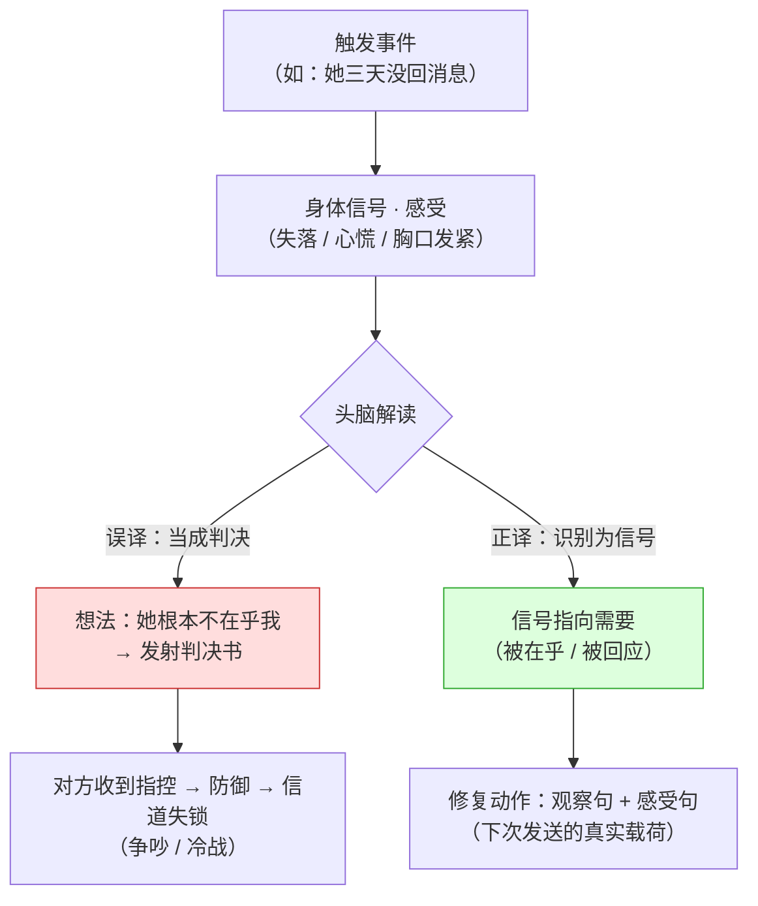

# 第 02 章 · 感受与想法：情绪是信号，不是故障

> 核心认知：感受是身体的信号，想法是头脑的解读。把「我觉得」当成感受，等于把判决书伪装成信号——信号不是用来砸掉的，是用来翻译的。

---

## 引子

凌晨一点半，雨把窗玻璃敲得直响。我在厨房等水开，面还没下，先掏出手机。聊天记录里，她的消息停在四天前——**「你根本不在乎我。」**老谟白天写在纸上丢给我的，也是这五个字。

我拇指悬在屏幕上方，手指顿了一下，还是没往下翻。这话我看了一晚上。她说这话的时候，明明是受了伤的样子。这不是感受是什么？而且——我自己心里也转过同样的念头，就在她连着三天不回消息那几天。我也想把这五个字原样发回去。

面煮好了。我端着碗，披了件外套下楼。楼下那家 24 小时便利店的灯还亮着，雨帘后面，老谟正坐在窗边，面前一碗泡面，一根烟没点着。

---

## 对话引擎

### 第 1 轮：这九个字里，能找到任何一种身体反应吗？

**造物主**：老谟，你白天那句「你根本不在乎我」，我想了一晚上。我想明白了——这**就是**感受。她说这话的时候那么难受，我读着都替她难受，而且我自己也有过这感觉，我确实感觉到了。

**老谟**：哦？那你帮我找找——这句话里，哪一种身体反应？

**造物主**：……身体反应？感受还要找身体反应吗？

**老谟**：我问你，你昨天饿的时候，你知道那是饿吗？你凭啥知道的？

**造物主**：肚子咕咕叫……胃里发空。

**老谟**：行。那「你根本不在乎我」这九个字，你一个字一个字看过去——哪一个字，对应你身上哪一块地方？你哪儿疼？哪儿堵？哪儿发紧？指给我看。

**造物主**：……这怎么指？这句话又不是一个器官。

**老谟**：那你刚说「我确实感觉到了」——你感觉到的，跟你嘴里说出来的，是一回事吗？你嘴里说的，好像不落在你身上任何一个地方啊。

**造物主**：等等……我心里其实堵得慌，这个能定位，在胸口。可我说出口的「你根本不在乎我」——这九个字里，确实一个字都落不到我身上。可那句话明明是从我心里冒出来的啊！

**老谟**：（低头挑了一筷子面，不接话。）

**造物主**：……你怎么不说话？我又说错哪儿了？

**老谟**：你说错在「心里冒出来的，就都是感受」。火气也是心里冒出来的，「你是个废物」也是心里冒出来的。改天你气头上也这么说，那我提前替你道歉。你先说说——「堵得慌」和「不在乎」，这俩差在哪？

---

### 第 2 轮：我感觉到的是失落，说出口的却是不在乎

**造物主**：我重新念一遍……「你根本不在乎我。」我真正感觉到的，是——失落。还有点心慌，像有人把我手里的东西抽走了。可我说出口的，是「你根本不在乎我」。我这才反应过来，「我觉得」三个字，把我骗了。

**老谟**：骗你什么了？

**造物主**：我以为「我觉得」后面跟的就是感受。其实「我觉得你根本不在乎我」——「我觉得」后面跟的，是一个**判断**。「她不在乎我」，这是我在给她这三天的行为下判决，跟上一章那个「每次都这样」是同一种东西。只不过这次它穿了件「我觉得」的外衣。

**老谟**：外衣脱了，看看里面的字。「根本」——这个副词你熟不熟？

**造物主**：「根本」……跟「每次」「总是」「从来」是同一族，一个例外都不留。她的行为被她一句话全盘否定了。这不是感受，这是**判决书**。

**老谟**：好眼力。这类词上一章我们给它起过名——全称频率概括。你今晚又亲手把它认出来了一遍。那就怪了——判决书你都能认出来，怎么她说一句，你还跟着点头说「这是感受」？

**造物主**：因为……因为我疼。她说了这句话，我疼；我要是说这句话，她也疼。疼是真的，所以我就以为整句话都是真的了。

**老谟**：疼是真的，话是真的吗？今天你要画的线，就在这。感受和想法，到底怎么分？

---

**📐 知识锚点：感受 vs 想法——感受是身体的信号，想法是头脑的解读**

一句话可以同时含两层东西，它们住在不同的层：

| 层级 | 名称 | 是什么 | 例子 |
|------|------|--------|------|
| 底层 | **感受（Feeling）** | 身体里可定位的情绪信号：胸口发紧、心慌、胃部发沉、眼泪上涌 | 「我有点失落」「我很害怕」 |
| 上层 | **想法（Thought / Judgment）** | 头脑对情境的认知解读：对他人动机的判断、对自我价值的评价 | 「她根本不在乎我」「我是个失败者」 |

**判别土办法（可操作）**：一句话里，找一个「感受词」。如果这个词能对应到**身体上某个位置**（胸口、胃、喉咙、眼眶），它是感受；如果它对应的是**对某人某事的评价**，它是想法。「失落」能在胸口找到位置，「不在乎」只能在判决书里找到位置。（注：极少数认知性感受如「困惑」无法身体定位，靠感受词汇表兜底——严格化走廊定义 1 给出了双重判定标准。）

【历史溯源】马歇尔·卢森堡在《非暴力沟通》（初版 1999，扩充版 2003）里把这层区分列为四要素的第二要素：他把「我觉得被忽视」判为**想法**（因为「被忽视」是对对方行为的解读），把「我感到孤独」判为**感受**。他给的训练是背感受词汇表——不背词汇表，人就只能用想法词冒充感受词。心理学家 Lisa Feldman Barrett 在《情绪是如何产生的》（How Emotions Are Made，2017）里提出了**建构情绪理论（constructed emotion）**：情绪不是大脑里预装的固定模块，而是「身体内感受（interoception）+ 概念」现场建构出来的——这从机制上解释了为什么**情绪词汇越丰富，情绪体验越精细**（她称之为**情绪颗粒度**，emotional granularity）——此为本书**借用的机制解释之一**：颗粒度并非唯一机制，且本章已声明不站队建构说 vs 基本情绪说，引入它只为解释「词汇表为什么有用」这一更弱的事实。词汇量不是修辞问题，是信号分辨率问题。James Russell（1980）的**环形情绪模型（circumplex model）**则给出了另一种组织方式：所有情绪都能放在「效价（正-负）× 唤醒度（高-低）」两个轴上——这把「感受」从一堆名词，变成了一个可测量的坐标系。

---

### 第 3 轮：甩一个极端反例——「你是个废物」也是感受吗？

**造物主**：那我换个思路。感受就是……情绪特别强烈的词？生气、难过、心慌，这些是感受。

**老谟**：那好。我情绪特别强烈地说一句：「你是个废物。」——这也是感受？

**造物主**：不是！「废物」说的是你——说的是对方——那是评价。

**老谟**：哦，那我换个方向说：「我觉得我是个失败者。」「失败者」说的是我自己，这总归是感受了吧？

**造物主**：……也不是。那还是评价，只不过评价对象换成了我自己。

**老谟**：那感受到底长什么样？你今晚自己定义一下。

**造物主**：感受……是身体里能定位的东西。失落、心慌、愤怒、害怕、安心——这些词后面接的是身体状态。而「不在乎」「失败者」后面接的是一个**判断**，关于对方，或者关于自己。判断是关于世界的主张，感受是关于我自己的实况。

**老谟**：我再送你一个土办法，比这还好用。一个词，如果你能在它后面接「因为……」——「我失落，**因为**他不回我消息」——你看，前半句「失落」是感受，可「因为」后面拖出来的那句「他不回我消息」是什么？

**造物主**：是解释。它可以是观察——「他不回我消息」；也可以再滑一层，变成解读——「他根本不在乎我」。但不管是哪种，「因为」一出来，我就从身体信号跑到了头脑的解释层。感受自己说不出「因为」，感受只负责响；「因为」是我后加上去的解释。

**老谟**：对喽。感受是信号，想法是解读。**信号不负责解释自己，解读永远晚到一步。**「你根本不在乎我」这句话就是信号和解读搅成一锅——前半截的疼是真的，后半截的判决是编的，编的那个人是你，也是她。你们俩的疼都是真的，可你们说出口的，全是对方读不懂的判决书。

---

**📐 知识锚点：「我觉得」是个歧义词 + 感受词汇表**

「我觉得」在中文里有两个完全不同的用法，被同一个壳装着：

- 用法 A（想法标记）：**我觉得** = 我认为。后面接的是一个可判真假的命题。「我觉得她不在乎我」——「她不在乎我」可以争辩真假。
- 用法 B（感受标记）：**我觉得** = 我感觉到。后面接的是一个身体状态。「我觉得很失落」——「失落」不可争辩，只可体会。

**判定规则**：把「我觉得」后面的成分单独拎出来——能在身体上定位 → 感受；能判断真假 → 想法。大多数「我觉得」开头的冲突句，都是用法 A 穿着用法 B 的衣服。

**感受词汇表（节选）**：失落、沮丧、委屈、害怕、愤怒、心慌、孤独、尴尬、疲惫、安心、满足、兴奋、平静。
**想法词（禁止冒充感受）**：觉得、认为、好像、被忽视、被抛弃、不被在乎、像个失败者、被利用。这些词后面跟的都是解读，不是身体。

---

### 第 4 轮：情绪不是故障，是报警器

**造物主**：可我还是有个疙瘩。就算我知道了「失落」是感受、「不在乎」是想法，那又怎样？失落多难受啊，我现在就想把它咽下去，当它没来过。

**老谟**：咽下去？好，那我问你——厨房油烟机响了，你第一反应是把它砸了，还是去查哪儿冒烟了？

**造物主**：查哪儿冒烟啊，砸了它我照样呛死。

**老谟**：失落、愤怒、焦虑、害怕——就是油烟机。你以前遇到情绪，第一反应是砸报警器。今天你换一个反应：**报警器响了，去查火源。**现在你告诉我，愤怒在报什么警？

**造物主**：愤怒……是在说「我的边界被侵犯了」？有人踩过线了。

**老谟**：失落呢？

**造物主**：失落……是「期待落空了」。我想要的东西，没有来。

**老谟**：焦虑？害怕？

**造物主**：焦虑……是「不确定性超载了」，事情悬着，我算不出结果。害怕……是「威胁在逼近」，有东西要伤我。可老谟，我怎么知道我翻译得对不对？万一愤怒其实只是我脾气差呢？

**老谟**：信号不负责「对不对」，信号只负责「响」。你不需要审判自己的情绪，你需要的是**翻译**它。情绪是一封电报，电报正文里藏着你的一个需要。愤怒电报里藏的是「我需要边界被尊重」，失落电报里藏的是「我需要被在乎、被回应」。你今天先学会读电报——怎么回信，是下一章的活。

---

**📐 知识锚点：情绪信号模型——从触发到翻译**



**读图说明**：同一个身体信号（中间节点 B）是「感受」，它本身不会伤人。伤人的是节点 C 的**解读方向**。往左走，信号被误译成判决书（想法），发射出去后触发第 01 章说过的防御反应，信道失锁；往右走，信号被正确识别为「指向需要的线索」，才有机会变成观察句 + 感受句。**图的核心在中间那个分叉口——那是本章要训练的，也是唯一你能控制的节点。**

**信号-需要映射（常见翻译表，经验规律而非普适定律）**：

| 情绪信号 | 它在报什么警 | 指向的典型需要 |
|---------|------------|--------------|
| 愤怒 | 边界被侵犯 | 尊重、被认真对待 |
| 失落 | 期待落空 | 被在乎、被回应 |
| 焦虑 | 不确定性超载 | 确定感、安全感 |
| 害怕 | 威胁逼近 | 安全、被保护 |
| 委屈 | 付出未被看见 | 被理解、被认可 |

【历史溯源】把情绪当作「有信息量的信号」而非「需要消除的故障」，在心理学里有两条进路：一条是**功能性情绪理论**（Nico Frijda，1986 年在《The Emotions》中提出「行动倾向」，2007 年《The Laws of Emotion》将其系统化为情绪法则；Richard Lazarus 的**认知评价理论**，cognitive appraisal theory, 1991）——情绪是环境对个体利益产生影响的信号，每种情绪都带着一个「行动倾向」；另一条是临床应用中的**主观痛苦单位量表（SUDS，Subjective Units of Distress Scale）**——Joseph Wolpe 于 1958 年率先提出其思路，1969 年在《The Practice of Behavior Therapy》中系统化；临床实践常用 0–100 标尺，本书采用 0–10 是等比例简化（只换单位，不换比例）——心理咨询里给情绪强度打分，就是默认「情绪可测量、可量化」。本书采用这两条进路的合流：情绪可读（信号）、可量（0–10）、可译（指向需要）。**学派中立声明**：情绪到底有没有「基本类别」（Paul Ekman 的六大基本情绪说 vs Barrett 的建构说）在学界仍有分歧；本书不站队，只采用两条进路都支持的最弱主张——**情绪携带可被翻译的信息**。

---

### 第 5 轮：三条规则，都是你自己说出来的

**老谟**：读电报学会了，那发报呢？你现在要给发一句话。她三天没回你消息，你现在开口，第一句说什么？

**造物主**：我想说——「我觉得你是不是不在乎我了？」

**老谟**：停。这句话里，哪个词是感受？

**造物主**：「在乎」……啊不对，「在乎」是判断。我又来了。换个说法：「我感觉你根本不在乎我，我很失落。」

**老谟**：再停。「你根本不在乎我」——这句话里有身体反应吗？你上一轮自己说的，这九个字一个字都落不到身上。

**造物主**：……所以我得先别急着审她。第一句应该是——「我有点失落。」感受词，从词汇表里挑，不掺判断。

**老谟**：行。那你再挑一个说法：「你让我很失落。」跟「我有点失落。」——你发哪个？

**造物主**：……第二个。「你让我」三个字一出来，感受就不是我的了，成了她欠我的债。听起来像指控。感受要挂在自己身上，才不变成扔过去的石头。

**老谟**：那再来一关。你今晚情绪一大锅，你要是说「我又失落又委屈又害怕又孤独」——她先接哪一句？

**造物主**：一句都接不住。四发炮弹连发，她只能躲。一次一个，发完一个，等一个回音。

**老谟**：行，你自己把规则撞出来了。第一条，用感受词汇表里的词，不拿想法词冒充；第二条，感受挂在自己身上，不甩给对方；第三条，一次一个感受，不叠炮弹。记好了，这是今晚的干货。

**造物主**：而且我发现——这三条规则，其实是同一件事的三个面：**让信号干净地发射出去，不掺噪声，不甩锅，不超载。**

---

**📐 知识锚点：表达感受的三条规则（本章核心交付物）**

发给对方一句感受，发送前过三道检查：

| 规则 | 内容 | 反例（不合格） | 正例（合格） |
|------|------|---------------|-------------|
| ① 用感受词 | 谓语是感受词汇表里的词，不拿想法词冒充 | 「我觉得你根本不在乎我」 | 「我有点失落」 |
| ② 挂在自己身上 | 主语是「我」，感受不甩给对方 | 「你让我很失落」 | 「我有点失落」 |
| ③ 一次一个 | 一次只发一个感受，等对方接住再说下一个 | 「我又失落又委屈又害怕」 | 「我有点失落。……还有点委屈。」 |

**记忆口诀**：词汇表里挑、主语是我、一次一个。

【历史溯源】这三条规则不是礼仪，是**编码规范**。卢森堡在 NVC 里反复演示：把「你让我难过」改写为「我感到难过」——前者是**归因**（对方要为我的感受负责），后者是**主权**（感受是我的，我为自己负责）。临床上，伴侣咨询师要求「一次一个感受」是为了防止**情绪雪崩**：连发多个情绪时，对方只能识别最强的那个，其余全部丢失——这跟通信里的「多路信号互扰」是同一个问题。

---

### 第 6 轮：实现思考——给协议帧加一个「感受字段」

**老谟**：上一章你设计了协议帧的帧头——观察字段。现在你知道了，光有观察不够。要是你来给这套对话协议加一个「感受字段」，这个字段怎么设计？

**造物主**：感受字段……我先想想它要回答什么问题。接收方（她）拿到这个字段，需要知道三件事：第一，**我此刻的真实感受是什么**——这是采样问题。我得先问身体：胸口堵不堵？手抖不抖？嗓子发不发紧？把感受从身体里「采」出来，而不是从脑子里「猜」出来。脑子一上来就说「她不在乎我」，那是采样采错了位置。

**老谟**：采完样呢？

**造物主**：第二，**这个感受叫什么**——命名问题。采完样，得在感受词汇表里找词对上号。失落、委屈、害怕……找不到精确的词，宁可说「说不清，反正是堵着的」，也不能拿「觉得」「认为」来冒充。名字不对，对方就解码错。

**老谟**：还有呢？

**造物主**：第三，**这个感受有多重**——量化问题。强度打 0 到 10。「我有点失落」是 3，「失落得睡不着」是 8。不量化的话，我说「我很失落」，对方永远不知道我是 3 还是 9——两个「很」差别大了去了。

**老谟**：你设计了一个字段，顺手踩了三个坑又填了三个坑。采样、命名、量化——用工程的话说，这叫「先测量，再贴标签，再定标」。你现在再看一眼协议帧，观察字段和感受字段，谁在前谁在后？为什么？

**造物主**：观察在前，感受在后。得先有事实打底，感受才有挂的地方；反过来先喊感受，对方都不知道我为什么喊。

**老谟**：对。观察是帧头，感受是信号本体。下一章你还要往上加两个字段——需要和请求。加完，这个帧才算完整。

---

**📐 知识锚点：实现思考——感受字段的设计规格（协议帧 v0.2）**

对话协议帧升级到 v0.2，在 v0.1 帧头（时间戳/行为/可核实性）之后追加感受字段：

```
┌─────────────────────────────────────────────────────────┐
│ 对话协议帧 v0.2（本章版本）                                │
│  ┌─────────┬──────────┬─────────┬───────────┬────────┐  │
│  │ 时间戳   │ 行为描述  │ 可核实性 │ 感受字段    │ 强度    │  │
│  │ t       │ b        │ V∈{✓,✗} │ f∈感受词汇表 │ s∈0-10 │  │
│  └─────────┴──────────┴─────────┴───────────┴────────┘  │
│  感受字段三子操作：                                        │
│  ① 采样（sample）：定位到身体 → ② 命名（name）：词汇表匹配 │
│     → ③ 量化（scale）：强度 0–10                          │
│  校验：f 必须∈词汇表；f 后不得出现「因为」句；s 必须显式填写  │
└─────────────────────────────────────────────────────────┘
```

- **为什么强度要显式填**：不量化，「很」字的解码方差极大（主观评价）；0–10 把主观量变成可对比的度量，双方信息差最小化。临床上的 SUDS 量表（Wolpe 提出，1958 先声 / 1969《The Practice of Behavior Therapy》系统化；临床常用 0–100，本书简化为 0–10，比例一致）是同一思路的成熟实践。
- **为什么「因为」句是禁项**：「失落因为他不回我」——「因为」后面的成分属于解读层：它可能是观察（「他不回我」），也可能滑成解读（「他不在乎我」），但都不是身体信号本身，放进感受字段即越界——尤其滑向解读时，会被接收方当成判决书。感受字段只装感受，解读字段（如果需要）未来单独设计。
- **为什么采样要先于命名**：先想「什么词合适」会把感受拽进头脑；先定位身体，命名才是从实况出发而非从词汇出发。顺序错了，编码就失真。

---

### 第 7 轮：落点——把那句话重编码

**老谟**：绕了一整晚。回到那张纸——「你根本不在乎我。」现在，用今晚拆出来的东西，把这句心里话重新发一遍。你发什么？

**造物主**：……「这周你有三次没回我的消息。我有点失落。」——观察是她的行为，感受是我的实况，各回各家，谁也没挨谁的刀。

**老谟**：说完了？就这？

**造物主**：……我听着，好像还想加一句：「我想让你知道我在等你。」不对——那已经超出感受了，那是……一个愿望，一个需要。但我今晚先不发。信号先干净地送出去，需要是下一章的事。

**老谟**：嗯。今晚这碗面，没白吃。你自己说说，你今晚到底学会了什么？

**造物主**：我以前以为感受是「我感觉到了」——一个念头从心里冒出来，就是感受。今晚我才知道：**感受是身体的信号，想法是头脑的解读。**把「我觉得」当成感受，等于把判决书伪装成信号。而信号不是故障，不该被砸掉，该被翻译——每封电报里，都藏着一个我没说出口的需要。

**老谟**：电报里藏着一个需要——这句话你给我记牢了，明天我们就拆它。失落背后是什么需要？愤怒背后是什么需要？每一种情绪背后，都埋着一个你还没学会说出口的需求。那是下一章的事。

**造物主**：老谟，我还有个问题——她说「你根本不在乎我」的时候，她心里的电报里藏着的需要，是不是也是……「被在乎」？

**老谟**：你说呢？雨停了。

---

## 严格化走廊

> 对话负责直觉，走廊负责严谨。本章把「感受 vs 想法」落成严格形式。

### 定义（精确表述）

**定义 1（感受）**：感受（feeling）是主体对自身**身体内感受**（interoception）的觉知——包括内脏信号（心跳、呼吸、胃部状态）、肌肉紧张度、体温变化，以及与之绑定的主观体验（如「心慌」「发紧」「发沉」）。判定采用**双重标准（满足其一即可）**：① **身体定位标准（充分条件）**——可在身体上定位，即能对应到上述身体内感受的某一具体部位；② **词汇表标准（权威枚举）**——不满足 ① 时（如「困惑」这类认知性感受），若被公认的感受词汇表 V_F 收录，仍属感受。两标准是「或」的关系：满足 ① 即为感受，不满足 ① 时以 ② 兜底。感受的主语恒为自己。

**定义 2（想法/解读）**：想法（thought）是主体对情境的**认知解读**——对他人动机的判断（「他不在乎我」）、对自我价值的评价（「我是个失败者」）、对事件意义的推断（「这是在针对我」）。判定标准：**可被判定真假**（是命题），且不可在身体上直接定位。

**定义 3（感受句 vs 想法句）**：一个陈述句 S 是**感受句**，当且仅当：① S 的谓语中心词属于感受词汇表 V_F（按定义 1 的双重标准判定）；② S 的主语为说话者本人；③ S 中不含「因为」引导的因果解读子句。S 是**想法句**，当且仅当 S 的谓语表达对他人/自我/事件的评价判断（即使以「我觉得」开头）。混合句同时含感受成分与想法成分。

**定义 4（情绪信号模型）**：情绪（emotion）是一个双层结构：底层为**感受**（身体信号，不可争辩），上层为**想法**（认知解读，可争辩）。情绪引发的沟通后果由上层解读决定，而不由底层信号决定。

### 定理（带全前提条件）

**定理 1（「我觉得」歧义判定）**：设句子 S = 「我觉得 P」。
- 若 P 是**感受**（按定义 1 判定——身体可定位，或被感受词汇表 V_F 收录），则「我觉得」是感受标记，S 为感受句；
- 若 P 是**命题**（可判定真假），则「我觉得」是想法标记，S 为想法句。
前提条件：P 能唯一判入上述两类之一；若 P 同时含两者（混合句），按定义 3 判定，而非单一归类。

**定理 2（判决伪装定理）**：设主体 T 实际体验身体信号 s（如失落），若 T 将其编码为想法句 J（如「你根本不在乎我」，满足定义 3 的想法句条件），且 J 含对接收方 R 的负面评价成分（满足第 01 章定义 2），则当 R 将 J 解读为对自我形象的威胁时（前提 P1、P2，同第 01 章定理 1），R 产生防御反应。**即：感受-想法混淆使一个本可被接收的信号，退化为触发防御的判决书。**

**定理 3（情绪的信息价值）**：设主体 T 处于情绪状态 E，且 E 的产生环境为正常社会情境（前提 Q1：T 无临床情绪障碍；Q2：E 的强度与环境事件大致成比例），则 E 携带关于 T 的利益状态的信息，并可被翻译为一个需要命题 N（如「愤怒 → 需要边界被尊重」）。Q1、Q2 不成立时（病理情绪、创伤再触发），信号与事件的比例关系失效，翻译需专业评估——见反例 4。

> **定理 3 的语义辨析**：说情绪「有信息价值」，不是说情绪永远正确。信号正确 ≠ 解读正确——失落证明「我有所期待」，但不证明「她不在乎我」。定理 3 保的是**信号层**的信息，不保**解读层**的正确性。

### 证明（完整可复写）

**证明定理 2 的机制链**（从感受的产生到接收方的防御）：

- **步骤 1**：触发事件 E 作用于 T 的身体，产生身体信号 s（定义 1）。s 本身不含语义——「心慌」不等于「被辜负」，信号只是被唤醒的生理状态。*（依据：定义 1；身体信号是情绪的物理载体，本身无命题内容。）*
- **步骤 2**：T 对 s 进行解读。若 T 采用误译路径，将 s 归因于 R 的人格/动机，则产出想法句 J = 「你根本不在乎我」。*（依据：认知评价理论（Lazarus, 1991）——身体唤醒需经评价才获得意义；评价方向决定情绪体验与表达内容。）*
- **步骤 3**：J 含负面评价成分（「根本」为全称概括、「不在乎」为动机归因），满足第 01 章定义 2 的评判句条件。*（依据：第 01 章定义 2 的三类评价性成分。）*
- **步骤 4**：J 被 R 接收。若 R 满足前提 P1（认为 J 指向其人格）、P2（负面归因），由第 01 章定理 1 的机制链，R 产生防御反应，信道失锁。*（依据：第 01 章证明——威胁评估先于理性，防御行为二选一：反击或撤退。）*
- **步骤 5**：对比——若 T 在步骤 2 采用正译路径，输出感受句「我有点失落」（定义 3），则 J 的负面评价成分不存在，第 01 章定理 1 的启动条件（P1 的前提「存在评价对象」）不成立，R 接收端保持打开。*（依据：定义 3 ③——感受句不含「因为」解读子句，故不含评价成分；第 01 章排除论证。）*
- **结论**：同样一个身体信号 s，经不同编码路径，产生「防御反应」或「正常接收」两种相反后果。**编码错误（感受-想法混淆）是信道失锁的必要环节。** □

### 反例/边界（钉死适用域）

**反例 1（夸张的身体隐喻）**：诗歌里「我心如刀绞」「我心都碎了」——身体描述是夸张的隐喻，不代表真的存在可定位的刀伤。**边界**：表达感受时允许文学化修辞，但判断「这是感受还是想法」时，隐喻按「指称的身体状态」理解，不按字面。诊断修辞 ≠ 本体。

**反例 2（认知性感受）**：「我很困惑」——困惑在身体上难以精确定位，却属于感受（NVC 将其列为感受词）。**边界**：感受词汇表的边界不是「身体定位」这一条标准能穷尽的；「身体可定位」是**充分条件**而非**必要条件**——这正是定义 1 引入词汇表标准兜底的原因。本书的判定标准用于日常判别（快而稳），不用于学术完备分类。

**反例 3（文化差异）**：在高度集体主义/面子的文化语境中，直接说「我有点失落」可能被解读为示弱，或让对方「没面子」。**边界**：本书的表达三规则是「亲密关系中的默认协议」，不是普世礼仪规范；在特定文化/关系权力结构中，直接表达可能要让位于间接表达。规则的主干（先分感受与想法）不变，具体编码方式可调。

**反例 4（临床情绪的失效域）**：长期抑郁状态下，「我什么都感觉不到」——情绪麻木不是「没有信号」，而是信号系统被抑制（**快感缺失**，anhedonia）；创伤后应激中，害怕信号的强度与当前环境不成比例（旧伤再触发）。**边界**：定理 3 的 Q1、Q2 在此失效——情绪的信息翻译在此需要专业评估，不是本书的自我训练能覆盖的。本书教的是「信号的日常解码」，不是「病理信号的诊断」。这一点也预告了第 04 章：为什么有些人一遇冲突就过度反应——那是出厂预设的关系操作系统，不是嘴的问题。

**边界讨论（「感受挂在自己身上」会不会显得自私/冷漠）**：有读者会担心——只说「我失落」，不怪对方，那对方是不是就不用改进了？**不会。**感受句的作用不是替对方开脱，而是**让真正的信息穿过信道**：对方收到「我失落」，比收到「你不在乎我」更有可能做出改变，因为前者不触发防御（定理 2）。表达感受不是放弃指责，是把指责换成更有效的信号——短期看少了一点「爽」，长期看多了一条活路。

---

## 知识点总结

### 知识点（本章推出的核心概念）

- **感受（Feeling）**：身体的情绪信号，主语恒为自己；判定采用双重标准——身体可定位（充分条件）或被感受词汇表收录（权威枚举兜底）。
- **想法（Thought）**：头脑对情境的认知解读，可判定真假。常伪装成感受（「我觉得你不在乎我」）。
- **「我觉得」歧义**：「我觉得」= 我感觉到（感受标记）或 我认为（想法标记）；判定看后接成分是身体状态还是命题。
- **情绪信号模型**：触发事件 → 身体信号（感受）→ 头脑解读（想法）→ 信号指向需要。分叉口在「解读方向」。
- **情绪信号-需要映射**：愤怒=边界被侵犯；失落=期待落空；焦虑=不确定性超载；害怕=威胁逼近。
- **表达感受三规则**：① 用感受词汇表里的词；② 感受挂在自己身上；③ 一次一个感受。
- **感受字段三操作**：采样（定位身体）→ 命名（词汇表匹配）→ 量化（强度 0–10）。

### 历史结论（本章涉及的史料）

- 马歇尔·卢森堡《非暴力沟通》（1999 初版 / 2003 扩充版）：感受 vs 想法是四要素第二要素；「被忽视」是想法，「孤独」是感受；背感受词汇表是训练法。
- Lisa Feldman Barrett《情绪是如何产生的》（2017）：建构情绪理论（constructed emotion）——情绪由「身体内感受 + 概念」建构；情绪颗粒度（emotional granularity）——词汇越细，情绪调节能力越强（本书借用的机制解释之一，不构成对建构说的站队）。
- James Russell（1980）：环形情绪模型（circumplex model）——效价 × 唤醒度两轴组织情绪，是情绪量化的坐标基础。
- Joseph Wolpe（1958 提出先声，1969《The Practice of Behavior Therapy》系统化）：主观痛苦单位量表（SUDS）——临床情绪量化实践，临床常用 0–100 标尺，本书等比例简化为 0–10，是本章「强度 0–10」的原型。
- Nico Frijda（1986《The Emotions》提出「行动倾向」，2007《The Laws of Emotion》系统化）、Richard Lazarus（1991 认知评价理论）：情绪是有信息的信号，每种情绪携带「行动倾向」/评价结果。
- 学派分歧：Ekman 的基本情绪说 vs Barrett 的建构说，本书采用两派都支持的最弱主张——情绪携带可被翻译的信息。

### 工程实践结论（本章知识在真实世界怎么用）

- 伴侣咨询的「澄清感受」技术：当来访者说「我觉得 TA 不重视我」，咨询师先问「你身体什么感觉？」——把想法句逼回感受句，再谈需要。
- 0–10 强度量表（SUDS）在咨询中的应用：情绪强度打分让「我很生气」这种模糊句变成可对比的度量，双方（及咨询师）信息差最小化。
- 「因为测试」是自助检错工具：说出感受后如果忍不住补「因为……」，说明后面那半句是想法——先单独发感受，解读留到双方都冷静时再谈。
- 为什么「叠炮弹」和翻旧账一样致命：一次多个情绪时，对方只接收最强的那个，其余全部丢失（信号互扰）——一次一个，是通信效率问题，不是表达礼貌问题。

---

## 沟通训练场

> 所有操作练习收进本场。对话里零操作，动手全在这。以下每题动笔 10 分钟以上。

### 题 1：句子分类与重编码（难度：易→中）

**题干**：以下 6 句话来自一段典型争吵。① 判断每句是感受句、想法句还是混合句（用定义 3）；② 指出「我觉得」用法（用法 A 想法标记 / 用法 B 感受标记）；③ 将混合句和想法句重编码为「观察句 + 感受句」（沿用第 01 章观察三校验 + 本章三规则）。

> 1. 「我觉得你根本不在乎我。」
> 2. 「我觉得很孤独。」
> 3. 「我觉得被利用了。」
> 4. 「你又让我很生气。」
> 5. 「你三天没回我消息，我有点失落。」
> 6. 「我觉得这次是我先错了。」

**完整分步解答：**

第 1 步：逐句判定。

| # | 原句 | 判定 | 「我觉得」用法 | 依据 |
|---|------|------|--------------|------|
| 1 | 「我觉得你根本不在乎我」 | 想法句 | A（我认为） | 「你根本不在乎我」是可判真假的命题，非身体状态 |
| 2 | 「我觉得很孤独」 | 感受句 | B（我感觉到） | 「孤独」可在身体上体会，主语是自己，无「因为」 |
| 3 | 「我觉得被利用了」 | 想法句 | A | 「被利用」是对他人动机的解读，不可在身体上定位 |
| 4 | 「你又让我很生气」 | 混合句（含想法+感受） | ——（无「我觉得」） | 「生气」是感受，但「你又让我」把感受归因给对方，且「又」含全称概括 |
| 5 | 「你三天没回我消息，我有点失落」 | 感受句（含观察） | —— | 观察句（时间戳+行为）+ 感受句（失落），符合全部规则 |
| 6 | 「我觉得这次是我先错了」 | 想法句 | A | 「我先错了」是可判真假的自我评价命题，非身体状态 |

第 2 步：重编码句 1、3、4、6（句 2、5 已合格，保留原样）。

- 句 1：「你根本不在乎我」→ 观察：`这周你有三次没回我的消息`（时间戳✓ 可核实✓ 对事✓）+ 感受：`我有点失落`（词汇表✓ 主语我✓ 一次一个✓）
- 句 3：「我觉得被利用了」→ 观察：`昨晚你说改方案，但没有告诉我理由`（示范补全，须基于真实事实）+ 感受：`我觉得委屈`（注意：原句「被利用」的解读没有消失，它应该被**存起来**——作为待处理的念头，而不是作为待发射的报文）
- 句 4：「你又让我很生气」→ 拆掉「又」（全称）、拆掉「让我」（归因）→ 观察：`刚才你打断我两次`（示范补全）+ 感受：`我有点生气`（主语是「我」，不再甩给对方）
- 句 6：「我觉得这次是我先错了」→ 先拆层：「我先错了」是对自己的评价（想法），不是感受；但这句话背后真实携带的情绪是后悔与自责。重编码：观察：`昨晚我们争吵，第一句话是我说的`（示范补全，须基于真实事实）+ 感受：`我有点自责`（词汇表✓ 主语我✓ 一次一个✓）；「我错在哪」的判断作为待谈话题，不随感受句发射

第 3 步：以句 1 场景为例给出完整重编码：

> 原句：「我觉得你根本不在乎我。」
> 重编码：「这周你有三次没回我的消息，我有点失落。」

第 4 步：验证——重编码句全部满足：观察三校验（可核实/时间戳/对事不对人）+ 感受三规则（词汇表/主语我/一次一个）；句 3 的「被利用」判断与句 6 的「我先错了」判断均未消失，但被降级为「待处理的念头」而非「发射的报文」。

**答：** 句 2、5 合格；句 1、3、6 为想法句（「我觉得」均为用法 A）；句 4 为混合句；重编码后全部转化为「观察+感受」结构。核心区别一句话：**感受句陈述「我怎么了」，想法句指控「你（或我）是什么/做了什么」。**

**常见错误：** ① 把句 3「被利用」当感受——「被……」是解读语法，不是身体语法；② 重编码时顺手删掉「生气」只留观察——感受是载荷本体，删了它帧就空了；③ 把句 6 这种自我批评当成感受——「我先错了」是判断，你可以先有「我有点自责」（感受）再谈「错在哪」（想法），但别混着发。

### 题 2：给一段争吵做「情绪拆电报」（难度：中→难）

**题干**：下面是深夜聊天记录。为每一条消息完成「情绪拆电报」：① 采样（定位说话者的身体信号，可合理推断但须标注【推断】）；② 命名（在感受词汇表里给情绪命名）；③ 量化（0–10 强度，附依据）；④ 翻译（信号指向的需要）；⑤ 重编码为协议帧 v0.2（观察字段 + 感受字段，需要字段【占位】不填写，待第 03 章）。

> A（23:41）：「你根本不在乎我。」
> B（23:52）：「我怎么不在乎了？上周你生日我都请假了。」
> A（23:53）：「你总拿那一件事说事，你是不是烦我了？」
> B（00:01）：「算了，不说了，睡觉吧。」

**完整分步解答：**

第 1 步：逐条拆电报。

**A1「你根本不在乎我」**：
- 采样：胸口发紧、喉咙发堵、想哭但忍着【推断：说话者 A 多日未被回应，身体处于持续低落的激活状态】
- 命名：失落（核心）；可能混有委屈【推断】
- 量化：失落 8/10（依据：全称词「根本」——已到「不留任何例外」的极端表述，通常对应高强度信号；且这句话是 A 憋了多日才发的）
- 翻译：需要被在乎、被回应（期待落空——符合「失落=期待落空」映射）
- 重编码：`观察字段：这周你有三次没回我的消息【示范补全：题干原文未给具体事实，此为示范性补全，真实改写须基于可核实事实】｜感受字段：我有点失落，强度 8｜需要字段：【占位——被回应 → 第 03 章】`

**B1「我怎么不在乎了？上周你生日我都请假了」**：
- 采样：脸热、心跳加快、语速不自觉加快【推断：A1 触发防御，见第 01 章定理 1】
- 命名：委屈（被指责后的申辩），背后可能还有被冤枉的愤怒【推断】
- 量化：委屈 6/10（依据：B 没有直接攻击 A，但进入了「辩护」模式——防御反应的中等强度）
- 翻译：需要被看见（我做过的事被承认）——这是 B 的情绪信号，常被 A 的怒火掩盖
- 重编码：`观察字段：上周你生日那天我请了一天假｜感受字段：我有点委屈，强度 6｜需要字段：【占位——被看见 → 第 03 章】`

**A2「你总拿那一件事说事，你是不是烦我了？」**：
- 采样：烦躁、坐立不安、手指在屏幕上用力按【推断】
- 命名：愤怒（边界被侵入——A 感觉自己的诉求被 B 的「翻旧账」顶了回来）；底层仍是失落 7/10 + 新增愤怒 5/10
- 量化：愤怒 5/10（依据：出现「总」全称词与「你是不是烦我了」的动机揣测，但尚未升级为人身攻击）
- 翻译：需要被理解——「我说的不是那件事，是『你没回我』这件事」；A 希望 B 接住当前诉求，而不是岔开
- 重编码：`观察字段：刚才你提起了上周生日的事【示范补全：题干原文无此具体行为（「总拿那件事说事」是概括不是行为），此为示范性补全，真实改写须基于可核实事实】｜感受字段：我有点着急（想让你先听见我这句），强度 5｜需要字段：【占位——被理解 → 第 03 章】`

**B2「算了，不说了，睡觉吧。」**：
- 采样：疲惫、胸口发闷、想结束对话【推断：防御撤退模式，见第 01 章定义 3 的「撤退」】
- 命名：心灰意冷（复合情绪：委屈累积 + 对「说不通」的无力感）【推断】
- 量化：6/10（依据：B 选择了「撤退」而非「反击」，是防御链条的末端——撤退通常伴随较高积累值）
- 翻译：需要休息 + 需要「对话有出口」——撤退背后是「我再说也是白说」的无望
- 重编码：`观察字段：（本条消息本身无可核实行为，消息行为就是「提出结束对话」）｜感受字段：我有点累，想先停一下，强度 6｜需要字段：【占位——想要对话有出口/先暂停 → 第 03 章】`

第 2 步：对比原对话与重编码后对话的差异。

| 维度 | 原对话 | 重编码后 |
|------|--------|---------|
| 信道状态 | 第三句起双双进入防御（指责→辩护→指责→撤退），信道失锁 | 每句都是「观察+感受」，接收端保持打开 |
| 信息量 | 表面在吵，实际双方需要都埋在电报里，谁也没收到 | 双方需要（被回应/被看见/被理解/先暂停）清晰可译 |
| 下次入口 | 没有入口，只剩「算了」 | 每句都留了需要字段（第 03 章填充）的接口 |

第 3 步：复盘——原对话四次消息，没有一个「感受字段」，四个信号（失落、委屈、着急、疲惫）全部以判决书（不在乎/烦我/算了）的形式发射。**不是没有情绪，是情绪全部走了错误的编码路径。**重编码并不消灭冲突（需要字段仍要谈），但让冲突不再以「互相失锁」为唯一结局。

**答：** 四句的命名分别为失落（8）、委屈（6）、愤怒+着急（5）、心灰意冷（6）；信号翻译分别指向被回应、被看见、被理解、先暂停四种需要；重编码后信道保持打开，需要字段留白待第 03 章填充。核心结论：**情绪拆电报 = 采样（身体）→ 命名（词汇表）→ 量化（0–10）→ 翻译（需要）→ 重编码（观察+感受）。**

**常见错误：** ① 给 B 的委屈打「0 分」——因为 B 不是「受害者」所以没情绪？情绪强度与谁对谁错无关，B 的委屈和 A 的失落可以同时为真；② 把「翻译」写成「指责」——「他需要被看见」不是「他就是爱邀功」，翻译只陈述需要，不断言动机；③ 在原对话里寻找「正确答案」——本题没有正确答案，只有「更可能」的信号解读，推断处必须标注【推断】，不得伪装成确定事实。

---

## 向导便签

> **本章干了什么**：从一句「你根本不在乎我」入手，拆出「感受（身体信号）」与「想法（头脑解读）」的分界，推导出情绪的信号价值（愤怒=边界被侵犯、失落=期待落空……），亲手定出表达感受的三规则，并给协议帧加上了「感受字段」（采样→命名→量化）。
>
> **钉死一句话**：感受是身体的信号，想法是头脑的解读；把「我觉得」当成感受，等于把判决书伪装成信号。
>
> **毒舌收口**：你以前说「我很受伤」的时候，其实是在发判决书——现在你学会了，先量再发：0 到 10，你报个数，别报判决。

---

## 造物主手记

**我曾踩的坑**：

- 坑 1：以为「我觉得」后面跟的都是感受——直到我亲手数了一遍「你根本不在乎我」这九个字，一个身体部位都指不出来，我才知道「我觉得」三个字会骗人。它让我以为我在说心里话，其实我在发判决书。
- 坑 2：以为把情绪咽下去就是成熟——「情绪是故障，得消掉」。老谟拿油烟机打比方我才醒：报警器响了去砸报警器，屋里该着还是着。失落、愤怒、焦虑不是要消掉的故障，是要翻译的电报。
- 坑 3：以为「你让我很失落」是在表达感受——我把感受甩给对方的时候，感受就从「我的实况」变成了「你的罪状」。挂在自己身上，不是憋着，是把话放回它自己的位置。

**那根弦响了一下**：深夜在便利店，我把「你根本不在乎我」亲手改成「这周你有三次没回我的消息，我有点失落」的时候，忽然明白了一件事——那句话我不是为了吵架才说的，我是为了让她知道我在等她。我想要的从来不是审判她，是被她回应。而她说的那句话背后，藏着的，大概也是同一个东西。

---

## 自测题

1. 「我觉得你根本不把我当回事。」——这是感受句还是想法句？「我觉得」是哪种用法？（*简答要点：想法句；用法 A（我认为）。「不当回事」是对对方态度的解读，可判真假，不可在身体上定位。*）
2. 用「因为测试」检查：「我很难过，因为他不回我消息。」前半句和后半句各是什么？（*简答要点：前半句「我很难过」是感受（身体信号）；「因为」后面拖出的可以是观察（「他不回我消息」），也可以再滑成解读（「他根本不在乎我」）——无论哪种，「因为」一出现就说明解释是后加的，解释属于解读层，不随感受一起发射。感受字段不得带「因为」。*）
3. 愤怒、失落、焦虑、害怕分别指向什么需要？（*简答要点：边界被尊重；被在乎/被回应；确定感/安全感；安全/被保护。注意映射是经验规律，非普适定律。*）
4. 表达感受的三规则是什么？「你又让我很委屈」违反了哪几条？（*简答要点：①词汇表②主语我③一次一个；「你让我」违反规则 ②（归因甩锅），「又」含全称概括还连带违反观察校验，若「委屈」后还接一串其他情绪则违反规则 ③。*）
5. 边界题：为什么「我什么都感觉不到」也可能是一种情绪状态？（*简答要点：情绪麻木（快感缺失）是信号系统被抑制，不是没有信号；定理 3 的前提 Q1、Q2 失效，需要专业评估而非自我训练。*）

---

## 预告

雨停了。便利店窗玻璃上的水痕一道一道往下淌，像没说完的话。

老谟把碗往台面上一推，起身，走到门口又停住：「你今晚发出去的那封电报——『我有点失落』——电文里还有一行字你没读出来。」

「什么字？」

「失落背后藏着的那个东西。你被回应的时候才踏实，不被回应就慌——那东西叫什么，你为什么从来说不出口，那是下一章的活。」他推开门，又补了一句，「下次来，把你那封电报的正文，一字一字拆给我看。」

造物主低头看着手机备忘录里那句「你根本不在乎我」，忽然觉得它没有昨晚那么扎人了。他试着在心里把整句话换了个说法，这一次，他知道那句没说完的话长什么样了——

**他在等她。而「等她」这件事，需要一个说出口的方式。**感受背后藏着需要——那是第 03 章《需要与请求》要拆开的东西。
