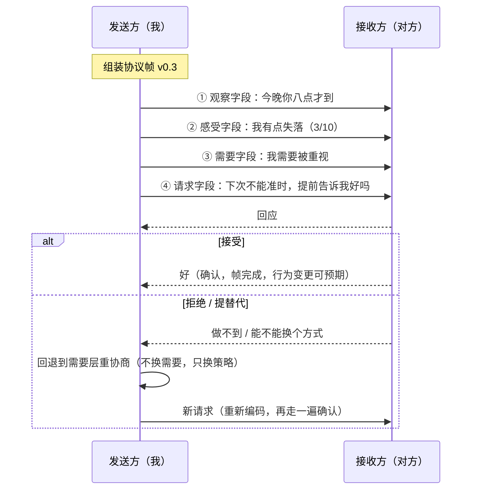

# 第 03 章 · 需要与请求：让信号穿过信道

> 核心认知：感受是信号，需要是信号背后的信息。把需要说出口，是把请求变成「可执行的协议帧」的最后一步——信号穿过信道，靠的不是喊得更大声，是报文终于完整了。

---

## 引子

周日晚十一点四十，地铁末班车。车厢空了大半，灯管在头顶嗡嗡地响。

我刚从朋友的周末聚会上出来。手机在口袋里震了三次，第三次我才敢看——她回了四个字：**「那你想要什么？」**

这是回我那句「我有点失落」的。白天我把这句话斟酌了一路，终于发出去，手心都是汗。我以为她至少会问一句「怎么了」，结果她反过来问我。我盯着对话框的光标闪了又闪，张了张嘴，没出声。我不知道我想要什么。

老谟坐在斜对面，膝盖上搁着一个瘪了的布袋，像是刚下饭局。他没看我，像是在自言自语：「末班车，下一站，终点站。」

我走过去坐下：「老谟，她问我想要什么。我……答不上来。」

「哦。」他眼皮都没抬，「那你想要什么？」

「我就是不知道才来问你！」

「那你刚才那句『我不知道』，是冲谁说的？」

「……冲我自己。」

他这才看我一眼：「行，至少这次没冲她发。那就好办了——不知道想要什么，就从『为什么失落』开始找。失落不是白响的，它是一封电报，电文里藏着你要的东西。」

---

## 对话引擎

### 第 1 轮：她问你要什么，你怎么哑火了？

**造物主**：她问我想要什么，我想了半天……想要他道歉啊。他这几天那么冷，消息三天回一条，总得给个说法吧。

**老谟**：（看着窗外，不接话。车厢报站，又过了一站。）

**造物主**：老谟，你听见没有？

**老谟**：听见了。我在等你那句话自己过站。你说「想要他道歉」——那他要真道歉了，你就不失落了？

**造物主**：那当然——呃，好像也不是。就算他道歉，我心里那个空的地方，还在。

**老谟**：那你要的到底是「道歉」，还是「道歉」能给你填上的那个东西？

**造物主**：……道歉是手段。我要的是道歉背后的——「他还在乎我」这个事实？

**老谟**：「在乎」这个词，你熟不熟？上一章你亲手把它从感受词里踢出去了，它是想法词。

**造物主**：对，「在乎」是解读，是想法。可它底下有真东西——道歉这个手段想达成的，是让我重新确认：我在他心里，是重要的。

**老谟**：停在这，别急着跑。你刚说「心里那个空的地方还在」——那个空，就是电报正文的第一行字。你先把它认下来，别丢。

---

**📐 知识锚点：感受是信号，需要是信息——电报的「正文」**

上一章我们说过：情绪是报警器，报警器响，要去查火源。但「查火源」查到的，不是对方做错了什么，而是**你自己有一份利益，被撞了一下**。

| 层级 | 名称 | 是什么 | 例子 |
|------|------|--------|------|
| 信号层 | **感受（Feeling）** | 身体的报警：失落在响 | 「我有点失落」 |
| 信息层 | **需要（Need）** | 报警背后的利益状态：什么东西对你重要 | 「我需要被重视」 |
| 手段层 | **策略（Strategy）** | 你挑的「具体怎么满足」的方案 | 「要他道歉」 |

一句话区分：感受告诉你「疼」，需要告诉你「哪里疼、为什么这个部位不能碰」，策略告诉你「你想让谁做什么来止血」。三者经常被说成一句话，但它们是三层东西——上一章你刚学会把感受从想法里拆出来，这一章要拆的是更隐蔽的一层：**感受和需要、需要和策略，是怎么被搅成一锅的。**

---

### 第 2 轮：道歉是手段——手段背后是什么？

**老谟**：现在回答我：道歉为什么能填上你那个「空的地方」？道歉这个动作落到你身上，给了你什么？

**造物主**：道歉让我觉得……他把我当回事了。他肯低头，说明我重要。

**老谟**：好。这句话的宾语是什么？「我重要」——重要，在谁的衡量里？

**造物主**：在他的衡量里。我需要被他……重视。**我需要被重视。**

**老谟**：这是你自己译出来的，我一个字没帮。失落电报的正文：需要被重视。那再翻一遍第 02 章那张表——愤怒报什么警？

**造物主**：愤怒报「边界被侵犯」。那它的正文就是……需要边界被尊重？

**老谟**：焦虑？害怕？

**造物主**：焦虑是「不确定性超载」，正文应该是需要心里有底、需要确定性。害怕是「威胁逼近」，正文是需要安全。

**老谟**：这些正文有个共同点，你看出来没有？

**造物主**：它们全是关于「什么对我重要」——不是关于「他必须做什么」。

**老谟**：对。你失落，不是因为你给他下了任务，是因为你有个东西很重要，被撞了一下。这个东西，我们给它起个名字，叫**需要（need）**。感受负责响，需要负责说清「什么东西对你重要」。你以前说不出口的，从来不是感受，是这一层。

---

**📐 知识锚点：需要——感受背后的利益状态**

**定义（本章内）**：需要是主体对其**利益状态（what matters to the self）**的关切——「什么对我重要」「我希望处于什么状态」。需要的主语恒为自己；需要不指定「由谁、以什么方式满足」。

情绪信号与需要的对应（第 02 章映射表的扩展）：

| 情绪信号 | 它在报什么警 | 信号背后的利益状态（需要） |
|---------|------------|--------------------------|
| 愤怒 | 边界被侵犯 | 需要边界被尊重 |
| 失落 | 期待落空 | 需要被重视、被回应 |
| 焦虑 | 不确定性超载 | 需要确定感、连接不中断 |
| 害怕 | 威胁逼近 | 需要安全、被保护 |
| 委屈 | 付出未被看见 | 需要被理解、被认可 |

【历史溯源】把「感受」和「需要」做成两层的，是马歇尔·卢森堡的非暴力沟通（**Nonviolent Communication，NVC**，初版 1999，扩充版 2003）。他在四要素模型里坚持：感受之后必须接需要，「我失落」只说了一半，另一半是「因为被重视这件事对我重要」。他观察到，人们吵架时说的全是「你怎么这样」，而心里的电报从来是「我需要什么」——这一层的缺口，是大多数争执的真正火源。

---

### 第 3 轮：需要清单——为什么你能跟陌生人说同一种话？

**造物主**：那我试试把我的需要一个个摆出来：被重视、被陪伴、心里有底、被信任……可是老谟，这些词怎么都这么……空？像大道理，说了等于没说。

**老谟**：空，是因为你还没把它接回地面。你问自己：被重视，具体长什么样？你会立刻列出一串「他要做什么」——早报备、秒回、别老加班。可那些全是方案，方案有十万种。

**造物主**：所以「被重视」是底下的那个东西，方案是搭在上面的壳？

**老谟**：对。你再想——你奶奶需不需要被重视？小区门口那个看门大叔呢？你三岁的小外甥呢？

**造物主**：需要……被重视这件事，不挑人。

**老谟**：这就是关键。方案挑人——你要他报备，她要他夸她，你爸要你回家吃饭，方式全不一样。可方案底下那层，全世界一个样。心理学里有人把这层整理成一张单子，叫**人类基本需要清单（Needs Inventory）**——分几大类：自主、连接、意义、和平、滋养、玩耍……你刚才说的被重视、被陪伴、心里有底，全掉进「连接」和「和平」这两个筐里。

**造物主**：那我妈那代人说的「过日子图个安稳」，跟我说的「要安全感」，是同一个东西？她一九九几年，我二零二几年，隔着三十年，底下的需要居然没变？

**老谟**：没变。需要是**通用语言**——不挑时代、不挑性别、不挑年龄。你甚至不用跟她说中文的「我需要被重视」，你只要让她看见这份需要，她就懂。因为她手里也有一份一模一样的。

---

**📐 知识锚点：人类基本需要清单（Needs Inventory）**

卢森堡在 NVC 中把人类需要整理为若干大类（他强调这不是穷尽清单，是启发式工具）：

| 大类 | 英文 | 里面装着什么 |
|------|------|------------|
| 自主 | Autonomy | 自由选择、自主决定、个人空间 |
| 相互依存 | Interdependence | 被重视、被理解、归属、陪伴、被看见 |
| 正直 | Integrity | 诚实、自我一致、价值感 |
| 玩耍 | Play | 乐趣、轻松、幽默 |
| 和平 | Peace | 安全感、确定感、信任、平静 |
| 精神交流 | Spiritual Communion | 意义感、秩序、美 |
| 身体滋养 | Physical Nurturance | 休息、食物、身体照顾 |
| 庆典 | Celebration | 庆祝生命、纪念失去 |

本章造物主撞出来的「被重视、被陪伴」→ 相互依存；「心里有底、确定感」→ 和平。**需要清单的意义不在背下来，而在验证一件事：你那些千奇百怪的诉求，底下全是这几筐。**筐是通用语言，方案才是方言。

> **学派中立声明（NVC vs Maslow）**：亚伯拉罕·马斯洛（Abraham Maslow）在 1943 年论文《人类动机理论》与 1954 年《动机与人格》中提出**需要层次理论（hierarchy of needs）**：生理 → 安全 → 归属与爱 → 尊重 → 自我实现，主张低层需要大体满足后，高层需要才会主导。NVC 的需要清单则是**平行的**：所有需要同时成立、无高低贵贱、无先后顺序。两条进路都承认「需要是普遍的、跨文化的」，分歧在结构——马斯洛是**阶梯**（排序有先后，实证上有争议：有人饿着肚子也要尊严，有人牺牲安全要归属），NVC 是**清单**（不排序，只分类）。本书采用 NVC 进路作为默认沟通语法，但明确标注：需要「是否普遍、如何排序」在学界有分歧，这里取的是 NVC 的主张，不是全人类的定论。

---

### 第 4 轮：你把策略当成了需要——被拒绝就炸的真相

**造物主**：那我明白了！我需要被重视——所以我要他每天报备行程，这个就是我的需要！我早说清楚了，他怎么就是不执行？

**老谟**：（拎起布袋作势要走，又坐下）你刚才那句，自己再念一遍。主语是谁？

**造物主**：「我要他每天报备」……主语是他。

**老谟**：你上一轮自己立的规矩是什么？需要的主语是谁？

**造物主**：主语是我……「我需要被重视」。可报备明明是我能想到的最好的办法啊！

**老谟**：最好的办法，也是办法。那我给你出个更「好」的办法——你干脆要求他手机定位二十四小时开着，你随时能看见他在哪。这样最保险，你总该安心了吧？

**造物主**：那不成！那是我在监控他——这哪是谈恋爱，这是看押犯人！而且我要的也不是这个……我要的是他**主动**让我知道，他把我放心上。

**老谟**：哦？「主动」「放心上」——那你刚才那个「每天报备」，又是什么？

**造物主**：……报备是手段。如果我要求定位他能做到，可我会更难受，说明「报备」根本不是我要的那个东西。我要的是「被重视」——报备只是我给这份需要挑的一件衣服。

**老谟**：这就是今晚第二个坑：**把策略（strategy）当需要（need）。**策略是你选的「具体怎么满足」的方案，需要是「什么对我重要」。策略被拒，不等于需要被拒——可你以前每次被拒都炸，就是因为你把「方案被否」听成了「你这个人被否」。你拿一件衣服，审判了衣服里头整个人。

**造物主**：……我炸的时候，心里想的确是「他连这么简单的要求都不满足我，他根本不在乎我」。

---

**📐 知识锚点：需要 vs 策略——衣服和衣服里的人**

| | 需要（Need） | 策略（Strategy） |
|---|------------|----------------|
| 回答的问题 | 什么对我重要 | 具体怎么满足 |
| 主语 | 恒为自己 | 常常是「你要……」「他得……」 |
| 数量 | 少、有限 | 多、无限 |
| 被拒时 | 需要被拒才叫伤 | 策略被拒只是「此路不通」 |
| 关系地位 | 不可协商（我的利益） | 可协商（方案可以换） |

**造物主自己撞出来的检验法（替代检验）**：当你说出一个「我要 XXX」，问自己——如果对方给一个**完全不同的方案**，却也能让同一个感受平复，那 XXX 是策略；如果给什么都平复不了，那才接近需要。（注意：这是启发式检验，不是定律——个别情境下某个满足方式确实不可替代，见严格化走廊反例 1。）

**为什么「被拒就炸」是机制性的**：把策略与需要混同后，「策略被拒」在认知上等价于「需要被否定」；需要被否定 → 自我价值与关系安全受威胁 → 触发第 01 章的威胁-防御机制。**爆炸不是「被拒绝了」，是「拒绝的层级被看错了」。**同一个「不」，落在策略层是可商量，落在需要层是开战。

---

### 第 5 轮：请求还是要求——你说「不」之后，关系还在吗？

**造物主**：好，策略是衣服。那我以后把话说成：「我希望能被重视，所以你要每天报备。」——这样总行了吧？

**老谟**：行。那我问你——这句话里，他有没有说「不」的权利？

**造物主**：他要敢说「不」，那就是不重视我啊！那他还配当我——（他自己顿住了）……啊。

**老谟**：「啊」什么？

**造物主**：我这话的真实意思其实是：你不能说不。说了「不」＝你不爱我。这不是请求，这是……命令？要挟？

**老谟**：心理学给它起过名字，叫**要求（demand）**。要求跟请求长得一模一样，就差一个地方——**可拒绝性**。**请求（request）**允许对方说「不」：说了「不」，关系还在，我们重新商量；**要求**不允许说「不」：说了「不」就是「你不爱我」，一个「不」字，把关系一起带崩。你以前发出去的那些「请求」，有几个经得起这一问？

**造物主**：一个都经不起。全是没穿制服的命令——我还一直以为我挺会说话。

---

**📐 知识锚点：请求 vs 要求——可拒绝性判定**

| | 请求（Request） | 要求（Demand） |
|---|---------------|---------------|
| 对方说「不」之后 | 关系不受损，进入重新协商 | 关系受损：被指责、被威胁、被撤回爱 |
| 发送方的准备 | 预设「不」是一个合法回应 | 预设「不」= 背叛 |
| 信道效果 | 接收端保持打开 | 接收端进入防御（第 01 章定理 1） |
| 本质 | 一个邀请 | 一道禁令 |

**可操作判据**：一句话是不是请求，不靠听语气，靠看「不」之后的反应——对方拒绝后，你会惩罚、冷战、翻脸、撤回温柔吗？会，那原句就是要求，只是穿了请求的制服。

【历史溯源】卢森堡在 NVC 中把「请求与要求的区分」列为四要素的第四关，判定标准正是上述「拒绝后的反应」：**请求变成要求，是在对方说「不」之后，你开始指责、惩罚或让对方内疚的那一刻。**另一条更早的相邻传统是托马斯·戈登（Thomas Gordon）1970 年在《父母效能训练》（P.E.T.）中提出的「我信息」（I-message）：「当你做 X，我感到 Y，因为 Z」——它和 NVC 同源（都以「我」为主语、不指责对方），差别在于：戈登把「因为 Z」的解读层打包在句子里，NVC 则坚持把观察、感受、需要逐层拆开。本书走 NVC 的拆层进路，但两派都指向同一件事：**表达必须是邀请，不是判决。**

---

### 第 6 轮：可执行请求三规则——你自己撞出来的

**造物主**：那我重说：请求 = 我能提、他能说不、说了不我们还商量。可光这样还是不够——我上一句「下次不要迟到」这种，算请求吗？

**老谟**：你觉得呢？「不要迟到」——你告诉他不要什么了。他要做什么，知道吗？

**造物主**：……不知道。我只说了不要迟到，没说要什么。「不要迟到」的正面有好几种：准时到？提前说？别让我干等？他大概率猜错。

**老谟**：嗯。

**造物主**：而且「不要迟到」太……大了，没有场景。得说成：「下次如果赶不上约定的时间，提前二十分钟发消息告诉我，好吗？」——具体的，有场景的，他一听就知道该怎么做。

**老谟**：还有呢？你提的时候，允不允许他讨价还价？

**造物主**：允许啊。他可以回「二十分钟我怕来不及，十五分钟行不行」——他要真这么回，比说一句「好」还实在。这说明我们谈成了，不是他应付我。

**老谟**：行。那你把刚才三条，自己归纳一下——你说，可执行的请求必须满足哪三条？

**造物主**：第一，**正向**——说要什么，不说不要什么；第二，**具体**——可操作、有场景，对方照着能做；第三，**可协商**——允许他说「不」，也允许他提替代方案。

**老谟**：这三条是你自己撞出来的，不是我塞给你的。以后每发一句请求，先过这三关；过不了，就别发，回去重写。

---

**📐 知识锚点：可执行请求三规则（本章核心交付物）**

| 规则 | 内容 | 反例（不合格） | 正例（合格） |
|------|------|---------------|-------------|
| ① 正向 | 说要什么，不说不要什么 | 「你别再迟到了」 | 「下次不能准时的话，提前告诉我」 |
| ② 具体 | 可操作、有场景，对方知道第一步做什么 | 「你主动一点行不行」 | 「睡前跟我说一句你今天过得怎么样」 |
| ③ 可协商 | 允许对方说「不」或提替代方案 | 「你必须每天报备」 | 「……好吗？不行的话我们换个办法」 |

**记忆口诀**：说正的、说细的、留个说不的。

【工程实践】伴侣咨询中，「把请求说具体」是标准干预：来访者说「我就是想让他多关心我」，咨询师会追问「关心长什么样？什么时间、什么动作，你能看见、能核实？」——直到说成可执行句。这跟产品经理写验收标准是同一件事：**不可验收的需求，等于没需求。**

---

### 第 7 轮：实现思考——协议帧 v0.3，和那套「三次握手」

**老谟**：三章了。第一章你造了帧头（观察字段），第二章加了感受字段。现在最后两块拼图齐了——需要字段、请求字段。你来把这个帧画出来。

**造物主**：观察字段在前，然后是感受、需要、请求。观察是「发生了什么」，感受是「我怎么了」，需要是「什么东西对我重要」，请求是「你可以帮我做什么」。四段接上，一帧完整的报文。

**老谟**：那光有帧还不够。报文发出去，对面收到，你怎么知道她收到的是不是你发的？怎么知道接下来要不要重发？

**造物主**：得有个确认机制……我发请求 → 她回应。她说「好」，确认，这帧完成。她要说「做不到」呢？——回退。回到需要层，重新商量一个策略，再发一帧。就像网络协议里的重传，但重传的不是同一个包，是换了载荷的新包。

**老谟**：为什么是回退到需要层，而不是直接换个说法再发一遍？

**造物主**：因为只换说法不换策略，等于闭着眼睛重试——她第一次做不到的事，换个句式多半还是做不到。回退到需要层，才知道她「做不到」是做不到**哪个方案**，能不能换一个方案满足**同一个需要**。这才叫协商，不叫骚扰。

**老谟**：你刚设计的这套东西，通信工程里早就有现成的名字——**三次握手（three-way handshake）**和**协商式协议**。你没发明新东西，你是照着「信息怎么传才不丢、不误解」这条路，自己又走了一遍。三章讲完，这帧该封版了。

---

**📐 知识锚点：实现思考——协议帧 v0.3 完整版 + 请求确认机制**

对话协议帧封版为 v0.3，把前三章的成果组装成完整报文：

```
┌────────────────────────────────────────────────────────────┐
│ 对话协议帧 v0.3（完整版）                                     │
│  ┌────────┬──────────┬─────────┬──────────┬─────────┐      │
│  │ 观察字段│ 感受字段  │ 需要字段 │ 请求字段  │ 确认机制 │      │
│  │ t/b/V  │ f + s    │ n       │ r        │ ack     │      │
│  └────────┴──────────┴─────────┴──────────┴─────────┘      │
│  观察：时间戳 + 行为 + 可核实（第 01 章三校验）                  │
│  感受：采样 → 命名 → 量化，0–10（第 02 章三规则）               │
│  需要：主语为我，只讲「什么对我重要」，不含「谁来做」            │
│  请求：正向 + 具体 + 可协商（本章三规则）                       │
│  确认：接受 → 帧完成；拒绝/替代 → 回退需要层，换策略重发         │
└────────────────────────────────────────────────────────────┘
```

**请求确认机制**（造物主亲手设计的协商协议，对照 TCP 三次握手的精神——确保「发方意图」与「收方理解」一致，不一致时不在错误层重试）：



**读图说明**：报文不再是「我有点失落」孤零零一句，而是四段字段按顺序发射；对方每一步都能对齐「发生了什么→我怎么了→什么对我重要→你可以帮我做什么」。图里最关键的是下半部分——**拒绝不是传输失败**。拒绝是合法应答（对应协议里的 NACK），触发的是「回退需要层、换策略重发」，而不是「重发同一个包」，更不是「把拒绝当成攻击」而升级成吵架。**协商协议保证的，是失败不演变成冲突。**

---

### 第 8 轮：落点——末班车到站前，把整条链路走一遍

**老谟**：车到终点前，把今晚这条链路，从头到尾走一遍。就用她上次迟到那件事。

**造物主**：观察：「今晚你比约定的时间晚了四十分钟——不，用事实说，今晚你八点才到。」——时间戳、行为、可核实，第 01 章三校验过了。

**老谟**：感受？

**造物主**：「我有点失落。」——感受词汇表里的词，主语是我，就这一个，第 02 章三规则过了。

**老谟**：需要？

**造物主**：「我需要被重视。」——主语是我，说的是我什么重要，没让他做什么。

**老谟**：请求？

**造物主**：「下次如果不能准时到，提前告诉我一声，好吗？」——正向、具体、留了说不的口子。

**老谟**：四段，一帧，齐了。你现在自己说，这一章到底学会了什么？

**造物主**：我以前以为，把感受说清楚就算会沟通了。今天才知道，感受只是电报响的那一声——**需要才是电报正文**。说不清需要，对方一问「那你想要什么」，我只能哑火。而把需要说出口，也不是终点，它是把请求变成「可执行的协议帧」的最后一步：观察、感受、需要、请求，四段接上，信号才算真正穿过信道——她知道能为**我**做什么，也知道她可以说「不」。

**老谟**：行。这封电报你译全了，从帧头到正文，一个字没漏。不过——**有些需要，一说出口就特别容易炸。**你今晚说的「被重视」，有人把它说出口，对方当场翻脸；有人一辈子说不出口，憋成冷战。为什么？那跟你的嘴没关系，跟你的出厂预设有关。下一章见。

车门开了，晚风灌进来。末班车到站了。

---

## 严格化走廊

> 对话负责直觉，走廊负责严谨。本章把「需要、策略、请求、要求」落成严格形式。

### 定义（精确表述）

**定义 1（需要）**：设主体 P 在情境 C 中。称 P 具有一个**需要** N，当且仅当 N 是关于「P 的利益状态」的命题——即 N 断言「某状态对 P 重要/有价值」。需要满足：① 主语恒为 P（或可被 P 识别为自身利益的载体）；② N 不指定满足者（不说「谁来做」）；③ N 不指定满足方式（不说「怎么做」）。判定标准：把 N 念出来，若「谁来做、怎么做」两个维度都可留白而不改变 N 的真值，则 N 是纯需要；否则 N 混入了策略成分。

**定义 2（策略）**：称 S 是 P 的某需要 N 的**策略**，当且仅当 S 是对 N 的一次**具体化满足方案**：S 指定了满足者 a 与行为/方式 b（在场景 c 中），且「S 被完全执行 ⇒ N 被满足」在 P 的判断中成立（至少以高概率成立）。同一 N 可对应多个互不相同的策略。

**定义 3（请求）**：称祈使/愿望句 R 是**请求**，当且仅当满足三条件：① 正向（R 规定了目标行为，而非仅规定禁项）；② 具体（R 含可操作的行为与场景，接收方可执行）；③ 可协商（R 的发送方预设「不」为合法回应，且接收方拒绝或提出替代方案后，发送方不产生惩罚性反应）。

**定义 4（要求）**：称祈使句 D 是**要求**，当且仅当 D 不满足定义 3 的③——即接收方说「不」的代价是发送方的惩罚性反应（指责、威胁、撤回情感、关系惩罚）。要求可以满足①、②（甚至句子形态完全同请求），判定不看句法，看「不」之后的发送方行为。

### 定理（带全前提条件）

**定理 1（策略-需要混同的爆炸机制）**：设发送方 P 持有需要 N 与策略 S（S 为 N 的策略），且 P 在认知上把 S 与 N 混同（把 S 当作 N 本身，而非 N 的一个方案）。接收方 R 拒绝 S（前提 Q1：S 被明确拒绝而非被接受；Q2：P 确实将 S 与 N 混同）。则 P 产生「爆炸性反应」（愤怒升级、指责、关系威胁）的概率，显著高于 P 将 S 与 N 区分开的情形。

**定理 2（可拒绝性判定）**：祈使句 R 是请求（定义 3）当且仅当「R 的接收方拒绝 R 之后，发送方未表现出惩罚性反应」。此判定是**行为性**的——同一句话，在不同发送方/不同时机的使用中，可以是请求也可以是要求。因此「请求 vs 要求」不是句子的属性，是**对话事件**的属性。

**定理 3（三规则的解码优势）**：设两个请求 R1（满足三规则）与 R2（违反其中至少一条），其余条件相同（同一发送方、接收方、主题）。则 R1 被接收方正确解码（还原出发送方的意图载荷）并进入可协商状态的先验概率，高于 R2。前提条件：接收方有正常语义理解能力（排除临床或文化完全隔离情境）；且 R1、R2 的真实载荷一致。

### 证明（完整可复写）

**证明定理 1 的机制链**（为什么「把策略当需要」会导致被拒就炸）：

- **步骤 1**：P 在认知上把 S 与 N 等同（前提 Q2）。因此 S 在 P 的认知图景中占有的地位 = N 的地位——S 被拒，等价于 N 被否定。*（依据：认知混同的语义学——当两个概念在主体认知中无区分时，对任一者的否定作用于同一个认知对象。）*
- **步骤 2**：N 被否定，意味着「对 P 重要的利益状态被拒绝提供」。由定义 1，N 是 P 自身的利益；N 被否定的信息，在 P 的解读中等价于「P 的重要利益不被接纳」。*（依据：定义 1——需要的对象是 P 自身利益。）*
- **步骤 3**：「P 的重要利益不被接纳」被 P 评估为对自我价值/关系安全的威胁。自我肯定理论（Steele, 1988）指出：外部信息与核心自我价值冲突时被评估为威胁（同第 01 章证明步骤 2）。*（依据：自我肯定理论，同第 01 章。）*
- **步骤 4**：威胁评估触发战斗-逃跑反应（Cannon, 1929；LeDoux, 1996 双通路——威胁评估先于理性调节），P 的行为输出收窄为：反击（指责、升级）或撤退（冷战）。*（依据：第 01 章证明步骤 3-4 的同机制。）*
- **步骤 5**：若 P 区分 S 与 N（混同不成立），则步骤 1 不成立——R 拒绝的是 S（一个可替换方案），N 未受威胁，P 无需防御，可进入重协商。对比步骤 1-4 与步骤 5：**爆炸的充分条件是「拒绝落在错误层级」**，而非「被拒绝」本身。□

> 该证明的关键洞见：**同一个「不」，落在策略层是「此路不通」的信息，落在需要层是「你的利益不被接纳」的攻击。**爆炸是被拒事件 + 层级误判的合成品。这也解释了为什么「想清楚自己要什么」能直接减少吵架——它把拒绝分配到正确的层级去接收。

### 反例/边界（钉死适用域）

**反例 1（不可替代的策略）**：替代检验（本章第 4 轮知识锚点）说「给什么都平复不了，才接近需要」——但存在反向情况：某些满足方式确实不可替代。例：身体安全受威胁时，「离开这段关系」不是「安全感」的可替换策略，而是唯一合理动作；被背叛后，「重新建立可核实信任」的路径不可被「口头保证」替代。**边界**：三规则与协商协议适用于「关系内的方案协商」；当核心安全需要被直接威胁（暴力、背叛、持续性伤害）时，协商不适用，合适的动作是设硬边界或离场——这不是放弃需要，是需要的优先级排序本身（安全 > 其他）。

**反例 2（可拒绝 ≠ 可以被无限搁置）**：请求允许对方说「不」，但「不」连续出现多次后，发送方的需要持续不满足，会产生更强的失落/愤怒——此时出现的新信号不是「请求失效」，而是「需要未满足的警报仍在响」。**边界**：可拒绝性保护的是协商通道，不是「让需要闭嘴」。长期被拒时，正确动作是回到需要层重新评估：这段关系能否满足这份需要？不能，则这是关系的结构性事实，不是沟通技巧能解决的——这时要谈的已经不是「怎么说」，而是「要不要继续」（呼应第 09 章的边界讨论）。

**反例 3（需要清单的非穷尽性与文化争议）**：需要清单是启发式工具，不是词典——极端或独特情境下可能存在清单外的需要；且「需要是通用的」是 NVC 的**主张**，跨文化实证有分歧（部分研究显示集体主义文化中「群体面子」等需要的凸显度更高）。**边界**：本书把「需要普遍性」作为默认工作假设（对日常沟通足够用），但承认其学派立场属性；涉及重大关系决策时，不要用清单替对方定义 TA 的需要。

**反例 4（不安全的表达环境）**：本章默认「把需要说出口」发生在安全的关系里。在权力严重不对等或虐待性关系中，直接说出需要可能被利用（对方把「你需要我」变成操控你的杠杆）。**边界**：不安全环境中的第一需要是安全——此时本章的「表达优先」要让位给「安全优先」。这不是矛盾：这正是需要优先级的一次实战应用。遇到这种情况，请寻求专业支持，而不是继续训练表达。

---

## 知识点总结

### 知识点（本章推出的核心概念）

- **需要（Need）**：感受背后的利益状态——「什么对我重要」。主语恒为自己，不指定满足者与满足方式。
- **信号-需要映射**：失落 → 被重视/被回应；愤怒 → 边界被尊重；焦虑 → 确定感/连接；害怕 → 安全；委屈 → 被理解。
- **人类基本需要清单（Needs Inventory）**：自主、相互依存、正直、玩耍、和平、精神交流、身体滋养、庆典——需要是「通用语言」，方案才是方言。
- **需要 vs 策略**：需要是「什么对我重要」，策略是「具体怎么满足」。把策略当需要，被拒就炸——爆炸是「拒绝落在错误层级」造成的，不是被拒绝本身。
- **请求 vs 要求**：差别在可拒绝性。请求允许「不」，说了「不」关系还在；要求不允许「不」，说了「不」= 你不爱我。
- **可执行请求三规则**：正向（说要什么）/ 具体（可操作有场景）/ 可协商（允许「不」或替代方案）。
- **协议帧 v0.3 + 请求确认机制**：观察 → 感受 → 需要 → 请求，四段组装；拒绝 → 回退需要层 → 换策略重发（三次握手精神）。
- **替代检验法**：换一个完全不同的满足方案，若感受能平复，原方案是策略；平复不了，才接近需要。

### 历史结论（本章涉及的史料）

- 马歇尔·卢森堡《非暴力沟通》（NVC，1999 初版 / 2003 扩充版）：四要素模型的第三、四要素——需要与请求；需要清单（Needs Inventory）；「请求 vs 要求」的可拒绝性判定（对方说「不」之后你的反应决定它是请求还是要求）。
- 亚伯拉罕·马斯洛（1943《人类动机理论》/ 1954《动机与人格》）：需要层次理论——生理、安全、归属与爱、尊重、自我实现。与 NVC 的进路差异：阶梯式（先后满足）vs 清单式（平行并存）；本书明确采用 NVC 进路并标注学派立场。
- 托马斯·戈登（1970《父母效能训练》）：「我信息」（I-message）——「当你做 X，我感到 Y，因为 Z」；与 NVC 的差异在是否把「因为」后的解读层打包进句子。两条相邻传统都指向「表达是邀请，不是判决」。
- 工程对照（非心理学史料）：TCP 三次握手与协商式协议——本书借用「发送→确认→失败回退重协商」的结构作为对话协议的工程隐喻。

### 工程实践结论（本章知识在真实世界怎么用）

- 伴侣咨询中的「把需要说具体」技术：来访者说「我就是想要他多关心我」，咨询师追问「关心长什么样、什么时间、什么动作」——把需求写成可验收标准。
- 「替代检验」是自助防炸工具：说出「我要 XXX」之后，先问自己「换一个方案我还安心吗」——安心，就说明你刚才是要炸错对象了。
- 「好吗/可以吗」不只是礼貌，是协议里的确认位：请求句末留协商口，等于给接收方发了一张合法的「说不」许可证。
- 为什么「提要求」短期有效长期反噬：要求让接收端进入防御（第 01 章定理 1），对方照做是「服从」不是「愿意」；服从积累怨气，怨气最终会以冷战或翻旧账的形式回流（呼应第 07 章情感账户）。

---

## 沟通训练场

> 所有操作练习收进本场。对话里零操作，动手全在这。以下每题动笔 10 分钟以上。

### 题 1：溯因题——从感受句反推需要（难度：易→中）

**题干**：以下 5 句感受句来自不同场景。对每一句完成「溯因三步」：① 反推——这个情绪信号在报什么警（用第 02 章的信号-需要映射）；② 落需要——报警背后，什么东西对说话者重要，写出这个需要；③ 验策略——写出一句「想当然会脱口而出的策略/要求」，再写出它背后的需要句，并用「替代检验法」说明为什么你写的句 ③ 是「需要句」而不是「策略句」。

> 1. 「说好一起看展，你临时改了计划，我挺失落的。」
> 2. 「你出去玩一整天，一条消息都没有，我有点焦虑。」
> 3. 「你妈当面说我工作不好，你一句话没说，我很难受。」
> 4. 「你答应的事老是忘，我挺生气的。」
> 5. 「你连续加班半个月，我们都没好好说过话，我有点难过。」

**完整分步解答：**

第 1 步：复习两条工具。工具 A——第 02 章信号-需要映射表：失落=期待落空、焦虑=不确定性超载、愤怒=边界被侵犯、害怕=威胁逼近、委屈=付出未被看见。工具 B——本章替代检验：换一个完全不同的满足方案，感受能平复 ⇒ 原方案是策略；平复不了 ⇒ 接近需要。

第 2 步：逐句溯因。

| # | ① 报什么警 | ② 需要（利益状态） | ③ 想当然策略（反面教材） | ③ 需要句 | 替代检验 |
|---|-----------|------------------|------------------------|---------|---------|
| 1 | 期待落空 | 被重视、被纳入（我的计划在他那儿有分量） | 「你以后不许再临时改计划！」 | 「我需要感觉到，我的安排在你那儿也有分量。」 | 若他答「这次去不了，但下周二我专门留一天陪你逛」→ 安心 ⇒ 「不临时改计划」是策略，被重视是需要 |
| 2 | 不确定性超载 | 确定感、连接不中断 | 「你必须秒回消息！」 | 「我需要心里有底——知道你在忙，也知道我联系得上你。」 | 若他答「出门前跟你说一声，玩的时候不方便就晚上统一回」→ 安心 ⇒ 秒回是策略，确定感是需要 |
| 3 | 被冒犯 + 孤立 | 被支持、结盟（你跟我是一边的） | 「你必须跟你妈吵一架！不吵就是不爱我！」 | 「我需要感觉到你跟我是一边的。」 | 若他事后单独解释并去沟通 → 平复 ⇒ 「当场吵一架」是策略，被支持是需要 |
| 4 | 边界被反复踩 | 可信赖、承诺被尊重 | 「你每次都给我记备忘录里！」 | 「我需要能相信，你说的话会算数。」 | 若他答「我做不到的事以后不答应，直接跟你说办不到」→ 好受 ⇒ 记备忘录是策略，可信赖是需要 |
| 5 | 连接饥饿 | 陪伴、规律的相处 | 「你必须把加班全推掉！」 | 「我需要我们之间有固定的相处时间。」 | 若他答「这个月忙完，每周四晚上固定是我们的」→ 缓解 ⇒ 不加班是策略，有固定相处是需要 |

第 3 步：规律总结——五句的「想当然策略」全部踩中两个坑：① 负面表达（不许/必须/别）；② 把方案当需要。而需要句的三个特征：主语是我、只说「什么对我重要」、不含「由谁用哪个方案做」。

**答：** 五句的需要分别为 被重视 / 确定感 / 被支持 / 可信赖 / 陪伴；每个想当然策略经替代检验后都暴露出「策略可换、需要不换」的结构。**溯因口诀：信号报什么警 → 问「什么东西对我重要」→ 用替代方案检验是不是策略。**

**常见错误：** ① 把「对方必须做的动作」当需要——主语变成对方，就成了策略；② 一个信号只允许一个需要——失落背后可以同时有「被重视」和「被陪伴」，写全，但别写成策略；③ 用「他就是不在乎我」这种解读当需要——解读是想法层（第 02 章），需要是利益层，混了就等于没溯因。

### 题 2：请求设计题——把诉求写成可执行请求（难度：中→难）

**题干**：5 个场景。每个场景完成四步：① 先写一句「直觉反应句」（想到什么写什么）；② 诊断它违反了请求三规则（正向/具体/可协商）的哪几条，并指出是否含评判成分（第 01 章）或想法词（第 02 章）；③ 改写成可执行请求；④ 自检：逐条核对三规则。

> 场景 A：对方赴约总迟到，你在风里等了四十分钟。
> 场景 B：你想让对方主动关心你，可 TA 总等你先开口。
> 场景 C：一吵架对方就想走人，留下你一个人站在原地。
> 场景 D：对方总翻旧账，把三个月前的事翻出来当武器。
> 场景 E：你周末需要独处充电，又怕对方误会你不爱 TA 了。

**完整分步解答：**

第 1 步：复习三规则与判定工具。正向（说「要什么」，不说「不要什么」）；具体（可操作、有场景、对方照着能做）；可协商（允许「不」和替代方案）。另用第 01 章三校验（可核实/时间戳/对事不对人）与第 02 章三规则（词汇表/主语我/一次一个）检查直觉句里的噪声。

第 2 步：逐场景改写（正反例对照）。

| 场景 | ① 直觉反应句 | ② 违规诊断 | ③ 可执行请求 | ④ 三规则自检 |
|------|------------|-----------|-------------|-------------|
| A | 「你就不能准时一次吗？每次都这样！」 | 评判（「每次都这样」全称概括，第 01 章）；负面（不准时=不要什么）；模糊（准时没有场景）；不可协商 | 「下次如果来不及准时到，提前二十分钟发消息告诉我，好吗？」 | 正向 ✓（提前告诉我）｜具体 ✓（提前二十分钟+发消息）｜可协商 ✓（好吗，留了「十五分钟行不行」的口子） |
| B | 「你能不能学学别人家的男朋友，主动一点？」 | 比较式指责（隐性评判）；负面；模糊（「主动一点」不可操作） | 「睡前如果方便，跟我说一句你今天过得怎么样，可以吗？」 | 正向 ✓｜具体 ✓（睡前+一句今天过得怎么样）｜可协商 ✓（如果方便/可以吗） |
| C | 「你敢走就别回来了！」 | 威胁=最强不可协商；负面；评判（第 01 章威胁感知立即启动） | 「下次吵架如果你需要缓一缓，我们先暂停十分钟，我就在客厅等你回来，好吗？」 | 正向 ✓（暂停十分钟+在客厅等待）｜具体 ✓｜可协商 ✓ |
| D | 「你能不能别提以前的事了？」 | 负面（别提前事）；模糊（没给替代动作）；「以前的事」无时间戳 | 「今晚我们先只聊眼前这一件事；以前的事，我们约个时间专门慢慢说，好吗？」 | 正向 ✓（今晚聊眼前这件事+专门约时间）｜具体 ✓｜可协商 ✓ |
| E | 「这周末你别来找我。」 | 命令式；负面；不可协商；不解释原因，对方只能乱猜 | 「这周末我想自己待一个下午充充电，这不是你的问题；到时候我提前跟你说，晚上我们一起吃饭，好吗？」 | 正向 ✓（自己待一下午+晚上一起吃饭）｜具体 ✓｜可协商 ✓（提前说明+晚上吃饭补偿连接需要） |

第 3 步：规律——直觉反应句的三个通病：开口是「不要什么」、没有给「可执行动作」、带着「你必须/你敢」的不可协商尾巴。改写过程就是三规则的检查清单走一遍。

**答：** 五个场景的正例全部通过三规则；反例对照说明同一诉求，「要求式」与「请求式」的信道效果完全不同——要求让接收端进入防御（第 01 章定理 1），请求让接收端保持打开。**一句话验收标准：把请求句念出来，想象对方真照着做——你给得出第一步动作，才算是请求；你给不出，回去重写。**

**常见错误：** ① 正例里偷偷加回威胁尾巴（「……好吗？不然我就……」——协商口被堵死，退化成要求）；② 「具体」写成「苛刻」——具体是可执行，不是控制（「提前二十四小时报备」就不如「提前二十分钟」像个正常人提的）；③ 忘了请求句末的确认位——「好吗」「可以吗」不只是礼貌，是协议里的协商位，删了它请求就变成了要求。

---

## 向导便签

> **本章干了什么**：从「她问我要什么，我答不上来」出发，把「失落」电报的正文译出来——需要（被重视）——再亲手拆开「需要 vs 策略」「请求 vs 要求」两对要命的分界，撞出可执行请求三规则，最后把三章成果组装成协议帧 v0.3，并设计了「拒绝 → 回退需要层 → 换策略重发」的请求确认机制。
>
> **钉死一句话**：感受是信号，需要是正文；说不清需要，对方问「你想要什么」，你只能哑火。
>
> **毒舌收口**：你以前提的那些「要求」，全是没穿制服的命令——现在你学会了，先问自己一句：他说「不」之后，我们还能坐下来谈吗？不能？那你手里那个不是请求，是雷。

---

## 造物主手记

**我曾踩的坑**：

- 坑 1：以为「我想要他道歉」就是要到了答案——老谟一句「道歉真来了你就不失落了吗」就把我噎住。道歉是手段，手段背后才是我要的东西。我连自己要什么都译不出来，难怪她问我的时候我哑火。
- 坑 2：以为「我要他每天报备」就是我的需要——老谟把「要求定位」这个极端方案甩给我的时候，我当场炸了「那不成监控了」！可那一炸我才看清：报备只是我挑的一件衣服，衣服里的人叫「被重视」。我以前的每一次炸，都是拿衣服审判了里头的人。
- 坑 3：以为我在提「请求」——可一问「他说不了不之后关系还在吗」，我一个都保不住。全是命令，只是我没穿制服地说话。

**顿悟时刻**：末班车到站前，我把「今晚你八点才到。我有点失落。我需要被重视。下次不能准时的话，提前告诉我好吗」四段连起来念了一遍——那一刻我忽然明白，我以前说的话为什么总是没人接：我发的全是半截报文。没有需要，请求就是命令；没有请求，需要就是哑巴。四段接上，信号才第一次完整地穿过信道，落到她手里。

---

## 自测题

1. 「我需要他每天报备行程」——这是需要还是策略？为什么？（*简答要点：策略。主语是「他」，指定了「由谁用什么方案满足」；背后需要可能是安全感/被重视。用替代检验：换成「他下班主动来陪你二十分钟」，如果同样安心，说明报备是策略。*）
2. 怎么区分请求和要求？给一个可操作判据。（*简答要点：看对方说「不」之后你的反应。惩罚、冷战、撤回温柔、让 TA 内疚 ⇒ 原句是要求；接受「不」并重新商量 ⇒ 是请求。判定是行为性的，不是句法的。*）
3. 判断「你别再迟到了」违反了请求三规则哪几条，并改写。（*简答要点：负面（没说「要什么」）、模糊（「准时」缺场景）、可协商性存疑。改写：「下次如果赶不上约定的时间，提前二十分钟发消息告诉我，好吗？」——正向、具体、可协商。*）
4. 失落、愤怒、焦虑分别指向哪类需要？（*简答要点：被重视/连接；边界被尊重；确定感/安全感。注意：映射是经验规律，非普适定律。*）
5. 边界题：什么时候「协商」不适用，应该直接离开或设硬边界？（*简答要点：当对方的行为直接威胁核心安全需要——暴力、背叛、持续性伤害。此时请求的可拒绝性不适用，第一需要是安全；协商协议保护的是关系内方案协商，不保护你留在伤害里。*）

---

## 预告

车门开了，晚风灌进来。老谟站起来，拍了拍布袋上的灰：「三章，你把协议帧从 v0.1 造到了 v0.3——观察、感受、需要、请求，四段齐了。但你先别急着得意。」

「为什么？」

「因为你今晚说『我需要被重视』的时候，手心在冒汗。你想想——同样一句话，有人说出来，对方当晚就改了；你说出来，舌头先打结。为什么有些人的需要一说出口就特别容易炸，有些人一辈子说不出口，只能憋成冷战？」

「……我怎么知道。」

「那跟这张嘴没关系。跟你出厂的时候自带的那套东西有关系——你身上的关系操作系统，是从哪儿来的，为什么它让同一句话在有的人那儿是蜜、在有的人那儿是刀，那是下一章的活。」

他走出车门，末班车在身后合拢。站台上的灯一盏一盏熄下去，我站在原地，把那四段报文又在心里念了一遍。这一次，我念到「我需要被重视」的时候，忽然很想知道：我这套系统，到底是怎么装上去的。
