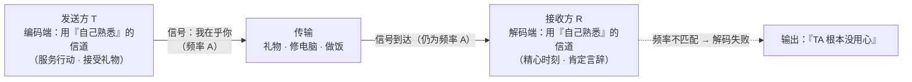
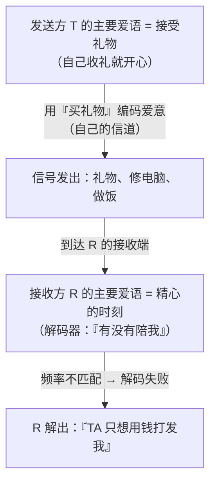

# 第 05 章 · 爱的五种语言：信道匹配

> 核心认知：爱的表达是编码，接收是解码。「我给的」和「TA 收的」是两条不同的信道——主要爱语不匹配，信号再强也穿不过去。让爱穿过 TA 的信道，才算真正送达。

---

## 引子

周六下午，我的出租屋。茶几上是生日宴的残局：七个没来得及送出去的礼物盒、一盒没动几口的蛋糕，旁边立着我修了一下午的旧笔记本——屏幕是修好了，可我心里那口气还堵着。

老谟推门进来，扫了一眼满桌的盒子，在沙发扶手上坐下。

「TA 走了？」他问。

「走了。」我把手里最后一个盒子拆开，拆到一半，手停在半空，「我愣了有五分钟。老谟，我想不通——礼物是 TA 自己提过喜欢的牌子，我攒了三个月钱；蛋糕我提前一周订的；那台破笔记本，TA 的，键盘坏了俩键，我修了一下午，键帽都是拿镊子一个一个换的。TA 从头到尾就丢下一句话——『你买的这些东西，我都不需要。你根本就没用心。』」

「我哪没用心了？」我站起来，「我恨不得把心掏出来，拿包装纸包好，系上蝴蝶结，双手递到 TA 面前。老谟，你说，TA 是不是……不知足？」

老谟没接话，从兜里摸出一台巴掌大的旧收音机，拧开。先是沙沙的电流声，他慢慢地转旋钮，转过两个台，才停在一段清晰的音乐上。

「你听听，」他说，「这个台，声音清楚不清楚？」

「清楚。」我说。

「我要是换个频率，把它转到刚才那两个台之间，」他拧回去，又是满耳朵的沙沙声，「现在呢？」

「……全是杂音。」

老谟把收音机关了，搁在蛋糕盒上，抬起头：「这个台，是清楚还是沙沙，取决于什么？」

---

## 对话引擎

### 第 1 轮：你给的，是你想给的，还是 TA 想收的？

**造物主**：取决于……我调到了那个台。跟收音机本身没关系，跟广播是不是清楚也没关系，就看频率对不对得上。

**老谟**：那 TA 的事，你调对频率了吗？

**造物主**：……我怎么没调对？我送的是 TA 提过的牌子，我修的是 TA 的电脑，我做的每一件事都是围着 TA 转的。

**老谟**：我问的是——「TA 喜欢」这三个字，是 TA 告诉你的，还是你替 TA 决定的？

**造物主**：……TA 是提过那个牌子。可我送的时候，TA 拆都没拆完就放下了。我修电脑，TA 说「你光顾着修，能不能坐下陪我说会儿话」。我哪句话说错了？

**老谟**：先别急着重新选礼物。我问你一句更傻的——你天天给 TA 买东西、给 TA 修东西、给 TA 做饭，这些事，TA 收没收到？

**造物主**：收到了啊！礼盒都摆在桌上了，电脑也修好了，饭也吃了——这还不叫收到？

**老谟**：那我换个问法。你送出去的那些东西，TA 收到「你爱 TA」这个信号没有？

**造物主**：……没有。TA 说的是「你根本没用心」。

**老谟**：好。那你现在告诉我：你天天忙活这一堆，到底是 TA 想收的，还是你想给的？

**造物主**：……我答不上来。我从来没想过，这俩可能不是一回事。

---

**📐 知识锚点：表达与接收的对称性——把第 01 章的编码-解码模型搬回来**

第 01 章我们把一句话拆成「编码 → 传输 → 解码」。现在把这个模型放到一整段关系上，你会看见一个此前被忽略的事实：**沟通这件事，从来不是「发送方做了什么」，而是「接收方解出了什么」。**

| 环节 | 一句话怎么传输（第 01 章） | 爱怎么传输（本章） |
|------|--------------------------|-------------------|
| 编码 | 选词、组句、加语气 | 选动作：买东西、做事、说话、陪伴、接触 |
| 信道 | 语音 / 文字 | 行为信道：你习惯用来表达爱的那类动作 |
| 解码 | 对方还原你的意思 | 对方从你的动作里解出「你爱不爱我」 |
| 噪声 | 评判、旧账、阴阳怪气 | 信道不匹配——信号在错误的频率上被发送 |

**关键对称性（本章第一块基石）**：发送方编码用的是**自己熟悉的信道**——我只会用「做事」编码，因为这是我最熟的；接收方解码用的是**自己熟悉的信道**——TA 只听得懂「陪伴」和「言语」，因为那是 TA 的频道。两边各用各的频率：信号发出去了，强度再高，也解不出来。这跟收音机调错了台一模一样——不是没有广播，是频率不对。



**读图说明**：这是本章的总模型，全程只有三格。左格是发送方 T 的编码端——T 用「自己熟悉的信道」（服务行动、接受礼物）把「我在乎你」编码成行为信号；中格是传输——礼物、修电脑、做饭这些行为发出去了；右格是接收方 R 的解码端——R 用「自己熟悉的信道」（精心时刻、肯定言辞）来解码。关键在最后一根虚线箭头：信号带着「频率 A」到达，可 R 的解码器只认「频率 B」——频率不匹配，解码失败，输出的不是「他爱我」，而是「TA 根本没用心」。**注意，整条链上没有一个环节是「没付出」——失败发生在编码端与解码端的频率错位，不在付出的强度。**

> 注意，这一条还解释了造物主那句「TA 收到了啊」为什么是空的：**「收到」有两个层次——物理层（礼盒在桌上、电脑修好了）与信号层（从这些行为里解出「被爱」）。** 对方没否认物理层，对方否认的是信号层。本章说「收不到」，一律指信号层。

---

### 第 2 轮：爱的表达不止一种信道

**老谟**：那我再问你——你从小到大，见过几个人表达爱的方式，跟你是同一个路子的？

**造物主**：……我室友。他追他对象的时候，天天半夜给 TA 发小作文，一写几千字，还专门记 TA 随口提过的每件小事。我就学不来那个。我给他对象修过两次电脑，他对象挺高兴，可他要的是 TA 发小作文那种……

**老谟**：你学不来，为什么？

**造物主**：写小作文那玩意儿，我憋半天憋不出三行。我宁可去把 TA 的破电脑修了，踏实。

**老谟**：你看——你自己刚才说的那句话，就已经是一个答案了。你「宁可去修电脑」，是因为修电脑让你**舒服**；写小作文让你**难受**。你选你舒服的方式去爱，这没错；可你有没有想过，你舒服，不等于 TA 舒服？

**造物主**：……那 TA 用什么方式表达爱？TA 表达爱，是拉着我坐在沙发上说话，一坐一晚上；是隔三差五说「你最近瘦了」「你穿这件好看」；是走路的时候非要挎着我胳膊。我以前还嫌 TA 黏人……我现在明白了，TA 那不是黏人，TA 是在用 TA 的话跟我说话，我一个信号都没接住。

**老谟**：你刚才这一串话里，已经摸出了至少四种不同的「频道」。你数数。

**造物主**：……我数的：TA 要的是「陪着说话」——这是一种；TA 说「你穿这件好看」——夸人，又是一种；TA 挎胳膊——肢体，还是一种。加上我自己用的「买东西、修东西、做饭」——四种了。是不是还有第五种？

**老谟**：有。你再想想，TA 收到一个盒子，第一反应是「你记得我喜欢这个」——这种「被惦记、被送礼」本身，也是一种。一共五种。这套东西，查普曼（Gary Chapman）在 1992 年出版的《爱的五种语言》（*The Five Love Languages*）里，给它们起了正式的名字，你听着——

**肯定的言辞**（words of affirmation）、**精心的时刻**（quality time）、**接受礼物**（receiving gifts）、**服务的行动**（acts of service）、**身体接触**（physical touch）。

这套五分类，查普曼把每一类都叫一种「爱的语言」（love language）——用咱们的话说，就是一条「表达爱的信道」。你刚才自己摸出来的四种，加上差的那一个，一条不差。

---

**📐 知识锚点：五种信道——查普曼的命名，造物主亲手摸出来的分类**

| 信道 | 英文 | 用这个信道表达爱，意味着 | 接收端「收到」的表现 |
|------|------|----------------------|--------------------|
| 肯定的言辞 | words of affirmation | 直接说出肯定、感谢、欣赏 | 被夸之后觉得「我有被看见」 |
| 精心的时刻 | quality time | 把完整的注意力给 TA：陪伴、专注对话 | 被「完整地陪着」时觉得被爱 |
| 接受礼物 | receiving gifts | 用有形的物件表达「我惦记你」 | 收到用心挑选的礼物时觉得被爱 |
| 服务的行动 | acts of service | 用做事表达：修东西、做饭、跑腿 | 看到「TA 为我去做事」时觉得被爱 |
| 身体接触 | physical touch | 拥抱、牵手、依偎 | 被触碰时觉得被爱 |

> **学派中立声明（必读）**：五种爱语是**流行心理学框架**，不是严格科学理论。查普曼是一位婚姻辅导者（也是牧师），这套分类来自他**几十年婚姻咨询实践的归纳**——他在接待的夫妻里反复看到同几种「我觉得我付出了，对方却说我根本不爱我」的模式，于是把它们归纳成五类。它**不是实验室研究的产物**：没有控制组，没有随机样本，没有标准化测量，五类的边界也没有经过严格的实证检验。学界对它的态度：Egbert 与 Polk（2006）用验证性因素分析检验过查普曼的五个维度，发现「五因子模型」比单因子等备选模型拟合更好（部分支持）；但另有研究者对五种语言的独立性、测量工具与「主要爱语」的稳定性提出质疑（如 Ward 2013 等），支持证据整体有限。
>
> **本书的立场**：把五种爱语当作**沟通框架 / 启发式工具（heuristic）**使用——它给出的分类能帮你识别「我给的」与「TA 收的」之间的错位，这个识别功能是有效的；但本书**不**把它当作像依恋理论、戈特曼追踪研究那样的实证理论。打个比方：依恋理论是「出厂说明书」（有实验室数据背书），五种爱语是「一张好用的地图」（标得出大方向，但别当坐标精确到毫米的卫星图）。本书凡引用实证理论处，仍按实证标准标注；凡引用五种爱语处，一律按启发式工具对待。

---

### 第 3 轮：把 TA 的抱怨清单当成「接收端报错信息」来读

**老谟**：现在回到你那句「TA 不知足」。你把 TA 说过的话，从头到尾给我捋一遍——一句都别改，原话。

**造物主**：……「你买的这些东西，我都不需要」；还有，「你能不能别光顾着修你的电脑，坐下陪我说会儿话」；还有上次吵架，TA 说「你从来没有夸过我」；还有，前阵子 TA 说「你现在都不碰我了，是不是不爱我了」……我自己写着写着，后背发凉。

**老谟**：你先别凉。我问你——一台机器收不到信号的时候，它会怎么告诉你？

**造物主**：……报错。显示「信号丢失」「无法连接」。

**老谟**：那你就把 TA 那几句原话，当成报错信息来读。第一条，「你买的这些东西我都不需要」——报的是什么错？

**造物主**：……「接受礼物」这个频道上，我发了信号，TA 没接收。不对，TA 说「不需要」——这不是「没收到」，这是「这个频道我根本不爱用」？

**老谟**：对。第一条报错是「我在这条频道上广播，TA 的收音机压根不听这条频道」。继续读剩下三条。

**造物主**：「你能不能别修电脑，坐下陪我说会儿话」——报错的是「精心时刻」这个频道，我这端的信号是满的，TA 那端接收是空的。TA 不是在抱怨我修电脑，TA 是在说：**我想要的那条频道，你一直没开。**「你从来没有夸过我」——「肯定的言辞」频道，信号为零。「你现在都不碰我了」——「身体接触」频道，信号为零。

**老谟**：现在，把四行报错摆在一起看——TA 的收音机，一共就调在那几个台上：陪说话、被夸、被碰。你这段时间忙活的那些——买、修、做——全在另一个波段上。你说 TA 不知足？

**造物主**：……不是 TA 不知足。是 TA 的那台收音机，从头到尾就开着那三四个台，我一个都没对准。TA 那些抱怨，没有一句是在找茬——全是在喊：**我这边收不到。**

---

**📐 知识锚点：抱怨清单 = 接收端报错信息**

伴侣在亲密关系里的抱怨，信息密度常常被低估。本章给出一个解读规则：

**把抱怨当作「接收端反馈」来读，而不是当作「攻击」来防。**

| 抱怨原话（造物主的案例） | 逐层解读 | 报错指向的信道 |
|--------------------------|---------|--------------|
| 「你买的这些东西我都不需要」 | 不是否定礼物本身，是说明这条信道不是 TA 的接收频道 | 接受礼物（对 TA 而言是次要信道） |
| 「能不能坐下陪我说会儿话」 | 信号不是没有，是发错信道：TA 要的是注意力，不是服务 | 精心的时刻 |
| 「你从来没有夸过我」 | 该信道长期信号为零 | 肯定的言辞 |
| 「你现在都不碰我了」 | 该信道信号丢失 | 身体接触 |

**注意三个解读纪律（防止把启发式用歪）**：

1. **报错信息 ≠ 全量事实**。「从来没有」可能是夸张表达——要读的是它**指向哪个信道**，不是去考证「上个月到底夸没夸过」（那是第 01 章的事：把评判还原成观察）。
2. **一条抱怨可能叠加多条信道**。吵到深处，「你就是不在乎我」可能同时是精心时刻 + 肯定言辞两条频道一起报错。
3. **解读要回到请求，而不是停留在诊断**。读出「哪条信道没信号」只是第一步；真正要做的是下一条：怎么在 TA 的信道上重新发信号（本章后面的实现思考会做）。

---

### 第 4 轮：造物主撞墙——原来我是在给自己买礼物

**老谟**：诊断完了。现在动真格的——你说你爱用「买东西、修东西、做饭」表达爱，那我问你：这些事，做给 TA 让你舒服，还是你自己做的时候舒服？

**造物主**：……我自己修好一台电脑，那种「成了」的感觉，确实挺上头。可我是为 TA 修的啊！

**老谟**：那这样。你把这七个盒子，原封不动，每样再给自己买一份。然后告诉我，你收到的时候，开不开心。

**造物主**：……开心。我挑的时候就知道，这牌子我也想要，这耳机是我垂涎很久的款……等一下。这些盒子，我是不是挑的时候，脑子里全是我自己会多喜欢？

**老谟**：你终于撞上了。你送 TA 礼物，送得那么起劲，是因为**你自己收礼物会开心**——你在用自己的信道发信号。你以为你在给 TA 买，其实你在给自己买。心理学家管这叫**投射**（projection）：把自己内心想要的东西，当成对方的愿望，安到对方头上。这就是「爱的空转」——发动机在转，轮子没动：你给的是你想要的方式，不是 TA 想要的方式。

**造物主**：那我修电脑那件事，总不是为了我自己吧？TA 那台破笔记本，键盘坏俩键，我修一下午——

**老谟**：修好了，谁有成就感？

**造物主**：……我有。行。我笑了笑，笑到一半僵住——我算是看明白了，我这一整个月，都在拿 TA 当镜子，照我自己想要的。

**老谟**：你不是坏，你是**熟练**。一个人用自己爱收的方式去爱人，是本能，不丢人。丢人的是撞了墙还不知道墙在哪。

---

**📐 知识锚点：主要爱语与爱的空转（projection）**

**主要爱语（primary love language）**：一个人最能稳定解码出「被爱」的那条信道。其余四条是次要爱语（secondary love languages）——也能收到信号，但灵敏度低、容易漏。判断「哪条是主要的」，不是看他嘴上说想要什么，而是看**哪条信道上的一点点信号，能换来他最大强度的「被爱」反应**。

**爱的空转（love idling）**：发送方持续用「自己的主要爱语」作为表达信道，而接收方的主要爱语在另一条信道上——于是能量不断消耗，信号始终发不出。这条机制的心理学实质，是**投射（projection）**：把自己的偏好读成对方的愿望。



**读图说明**：这张图是一条完整的传输链。左上是发送方 T 的编码端——T 用自己的主要爱语（接受礼物）当表达信道，发出的信号是「买礼物、修电脑、做饭」这类行为；中段信号到达接收方 R；右下是 R 的解码器——R 的主要爱语是精心的时刻，解码逻辑是「你有没有陪我」。于是信号到了，解码失败，R 解出的不是「他爱我」，而是「他想用钱打发我」。**注意图中每个节点都用「主要爱语」标注——信道失配的根源不在「有没有付出」，而在「编码端和解码端各自的『主要』不一样」。**

> **跨章呼应（第 04 章 · 依恋理论）**：这里有个极易被误用、必须划界的交叉点——依恋理论（实证基础较强）显示，**焦虑型**个体对「回应性、确认性的信号」格外敏感：延迟回应就会被解码为「不被爱」。这与「精心的时刻 / 肯定的言辞」两条信道在**概念上有亲和性**——确认信号恰好经常以陪伴和言语的形式送达。但请务必看清两个框架的边界：依恋理论说的是「个体对回应性的敏感度」，五种爱语说的是「个体偏好的表达形式」，二者**不是一回事**，本书**不替读者做**「焦虑型 → 主要爱语是精心时刻」这类推断——那超出了两类研究各自支持的范围。你要做的只是：把「TA 对什么敏感」和「TA 偏好什么形式」当作两个问题，分开收集数据。

---

### 第 5 轮：怎么识别 TA 的主要爱语——造物主自己推出三把尺子

**老谟**：诊断完了，撞墙也撞完了。现在你手里有五个信道，可每个正常人都不是五条全开——大多数人只有一两条是「主频」。心理学家给它起了个名字：**主要爱语**（primary love language）——你解出「被爱」效率最高的那条信道。怎么识别 TA 的主频？别指望我给你一张问卷，你自己想。

**造物主**：……我自己想。第一把尺子，是**看 TA 怎么表达爱**。我自己就是这样——我只会用「做事」去爱，因为我最爱「被做事」……不对，我是最爱收礼物、最享受「被惦记」。人好像天然会拿自己爱收的方式去爱别人，那我反过来用：看 TA 平时怎么对我，TA 的方式，多半就是 TA 想被对待的方式。

**老谟**：第二把。

**造物主**：第二把，是**听 TA 的抱怨**——就是刚才那套报错信息。TA 抱怨我什么，就说明 TA 缺哪条信道上的信号。TA 没说我「买的太多」，TA 说的是「你从不夸我」——抱怨比表扬诚实，因为人在满意的时候懒得说，在不满足的时候才忍不住报错。

**老谟**：第三把。

**造物主**：第三把，是……直接问。但是不能问「你的爱语是啥」，那太抽象了，TA 自己多半也答不上来。要问具体的——用第 03 章那套请求的语法：描述我观察到的，说我的需要，然后问 TA 一个具体的、对方能答的问题。比如——「我想让你能感觉到我爱你这事，我最近做的哪一件事，你印象最深？」

**老谟**：哪一件事 TA 印象最深，那件事就通向 TA 的信道。三把尺子，全是你自己量出来的。

---

**📐 知识锚点：识别主要爱语的三种方法（造物主推出，老谟只问了三个问题）**

| 方法 | 操作 | 底层逻辑 | 注意 |
|------|------|---------|------|
| a. 观察 TA 如何表达爱 | 记录 TA 主动对你做的那些「爱的动作」集中在哪类 | 表达-接收镜像假设：人倾向于用自己爱收的方式去爱（本章定理 2） | 不绝对，需与 b、c 交叉验证 |
| b. 听 TA 的抱怨 | 把 TA 的抱怨当报错信息，看它指向哪条信道 | 抱怨 = 未被满足的接收需求的显式反馈 | 别跟抱怨「讲道理」；先读信道 |
| c. 直接问（第 03 章请求语法） | 用观察 + 请求句式，请 TA 举具体例子 | 最便宜、最准确的获取数据方式 | 问「具体哪件事」，不问「你的爱语是啥」 |

**为什么不能只靠一张问卷**：市面上的爱语自测问卷（包括查普曼官方的那份）能给出一个起点，但它测的是**你在纸面上选的偏好**，不是**你身体实际解出来的信号**；而且五种语言的测量效度本身有争议（见学派中立声明）。三把尺子的价值在于：数据来自**真实关系里的行为样本**，而不是自陈偏好——这跟第 04 章说的「成人依恋访谈不问你童年快不快乐，看你怎么叙述」是同一个原理：看现场，别听汇报。

---

### 第 6 轮：实现思考——设计一台「爱语信道配置器」

**老谟**：理论走完了。实现。假设你是工程师，要给这段关系写一个「爱语信道配置器」——像配置路由器信道那样：**输入对方的主要爱语，输出一套「信号转换规则」，把你的付出翻译成对方信道上的信号。** 你打算怎么设计？注意，你不是在发明新付出，你是在把现有的付出**转码**。

**造物主**：……那我先定义输入和输出。输入：对方的主要爱语 L（五选一，加上置信度）。输出：一条「转换规则表」——把我已经会做的那些动作（买、修、做、陪、夸、抱），映射到 L 这条信道上。

**老谟**：具体点。

**造物主**：举个例子。我的默认动作是「服务行动」和「接受礼物」。如果对方的主要爱语是「精心的时刻」，转换规则就是：**把「修电脑」转码成「陪 TA 一起修」**——不是不修了，是修的时候把 TA 拉进同一个时空，说「你坐着，我修，你在这陪我说话」；把「买礼物」转码成「带着 TA 去挑」，挑的过程本身就是精心时刻。信号还是那个付出，只是换了个载体。

**老谟**：那要是对方的主要爱语是「肯定的言辞」呢？

**造物主**：那转换规则是：**给每个服务行动配一句「人话」**。我修好电脑，以前是放下就走，现在是坐下说一句「我修好了，你试试——你上次说卡，我给你清干净了」。做事 + 一句话，等于把「服务」信道上的信号，同时翻译成了「肯定言辞」信道上的信号。我之前是光做事不吭声，等于信号发出去没人解码。

**老谟**：好。现在把你自己推进你自己的系统里——配置器跑起来，代价在哪？

**造物主**：……代价一：**别扭**。让我天天开口夸人、天天坐下来干聊，比让我修三天电脑还累。用非惯用信道表达爱，就像用左手写字——写得慢，写得丑，还容易写一半想放弃。代价二：**信道会漂移**。TA 前两年爱收礼物，今年变了，改要陪伴了——人的信道不是焊死的，人生阶段一变，信道就换。配置器必须支持**定期重配置**，比如每季度重新跑一遍三把尺子，把配置项更新一遍。不然我照着去年的配置表发信号，发的又是空转的。

**老谟**：还有一条代价，你还没说。

**造物主**：……代价三：**转码不等于替 TA 决定**。我得先确认 TA 的主要爱语真是「精心时刻」，而不是我猜的。配置器的输入要是错的，输出全是空转——所以我那三把尺子得反复跑、跟 TA 核实。工具再好，用错参数，等于没用。

---

**📐 知识锚点：爱语信道配置器 v0.1（实现思考交付物）**

```
┌───────────────────────────────────────────────────────┐
│  爱语信道配置器 v0.1                                   │
│                                                       │
│  输入：L = 对方主要爱语（由三把尺子交叉判定）            │
│        Conf = 置信度（观察/抱怨/直接问 三条证据是否一致） │
│                                                       │
│  处理：SIGMA 转换规则表 —— 把 T 的默认付出动作 {买,修,做, │
│        陪,夸,抱} 转码为 L 信道上的等价信号              │
│                                                       │
│  输出：一条「本周信道计划」+ 重配置周期                  │
│                                                       │
│  约束：① 转码不取消原付出，只换载体                     │
│        ② 每条转码必须经对方核实（防自说自话）            │
│        ③ 每季度重跑三把尺子（防信道漂移）               │
└───────────────────────────────────────────────────────┘
```

**三条代价（造物主自己列出来的，一条都不能省）**：

1. **学习成本**：用非惯用信道表达爱，天然别扭、天然会退化。这不是「做作」，是**在练一门新外语**——舌头不利索是正常的，要的是持续练习，不是一次到位。
2. **信道漂移**：人的主要爱语随人生阶段、关系状态变化（这是实践观察，实证支持有限）。所以配置器必须支持重配置——**定期重跑三把尺子，是信道匹配的日常维护**，不是一次性的。
3. **参数错误风险**：转码表的一切正确性，建立在 L 判断正确之上。用三把尺子交叉验证，是「防自说自话」的最后一道闸——**宁可多问一句，不要自作聪明**。

---

### 第 7 轮：落点——让爱穿过 TA 的信道，才算送达

**老谟**：退回到你进门说的那句话——「TA 是不是不知足」。现在，用今晚摸出来的东西，把「我哪没用心了」重新说一遍。

**造物主**：……不是我没用心。是我用我的信道在用心——我一直在用自己的频道发射，还怪 TA 的收音机不响。TA 不是不知足，TA 是没收到。我攒三个月钱买礼物，是在给「收到礼物的自己」买；我修一下午电脑，是在修「我的成就感」。我付出的每一分都是真的，可它们全都发在了 TA 收不到的频率上。

**老谟**：那你打算怎么把这七个盒子，送到 TA 的信道上去？

**造物主**：……不送了。我把那台修好的电脑还给 TA 的时候，会坐下，把 TA 拉到沙发上，说一句——「我修好了，你试试；还有，我想听你说说上周那件事，你现在还气不气。」礼物还是那个礼物，但信号，换条信道发。让爱穿过 TA 的信道，才算真正送达。

**老谟**：行了。你今晚不是送了七个盒子，是给这台收发机配对成功了一个频段。

**造物主**：那下一章，我们学什么？

**老谟**：你认识了操作系统（第 04 章），学会了信道匹配（本章）。可这两样都是「在一起之后」的功夫——从陌生人到在一起，靠的是另一套东西：吸引力。下一章我们就回答那个问题：**吸引力到底从哪来？怎么从陌生人，到在一起？**

---

## 严格化走廊

> 把本章对话里「摸出来的直觉」落成严格形式。注意：本章大部分命题建立在「沟通框架 / 启发式工具」之上，凡属启发式，一律显式标注，不冒充实证定理。

### 定义（精确表述）

**定义 1（爱语 / 爱的表达信道）**：爱语（love language）是一种规范化的信号形式类别——发送方用它来编码「我在乎你」，接收方用它来解码「TA 在乎我」。五个候选信道：肯定的言辞（words of affirmation）、精心的时刻（quality time）、接受礼物（receiving gifts）、服务的行动（acts of service）、身体接触（physical touch）。*（启发式定义：来源于查普曼 1992 的咨询实践归纳，非实验室界定；其类别边界的实证地位见学派中立声明。）*

**定义 2（表达信道与接收信道）**：设个体 A 对某发送行为集合 S 有「表达熟练度」E(S)（A 习用、愿意主动使用的程度）与「接收灵敏度」R(S)（S 被 A 解码为「被爱」的效率）。A 的**表达信道** = argmax_S E(S)；A 的**接收信道** = argmax_S R(S)。**主要爱语（primary love language）** 即 argmax_S R(S)；其余为次要爱语（secondary love languages）。

**定义 3（爱的空转）**：设发送方 T 的表达信道为 C_T，接收方 R 的主要爱语为 L_R。若 C_T ≠ L_R，且 T 的爱的表达全部落在 C_T 上、L_R 上无信号（或信号弱于 R 的接收阈值），则称这段关系处于**爱的空转**（love idling）状态——能量在消耗，信号未送达。空转的心理实质是**投射（projection）**：T 以「自己想要的」代替「对方想要的」来编码。*（注：此处「投射」是对心理防御术语的借用，取其「把自己的偏好安到对方身上」这一核心义，不引申至精神分析其他层次。）*

### 定理（带全前提条件；标 ★ 者为启发式定理）

**定理 1（信道失配定理 ★）**：设发送方 T 与接收方 R 处于亲密关系（前提 P1：双方均处于「被爱感」需求被激活的状态，如日常亲密互动中；P2：T 的全部或绝大部分爱的表达落在 C_T 上；P3：R 的主要爱语 L_R ≠ C_T，且 L_R 上信号强度低于 R 的接收阈值；P4：关系内不存在第三类干扰性信号，如持续的羞辱或操控）。则 R 报告「感受不到被爱」的频率，显著高于 L_R = C_T 的情形。*（启发式定理：方向来自沟通模型推导与临床实践归纳；幅度无实证量化。）*

**定理 2（表达-接收镜像假设 ★）**：给定个体 A 的表达信道 C_A 与接收信道 L_A（定义 2），C_A 与 L_A 之间存在正相关——人倾向于用自己接收灵敏度高的信道去表达爱。*（启发式假设：这是识别方法「观察 TA 怎么表达爱」的底层依据；正相关成立但非严格一一对应，故定理 2 只作假设、不作定律。）*

**定理 3（抱怨-报错解读定理 ★）**：设关系满足基本尊重与安全（前提 P1：不存在持续羞辱、操控、暴力等使抱怨成为操控工具的情形；P2：抱怨针对的是行为/关系状态而非人身攻击——人身攻击部分先按第 01 章处理），则 R 关于「你不爱我 / 你没用心 / 我不被重视」类的抱怨，可被解读为「某接收信道 L 上信号不足」的报错信息。*（启发式定理：解读方向可操作，但「抱怨一定是信号不足」并不必然成立——抱怨也可能源于其他机制，如依恋焦虑的确认需求（第 04 章）。）*

### 证明（完整可复写；注：本节给出的是「机制链证明」，不是「实证证明」）

**证明定理 1 的机制链（信道失配 → 信号未解码）**：

- **步骤 1**：由第 01 章编码-解码模型，接收方 R 对发送方 T 行为集合的解码结果，由 R 的解码器决定，而非由 T 的编码意图决定。*（依据：第 01 章——「对方从你的话里还原出的意思」是解码的结果。）*

- **步骤 2**：由定义 2，R 的主要爱语 L_R 是 R 解码效率最高的信道。在 L_R 上，给定强度的信号可稳定越过 R 的「被爱感知阈值」；在其他信道上，同等强度信号被衰减，可能低于阈值。*（依据：定义 2 的接收灵敏度——这是「主要」二字的操作定义。）*

- **步骤 3**：由前提 P2，T 的全部表达落在 C_T 上；由前提 P3，C_T ≠ L_R。故 T 的信号全部落在 R 的非主要信道上，经衰减后低于阈值，未被解码为「被爱」。*（依据：步骤 2 + 前提 P2、P3。）*

- **步骤 4**：R 未解码出「被爱」信号，R 的「被爱感」长期处于未满足状态。由前提 P1（需求被激活），未满足的需求将转化为行为输出——其中一类就是抱怨与疏离。*（依据：需求的表达——参考第 02 章「需要」的概念：未被满足的需要会以各种形式试图被看见。）*

- **步骤 5**：由步骤 1-4，R 报告「感受不到被爱」。□

> **该证明的性质与边界（必须同读）**：这条链的每一环都是**机制推理**，依据是第 01 章的通信模型与第 02 章的需要概念——它证明了「信道失配在机制上足以导致信号未送达」，但**没有**证明「现实中每一起『我付出了 TA 却说不爱我』都是信道失配」。现实中还混着依恋焦虑的确认需求（第 04 章）、评判噪声（第 01 章）等其他机制。故定理 1 的结论是「显著高于」，不是「必然等于」。

### 反例/边界（钉死适用域）

**反例 1（信道匹配时，付出直接命中）**：若 R 的主要爱语就是「接受礼物」，T 的礼物会直接越过阈值被解码为「被爱」——此时礼物不是空转，是正中靶心。**边界**：这也意味着「对方主要爱语是接受礼物」的判断必须来自三把尺子，而不是 T 的自恋——否则 T 又会以「我判断 TA 爱收礼物」为由，继续给自己买礼物。

**反例 2（五种信道并非严格独立）**：研究者对五类之间的独立性有争议（如 Ward 2013 等的批评性检验指出，五类可能并非正交、主要爱语随测量方式漂移）。真实的人常常同时吃两三种信道，主要爱语也不像「一个正确选项」那样稳定。**边界**：五种爱语是**启发式分类**，不是**粒子物理**——把它当「穷举且互斥」的清单用，是用错了工具。三把尺子之所以要求交叉验证，就是为了防住这个。

**反例 3（爱语 ≠ 话术的替代品）**：若 T 学会在 L_R 上发射信号，但内心毫无情感投入，只是把「说情话」「陪坐」当成完成任务——R 会解码出「形式到位，人不在」。此时问题已不是信道，而是**发送方根本没有要发送的信号**。**边界**：信道匹配解决的是「信号送没送到」，解决不了「有没有信号」。后者是真诚问题，超出任何沟通框架的能力。

**反例 4（本章技术不适用场景）**：若关系里已出现持续的羞辱、操控、威胁或暴力，伴侣的抱怨**不是**报错信息，而是控制工具（或求救信号）——此时按定理 3 解读抱怨，等于配合操控。**边界**：与第 04 章共享同一红线——**先保证安全，再谈信道**。信道匹配是经营关系用的，不是忍受虐待用的。

**边界讨论（与实证理论的方法论差异，学派中立）**：戈特曼的爱情实验室是**纵向追踪 + 生理测量 + 行为编码**的实证研究（40 年、3000+ 对夫妻），依恋理论有陌生情境实验与成人依恋访谈的测量传统——这两者产出的结论可以「带前提地作为事实使用」。查普曼的五种爱语来自**咨询室里的实践归纳**，没有同等级的测量学背书。本书的做法：本章所有「信道匹配」类操作，均作为启发式工具使用并显式标注；凡与实证理论冲突处（如反例 2 的独立性问题），以实证争议为准，不替科学界裁决。

---

## 知识点总结

### 知识点（本章推出的核心概念）

- **爱语（love language）**：五种规范化信道——肯定的言辞 / 精心的时刻 / 接受礼物 / 服务的行动 / 身体接触。
- **表达信道 vs 接收信道**：发送方用自己熟悉的信道编码，接收方用自己熟悉的信道解码；两边各用各的频率 = 信号丢失。
- **主要爱语（primary love language）**：接收灵敏度最高、最稳定解出「被爱」的那条信道；其余为次要爱语（secondary love languages）。
- **爱的空转（love idling）**：一直在用自己的信道发信号，对方在另一条信道上永远收不到；心理实质是投射（projection）——把自己的偏好安到对方头上。
- **抱怨 = 报错信息**：把 TA 的抱怨当接收端反馈来读，看它指向哪条信道，而不是当攻击来防。
- **识别三把尺子**：a. 观察 TA 怎么表达爱（镜像假设）；b. 听 TA 的抱怨（报错解读）；c. 直接问（第 03 章请求语法，问具体例子）。
- **爱语信道配置器 v0.1**：输入对方主要爱语 → 输出信号转换规则（转码不取消原付出）；三条代价：学习成本、信道漂移、参数错误。

### 历史结论（本章涉及的史料）

- 盖瑞·查普曼（Gary Chapman）1992 年出版《爱的五种语言》（*The Five Love Languages*）——来自婚姻咨询实践归纳，非实验室研究；本书将其作为启发式工具使用。
- Egbert & Polk（2006）：发表在 *Communication Research Reports* 的验证性因素分析研究，五因子模型拟合优于备选模型（部分支持）。
- 多名研究者（如 Egbert & Polk 2006 的部分支持与后续综述的质疑）对五种语言的独立性、测量效度与「主要爱语」稳定性提出质疑；整体实证支持有限（查普曼框架本身是婚姻咨询实践的归纳，非实验室研究，详见上文方法论边界）。
- 方法论文本对比：戈特曼（纵向实验室追踪、生理测量）与依恋理论（陌生情境/成人依恋访谈）为实证进路；查普曼为临床实践归纳进路。本书对三者区别对待。

### 工程实践结论（本章知识在真实世界怎么用）

- **识别先于改造**：先用三把尺子交叉确认对方的主要爱语，再动手转码；输入错了，输出全是空转。
- **转码不取消付出**：不是不买东西、不修东西了，而是给原有付出换载体（如把「修电脑」转码成「陪 TA 一起修」）。
- **定期重配置**：信道会漂移，按季度重跑三把尺子，是信道匹配的日常维护。
- **安全红线**：本章技术以关系内存在基本尊重与安全为前提；持续羞辱/操控/暴力场景下，抱怨不是报错信息，先离开，再谈信道。

---

## 沟通训练场

> 位置说明：沿用全书约定——对话里零操作步骤，所有「怎么练」收进训练场。以下练习每题动笔 10 分钟以上。

### 题 1：爱语识别题——读一段七日互动日记，识别双方主要爱语与空转点（难度：中）

**题干**：以下是阿澈（在一起第三年）的七日日记摘录。用本章三把尺子，完成：① 判断阿澈的主要爱语，给证据；② 判断 TA（阿澈的伴侣，全文以「TA」称呼）的主要爱语，给证据——注意区分「TA 说的话」和「TA 做的事」；③ 找出至少 3 个「爱的空转」点；④ 给阿澈写一条「转码建议」，说明把哪个动作转成哪个信道的什么等价表达。

> 周一：TA 加班到九点，我把 TA 爱吃的排骨炖好，在锅里保温。TA 回来只说「哦，放那吧」，就去洗澡了。有点没劲。
> 周二：我修好了 TA 的台灯。TA 睡前看到了，没提。我有点不是滋味。
> 周三：TA 破天荒主动说「你最近是不是瘦了」，我说没有。晚上 TA 又说「咱俩好久没一起看电视了」，我嘴上说行，心里想的是周五要交的方案。
> 周四：我加班，TA 把一袋水果放我桌上，附了张纸条：「少熬夜」。我其实更想让 TA 给我发条长消息问问今天累不累。
> 周五：TA 说周末想去爬山，我说我正好把车子保养做了，顺便送你去。
> 周六：爬山取消了（下雨）。TA 在家坐了一下午，没怎么说话。我把自己关在书房看方案，中间出来给 TA 倒了杯水。
> 周日：TA 忽然说：「你是不是觉得我很烦。」我说没有。TA 说：「你什么都不说，我也不知道你在想什么。」

**完整分步解答：**

第 1 步：判断阿澈的主要爱语（用尺子 a：看 TA 怎么表达爱；用尺子 b：听 TA 抱怨什么）。

- 尺子 a：阿澈的付出动作几乎全是**服务行动**——炖排骨、修台灯、保养车子、倒水（周一、周二、周五、周六），「我做了什么」是他的默认表达方式。唯一一次「礼物+纸条」也是服务性质（周四：送水果附纸条，本质是「照顾」）。**证据指向：服务的行动（acts of service）为阿澈的主要表达信道。**
- 尺子 b：阿澈的失落点（周一「有点没劲」、周二「不是滋味」、周四「我其实更想让 TA 给我发条长消息问问今天累不累」）——注意周四那条最关键：**阿澈自己写「我其实更想让 TA 发条长消息问问我」**。这说明阿澈真正想接收的信号是「被言语地关心」，不是「被服务」。**证据指向：肯定的言辞（words of affirmation）是阿澈的主要接收信道（可能兼有精心的时刻）。**

第 2 步：判断 TA 的主要爱语。

- 关键纪律：**看 TA 做的事，别只看 TA 说的话。** TA 说的话有两类——① 请求类：「好久没一起看电视了」（周三）、「周末想去爬山」（周五）、「你什么都不说」（周日）；② 试探类：「你是不是觉得我很烦」（周日）。这两类都指向**精心的时刻（quality time）**：TA 要的是「两个人完整的、共同的时间」，而不是「被服务、被安排」。
- 而 TA 做的事——放水果、附纸条「少熬夜」（周四）——是用**服务行动**表达，这符合镜像假设（TA 以为服务能表达爱），但注意：**TA 的表达信道 ≠ TA 的接收信道**。TA 最渴望的信号是「你愿意把时间给我、你愿意跟我说话」。**证据指向：精心的时刻是 TA 的主要爱语，肯定的言辞为次要。**

第 3 步：找出至少 3 个空转点。

- 空转点 1（周一/周二）：阿澈用「服务行动」发信号（炖排骨、修台灯）——服务是阿澈的表达信道，但 TA 的接收信道是精心时刻 + 肯定言辞，信号衰减、未解码。阿澈因此觉得「有点没劲」，这正是空转的典型感受。
- 空转点 2（周三/周五）：TA 已经明确发出「一起看电视」「去爬山」的请求（精心时刻），阿澈要么口头答应（周三），要么把「爬山」改造成「我保养车顺便送你」（周五）——又一次把「共同时间」偷换成了「服务行动」。TA 的请求没有被按原信道接住。
- 空转点 3（周六）：两个人在同一屋檐下，一个坐一下午等陪伴，一个关书房做方案只出来倒水——同一空间，零共同时刻。TA 的「坐了一下午」是典型的「接收端等待信号」，阿澈把「倒水」当作陪伴的替代品（又一次服务行动转码失败）。
- 空转点 4（周日）：TA 的报错信息到达临界点：「你什么都不说，我也不知道你在想什么」——这是**肯定的言辞 + 精心的时刻双信道报错**。

第 4 步：给阿澈写一条转码建议。

- 建议：把「服务行动」转码为「精心时刻」——不是取消服务，是给服务加上「共同时间」的载体。例：修台灯（服务）→ 改为「修的时候叫 TA 坐在旁边，边修边说说话，修完一起试试灯」（精心时刻 + 服务）；炖排骨 → 改为「一起做饭，一个切菜一个掌勺」；回应「周末爬山」→ 不要改成「我保养车顺便送你」，直接答应「好，咱俩去」——爬山是 TA 要的，车哪天都能保养。

**答：** 按本章定义 2（主要爱语 = argmax R(S)，即**接收**信道）：阿澈的表达信道为「服务的行动」，主要爱语（接收信道）为「肯定的言辞」；TA 的表达信道为「服务的行动」（镜像假设），主要爱语（接收信道）为「精心的时刻」（请求类话语 + 等待陪伴的行为均指向此信道）。空转点 4 处，核心模式是「阿澈不断把 TA 的『共同时间』请求偷换成『服务行动』」。转码建议核心：**给服务加上共同的时空，把「我为你做事」改成「我陪你做事」。**

**常见错误：** ① 把「TA 说的话」和「TA 做的事」混为一谈——周四 TA 送水果是服务表达，但 TA 的接收信道仍是精心时刻，判断接收信道要看 TA 的「报错点」（请求与抱怨），不是 TA 的回赠方式；② 把阿澈周四那句「更想让 TA 发长消息」读成阿澈主要爱语是服务——恰好相反，这条自述暴露了阿澈真正的接收信道；③ 只诊断不转码——识别空转不是终点，必须落到一条具体的转码规则。

### 题 2：信号转换题——把 A 信道上的付出，改写成 B 信道上的等价表达（难度：中→难）

**题干**：小枝的主要爱语是「精心的时刻」（经三把尺子确认，置信度高）；她伴侣阿树的表达信道是「服务的行动 + 接受礼物」（他自己也承认：让他闲坐着聊天比让他干活难受）。以下三个场景，阿树都用他自己的信道表达了付出，请把每个场景的付出**转码**成小枝信道上的等价表达，并说明：转码保留了什么、改变了什么、为什么这样改等于「同一个信号换信道」。

> 场景一：小枝生日前一周，阿树加班两周攒了调休，买好了她念叨过的演唱会门票，准备生日当天给她惊喜。
> 场景二：周末大扫除，阿树一个人把厨房卫生间全收拾了，让小枝「歇着」，干完觉得自己很了不起。
> 场景三：小枝最近工作压力大，回家话少。阿树每晚给她削好水果端到床边，心想「我能做的就是照顾好你」。

**完整分步解答：**

第 1 步：先明确「原信号的语义」——转码不是换一件事，是保住原信号要传达的那句话。

- 场景一原信号：「我记着你念叨的票，我为你付出了很大的成本（两周调休），我想让你开心」——核心是「**被惦记 + 为你花心思**」。
- 场景二原信号：「我爱你 → 我用行动证明」——核心是「**我为你做事 = 我在乎这个家**」。
- 场景三原信号：「我心疼你，我接住你的情绪」——核心是「**我看见了你的累，我想托住你**」。

第 2 步：逐场景转码（目标信道：精心的时刻）。

**场景一**：原方案「门票惊喜」落在「接受礼物」信道（礼物 = 门票）。
- 转码方案：把「买票惊喜」改为「**买好票，然后当着小枝的面说出来：『我加了两周班攒了调休，把演唱会票买了，生日那天咱俩一起去，我陪你看完，晚上再一起吃个饭』**」。礼物还在，但送达方式从「她拆开盒子」变成「**你当着她的面，把时间和注意力一起给她**」。
- 等价性说明：保留的是「被惦记、花心思」的信号；改变的是载体——从「有形的票」换成「你愿意公开宣告这份心意 + 完整的共同时段」。对小枝而言，「你花了时间在我身上」比「你花了钱在我身上」更能解码为「被爱」。**注意：转码不取消门票，门票保留，只是它不再是信号的主要载体，共同时间才是。**

**场景二**：原方案「一个人干完所有家务」落在「服务的行动」信道。
- 转码方案：改为「**分工做——你擦厨房，把小枝叫来擦客厅，干一会儿，坐下来喝口水，说一句『你擦得比我仔细』，顺便问问她最近那事怎么样了**」。核心动作是：把「你歇着，我来」改成「**咱们一起干，干完一起坐下来聊两句**」。
- 等价性说明：保留「我为这个家出力」；改变的是「出力」的对象结构——从「替你干活」变成「跟你共同经历一段时间」。对小枝而言，「一起做完一件事」本身就是精心的时刻；而原方案里她「歇着看你干」，反而等于**她一个人闲坐着、你一个人忙——物理上在同一个屋檐下，精心的时刻却为零**（与题 1 周六场景同构）。

**场景三**：原方案「每晚削水果端床边」落在「服务的行动」信道。
- 转码方案：改为「**水果照削，但削的时候别光递过去——坐床边，把碗放床头柜上，问一句：『今天是不是特别累？想不想跟我说说？』然后关掉手机，等她开口，或者陪她坐十分钟**」。如果她不想说，就说「那我陪你坐会儿，不想说就不说」。
- 等价性说明：保留「我心疼你、我托住你」；改变的是——把「照顾的动作」升级为「**带着完整的注意力在场**」。她压力大、话少时，真正缺的不是水果（服务），是「有人愿意陪我待着」（精心时刻）。削水果是入场券，陪伴才是主菜。

第 3 步：总结转码的一条通用规则（阿树自己概括）。

- 规则：**当目标信道是「精心的时刻」时，一切的等价转换都围绕同一个动词——「一起」**。把「我替你 X」改成「我陪你 X」；把「我给你 X」改成「我当着你的面把 X 和我的时间一起给你」。服务的行动和接受礼物不是要消灭，是要**降级成载体，让「共同时间」成为主信号**。

**答：** 三场景分别从「接受礼物」「服务的行动」转码为「精心的时刻」，等价性核心 = 保住原信号的语义（被惦记 / 出力 / 托住你），改变的是载体（有形物 → 共同时间）；通用规则：「我替你」→「我陪你」。

**常见错误：** ① 把转码理解成「不做原事了」（取消了门票 / 不削水果）——转码是换载体，不是取消付出；② 转码成「陪」但人不带注意力（人坐着、手机刷着）——精心的时刻的定义是「完整的注意力」，人不在场等于没转码；③ 只改了行为、没解释语义——等价性的根基是「原信号要传达的那句话」没变，说不清这句，转码就是换汤不换药。

---

## 向导便签

> **本章干了什么**：从「我天天给 TA 买礼物，TA 却说我不爱 TA」出发，用第 01 章的编码-解码模型推导出「表达信道 ≠ 接收信道」；亲手盘点出五种爱语（查普曼命名）；把 TA 的抱怨清单当报错信息逐条解码；撞墙撞出「爱的空转」（原来我是在给自己买礼物）；自己推出识别主要爱语的三把尺子；设计了一台「爱语信道配置器」并列出三条代价。
>
> **钉死一句话**：不是你不爱 TA，是你一直在用你的信道爱 TA；让爱穿过 TA 的信道，才算真正送达。
>
> **毒舌收口**：别急着骂 TA 不知足——你先检查检查你那台发射机，拧对频率了吗？礼物不是不能买，问题是：你买的是 TA 想收的，还是你想送的？

---

## 造物主手记

**我曾踩的坑**：

- 坑 1：以为「付出多 = 爱得深」。我攒三个月钱买礼物、修一下午电脑，感动了自己一整月。直到老谟让我「每样给自己再买一份」，我才发现那些盒子我早就替自己挑过了——我不是在给 TA 买，我是在给「收到礼物的自己」买。付出是真的，方向是错的。
- 坑 2：以为「TA 说我不够用心 = TA 不知足」。把 TA 的抱怨当攻击来防，防了一个月。其实 TA 的每一句抱怨都是报错信息：「你从不夸我」是肯定言辞信道报错，「能不能坐下陪我说会儿话」是精心时刻信道报错。我不是被 TA 冤枉了，我是根本没开 TA 那几条信道。
- 坑 3：以为「识别一次就够了」。我自己设计的配置器里写着「每季度重跑三把尺子」——因为人的信道会漂移。我去年还吃「被惦记」这套，今年可能就改成要「被陪伴」了。拿去年的配置表发今年的信号，等于发去年的频率，一样是空转。

**顿悟时刻**：当我把七个盒子放下，第一次说出「我修好了，你试试——还有，我想听你说说上周那件事」的时候，我忽然明白：爱从来不是东西，爱是**信道**。同一个信号——我在乎你——可以用一千种载体发出去，但只有落在对方信道上那一种，才算真的送达。我以前觉得自己在谈恋爱，其实我一直在对着自己的频率广播，还怪对方收音机不响。

---

## 自测题

1. 用第 01 章的编码-解码模型，一句话解释「我天天送礼物，TA 却说不爱我」。（*简答要点：发送方用自己熟悉的信道（接受礼物/服务行动）编码，接收方用自己熟悉的信道（精心时刻/肯定言辞）解码，双方频率不匹配，信号未被解码为「被爱」。*）
2. 什么是「爱的空转」？它的心理实质是什么？（*简答要点：发送方持续用自己接收灵敏的信道发信号、接收方在另一信道上收不到的状态；心理实质是投射（projection）——把自己的偏好安到对方头上。*）
3. 为什么「听 TA 的抱怨」比「听 TA 的表扬」更能识别 TA 的主要爱语？（*简答要点：抱怨是接收端未满足需求的报错信息，直接指向缺失的信道；人满意时往往懒得表达，报错时信道最诚实。*）
4. 识别主要爱语的三把尺子是什么？为什么不能只靠一张自测问卷？（*简答要点：观察 TA 怎么表达爱、听 TA 的抱怨、用第 03 章请求语法直接问具体例子；问卷测的是纸面偏好，测量效度本身有争议，三把尺子取的是真实关系里的行为样本。*）
5. 边界题：本章说「把付出转码到 TA 的信道上」，为什么这条规则不适用于已经出现持续羞辱/操控/暴力的关系？（*简答要点：安全红线——此时抱怨不是报错信息而是控制工具；信道匹配是经营关系用的，不是忍受虐待用的；先保证安全，再谈信道。*）

---

## 预告

老谟把收音机揣回兜里，站起来，拍了拍我的肩：「你今晚学会的不是『怎么说情话』，是『怎么把话送到对面那台收音机上』。」

他走到门口，又停住：「不过——信道匹配这东西，是两个人在一起之后才用得上的。我考你一个问题：从陌生人到在一起，你靠的是信道匹配吗？」

「……不是。」我说，「我连 TA 的信道都不知道的时候，是怎么被 TA 吸引的？吸引力好像根本不需要信道——它先于一切。」

老谟笑了：「问得好。下一章就回答这个：**吸引力到底从哪来？怎么从陌生人，到在一起？** 你认识了操作系统，学会了信道匹配——可你还没搞明白，人是先被什么吸引，才愿意给对方发信道的。」
