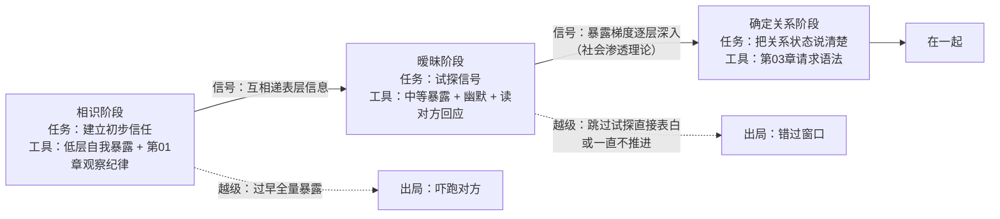

# 第 06 章 · 吸引与关系建立：从认识到确认

> 核心认知：吸引力不是玄学，是可解释的机制组合；关系建立不是「有没有感觉」，是一系列可观察的信号交换——先看得到机制，才谈得上经营。

---

## 引子

老谟是被我硬拽来当「+1」的。大学室友结婚，全桌都是成双成对，就我这边空着半个座位。司仪让新郎新娘交换戒指的时候，我举起杯子，又放下——酒杯太满，怕一晃洒了，其实我是不知道该敬谁。

「老谟，」我看着台上那对新人，「你看啊——大刘，大学四年闷头打游戏，毕业那年还念叨『这辈子估计就一个人过了』，现在结婚了；隔壁宿舍那个谁，当年比我还会把天聊死，上个月也发喜帖了。我身边这些人，一个接一个脱单。你说，他们是不是天生就招人喜欢？我是不是压根就没那根筋？」

老谟没接话。他给自己倒了杯酒，转着杯子，慢悠悠地问：「那你先别问『天生』。你坐这一下午，当一回观察员——说说，这场婚礼你注意过哪几个人？为什么注意到？」

「……新郎的发小，一直在台上帮衬着，笑得跟个花似的；伴娘递戒指的时候手抖了一下；还有邻桌……」我把杯子里的酒转了转，「有个女生，我扫了好几眼。」

「为什么偏偏是她？」老谟把酒杯放下，「你说『天生招人喜欢』——那她好看，是她的属性。你对她的『感觉』，是长在你脑子里的东西。你刚才一句话，把一个关系问题，说成了一个属性问题。」

窗外有人放彩带，红红绿绿地飘下来。我把酒杯在桌上转了个半圈，没接话。

---

## 对话引擎

### 第 1 轮：你注意到她——是她的属性，还是你的注意力？

**造物主**：她那不是普通好看。她笑的时候……算了，说不清。反正就是，一桌人，我就看见她了。

**老谟**：行。那我问你——桌上坐着的那个新郎的发小，长得也不赖，笑了一下午，你怎么不扫他几眼？

**造物主**：那不一样！发小是男的——我不是说性别啊，我是说……发小笑了一下午，我没觉得他招人；她一个眼神过来，我心跳都乱了。

**老谟**：心跳乱了，是谁的功劳？

**造物主**：……她的吧？她好看、会说话、气质好。

**老谟**：她好看，是她的事。你心跳乱，是你的事。你刚才把这两件事捆在一起，中间那个「为什么」，你跳过去了。我问的就是那个「为什么」——同样好看的人，你为什么偏偏对这一个有感觉？你说说，「有感觉」这三个字，到底是谁在起作用？

**造物主**：……我以前从没想过这个问题。我一直以为「有感觉」就是个开关，啪一下，亮了就是亮了，没亮就是没缘分。你这一问，我才发现，我连「开关」长什么样都不知道，就敢用「没缘分」给自己结案。

**老谟**：好，那今天我们就把这个「开关」拆开看看。你刚发现的第一件事：**吸引力不是一个人的属性，是两个人互动的产物。** 你注意到的不是「她」，是你和她之间的某种关系。至于那是什么关系，接下来你自己说。

---

**📐 知识锚点：吸引力（attraction）——是关系产物，不是单方属性**

本章的第一个转向：把「吸引力」从「一个人拥有的属性」重新定义成「一段关系中产生的现象」。

| 表述 | 错在哪 |
|------|--------|
| 「她天生招人喜欢」（属性论） | 把结果当原因：全桌人都「好看」，为什么偏偏注意到她？属性论解释不了「选择性」 |
| 「我们对彼此有感觉」（关系论） | 感觉不悬空：它由可观察的机制生成——见面次数、相似程度、信号交换、生理唤醒 |

**一句话判据**：如果「吸引力」是一个人的属性，那它在任何对象面前都应等量生效——显然不成立。它只在特定的两人组合里产生，这说明它至少是两个变量的函数。这个转向是本章一切推导的前提：**凡是机制，就能解释；凡是能解释，就能经营。**

> 这个转向和全书暗线是同构的：第 01 章把「你怎么又迟到」从「她人品不好」拆成「行为 + 噪声」，本章把「你为什么招人喜欢」从「天生如此」拆成「机制组合」。拆，是这本书的默认动作。

---

### 第 2 轮：你喜欢过的人，是不是恰好总出现在你的生活半径里？

**老谟**：回到那个你「有感觉」的人——咱不聊台上那个，聊你过去真正喜欢过的人。你活这么大，真正心动过的，有吧？挑一个，说说你们怎么认识的。

**造物主**：……大学有个女生。其实谈不上认识，我连话都没跟她说过几句。我就是……老见她。选修课她坐我前面两排，图书馆她常坐我对角那桌，食堂打饭排队也老遇上。见多了，我就开始注意她，后来就……嗯。

**老谟**：她为你做过什么特别的事吗？

**造物主**：没有。现在想想，连一次像样的交集都没有。

**老谟**：那她什么都没做，你哪来的「感觉」？

**造物主**：……熟。就是熟。天天见，见久了，就觉得这人跟我有某种关系，好像本来就该在我的生活里。

**老谟**：你把第一个机制摸出来了，只是不知道它叫什么。心理学管这叫**曝光效应（mere exposure effect）**：见得越多，越熟悉，越喜欢——1968 年扎荣茨（Robert Zajonc）做过一组著名实验：给被试反复看一些无意义的符号、陌生的脸、甚至完全不认识的中文汉字，看得越多的，被试越报告「喜欢」，哪怕他们根本不记得自己见过那些东西——**喜欢先于认识。** 而「为什么老遇见她」这件事，也有名字：**邻近性（proximity）**。1950 年费斯廷格（Leon Festinger）和他的同事研究过学生宿舍：你的朋友里，比例最高的不是最投缘的人，而是住在你隔壁和对门的人——物理距离先于灵魂契合。

**造物主**：那我以前老觉得「遇见她，是我们有缘分」……缘分原来是——我天天在那个半径里晃？

**老谟**：缘分这个词，是给「看见了机制却说不出来」的人用的。你现在能说出来了。

---

**📐 知识锚点：曝光效应（mere exposure effect）与邻近性（proximity）**

| 术语 | 英文 | 核心内容 | 实证地位 |
|------|------|---------|---------|
| 曝光效应 | mere exposure effect | 重复出现 → 熟悉度上升 → 好感上升 | 扎实：Bornstein（1989）对 1968–1987 年间 200 余项研究的元分析确认效应稳健存在、效应量中等 |
| 邻近性 | proximity | 物理距离近 → 见面机会多 → 关系更容易建立 | 经典：Festinger、Schachter & Back（1950）西宿舍（Westgate）研究 |

**两个补充前提（曝光效应的适用域）**：

1. **曝光提升好感的前提是「初始态度中性或正向」**。若初始态度就是负面的，重复曝光可能强化负面评价——你烦的那个天天见的同事，并不会因为天天见而变得可爱。
2. **曝光次数存在「边际递减」**：适度重复有效，过度重复（尤其是高强度的）会转向疲劳甚至厌烦。曝光效应解释的是「为什么熟能生喜」，不是「为什么越黏越好」。

**造物主式推论**：如果你暗恋的某人恰好总出现在你生活半径里，不必感动于命运——那是「物理距离 × 见面次数」在给你递信号。反过来，如果你想接近一个人，第一步不是找话题，是**把自己放进 TA 的生活半径**。这是把机制落到操作的第一步：先提高可见度，再谈识别度。

---

### 第 3 轮：聊得来——相似性降的是沟通成本，不是「缘分」

**老谟**：熟了就一定喜欢？你认识的人里，天天见、但你烦的，有吧？

**造物主**：有。公司一个同事，抬头不见低头见，我烦他。

**老谟**：差别在哪？你大学那个女生，你们聊天聊得起来吗？

**造物主**：聊得起来……虽然没聊几句，但能感觉到。我俩都爱看科幻，都不爱去人多的局，都觉得周末最舒服的安排是待在家不出门。跟她说话不用解释——我说前半句，她能接后半句。

**老谟**：「聊得来」是什么？拆开说。

**造物主**：……沟通成本低。价值观、兴趣、生活节奏，是同一套的。不用费劲解释「我为什么这么想」，她天然就懂。

**老谟**：好。第二个机制被你摸出来了：**相似性-吸引力（similarity-attraction）**——价值观、兴趣、生活节奏越相似，沟通成本越低，越容易产生好感。1971 年拜恩（Donn Byrne）把它做成了实验里的「吸引范式」（attraction paradigm）：先让被试填一份态度问卷，再给他一份「另一个陌生人」的问卷——陌生人跟他的答案越接近，他对陌生人的好感打分越高。2008 年蒙托亚（Montoya）等人的两套元分析共 313 项研究，结论很稳：**相似性与吸引力有稳定的正相关**；而且有意思的是，研究还发现——你「觉得」的相似，比你「实际」的相似，更能预测喜欢。

**造物主**：那不对啊！老话都说「互补相吸」——我室友跟他对象，一个话痨一个闷葫芦，天天吵吵闹闹的，不也处得好好的？你要说相似才吸引，这一对怎么解释？

**老谟**：互补发生在哪一层？你那个闷葫芦对象，跟话痨在「日子怎么过」这件事上，像不像？

**造物主**：……像。俩人都觉得钱要省着花、家要待得住、不想折腾。一个负责说话，一个负责张罗，其实是在同一张地图上走。

**老谟**：那你再看——「一个话痨一个闷葫芦」是**能力**层面的互补：TA 不会说的我来替 TA 说，TA 不擅长张罗的我来做。而「钱怎么花、家怎么待」是**价值观**层面的相似。**相似性发生在价值观层，互补性发生在能力层。** 相似是发动机，互补是零件配置。拿「一闹一静」去论证互补吸引，是拿零件冒充发动机。

**造物主**：……那我室友那对，本质是「同一套日子观」里，两个人互相补了对方的短。相似管方向，互补管分工。

**老谟**：你这句话，比很多人写的感情鸡汤都准。

---

**📐 知识锚点：相似性-吸引力（similarity-attraction）——发动机与零件的分界**

**严格表述**：给定两人在价值观层（如何看待钱、家庭、闲暇、承诺）的一致程度 V，与在能力层（语言表达、组织、情绪处理等技能分布）的互补程度 C，对关系建立起主引擎作用的是 V；C 起作用的前提是 V 已成立。

| 层 | 内容 | 作用 | 实证 |
|----|------|------|------|
| 价值观层 | 钱怎么花、家怎么待、承诺怎么算 | 降低沟通成本（相似性-吸引力） | 扎实：Byrne（1971）吸引范式；Montoya 等（2008）元分析 |
| 能力层 | 谁擅长说话、谁擅长张罗 | 提高协作效率（互补性） | 弱：Winch（1958）「互补需要假说」提出很早，但实证支持一直不稳定 |

**为什么「互补说」流传广但证据弱**：互补在**热恋期**常常显眼——两个不同的人互相看着新鲜；但进入日常，价值观的摩擦是高频的，能力的互补是低频的。高频冲突赢过低频新鲜。所以不是「互补不对」，是「互补的作用位次排第二」。本书的立场：**拿相似性当主引擎，拿互补性当配置说明**——先确认地图一致，再讨论分工。

---

### 第 4 轮：要么不暴露，要么全倒——你亲手破坏过几次梯度？

**老谟**：机制摸到第三个了。回到大学那个女生——天天见（曝光），聊得来（相似），然后呢？

**造物主**：然后就没有然后了。我憋着，谁也没告诉，毕业就散了。

**老谟**：好。那换个场景——你上个月去相亲，见了两个。头一个怎么黄的？

**造物主**：……那是我话多。头一次见面，我把家里的事、我前任的事、我最近有多丧，全倒出来了。第二天人家就没回消息了。

**老谟**：你发现没有——你处理关系就两种姿势：要么一句话不说，要么一股脑全倒。中间那个「慢慢来」，你从来不会。

**造物主**：那「慢慢来」到底多慢？我连标准都没有。

**老谟**：第三个机制给你：**互惠（reciprocity）**——人喜欢那些喜欢自己的人。你要先放出「我对你有好感」的信号，对方才敢回信号。而「放出好感」不是开关，是**梯度**：从表层信息（我做什么工作、我爱看什么）到深层脆弱（我怕什么、我需要什么），一层一层往里。心理学管这个过程叫**自我暴露（self-disclosure）**，1973 年奥特曼和泰勒（Irwin Altman & Dalmas Taylor）在《社会渗透》（*Social Penetration*）里把它讲成一颗洋葱：一层一层剥，剥到哪一层，取决于对方愿意跟你一起剥到哪一层。

**造物主**：我那个相亲对象，等于头一次见面，就把洋葱芯子掏出来给人看。难怪人家跑。

**老谟**：跑就对了。暴露不合对方的回应节奏，就是**越级**。你大学那个女生是反过来的越级——该往前走一步的时候，你一步都不走，信号发送失败；你相亲那次是正向越级——信号超载，把对方炸跑了。**两个方向，同一个结果：关系原地不动。**

**造物主**：所以关键不是「暴露多少」，是「暴露和对方回应的匹配」……我这两次，一次匹配不上（给太少），一次对方跟不上（给太多）。

**老谟**：对。梯度不是让你「憋着」，是让你「一层一层递」——你递一层，看对方接不接；对方接了，你再递下一层。这叫暴露与回应的互惠匹配。

---

**📐 知识锚点：自我暴露梯度（self-disclosure gradient）——社会渗透理论（social penetration theory）**

奥特曼与泰勒（1973）的「洋葱模型」：人际关系的深化 = 自我暴露由外向内逐层渗透的过程。

```
洋葱分层（由外到内）：
  最外层  人口学信息：姓名、职业、籍贯（谁都能说）
  第二层  偏好与兴趣：爱看什么、周末怎么过（熟人层）
  第三层  态度与价值观：怎么看待钱、家庭、承诺（朋友层）
  第四层  需要与感受：我怕什么、我渴望什么（亲密层）
  最内核  核心脆弱：自我怀疑、创伤、最深的不安（只给极少数人）
```

**两条操作规律（造物主亲手推导）**：

1. **互惠匹配律**：你的暴露深度 ≈ 对方已暴露的深度（可略深半步，不可深出一整层）。对方在第三层，你突然掏到最内核——那不是真诚，是让对方替你扛雷。
2. **信号双向律**：暴露既是「给出」，也是「试探」——你暴露一层，实际是在问对方「你敢不敢也进来一层」。只看「我该说多少」不看「对方接不接」，等于只发射不看回执。

> **学派中立声明**：社会渗透理论（1973）是关系研究里的经典框架，它的「逐层递进」描述在大量临床与观察研究中被反复确认；但「层的划分」本身是启发式模型，不是可精确测量的量表——不同文化、不同个体对「哪层算深」的感知差异很大。本书把它当作**结构向导**使用：核心洞见是「匹配」，不是「层数表」。

---

### 第 5 轮：心跳加速=心动？——你第一次约会为什么选过山车？

**老谟**：机制还差一个。我问你——为什么人第一次约会，爱看恐怖片、坐过山车、去游乐园？

**造物主**：……图个刺激？还是图个有话题聊？

**老谟**：你再想想。从过山车下来，你心跳一百四，腿都是软的。这时候你身边站着那个人——你怎么解读你这一身汗？

**造物主**：……我会觉得，是因为跟她在一起，才这么……兴奋。好像空气都是甜的。

**老谟**：对。这就是第四个机制：**生理唤醒的误归因（misattribution of arousal）**。1974 年达顿和阿伦（Donald Dutton & Arthur Aron）做了个著名实验：让男性被试在两种地方遇到一名女实验员——一座又高又晃的吊桥，和一座低矮稳当的桥。结果是：**高桥组**明显更愿意给女实验员打电话、给她打的「性感」分也更高。实验者的解释是：高桥上的心跳加速是桥给的，被试却把它解读成了「是这个女人让我心动」。后来这套解释被归入情绪的二因素理论（Schachter & Singer, 1962）：**情绪 = 生理唤醒 + 我们对唤醒来源的解读**。同样的心跳，在图书馆前是「紧张」，在吊桥上却可以写成「心动」。

**造物主**：……所以「气氛」是有原理的。

**老谟**：对。共同体验、眼神接触、适度挑战——这些都不是玄学，都是制造「唤醒」的手段。你明白了这一点，就不会再迷信「那天晚上月色正好」——月色不负责心动，心跳才负责心动，而心跳可以被安排。但是——

**造物主**：但是什么？

**老谟**：但是这条必须泼冷水。**吊桥效应在后续的复制中结果很不稳定**：原研究样本很小（实验一的高桥组才 18 人上下），后续有研究复制出了类似效应，也有不少没有复制出来，学界目前把它当作「方向有启发、证据有争议」的经典案例。**它和曝光效应、相似性不是一个证据等级**——曝光和相似性有大量元分析背书，吊桥更多是一个「漂亮但可疑」的传说。所以它的正确用法是：帮你理解「气氛」为什么有效，而不是让你把它当约会配方抄。**唤醒能放大已有的好感，但唤醒造不出好感。** 对面是个你本就无感的人，坐一百次过山车也没用——心跳是涨了，解读成「吓的」了。

---

**📐 知识锚点：吊桥效应（suspension bridge effect）与唤醒误归因（misattribution of arousal）**

| 概念 | 英文 | 内容 | 证据等级 |
|------|------|------|---------|
| 情绪二因素理论 | two-factor theory of emotion | 情绪 = 生理唤醒 × 来源解读（Schachter & Singer, 1962） | 理论框架，经典但同样有争议 |
| 吊桥效应 | suspension bridge effect | 高焦虑情境中的唤醒被误归因于身边人（Dutton & Aron, 1974） | **有争议**：原研究样本小（实验一高桥组 n≈18），后续复制结果不一 |

**本节的实证边界（学派中立，必须单独标注）**：

1. Dutton & Aron（1974）的三个实验本身样本量都很小，且依赖「唤醒误归因」这一事后解释；
2. 后续研究：有在实验室情境（诱导唤醒 + 提供归因线索）中复制出类似效应的报告，也有多篇未能复制；文献综述普遍将其归入「复制争议区」；
3. **本书的使用纪律**：吊桥效应只用来解释「气氛为什么有用」，**不**作为「按配方制造心动」的处方。唤醒是放大镜，不是发动机。

**造物主式推论**：识别「气氛」的三种唤醒源——**共同体验**（一起做一件刺激/新鲜的事）、**眼神接触**（凝视带来轻微的社交唤起）、**适度挑战**（打赌、比赛、有输赢的小游戏）。它们共同点：让心率离开基线。理解了这一点，你就知道为什么「第一次约会去看展」和「第一次约会去爬山」在机制上不是一回事——后者带着唤醒，前者只带着谈资。

---

### 第 6 轮：关系不是一条直线——三个阶段，三个沟通任务

**老谟**：四个机制都齐了。可你有没有发现——你缺的从来不是「吸引」，是「阶段」。

**造物主**：阶段？我以为关系就是：认识 → 熟了 → 表白。

**老谟**：太粗。你那两个案例，都栽在阶段上：大学那个女生，你在「相识」阶段就刹车了，该进的互惠一步没走；相亲那个，你从「相识」直接跳到「全量暴露」，把暧昧期该走的路一步跨过去了。**关系是分阶段的，每个阶段有每个阶段的沟通任务。** 任务没做完就硬推下一阶段，就会翻车。给你看三个阶段各自的活：

**相识（initiating）**：任务是建立初步信任——最低层自我暴露（我是谁、我做什么），加上第 01 章学的那条纪律：**初次见面，只观察，不评判**。你一上来就给对方下判决书，信道就关了，后面没得谈。

**暧昧（experimenting / intensifying）**：任务是试探信号——中等暴露（兴趣、态度层）+ 幽默 + 读懂对方回应的信号。这个阶段的核心动作是「一来一回」：你递一层，看 TA 接不接；TA 递一层，你要不要接。暴露梯度和互惠匹配，全在这一段用。

**确定关系（bonding）**：任务是**把关系状态说清楚**——用第 03 章那套请求语法，把「我们是什么」这件事，从模糊状态拉出来，说成一句对方能回应的话。

**造物主**：前两个阶段我基本理解了。第三个阶段……「把关系状态说清楚」，这个我以前都是靠猜的——我感觉差不多该在一起了，就直接……或者干脆等对方先开口，结果两个人都等，等没了。

**老谟**：那咱们最后一步，就是教你亲手造这一句话。

---

**📐 知识锚点：关系阶段与每个阶段的沟通任务**

> 参考：人际沟通学者纳普（Mark Knapp, 1978）把关系发展划分为 initiating → experimenting → intensifying → integrating → bonding 五段；本章按沟通任务压缩为三阶段，各阶段直接挂接本书已学过的工具。



**读图说明**：这是一张「关系建立流程图」。上排三格是从相识到确定的正常路径，每一格标了「任务」和「工具」——注意每个阶段的工具都是前面章节已经学过的：相识阶段用第 01 章的观察纪律，确定阶段用第 03 章的请求语法，中间暧昧阶段用本章的自我暴露梯度。下排两条虚线是两条「出局路径」：从相识直接跳全量暴露（造物主相亲案例）会吓跑对方；在暧昧期一直不推进（造物主大学案例）会错过窗口。**这张图的要点：阶段不是感情线，是任务线——每阶段的任务做完，才具备进入下一阶段的条件。** 而判断「任务做没做完」，不看你的感觉，看信号：你递出去的暴露，有没有收到对方同深度的回应。

---

### 第 7 轮：实现思考——设计一帧「确定关系请求帧」

**老谟**：前两个阶段是练习，第三个阶段是上考场。现在我交给你一个活：**用这四章学的东西，重造一句话——「我喜欢你，我们在一起吧」。** 别用原来的版本，造一个协议帧。

**造物主**：……我试试。观察字段：我们认识半年，这半年几乎每周都见面，聊天记录一天没断过——这是可核实的，双方都认。

**老谟**：感受字段？

**造物主**：跟你相处我很放松，也很踏实。——采样到命名，这是身体信号翻译出来的，不是「我觉得你很好」那种想法句。

**老谟**：需要字段？

**造物主**：我需要一段确定的、互相选择的亲密关系。——主语是我，说的是「什么对我重要」，没要求对方做什么。

**老谟**：请求字段？注意三规则：正向、具体、可协商。

**造物主**：正向——「你愿意跟我在一起吗」，说的是要什么，不是「你别吊着我」；具体——「在一起」的意思说清楚：以男女朋友的关系相处，互相只对对方开放；可协商——这句最关键。如果 TA 回答「再想想」或者「现在不行」，我的帧回退到需要层，重新商量，而不是当场翻脸。第 03 章教过：请求允许说「不」，说了「不」，关系还在，我们重新商量。

**老谟**：你再把这帧的字段跟第 03 章的协议帧 v0.3 对一下——观察、感受、需要、请求、确认机制。你发现了什么？

**造物主**：……一模一样。我花了四章学的不是「说话技巧」，是「怎么把一件重要的事说清楚」。确定关系，是人生里最大的一帧报文——因为它要发射的，不是一句话，是一个关系状态的变更请求。

**老谟**：说得好。很多人一辈子都在用「你猜」当协议——我猜你喜欢我，你猜我想表白，最后两个人各猜各的，关系烂在「猜」里。你现在有了帧，就不需要猜了。

---

**📐 知识锚点：实现思考——确定关系请求帧（v1.0）**

```
┌──────────────────────────────────────────────────────────────┐
│ 确定关系请求帧（结构 = 第03章协议帧 v0.3）                        │
│  ┌────────┬──────────┬─────────┬──────────┬─────────┐        │
│  │ 观察字段│ 感受字段  │ 需要字段 │ 请求字段  │ 确认机制 │        │
│  └────────┴──────────┴─────────┴──────────┴─────────┘        │
│  观察：我们认识半年，每周见面，聊天没断过（可核实，第01章）         │
│  感受：跟你相处很放松、踏实（采样→命名，第02章）                  │
│  需要：我需要一段确定的、互相选择的关系（主语是我，第03章）         │
│  请求：你愿意跟我在一起吗——正向+具体+可协商（第03章三规则）        │
│  确认：接受→帧完成；拒绝/「再想想」→回退需要层，换方案重发，不翻脸  │
└──────────────────────────────────────────────────────────────┘
```

**三个设计要点（造物主亲手定的）**：

1. **时机由信号决定，不由冲动决定**：发射这帧的前提是前两个阶段的任务完成——相识期互递过表层信息、暧昧期暴露梯度已经逐层深入到态度层以上。任务没做完就发射，等于拿一帧大报文砸向一个还没握手的信道。
2. **可协商是帧的尊严**：真正的请求帧包含「允许拒绝」。如果对方说「再想想」，你不翻脸、不消失、不收回所有温柔，而是问「你需要想想哪部分」——回退需要层。这一条直接来自第 03 章请求 vs 要求的判据：**看对方说「不」之后你的反应。**
3. **失败预案 ≠ 被拒绝的预案，而是「被不确定」的预案**：最坏的结果通常不是「被拒绝」，是「被悬置」。预案要写的是：对方悬置时，我怎么表达「我会等，但我也需要知道一个时间」——这又是一帧小请求。

---

### 第 8 轮：落点——我不能让所有人喜欢我，但我能读懂信号

**老谟**：从「天生招人喜欢」一路拆到这儿，再回头看那句话——哪里不对？现在你自己说。

**造物主**：没有天生。他们只是恰好站在了机制上：见得够多（曝光）、聊得够顺（相似）、信号有来有回（互惠 + 暴露梯度）、气氛里有恰到好处的唤醒（误归因）。我那个室友，不是天生招人喜欢——他和他对象天天见面、三观同频、一个能说一个能干，全踩在机制上，只是他们自己不知道。

**老谟**：那「吸引力」这个词，你现在怎么定义？

**造物主**：吸引力不是玄学，是机制组合——邻近与曝光给相遇，相似给聊得来，互惠与暴露梯度给靠近，唤醒给心动。我不能让所有人喜欢我——这四样，我控制不了全部的变量。但……我能读懂信号了：知道「为什么注意到她」，知道「什么时候该递一层」，知道「关键节点怎么把话说清楚」。

**老谟**：行了。你从别人婚礼上，把「在一起」的图纸带回去了。

**造物主**：那……在一起之后呢？这些机制还管用吗？

**老谟**：管用，但不够。从「怎么在一起」，到「在一起之后怎么吵」——那是另一座山。认识、吸引、在一起，都只是起点。你这一帧发出去之后，真正见真章的事才刚开始。下一部见。

窗外最后一轮彩带落完了，新人的车已经开远。我把那杯没敬出去的酒，一仰头，干了。

---

## 严格化走廊

> 把本章对话里「摸出来的直觉」落成严格形式。注意：本章四个机制的证据等级不同（曝光/相似为强，互惠为中等，吊桥为弱且有争议），凡定理一律标注证据等级。

### 定义（精确表述）

**定义 1（吸引力 attraction）**：吸引力是一个**二元关系属性**，不是个体属性。设个体 A 对个体 B 的吸引力程度 Att(A,B)，Att(A,B) 由 A、B 之间可观察的互动变量决定：见面次数（曝光）、相似程度（价值观层一致度）、互惠信号交换（暴露梯度的匹配）、情境唤醒与归因。对任意 B ≠ B′，Att(A,B) 可以显著不同于 Att(A,B′)——这一事实正是「吸引力不是 A 的属性」的操作判据。

**定义 2（曝光效应 mere exposure effect）**：给定刺激 S 与个体 A，若 A 对 S 的初始态度非负面，则 A 暴露于 S 的次数 n 上升时，A 对 S 的喜爱度 L(n) 先升后趋平（边际递减，直至饱和）。若初始态度为负面，则 L(n) 可能单调下降——负面态度的曝光强化负面评价。

**定义 3（自我暴露梯度 self-disclosure gradient）**：自我暴露（self-disclosure）指个体向对方传递关于自身信息的行为，按深度排序为：人口学信息 < 偏好兴趣 < 态度价值观 < 需要与感受 < 核心脆弱。**暴露梯度**指：关系推进中，暴露深度随互惠信号的增加而逐层深入的过程。梯度成立的条件是**暴露深度与对方回应的深度匹配**。

**定义 4（生理唤醒误归因 misattribution of arousal）**：当个体经历生理唤醒（心率上升等）且唤醒来源模糊（无法明确归因）时，个体会将唤醒归因于当下情境中最显著的社会刺激（如身边的人），并据此产生「心动」的解读。情绪 = 唤醒 × 归因（二因素理论）。

### 定理（带全前提条件与证据等级）

**定理 1（曝光-好感定理 ★★★ 强证据）**：设 A 对刺激 S（人或物）初始态度非负面（前提 P1），且暴露重复进行、无强度过载（前提 P2），则 A 对 S 的好感随暴露次数先升后趋平。*（证据：Zajonc 1968 实验 + Bornstein 1989 元分析，200+ 研究。）*

**定理 2（相似性-吸引力定理 ★★★ 强证据）**：设 A、B 在价值观层（钱、家庭、闲暇、承诺）的一致度为 V，则 V 与 Att(A,B) 正相关；且「A 感知到的相似度」比「实际相似度」对 Att 的预测力更强。*（证据：Byrne 1971 吸引范式；Montoya 等 2008 元分析。）*

**推论 2.1（相似与互补的层次分工）**：互补性 C（能力层差异）对 Att(A,B) 的独立贡献，仅在 V 已成立的前提下起作用；V 不成立时，C 无法补偿 V 的缺失。*（证据等级：中——基于实证中互补效应弱于相似效应的元分析结论；Winch 1958 互补假说实证支持不稳定。）*

**定理 3（互惠暴露定理 ★★ 中等证据）**：设 A 对 B 的暴露深度为 d(A)，B 对 A 的暴露深度为 d(B)。当 |d(A) − d(B)| 超过一层（暴露越级）时，B 的回避概率显著上升；当 d(A) 长期停滞（暴露不足）时，关系推进停滞。匹配的梯度（|d(A) − d(B)| ≤ 1 层，且随互惠递增）是关系向深层推进的必要条件。*（证据：社会渗透理论为经典框架，逐层渗透与暴露互惠在大量研究中被确认；「一层」的划分是启发式。）*

**定理 4（唤醒误归因定理 ★ 争议证据）**：在唤醒来源模糊的前提下（前提 P1），高唤醒情境会提升 A 将唤醒归因于身边的人、并报告「心动」的概率。*（证据：Dutton & Aron 1974 原实验；后续复制结果不一——见反例 1。本书仅将其作为「气氛」机制的解释工具，不作为处方。）*

### 证明（完整可复写）

**证明定理 3（暴露越级 → 关系出局）的机制链**：

- **步骤 1**：设 A 在相识初期向 B 暴露深度 d(A) = 第 4 层（需要与感受，甚至核心脆弱）。由定义 3，暴露深度本身是向对方传递「我信任你到这个程度」的信号。*（依据：定义 3——暴露既传递信息，也传递信任等级。）*
- **步骤 2**：B 收到第 4 层暴露时，B 面临一个强加的信任义务：B 被期待以同等深度回应（互惠规范，Gouldner 1960），否则 A 的「信任」就落空。*（依据：互惠规范——社会心理学中对「回报他人付出」的普遍预期。）*
- **步骤 3**：B 对 A 的信任建立尚未完成（相识初期，互惠梯度只在表层交换过），B 无法在不违背自己真实感受的前提下回应同等深度——此时 B 只有两条路：越级回以虚假深度（违背真实），或撤退。*（依据：暴露互惠的诚实约束——暴露的回应无法长期假装。）*
- **步骤 4**：B 选择撤退（不回消息、冷淡）。A 将撤退解读为「被拒绝」，但实际机制是：**A 用一帧过大的报文，把 B 推到「要么说谎、要么撤退」的两难里，B 选了成本更低的那条。** □
- **该证明的洞见**：暴露越级不是「太真诚」，是「把自己的信任强加给对方并要求对等」，在机制上必然导致对方二选一。这与第 01 章定理 1 同构——**发送方在报文设计上犯错，却把结果归因于对方的人品。**

### 反例/边界（钉死适用域）

**反例 1（吊桥效应的复制争议——本章最重要的边界）**：定理 4 的证据等级为 ★。Dutton & Aron（1974）的三个实验样本量小（实验一高桥组 n≈18、低桥组 n≈16）；后续有研究在实验室情境（诱导唤醒 + 明确归因线索）复制出方向一致的效应，也有多项研究未能复制或效应量微弱。**边界**：吊桥效应当前在学界处于「经典但争议」状态。本书的使用纪律：它只解释「为什么共同体验/眼神接触/适度挑战能营造气氛」，**不得**推导出「带对方去跳伞就能让 TA 爱上你」。唤醒是放大镜：对已有的好感放大，对无感的关系无效。

**反例 2（曝光效应的反转）**：定理 1 的前提 P1（初始态度非负面）和 P2（不过载）不可省略。初始厌恶的对象反复出现，好感不升反降（曝光强化负面态度）；高强度的反复纠缠（如跟踪式刷存在）会把曝光效应翻转成反感。**边界**：曝光效应的适用域是「正常社交半径内的自然重复」，不是「人为制造的高频接触」。

**反例 3（相似性的极端化）**：相似性对 Att 的贡献在「高相似」区间存在天花板——相似到完全同质（连缺点都同款）的关系，新鲜感与成长空间被压缩，可能导致厌倦。**边界**：定理 2 说的是「相似度上升→吸引上升」在中等区间显著；极端相似不是更优，只是不同。互补性在极端相似时反而成为稀缺价值——但它的作用位次仍排在价值观相似之后。

**反例 4（自我暴露梯度在特定文化/人格下的变形）**：定理 3 的「逐层递进」在高度自我揭露的文化（某些个体主义者文化中，快速深层暴露被当作坦率而非越级）或特定人格（高度开放的个体）下，其「越级出局」的阈值会上移。**边界**：梯度是结构向导，不是全球通用刻度——判断标准永远是「对方的回应」，不是「我背下来的层数表」。

**边界讨论（操控性「吸引力技巧」的失效与伦理）**：市面上大量「PUA 式」话术——欲擒故纵、冷热交替、刻意制造吊桥——试图把本章机制武器化。必须钉死两件事：其一，**机制是互惠的**，欺骗性操控建立在对方误读信号之上，一旦误读被揭穿（误归因被纠正），好感连带崩塌——操控的收益是一次性的，成本是关系本身；其二，本书的态度：机制用来「理解」，不是用来「操纵」。真正的关系建立在双方都知道彼此心意的前提下，而不是建立在对方被机制骗住的前提下。这与第 04 章安全红线共享同一原则：**先有真诚，再有技术。**

---

## 知识点总结

### 知识点（本章推出的核心概念）

- **吸引力（attraction）**：二元关系属性，不是个体属性——由可观察的互动变量决定：曝光、相似、互惠、唤醒。
- **曝光效应（mere exposure effect）**：见得多→更熟悉→更喜欢；前提是初始态度非负面、不过载。邻近性（proximity）是它的前驱：物理距离近→见面多。
- **相似性-吸引力（similarity-attraction）**：价值观层的一致降低沟通成本；互补发生在能力层，位次排第二——相似是发动机，互补是零件配置。
- **互惠（reciprocity）与自我暴露梯度（self-disclosure gradient）**：喜欢那些喜欢我们的人；暴露逐层递进（社会渗透理论），暴露深度须与对方回应匹配——不足则停滞，越级则出局。
- **生理唤醒误归因（misattribution of arousal）**：心跳加速可能被解读成心动；「气氛」的机制（共同体验/眼神接触/适度挑战）。证据有争议，只作解释不作处方。
- **关系三阶段与沟通任务**：相识（低层暴露 + 观察纪律）→ 暧昧（中等暴露 + 试探信号）→ 确定（请求语法把话说清）。
- **确定关系请求帧**：观察→感受→需要→请求→确认机制，与第 03 章协议帧 v0.3 同构。

### 历史结论（本章涉及的史料）

- 扎荣茨（Zajonc, 1968）：曝光效应的开创实验（无意义符号/人脸/汉字的反复曝光）。Bornstein（1989）元分析确认其稳健。
- 费斯廷格等（Festinger, Schachter & Back, 1950）：学生宿舍研究——朋友更多来自物理邻近者。
- 拜恩（Byrne, 1971）：吸引范式——态度相似度与好感打分的实验关系；蒙托亚等（Montoya, Horton & Kirchner, 2008）元分析确认相似性-吸引的正相关，且感知相似优于实际相似。
- 温奇（Winch, 1958）：互补需要假说——提出早，实证支持弱。
- 奥特曼与泰勒（Altman & Taylor, 1973）：《社会渗透》——自我暴露的洋葱模型与互惠渗透。
- 达顿与阿伦（Dutton & Aron, 1974）：吊桥实验——唤醒误归因；**样本小、复制不一，证据等级低**。理论基底为沙赫特与辛格（Schachter & Singer, 1962）情绪二因素理论。
- 伯施德与沃尔斯特（Berscheid & Walster, 1978）：《人际吸引》——吸引力研究领域的重要综述。
- 纳普（Knapp, 1978）：关系发展阶段模型（initiating→experimenting→intensifying→integrating→bonding），本章压缩为三阶段。

### 工程实践结论（本章知识在真实世界怎么用）

- **把「缘分」翻译成变量**：遇不到喜欢的人，先查曝光和邻近——你多久没进入任何新的生活半径了？
- **相似性排查在确认前做，不在确认后做**：价值观层的「聊得来」是主引擎，别被能力层的互补新鲜感带偏。
- **暴露三问**：我递的这层信息，对方回了吗？回在哪个深度？我下一步是进一层，还是停在原层等？
- **气氛是唤醒不是表白**：共同体验负责「让心跳加速」，语言负责「把心跳翻译成爱」——只制造唤醒不把话说清，是浪漫的悬置。
- **确定关系是一帧报文，不是一场豪赌**：用第 03 章的帧结构和三规则，把「你猜我猜」改成「我发你收」。

---

## 沟通训练场

> 位置说明：沿用全书约定——对话里零操作步骤，所有「怎么练」收进训练场。以下练习每题动笔 10 分钟以上。

### 题 1：关系阶段诊断题——读一段从认识到暧昧的互动记录，识别阶段、暴露层级、信号（难度：中）

**题干**：以下是阿澈（第 05 章题 1 的老熟人，这次是新一段关系）和一位新认识的对象「小屿」从认识到暧昧的记录。请完成：① 判断这段关系目前处在哪个阶段（相识/暧昧/确定），给依据；② 逐条标出每次互动中的自我暴露层级（按定义 3 的五层：人口学信息/偏好兴趣/态度价值观/需要与感受/核心脆弱）与互惠匹配情况；③ 找出至少 3 个「暴露越级或暴露不足」的信号，说明后果；④ 给出「下一步建议」——按暴露梯度应该递一层什么、用什么句式。

> 记录一（第一天，公司团建）：晚上围炉夜话，小屿聊到「我最近想辞职去大理待两个月，反正一个人也没啥牵挂」。阿澈接话：「我也有点想去，不过我更怕回来没工作。你是做什么工作的来着？」小屿：「我在做设计，自由职业，所以走得了。」阿澈：「真好，我是做运营的，走不开。」（后半程阿澈没再主动说话。）
>
> 记录二（一周后，咖啡店）：小屿：「我上次说的那个大理，我查了机票，其实不贵。」阿澈：「你是说真的要去啊？」小屿：「嗯，不过我一个人去有点怵，想找个伴。」阿澈：「我帮你问问有没有朋友想去。」小屿：「……行，那你问问。」（当晚阿澈发微信：「我问了一圈，都没空。要不……我请假去？」小屿：「哈哈哈真的假的？」阿澈：「真的，我都查好攻略了，我还订了两张票，你要是也去的话——」小屿：「我先看看我那个项目啥时候能交付哈。」阿澈：「好，那我等你消息。」）
>
> 记录三（两周后，深夜）：阿澈发了三条长消息：「我其实一直想说，你走以后我发现我老想找你说说话」「我前一段感情就是异地黄的，我特别怕这种没着落的感觉」「你要是真去大理，我辞职跟你走也行」。小屿第二天中午回：「你昨晚说得好多，我有点反应不过来。我们要不先缓缓？」

**完整分步解答：**

第 1 步：判断阶段。

- 当前阶段：**暧昧期早期，但已出现越级信号**。依据：团建夜聊是相识期的表层交换（工作、兴趣）；咖啡店「查机票、想找伴」是小屿发出的试探信号（邀请进入共同计划，属暧昧期的中等暴露）；但记录三阿澈的「三连发」把暴露深度瞬间拉满，属于从暧昧早期直接越级。

第 2 步：逐条标暴露层级与互惠匹配。

| 记录 | 暴露内容 | 层级 | 互惠匹配 |
|------|---------|------|---------|
| 一（团建） | 「想去大理」「怕回来没工作」 | 偏好兴趣（第 2 层）+ 一丝焦虑（第 4 层边缘） | 基本匹配：阿澈回以「我也想去但怕没工作」——同步暴露 |
| 一（团建） | 阿澈「我是做运营的」 | 人口学/职业（第 1 层） | 匹配但浅——阿澈主动收住，暴露不足的苗头 |
| 二（咖啡） | 小屿「一个人去有点怵，想找伴」 | 需要与感受（第 4 层的入口：需要陪伴） | **小屿给了阿澈一个信号**，阿澈没接住（「帮你问问朋友」） |
| 二（当晚） | 阿澈「我请假去」「订了两张票」 | 行动表白（关系推进信号，等价于第 3→4 层的跳跃） | 越级：对方只给了「想找伴」的信号，阿澈直接跳到「我陪你」+ 行动（订票） |
| 三（深夜） | 「我特别怕没着落的感觉」「辞职跟你走也行」 | 需要与感受 + 核心脆弱（第 4 层） | **严重越级**：单方面把深度拉满，且没有等待对方同步 |

第 3 步：找出至少 3 个越级/不足信号。

- 信号 1（不足）：团建后半程阿澈不主动说话了——相识→暧昧的推进由小屿先发起，阿澈的暴露停滞在职业层，导致互惠链断了一拍（小屿递了「自由职业、走得了」，阿澈回以「我走不开」+ 收声）。
- 信号 2（越级）：咖啡店「订了两张票」——把「我可能陪你去」的试探信号，直接升级为「我准备好跟你走」的行动承诺。小屿的反应（「我先看看项目」）是明显的降速信号，阿澈没读出来。
- 信号 3（越级）：深夜三连发——把「想念」「前任创伤」「辞职相随」一次性全倒。小屿次日中午才回、且说「反应不过来、缓缓」——这是暴露越级定理 3 的标准出局信号：对方被推到「要么说谎回应、要么撤退」的两难，选了撤退（缓一缓）。

第 4 步：下一步建议（暴露梯度 + 句式）。

- **先降速、再补一层匹配的暴露**：三连发的深度已被对方拒收，正确动作是**回退到对方当前接受的深度（第 3-4 层）**，并把「三连发」里的焦虑**重新分层**：先认下「昨晚说多了」——用第 01 章观察句：「我昨晚发了那么长一段，是有点着急了。我收回『辞职跟你走』那句，那不是压力，是我没头没尾地说了。」然后把「怕没着落」降到第 4 层（需要与感受）重新递：「我以前有段异地，所以对这种『可能要分开一阵子』的事会格外紧张——我不是要你承诺什么，是想让你知道我的紧张从哪来的。」——这一层对方接得动。**节奏纪律**：每次只递一层，递完等对方回同一深度，再谈下一层。小屿的「大理」计划可以一起查攻略、一起聊细节——让共同计划回到「一起做一件事」的唤醒与互惠，而不是「我为你辞职」的表白。

**答：** 阶段为暧昧早期；记录一基本互惠匹配（但暴露停滞），记录二小屿递信号、阿澈越级接错，记录三严重越级（深度拉满 + 未等回应）。三个信号：暴露停滞、行动越级、深夜三连发。下一步：回退深度、分层重递、每次只进一层。

**常见错误：** ① 把「对方主动找我聊天」当成推进信号——推进信号要看「暴露深度有没有跟着上来」，不是「消息多不多」；② 把「我为你付出（订票/辞职）」当成爱的证明——按第 05 章的教训，那是发送方的信道，不是接收方要的信号；③ 把「对方没接住」解读为「对方不喜欢我」——多数时候是报文过大的问题（定理 3 的洞见），先降帧重发，别急着给人定罪。

### 题 2：确定关系请求设计题——设计完整的关系确认对话，含时机/内容/失败预案（难度：中→难）

**题干**：背景——小枝（第 05 章题 2 的主角）和她的对象阿树，认识五个月，暧昧期已经走到「每周见两次、互相见过对方的朋友、朋友圈互动频繁」，但谁也没把关系状态说破。阿树来请教你（你刚学完本章）：他要不要确认关系？什么时机？怎么开口？请用本章的「确定关系请求帧」，帮他设计一份完整的确认方案，包括：① 时机判断（用什么信号做「任务完成」检查，逐条列）；② 一帧完整的开场白（含观察/感受/需要/请求四字段，满足第 03 章三规则）；③ 失败预案（对方回答「再想想」/「我觉得还没到」/「对不起」三种情况各一帧回话）；④ 设计自检——你这帧为什么合格，逐字段说明。

**完整分步解答：**

第 1 步：时机判断——用「阶段任务完成」做检查，不用「我忍不住了」做检查。

- 检查 1（相识任务完成）：互递过表层信息（职业、兴趣、家庭基本盘）——✓（五个月，早就过了）。
- 检查 2（暧昧任务完成）：暴露梯度已逐层推进到态度价值观层，且对方在同一深度互惠——✓（互相见过朋友 = 社会网络信号；朋友圈互动 = 公开化信号）。注意：**最关键的信号是「对方主动做加深的事」**——小枝主动约他、主动介绍朋友，是互惠信号，不是阿树单方面在推。
- 检查 3（无越级残留）：最近一次互动无「深层暴露未获回应」的悬置——✓（没有三连发那种账）。
- 检查 4（情境合适）：选一个两人都放松、有时间完整对话的场景——**不选**在公众场合开玩笑时说（玩笑会把严肃帧降格成玩笑），**不选**在对方疲惫/压力大时（唤醒是负的，误归因会归到「烦躁」）。

第 2 步：设计完整开场白（一帧报文，四字段全齐）。

> **观察字段**：「我们认识五个月，这两个月每周都见面，你也把我介绍给了你朋友。」——可核实、有时间戳、对事不对人（第 01 章三校验通过）。
>
> **感受字段**：「跟你待着的时候，我很放松，也很踏实。」——采样到命名（身体信号：放松、踏实），主语是我（第 02 章三规则通过）。
>
> **需要字段**：「我需要的，是一段确定的、互相选择的亲密关系。」——主语是我，只说「什么对我重要」，不含「你必须」（第 03 章）。
>
> **请求字段**：「你愿意跟我在一起吗？——我说的一起，是以男女朋友的关系相处，彼此只对对方开放。」——正向（说要什么）✓、具体（「在一起」的操作定义：关系称呼 + 排他）✓、可协商（允许回答不是「好」）✓。
>
> 收尾：「你不用现在立刻答我，想一想再回我也行。」——这句话把「立即被答复」的压力也卸掉，让确认机制完整。

第 3 步：失败预案（三种回答，各一帧回话——核心：回退需要层，不翻脸不消失）。

- **预案 1：对方答「再想想」**——这是「被悬置」，不是「被拒绝」。回话：「好，你慢慢想。我等你的时候想跟你说清楚——我提这个不是要给你压力，是我自己需要知道我们是什么关系，才能安心地继续对你用心。你想想，是因为哪一部分不确定，我们到时候可以聊那部分。」——把悬置转成「具体的协商点」，并保住自己的需要（第 03 章：需要不能因为对方悬置就撤）。
- **预案 2：对方答「我觉得还没到」**——接住，但问清楚。回话：「行，那我听你的。我想问一句——你觉得我们卡在哪一步？是我太快了，还是我们之间还差什么？你说说看，我看看我能不能调整。」——这是把拒绝转成「暴露梯度协商」：对方说「还没到」，实际在说「我们暴露深度还没到我能答应那一步」，问清楚是哪一层没到，下一步就递哪一层。
- **预案 3：对方答「对不起，我对你没那个意思」**——接受结果，不讨价还价。回话：「明白了，谢谢你直接告诉我，不吊着我。那我们退回朋友相处，我不会再提这事。」——注意：这帧最重要的不是内容，是**说完之后的行为**：不翻旧账、不冷暴力、不把「退回朋友」变成「用冷漠惩罚 TA」。这是第 03 章「请求允许说不」的最终检验——对方说「不」之后你的反应，决定了你之前那句话是不是真的请求。

第 4 步：设计自检——逐字段说明为什么合格。

- 观察字段：全部可核实（五个月、每周见面、见朋友）——不是「我觉得我们很熟」这种评判句，是双方都认的事实。
- 感受字段：落在身体词汇（放松、踏实），不是「我觉得你人很好」这种想法句。
- 需要字段：主语是我，讲清了「确定的、互相选择的关系」这个需要——**注意**：「确定关系」这个需要是本章的落点：它把「我们是什么」从模糊的猜测，拉成可核实的、可说出口的状态。
- 请求字段：三规则全过（正向/具体/可协商）；且**帧内有失败预案**——预案不是「被拒绝后怎么办」的准备，而是「对方任何回答，我都有话可说、有事可做」，所以阿树不会在开口时发抖，因为他不是在赌，他是在发一帧设计好的报文。
- 确认机制：接受→帧完成；拒绝/悬置→回退需要层重新协商。全帧与第 03 章协议帧 v0.3 同构——**确定关系不是一场豪赌，是最后一次「把话说清楚」的练习。**

**答：** 时机检查 4 条（任务完成度 + 无越级残留 + 情境）；开场白一帧四字段全齐；三种预案分别对应「悬置→转协商点」「未到→问清暴露层级差」「拒绝→接受+退回」；自检确认全帧合格。核心：**这帧发出去之前，阿树就已经赢了——因为无论对方答什么，他都有下一句话。**

**常见错误：** ① 用「我忍不住了」当时机——时机是「阶段任务完成的信号」，不是情绪水位；② 把「在一起」说得模糊（「我喜欢你」不算完整请求，「在一起=以男女朋友关系相处、彼此排他」才算具体）；③ 预案只有「被接受」和「被拒绝」，漏了最常发生的「被悬置」——不会处理「再想想」，比不会处理「对不起」更致命；④ 把「退回朋友」当成翻脸的开始——对方说「不」之后你的反应，才是你整句话的验收标准。

---

## 向导便签

> **本章干了什么**：从婚礼上那句「有些人天生招人喜欢」出发，亲手把「吸引力」从玄学拆成四个机制——曝光与邻近（相遇）、相似性（聊得来）、互惠与自我暴露梯度（靠近）、唤醒误归因（心动）；把关系分成相识→暧昧→确定三阶段并给每个阶段配上沟通任务；最后亲手设计了一帧「确定关系请求帧」，发现它和第 03 章的协议帧是同构的。
>
> **钉死一句话**：吸引力不是玄学，是机制组合；我不能让所有人喜欢我，但我能读懂信号、经营互动、在关键节点把话说清楚。
>
> **毒舌收口**：别再说「天生招人喜欢」了——那是你给「看不懂机制」起的名字。先把「为什么偏偏是 TA」拆出来，再谈「我能不能」。
>
> **证据提醒**：本章四个机制不是一个证据等级——曝光和相似性有元分析背书，可以当事实用；互惠是经典框架；吊桥效应是「有争议」的传说，只用来理解气氛，别当配方抄。

---

## 造物主手记

**我曾踩的坑**：

- 坑 1：以为「有感觉」是个开关，啪一下亮了就是缘分，没亮就是没戏。直到老谟问「你为什么偏偏注意到她」，我才发现我连开关长什么样都不知道，就敢拿「没缘分」给自己结案。**「没缘分」是我给看不懂机制起的名字。**
- 坑 2：处理关系只有两种姿势——大学那个女生，我一句话不说，暴露停滞在原地；相亲那个，我一股脑全倒，暴露越级把人炸跑。**要么不暴露、要么全倒，两个方向，同一个结果：关系原地不动。** 中间那个「一层一层递」，我从来没练过。
- 坑 3：以为确定关系是「赌一把」——挑个时机，说句「我喜欢你」，听天由命。现在知道，那是「我发你收」的一帧报文：观察、感受、需要、请求、确认机制，全字段走完，对方任何回答我都有下一句话。**我不赌了，我发报文。**

**顿悟时刻**：当我亲手写出「确定关系请求帧」，看到它和第 03 章协议帧一字不差的时候，我忽然明白——我花了四章学的根本不是「说话技巧」。我是学会了怎么把一个关系里最重要的事，说成一句对方接得住的话。从「怎么把你迟到了说清楚」到「怎么把我想跟你在一起说清楚」，中间隔着的不是胆量，是同一套帧结构。

---

## 自测题

1. 为什么「她天生招人喜欢」这句话在机制上是错的？（*简答要点：吸引力是二元关系属性，不是个体属性——若它是 A 的属性，应对所有对象等量生效；实际它随互动变量（曝光/相似/互惠/唤醒）而变，故是关系产物。*）
2. 曝光效应成立的三个前提是什么？「跟踪式刷存在」为什么不属于曝光效应？（*简答要点：初始态度非负面、重复但不过载、正常社交半径内的自然重复；人为高频纠缠会翻转为反感，属反例 2。*）
3. 「互补才吸引」为什么经常是错觉？（*简答要点：互补发生在能力层，相似发生在价值观层；相似是主引擎，互补是零件配置——Winch 互补假说实证支持弱，而相似性有 Byrne 1971 与 Montoya 2008 元分析支撑。*）
4. 自我暴露的「越级」和「不足」分别会造成什么后果？机制是什么？（*简答要点：越级把对方推到「说谎回应或撤退」的两难，对方选撤退；不足导致关系推进停滞。机制是互惠匹配律——暴露深度须与对方回应匹配（定理 3）。*）
5. 吊桥效应的证据等级是什么？它的正确用法和错误用法分别是什么？（*简答要点：证据有争议（原研究样本小、复制不一），只能解释「气氛为什么有用」，不能作为约会配方；唤醒是放大镜，造不出好感。*）
6. 设计题：用第 03 章请求三规则，把「我喜欢你，我们在一起吧」重写成一帧合格请求，并说明各字段。（*简答要点：观察（可核实的相处事实）→感受（身体信号词）→需要（主语是我）→请求（正向/具体/可协商：愿意以男女朋友关系相处吗）+ 确认机制（接受/回退需要层重商）。*）

---

## 预告

老谟又倒了两杯酒，把其中一杯推给我。

「今天这场婚礼，你没白来。」他说，「不过你记住——你手里那帧『确定关系请求帧』，只是敲门砖。发出去，门开了，你以为就完了？」

「……完了还要怎样？」

「关系建立起来之后，才是真正见真章的地方。」老谟把杯子举起来，冲新人开远的方向虚敬了一下，「从『怎么在一起』，到『在一起之后怎么吵』——下一部，我们聊吵架。你四章学会的协议帧，一进吵架现场，就会看见它被四样东西撕碎：批评、鄙视、防御、冷战。那四样东西，专门吃『说好话』的人。」

我把第二杯酒干了。彩带早落干净了，婚礼的灯也灭了大半。新郎新娘的故事翻过了第一页，而我在想——**如果「在一起」是协议建链成功，那接下来每一次吵架，就是这条链路的压力测试。** 我的报文扛得住吗？这是第三部的事。明天见。
