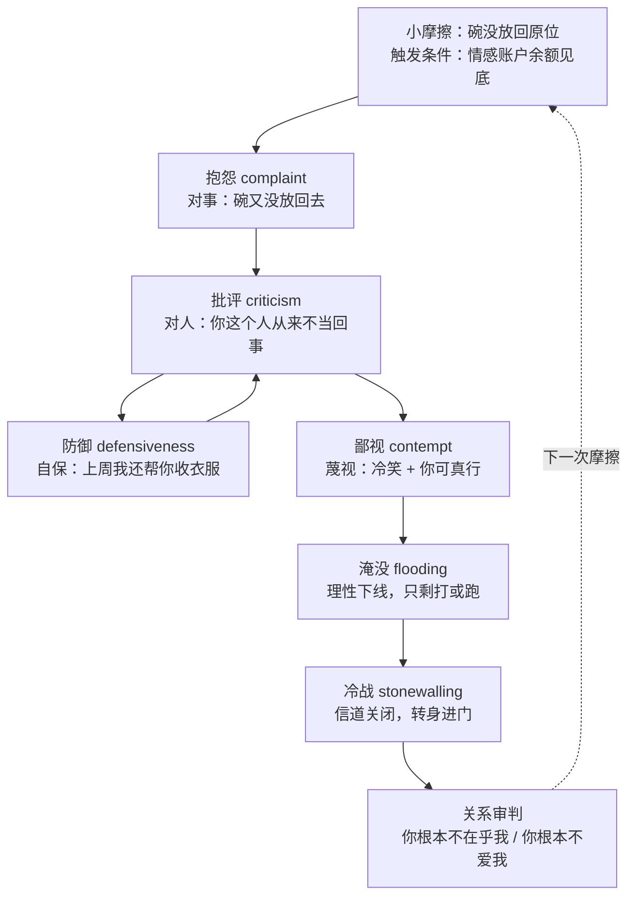

# 第 07 章 · 冲突升级机制：四骑士与情感账户

> 核心认知：冲突不是从「吵架」开始的，是从一次没有被看见的小摩擦开始的。吵架升级有固定轨道——认得出轨道，才能提前下车；认不出，就只能坐到底站。

---

## 引子

「老谟，你得来一趟。」我在电话里说，「昨晚……算了，你来就知道了。」

老谟进门的时候，我正蹲在水池边，半天没站起来。水槽里那只碗，还搁在昨晚那个位置上——昨晚，就是这只碗，被我一把抓起来摔进水池里，然后那场架从「把碗放回原位」一路烧到了「你根本不在乎我」。

「这只碗，怎么惹你了？」老谟靠在厨房门框上问。

「它不是碗。」我说，「它是压死骆驼的那根稻草。」

「哦？骆驼？」老谟走进来，四处看了看，「骆驼在哪儿？我看看。」

我张了张嘴，没接上。

「你连骆驼都没见过，」他走到水池边，拿起那只碗翻来覆去地看，「就把它的死，算到这只碗头上了？」

他把碗放回水槽，那个位置，和昨晚一模一样。

「坐下，」他说，「把昨晚那场架，从头到尾，一个字一个字，讲给我听。」

---

## 对话引擎

### 第 1 轮：一件十九块九的事，怎么炸出「你根本不在乎我」？

**造物主**：昨晚吃完饭，她去客厅了。我去洗碗，看见水槽里那只碗——就是这只——搁在台面上，没放回柜子里。我当时就问她：「我不是跟你说过，碗要放回原位吗？」她说：「我忘了，我马上放。」我手都是抖的，声音一下就抬高了。我说她每次都这样，从来就没把我说的话当回事。她顶了回来，我也没接住，越说越重。最后她再没开口，进卧室，把门关上了。一整晚没出来。

**老谟**：我先问你个事。这只碗，贵吗？

**造物主**：……不贵，超市买的，十九块九。

**老谟**：是传家宝？你姥姥留下的？还是你上个礼拜刚为它熬了几个通宵？

**造物主**：不是。就是一只普通碗。

**老谟**：那你昨晚，为了一只十九块九的碗，把一场架吵到了「你根本不在乎我」。你告诉我——为什么一件这么小的事，能引爆一场这么大的火？

**造物主**：因为……它不只是碗。它代表「我说的话，她不当回事」。这比碗重要多了。

**老谟**：好，那这事重要。那我再问你——热恋那会儿，你俩刚住一起，她也这么干过吗？碗也放错过位置？

**造物主**：……放过。经常。

**老谟**：那时你炸吗？

**造物主**：……那时我，我还觉得她这样挺可爱的。我顺手就给她放回去了，还乐呵呵的。

**老谟**：同一个碗，同一个「没放回原位」。热恋期你笑，昨晚你炸。事件一点没变——变的是什么？

**造物主**：变的是……我？我脾气变差了？

**老谟**：再往下想一层。

**造物主**：……我想不出来。碗还是那个碗，人还是那两个人，我实在想不出什么东西变了，才会让同一件事，从可爱变成炸药。

---

**📐 知识锚点：事件没变，变的是「累积」**

同一个行为，在不同的时间点，触发完全不同的反应——这个现象如果只看「事件本身」，是无解的。它逼我们往事件的**外面**看：变化的不是行为，是行为落到关系里时，所站的位置。

一个关键的分辨：**引爆点 ≠ 原因**。碗是引爆点，但原因在它之前已经存在了。就像压垮骆驼的最后一根稻草——稻草不重，但骆驼背上已经压了几百斤。问「这根稻草为什么这么重」，不如去数骆驼背上已经堆了什么。

---

### 第 2 轮：你俩之间有一本账

**老谟**：既然想不出，我给你换个角度。你俩之间，有一本账。

**造物主**：账？什么账？

**老谟**：谁都没把它写出来，但它每天在走账。她做了一件让你心里暖和的事——记一笔正的。她做了件让你心凉的事——记一笔负的。你回想一下热恋期，你那本账，是什么颜色？

**造物主**：……正的吧。她干什么我都觉得好，一天能进好几笔。

**老谟**：那最近一个月呢？你翻翻你的账本，正的多，还是负的多？

**造物主**：……我说不上来。我没记过账，过日子谁记这个啊。

**老谟**：账本可不管你记不记，它照走。你不记，它也在。现在回到昨晚——你炸那一嗓子，炸的是「这个碗」，还是账本上攒到临界点的那一摞？

**造物主**：……是后面那个。碗只是……一个临界点。我那一嗓子点着的不是它，是它背后那一摞。

**老谟**：对。这个账本，在关系研究里有个名字——**情感账户**（emotional bank account）。每一次被看见的瞬间、每一次主动的善意，是一笔存款；每一次批评、忽视、冷漠，是一笔取款。账户的余额，决定一件小事的**引爆阈值**：余额高，小事是小事；余额见底，小事就是最后一根稻草。

**造物主**：所以我昨天失态，不是因为我脾气差，是因为账户余额见底了？

**老谟**：这是你自己算出来的账，不是我告诉你的。下一步，把账翻出来，一笔一笔算给我看。

---

**📐 知识锚点：情感账户——余额决定引爆阈值**

**情感账户（emotional bank account）**：亲密关系是一本持续计账的账户。每一笔互动都逃不脱三种记账：存款（被看见、被接住、主动善意）、取款（批评、忽视、冷漠）、中性（没有记账价值的日常）。

三个关键性质：

1. **记账是自动的**：不记，它也在走。你以为「过日子不用记」，账户可一直在偷偷更新。
2. **余额决定引爆阈值**：账户越满，能容忍的小摩擦越多；账户见底，一粒沙子都能引爆一场雪崩。引爆点永远不是原因，原因在引爆点之前的余额里。
3. **「忽视」也是一种取款**：这是最反直觉的一条——「我什么坏事都没做」不等于「没取款」。该看见的没看见，该回应的没回应，在对方的账上，往往被记成一笔**负的**。热恋期余额充足，忽视还能被「可爱」兜住；余额见底之后，忽视就是加速透支的利刃。

【历史溯源】「情感账户」这个比喻最早被史蒂芬·柯维在《高效能人士的七个习惯》（1989）中用于管理学语境——它讲的是信任的累积与透支。约翰·戈特曼在《The Relationship Cure》（2001）里把它引入亲密关系研究，并做了操作化：存款、取款不再是心灵鸡汤，而是可以像账本一样逐笔标注的互动记录。本书沿用戈特曼的操作化版本。

【工程实践】伴侣咨询里最常见的第一份作业，就是「给上周的关系记账」：把一周内每一笔值得记录的互动标成存款或取款。多数人第一反应是「这有什么好记的」——记完两周之后，几乎所有人都沉默了。账本不会说谎，它只是从不主动拿出来给人看。

---

### 第 3 轮：记账——你自己翻上周的账

**老谟**：上周，从周一开始，一笔一笔报。报一笔，标一笔。正，还是负？

**造物主**：……周一晚上，她做了两个菜等我下班。我到家说了句「今天太累了」，倒头就睡，菜没动几口。

**老谟**：这笔记什么？

**造物主**：……负的。她做了菜等我，我没接住。

**老谟**：接着报。

**造物主**：周二，她问我周末想去哪儿，我回了个「随便」。周三，她发了个视频给我，我没回，她第二天问，我说没看到。周四，她问我吃饭了没，我说吃了——其实没吃。周五早上，她出门前让我多穿点，我「嗯」了一声，没抬头。周五晚上——碗，成了导火索。

**老谟**：我替你数一下。你报的这几笔里，有正的没有？

**造物主**：……有一笔。周四我加班回来，路上给她带了杯奶茶。

**老谟**：一笔正的，五笔负的。你自己算，这个账户现在什么颜色？

**造物主**：……负的。可我冤啊，我做错什么了？我没骂她没打她，我只是「没看见」而已！

**老谟**：你今天这一整章，最值钱的就是这句话——「我只是没看见」。你仔细品品：她把碗放回原位，你没看见——你以为是零，她记的是负。她让你多穿点，你「嗯」一声没抬头——你觉得自己在中立地带站着，她已经在你的账上划了一笔。**取款不只「做坏事」一种形式，还有「该看见的时候没看见」。** 忽视的可怕就在这儿：它不疼不痒，你甚至不觉得它发生了——等你翻账本，才发现它把余额吃掉了多少。

**造物主**：……所以我昨晚摔那个碗，其实是自己把账户透支完了，还反过来找她要一笔莫须有的账？

**老谟**：你开始看见轨道了。但账本只是地基。昨晚那场架，是怎么从「账上的一笔」，一步步变成「你根本不在乎我」的——那才是今天的重头戏。来，慢镜头。

---

### 第 4 轮：慢镜头——从抱怨到冷战的完整流水线

**老谟**：把昨晚那场架，一句一句，慢慢放。你第一句说了什么？

**造物主**：我说：「我不是跟你说过，碗要放回原位吗？」

**老谟**：这一句，说的是「碗」，还是「你」？

**造物主**：是碗。就事论事，说一件具体的事，没说人。

**老谟**：这种对一件具体事情的、对事不对人的不满，有个名字，叫**抱怨**（complaint）。它是健康的，是可以坐下来谈的。然后她怎么说的？

**造物主**：她说「我忘了，我马上放」。然后我又补了一句：「你每次都这么说。你这个人，从来就没把我说的话当回事。」

**老谟**：慢。这句话，主语是谁？

**造物主**：……主语是「你这个人」。

**老谟**：从「碗」到「你这个人」，你完成了第一个升级。对事的不满叫抱怨；**对人格的攻击，叫批评**（criticism）。「你这个人总是……」「你从来都……」——「总是」「从来」一出现，你就从讨论行为，跳到了审判人格。这是第一匹骑士。然后她说了什么？

**造物主**：她说：「我怎么没当回事？上周我还帮你把衣服都收好了！」

**老谟**：她这句话，是在干什么？

**造物主**：……在自保。翻出自己的功劳，来挡你这一刀。

**老谟**：这就是**防御**（defensiveness）——挨批之后的本能自保。注意，防御不是她单方面的毛病，是你的批评给它递了启动钥匙。被批评的人很难不防御，就像被针扎的人很难不缩一下。然后你呢？

**造物主**：我……我冷笑了一下，说：「就那一次，也好意思拿出来说？你可真行。」

**老谟**：停。你刚才那个「冷笑」，加上「你可真行」——这是四匹骑士里最毒的一匹。批评说「你做得不好」，你这句话是说「你这个人，连做过的那点好事，都让我恶心」。这叫**鄙视**（contempt）——蔑视、翻白眼、阴阳怪气、把对方的付出当笑话。它是四骑士里唯一会「笑」着杀人的一匹。

**造物主**：……然后她就不说话了。脸白白的，转身进了卧室，把门关上了。

**老谟**：**冷战**（stonewalling）。不是她单方面有毛病——是你的鄙视，把她逼到了「关掉所有信道」这一步。四匹骑士，你昨晚一晚上放齐了。你不是吵了一架，你是把一整条升级流水线，从头到尾完整跑了一遍。

**造物主**：……我昨晚是不是从头到尾，就没什么地方是对的？

**老谟**：你也不是全程都在放骑士——你开场那句「碗要放回原位」是抱怨，是健康的。坏就坏在，抱怨之后你没有停在抱怨上，你一路踩油门。接下来我给你看看，这条轨道长什么样。

---

**📐 知识锚点：末日四骑士——冲突升级的固定轨道**

戈特曼把破坏婚姻的四种互动模式，命名为「末日四骑士」（The Four Horsemen of the Apocalypse）。名字借自《圣经·启示录》里骑马的末日使者——四骑士依次出场，每多一匹，破坏就深一层。注意：这里的「四骑士」和「马」都是戈特曼本人的比喻，并非他原创的术语，是他用来给四种可观测行为命名的意象。

| 互动模式 | 英文 | 针对对象 | 杀伤机制 | 话术示例 |
|------|------|---------|---------|---------|
| 抱怨（基线） | complaint | 一件具体的事 | 健康起点，可解决 | 「碗没放回原位」 |
| 批评 | criticism | 对方的人格 | 把行为升级成人格审判 | 「你这个人从来不当回事」 |
| 鄙视 | contempt | 对方的价值 | 蔑视、嘲讽、否定 TA 存在的意义 | 「你可真行」+ 冷笑 |
| 防御 | defensiveness | 自己（自保） | 拒绝为任何部分负责，火上浇油 | 「你上周不也……」 |
| 冷战 | stonewalling | 整段对话 | 关闭信道，物理上停止接收 | 沉默、转身、关门 |

> **注：抱怨不是四骑士之一。** 戈特曼的「末日四骑士」只有批评、鄙视、防御、冷战四匹——抱怨（对事不满）是批评的健康替代，本来就不该出现在骑士名单里。它放进上表，是作为「四骑士起跑线之前的对照基线」：抱怨本身无害，只有从抱怨滑向批评，才踏入骑士的领地。

把昨晚那场架画成轨道图，长这样：

**读图说明**：这张图是「昨晚那场架」的轨道还原。读法注意三点——

1. **主链是单向的**：从「小摩擦」到「关系审判」只有一条向下的路。你找不到任何一条向上走的箭头——这不是图省事，是本章最硬的发现：**这条轨道只升不降**。一旦进入鄙视，几乎不可能自己掉头回「就事论事」；一旦进入冷战，对话就停死在那一步。所以要下车，只能趁早——最好在「淹没」那一格之前，最迟不能迟于「淹没」。注：图中骑士的先后是按昨晚实际争吵画的（批评→防御→鄙视→冷战），而戈特曼的标准顺序是批评→鄙视→防御→冷战——**具体顺序可交错，但方向永远单向**。
2. **图中唯一的一条回环箭头在「批评 ↔ 防御」之间**：这是四骑士里唯一会「互相喂养」的一对——批评点亮防御，防御又回喂批评，两盏威胁灯互相加油。这个回环就是升级的「加速度」来源：它不是慢慢爬坡，是越吵越快。
3. **虚线箭头是从「关系审判」指回「小摩擦」**：表示一场以「你根本不爱我」收场的架，不是结束，是给下一次摩擦的账户又记了一笔大额取款——余额更空，下一场架来得更快。审判不是终点站，是循环的燃料。

戈特曼在《幸福的婚姻》里给出的「标准顺序」是：**批评 → 鄙视 → 防御 → 冷战**。但真实吵架里顺序会交错——昨晚你们家就是「批评 → 防御 → 鄙视 → 冷战」。顺序不重要，重要的是两条规律：

1. **它总是往上升，不往下降**：一旦进入鄙视，几乎不可能倒退到「就事论事」；一旦进入冷战，对话就停在那一步。
2. **鄙视是总开关**：戈特曼的实验室数据里，鄙视是四骑士中对婚姻伤害最大、也最能预测破裂的一匹——批评尚有「对事」的壳，鄙视连壳都不要，直接对着人的存在本身开枪。

【历史溯源】约翰·戈特曼在西雅图的「爱情实验室」（Love Lab）里搭了一间公寓，邀请夫妻住进来，像观察小白鼠一样记录他们的日常与争吵，部分夫妻追踪长达数十年。他报告：仅凭四骑士的互动模式，就能以 90% 以上的准确率预测婚姻走向（他最常被引用的数字约为 94%）。这个数字在学界有争议——批评者指出样本与统计方法的问题——但四骑士本身作为「可观察、可标注、可干预」的行为清单，已成为关系研究中最被广泛使用的诊断工具之一。

> **学派中立声明**：本章采用戈特曼「关系科学」进路——冲突被建模为可观测、可计数的互动行为。这不是唯一进路：情绪取向治疗（EFT）更强调冲突底层的依恋需求，非暴力沟通（第 01-03 章）从语言失真入手，还有文化视角认为「回避型沉默」在部分文化中是常态调节而非病理。本书不主张四骑士是「唯一真相」，只主张它是目前实证基础最厚、最容易被初学者用来「照镜子」的一套轨道。冷战在文化差异下的边界，见本章严格化走廊「反例 1」。

---

### 第 5 轮：为什么吵到后半场，你们其实没在吵「碗」？

**老谟**：现在把四匹骑士连起来，当一条流水线看。你发现没有，这场架是有加速度的。

**造物主**：……是。吵到后面，我已经不知道在吵什么了。我只记得我很生气，她也很生气，谁都不肯先停。

**老谟**：第 01 章我们拆过：评判一出口，对方的威胁感知就亮灯，而威胁先于理性。现在把这一条搬到两个人身上，会发生什么？你说说。

**造物主**：……我批评她一句，她的威胁灯亮了，她开始防御；她防御一句，我又觉得她在攻击我，我的威胁灯也亮了，我接着批评。两盏灯，互相给对方加油。

**老谟**：对。批评和防御互相喂火，你们的对话就从「谈事情」变成了「互相报警」。报警报到最后，你自己身上发生了什么？回想一下昨晚，吵到最凶那会儿，你身体是什么感觉？

**造物主**：……心跳得特别快。声音我自己都控制不住地往上飙。而且——她说的每一句话，我听到的都是「攻击我」，一个字都听不进去。

**老谟**：这就是**情绪淹没**（flooding）。当威胁信号叠加到某个量级，身体会全面拉起警报——心跳加速、呼吸变浅、血压上升。这时负责「听懂人话」的高级认知功能被整个关掉，行为输出只剩两个指令：打，或者跑。你昨晚后半场，不是在沟通——是两个淹没的人，在互相对着炮口倒弹药。

**造物主**：……所以吵到最后，谁也不记得「碗」了。不是不想记，是身体根本不给记的机会。

---

**📐 知识锚点：情绪淹没——为什么淹没了讲道理没用**

**情绪淹没（flooding）**：冲突中威胁信号持续叠加，生理系统全面激活（交感神经主导），理性能力被抑制的状态。戈特曼在实验室里用生理指标测量夫妻吵架：淹没状态下，心率明显升高，部分人超过每分钟 100 次。

淹没的三个特征（也是三个「识别信号」）：

1. **听不进去**：对方说什么都先被解码成「威胁」——这不是故意，是生理状态决定了信道只收威胁报文。
2. **说不出人话**：输出的不是意思，是还击。「打或跑」两个指令接管了所有高级功能。
3. **不降不下来**：淹没不是「深呼吸一下就好」。戈特曼的数据提示，生理唤醒消退需要相当一段时间——他的建议里常见「暂停至少 20 分钟，等心率回基线再谈」。20 分钟不是玄学，是生理恢复的时间尺度。

**与第 01 章的衔接**：第 01 章讲过「威胁先于理性」——那是单次刺激的机制。本章的淹没，是把这个机制**迭代放大**：批评 → 威胁 → 防御 → 新威胁 → 更强批评……每一轮都在上一轮的基础上加码。单次威胁是「拍一下肩膀」，淹没是「被按在墙上打」。机制同源，量级不同。

**一个反直觉的推论**：淹没状态下，任何「讲道理」「讲对错」的操作都无效——因为对方的高级认知已经下线，你讲的道理等于往关机的接收机里发射信号。所以冲突管理的第一步不是「把道理讲对」，是「先把自己从水里捞出来」。

---

### 第 6 轮：为什么终点永远是「你根本不爱我」？

**老谟**：现在，回答你最初的问题——为什么每次吵架，最后都会吵到「你根本不爱我」？你回头看昨晚那条轨道：从「碗」出发，经过批评、鄙视、防御、冷战……最后那句话，说的是碗吗？

**造物主**：不是。说的是她，说我们这段关系。

**老谟**：你再把「你根本不在乎我」这句拆开——「根本」。「你」。这句话里还有没有「碗」？

**造物主**：……没了。碗早就被甩出轨道了。

**老谟**：那你把这三句话摆在一起：「你每次都这样」「你从来不当回事」「你根本不在乎我」。它们在干同一件事，你说说，是什么事？

**造物主**：……它们都在把一件具体的事，变成对一个人、甚至对整段关系的判决。「每次」「从来」「根本」——这些词是把局部故障，升级成系统崩溃报告。

**老谟**：说得好。这就是这场吵架的终点站：**概括化**。具体的事件是「局部故障」——碗没放回原位，故障可修，改天放回去就完了。但「你根本不爱我」是「系统崩溃」——系统崩溃不是修一个零件的事，是整台机器要报废。「每次」「从来」「总是」这三个词，是这场升级的传送带，把每一次具体的故障，一路翻译成对整个人的判决，再翻译成对整段关系的判决。

**造物主**：……所以我昨晚说「你从来不当回事」的时候，我心里其实已经悄悄开了「系统崩溃」的审判庭了。「你根本不爱我」不是吵架吵出来的，是我自己把它设成了这场架的主题曲。

**老谟**：落锤。这里还有一个更扎心的数据。戈特曼追踪了几千对夫妻，发现 69% 的冲突，来自**永久性差异**（perpetual problems）——你俩出厂设置里那些不一样的地方：一个爱整洁一个邋遢，一个爱说话一个爱安静，一个主动一个被动。这些差异吵一百次也不会消失，**它们本来就不是用来解决的，是用来共存的**。所以真正杀死关系的从来不是「有差异」，而是每吵一次，就把一段可以共存的差异，升级成必须判死刑的罪名。

**造物主**：……所以「吵到不爱」不是结局，是我们自己把「共存的差异」一路吵成了「系统崩溃」？

**老谟**：你摸到边界了。剩下最后一个问题——既然轨道这么清楚，有没有可能在淹没之前，提前下车？

---

**📐 知识锚点：69%——不是所有问题都该被解决**

**永久性问题（perpetual problems）**：戈特曼在其追踪研究中发现，夫妻冲突中约 69% 属于永久性差异——由双方性格、价值观、习惯底层的不同产生，换任何伴侣都可能以另一形式存在。它们不会因为「好好谈一次」而消失，也不会因为「吵赢了」而解决。

这个数字的真正含义，是给「解决问题狂」解毒的：

- **「只要方法对，所有矛盾都能解决」是幻觉**。69% 的问题无解，强解只会把「差异」逼成「审判」。
- **区分两种冲突**：可解决问题（solvable problems，约 31%）——具体、局部、可协商；永久性问题——关于「你是谁 vs 我是谁」的底层差异，目标是共存，不是消灭。
- 判断标准（实操）：同一个问题，如果你们已经为它吵过三次以上，且每次都是同一种吵法，它极可能已被归入永久性一栏。永久性问题的正确待遇是「对话、理解、划定边界」，而不是「赢」。

【历史溯源】69% 的数字出自戈特曼对夫妻冲突内容的长期编码分析，在《幸福的婚姻》（1999）中首次公开。注意它的精确表述：它是「夫妻冲突中永久性问题所占的比例」，不是「婚姻中有 69% 的失败风险」——后者是常见误传。

---

### 第 7 轮：实现思考——造物主设计「冲突升级预警器」

**老谟**：最后一个问题。昨晚那场架，吵到最凶之前，有没有任何一个瞬间，有人想「停下来」？

**造物主**：……有。中途她好像说了句「我们先吃饭吧」。我当时没收住，怼了一句「吃不下」。

**老谟**：那一下，就是**修复尝试**（repair attempt）——冲突里任何一方递出的台阶：一句软话、一个玩笑、一个「我们停一下」。它成不成功，不看递的人，看接的人。你接住了，台阶落地，架就散了；你没接住——像你昨晚——台阶掉地上，架就继续往坡上爬。

**造物主**：……所以幸福的情侣不是不吵架，是台阶递得早、接得多？

**老谟**：戈特曼在实验室里数过这笔账：稳定幸福的关系里，积极互动与消极互动的比例大约是 **5:1**——五笔存款，才垫得住一笔取款。不是让你去数数，是告诉你：冲突里那点负，要靠平时海量的正去垫。你的账户上周什么颜色，你自己刚算过。

**造物主**：那我能不能……给自己做一个预警器？像体温计一样，一眼看见自己现在走到轨道的第几步，到红线上方之前，先停下来？

**老谟**：这个想法，是我今晚等了一整晚的。设计给我看。别光说「要冷静」，给我信号点、给我阈值、给我触发之后干什么。

**造物主**：……预警器得有「信号点」。她说「你这个人」「你从来」——批评出场，黄灯。我冷笑、翻白眼、阴阳怪气——鄙视，红灯，这匹最毒，看见就必须停。她开始翻旧账自保——防御，黄灯，它在给我和她的火加油。她不说话了、转身——冷战的前兆，橙灯。还有我自己身上的信号：心跳变快、声音变大、她说什么我都听不进去——这是淹没了，红得发黑，必须立即停。

**老谟**：信号点齐了。那到红灯之后呢？预警器不能光报警不处理。

**造物主**：……到红灯，触发「暂停协议」：喊停、离开现场、等心跳降下来、约好时间再回来接着谈。

**老谟**：你这个设计里，最关键的一个决定是什么？想清楚再答。

**造物主**：……是「谁都能喊停」。而且喊停不等于认输。不然没人敢先按暂停——谁先停谁就输了，预警器就是个摆设。

**老谟**：行了。你这个预警器，把今天所有东西都串起来了：账户决定你有多容易炸，四骑士告诉你现在在第几步，淹没告诉你身体已经接管，暂停协议告诉你怎么在失锁之前下车。完整的设计表，训练场里做，做出成品我们再看。

**造物主**：那我最后用一句话收个尾，你看对不对——我今天学会的不是「怎么不吵架」。是「怎么看清吵架的轨道」：冲突不可怕，可怕的是不知道自己在第几步。先认出轨道，才谈得上提前下车。

**老谟**：你今晚不是吵了架，是画了张轨道图。今天就到这儿。回去把那只碗放回柜子里——然后想想，明天它再「不听话」，你第一眼要盯的不是它，是你自己走到了轨道的哪一步。

---

**📐 知识锚点：修复尝试与 5:1 黄金比例**

**修复尝试（repair attempt）**：冲突中任何一方发出的、意图降低紧张度的信号——道歉、幽默、转移话题、承认对方感受、提出暂停。「修复」的对象不是「问题」，是「对话本身」。

两个关键性质：

1. **成败取决于接住**：递台阶只是发射，接住才算落地。同一个玩笑，在冲突早期能化解，在淹没之后可能就是挑衅——所以修复尝试越早越有效。
2. **幸福关系的关键差异不是「吵不吵」，是「修复早不早」**：戈特曼发现，稳定幸福的夫妻在冲突中照样有负面互动，但他们的修复尝试出现得更早、更频繁，接住率更高。吵架是入场券，修复是散场方式。

**5:1 黄金比例**：戈特曼实验室的编码数据显示，稳定幸福婚姻中积极互动与消极互动之比约为 **5:1**——注意，这不是「幸福处方」，而是「幸福关系的测量结果」；不幸福的关系里这个比例甚至倒挂。它同样不是算术游戏：不能理解成「骂一句补五句」——机械的补偿不是存款，被接住的善意才算。比例背后的机制是：**负面的东西需要大比例的正来垫底**，因为一次批评、一次冷战的杀伤力，远大于一次表扬的修复力。

【工程实践】现代伴侣咨询里，「暂停协议」（time-out protocol）是最早教的工具：约定暗号（如「我需要暂停一下」）、约定时长（戈特曼建议至少 20 分钟，等生理唤醒回落）、暂停期间不做复盘、回来后用软化启动重新开口。这个协议本质上是**给淹没状态的两个人安装一个强制熔断器**——第 08 章我们会把熔断之后怎么重新接上，讲完整。

---

## 严格化走廊

> 对话负责直觉，走廊负责严谨。本章把「吵架升级」落成可检查的形式。

### 定义（精确表述）

**定义 1（情感账户）**：设关系 R 中有一系列互动 e₁, e₂, …, eₙ。对每个互动 eᵢ 存在记账值 d(eᵢ) ∈ {+1, 0, −1}，分别表示存款、中性、取款。情感账户余额 B = Σᵢ d(eᵢ)。取款集合含三类：**主动伤害**（批评、否定、攻击）；**被动忽视**（该回应未回应、该看见未看见）；**关系负评**（对关系本体的全称否定，如「这日子没法过了」）。余额 B 越小，引爆阈值越低（见定理 4）。

**定义 2（抱怨与批评）**：对事件 E 与主体 a（发出与 E 相关行为的人）：
- **抱怨（complaint）**：针对行为 b 的不满，满足：① b 可定位（有时间、地点、对象）；② 表述不超出行为本身；③ 隐含「行为可改」。
- **批评（criticism）**：针对主体 a 之人格的否定，特征为包含全称频率词（「每次」「总是」「从来」）或人格属性断言（「你就是个不负责的人」）。批评是「抱怨 + 人格化升级」。

**定义 3（鄙视 contempt）**：对主体 a 之价值或存在本身的蔑视性表达，含讽刺、冷笑、翻白眼、阴阳怪气、模仿嘲弄、将 a 的付出当作笑料。区别批评：批评否定「你做得好不好」，鄙视否定「你这个人有没有意义」。

**定义 4（防御 defensiveness）**：主体在被负面评价后，输出的自我保护性回应——反驳、找借口、反指（「你也……」）、拒绝承担责任。功能是防御自我形象，代价是让冲突升级而非降级。

**定义 5（冷战 stonewalling）**：一方在冲突中系统性终止信息接收与发送——沉默、单字回复、转身、离场、关门。对话信道物理性关闭。区别于「短暂沉默」：冷战是持续的、升级性的信道关闭（边界见反例 1）。

**定义 6（情绪淹没 flooding）**：冲突中一方或双方处于高生理唤醒状态（交感神经主导、心率明显上升），高级认知功能（倾听、换位思考、记忆检索）被抑制，行为输出收窄为战斗或逃跑。判断信号：听不进对方的话、音量失控、只想赢或只想逃。

**定义 7（修复尝试 repair attempt）**：冲突中任何一方发出的、以降低紧张度为意图的信号（道歉、幽默、让步提议、确认对方感受、提出暂停）。修复尝试 s 成功，当且仅当另一方在淹没之前将其接收并回应（「接住」）。

**定义 8（永久性问题 perpetual problem）**：由双方人格、价值观、习惯底层差异产生的、重复出现且不可消除的冲突源。与「可解决问题」（solvable problem）相对。

### 定理（带全前提条件）

**定理 1（批评-防御互锁）**：设说话者 T 在冲突中对听者 R 发出批评（定义 2），且第 01 章定理 1 的前提成立（R 将批评解读为对人格的威胁），则 R 产生防御（定义 4）的概率显著上升；而 R 的防御会被 T 解读为「不认错、不在乎」，推高 T 的威胁感知，使 T 的输出升级（更重的批评或转向鄙视）。二者构成正反馈循环。
> 前提条件：① 双方均处于至少可感知威胁的状态（若一方低唤醒，如刚被夸过、情绪平稳，循环可被单方面打断）；② 双方对「防御 = 不认错」的解读成立（若一方能识别「她在防御，不是不在乎」，循环同样可被拆断）。**可打断性**：该循环在理论上是可中断的，中断点在「解读」上——识别出对方的防御而非「攻击」，即断掉正反馈。
>
> **定理 1 的机制证明（两步，可复写）**：
> - **步骤 1**：批评句 C（定义 2）对 R 作人格全称否定。由第 01 章定理 1，R 的自我形象受威胁，威胁先于理性，R 产生防御（定义 4）。*（依据：第 01 章证明链——人格否定 → 自我形象威胁 → 战斗-逃跑输出。）*
> - **步骤 2**：R 的防御输出（反驳、反指、找借口）在 T 的威胁感知框架下被解码为「攻击」与「不认错」——因为防御中不含对事件 E 的任何责任承担，T 只能把它解读为「对我的否定」。T 的威胁感知因此上升，输出升级为更重的批评或鄙视（定义 3），回到步骤 1 的输入，循环闭合。*（依据：威胁框架下的解码偏向——威胁灯亮时，中性回应唯一可用的语义是「敌意」，与第 01 章「威胁先于理性」同源。）* □

**定理 2（淹没-理性下线）**：设一方进入情绪淹没（定义 6），则该方当前的对外输出不可被模型为「理性协商」，只能被模型为战斗-逃跑二选一。推论：对淹没状态的一方进行「讲道理」操作，其有效接收量为零——这不是对方「不讲理」，是接收端物理性关机。
> 前提：淹没状态持续存在（未超过生理恢复时间）。

**定理 3（概括化升级）**：设某次冲突存在具体事件 E。若任一方发言中包含**关系级全称否定**（以「根本」「从来」「总是」等全称词 + 人格名词或关系名词构成，如「你根本不爱我」），则该冲突的意义域从「事件域」（E 有什么问题）扩张为「关系域」（这段关系/这个人有什么问题）。该扩张**不可逆**——话语一旦出口无法撤回，只能被后续的修复尝试（定义 7）覆盖。
> **不可逆性的导出**（按机制推导 + 实证标注，非形式逻辑必然）：① 由定理 2，该句通常说出时双方已处于淹没状态，接收方在当下无法做「语境还原」（把这句话放回事件域理解）——接收时它就是「审判」，不是「一句话」；② 由定义 1，关系级全称否定属于「关系负评」取款，会作为一笔大额取款写入情感账户，账户记账不可撤销，只能被后续存款摊薄；③ 事后理性恢复，即使说话者解释「我那不是那个意思」，原话已作为审判事件被记住并计账，无法从记忆中抹除。**结论：该「不可逆」是心理-记忆机制的实证规律，此处按经验规律处理，不作为形式逻辑的必然结论。**

**定理 4（账户余额-引爆阈值）**：设账户余额为 B，引爆冲突所需的最小取款刺激为 θ。则 θ 随 B 递减：B 越小，θ 越小——余额见底时，中性事件甚至可被解读为取款并引爆。
> 前提：双方对记账规则有一致认知。若一方不承认另一方的记账规则（「这算什么取款」），则 B 在双方认知中不一致，引爆行为不可预测——**这是情感账户模型的失效边界**。

**定理 5（5:1 实证规律）**：在戈特曼实验室的冲突观测中，稳定幸福婚姻的积极-消极互动比约为 5:1，不幸福婚姻中该比例约 0.8:1 甚至更低。注意：这是**观测统计规律**（幸福关系的常态特征），不是因果处方——「凑足五句好话再骂一句」不成立，因为积极互动的质量（是否为被接住的修复尝试）不可被数量替代。

### 证明（完整可复写）

**证明定理 3（概括化升级）的机制链**——即「为什么每次吵架都会吵到『你根本不爱我』」：

- **步骤 1**：事件 E（如「碗未放回原位」）出现。由定义 1 与定理 4，若账户余额 B 已低于阈值，E 被记账为取款并触发冲突。*（依据：情感账户记账规则；余额决定引爆阈值。）*

- **步骤 2**：说话者 T 以批评形式（定义 2）表达不满。由第 01 章定理 1，R 的自我形象受威胁，产生防御（定义 4）。*（依据：威胁先于理性；人格攻击触发自我形象防御。）*

- **步骤 3**：R 的防御被 T 解读为「不认错」，T 的威胁感知上升，输出升级——从批评升级为鄙视（定义 3），或升级为更重的批评。*（依据：定理 1 的正反馈循环。）*

- **步骤 4**：当双方威胁感知叠加至阈值，双方或至少一方进入情绪淹没（定义 6）。淹没状态下，高级认知下线，输出收敛为战斗-逃跑。*（依据：定义 6；定理 2。）*

- **步骤 5**：此时，局部事件 E 已不足以解释冲突的情感强度（E 只是「碗」）。认知系统需要为「为什么反应这么大」找一个匹配的解释。由于无法把「大反应」归因于「小事 E」（强度不匹配），归因自动升级：把「反应过大的原因」落到对方人格或关系本体上——即生成关系级全称否定句「你根本不爱我」。*（依据：认知失调与归因机制——情感强度需要与其匹配的原因解释；局部归因不匹配时，归因对象被泛化。此为基于心理学机制的推导，非戈特曼原术语。）*

- **步骤 6**：该句出口即完成意义域扩张（定理 3），原事件 E 被覆盖，「碗」从冲突主题中消失。□

> 关键洞见：**「你根本不爱我」不是吵架的原因，是认知系统给「过度反应」找的许可证**。它的出现意味着：吵架已经从「解决事件」切换成了「解释强度」——而解释强度，必然导向人格与关系审判。

### 反例/边界（钉死适用域）

**反例 1（冷战的边界：沉默不总是骑士）**：戈特曼的样本主要是西方中产夫妻。在部分文化（如一些亚洲高语境文化）与部分个体风格中，沉默/回避可能是低冲突调节的常态，而非「长期系统性关闭」；短期、主动的沉默（「我需要冷静一下」）与「系统性冷战」（长时间、升级性、拒绝一切恢复尝试）是两回事。**边界**：判断冷战的破坏性，须同时考察：① 是否持续且升级；② 是否伴随账户长期透支；③ 是否有恢复尝试跟随。孤立的一次「不接话」不等于 stonewalling。

**反例 2（5:1 不是算术游戏）**：把 5:1 理解成「先骂一句再补五句夸」，会让关系变成表演——机械补偿不被接住，等于无效存款。**边界**：比例描述的是幸福关系的**测量常态**，不是达成幸福的**操作步骤**；操作层要学的，是修复尝试（定义 7），计数只是诊断指标。

**反例 3（抱怨本身也可能变成取款）**：抱怨虽是健康起点，但同一事件被反复抱怨三次以上而对方无感时，抱怨本身转为取款——「反复无效抱怨」是账户的慢性漏水。**边界**：这提示修复尝试的重要性——抱怨需要被接住，才完成「发送-接收」闭环；没人接的抱怨，越「正确」越伤人。

**边界讨论（69% 永久性问题的真实含义）**：69% 不是「放弃治疗」的借口。它把目标从「消灭所有差异」修正为「给永久性差异腾地方」——认识它、给它命名、划定边界、定期复谈，但不指望它消失。真正危险的是另一条路：把永久性差异升级成关系审判（定理 3），让「共存的差异」变成「判死刑的罪名」。修复循环（第 08 章）的全部功夫，就花在把后者降级回前者。

**边界讨论（预警器的失效条件）**：预警器依赖双方「愿意看仪表」。若一方拒绝承认自己已淹没（「我没生气，是你惹我」），预警器失效。仪表只是工具，**使用意愿是前提**——这也是为什么第 01 章的观察句训练是全书的地基：不会观察，就看不懂仪表。

---

## 知识点总结

### 知识点（本章推出的核心概念）

- **情感账户（emotional bank account）**：亲密关系中的隐形账本。存款=被看见/主动善意，取款=批评/忽视/冷漠。余额决定引爆阈值；「忽视」也是取款。
- **末日四骑士**：批评（对人）→ 鄙视（蔑视，最毒）→ 防御（自保，火上浇油）→ 冷战（关信道）。抱怨（对事）不是骑士，是批评的健康替代、四骑士的起跑线。标准顺序批评→鄙视→防御→冷战，真实对话中交错出现。
- **情绪淹没（flooding）**：威胁叠加导致生理全面警报、理性下线，只剩战斗或逃跑。淹没状态下讲道理无效。
- **概括化升级**：「根本」「从来」「总是」是升级传送带——把局部故障翻译成系统崩溃。
- **永久性问题（perpetual problems）**：69% 的冲突源于无法消除的底层差异，目标是共存不是解决。
- **修复尝试（repair attempt）与 5:1**：幸福关系不是不吵架，是修复尝试更早更频繁；稳定幸福婚姻的积极-消极互动比约 5:1。

### 历史结论（本章涉及的史料）

- 约翰·戈特曼，西雅图「爱情实验室」（Love Lab），追踪夫妻数十年、样本超 3000 对；提出末日四骑士、情绪淹没、5:1、69% 永久性问题、修复尝试等概念。
- 四骑士命名借自《圣经·启示录》天启四骑士——是戈特曼本人采用的比喻命名，非原创术语。
- 情感账户隐喻先由史蒂芬·柯维（1989）用于管理学，戈特曼在《The Relationship Cure》（2001）引入亲密关系并操作化。
- 戈特曼报告四骑士可高准确率预测婚姻走向（常见引述约 94%），该数字在学界存在方法论争议。
- 69% 的准确表述：夫妻冲突中永久性问题所占比例（《幸福的婚姻》，1999）。

### 工程实践结论（本章知识在真实世界怎么用）

- **周记账练习**：把一周互动逐笔记为存款/取款，是看清账户余额的最低成本方式——多数人记两周就沉默了。
- **四骑士识别表**：伴侣咨询用它给冲突做「轨道诊断」——先把吵架标成第几步，再谈怎么改。
- **暂停协议（time-out）**：约定暗号、暂停至少 20 分钟（等生理唤醒回落）、暂停期间不复盘、回来用软化启动（第 08 章）。
- **预警器设计**：信号点 + 阈值 + 暂停协议 = 一套可落地的「冲突熔断器」；关键设计决策是「谁都能喊停，喊停≠认输」。
- **69% 的实践含义**：先分清「可解决问题」与「永久性问题」——前者谈，后者共存；把差异吵成审判，才是唯一的死路。

---

## 沟通训练场

> 对话里零操作步骤——所有动手的练习都在这里。每题动笔 10 分钟以上。

### 题 1：给上周的关系记一本账（难度：易→中）

**题干**：下面是造物主「上周」的原始日程，共 10 个事件。要求：
① 逐事件判定「存款 / 中性 / 取款」，并各给一句判定理由；
② 设上周一早上账户余额为 +3（热恋期攒下的底子），按「存款 +1、中性 0、取款 −1（重大取款 −2）」给账本结算，求出周日晚的余额；
③ 用本章定理 4 解释：为什么周五晚「碗没放回原位」会引爆，而同样的碗在热恋期不会；
④ 指出哪一个事件是「账户失去正余额垫子」的转折点（首次触零或首次转负，两者都答），并说明这对「引爆阈值」意味着什么。

> 原始日程：
> （1）周一晚，她做了两个菜等他下班，他到家说「今天太累了」倒头就睡，菜几乎没动。
> （2）周二早，她出门前把他乱丢的袜子配好放在鞋柜上。他看见了，什么也没说。
> （3）周二晚，她问周末去哪儿，他回「随便」。
> （4）周三，她发来一个搞笑视频，他没回；次日她问，他说「没看到」。
> （5）周三晚，她把碗放回原位了——上周他提过这件事。他没注意。
> （6）周四，他加班到十点，她发消息问「吃了吗」，他回「吃了」（其实没吃）。
> （7）周四回家路上，他绕路给她带了一杯她爱喝的奶茶。
> （8）周五早，她出门前说「今天降温，多穿点」，他「嗯」了一声没抬头。
> （9）周六下午，她提起下周要交报告很焦虑，他放下手机听她讲完，说「需要我帮你看看吗」。
> （10）周五晚，碗没放回原位，他爆发了——含批评（「你这个人从来不当回事」）与鄙视（冷笑 +「你可真行」）。

**完整分步解答：**

第 1 步：逐事件记账。

| 事件 | 判定 | 理由 |
|------|------|------|
| （1）忽视她的付出 | 取款 −1 | 她做了菜等他=存款行为，他未接住；「没接住别人的善意」记负 |
| （2）看见袜子没回应 | 取款 −1 | 该看见看见、该回应未回应——「看见却零回应」是取款（定义 1 被动忽视） |
| （3）「随便」 | 取款 −1 | 敷衍式回应，把她的邀请顶了回去 |
| （4）视频未回 | 取款 −1 | 主动联结未接住；连「已读」都没有，是双重忽视 |
| （5）碗放回原位没注意 | 取款 −1 | 最隐蔽的一笔——她做了他上周明确要求的事，他该看见却零反应（定义 1 被动忽视；呼应对话第 3 轮） |
| （6）「吃了」 | 取款 −1 | 拒绝关心 + 说谎式回绝，等于把递来的门关上 |
| （7）绕路买奶茶 | 存款 +1 | 主动善意，无需她开口（本账唯一一笔干净存款） |
| （8）「嗯」没抬头 | 取款 −1 | 她主动叮嘱，他零接收——同（2）类 |
| （9）放下手机听完 | 存款 +1 | 被看见的瞬间+主动接住（修复/存款的正面样板） |
| （10）爆发（批评+鄙视） | 取款 −2 | 重大取款：批评（人格攻击）+鄙视（蔑视），按规则双倍扣 |

第 2 步：结算余额。

期初 +3。存款两笔 +2；取款八笔：1+1+1+1+1+1+1+2 = −9。余额 = 3 + 2 − 9 = **−4**。

第 3 步：解释引爆阈值（定理 4）。

- 热恋期：期初余额高（假设 +10 以上），θ 大——「碗没放回原位」这粒小刺激够不到阈值，被余额吸收，甚至被记成「可爱」（存款）。事件不变，阈值变了。
- 周五晚：事件 1-8 结算后（7 笔取款 −1×7，1 笔存款 +1，净 −6），余额已从 +3 一路滑到 **−3**，θ 已为负——负余额下，中性事件都可能被解读为取款。这时（10）里那个「碗」虽然本身仍是小事，但账户早已见底：**引爆的不是碗，是余额**。且爆发本身又记 −2，把账户推到了 **−4**：吵架没有修复账户，反而加速透支。

第 4 步：转折点与含义。

- 转折点不是那场大吵。按顺序逐笔结算，事件（1）→（2）→（3）让余额从 +3 依次走到 +2、+1、**0**：周二晚那个轻飘飘的「随便」，是**首次触零**的一笔。账户为正是「有垫子」，为零是「垫子没了」，为负是「裸奔」。严格说，「从正转负」的那一笔是事件（4）「视频未回」（余额 0→−1）；但**裸奔从触零那一刻就已经开始**——之后任何摩擦（事件 5、8、10）都直接砸在皮肤上，其中（5）「碗放回原位没注意」尤其讽刺：账户为负之后，连她主动遵守他要求的事，都会被他的「没看见」再扣一笔。
- 含义：**账户触零的那一刻，引爆阈值就已经归零了**。之后的「爆发」只是时间问题，事件本身是谁，不重要。想改变引爆行为，唯一的杠杆在阈值——阈值由余额决定——余额由每天那些「小事」决定。

**答：** 10 个事件中存款 2 笔（+2）、取款 8 笔（−9）；周日晚余额 −4（期初 +3）。引爆「碗」的不是碗本身，是账户在周五前早已为负的阈值；转折点为事件（3）「随便」——首次触零（余额 +1→0），此后账户失去垫子，任何小摩擦都具备引爆资格。

**常见错误：** ① 把（2）（5）（8）记成「中性」——这是最常见的错误，中性仅指「无记账价值的日常」，而「该看见的善意没看见」是标准取款（定义 1 三类之一）；② 把（10）只记 −1——批评+鄙视是双骑士同时登场，按重大取款记 −2；③ 认为「＋3 起点很安全」——没算到存款只有 2 笔，取款是存款的四倍。

### 题 2：设计一版「冲突升级预警器」（难度：中→难）

**题干**：你是工程师，为「不翻车对话系统」设计 v0.1 版冲突升级预警器。要求：
① 定义 ≥4 个信号点 S₁…Sₙ，每个信号点含「可识别的语言/表情/身体特征」与对应骑士；
② 定义三级水位（黄灯/橙灯/红灯）的触发规则——注意把「单次鄙视」和「连续批评」放进同一套规则里；
③ 定义「淹没红线」与「暂停协议」（≥3 步），并说明为什么暂停时长不能短于 20 分钟；
④ 用昨晚的争吵做一次「逐帧诊断」：每一帧标注信号点、水位、是否触发暂停协议；
⑤ 给预警器写一句「使用边界」——它什么情况下会失效。

**完整分步解答：**

第 1 步：信号点（沿用对话第 7 轮造物主的设计，本步只编号、不重复展开）。

**S1 人称切换（批评）｜S2 蔑视表情/语气（鄙视）｜S3 防御反击（防御）｜S4 信道收窄（冷战前兆）｜S5 自身生理信号（情绪淹没）**——识别特征见对话第 7 轮（她说「你这个人」「你从来」；他冷笑翻白眼；翻旧账自保；不说话了/转身；心跳变快、声音变大、听不进对方说话）。

第 2 步：定义水位规则（与昨晚案例对齐）。

- **绿灯**：无 S1-S5，正常对话。
- **黄灯**（提醒，不打断）：S1 首次出现，或 S3 首次出现，或 S5 出现 1 项。
- **橙灯**（警惕）：S1 连续 3 次 / S3 连续 2 次 / S1 首次后紧接 S3（人称切换立刻接防御反击，双黄变橙）/ S4 首次出现 / S5 出现 2 项。
- **红灯**（强制暂停触发线）：S2 任意 1 次（鄙视越级，直接拉爆）；S4 连续 2 次（冷战在形成）；S5 ≥ 3 项（已淹没）；或任一方向出现关系级全称否定（「你根本不爱我」——定理 3 的不可逆点）。
- **黑线**：红灯已触发但有人拒绝暂停——预警器失效，记录为「坠机帧」。

第 3 步：暂停协议（熔断器）。

1. **喊停**：任一达到红线即触发；任何一方有权喊出暗号（如「我先暂停一下」），喊停≠认输，双方无条件接受。
2. **离场降温**：暂停至少 20 分钟——戈特曼数据显示生理唤醒的消退以这个时间为量级；期间不联系、不复盘、不刷手机翻聊天记录（那等于在岸上继续泡水）。
3. **恢复约定**：离开前约定回来时间（如 30 分钟后）；回来用「软化启动」重新开口（第 08 章内容，先占位）。
4. **复盘记账**：回来后先各自记一句「这次我在第几步登场的」（用题 1 的记账法），不先记对方的错。

> 为什么 ≥20 分钟：定理 2——淹没状态下讲道理无效，因为接收端关机。关机之后重启需要生理恢复，不是「想通了」就行。20 分钟是恢复的量级参考，不是精确值；个体差异存在，标准是「心率回基线」而非「时钟走了多远」。

第 4 步：昨晚争吵逐帧诊断。

| 帧 | 内容 | 信号 | 水位 |
|----|------|------|------|
| F1 | 「我不是跟你说过，碗要放回原位吗？」 | 抱怨（不在骑士之列） | 绿灯 |
| F2 | 「我忘了，我马上放」 | 防御前兆（解释） | 绿灯 |
| F3 | 「你每次都这么说，你这个人从来就没把我说的话当回事」 | S1 人称切换（批评） | 黄灯 |
| F4 | 「我怎么没当回事？上周我还帮你收衣服」 | S3 防御反击 | 橙灯（S1 首次后紧接 S3，触发连招规则） |
| F5 | 冷笑 +「就那一次？你可真行」 | S2 蔑视 | 红灯（触发暂停协议） |
| F6 | 「（沉默）……」转身进卧室关门 | S4 信道收窄+冷战 | 黑线（未暂停，直接坠机） |
| F7 | 次日，关系级全称否定「你根本不在乎我」（夜里卧室里说出的终审） | 定理 3 不可逆点 | 坠机后记录 |

**诊断结论**：F5 已到红灯，本应触发暂停协议——但双方都没有「谁都能喊停」的约定，于是没人敢先停（谁先停谁输），F6 坠落，F7 审判。预警器如果在 F3 就亮黄灯、F5 强制暂停，这场架最坏只到 F4。

第 5 步：使用边界。

- 预警器依赖双方「愿意看仪表」——一方拒绝承认淹没（「我没生气」），红灯被拒认，熔断器失效。
- 预警器识别的是**行为**，不识别**意图**——它分不清「真冷战」和「回避型人格的正常调节」（反例 1），需要结合账户余额与历史基线判断。
- 它只能止损，不能修复——暂停只把架停在 F4，把关系从崩溃边缘拉回；修复需要第 08 章的工具。

**答：** 预警器 v0.1 定义完成：5 个信号点（S1-S5）、三级水位 + 黑线、暂停协议 4 步；昨晚争吵逐帧诊断显示 F5（鄙视）即达强制暂停线，因无「谁都能喊停」约定而坠机到 F7；使用边界三条（仪表意愿、行为-意图盲区、只止损不修复）。

**常见错误：** ① 把信号点只定义在「对方」身上——忘了 S5 自身生理信号是唯一「自己可控」的预警源，只看对方永远慢半拍；② 把暂停设计成「先赢者停」——那等于没人停；③ 暂停时长写「冷静一下就好」——没有量化标准，淹没恢复没有保障。

---

## 向导便签

> **本章干了什么**：从「一只十九块九的碗引爆一场大架」出发，推导出情感账户模型（余额决定引爆阈值），认领了末日四骑士（以抱怨为基线，批评→鄙视→防御→冷战），看见情绪淹没让理性下线，发现「你根本不爱我」是概括化升级的终点站，最后亲手设计了冲突升级预警器 v0.1。
>
> **钉死一句话**：冲突不是从吵架开始的，是从一次没有被看见的小摩擦开始的；吵架升级有固定轨道——先认出自己在第几步，再谈下车。
>
> **毒舌收口**：你昨晚不是吵了一架，是骑着一匹叫「根本」的马，从一只碗一路冲到了「你根本不爱我」。跑得挺快，就是没装刹车。

---

## 造物主手记

**我曾踩的坑**：

- 坑 1：以为「炸是因为那件事重要」——老谟一句「热恋期她也是这么放碗的，你怎么没炸」，我当场被问住。事件不变，变的是账户余额。**引爆点从来不是原因**。
- 坑 2：以为「我什么坏事都没做」——记账那轮我才看见，她做了菜我没接住、她放了碗我没看见、她让我多穿点我「嗯」一声……一周八笔取款，全是「没看见」。**取款不只做坏事，还有该看见的时候没看见**。这条最扎心，也最值钱。
- 坑 3：以为「吵到最后是 TA 先说的『你根本不在乎我』」——复盘才发现，是我先用「你这个人从来不当回事」给她递了「系统崩溃」的剧本。**概括化的传送带，是我自己先踩上去的**。

**顿悟时刻**：当我亲手把昨晚那场架标成一帧一帧的轨道图，看见 F5（冷笑）就已经到红线的时候，我忽然明白——我不是不会吵架，我是**从来不知道自己吵到第几步了**。冲突不可怕，可怕的是不知道自己在哪一步。先认出轨道，才谈得上提前下车——这句话，是我自己走完轨道才摸到的。

---

## 自测题

1. 判断：周四加班他绕路买奶茶，她不知道——这笔「存款」记在谁的账本上？她的账户会因这笔而增加吗？（*简答要点：存款记在「发出善意者的付出」与「接收者的被善待感」两个层面；她不知道则她的被善待感没有增加，但这仍是他的存款行为——账户的客观记录以接收方感知为准，他单方面付出不算她账户的进账。这正是他「憋屈」的来源：存了款没人签收。*）
2. 区分抱怨与批评：「这个方案里有两处错」和「你这人做方案从来不带脑子」，分别是什么？判据是什么？（*简答要点：前者抱怨（对事、可定位、可改）；后者批评（人格全称否定）。判据：主语是「事」还是「人」，以及是否含全称词。*）
3. 用本章机制解释：为什么淹没了的时候「讲道理」是无效操作？（*简答要点：定理 2——淹没状态下高级认知下线，接收端物理性关机，讲道理等于向关机的接收机发射信号；必须先暂停等生理恢复。*）
4. 5:1 的准确含义是什么？「先骂一句再补五句夸」为什么是对它的误用？（*简答要点：5:1 是稳定幸福婚姻积极-消极互动比的观测统计，不是操作处方；机械补偿不被接住=无效存款，比例背后的机制是负向互动杀伤力远大于正向，需要垫底。*）
5. 边界题：冷战（stonewalling）在什么条件下不是「四骑士」？（*简答要点：反例 1——短期、主动、有恢复尝试伴随的沉默（「我需要冷静」），以及低冲突文化/回避型风格的调节性沉默，不等同于长期系统性信道关闭；判断需结合持续性、账户状态、恢复尝试三因素。*）

---

## 预告

「下一章学什么？」我问。

老谟把那个十九块九的碗放回柜子里——放回原位了。「下一章，」他说，「学怎么吵一场好架。」

「吵架还有好架？」

「你今晚认出了四骑士，学会了暂停。但暂停之后呢？你俩总得坐回那张桌子前，把那件事说下去。怎么开口才能不重新点燃四骑士、怎么听才不算防御、暂停之后怎么重新接上信号——」他把柜门关上，「那是下一章的事。你今晚先学会一件事：别让那只碗，再在台面上过夜。」

我看着水槽边空出来的那块台面。那只碗现在在柜子里，安安静静。可是我知道，明天、后天，它还会被拿出来用——问题从来不在碗。问题在于，下一次它「没有回到原位」的时候，我能不能在第一匹骑士登场之前，就认出那条轨道。

本章预告：**第 08 章 · 冲突化解——修复循环与 5:1**。认出了轨道，下一站学「下车之后怎么把路走完」：软化启动、倾听与修复循环。
