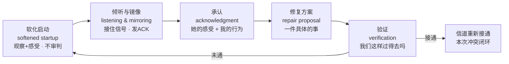
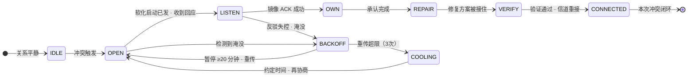

# 第 08 章 · 冲突化解：修复循环与 5:1

> 核心认知：冲突不可避免，但「吵完怎么收场」可以设计。修复不是道歉，是一整套让信道重新接通的协议——先认得出轨道（第 07 章），再亲手把断掉的线接回去。

---

## 引子

冷战的第三天早上。我在闹钟响之前就醒了。

我盯着天花板——那盏灯亮了三年，这三天一次也没开过，像我们俩之间的对话。窗帘缝里漏进一线灰白的光，我数着光里的灰，数到第七粒的时候，我翻了个身，背对着她。

三天了，一句话没有。

三天前那个晚上，最后一句话是我说的：「你总是这样，说好的事从来不算数。」她放下筷子，没接话。第二天早上她照常煮了粥——两碗，一碗放在桌上，人已经出门了。第三天，桌上只剩一碗。

我出门等公交。早班车还没来，站台上站着一个人，手里拎着保温杯——是老谟。他站的位置，正对着我家的方向。

「三天了，」我说，「一句话都没有。」

老谟没看我，看着路尽头的方向：「你昨天几点睡的？」

「……两点。」

「前天呢？」

「三点。」

「这三天你一共睡了几觉，数过没有。」老谟说，「睡不着的时候，你在干什么？」

「……翻手机。看她的朋友圈。」

「那你这三天，」老谟转过头来，「有没有数过——你给她那三天的沉默，各写了多少页剧本？」

我嘴唇动了一下，没出声。

---

## 对话引擎

### 第 1 轮：冷战不是静止，是信道静默

**造物主**：剧本？我没写什么剧本。我就是……等她消气。以前我们吵架，顶多一天，第二天就好了。我想着，气消了自然就好了——可这次都三天了，她连早饭都不在家吃了。

**老谟**：你说「自然就好了」。那我问你——你见过几段「自然就好了」的关系？

**造物主**：……我爸妈算吗？他们吵完架，第二天跟没事人一样。

**老谟**：你仔细回忆一下——你爸妈第二天「跟没事人一样」，是真的没事，还是谁先开了口，谁先递了杯水，谁先提了句「昨天的菜咸了」？你扒开看看，那里面有没有「第一个动作」。

**造物主**：……有。我爹先递的水。可那不一样啊，我们这是冷战——冷战不就是大家都安静吗？

**老谟**：你刚说你三天睡了两三小时的觉，翻来覆去到半夜。那我问你——你这三天的「安静」，是静止的吗？

**造物主**：怎么不是？都没说话啊。

**老谟**：你人躺在床上，脑子一刻没停——「她是不是要分手」「她是不是早就觉得我不行」「她会不会已经决定了」。你的脑袋一直在给她的沉默填内容。你凭什么认为，她那边就是静止的？

**造物主**：……她那边，大概也在写。写我「从来不算数」，写我「就知道凶她」。

**老谟**：你看。两个人谁也没开口，信道上零字节——但两端都在疯狂地给对方的沉默写剧本。这就是冷战的真相：**不是静止，是信道静默**。信号为零，解读无限。你说「自然就好了」——自然好的前提是信道还通着；你俩这三天，信道上是零字节。零字节的修复，靠的是对方自己猜对你的剧本——你猜了三天，猜出什么了？

**造物主**：猜出一堆坏的。

**老谟**：静默期写出来的剧本，十本里有九本是恐怖片。第 04 章我们讲过追-逃循环——焦虑方等不到确认，就写「要失去」；回避方等不到空间，就写「被吞掉」。你俩现在是双静默：不追也不逃，一人写一本，谁也不知道对方那本写了什么。冷战最贵的地方就在这儿——它的成本不是这三天没说话，是这三天各自写下的剧本。等你们开口那天，要花十倍的时间，去澄清对方那本里根本没发生过的事。

**造物主**：……那还等什么？我现在就去跟她说。

**老谟**：你找她说的第一句，想好了吗？

**造物主**：想好了。「你总是这样，说好的事从来不算数。」

**老谟**：……这就是你三天憋出来的第一句？你等会儿再出门。先把这句话，放给我听——一个字，一个字。

---

**📐 知识锚点：冷战不是静止——信道静默与双人剧本写作**

**信道静默（channel silence）**：双方停止一切信息交换，但解码器（解读系统）满载运行的通信状态。它区别于**信道关闭**（第 07 章「冷战」的四骑士定义）之处在于：关闭是「关机」，静默是「开着接收机、关着发射机、把噪声当信号」——危害反而更隐蔽。

静默期的两个危险特性：

1. **零字节 ≠ 零活动**：信道传输量为零，但两端的大脑在处理「对方为什么沉默」——处理的对象是空白，处理的结果是猜测。空白处填上的内容，往往来自历史剧本（旧怨、旧模板），而非当下事实。
2. **剧本的自我验证**：一个人写「她要分手」的剧本，会在静默期搜集一切支持该剧本的证据（她昨天没看我、她收了衣服……），三天写下来，剧本就「成真」了——不是事实成真，是预期成真。等开口那天，对方任何一句中性的话，都会被套进这个剧本里解读（呼应第 01 章「威胁先于理性」）。

> **与第 04 章的衔接**：追-逃循环是「一追一逃」的互补触发；本章的双静默是「都不追、都不逃」的平行写作。两套剧本同时开工，互不通报——这是修复成本最高的开场条件。

---

### 第 2 轮：开场 3 分钟，决定整场结局

**造物主**：放就放。「你——总是——这样——说好的事——从来——不算数。」

**老谟**：放完了。你听听——这句话的第一帧，是什么？

**造物主**：……第一帧是「你」。

**老谟**：一个「你」字开头，后面跟的是「总是」「从来」。三个字，你给她发射了什么？

**造物主**：判决。跟第 01 章那个「你每次都这样」一模一样的判决。我以为我在说「那件事」，其实我在说她「这个人」。

**老谟**：现在回到三天前——你那句话，是她接到的第一帧。她一开机，收到的是判决书——她除了关机，还能干什么？戈特曼在实验室里数过一笔账：**一场架怎么收场，几乎在开场就定死了。只看开场前 3 分钟，就能以大约 96% 的准确率，预判整场对话的结局。**开场是「对事」的抱怨，还是「对人」的批评，决定了她的接收端是开着还是关上。你三天前那个开场，属于哪一种？

**造物主**：批评。第 07 章的四骑士，我自己把第一匹放出来了。

**老谟**：这种「开局就是审判」的开场，戈特曼给它起名叫**苛刻开场**（harsh startup）。反过来那种开局——先说事，不审判人——叫**软化启动**（softened startup）。96% 这个数不是玄学，它是说：争吵的胜负手不在中场，在开场。你开场先给她一个判决，后面你说什么，她都听不见。

**造物主**：所以我这三天不是在等她消气……是我三天前就把开场那扇信道，亲手关死了？

**老谟**：对。你俩这三天是双静默，但三天前那一刻——是你先关的。冷战不是从她沉默开始的，是从你那句开场白开始的。

**造物主**：那我现在要做的第一件事，是把我那句开场白……改掉？

**老谟**：先别急着改——你先分清一件事：你那句「你总是这样」，到底哪里有问题。是语气太冲？还是「你」字后面跟的全是判决？等你把这两样分开了，改就是顺手的。分开的办法，你第 01 章学过，第 02 章学过——把观察和感受从判决里拆出来。至于怎么拆成一句能说出口的话，等会儿训练场里，一笔一笔写。

---

**📐 知识锚点：软化启动（softened startup）——开场 3 分钟，96%**

**软化启动（softened startup）**：一场冲突讨论的开场方式——以「观察句 + 感受句」开头（先陈述可核实的事实，再陈述自己的感受），不含对对方人格、动机或历史的负面评价。它的反面是**苛刻开场（harsh startup）**——以批评句开场（含全称概括、人格归因，见第 01 章定义 2），开场即判决。

三个关键事实（都来自戈特曼实验室的观测）：

1. **开场预测结局**：戈特曼报告，仅凭一场冲突讨论的开场 3 分钟，即可约 96% 的准确率预判整场走向。注意精确表述——是「开场方式与结局高度相关」的观测规律，不是因果铁律；且该精确数字存在方法论争议（见严格化走廊边界）。它的机制含义是：苛刻开场 → 威胁感知 → 防御（第 01 章定理 1 的启动条件被踩满），整场对话在接收端关闭的前提下进行。
2. **软化启动的本质是「观察句开场」**：第 01 章观察句三校验（可核实 / 有时间戳 / 对事不对人）在这里直接复用——软化启动的第一句，就是一条过了三道校验的观察句；第二句接第 02 章的「感受句」（主语是我、一次一个、词汇表内）。这不是新技巧，是第 01-02 章的知识在冲突场景里的首用。
3. **开场可以重开**：软化启动不是「一开始就必须对」的完美主义——是「错了可以重开」的协议。吵架吵偏了，随时可以喊暂停、换一个软化开场重新进（呼应第 07 章暂停协议「回来后用软化启动重新开口」）。

【历史溯源】「软化启动 / 苛刻开场」是约翰·戈特曼在《幸福的婚姻》（*The Seven Principles for Making Marriage Work*，1999）中提出的术语。他在「爱情实验室」中对夫妻冲突讨论的开场方式做编码分析，发现开场方式与整场互动走向的强相关，「96% 预判」的说法由此而来。本书沿用其行为学进路（可观察、可编码、可训练），对精确数值保留方法论存疑（见严格化走廊）。

---

### 第 3 轮：倾听——把信号接住，再复述回去

**造物主**：行，我先学改开场。可老谟，我心里还有个疙瘩——就算我开场说得再软，她那边写了三天的剧本，第一行是「他肯定又要来翻旧账」。她带着这个预期听我说话，我说什么她都当狼来了。这怎么办？

**老谟**：这时候光靠开场说得软，不够了。你得**让她说**——而且，她说的时候，你得接得住。

**造物主**：接得住？我肯定接得住，我这三天天天想听她说话。

**老谟**：那你预演一下。她真开口了，说：「你每次都这样，一说我家里人你就急。」——你第一反应是什么？

**造物主**：……我肯定马上反驳：「我怎么急了？我哪次不是为了咱们好？」

**老谟**：你看。你嘴上说「我想听她说话」，你心里已经写好了答辩状。第 01 章我们说过——反驳的冲动，是什么？

**造物主**：……防御反应。她话还没说完，我的威胁感知已经亮灯，我开始自保了。

**老谟**：所以倾听的第一关，不是「怎么听」，是**忍住不反驳**。你听得见她的字，但你接不住她的信号——因为你耳朵后面那台发射机一直开着。她说一句，你回一句，她说一句，你顶一句——这叫什么？这叫两个发射机对射，没有接收机。真正要做的，是把她的信号接住，再原样复述回去，确认一次。这招在沟通训练里有名字，叫**镜像**（mirroring），是**积极倾听**（active listening）的一种——把对方的话像镜子一样照回去：「你是说——你觉得我一说到你家里人，就会急——我这样理解，对吗？」

**造物主**：这不就是复读机吗？她把话说了，我再学一遍，她不得更烦？

**老谟**：谁让你复读了？你复述的不是她的字，是她的**意思**——你把她的话拆开、重组、确认「我收到的对不对」。注意，你确认的不是「你同意她」，是「你收到了她」。这是通信协议里的 **ACK**——确认帧。第 04 章的安全基地协议里，GOLD 消息要回执，回执的作用就是让发送方知道「你收到了」。现在三天了——她发出来的信号，一条都没被确认过。她开口，你反驳；她解释，你顶回去；她沉默，你写剧本。她的每一帧信号，都被你当成进攻在还击。你给她一个 ACK，她收到的第一条信号才是「有人在听」。

**造物主**：……那我复述的时候，心里还是想反驳怎么办？

**老谟**：想反驳，正常——那是你的防御在写剧本。你只需要做一件事：把「反驳」那行字先**存起来**，等 ACK 发完，再决定要不要取出来用。存起来，是延迟发射，不是消灭它。这个「存」的动作，你等会儿在训练场里练——练到它不占你注意力为止。

---

**📐 知识锚点：积极倾听与镜像——ACK 确认机制**

**积极倾听（active listening）**：以「理解对方的信号」为目的的接收方式——区别于以「准备自己的回应」为目的的伪接收。**镜像（mirroring）**是它的核心操作：把对方话语的语义核心复述出来，并请求确认（「你是说……我这样理解，对吗？」）。

为什么镜像有效（机制链）：

- **对说话者**：镜像提供「发送-接收」闭环的证明。人表达后最深的焦虑是「对方真的听懂了吗」——镜像用一次显式确认消除了这个不确定性（通信协议里的 ACK 解决的就是「发送方不确定对方是否收到」）。
- **对倾听者**：镜像强制你从「解码对方的指控」切换到「解码对方的意思」——复述的过程就是放下防御的过程。你要复述清楚，就必须先听完整，而「听完整」和「准备反驳」在生理上互斥。
- **关键边界**：镜像 ≠ 同意。你复述「你觉得我一说你家里人你就急」，不代表你承认「我确实爱急」——你确认的只是「我收到了你的话」。这个边界一旦划清，镜像就不会变成「讨好式复读」。

【历史溯源】积极倾听/反射式倾听（reflective listening）的源头是卡尔·罗杰斯（Carl Rogers）的人本主义心理学。罗杰斯在《Client-Centered Therapy》（1951）中把「准确共情的倾听」列为治疗关系有效性的必要条件，并在 1957 年《The Necessary and Sufficient Conditions of Therapeutic Personality Change》中把它形式化——治疗师要「准确地感知来访者的内在参照系，并像对方感知自己那样感知对方」。镜像复述后来被伴侣咨询、情绪取向治疗（EFT）广泛吸收为「降速工具」——在情绪淹没的冲突里，镜像把对话从「对射」降速回「确认」。本书采用其沟通应用层，不涉及其治疗理论全部主张。

---

### 第 4 轮：承认与道歉的语法——三层道歉

**造物主**：好，开场我会改了，她的话我也接住了。然后呢？我说「对不起」——「对不起，我不该那么说。」这样总行了吧？

**老谟**：你这话，三天前说不出口，现在张口就来。那我问你——「对不起」这三个字，在你家已经**贬值**成什么样了？你自己算算：这些年你说过多少遍「对不起」，有哪一遍后面不跟一个「但」字？

**造物主**：……「对不起，但我那也是为了你好。」「对不起，可你也有不对的地方。」

**老谟**：「但」字一出来，前面三个字全部作废。一句道歉只要拖着「但」，它就不是道歉，是辩护的开幕式。你说「对不起」，她为什么不信？因为她的耳朵里存的全是「对不起但」——她听见「对不起」的瞬间，就已经在等那个「但」了。

**造物主**：那我说完整点：「对不起，我不该说『你总是这样』。」——这个总该行了吧？

**老谟**：比刚才强一点。但你把它拆开看看——这句话里，有她的位置吗？

**造物主**：……有。呃，「对不起」……没有。我道的是我自己的歉，她在那儿，是个「不该挨骂」的空位。

**老谟**：一句真正的**承认**（acknowledgment），要同时装两样东西：**她感受到了什么**，和**我做了什么**。「我那么说，你听着像被全盘否定。」前半句装的是她的感受，后半句装的是我的行为。你那个「对不起但」里，这两样一样都没有——你只有「我」，没有「她」，也没有「事」。

**造物主**：那我是不是得说很长一大段？

**老谟**：长度不重要，**层次**重要。道歉这东西，按层次分三种。第一种，**敷衍道歉**——「对不起」三个字，不过脑子，出口就完。第二种，**行为道歉**——为「我做的某件事」道歉：「对不起，我不该说那句话。」比敷衍进了一层，但只针对单次行为，不含她的位置。第三种，**修复道歉**——承认伤害 + 说出她的感受 + 给出修复方案。你三天前缺的，不是「对不起」，是第三种——你从头到尾都在第一层和第二层之间打转，从没到过第三层，而第三层里装着的，是「修复」。

**造物主**：所以「对不起」经常没用，不是因为我没说这三个字——是因为我一直在前两层，缺了最关键的第三层。

**老谟**：对。「对不起」是语言的承诺，「修复」是行为的交付。她等的不是三个字，是她被你伤到的那部分，被接住、被修上。你先告诉我——按这个标准，你三天前那句开场白，她收到的是什么？

**造物主**：……收到的是「你这个人从来不算数」。她的感受大概是——被否定，被一票否决。而我的行为是——用全称判决开场。……这两样，就是修复道歉的前两件行李。

---

**📐 知识锚点：承认与道歉的语法——三层道歉**

**承认（acknowledgment）**：向对方陈述「我看到了你受到了什么影响」。它的结构固定为两件行李：**对方的感受** + **我的行为**。「我那么说，你听着像被全盘否定」——前件是她的感受，后件是我的行为。缺一件，承认就不成立；带一个「但」，两件全部作废（「但」开启辩护，辩护推翻承认）。

**三层道歉**（本书对道歉的层次划分，由本章推导命名）：

| 层次 | 名称 | 结构 | 效力 |
|------|------|------|------|
| 1 | 敷衍道歉 | 「对不起」 | 无内容，无责任，零效力 |
| 2 | 行为道歉 | 「对不起，我不该做 X」 | 承认行为，不含对方感受，单向 |
| 3 | 修复道歉 | 承认伤害 + 对方感受 + 修复方案 | 双向闭环，携带「修复」载荷 |

为什么「对不起」经常没用（机制）：道歉是**信道重接信号**，但信号要能生效，必须携带足够的语义载荷——接收方需要从中解码出「我被理解了」和「这事有下文」。前两层道歉的载荷几乎为零（无对方感受、无行为责任、无修复承诺），接收方解码失败，信道保持关闭。「对不起」贬值，是因为长期发射空帧。

【历史溯源】道歉研究的重要文献是阿伦·拉扎尔（Aaron Lazare）的《论道歉》（*On Apology*，2004）。拉扎尔生前是麻省总医院精神病学教授、哈佛医学院教师，他系统研究了道歉的构成，指出有效道歉包含四类组件：**承认伤害**（acknowledgment of the offense）、**解释**（explanation，区别于找借口）、**表达悔意**（expression of remorse）、**补偿/修复**（reparation）。本书的三层道歉是其组件模型的简化应用——第 1 层不含任何组件，第 2 层只含「承认行为」，第 3 层覆盖「承认 + 悔意 + 修复」。

---

### 第 5 轮：修复循环——五步闭环，淹没前启动

**造物主**：那我今天回去，把这套走一遍？开场软化，听她说，承认，道歉……

**老谟**：慢。我先问你——三天前吵到一半，她是不是给过你一个台阶？

**造物主**：……有。她说「我困了，明天再说。」我当时回的是「明天再说？你每次都明天再说。」

**老谟**：那一下，就是**修复尝试**（repair attempt）——第 07 章我们讲过，冲突里任何一方递出的台阶。她递了，你没接。你当时为什么没接？

**造物主**：因为……我还在气头上。她说什么，我都听着像推脱。

**老谟**：你还在淹没边缘，防御还挂在身上——台阶递在你防御最厚的时候，你当然接不住。这就是修复失败的真相：**十次有八次（口语强调，非实证数字），不是没人递台阶，是台阶递了，接的人防御还在。**所以修复循环有一条硬规定：**必须在淹没之前启动**。等双方都快炸了才想起修复，等于往烧红的锅上泼水——炸得更响。

**造物主**：那完整的一圈，到底要走哪几步？

**老谟**：五步。第一步，**软化启动**（softened startup）——用观察和感受开场，不审判；第二步，**倾听与镜像**（listening & mirroring）——把她的信号接住，发 ACK；第三步，**承认**（acknowledgment）——说出她的感受，和你做了什么；第四步，**修复方案**（repair proposal）——你能为她做的那件具体的事，一件就够；第五步，**验证**（verification）——确认信道重新接通了，问一句「我们这样，过得去吗」。走完这一圈，信道才算重新接上。注意——这不是五个技巧，是一个**循环**：少一步，断一截；断了，就从断的地方重进。

**造物主**：我明白了。修复不是「道个歉」，是把断掉的线重新焊上——一整套流程。我三天前递不出去的，不是对不起，是这整套循环。

**老谟**：你已经说出来了。下面，我们把它画成图纸。

---

**📐 知识锚点：修复循环（repair cycle）——五步闭环**

**修复循环（repair cycle）**：一次冲突后，从信道关闭状态回到信道接通状态的完整流程。五步：

```
软化启动 → 倾听与镜像 → 承认 → 修复方案 → 验证 → 信道重接
```



**读图说明**：这是一张修复循环的流程图，读法注意三点——

1. **五步有固定顺序，且每一步都指向下一步**：软化启动是「开门」（信道从关到开），倾听与镜像是「清点」（确认对方信号都收到了），承认是「认账」（我方行为与对方感受对账），修复方案是「交付」（行为的承诺），验证是「回执」（确认双方都认可已接通）。顺序错乱会直接失效——比如跳过倾听直接承认，承认就变成背台词。
2. **图上唯一一条回路是「验证未通 → 回到软化启动」**：这表示循环不是一次性的——验证不过，不硬闯，回到第一步重新进。这一步对应通信协议的**重传**：不成功，就从起点重来，而不是停在原地互相指责。
3. **图的边界（画外条件）**：整个循环的隐含前提是「双方尚未淹没」。如果循环内任何一步检测到情绪淹没（心跳加速、声音失控、听不进去），必须跳出循环进入暂停——图上没有这条线，因为**暂停不是循环的一部分，是循环的保护开关**（第 07 章暂停协议，至少 20 分钟）。

**成败关键**：修复尝试的成败由「接住」决定（第 07 章定义 7 已立此定义）——递台阶只是发射，接住才算落地。修复循环的任务，是把「发射」的条件做齐（软化启动让接收端打开），并把「接住」的机会留足（淹没前启动、镜像确认、验证回执）。

---

### 第 6 轮：5:1、69%，与实现思考——把修复循环做成状态机

**老谟**：图纸画完了，还有两个数，你得揣兜里。第一个——**5:1**。戈特曼在实验室里数过：稳定幸福的关系里，积极互动和消极互动的比例，大约是 **5:1**——五笔正的，才垫得住一笔负的。第 07 章说过，这不是算术游戏，不能理解成「骂一句补五句」。它在修复语境里的意思是：**你的修复尝试，要落在一块有存款的土里才长得活**。你俩的账户三天前就透支了——你今天回去的修复，第一步不是「修复」，是「先存款」：做一件她不需要开口就懂的、为她做的事。

**造物主**：……比如，把三天前那件事之前就欠着的、我一直没接住的那笔，先补上？

**老谟**：你自己说的，不是我教的。第二个数——**69%**。第 07 章讲过：戈特曼发现，夫妻之间大约 69% 的冲突，来自**永久性差异**——性格、习惯、价值观底层的不同，吵一百遍也不会消失。这组数字放进修复的语境，含义只有一个：**修复循环的目的，多数时候不是「解决问题」，是「把信道重新接通」**。问题可以留着，信道不能断。你能修好的，是「对话」，不是「她」。

**造物主**：那我怎么知道我修的是「对话」还是「她」？

**老谟**：你设计一个协议，让这两件事分开。实现时间——第 04 章你设计过安全基地协议，会用它那套超时、重传、ACK。现在给你一个新需求：**把修复循环做成一台状态机**——任何一步检测到淹没，就退避；超时了，就重传；重传超限，就进冷却期，约好时间再来。设计给我看。

**造物主**：……我试试。状态从 IDLE 开始——关系平静。冲突一触发，进 **OPEN**——软化启动，发观察句和感受句，不审判。发出去，要等一个 ACK：她开口了，进 **LISTEN**——倾听，镜像，忍住不反驳。复述成功，进 **OWN**——承认，说出她的感受和我的行为。然后 **REPAIR**——提出修复方案，一件具体的事。她接受了，进 **VERIFY**——验证，问一句「我们这样，过得去吗」。信道重新通了，回 CONNECTED。

**老谟**：那故障呢？这台状态机里，你最怕的故障是哪个？

**造物主**：淹没。任何一步——只要我心跳快、声音大、听不进她说话——立刻触发 **BACKOFF**：暂停，至少 20 分钟，心率回基线再回来。回来之后不是接着吵，是**重传**：从 OPEN 重新进。重传有上限，比如三次——三次都接不上，转 **COOLING**，冷却期：约定好时间再谈，而不是无限重试。这样修复就不会变成死缠烂打，暂停也不会变成冷暴力——它俩在协议里都是合法状态，不是失败。

**老谟**：你刚才这个设计里，藏着一个和 5:1 一样的东西——找出来。

**造物主**：……退避。我把「暂停」从「认输」，设计成了协议里合法的一步。就像 5:1 里那些存款——它们不是认输，是垫底。退避不是逃避，是给信道降噪的时间。

**老谟**：行了。这台状态机，你到训练场里画成成品——画完，验收。

---

**📐 知识锚点：5:1、69% 与实现思考——冲突后修复协议（状态机）**

**5:1 的修复视角**：5:1 描述的是稳定幸福关系的测量常态（观测统计，非处方）。在修复语境中它的含义是：修复尝试的有效性依赖关系中的「存款存量」——负向互动杀伤力远大于正向（第 07 章），透支的账户里长不出修复的芽。所以修复循环的前置动作是「存款」，不是「道歉」。

**69% 的修复视角**：永久性问题（perpetual problems）的修复目标不是消灭，是**管理**——定期对话、理解、划定边界，让它不升级成关系审判（第 07 章定理 3）。修复循环应用于永久性问题时，「验证」的标准要改：不是「问题解决了」，是「信道通着、我们还能聊这个」。
**可解决问题（solvable problems，约 31%）**的修复目标才是「解决」。先分清两种问题，再定修复目标——这是本章给 69% 的操作化。

**实现思考：冲突后修复协议（状态机设计）**

```
┌────────────────────────────────────────────────────────────┐
│  冲突后修复协议 v0.1（本章推导）                              │
│                                                             │
│  状态：IDLE → OPEN → LISTEN → OWN → REPAIR → VERIFY         │
│         → CONNECTED（成功闭环）                              │
│  故障处理：                                                  │
│  · 任意状态检测到淹没 → BACKOFF（暂停 ≥20 分钟）             │
│  · BACKOFF 后重传：从 OPEN 重新进入，最多 3 次               │
│  · 重传超限 → COOLING（冷却期，约定时间再协商）              │
│  协议字段：观察句（第01章）· 感受句（第02章）                 │
│            · 请求（第03章）· ACK（镜像）· 验证回执           │
└────────────────────────────────────────────────────────────┘
```



**读图说明**：这是把修复循环落成状态机之后的图纸，读法注意三点——

1. **主链路是线性推进的**：IDLE→OPEN→LISTEN→OWN→REPAIR→VERIFY→CONNECTED，与修复循环五步一一对应。每一道转移都需要「上一步完成」作为条件——比如 OPEN 没有发出去，就永远进不了 LISTEN；没有镜像 ACK，就进不了 OWN。协议不允许跳步。
2. **两条回退箭头是协议的核心设计**：`BACKOFF → OPEN`（暂停后重传）和 `COOLING → OPEN`（冷却期后重进）——它们让「失败」不再是终态。暂停、重传、冷却都是**协议内合法状态**，不是认输，也不是冷暴力。这对应第 04 章安全基地协议的「冷却期」与第 07 章暂停协议，三层设计在状态机里合流。
3. **淹没是唯一的异步中断源**：任何状态都可能被「淹没」打断跳去 BACKOFF——它不在主链路上，它悬在主链路上方，随时触发。这就是「修复循环必须在淹没前启动」的工程表达：一旦进入淹没，主链路作废，先回退到暂停，再考虑重传。

【历史溯源】5:1 出自戈特曼实验室对夫妻冲突互动的编码统计（稳定幸福关系积极-消极比约 5:1，不幸福关系约 0.8:1 甚至更低），首次系统公开于《幸福的婚姻》（1999）；69% 永久性问题同样出自该书。两者均为观测统计规律而非因果处方，精确数值在学界有方法论讨论——本书采用其行为学价值（可观察、可诊断），不为其数值精确性背书。本章状态机为「实现思考」的协议设计练习，属本书工程隐喻的延伸，非戈特曼原术语。

---

### 第 7 轮：落点——认得出轨道，也焊得回断线

**造物主**：老谟，我总结一下今天学的。三天前，我以为问题是「她不理我」。现在我知道——是我先把信道关了，还指望她自己写对剧本。吵架本身不可怕：第 07 章我能认出四骑士、认出升级轨道，知道淹没之前要暂停。可怕的是吵完之后没有修复协议——现在我有了：开场软化，接住她的信号，承认，修复，验证；淹没了就退避，超时了就重传，三次接不上就约好时间再来。我能认出升级轨道，我也能亲手把断掉的线接回去。

**老谟**：这班车，你没白等。

（远处，早班车的灯亮了起来。）

**老谟**：不过记好——今天这套，是单次冲突的救生圈。修复循环管的是「这一场架怎么收场」，管不了「这一年怎么过」。一场架救回来了，日子还有三百六十天——那些日子怎么经营，是下一章的事。上车吧。

**造物主**：老谟——回去第一句话，我该说什么？

**老谟**：（一只脚已经踩上车门）别用「你总是」。第一句，先给她那碗粥，放回去。

**造物主**：……我知道第一句说什么了。「周五那件事，我那天话太重了。」

**老谟**：把「对不起」留在「她听起来是什么感受」后面说。行了，车来了——你这三天，别白等。

---

## 严格化走廊

> 对话负责直觉，走廊负责严谨。本章把「怎么吵完一场架」落成可检查的形式。

### 定义（精确表述）

**定义 1（信道静默 channel silence）**：一段关系中双方停止主动信息交换、但各自保留完整解读活动的通信状态。特征：传输量为零，解读量满载。区别于第 07 章定义 5（冷战 stonewalling）：冷战是「系统性终止信息接收与发送」的单方/双方关闭行为；信道静默强调「关闭的是发射，不是解读」——解读端的满载运行正是静默的伤害来源。

**定义 2（软化启动 softened startup）**：一场冲突讨论的开场方式，满足：① 首句为观察句（第 01 章定义 1：可核实、有时间戳、对事不对人）；② 次句可选为感受句（第 02 章定义 3）；③ 开场不含任何对接收方人格、动机或历史的负面评价。反面为**苛刻开场（harsh startup）**：开场含第 01 章定义 2 的负面评判成分。

**定义 3（镜像 mirroring / 积极倾听 active listening）**：镜像 = 接收方将发送方话语的语义核心重组后复述，并请求确认（「你是说……我这样理解，对吗？」）。确认对象是「收到」，不是「同意」。积极倾听 = 以理解发送方信号为唯一目的的接收方式，区别于以准备回应为目的的伪接收。

**定义 4（承认 acknowledgment）**：发送方向接收方陈述「我看到了你受到了什么影响」。结构：**对方的感受** + **我的行为**。缺一不成立；含「但」类转折（开启辩护）即视为无效。

**定义 5（三层道歉）**：按语义载荷将道歉分层：① 敷衍道歉（无行为、无感受、无责任）；② 行为道歉（承认单次行为，不含对方感受）；③ 修复道歉（承认伤害 + 对方感受 + 修复方案）。

**定义 6（修复循环 repair cycle）**：从信道关闭到信道重接的完整流程：软化启动 → 倾听与镜像 → 承认 → 修复方案 → 验证。任一步失败可从该步重进；检测到淹没则整体退出至暂停。

**定义 7（修复协议状态机）**：定义 6 的工程化表述：状态集 S = {IDLE, OPEN, LISTEN, OWN, REPAIR, VERIFY, CONNECTED, BACKOFF, COOLING}，转移规则含：主链路（IDLE→…→CONNECTED）、淹没中断（任意状态→BACKOFF）、重传（BACKOFF→OPEN，上限 3）、冷却（BACKOFF→COOLING→OPEN）。

### 定理（带全前提条件）

**定理 1（开场决定结局，实证规律）**：给定一场冲突讨论（前提 P1：双方依恋系统均被激活，冲突议题对双方有意义；P2：讨论为自然对话，未被实验操控），开场方式（定义 2）与整场结局高度相关——戈特曼实验室报告，仅凭开场前 3 分钟可约 96% 准确率预判整场走向。
> 注意：该规律是观测相关，不是因果铁律；精确数值存在方法论争议（见边界讨论）。机制层面由定理 1' 给出。

**定理 1'（苛刻开场-修复失败机制链，机制推导）**：若开场为苛刻开场（含负面评判成分），由第 01 章定理 1，接收方威胁感知被触发、产生防御反应（第 01 章定义 3）；由第 07 章定理 1，防御与批评互锁升级，冲突在「接收端关闭」的前提下进行——修复尝试（第 07 章定义 7）失去「被接住」的条件。若开场为软化启动，无负面评判成分，第 01 章定理 1 的启动条件不成立，接收端保持打开，修复循环（定义 6）具备运行前提。

**定理 2（修复尝试的接住条件）**：设一次修复尝试 r（第 07 章定义 7）在时刻 t 发出。r 成功，当且仅当：① 接收方在 t 未处于情绪淹没状态（第 07 章定义 6）；② 接收方对 r 的语义解码未进入防御模式。**推论**：修复尝试的时机（淹没前 vs 淹没后）是成败的关键变量——「台阶递在防御还在的时候」与「在淹没状态下发射修复信号」同属**接收端关闭谱系**（防御是淹没的前兆：防御=威胁感知主导、认知收窄；淹没=防御的生理升级态；两者均使接收端不可接，见第 07 章定义 4/6），此二情形下发射成功率为零。

**定理 3（道歉层次与信道重接）**：设发送方对接收方发射道歉信号 A。A 对「信道重接」的效力随层次单调递增（定义 5：敷衍 < 行为 < 修复），前提 Q：接收方处于可接收状态（未淹没、未关闭）。机制：信道重接需要接收方从 A 中解码出「我被理解」与「有下文」两个信息位；层次越低，载荷位越少，解码失败概率越高。
> 前提 Q 的补充：若接收方已淹没，任何层次的道歉都无效（定理 2 条件①不满足）——「等冷静了再道歉」不是拖延，是满足前提 Q 的时序要求。

**定理 4（5:1 与 69%，实证规律）**：① 在戈特曼实验室的冲突观测中，稳定幸福关系的积极-消极互动比约 5:1，不幸福关系约 0.8:1 或更低（观测统计，非处方）；② 夫妻冲突中约 69% 来自永久性问题（不可消除的底层差异），约 31% 为可解决问题。
> 修复推论：修复循环对两类问题的「验证」标准不同——可解决问题以「解决」为验证标准；永久性问题以「信道通着、能继续对话」为验证标准。用错误的验证标准修复永久性问题，是「把差异吵成审判」（第 07 章定理 3）的源头。

### 证明（完整可复写）

**证明定理 1' 的机制链（为什么苛刻开场必然导向修复失败）**：

- **步骤 1**：设开场为苛刻开场，含负面评判成分 J（如「你总是这样」，满足第 01 章定义 2）。J 被接收方 R 接收。*（依据：定义 2 的苛刻开场定义。）*
- **步骤 2**：R 将 J 解读为对人格的威胁（前提 P1、P2 成立：J 评价对象为 R 的人格；R 对发送方意图作负面归因）。由第 01 章定理 1，R 产生防御反应。*（依据：第 01 章证明链——人格否定 → 自我形象威胁 → 战斗-逃跑输出。）*
- **步骤 3**：R 的防御被发送方 T 解读为「不认错」，T 的威胁感知上升，输出升级（更重的批评或鄙视）。由第 07 章定理 1，批评-防御正反馈循环启动。*（依据：第 07 章定理 1 及证明。）*
- **步骤 4**：循环叠加至双方进入情绪淹没（第 07 章定义 6），高级认知下线，行为输出收窄为战斗-逃跑。*（依据：第 07 章定理 2——淹没状态下有效接收量为零。）*
- **步骤 5**：由定理 2，修复尝试 r 要成功需接收方未淹没；而步骤 4 已使接收方淹没——**r 的发射条件被开场方式预先破坏**。故苛刻开场在机制上排除了修复循环（定义 6）的运行前提，整场对话的「接收端」从第一句起就是关闭的。□

> 该证明的关键洞见：**修复失败往往不是「没人递台阶」，而是台阶的发射条件在开场就被破坏**——苛刻开场先关掉接收端，之后无论递什么，都是往关机状态发射。修复能力的第一道锁，在开场 3 分钟。

**证明定理 2 的机制链（为什么「台阶递在防御还在的时候」必然落空）**：

- **步骤 1**：设接收方 R 处于防御/淹没状态（第 07 章定义 4/6；防御与淹没属接收端关闭谱系的两级——防御是威胁感知主导，淹没是防御的生理升级态，此处统一按「接收端不可接」处理，不影响证明结论），其特征为威胁感知主导、高级认知下线。*（依据：第 07 章定义 6 及定理 2。）*
- **步骤 2**：修复信号 r 到达 R。R 的解读系统处于威胁框架——由第 01 章「威胁先于理性」，R 对 r 的默认解码是「敌意」或「试探」。*（依据：威胁框架下的解码偏向，第 07 章定理 1 证明步骤 2。）*
- **步骤 3**：R 将 r 解码为威胁而非台阶，输出防御或继续关闭——r 未被「接住」，发射不落地。*（依据：定义 7 第 07 章「接住」=接收并回应；威胁框架下无接住路径。）*
- **步骤 4**：故 r 的成败由 R 的状态决定，不由 r 的内容决定——**同样的台阶，淹没前能接住，淹没后是挑衅**。□

### 反例/边界（钉死适用域）

**反例 1（幽默作为修复尝试的边界）**：幽默是常见的修复尝试形式（玩笑化解）。但由定理 2，幽默的成败同样取决于接收方状态——淹没后的幽默被解码为「你在嘲笑我」，是挑衅不是台阶。**边界**：幽默只适用于「双方均未淹没」的冲突早期；淹没后优先用明确语言的软化启动，不赌幽默。

**反例 2（道歉的贬值与失效域）**：修复道歉（定义 5 第三层）在单次伤害中有效；但当伤害是**系统性、重复性**的（长期批评、长期忽视、反复失信），单次修复道歉失效——因为接收方不再信任「语言承诺」，只认「行为证据」。**边界**：对系统性伤害，修复道歉必须伴随持续的行为修复与时间窗口，且不能替代第 04 章安全红线的判断——若关系已含持续羞辱、威胁或暴力，任何修复技术都不适用，先离开，再谈修复（第 04 章红线，全书共享）。

**反例 3（软化启动的失效场景）**：软化启动要求「接收端可打开」。若接收方已进入持续关闭状态（长期冷战、已决定离开），开场再软也进不去。**边界**：软化启动是「信道重开」的协议，前提是「信道还有可能开」——对已单方面终止的关系，启动的第一步是「先问对方愿不愿意谈」，而不是直接启动修复循环。

**边界讨论（96% 与 5:1 的方法论）**：戈特曼的「96% 开场预测」与「5:1 比例」均出自其实验室观测，学界对精确数值与样本方法有讨论（同第 07 章「94% 预测离婚」的争议）。本书采用其行为学价值：**开场方式与修复成功率强相关**（机制上由定理 1' 支撑），而 96%、5:1 作为「量级参考」而非「精确常数」。不把比例当算术（第 07 章反例 2），不把开场当咒语——软化启动不是「说对话就赢」，是「把接收端打开，让对话有资格进行」。另需区分口径：第 07 章引述的 94% 指四骑士互动模式预测婚姻最终走向（离婚），本章的 96% 指开场 3 分钟预测单场冲突走向——两者数据源与预测对象不同，精确数值均存在方法论争议，本书一律按「量级参考」使用。

**边界讨论（修复循环的前提）**：修复循环的全部技术，以「双方愿意谈」和「关系内基本安全」为前提。若一方拒绝任何对话，或关系存在持续虐待，协议不成立——协议的前提是双方都承认「信道值得重接」。这与第 04 章安全基地协议的「协商前提」一脉相承：协议是双方签字的，单方面的修复是表演。

---

## 知识点总结

### 知识点（本章推出的核心概念）

- **信道静默（channel silence）**：冷战 = 发射关闭 + 解读满载。零字节 ≠ 零活动，静默期双方都在给对方写剧本。
- **软化启动（softened startup）与苛刻开场（harsh startup）**：开场 3 分钟预测整场结局（约 96% 观测相关）；软化启动 = 观察句 + 感受句开场，本质是第 01-02 章知识在冲突场景的首用。
- **积极倾听与镜像（active listening / mirroring）**：把对方信号接住、复述、请求确认——通信协议的 ACK。确认「收到」不是「同意」。
- **承认（acknowledgment）**：对方的感受 + 我的行为。「但」字一出现，全部作废。
- **三层道歉**：敷衍道歉 / 行为道歉 / 修复道歉。「对不起」没用的原因是长期发射空帧。
- **修复循环（repair cycle）**：软化启动 → 倾听与镜像 → 承认 → 修复方案 → 验证，五步闭环，淹没前启动。
- **修复协议状态机**：OPEN/LISTEN/OWN/REPAIR/VERIFY 主链路 + BACKOFF/COOLING 故障处理——暂停、重传、冷却都是协议内合法状态。
- **5:1 与 69% 的修复视角**：修复需要存款垫底；永久性问题以「信道通着」为验证标准，不以「解决」为标准。

### 历史结论（本章涉及的史料）

- 约翰·戈特曼《幸福的婚姻》（1999）：软化启动 / 苛刻开场、开场 3 分钟预判（约 96%）、5:1 积极-消极互动比、69% 永久性问题、修复尝试（repair attempt）。均为实验室观测统计，精确数值有方法论争议。
- 卡尔·罗杰斯（Carl Rogers）：《Client-Centered Therapy》（1951）与《The Necessary and Sufficient Conditions of Therapeutic Personality Change》（1957）——积极倾听/反射式倾听的理论源头（人本主义）；镜像复述其后被伴侣咨询、EFT 吸收为降速工具。
- 阿伦·拉扎尔（Aaron Lazare）《论道歉》（*On Apology*，2004）：有效道歉的组件——承认伤害、解释（区别于借口）、表达悔意、补偿/修复；本书三层道歉为其简化应用。
- 第 04 章安全基地协议（确认分级/重传/超时/冷却）与第 07 章暂停协议，在本章状态机中合流——全书的工程隐喻在此组装成系统。

### 工程实践结论（本章知识在真实世界怎么用）

- **暂停之后的重开方式**：第 07 章暂停协议之后，回到对话用软化启动——不是「我们继续吵」，是「先存一笔款，再开门」。
- **镜像做降速工具**：伴侣咨询中，镜像复述被用来给淹没的对话「降速」——一句话拆开、复述、确认，对话节奏立刻从对射变成确认。这是新手最早上手、也最容易被嫌「啰嗦」的一招——嫌啰嗦的一方通常是自己还没放下防御。
- **修复道歉的落地顺序**：先承认（她的感受 + 我的行为），再给修复方案（一件具体的事），最后才是「对不起」——顺序反了，道歉就是空帧。
- **先存款再修复**：账户透支时，修复循环第一步不是修复，是存款（一件对方不需要开口就能懂的善意）。5:1 在操作层的含义是「别在赤字状态下谈修复」。
- **两类问题的验证标准不同**：可解决问题（约 31%）以「解决」为验证标准；永久性问题（约 69%）以「能继续对话」为验证标准——搞混标准，是把差异吵成审判的入口。

---

## 沟通训练场

> 对话里零操作步骤——所有动手的练习都在这里。每题动笔 10 分钟以上。

### 题 1：开场重写题——把批评式开场改写为软化启动（难度：易→中）

**题干**：以下三句是典型的苛刻开场（harsh startup）。要求：① 逐句拆出其中的负面评判成分（对照第 01 章定义 2 的三类成分）；② 从原句中提取可核实的观察信息（若原句不含，标注【缺失，须补全】并示范补全，不得编造题干没有的事实）；③ 补上感受句（对照第 02 章感受三规则：词汇表内 / 主语是我 / 一次一个）；④ 写出改写后的「软化启动」完整开场白。

> 开场 1：「你总是说话不算数，答应我的事从来没做到过！」
> 开场 2：「你根本不在乎我家里人，去我爸妈那儿你就摆张臭脸。」
> 开场 3：「你又放我鸽子，我看你就是不想跟我出去。」

**完整分步解答：**

第 1 步：拆评判成分（每句先做「判决拆除」，再谈改写）。

| 原句 | 评判成分 | 类别（第 01 章定义 2） |
|------|---------|----------------------|
| 开场 1「总是」「从来没」 | 「总是」「从来没」全称频率概括 | ① 全称频率概括（2 处） |
| 开场 1「说话不算数」 | 「不算数」人格属性断言 | ② 人格属性断言（1 处） |
| 开场 2「根本不在乎」 | 「根本」全称 +「不在乎」动机归因 | ① 全称 + ③ 动机归因 |
| 开场 2「摆张臭脸」 | 「臭脸」负面人格/表情概括 | ② 人格属性断言（1 处） |
| 开场 3「又」 | 「又」翻历史账（频率概括） | ① 全称频率概括（1 处） |
| 开场 3「你就是不想跟我出去」 | 「就是」动机归因 | ③ 动机归因（1 处） |

第 2 步：提取可核实观察信息（过观察三校验：可核实 / 有时间戳 / 对事不对人）。

- 开场 1：原句无可核实事实——「答应我的事」没有时间戳、没有具体事件。**补全示范**（须基于真实语境，不得编造）：「上周三你说陪我复查，后来你说加班没来。」（时间戳 ✓ 行为 ✓ 可核实 ✓）
- 开场 2：原句无可核实事实——「去我爸妈那儿」没有时间、地点行为。**补全示范**：「上个月我爸生日，你在饭桌上没怎么说话。」（时间戳 ✓ 行为 ✓——「没怎么说话」是可观察行为，区别于「摆臭脸」的解读）
- 开场 3：原句无可核实事实——「放我鸽子」是概括。**补全示范**：「今晚说好一起吃饭，你七点才到。」（时间戳 ✓ 行为 ✓）

第 3 步：补感受句（对照第 02 章感受三规则 + 感受词汇表）。

- 开场 1 的感受：失落（期待落空）；主语是我——「我有点失落」。
- 开场 2 的感受：委屈 / 被忽视——选一个（一次一个）：「我有点委屈」。
- 开场 3 的感受：失落 + 有点气——只取最重的一个：「我有点失落」（「气」是边界信号，可稍后单独谈，一次只发一个）。

第 4 步：组装软化启动开场白（观察句 + 感受句，不加请求——请求属第 03 章内容，本章先不填）：

> 开场 1 改写：「上周三你说陪我复查，后来你说加班没来。我有点失落。」
> 开场 2 改写：「上个月我爸生日，你在饭桌上没怎么说话。我有点委屈。」
> 开场 3 改写：「今晚说好一起吃饭，你七点才到。我有点失落。」

第 5 步：验证——每句首句为合格观察句（三校验全过）；次句为合格感受句（词汇表内 / 主语我 / 一次一个）；全句不含任何对人格、动机、历史的负面评价；接收端威胁感知无启动条件（第 01 章定理 1 前提不成立）。

**答：** 三句原含评判成分分别为 3 / 3 / 2 处，全部拆除；观察信息从原句提取失败后按【示范补全】补齐（真实改写必须基于实际事实）；改写后均为「观察 + 感受」软化启动结构，满足定义 2。

**常见错误：** ① 改写时顺手补上请求（「你能不能下次准时」）——本章只做开场，请求属第 03 章，越层发射；② 补全观察时编造题干没有的事实（如「你上次放了我三次鸽子」）——补全必须基于真实语境，编造等于引入新的不可核实成分；③ 感受句用了想法词（「我有点觉得你不在乎我」）——「觉得你不在乎」是解读不是感受，感受要落在身体词汇表里。

### 题 2：修复对话模拟题——设计完整修复循环并预演对方回应（难度：中→难）

**题干**：冷战的第三天晚上，你们在客厅沙发上坐定。以下是本次冲突的历史（不可更改）：

> 三天前你说：「你总是这样，说好的事从来不算数。」（她是因为临时加班取消了婚礼行程）她放下筷子，没接话。此后三天双方零对话。你已读完本章，决定启动修复循环。

任务：① 写出修复循环五步各自的具体话语（每步 1-2 句，标注对应的状态机状态 OPEN/LISTEN/OWN/REPAIR/VERIFY）；② 预演对方可能的三种回应（接住 / 半接住 / 防御），分别给出你下一步的应对；③ 标注在哪种回应下你需要触发 BACKOFF（暂停），并给出暂停宣言的示范句；④ 判断这个冲突属于可解决问题还是永久性问题，并给出你的验证标准。

**完整分步解答：**

第 1 步：设计修复循环五步（每步落一句话，状态标注）。

| 步骤 | 状态 | 示范话语 |
|------|------|---------|
| 软化启动 | OPEN | 「三天前那件事，我那天话说重了。当时说好去我兄弟婚礼，你临时要加班，我有点失落。」（观察 + 感受，不审判；此处观察即「说好去婚礼、你临时加班」，为可核实事实） |
| 倾听与镜像 | LISTEN | 「你是说——你那天不是不想去，是工作临时安排了你没法脱身，而我开口就给你定了罪——我这样理解，对吗？」（复述语义核心 + 请求确认；注意先发 ACK，不急着辩解） |
| 承认 | OWN | 「我那么说，你听着像被一票否决——觉得我从来没看见你为这段关系做的事。」（她的感受 + 我的行为，顺序正确；注意：承认层不放「对不起」——那是修复方案交付时才落的收尾） |
| 修复方案 | REPAIR | 「这周你哪天有空，我陪你把婚礼的份子钱和礼物一起办了，再补一顿只有咱俩的饭。对不起。」（一件具体的、可执行的事 + 正式的「对不起」落在修复方案交付时——对齐「先承认、再修复、最后才是对不起」的落地顺序） |
| 验证 | VERIFY | 「我们这样，过得去吗？还是你还有没说完的？」（把验证的话让出来，信道是否重接由她确认） |

第 2 步：预演三种回应与应对。

**回应 A（接住）**：「……你这三天是不是也没睡好。」——对方先接住了你。
- 应对：不要急着宣布胜利（那等于抢验证权）。回一句镜像：「你是说，你这三天也在等我开口？」然后等她说下去；她说完，再回到 VERIFY。**不需要 BACKOFF。**

**回应 B（半接住）**：「你说这些有什么用，三天前你怎么不说。」
- 应对：这是「半接住」——她在防御和松动之间。先承认防御的合理性（不反驳）：「你这句对——三天前我不说，是我没接住你递的台阶。」（对接三天前「我困了，明天再说」那次修复尝试）然后**再发一次镜像**：「你还有气，是因为我攒到今天才开口，对吗？」**此时若有任何一方开始抬音量，立即触发 BACKOFF，不要硬撑。**

**回应 C（防御）**：「现在知道道歉了？你每次都是这样，吵完就来说好听的，过两天又是老样子。」
- 应对：这是防御 + 翻旧账（第 07 章防御骑士）。**正确动作：不反驳、不辩护（反驳会点亮批评-防御互锁，第 07 章定理 1）**，镜像：「你是说，我这种『吵完说好听的』不是第一次了，你信不过我。」——先接住她的旧账，承认「历史模式」的存在：「你说得对，这个模式我是有过。」然后问：「这次你需要我做什么，才能不只是『说好听的』？」——把修复方案的决定权让渡给她。**此回应几乎必然伴随情绪浓度上升，通常需要先 BACKOFF：暂停，20 分钟后重传。**

第 3 步：BACKOFF 触发条件与暂停宣言。

- 触发条件：任一方出现淹没信号（心跳加速、声音失控、听不进对方的话、开始重复同一句指控）；或自己意识到「我想反驳」的冲动已经控制不住了（反驳冲动 = 防御已启动，先暂停）。
- 暂停宣言示范：「我需要暂停一下。这不是要结束谈话——二十分钟后我们还坐回这儿，把这件事说完。现在我脑子在嗡嗡响，再说下去我会说伤人话。」（包含：暗号、时长、回约承诺、原因说明——呼应第 07 章暂停协议三步：喊停 / 离场降温 ≥20 分钟 / 恢复约定）

第 4 步：问题分类与验证标准。

- 判断：这是**可解决问题**（solvable problem）——事件具体（婚礼行程 + 加班冲突），可协商（换时间、补饭、分工），没有涉及价值观/习惯的底层差异。参考判断标准：为同一件事重复吵三次以上且吵法相同，才倾向永久性问题；本冲突是第一次同主题。
- 验证标准：**以「解决」为标准**——具体确认「这周的补饭时间」「以后遇到行程冲突先说一句再改」等可执行约定，且双方都确认「这件事翻篇了」。若同一主题下个月再次爆发，则重新归类为永久性问题，换「信道通着」的验证标准（69% 的修复视角）。

**答：** 修复循环五步完整设计与状态标注如上；三种回应的应对分别为「让出验证权」「承认防御 + 再镜像，若抬音量即退避」「接住旧账 + 让渡方案决定权 + 几乎必然先退避」；BACKOFF 触发条件为淹没信号或反驳冲动失控，暂停宣言含暗号/时长/回约/原因四要素；本冲突归为可解决问题，验证标准为「解决」——若复发则重归类。

**常见错误：** ① 在 LISTEN 阶段忍不住加「但是」——「但是」一出现，ACK 作废（定义 4）；② 修复方案写成「我以后注意」——没有可执行性，等于第 3 层道歉缺失修复组件；③ 面对回应 C 时辩护「我哪次不是真的改了」——辩护是防御骑士，只会点亮互锁循环；④ 验证阶段抢答「好了我们不吵了」——验证权在对方，抢答等于替对方确认信道已通，实际上没通。

---

## 向导便签

> **本章干了什么**：从「冷战第三天」出发，拆开「信道静默」的真相（沉默不是静止，是双方各写各的剧本）；重放三天前的开场白，推出软化启动与苛刻开场（开场 3 分钟决定整场）；学习倾听与镜像（ACK 确认机制）、承认与三层道歉；把修复尝试升级为完整修复循环（五步闭环）；最后亲手把修复循环设计成一台状态机（OPEN→…→CONNECTED，淹没了退避、超时了重传、超限进冷却），并把它放进 5:1 与 69% 的语境里——修复多数时候修的是「信道」，不是「人」。
>
> **钉死一句话**：冲突不可避免，但「吵完怎么收场」可以设计——修复不是道歉，是一整套让信道重新接通的协议。
>
> **毒舌收口**：你躺了三天，床板都听会了你的剧本。起来，先给信道降噪，再谈谁对谁错——你俩之间从来不是「谁对」，是「线断了」。线，是要焊的，不是等它自己长回去的。

---

## 造物主手记

**我曾踩的坑**：

- 坑 1：以为「冷战就是安静，气消了自然就好」——直到老谟问我「你三天睡了几小时」，我才发现我这三天一刻没停地在写剧本：她要分手、她看不起我、她早就决定了。**沉默不是静止，是开着接收机、关着发射机，把噪声当信号。**「自然就好了」的前提是信道还通着——我这边早就是零字节了。
- 坑 2：以为修复 = 道歉 = 说「对不起」——我把「对不起」说了二十年，才发现它在我家已经贬值成「对不起但」的开幕式。「对不起」没用的原因不是说得不够多，是我一直在前两层打转：敷衍道歉、行为道歉，从没到过第三层——修复道歉。她等的不是三个字，是被我伤到的那部分被接住、被修上。
- 坑 3：以为「台阶没人递」——复盘才发现，三天前她递过：她说「我困了，明天再说」，我回「明天再说？你每次都明天再说」。**修复失败十次有八次不是没人递台阶，是台阶递在我防御最厚的时候。**我没接住，不是因为不想接，是因为那时我还淹没着——修复循环必须在淹没之前启动。

**顿悟时刻**：当我把修复循环画成那台状态机——OPEN、LISTEN、OWN、REPAIR、VERIFY，淹没了就 BACKOFF，超时了就重传，三次接不上就约时间再谈——我忽然明白了一件事：吵架不是靠「忍」和「哄」解决的，是靠「协议」解决的。我以前以为修复是认输，现在知道修复是把断掉的线焊回去——焊工不丢人，让线一直断着才丢人。我能认出轨道（第 07 章），我也能亲手把线接回去（第 08 章）——我不是学会道歉了，我是学会修信道了。

---

## 自测题

1. 为什么说「冷战不是静止」？用本章的通信语言解释。（*简答要点：冷战是信道静默——发射关闭但解读满载；零字节 ≠ 零活动，双方都在给对方的沉默写剧本，且剧本有自我验证倾向。*）
2. 「开场 3 分钟决定整场结局」的机制是什么？苛刻开场和软化启动分别在接收端触发什么？（*简答要点：苛刻开场含负面评判 → 威胁感知 → 防御（第 01 章定理 1）→ 接收端关闭，修复失去发射条件；软化启动 = 观察 + 感受开场，无评判成分，接收端保持打开。96% 是观测相关，机制由定理 1' 支撑。*）
3. 镜像和复读机的区别是什么？为什么镜像被称为「ACK」？（*简答要点：镜像复述的是语义核心并请求确认（「你是说……对吗？」），复读机只重复字面；镜像确认的是「收到」而非「同意」，相当于通信协议的确认帧，让发送方确定信号已被接收。*）
4. 三层道歉各是什么？「对不起但……」属于哪一层、为什么无效？（*简答要点：敷衍 / 行为 / 修复三层；「对不起但」开启辩护，辩护推翻承认，两件行李（她的感受 + 我的行为）全部作废——连第 2 层的效力都达不到。*）
5. 边界题：在什么情况下，即使你完整走完修复循环，也应该先停下来？（*简答要点：① 任一方已淹没——立即退避（BACKOFF），暂停 ≥20 分钟再重传；② 修复尝试被防御性回应连续拒绝且情绪升温——不硬撑，退避后约定时间再来（COOLING）；③ 关系存在持续羞辱/威胁/暴力——任何修复技术不适用，先离开（第 04 章安全红线）。*）

---

## 预告

早班车拐过街角，车灯扫过站台的铁皮雨棚。

老谟一只脚踩上车门，又停住，回过头来：「今天这套，管的是『这一场架怎么收场』。你学会了把断线焊回去——可你有没有想过，一条线为什么老是在同一个地方断？」

他指了指我家的方向：「那个位置，三天前断的。上个月，也是那儿。再上个月，还是那儿。同一个焊口，断了又焊，焊了又断——你不是不会修，你是没查过为什么老是那儿断。」

「那是……什么？」

「那叫磨损点。」老谟说，「单次冲突的救生圈救不了远航。修复循环管的是『这一场』，管不了『这一年』——一条线一年到头被同一个磨损点磨，你得知道它磨损在哪、怎么养护、怎么让焊口别再裂开。那是下一章的事。」

车门关上。公交车开走了。

我站在原地，把三天前那句「你总是这样」在心里又念了一遍。这一次，我没有急着改它——我先看见了它断在哪儿。

本章预告：**第 09 章 · 长期经营——日常维护与关系收束**。修复循环是单次冲突的救生圈，长期关系的日常维护是另一套系统——下一章见。
