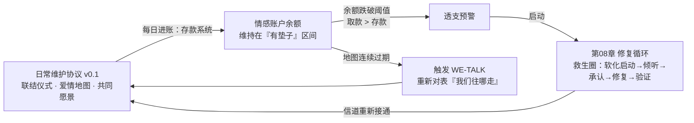
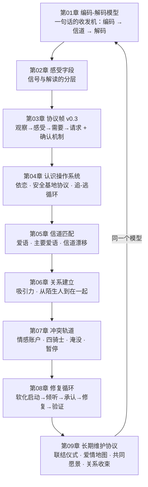

# 第 09 章 · 长期经营：日常维护与关系收束

> 核心认知：热恋的坠落不是关系的失败，是关系进入「需要维护」阶段的信号。长期关系靠的不是激情，是一套可持续的情感存款系统——闪电负责点亮夜空，炉火负责把日子过下去，而炉火是要添柴、要通风、要每天看上一眼的。

---

## 引子

周末早晨的沙发。

我醒得比闹钟早。阳光从窗帘缝里挤进来，正落在那盆绿萝上——她上周买的，说「阳台缺个活的」。我盯着那盆绿萝看了很久，听见她在厨房煮粥，锅盖碰锅沿的轻响，和上个月每一个周末早晨一模一样。

她端粥出来的时候，穿的是那件领口松了的旧睡衣。她从我面前走过去，头发随手扎着，一缕垂下来——两年前，就是这个动作，让我在楼下站了十分钟才敢给她发消息。刚才呢？我端着咖啡，视线从她身上滑过去，落在茶几的遥控器上，又滑回来。心里一点波澜都没有。

我翻出手机相册，滑到两年前表白那天。照片里她站在路灯下，整个人像在发光。我盯着那张照片，又抬头看了看厨房里系着围裙的背影，忽然被一个念头钉在沙发上：**我是不是不爱她了？**

这个念头让我手心发凉。我把咖啡杯放回茶几上，杯底磕出一声轻响。我出门透气，在楼下长椅边坐下——老谟正坐在那里，腿上摊着一本旧台历，从后往前，一页一页翻。

「老谟，」我说，「我完了。」

「你完了什么？」

「我不爱她了。」我说，「她从我面前走过去，我心里一点感觉都没有。两年前我看见她就心跳，现在她站我面前，我连视线都不想抬。这不就是不爱了？上个月你说修复循环管的是『这一场架怎么收场』，管不了『这一年怎么过』——现在一年的日子摆在我面前，我才发现，这个场子我根本撑不住。」

老谟翻到某页，停住了。他把台历举起来对着光看了一会儿，然后问我：「这本台历，是从哪一天开始翻的？」

「……你翻它干什么？我说的是我爱不爱她的事。」

「我问你的也是这个。」他把台历递到我面前，「你俩，是从哪一天开始算在一起的？」

---

## 对话引擎

### 第 1 轮：你爱上的，是那个人，还是「那个人会带来的心跳」？

**造物主**：哪一天……表白那天。两年前六月，路灯底下。

**老谟**：好。表白那天之前，你看见她，是什么感觉？

**造物主**：心跳加速，手心出汗。她回我一条消息，我能盯着屏幕乐半天。晚上闭上眼，脑子里全是她。那感觉……上头。

**老谟**：现在呢？你早上看见她端粥出来，什么感觉？

**造物主**：……没感觉。平静。我甚至没抬头。

**老谟**：所以你的结论是——「没感觉了，等于不爱了」。那我顺着你的逻辑问：你两年前「上头」，是因为她这个人，还是因为她给你的那份「上头」？

**造物主**：当然是她这个人！不然我为什么是她，不是别人？

**老谟**：好。假设现在有一种药片，吃下去，你就永远对她心跳加速、手心出汗、夜不能寐——你会吃吗？

**造物主**：……那是药。那不是爱。靠药吊着的心跳，不算数。

**老谟**：那你凭什么把「上头」叫爱，把「不上头」叫不爱？你俩一起住了两年——她每天几点起，粥煮得稀还是稠，阳台上那盆绿萝是她哪天搬回来的，这些事，哪一件是靠「上头」撑下来的？

**造物主**：……靠不了。上头是闪电，过日子是长明灯。可老谟，闪电熄了，灯还亮不亮，我凭什么信？

**老谟**：闪电为什么熄——这个问题的答案，你答错了，就会得出「我不爱了，该分手了」。答对了，你会看见另一件事。你想先听哪个答案？

**造物主**：先听……闪电为什么熄。

---

**📐 知识锚点：热恋的「上头」是什么——多巴胺系统的新奇奖赏**

**重要声明（先读）**：以下内容是**机制简化表述，神经科学仍在研究中**。本章给出的「多巴胺」「催产素」描述，是把复杂的大脑过程压缩成一张可用的示意图——它是科普级的理解框架，不是神经科学的最终定论。凡涉及神经化学的句子，都请当作「示意图」读，不要当成「说明书」。

热恋期的「上头」，在科普级理解里是这样一回事：当你遇到一个全新的、不确定能否得到回应的人，大脑的**奖赏系统（reward system）**被高强度的新奇（novelty）与「可能获得」激活——大量**多巴胺（dopamine）**参与了这个过程，驱动你去接近、去追求、去反复确认。这跟赌博机、游戏里的掉落机制是同一条神经通路：**它的设计目的是驱动「追求」，不是驱动「相守」。**

美国罗格斯大学的人类学家海伦·费舍尔（Helen Fisher）与合作者在 2000 年代用功能性磁共振成像扫描热恋中的人：被试看恋人照片时，脑区激活集中于腹侧被盖区等与奖赏有关的区域。她据此把热恋描述为一种「奖赏系统驱动」的状态。**注意：这是科普性质的研究解读**——费舍尔的研究有真实的脑成像数据，但「热恋 = 多巴胺」是被媒体大幅简化的表述；多巴胺参与奖赏与动机，不等于「多巴胺就是爱情」。本书引用它，只为回答一个具体的问题：**为什么「上头」通常会消退。**

答案的关键在一个词：**新奇（novelty）**。奖赏系统对「新」最敏感，对「已知」会迅速降低响应——这叫**奖赏的习惯化**（habituation）：同一个行为重复足够多次后，大脑对它的多巴胺响应会回落。这不是系统坏了，恰恰相反——**这是系统完成了「确认」**（注意：这是叙事性隐喻，机制上更准确的表述是「奖赏通路对新奇刺激的响应回落」；用它只是为了直观）。它登记了「这个人安全、可及、不会消失」，于是把注意力从「追求」切换到别处。「上头」的消退，是大脑在说「我确认过了，不必再追了」，而不是在说「她不值得爱了」。

> **跨章回环**：把这句话放进第 01 章的通信语言里——奖赏系统是「追求模式」的发射机，它设计出来是为了**搜索目标**；当目标被确认锁定，搜索行为本该终止。你误把「搜索终止」读成「信号丢失」，等于把「系统完成任务」听成了「系统故障」。第 08 章我们说过「修复循环管不了这一年」——现在你看到了第一块拼图：**这一年的日子，本来就不是靠那台搜索发射机过的。**

---

### 第 2 轮：从「奖赏驱动」切到「依恋驱动」——你差点亲手掐死一段健康关系

**老谟**：闪电为什么熄，答案你拿到了。现在该听第二件事了——灯还亮不亮，你凭什么信？

**造物主**：……我不知道拿什么信。她还在我身边，可我心里没火苗了，我拿什么证明我还在爱？

**老谟**：那你先回答我一个问题——你们住在一起的这两年，她哪天晚上没回来，你是不是会一直等到她进门才踏实？

**造物主**：……会。她加班晚了我睡不着，听到钥匙声才闭眼。

**老谟**：她上次生病，你在医院走廊坐到天亮，是因为「上头」，还是因为别的？

**造物主**：……上头管不了那么久。那晚我脑子里全是「她得没事」。那不是心跳，是……揪着。

**老谟**：再问你——你早上看见她端粥出来，心里没波澜。可要是明天早上，端粥的换了另一个人，你心里有没有波澜？

**造物主**：……我光是顺着你这话想了想，后背就发凉。端粥的人换了，我可能当场站起来。老谟，这算什么？这不是爱吧，这是……依赖？

**老谟**：心理学给这种东西起过名字。你先别急着给它贴「依赖」的标签——你先回忆第 04 章，安斯沃思那个陌生情境实验。小孩在陌生房间里玩，妈妈在旁边，他敢出去探索；妈妈一走，他停下所有动作；妈妈回来，他扑上去，然后又能安心玩了。那个「妈妈在，我就踏实」的东西，叫什么？

**造物主**：……依恋。安全基地。可靠回应、一致行为、情绪在场。老谟，你是说——我心里的那盏灯，其实一直是亮着的，只是它烧的不是「上头」那种燃料？

**老谟**：你自己说的。热恋那套「奖赏驱动」，烧的是多巴胺，它管追求、管心跳、管夜不能寐；可它管不了「她在，我就踏实」——那是另一套系统：**依恋驱动**。日常的陪伴、靠近、彼此的回应，会激活与依恋、信任有关的神经化学过程，其中常被提起的包括**催产素（oxytocin）**。注意，同样是简化表述——「催产素是爱的激素」是流行说法，科学上它更像一种调节信号，参与信任与联结的形成；具体机制仍在研究中。你只需要记住结论的骨架：**长期关系不是靠刺激维系的，是靠「可预期的在场」维系的。**

**造物主**：可这套系统太安静了。它不响、不闪、不让我心跳加速——我早上端着咖啡，心里一片平静，我根本感觉不到它在工作。

**老谟**：安静，恰恰是它在工作的样子。你听不见发动机响，不代表发动机停了——你听不见，是因为它运转得太稳，没有故障要报告。你非要把「不响」听成「坏了」，那你打算怎么办？

**造物主**：……我昨晚差一点就准备跟她提分手了。我想的是「趁还没陷得太深，别耽误她」。

**老谟**：你差一点，亲手把一段健康的关系，用「检测不到激情」这个理由掐死。你这不是不爱她，你是不认识现在的爱长什么样——你还拿着两年前的仪表，量今天的感情。第 05 章我们说过，信道会漂移，配置器要定期重跑；你倒好，连「爱长什么样」这个仪表本身，都不肯换。

---

**📐 知识锚点：从奖赏驱动到依恋驱动——两张仪表，测两种东西**

把两个阶段摆成一张对照表，你会看见：它们根本不是同一种东西，只是共用了「爱」这个名字。

| 维度 | 奖赏驱动（热恋期） | 依恋驱动（稳定期） |
|------|------------------|------------------|
| 主导系统 | 多巴胺奖赏通路，对新奇敏感 | 依恋系统与联结相关调节（如催产素参与的信任过程） |
| 设计目的 | 驱动追求、确认目标 | 维持在场、提供可预期的安全基地 |
| 典型信号 | 心跳、渴望、思念、夜不能寐 | 踏实、安心、「她在我就不慌」 |
| 对「日常重复」的态度 | 习惯化后快速消退 | 恰恰靠日常重复来滋养 |
| 用错仪表测它 | 会得出「我不爱了」 | 会得出「我们没激情了，是不是完了」 |

**核心结论（本章第一块基石）**：热恋期「结束」，不是关系的下坡起点，而是**奖赏驱动阶段完成了使命、系统切换到依恋驱动**的交接点。这个切换不是失败，是升级——从「确认要不要在一起」切换到「怎么把在一起的日子过下去」。两个阶段都有各自的神经化学背景，但注意：**整张表的机制描述均为科普级简化，神经科学仍在研究中；依恋驱动部分的实证基础主要来自第 04 章的依恋理论（鲍尔比/安斯沃思），而非对催产素的单一解释。**

**为什么「检测不到激情」会让人误判**：人们把「上头」误当成了爱的全部仪表读数。当这台仪表归零，就读出「我不爱了」。但「上头」本来就是为「追求期」设计的；拿追求期的仪表去测量长期期，等于拿体温计测血压——测得再准，也是错的量表。**健康的长期关系，恰恰是「平时测不出激情」的关系：它不需要每分钟报告一次高唤醒，它只需要每天确认一次「你在、我在、我们还在」——这就是依恋驱动的低频心跳。**

> **跨章回环**：这个「低频心跳」你并不陌生——第 04 章安全基地协议里的「心跳（heartbeat）」机制，就是为它设计的：每天一次低成本的「我还活着」信号，证明连接在线，不必靠每条消息的即时回执。当年你觉得那是协议里的一个小字段，今天你看见了它的真身：**那就是依恋驱动在长期关系里的运行方式。**

---

### 第 3 轮：你俩那本账，存款全靠「大事」，取款全是「日常」

**造物主**：行，我认——闪电是追求期的灯，过日子靠的是另一套灯。可老谟，就算我信了这套，问题还在：日子怎么过？上个月我学会了修复循环，可那玩意儿是救生圈——总不能一年三百六十五天，天天靠救生圈活着吧？

**老谟**：谁让你靠救生圈了？我问你——你俩上周那顿饭，是怎么吃的？

**造物主**：……上周？就正常吃啊。我下班回来，她做好了饭，我坐下吃，她坐对面，我们各看各的手机。

**老谟**：再往前，你俩上次认认真真坐在一起说话，说了多久？

**造物主**：……上个月她生日，我订了家餐厅，那晚聊了挺久。还有去年旅行，火车上聊了一路。其余时候……好像没有。

**老谟**：你听出你自己的账了吗？你列举的「好好说话」，全是**大事**：生日、旅行、纪念日。我再问你——你俩出门，她走你左边还是右边？她最近一次因为工作睡不着，是哪天？她上周跟你说过几次「今天好累」？

**造物主**：……走我右边，她说过走右边踏实。工作……上上周她好像提过一句项目的事，我当时在打游戏，没接。今天好累……上周五说了一次，我回了个「那早点睡」。

**老谟**：你刚才回答前三个问题的时候，卡了几次壳？你自己说说——三个问题，你答上来了几个？

**造物主**：……第一个答上来了，后两个，我是现想的。

**老谟**：可她的这些信息，你两年前全是现成的——那时候她皱一下眉，你都要问三句。现在你连她「最近在焦虑什么」都要现想。我来给你把账翻清楚：你俩这本情感账户——第 07 章那本——存款靠什么？

**造物主**：靠……大事。纪念日、旅行、生日惊喜。一年攒不了几笔，还全靠计划。

**老谟**：取款呢？

**造物主**：……日常。打游戏没接她的话、她说累我回「早点睡」、她做好饭我俩各看手机——全是日常。第 07 章我说过「忽视也是一种取款」。老谟，你这么一摆，我这本账……日常全是取款，存款全靠大事。大事一年才几笔，日常一天就扣好几笔。这账怎么算得平？

**老谟**：算不平。所以你俩不是缺一场修复——你俩是缺一个**让存款能定期到账的系统**。第 08 章救生圈救的是「断线的时候」；你现在缺的是「线一直不断」的养护。戈特曼管这套养护，叫**联结仪式（rituals of connection）**——每天、每周那些固定的、小的、可预期的互动，让账户每天都有进账，而不是攒到大事才存一笔。

---

**📐 知识锚点：联结仪式（rituals of connection）——情感账户的定期存款**

**联结仪式（rituals of connection）**：约翰·戈特曼（John Gottman）在关系研究中提出的概念——一段关系里那些**固定的、重复的、带有共同意义的小互动**。它们规模小到不像「经营」，但它们是情感账户的**定期存款机制**：日常进账，而不是逢年过节才进账。

戈特曼及其合作者（《The Relationship Cure》，2001）反复强调的洞见是：**长期关系不是被大事维系的，是被每天的小事维系的。**他观察到的稳定幸福关系，几乎都有自己的一套「仪式」——关键是它们**固定、可预期、双方都认**：

| 仪式示例 | 规模 | 为什么它是存款 |
|---------|------|--------------|
| 每天 5 分钟高质量对话（放下手机，问「你今天过得怎么样」，真的听）* | 5 分钟 | 被看见、被回应——第 07 章「该看见的看见」是存款的核心 |
| 出门前的告别吻 / 睡前的一句固定话 | 10 秒 | 可预期的连接确认——第 04 章的「心跳」字段 |
| 每周固定的电影夜 / 固定散步路线 | 2 小时 | 共同仪式创造「我们」的专属意义，第 05 章「精心的时刻」信道持续供能 |
| 每天一起吃饭时关掉手机 | 30 分钟 | 物理在场 + 注意力在场——注意，第 05 章说过，精心的时刻的定义是「完整的注意力」，人不在场等于没开这条信道 |

> *注：此表为本书的落地示例。戈特曼的原版处方是每周合计约 5 小时的「神奇五小时」（Magic Five Hours：告别仪式、重逢仪式、欣赏、情感、每周约会）——「每天 5 分钟」是其最小可行变体，规模可按关系阶段调整，关键是**固定、可预期、双方都认**（见第 05 章信道匹配：仪式要落在对方的主要爱语上才生效）。

**为什么「小」反而关键（机制）**：第 07 章定理 4 说过——账户余额决定引爆阈值。余额高，小摩擦是小摩擦；余额见底，一粒沙子引爆雪崩。联结仪式的功能，就是**维持余额的日常进账**，让账户很少跌到「一粒沙子就能引爆」的区间。这不是心灵鸡汤，是账户模型直接推出的结论：**你没法靠一年两次的大事补足三百六十五天的日常取款——算术上就补不平。**（呼应第 08 章：5:1 不是算术游戏，但它的方向是对的——负向互动需要大比例的正向来垫，而正向互动的主力，只能是日常。）

**造物主撞出来的诊断**：存款全靠大事、取款全是日常——这是本章要治的第一个病。它有个操作化诊断法（进训练场用）：**把上周的互动按「是否固定重复」分类——凡是需要计划、需要特别安排才发生的互动，都算「大事」；凡是每天都在发生的互动，都算「日常」。然后数一数：你的存款落在哪一类里？**

> **历史溯源**：「联结仪式」是戈特曼的实证框架（出自其长期婚姻研究传统，与第 07、08 章的末日四骑士、修复循环同源）。注意它与「大事」的区别是戈特曼研究的核心发现之一：**关系科学的测量显示，稳定幸福关系的特征不是「惊喜多」，而是「例行互动质量高」**。这个结论与「仪式」在人类学里的概念（ritual 的重复、象征、意义属性）相呼应——戈特曼借用并操作化了它。

---

### 第 4 轮：爱情地图——你对她的了解，停在了表白那天

**造物主**：仪式……我承认，我连「她最近在焦虑什么」都要现想，这确实不像话。可她也没主动跟我说啊！她工作上的事，我又不懂，她说了我也插不上话。

**老谟**：那我问你——她现在最想去的那个地方，是哪儿？

**造物主**：……她上回说想去云南，说想看洱海。去年说的。今年……好像没再提。

**老谟**：她最近新交的朋友，叫什么名字？

**造物主**：……她提过一嘴，我没记住。

**老谟**：她上周刷到一个东西，说「这个好好玩」——是什么？

**造物主**：……我……我那时候在看球。

**老谟**：好了，我不问了。你发现没有——我刚才问你的这些问题，不是「她爱吃什么」这种老问题。我问的是**她最近三个月内心世界的状态**。第 01 章你学会观察别人的行为，第 02 章你学会翻译自己的感受，第 03 章你会发完整的协议帧——可你现在连她「最近在为什么发愁」都说不上来。你说她「不主动说」，我换个说法：**是她没说，还是你没在听？**

**造物主**：……她说了。上周五她说「今天好累」，我回「那早点睡」。她说了三次「最近总觉得心里没底」，我一次都没往下接。她不是没说，是我把她的信号，全当成了背景音。

**老谟**：戈特曼给这种东西起过名字，叫**爱情地图（love map）**——你脑子里那份关于「她是谁」的地图：她的压力源、她的梦想、她的朋友、她最近的爱好、她的小世界最近在发生什么。**地图不是表白那天画完就完事的——它是动态更新的。**你手里那份地图，更新到哪一天？

**造物主**：……停在两年前，路灯底下。之后的地图，全是旧版。她这两年变了很多，我拿的是两年前的导航图在走今天的路——难怪老觉得走不对。

---

**📐 知识锚点：爱情地图（love map）——必须持续更新的内心世界坐标**

**爱情地图（love map）**：戈特曼在《幸福的婚姻》（*The Seven Principles for Making Marriage Work*，1999）中提出的概念——指一方对另一方**内心世界**的了解程度：TA 最近的焦虑源、近期的朋友与社交圈、新的爱好、对未来的计划、人生中正在发生的具体事件。注意它的限定词：**不是「静态档案」，是「动态更新的坐标」。**

三个关键性质：

1. **爱情地图的新鲜度决定解码准确率**：你解读对方行为（第 01 章的「解码」）的准确率，取决于地图新鲜度。地图停在两年前，你把「她说累」解码成「她困了」，实际上那是「她焦虑得没力气」——解码错，不是信道有噪声，是你的参考库过期了。
2. **地图靠「听」更新，不靠「猜」更新**：更新地图的原料，是对方平时不经意放出来的信息片段——一句「今天好累」、一个「这个好好玩」、一个皱眉。**第 02 章你学过：信号是身体发出的，不会自己贴标签。**长期关系里，这些微信号每天都在发射；接住它们，是爱情地图的日常更新动作。这与第 01 章观察三校验不冲突——地图更新接的是「她说了什么、做了什么」，不是「我猜她什么意思」。
3. **地图过期 ≠ 关系没救**：地图可以重新校准。问题只在于：**你得先发现自己拿着旧地图**——本章引子里那个「我是不是不爱她了」的念头，其中一半就是地图过期的症状：你认不出眼前这个人了，于是以为「这不是我爱的那个人」。

**与「联结仪式」的分工**：联结仪式是**存款动作**（定期往账户里存），爱情地图是**存款所需的「账目信息」**（你得知道她现在需要什么，这笔存款才存得进她心里）。没有地图，仪式会退化成机械打卡——第 05 章反例 3 说过：形式到位、人不在，等于没信号。**仪式给地图供料，地图让仪式对准**——两者合起来，才是「日常维护系统」的完整形态。

> **历史溯源**：爱情地图出自戈特曼 1999 年《幸福的婚姻》，是书中「七大原则」之一（本书第 07、08 章引用的四骑士、5:1、69% 均出自同一研究体系）。戈特曼对爱情地图的可操作化是直接问：**给伴侣提问，测你们彼此了解的实时度。**它和联结仪式一样，属实证框架下的关系科学概念。

---

### 第 5 轮：「我们」这个词——共同愿景，和一台维护协议

**造物主**：仪式有了，地图也会更新了——那这两样加起来，就算「维护系统」了？日子就能过下去了？

**老谟**：还差一个东西。我问你——你俩聊过「五年后」吗？

**造物主**：聊过啊。她说过想换个大点的房子，我说我想攒钱做点自己的事。

**老谟**：她换房子，是为了什么？她想要的那个家，长什么样？你说你要做「自己的事」——那件事里，有她的位置吗？

**造物主**：……你这一问，我又卡壳了。我们好像聊的都是「我要什么」「她要什么」……从来没聊过「我们要什么」。

**老谟**：你俩一人一条轨道，各自往前铺——你铺你的「事业」，她铺她的「房子」。两条轨道一直平行，从没汇合过。第 06 章你们怎么在一起的？先靠近、再互惠、再自我暴露，一步一步走到一起。**可「走到一起」之后呢？** 关系不是停在「在一起」那一刻的——它要么朝「我们往哪走」的方向长，要么停在原地各自长。戈特曼研究里，长期稳定的关系还有第三个引擎：**共同意义（shared meaning）**——你们一起搭建的、关于「我们是谁、我们往哪走」的那套东西。

**造物主**：所以光有存款和地图还不够，还得有……共同目标？

**老谟**：目标只是其中一层。底下那层是：**你俩得能回答同一个问题——「我们正在一起把生活过成什么样？」** 回答得出来，日常的存款就有了方向：每一笔存款都在为同一个方向存。回答不出来，存款就是散存的零钱——存了也不知道为了什么。你俩现在，就是零钱账户。

**造物主**：……那我回去跟她聊「我们要什么」？可这话题太虚了，怎么开口？

**老谟**：怎么开口——你手里不是有整套工具吗？观察、感受、需要、请求——第 01 到第 03 章造的那台收发机，你以为它只用来吵架？它是拿来谈「我们」的。**把「我们」当成一个共同对象，用协议帧去和它对话——这就是终章要组装的最后一块。**实现时间，老规矩，把「长期维护系统」画成图纸给我看。

**造物主**：……那我先推。长期维护，第一件要保证的事，是「每天都有存款」——不能全靠大事。所以第一块是**日常仪式字段**：每天 5 分钟对话、告别吻、一起吃饭。这个从第 07 章情感账户来——存款频率决定余额，频率不够，余额天天被取款吃掉。

**老谟**：好。第二块呢？

**造物主**：第二块是**地图字段**……刚才第 4 轮推的爱情地图，问题在于「靠自觉更新会过期」。所以它不能是个摆设字段，得有个**强制对表机制**——定期聊「你最近在想什么、担心什么」，更新地图。我给它起个字段名：WE-TALK。

**老谟**：第三块？

**造物主**：……共同愿景。刚推的「我们要什么」。这个没法固定频率——它是方向，不是任务。但得有**触发条件**：地图连续过期、或者两个人感觉方向不对的时候，就得触发 WE-TALK 重新对表，把「我们往哪走」再问一遍。

**老谟**：行了。三块你全推出来了——存款、对表、方向。现在把它们画成一台协议：字段、频率、触发、回环。画完你就知道，这台协议不是发明的，是从第 01 章一路长到这里的。

---

**📐 知识锚点：实现思考——长期关系维护协议 v0.1（情感存款系统）**

把本章到目前为止的三块（联结仪式、爱情地图、共同愿景）组装成一台可运行的协议，就是第 08 章「修复循环救生圈」的长期版——**日常维护协议**。字段设计如下：

```
┌────────────────────────────────────────────────────────────┐
│  长期关系维护协议 v0.1（本章推导）                            │
│                                                             │
│  三大子系统：                                                │
│  · 存款系统（联结仪式）：每日/每周固定小仪式，定期进账          │
│     字段：DAILY-RITUAL（每日 5 分钟对话 · 告别吻 · 共同吃饭） │
│           WEEKLY-RITUAL（固定散步/电影夜/共同爱好）           │
│  · 地图系统（爱情地图）：持续采集对方内心世界的新信息           │
│     字段：MAP-UPDATE（每周一次「她最近在焦虑/高兴/想做什么」） │
│           BID-CATCH（第 08 章的修复尝试前移：每天接住 1 个     │
│                    「被搭话」的小信号，不装没听见）            │
│  · 愿景系统（共同意义）：定期校准「我们往哪走」                 │
│     字段：WE-TALK（每月一次 30 分钟「我们」对话）             │
│           VISION-SYNC（目标对表：你的五年、她的五年、我们的）  │
│                                                             │
│  故障处理：                                                  │
│  · 检测到账户透支预警（取款连续多于存款）→ 触发第 08 章        │
│    修复循环（救生圈），修复完回到日常协议                      │
│  · 地图连续两周无更新 → 触发 WE-TALK，重新对表                │
│  协议前提：双方都承认「需要维护」——单方面维护是表演            │
└────────────────────────────────────────────────────────────┘
```



**读图说明**：这张图把「长期经营」画成了一台循环运行的协议。读法注意三点——

1. **主环是「日常维护 → 账户健康」的正向循环**：联结仪式、爱情地图、共同愿景三套子系统持续运行，让情感账户（第 07 章）余额保持在「有垫子」的区间——这就是「长期关系靠的不是激情，是一套可持续的情感存款系统」的工程表达。
2. **图上只有两条从主环分出去的回环**：一条是「账户透支预警 → 第 08 章修复循环 → 回到日常维护」——救生圈不替代日常维护，它只在透支时兜底，救完就回到主环；另一条是「爱情地图过期 → WE-TALK → 回到主环」——地图不是靠自觉更新的，是靠一个固定仪式强制对表的。
3. **图的边界**：协议的前提是**双方都承认「这段关系需要维护」**——如果一方认为「真爱不需要经营」，另一方在单方面执行协议，那叫表演，不叫维护（呼应第 08 章「协议是双方签字的」）。另外，下面第 6 轮会讲：如果维护系统确认「日子真的过不下去了」，这台协议还必须有**一个体面的终止流程**——协议可以停止服务，但不能让停止变成事故。

---

### 第 6 轮：边界——日子真的过不下去时，怎么体面地收束

**造物主**：老谟，你前面说的我都认——可有个问题我一直不敢问：要是维护系统跑满了，日子还是过不下去呢？要是「她在我就不慌」这种踏实感也没了，两个人只剩客气了，那……是不是还是得分开？

**老谟**：你问的不是「该不该分开」。你问的是——**分开这件事，有没有一个不伤害人的说法？**

**造物主**：……是。我怕的不是分开，是分开的时候，把过去两年全盘否定掉。我怕我说「我们分手吧」，她回「所以这两年都是假的」。我怕这一句话，把我们这两年全变成了笑话。

**老谟**：那你先回答我——你俩要是分手，是「这段关系失败了」，还是「这段协议到期了」？

**造物主**：……协议到期？老谟，恋爱又不是合同。

**老谟**：第 04 章你说过，亲密关系是「出厂写好的程序在跑」；第 03 章你说过，请求可以协商、可以拒绝、拒绝后回退需要层重新商量——你早就把这段关系当成一套运行中的系统在理解了。系统运行到某个节点，双方各自的利益状态变了、需要不再能被共同满足——这时候系统要做的，不是假装它还在跑，是**按协议关闭**。关闭不是崩溃，是结束服务。你俩在一起两年，这两年不是「失败了」，是**协议期满、双方受益过、现在利益不再一致**。这话你敢对她说吗？

**造物主**：……敢是敢。可「协议到期」这种说法，太冷了吧？她要的是情感，不是停机公告。

**老谟**：那你觉得「体面」是什么？是哭天抢地把两年说得一文不值，还是……你能在结束的时候，把她这两年给你的，认认真真还回去？

**造物主**：……还回去？怎么还？

**老谟**：用你学过的工具。第 01 章到第 03 章，你学会了观察、感受、需要、请求——**分手这句话，本来就该用协议帧来说**。观察：事实是什么；感受：我现在的感受是什么；需要：我需要什么、也尊重你需要什么；请求：用「请求」而不是「审判」的语法提出来。分手不是说「你这个人不行」，是「我们这段协议，双方的需要已经对不上了」——**主语是「我们」，不是「你」**。分手是请求，不是审判——这个分界线，就是第 03 章「请求 vs 要求」的可拒绝性，放到关系终结这个场景。

**造物主**：……我好像有点懂了。还有吗？

**老谟**：还有两件事。第一，**允许悲伤**——协议期满，不等于没有损失。你失去的是两年里真实发生过的那些日子，悲伤是合法的，不需要用「我们没缘分」来消毒。第二，**不纠缠解释**——分手之后，最伤人的不是「分开」，是「分开之后还要反复解释为什么分开」。第 08 章的修复循环，在善后阶段有个边界用法：**善后的目标不是「修复关系」，是「修复过程的体面」**——把该说的话说完整、把彼此的感谢和遗憾说清楚、让信道以「关闭但无事故」的方式结束，而不是以「静默消失」的方式烂尾。至于「我们还能不能做朋友」——那是另一张协议，签不签，等悲伤期过了再谈，别在当天给承诺。

---

**📐 知识锚点：关系收束——失恋不是失败，是协议的终止**

**关系收束（relationship closure）**：本书对「分手/失恋」的处理框架——把关系结束理解为**一段共同运行的协议的终止**，而不是**一段人生的失败判决**。这个框架的三条操作规则，全部来自本书已有工具：

1. **分手是请求，不是审判（第 03 章语法）**：分手对话用协议帧表述——观察（「我们最近半年的对话，几乎只剩下生活安排」——可核实、有时间戳、对事不对人）、感受（「我有点失落，也有点疲惫」——感受三规则）、需要（「我需要的关系，是能持续更新、能一起往同一个方向走的」）、请求（「我想我们好好谈一次分开的事，你愿意吗」——正向、具体、可协商）。**分界线**：审判句是「你从来没爱过我」「你根本不适合我」——那是第 01 章定义 2 的评判句，一旦出口，触发防御，分手就变成互相伤害。请求句的主语是「我」和「我们」，不是「你」。
2. **允许悲伤（情绪合法性）**：第 02 章说过，情绪是信号，不是故障。失恋的悲伤是真实的信号——它在报告「我失去了重要的东西」。不需要用「我应该坚强」「早点认清也好」把它压掉。**允许悲伤，是让信号有机会被翻译，而不是被关掉。**
3. **不纠缠解释（第 08 章修复循环的边界用法）**：修复循环用于「信道断了的修复」；但关系终止后，修复的目标是**「结束得干净」**，不是「重新接通」。善后流程可以走一次完整的「说清楚」——把感谢说清、把遗憾说清、把「我们为什么走到这里」的各自版本说清——然后**接受信道永久关闭**。反复解释、追问「到底为什么」、试图用沟通翻盘，是把「善后」误当成「修复」；而第 08 章边界讨论里说过：对已单方面终止的关系，启动修复循环的前提——「双方都愿意谈」——已经不存在了。

**为什么失恋要放进这本书（终章边界的意义）**：全书讲的是「怎么让沟通不翻车」，但任何协议都有终止的那一天。**把「结束」纳入系统，系统才完整**——否则读者会以为这本书只讲「在一起」，一遇到「要分开」就发现没有工具可用。把失恋纳入本书框架的意义是：**分手不需要靠恨来撑住体面，也不需要靠「都是我的错/都是TA的错」来止痛——它需要的是把这段关系当一段真实的、受益过的协议，体面地关闭。**失恋不是失败——失败是不敢面对收束、让一段早已终止的关系用冷战和消失来「烂尾」。

> **安全红线（全书共享）**：以上「体面收束」的框架，以关系内存在基本尊重为前提。若关系已存在持续羞辱、威胁、暴力（第 04 章红线），不存在「体面分手对话」——此时唯一正确的动作是**安全离开**，联系可信任的人或专业支持，而不是组织一场协议帧式的谈话。协议的前提是安全；不安全的环境里，第一需要是活着走出去。

---

### 第 7 轮：落点——从「解释一句话」到「经营一段关系」，同一台收发机

**造物主**：老谟，让我把今天的东西串一遍。热恋期会结束，不是因为不爱了，是奖赏驱动的使命完成了，系统切到了依恋驱动——我不该拿「上头」当爱的唯一仪表。过日子靠的不是激情，是日常维护：联结仪式每天进账，爱情地图持续更新，共同愿景让存款有方向。这三样合起来，就是一台长期维护协议。万一协议真的跑不下去，收束也要体面——分手是请求不是审判，允许悲伤，不纠缠解释。

**老谟**：停。你说得都对——但你别急着背。我问你一个问题：你今天早上说的第一句话，是什么？

**造物主**：……「我不爱她了。」

**老谟**：现在，把这句话，用你今天学到的东西，重新说一遍。

**造物主**：……「我的感情换了驱动方式，我认不出它了；我的爱情地图过期了，我拿旧图走新路；我的账户日常在取款，存款全靠大事。我差点把『需要维护』读成『该结束了』。」老谟，我这一早上，不是在处理失恋——我是在做一次**关系体检**。

**老谟**：体检做完了，病也认出来了。那你说说——这本书读到今天，从第 01 章到这一章，你手里到底攒下了一套什么？

**造物主**：……第 01 章，我把「一句话」拆成编码、信道、解码，学会观察句三校验；第 02 章，我学会感受是信号、想法是解读；第 03 章，我造出了完整协议帧——观察、感受、需要、请求；第 04 章，我看见自己的操作系统，学会了安全基地协议；第 05 章，我学会信道匹配，知道爱要发在对方收得到的频段；第 06 章，我知道了吸引力从哪来、关系怎么建立；第 07 章，我看清了冲突的轨道和情感账户；第 08 章，我学会把断线焊回去——修复循环。今天，我把这些都装进一台长期维护协议里，还给协议加了一个体面的终止流程。老谟，我现在说的不是八章知识——是**同一台收发机**。第 01 章我用它解释一句话，今天我用它经营一整段关系。同一个模型，从一句话长成了一段日子。

**老谟**：那你觉得，你这两年是白过了吗？

**造物主**：……不白过。她教会了我被爱是什么滋味，我也给了她我最好的两年。就算将来分开，那也是协议到期，不是审判。老谟——我不是学会了谈恋爱。

**老谟**：那是什么？

**造物主**：我是学会了怎么造一套不翻车的沟通协议。谈恋爱的人会分手，协议不会背叛我——它告诉我，日子要靠日常进账过，地图要持续更新，终点要体面收束。**我不是学会了爱，我是学会了怎么维护爱。**

**老谟**：行了。你今天不是处理了一场「失恋」——你是给自己这本书，上了最后一根发条。你会过日子了。

（他把那本旧台历翻到最后一页，合上，递给我。扉页上不知道谁用铅笔写着一行小字：「日子不是过出来的，是养出来的。」）

**造物主**：老谟，最后一页，你还没教我——下一章是什么？

**老谟**：没有下一章了。书翻完了——**剩下的日子，你自己写。**

---

**📐 知识锚点：全书总装图——同一台收发机，从一句话长成一段关系**

把全书九章组装成一张图，你会看见：**第 01 章那个编码-解码模型，从头到尾没有换过——它只是不断长出新的部件。**



**读图说明**：这张图是全书的总装图，读法注意三点——

1. **最上方是源头，最下方是归宿，一条回路把两端连起来**：第 01 章的编码-解码模型是整本书的种子——它最初只是用来解释「一句话为什么把天聊死」。此后每一章都在给它加部件：感受字段（第 02 章）、请求确认机制（第 03 章）、操作系统诊断（第 04 章）、信道匹配（第 05 章）、关系建立（第 06 章）、冲突轨道（第 07 章）、修复循环（第 08 章）——直到第 09 章把它组装成「经营一段关系」的完整系统。**图最下方的回路箭头表示：这个系统修好了，反过来又能让第 01 章那台收发机跑得更顺——同一个模型，能力长了八倍。**
2. **每一层都是下一层的输入**：这张图没有跳跃——你不会读第 04 章的协议，就读不懂第 08 章的修复循环；没有第 01 章的地基，第 09 章的维护协议就是空中楼阁。全书的结构是一台递增的协议栈。
3. **图的边界**：第 09 章的「关系收束」在这个栈里的位置很特殊——它不在这条主链上新增部件，而是给整个协议栈定义了「终止流程」。一台有终止流程的协议，才算一台完整的协议；一本讲「不翻车沟通」的书，讲到最后敢讲「怎么体面地结束」，才算把话说全了。

---

## 严格化走廊

> 对话负责直觉，走廊负责严谨。本章把「长期经营的日常维护与关系收束」落成可检查的形式。凡涉及神经化学的陈述，均以科普级简化为限，不作机制层面的科学定论。

### 定义（精确表述）

**定义 1（奖赏驱动阶段）**：关系早期的一种主导状态——个体对关系对象的高强度趋近行为，其特征为高唤醒（心跳加速、思念、渴望）、对新奇刺激敏感、随对象可及性的确认而快速衰减。其科普级机制解释为多巴胺系统的新奇奖赏（**简化表述**）。

**定义 2（依恋驱动阶段）**：关系稳定期的主导状态——以「依恋对象可预期的在场」为基础的安定感：对象在场/可及时感到踏实，对象缺席/不可及时感到不安（对应第 04 章依恋系统）。驱动来源是依恋系统与联结相关的调节过程（科普级常提及催产素参与，**简化表述，机制仍在研究中**）。

**定义 3（联结仪式 rituals of connection）**：一段关系中固定的、重复的、双方共同认可的小规模互动（每日/每周尺度），功能是为情感账户（第 07 章定义 1）提供**规律的存款**。判定标准：① 固定重复（可预期）；② 规模小（不依赖计划与特殊安排）；③ 双方都认（共同意义）。反面：**大事式存款**——依赖纪念日、旅行等特殊安排、频率过低、不可持续。

**定义 4（爱情地图 love map）**：个体对伴侣内心世界动态状态的了解模型——包含对方近期的焦虑源、社交关系、兴趣变化、生活事件与未来设想。判定新鲜度：以「最近三个月的新信息占比」为代理指标；地图停更的表现为「对伴侣近期状态只能猜测、无法复述」。

**定义 5（共同意义 shared meaning）**：双方共同搭建的关于「我们是谁、我们往哪走」的意义系统——包含共同目标、共同记忆、共同语言与角色期待。它使日常存款具有方向性；缺位时，存款成为「无方向零钱」。

**定义 6（关系收束 relationship closure）**：双方确认共同需要不再能被这段关系满足后，以协议终止方式结束关系的流程。特征：① 沟通采用请求语法而非审判语法；② 允许悲伤作为合法情绪；③ 善后以「结束得干净」为目标，不以「重新接通」为目标。

### 定理（带全前提条件）

**定理 1（奖赏消退-依恋接替，科普级机制规律）**：设一段关系由热恋期进入稳定期（前提 P1：关系持续存在且双方维持接近；P2：对象可及性已被长期确认），则新奇性刺激减少，奖赏系统响应回落（习惯化），「上头」体验衰减；与此同时，依恋系统持续运行，以「可预期在场」维持安定感。**推论**：以奖赏驱动阶段的体验为标准测量稳定期的感情，会系统性产生「感情消退了」的误报（量表错误）。*（依据：科普级神经化学简化 + 第 04 章依恋理论的实证基础；精确机制神经科学仍在研究中。）*

**定理 2（联结仪式-账户余额定理）**：设关系采用联结仪式（定义 3）的存款频率为 f₁，采用大事式存款的频率为 f₂（f₂ << f₁，按「每日级 vs 年度级」建模估计，通常相差两个数量级）；设日常互动的取款频率为常数 d。则账户余额 B（第 07 章定义 1）维持在「有垫子」区间的必要条件，是 f₁·(单笔存款均值) > d。*（注：「两个数量级」是本章的建模假设而非实证常数，用于直观展示频率差。）* **前提**：单笔仪式存款须「被对方接住」才算存款（第 07 章定义 7 的精神——发射不等于落地）；仪式若退化为打卡，单笔存款均值趋零，定理前提失效。
>
> **定理 2 的推导（逐步论证，非仅引述）**：① 由第 07 章定义 1，余额 B 的离散演化：每个时间步，B 增加「当步到账的存款」、减少「当步的取款」；② 设仪式存款频率 f₁ 下的日均存款流为 f₁·(单笔均值)，日常取款为 d（两变量均按「日均」口径计量）；③ 由第 07 章定理 4，B 维持在「有垫子」区间要求 B 长期不跌破引爆阈值 θ——而 B 不长期下跌的必要条件是「净流入 ≥ 0」，即 f₁·(单笔存款均值) ≥ d；④ 严格而言「≥ d」只能保证不下跌，要进入并维持「有垫子」（显著高于 θ）还需净流入严格为正，故必要条件收紧为 f₁·(单笔存款均值) > d。**反例（必要性成立、充分性不足）**：即使 f₁·(单笔均值) > d，若单笔仪式「未被接住」（前提失效，退化为打卡），单笔均值趋零，f₁·(单笔均值) 实际 < d，余额仍被侵蚀——这正说明该条件是「必要」而非「充分」，与定理表述一致。

**定理 3（爱情地图新鲜度-解码准确率）**：设个体 A 对伴侣 R 的爱情地图（定义 4）更新停滞于时刻 t₀，当前时刻 t₁ > t₀。则 A 对 R 的行为解读（第 01 章解码）落入陈旧框架的概率，随 (t₁ − t₀) 单调上升——A 倾向于用 t₀ 的模型解释 t₁ 的信号。**推论**：地图长期过期会产生「认不出眼前这个人」的体验，该体验可被误读为「我不再爱这个人了」（与定理 1 的误报叠加）。*（机制推论：第 01 章解码依赖接收方的参考库——「参考库」是本章对第 01 章解码隐喻的引申表述，第 01 章原文为「接收端」「信道」；参考库过期即解码失真。）*

**定理 4（收束语法-防御规避定理）**：设分手沟通采用审判语法（含第 01 章定义 2 的评判成分，如「你从来没爱过我」），则接收方产生防御反应（第 01 章定理 1）的概率显著高于采用请求语法（观察-感受-需要-请求帧）的情形。**推论**：审判式分手把「关系结束」转化为「人格攻击」，使结束过程产生额外伤害；请求式分手以「协议终止」为语义，不触发人格威胁。*（依据：第 01 章定理 1 直接应用。）*

### 证明（完整可复写）

**证明定理 1 推论（为什么「不再上头」会被误读为「不再爱」）**：

- **步骤 1**：设个体 A 在热恋期 t₀ 测得高唤醒体验 E₀（心跳、渴望），并将 E₀ 内化为「爱」的测量标准（量表 S）。*（依据：定义 1——奖赏驱动的体验特征。A 把「上头」当成了爱的仪表读数。）*
- **步骤 2**：关系进入稳定期 t₁，新奇性下降，奖赏系统习惯化，E₁ < E₀（可观测的高唤醒体验衰减）。*（依据：定义 1 + 定理 1——习惯化。）*
- **步骤 3**：A 用量表 S 测量 t₁ 的感情，读数 E₁ 显著低于基准 E₀，量表报「感情消退」。*（依据：步骤 1 的量表设定 + 步骤 2 的读数下降。）*
- **步骤 4**：同时，依恋系统（定义 2）持续运行——A 在对象缺席时不安、在场时踏实。该信号是低频的、无高唤醒的，不被量表 S 采集（S 只测高唤醒）。*（依据：定义 2——依恋驱动的信号特征为安定感而非高唤醒。）*
- **步骤 5**：由步骤 3 与步骤 4，A 的仪器显示「消退」，而实际运行的依恋系统未被测量——A 得出「我不爱了」的结论。**量表错误（用追求期仪表测稳定期）导致误读，而非感情本身消失。** □

> 该证明的关键洞见：**「不再上头」是测量误差，不是关系故障。** 修正方法是更换量表——用「她在我就不慌」「离开会不安」这类依恋驱动信号来测量，而不是继续用「心跳」来测量。这也解释了本章引子：造物主盯着照片怀念「发光感」，却对「她端粥出来他后背发凉地假设她不在」这个真实信号视而不见。

### 反例/边界（钉死适用域）

**反例 1（奖赏消退的例外——新奇可以再生）**：定理 1 说奖赏系统对新奇敏感、会习惯化，但这不意味着新奇永远不可能回归——共同探索新事物（新旅行、新爱好、一起学一件没做过的事）可以重新引入可观的奖赏响应。**边界**：这与「靠刺激维系长期关系」是两回事——前者是**在依恋驱动的主干上偶发的新奇枝叶**，后者是把刺激当成主干（等于永远活在热恋期，科学上不可持续）。本书的立场：长期关系的主干是依恋驱动与日常维护；新奇是肥料，不是地基。

**反例 2（联结仪式的失效条件）**：仪式若沦为机械打卡——人到了、心没到（第 05 章反例 3 的「形式到位、人不在」）——单笔存款均值趋零，定理 2 前提失效。**边界**：仪式有效性的核心不在「做没做」，在「做的时候注意力在不在场」。仪式设计还要警惕「仪式变成控制」——如果一方把仪式当成考核对方的 KPI（「你今晚怎么没给我发晚安」），它就退化成第 03 章的要求而非请求。

**反例 3（爱情地图的边界——地图不等于监视）**：爱情地图是「了解对方的内心世界」，不是「掌握对方的一举一动」。**边界**：采集信息的边界是对方**自愿发出的信号**（说出口的、做出来的），不是侦察（翻手机、查行踪）。越界采集不但违反第 04 章的安全尊重，而且采回来的信息不是「地图」，是「档案」——档案不是信任，是武器。

**反例 4（共同愿景的失效域）**：共同愿景不要求「目标完全相同」——要求的是「目标可以对齐或兼容」；完全不同的职业、完全不同的生活节奏，只要双方能共同构建「我们怎么容纳差异」的意义系统，依然成立。**边界**：真正失效的是「对『我们』这个问题完全回避」——回避本身不是差异，是拒绝进入共同意义的构建（第 05 章实现思考代价二已提示：信道漂移不可怕，可怕的是不重配）。以及：愿景构建以双方都愿意为前提，一方强行推行自己的蓝图，是命令不是愿景（第 03 章）。

**边界讨论（收束框架的适用前提）**：本章「体面收束」框架有三个前提：① 关系内存在基本尊重（无暴力、无持续羞辱——见第 04 章红线）；② 双方需要确实不再能被共同满足（而非单方面一时情绪）；③ 双方都承认这段关系「真实受益过」。任一前提不成立，收束框架降级为「安全离场」——先保住安全，再谈体面。**这与第 04 章、第 08 章共享全书红线：任何沟通技术都以安全为前提，没有例外。**

---

## 知识点总结

### 知识点（本章推出的核心概念）

- **奖赏驱动 vs 依恋驱动**：热恋期靠多巴胺系统的新奇奖赏（追求、心跳、渴望）；稳定期靠依恋系统的可预期在场（踏实、安心）。「上头」消退不是关系坏了，是系统完成了「确认安全」。
- **热恋神经化学（科普级简化）**：多巴胺参与奖赏与追求驱动；催产素（科普常提及）参与信任与联结；Helen Fisher 的功能磁共振成像研究属科普性质解读——**机制简化表述，神经科学仍在研究中**。
- **联结仪式（rituals of connection）**：固定的、重复的、共同认可的小互动——情感账户的定期存款机制。存款靠大事（纪念日/旅行）补不平日常取款，算术上就不可能。
- **爱情地图（love map）**：对伴侣内心世界的动态坐标，必须持续更新。地图过期 → 解码失真 → 「认不出眼前这个人」→ 误读为「不爱了」。
- **共同意义（shared meaning）**：关于「我们是谁、我们往哪走」的意义系统；让存款有方向。
- **长期维护协议 v0.1**：存款系统（联结仪式）+ 地图系统（爱情地图）+ 愿景系统（共同意义），透支触发第 08 章修复循环兜底。
- **关系收束（relationship closure）**：分手是请求不是审判（第 03 章语法）、允许悲伤（第 02 章情绪合法性）、不纠缠解释（第 08 章修复循环的边界用法）。失恋不是失败，是协议的终止。

### 历史结论（本章涉及的史料）

- 约翰·戈特曼：**联结仪式**（《The Relationship Cure》，2001）、**爱情地图**（《幸福的婚姻》，1999）、共同意义/共享意义（《幸福的婚姻》七大原则之一）——实证框架；与第 07 章情感账户、四骑士、第 08 章修复循环同源。
- 海伦·费舍尔（Helen Fisher，罗格斯大学人类学家）与 Art Aron、Lucy Brown 合作的功能磁共振成像研究：热恋者看恋人照片时奖赏相关脑区激活——**科普性质的研究解读**；「热恋 = 多巴胺」是被媒体简化的表述，本书不为其精确性背书。
- 依恋驱动部分的实证基础来自第 04 章依恋理论（鲍尔比、安斯沃思），而非对催产素的单一解释；「催产素是爱的激素」为流行说法，科学上它是一种调节信号。
- **学派中立声明**：本章所有神经化学描述均为「机制简化表述，神经科学仍在研究中」；神经化学只用于解释「为什么上头会消退」这个具体现象，不用于构建任何「爱情的本质」的主张。戈特曼的仪式/地图概念是实证框架；神经化学部分是科普框架——两者在本章中严格分开标注。

### 工程实践结论（本章知识在真实世界怎么用）

- **关系体检**（本章训练场题型）：定期（如每季度）用三个维度给关系做体检——账户收支（存款靠大事还是日常）、地图新鲜度（最近三个月新信息占比）、仪式系统（有没有固定小仪式）。体检的目的不是打分，是提前发现「需要维护」的信号。
- **从「修复循环」升级到「维护协议」**：第 08 章的修复循环是救生圈，只在透支时兜底；日常维护协议让账户很少跌到需要救生圈的区间。两者是不同尺度——修复治「断线」，维护治「磨损」。
- **关系收束的操作化**：分手对话用协议帧（观察-感受-需要-请求）；善后用一次「说清楚」（感谢 + 遗憾 + 各自的版本），然后接受信道关闭；悲伤期结束前不做「做朋友」的承诺。
- **安全红线**：任何收束框架都以关系内安全为前提；暴力/持续羞辱环境中不存在「体面分手对话」，第一动作是安全离场。

---

## 沟通训练场

> 对话里零操作步骤——所有动手的练习都在这里。本章训练场换新题型：**关系体检题**与**关系收束题**。每题动笔 10 分钟以上。

### 题 1：关系体检题——给一段关系的日常互动样本做体检（难度：中→难）

**题干**：阿松与女友小满在一起三年，同居一年半。以下是阿松的「七日生活日记」（他本人记录）。请用本章工具完成一次关系体检：① 用情感账户（第 07 章）给七日逐日记账，给出余额走向，并指出「存款靠大事还是日常」；② 评估爱情地图新鲜度——列出 3 个「地图过期」的证据；③ 评估仪式系统——现有仪式清单与缺口；④ 给出 3 条「维护处方」（每条须落到具体动作与频率）；⑤ 用一句话给出体检结论（判断这段关系是否处于「需要维护」阶段）。

> 周一：她做了红烧肉等我下班，我回来在加班电话里说了半小时，挂了电话菜都凉了。她说「热热再吃」，我说不用了。睡前她问我「今天累不累」，我说「还行」。
> 周二：她新买了盆多肉，很高兴地拍给我看，我回了个「嗯，好看」。晚上她说最近总失眠，我问是不是咖啡喝多了，她说「可能吧」。
> 周三：我们约好周末去看她爸妈。她说「我爸最近血压高，我想买台血压计」，我说「行，网上买吧」。
> 周四：我加班到十一点，她发了条消息「给你留了汤」。我回「好」。到家汤在锅里，人已经睡了。
> 周五：她同事结婚，她问我穿哪件衣服，我说「都行」。她站了一会儿，自己选了件，没说话。
> 周六：看爸妈。她爸聊起养老的事，她回头看了我一眼，我没接话。回程路上她一路没怎么说话。我以为是累了。
> 周日：她说「我们是不是好久没一起做点什么了」。我随口说「下个月纪念日去吃顿好的」。她没接话。

**完整分步解答：**

第 1 步：情感账户七日记账（沿用第 07 章记账法：存款 +1、中性 0、取款 −1，重大取款 −2）。

| 日 | 事件 | 记账 | 理由 |
|----|------|------|------|
| 周一 | 红烧肉等我 → 加班电话半小时 → 菜凉了 | 取款 −1 | 她的存款行为（做饭等待）未被接住；「不用了」关闭了她的善意 |
| 周一 | 「今天累不累」→「还行」 | 取款 −1 | 敷衍式回应，她主动的连接信号被当作背景音 |
| 周二 | 多肉照片 →「嗯，好看」 | 取款 −1 | 她主动分享的快乐未被接住（BID-CATCH 失败） |
| 周二 | 「最近总失眠」→「咖啡喝多了？」 | 取款 −1 | 把她的焦虑信号（失眠=内心有事）解码成生理原因，地图过期导致解码错（定理 3） |
| 周三 | 血压计 →「行，网上买吧」 | 中性 0 | 应允但未接住背后的需要（她在为父亲担心、需要被支持——「被支持」是她的需要，阿松只执行了任务） |
| 周四 | 留汤 →「好」 | 取款 −1 | 她的照顾未被回应（连「汤很好喝」都没有） |
| 周五 | 穿哪件 →「都行」 | 取款 −1 | 连续第 N 次「都行」，她的被重视需要持续落空 |
| 周六 | 养老话题 → 没接话 | 取款 −2 | 重大取款：她在为「我们」的未来投石问路，阿松沉默=关系级回避；且她整晚失望累积 |
| 周日 | 「好久没一起做点什么」→「纪念日去吃顿好的」 | 取款 −1 | 她用最明确的方式请求「联结仪式」，阿松把请求翻译成「大事式存款」——恰好踩中本章核心病 |

七日结算：存款 0 笔，中性 1 笔，取款 8 笔（其中重大取款 1 笔）。余额为 −9 起负（若期初假定 +3，则结算为 −6）。**结论：存款全靠「大事」（且大事还没发生，只是被许诺），日常全是取款——正是本章第 3 轮造物主撞出来的那个病。**

第 2 步：爱情地图新鲜度评估。

- 证据 1：她把「失眠」说成信号，阿松解码为「咖啡喝多了」——地图过期：他不知道她最近在焦虑什么（工作压力？父亲健康？两人的状态？），把「内心有事」误读为「生理原因」。
- 证据 2：她问「穿哪件衣服」——她在乎的不只是衣服，是「我在你眼里的样子」；地图新鲜度足够的人会知道「她最近在意什么场合、在她同事面前想呈现什么」。
- 证据 3：她爸聊养老，她「回头看了我一眼」——那是她在地图里查找「他有没有把我们的未来算进去」，阿松没接住。地图里没有「她关于父母的牵挂」这一条。
- 证据 4：她周日那句「好久没一起做点什么」——这是明确的地图信号（她想要联结仪式），阿松没识别。**地图停更的证据密度：一周内出现 4 条。**

第 3 步：仪式系统评估。

- 现有仪式：无固定小仪式。「一起做的事」停留在「纪念日」这一级——大事式存款，频率不足（定理 2）。
- 缺口：① 每日「接住连接信号」的仪式（她说累、她分享、她发问时，停下手里的事接一句）；② 每周共同活动（看电影/散步——注意她对周日的请求正是这个）；③ 每日 5 分钟高质量对话（放下手机，问「你今天过得怎么样」并真的听）。

第 4 步：维护处方（每条落到具体动作 + 频率）。

- 处方 1（存款系统）：每天晚饭后放下手机 5 分钟，互相问一句「你今天过得怎么样」，听完再结束——频率：每日。对齐：BID-CATCH 仪式，接住她每天发出的连接信号。
- 处方 2（仪式系统）：每周固定半天「我们时间」——看电影/散步/逛超市都行，但必须固定、可预期、无手机——频率：每周一次，周日可行。对齐：直接回应她周日那句请求，且必须是「固定的每周仪式」，不能是「下个月纪念日」。
- 处方 3（地图系统）：本周内主动约一次「地图对话」：「最近你是不是有什么烦心事？你爸身体怎么样了？我想听听。」——频率：本周一次，之后每月一次 WE-TALK。对齐：更新「她的焦虑源、她的父母牵挂」这两块过期地图。

第 5 步：体检结论。

- 诊断：**处于「需要维护」阶段，且已进入透支预警区间**（一周 8 笔取款、0 笔存款；地图一周内 4 条过期证据；仪式系统缺失）。但**不是「该结束」的信号**——她没有提分手，她在做最后一次尝试（周日那句请求）。这是本章的核心分界：**「需要维护」不等于「该结束」；把前者误读成后者，是本章引子里造物主犯的同一个错。**阿松需要做的不是怀疑「是不是不爱了」，而是立刻启动维护协议（每日仪式 + 每周仪式 + 地图更新）。

**答：** 七日账 0 存 8 取（重大 1），余额转负；地图过期证据 4 条；仪式系统空白；三条处方（每日对话 / 每周「我们时间」/ 本周地图对话）分别落到存款、仪式、地图三个子系统；体检结论为「需要维护且已透支预警」，与「该结束」严格区分。

**常见错误：** ① 把「中性 0」记成存款——「行，网上买吧」是应允不是接住，背后她的「被支持」需要未被看见；② 只看「做了什么」不看「接没接住」——周一红烧肉和周四留汤，他物理上「收到」了，但没有一笔算存款（发射不等于落地，第 07 章）；③ 把「她没提分手」误读为「没事」——她的周日请求是最后的维护信号，错过它，下一次信号可能就是收束信号。

### 题 2：关系收束题——设计体面的分手对话与善后流程（难度：中→难）

**题干**：阿澈（男）与阿梨（女）在一起四年半，同居两年。现状：阿澈已连续半年对这段关系感到「只剩习惯」；阿梨仍深爱，且近期正经历父亲重病。阿澈想分手，但不想伤害她。他来找你，请你用本书工具帮他设计：① 一段「请求式」分手对话（用协议帧：观察-感受-需要-请求，逐段写出）；② 一份「反面对照」——指出如果换成审判式分手，会怎样伤害彼此；③ 一套善后流程（时间线：对话当天、对话后一周、一个月）；④ 判断这套「体面收束」框架在这个场景的适用边界（提示：注意阿梨父亲重病这一条）。

**完整分步解答：**

第 1 步：先做边界判断（本场景特有）。

- 适用性检查：关系内无暴力、无持续羞辱（基本尊重成立）；阿澈的「只剩习惯」是持续半年的稳定状态（非一时情绪）；这段关系四年半，真实受益过（成立）。**三条前提基本满足，可以进入「体面收束」框架。**
- **但**：阿梨父亲重病这一条，是重要的**时机边界**——她正处于人生最脆弱、最需要支持的时段。这不是说「不能分手」，而是说：**体面的前提是「在她的最低谷，不给她的伤口再补一刀」**。收束的时间与方式需要更高标准的谨慎（见第 3 步善后流程的「时机条款」）。

第 2 步：反面对照——审判式分手为什么是灾难。

- 审判句示例：「我跟你在一起，四年了，我早就腻了。」「你根本不是我想要的那种人。」「你只会黏着我，你自己没有生活吗？」
- 后果分析（对照定理 4）：①「腻了」是第 02 章的解读词，不是观察——她收到的是「我这四年在你身上是浪费时间」；②「你根本不是我想要的那种人」是第 01 章人格断言——触发她的防御与自我否定，而她在父亲重病期最脆弱的自我价值会被这刀砍穿；③「你只会黏着我」把她的依恋（第 04 章：她可能是对安全感需求更高的类型）羞辱成缺陷——等于在她最需要支持的时候否定她整个人。**审判式分手不是「结束」，是「处刑」；而处刑对象恰好在生命最低谷。**

第 3 步：请求式分手对话设计（协议帧四段，逐段写出）。

- **观察段**（可核实、有时间戳、对事不对人）：「阿梨，我想跟你认真谈一件事。过去半年，我们两个人在家的对话，几乎只剩生活安排——吃什么、水电费谁交、周末去哪家超市。我们很久没有像以前那样聊过彼此了。」（只用可核实事实，不评判「我们没感情了」）
- **感受段**（感受三规则：词汇表内、主语是我、一次一个）：「我有点失落，也有点疲惫。」（两个感受词，先发主感受，疲惫可视为其衍生状态——注意不要用「我觉得我们没感觉了」这种想法词）
- **需要段**（主语为我，讲「什么对我重要」）：「我需要一段能让我持续投入、有方向感的关系。最近半年我发现，我在我们这段关系里，已经没有那种方向感了——这是我自己要面对的，不是你做错了什么。」（把责任放回自己，不断言她的过错——这是关键：请求式分手不审判对方，连「你变了」都不说）
- **请求段**（正向、具体、可协商）：「我想我们认真地谈一次分开的事。不是今天就要答案——你可以慢慢想。你愿意吗？」（正向：谈分开而不是指责；具体：一次认真的谈话；可协商：不逼她现在表态，允许她说「不」——请求的可拒绝性在这里意味着：她有权选择谈话的时间与方式）
- **完整对话示例**：「阿梨，我想跟你认真谈一件事。（观察）过去半年，我们俩在家的对话几乎只剩生活安排——吃什么、水电费、你爸的检查结果。我们很久没有聊过彼此了。我有点失落，也有点疲惫。（感受）我需要一段能让我持续投入、有方向感的关系，最近半年我在我们这段关系里找不到那个方向了——这是我自己要面对的，不是你做错了什么。（需要）我想我们认真地谈一次分开的事。不是今天就要答案，你可以慢慢想。你愿意吗？（请求）」

第 4 步：善后流程（时间线）。

- **当天**：谈完不急于要结论。允许她当场崩溃或沉默（允许悲伤，不要求她「体面地接受」）。当她的面重申两件事实：「这四年半，你给我的那些日子是真的，我谢谢你」+「你爸的事，如果你需要人帮把手，跟我说，我会帮」。（感谢 + 具体承诺的边界：在终止一段关系的同时，确认这段关系的价值，且不因为她「已经是前任」就撤回关键时刻的善意——但注意，不承诺「继续陪着你」这种暧昧不清的新协议。）
- **一周内**：不做任何「我们还是朋友」的新约定；不反复解释「到底为什么」；如果她追问细节，用一次「说清楚」（把感谢、遗憾、各自的版本都说完）然后温柔地结束解释——不纠缠，是善后纪律（第 6 轮：善后目标不是修复，是结束得干净）。建议她把悲伤的时间留给自己，而不是留给你。
- **一个月**：各自安顿后，若双方都愿意，才重新评估「是否做朋友」——并且这是**一张新的协议，要重新谈**（不是自动延续旧协议）；她父亲重病期间，你的边界承诺（帮把手）若已兑现，此后的人际往来按新协议处理。

第 5 步：本场景的适用边界（回扣本章红线）。

- 若阿梨在谈话中出现极端情绪反应（自伤风险、崩溃到无法自理），**「体面收束」框架立即让位给「安全与支持」**——先联系她的家人或信任的朋友陪伴她，专业支持必要时介入；这不是「分手失败」，是安全优先（第 04 章红线）。
- 时机条款：若她父亲病情处于危重期，**体面收束的「时机成本」应当被计入**——阿澈可以选择暂缓谈话，先以朋友身份帮她度过危重期再谈；这不是拖延，是把「体面」的权重从「我要解脱」挪到「她需要被托住」。本书不裁决具体时机，只指出：**体面不是一句漂亮话，是一个需要你付出代价的选择。**

**答：** 请求式分手对话由观察（半年只剩生活安排的对话）→ 感受（失落、疲惫）→ 需要（方向感，责任在自己）→ 请求（谈一次分开、可协商、不逼答案）四段组成；审判式分手的三个反例分别触发人格威胁、自我否定、依恋羞辱三重伤害；善后流程按当天/一周/一月三个节点展开（允许悲伤、一次说清、不纠缠、新协议另谈）；适用边界两条——极端情绪时安全优先，父亲危重期时「体面的时机成本」应被计入。

**常见错误：** ① 感受段用想法词（「我觉得我们没感觉了」）——「没感觉」是解读不是感受，感受要落在词汇表里；② 请求段写成要求（「我们必须分手」）——「可协商」是请求的灵魂，连分手请求都不能是命令；③ 善后阶段陷入「反复解释为什么」——解释一次说透，然后停止；反复解释是把「善后」误当成「修复」（第 08 章边界）；④ 忘记时机边界——在对方人生最低谷用「高效」的方式分手，技术再对也是残忍。

---

## 向导便签

> **本章干了什么**：从「周末早晨的沙发——她端粥出来，我心里没波澜」出发，先拆开「为什么热恋期必然结束」（多巴胺系统的新奇奖赏，科普级简化），再撞出「从奖赏驱动切换到依恋驱动不是失败，是升级」；接着造物主亲手诊断出自己的病——存款靠大事、取款全日常、爱情地图停在表白那天、两人各铺各的轨道从没聊过「我们」；然后把这四样组装成「长期维护协议 v0.1」（联结仪式 + 爱情地图 + 共同愿景 + 透支时启动第 08 章修复循环兜底）；最后给协议加上一个体面的终止流程——关系收束（分手是请求不是审判、允许悲伤、不纠缠解释）。
>
> **钉死一句话**：热恋的坠落不是关系的失败，是关系进入「需要维护」阶段的信号；长期关系靠的不是激情，是一套可持续的情感存款系统。
>
> **毒舌收口**：你盯着相册里那个「会发光的她」怀念上头，却对每天早上端粥出来的她视而不见——你不是不爱了，你是拿两年前的仪表，量今天的感情。发电报的模式早该关了；这台收发机，该装日常维护模式了。

---

## 造物主手记

**我曾踩的坑**：

- 坑 1：以为「热恋期结束 = 不爱了 = 该分手了」。直到老谟问「她哪天晚上没回来，你是不是等到进门才踏实」——我才发现我手里一直攥着一个真实信号：她不在我就不安。这不是「依赖」，这是依恋驱动在运行。我差点拿「检测不到心跳」这个错误仪表，把一段健康的爱掐死。**「不上头」不是「不爱」，是「换了一种方式爱」——而我拒绝认识新方式。**
- 坑 2：以为「过日子就是过日子，不用经营」。把账翻出来我才看见：存款全靠纪念日、旅行这种大事，取款全是日常——打游戏没接她的话、她失眠我回「咖啡喝多了」、她说累我回「早点睡」。第 07 章我说「忽视也是取款」，这一章我才真正看懂：**日常全是取款、大事一年才几笔，算术上就补不平。**联结仪式不是矫情，是让账本能平的唯一办法。
- 坑 3：以为「我对她很了解」。被老谟连珠炮问倒之后我才发现——我连她最近在焦虑什么、新朋友叫什么都说不上来。我的爱情地图停在表白那天。我拿着两年前的导航图走今天的路，走错了还怪路变了。**地图过期，是「认不出眼前这个人」的根源；而「认不出」最容易被误读成「不爱了」。**

**顿悟时刻**：当我把全书九章串成一张总装图，看见第 01 章那台「解释一句话」的收发机，一路长出感受字段、请求确认、操作系统、信道匹配、冲突轨道、修复循环，最后长成「经营一整段关系」的维护协议——我忽然明白：这本书从头到尾只讲了一件事。**沟通不是一个技巧，是一台协议；而协议最了不起的地方，不是它能帮你追到人，是它能让你在一段关系里，每天知道该往哪个账户里存一笔钱。**我不是学会了谈恋爱——我是学会了怎么造一套不翻车的沟通协议，还给它配了一台体面的停机程序。

---

## 自测题

1. 用本章的语言解释「热恋期为什么一定会结束」。（*简答要点：奖赏系统对新奇敏感、会习惯化（科普级简化）——「上头」消退是系统完成了「确认安全」的信号，不是关系故障；长期关系切换到依恋驱动，靠可预期在场维系。*）
2. 为什么「不再上头」会被误读为「不再爱」？机制是什么？（*简答要点：测量量表错误——用追求期的高唤醒仪表测稳定期的感情，依恋驱动的低频信号（踏实、不安）不被该量表采集；定理 1 推论的证明链：读数下降 → 量表报「消退」→ 得出「不爱了」的错误结论。*）
3. 「存款靠大事，取款全日常」为什么算不平？（*简答要点：定理 2——联结仪式存款频率 vs 大事式存款频率差两个数量级；日常取款是持续发生的，大事存款一年几笔补不平；余额被日常取款侵蚀，引爆阈值趋零。*）
4. 爱情地图的作用是什么？「地图过期」会引发什么误读？（*简答要点：地图是对伴侣内心世界的动态坐标，更新靠接住对方日常发出的信号；地图过期 → 解码失真（定理 3）→ 「认不出眼前这个人」→ 叠加定理 1 的误报，得出「我不爱了」。*）
5. 边界题：什么时候「体面收束」框架不适用？为什么？（*简答要点：① 关系存在暴力/持续羞辱——没有体面分手对话，先安全离场（第 04 章红线）；② 对方处于极端情绪崩溃——安全与支持优先；③ 对方处于人生低谷（如亲人重病）——「体面的时机成本」必须计入，体面是需要你付出代价的选择。*）

---

## 全书收束

（最后一页，不再有「下一章」。）

台历合上的时候，阳光已经移过整张长椅。

我把那本旧台历接过来，扉页上那行铅笔小字——「日子不是过出来的，是养出来的」——在光底下看了很久。老谟站起来，拍了拍裤子上的灰，没有像以前那样丢下一句「明天见」。

「老谟，」我叫住他，「这本书读完了，我还有个问题——往后那些日子，我不认识的路，怎么办？」

他头也没回：「你从第 01 章走到今天，走的哪一步路，是你认识过的？第一句话你怎么拆的，日子就怎么养——观察，感受，需要，请求，看见轨道，焊回断线，日常进账，地图更新，往『我们』的方向走。走岔了，就回那张图上，找到自己在第几步。」

他停了一下，补了最后一句：「你手里那台收发机，不是用来『表白』的——是用来『过日子』的。它从一开始就装在你身上了，只是你到今天，才把它从『一句话』用成『一辈子』。」

阳光落在长椅上，那本台历摊开着，翻到最后一页。

第 01 章，我从「你怎么又迟到了」拆出观察与评判；这一章，我从「我是不是不爱她了」拆出一整段需要维护的日子。同一个模型，从解释一句话，长成经营一段关系——这本书的最后一页，没有预告，只有合上。

**全书完。剩下的日子，你自己写。**
